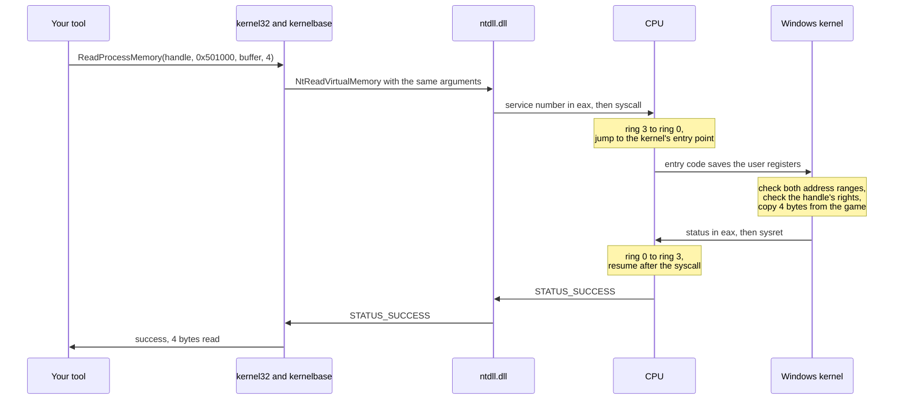
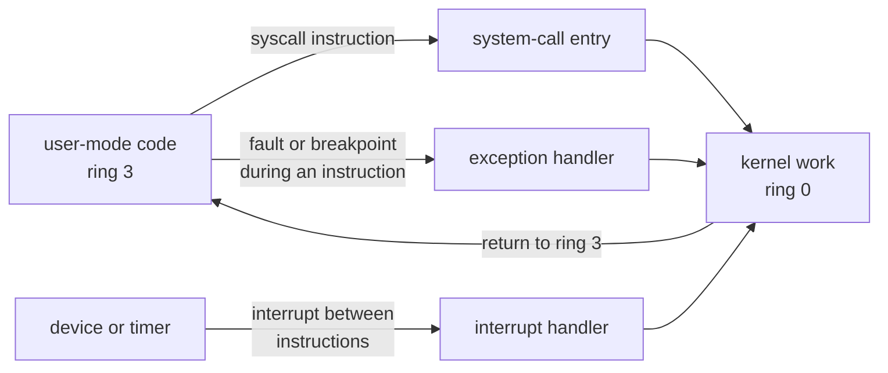
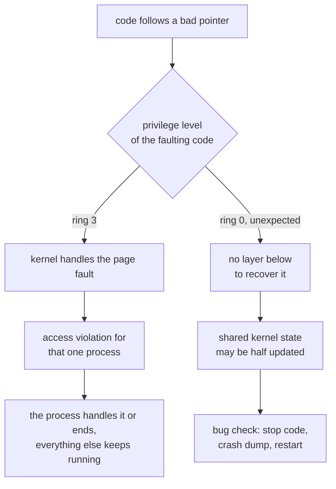

import MemoryStrip from '../../../../components/MemoryStrip.astro';
import Quiz from '../../../../components/Quiz.astro';

Every tool in this book has asked Windows for something: a handle to a game, a
copy of four bytes, a list of loaded modules. Each time, something checked
whether the tool was allowed to ask, did the work, and sometimes said no. That
something is the **kernel**: the core of the operating system, the one program
that runs with the processor's full authority, and the one every other program
must go through to reach anything shared, such as another process's memory, the
disk, the screen, or the network card.

This lesson answers four questions. How does the processor keep ordinary
programs away from the kernel's powers? How does a program ask the kernel for
something anyway? What does the kernel do with its authority? And why can one
kernel bug stop the whole computer, when a bug in a game only ends the game?

## Two modes, enforced by the processor

The kernel and a game run on the same processor, often on the same core, taking
turns many times a second. What stops the game from doing what the kernel does:
rewriting another process's memory, reprogramming the disk controller, or
simply never giving the processor back?

A rule written only in software could not stop it. If the kernel's protections
were ordinary code and data, the program being restricted could overwrite them,
the same way a debugger overwrites an instruction with a breakpoint. The rule
has to live somewhere the restricted program cannot reach, and the only such
place is the processor itself.

So the processor tracks a **privilege level** for the code it is running, and
it checks every instruction and every memory access against that level. x86
processors define four levels, numbered 0 to 3 and usually drawn as nested
**rings**, with ring 0 the most privileged. Windows uses two of them:

- **kernel mode**, ring 0, for the kernel and drivers;
- **user mode**, ring 3, for everything else: games, browsers, debuggers, and
  every tool in this book.

[Lesson 10.7](/pages/10/07/) introduced the two modes as permission levels.
This section shows where the processor keeps the level and what it refuses to
do at ring 3.

### The current level is two bits of a register

The level lives in the lowest two bits of the `cs` register, which tells the
processor which code segment it is running. Two bits can hold 2 × 2 = 4
patterns, `00`, `01`, `10`, and `11`, which is exactly why there are four
rings.

Open any 64-bit program in x64dbg and the register panel shows `cs` as `0033`:

<MemoryStrip
  cells="bit 7=0|bit 6=0|bit 5=1|bit 4=1|bit 3=0|bit 2=0|bit 1=1|bit 0=1"
  marks="6-7"
  groups="0-3:hex `3`|4-7:hex `3`"
  groups2="0-5:which code segment|6-7:level `11` = 3"
  caption="`cs` = `0x33` in a 64-bit program. The upper bits choose a code segment; the lowest two bits are the current privilege level."
/>

`0x33` is 3 × 16 + 3 = 51. Each hex digit stands for four bits, so `0x33` is
`0011 0011`. Its lowest two bits are `11`, which is 2 + 1 = 3: ring 3, user
mode. The kernel's own code segment is `0x10`, which is `0001 0000`; its lowest
two bits are `00`, ring 0.

A program cannot promote itself by loading `0x10` into `cs`. The processor
refuses any change of code segment that would raise the privilege level, except
through a few entry points that the kernel prepared in advance. The most
important of those entry points is the subject of the next section.

<Quiz
  id="kernel-cs-privilege-bits"
  title="Read the privilege level"
  prompt="A 32-bit game running on 64-bit Windows shows `cs` = `0023` in x64dbg. At which privilege level is its code running?"
  options="Ring 0, because `0x23` is smaller than the 64-bit value `0x33`||Ring 3, because `0x23` is `0010 0011` and its lowest two bits are `11`||Ring 2, because `0x23` begins with the digit 2||The value of `cs` says nothing about privilege"
  answer="1"
  explanation="Only the lowest two bits of `cs` hold the privilege level. `0x23` is 2 × 16 + 3 = 35, or `0010 0011` in binary, and its lowest two bits are `11` = 3. The upper bits pick a different code segment (a 32-bit one), but the level is still ring 3, user mode."
/>

### What ring 3 is not allowed to do

At ring 3 the processor refuses two kinds of thing.

**Privileged instructions.** Some instructions only make sense for whoever runs
the machine. `hlt` stops the processor until the next interrupt. `cli` turns
interrupts off, which would silence the timer the kernel relies on to take the
processor back. `mov cr3, rax` switches to a different set of page tables,
which means a different process's whole view of memory
([Lesson 11.6](/pages/11/06/)). `wrmsr` rewrites the processor's internal
settings. At ring 3, each of these raises a **general-protection fault**
instead of running, and the kernel turns the fault into an exception that
normally ends the program.

**Memory marked for the kernel.** Every page-table entry carries a
**user/supervisor** bit, bit 2. When that bit is 0, the page is a supervisor
page, and any access from ring 3 causes a page fault, even though the address
is valid and the page is present. [Lesson 11.7](/pages/11/07/) said that the low
twelve bits of an entry hold flags. Here is the lowest byte of an entry for an
ordinary user page:

<MemoryStrip
  cells="bit 7=0|bit 6=1|bit 5=1|bit 4=0|bit 3=0|bit 2=1|bit 1=1|bit 0=1"
  marks="5"
  groups="1-1:dirty|2-2:accessed|5-5:user|6-6:write|7-7:present"
  caption="The lowest byte of a page-table entry for a user page, `0x67`."
/>

`0x67` is 6 × 16 + 7 = 103, and 103 = 64 + 32 + 4 + 2 + 1, so bits 6, 5, 2, 1,
and 0 are set. Bit 0 says the page is present, bit 1 that it may be written,
and bit 2 that ring 3 may use it. The processor itself sets bit 5, *accessed*,
the first time the page is used, and bit 6, *dirty*, the first time it is
written. Bits 3, 4, and 7 control caching and are 0 here.

A page that holds kernel data looks almost the same:

<MemoryStrip
  cells="bit 7=0|bit 6=1|bit 5=1|bit 4=0|bit 3=0|bit 2=0|bit 1=1|bit 0=1"
  marks="5"
  groups="1-1:dirty|2-2:accessed|5-5:user = 0|6-6:write|7-7:present"
  caption="The same byte for a kernel page, `0x63`. Only bit 2 differs, so ring 3 is refused."
/>

`0x67` − `0x63` = 4, and 4 = 2², so exactly one bit differs: bit 2. Windows
maps its own code and data into the upper half of every 64-bit process's
address space, from `0xFFFF_8000_0000_0000` upward, with bit 2 cleared on every
one of those pages. The pages are present in the game's page tables; the game
simply cannot touch them.

Put the two checks together and user-mode code is boxed in. It cannot run the
instructions that change the rules, and it cannot touch the memory where the
rules are kept, including the page tables themselves.

## A system call is the only way in

If ring 3 cannot touch kernel memory or raise its own level, how does
`ReadProcessMemory` ever reach code that can read another process? Through a
**system call**: an instruction that switches the processor to ring 0 and jumps
to an address the kernel chose. On x86-64 the instruction is `syscall`. When
the processor executes it, it:

1. copies the address of the next instruction into `rcx` and the flags register
   into `r11`, so the kernel can come back later;
2. switches the privilege level to 0;
3. jumps to an address held in a processor setting that only ring 0 can change.
   The kernel wrote that address during boot, using `wrmsr`.

Step 3 is what makes the design safe. A program chooses *when* to enter the
kernel, never *where*. It cannot land in the middle of a kernel function and
skip the checks at its start, because every system call from every program
arrives at the same kernel entry point, and the code there inspects the request
before doing anything with it.

## Follow one call into the kernel and back

Take a read like the ones in [Lesson 10.3](/pages/10/03/): a handle to the game
opened with only query and read rights, and a request for 4 bytes at address
`0x0050_1000`. Here is the whole round trip:



### Inside your process

`ReadProcessMemory` in `kernel32.dll` forwards to `kernelbase.dll`
([Lesson 10.7](/pages/10/07/)), which calls `NtReadVirtualMemory` in
`ntdll.dll` with the same arguments. The `ntdll` function is a **stub**: a few
instructions whose only job is to make the system call. On 64-bit Windows its
core is four instructions:

```text
mov r10, rcx        ; the first argument moves out of rcx
mov eax, <number>   ; the system service number: which kernel routine to run
syscall             ; enter the kernel
ret                 ; back to kernelbase, with the status in eax
```

The first line exists because of step 1 above. The Windows x64 calling
convention passes a function's first argument in `rcx`, but `syscall`
overwrites `rcx` with the return address, so the stub moves the argument to
`r10` first, and the kernel knows to look for it there.

The number in `eax` is a **system service number**, an index into the kernel's
table of routines. The numbers are internal to Windows and change between
builds, which is why this book never copies one into a program. In a debugger
the stub also shows a test and a jump to an older entry instruction, `int 2Eh`,
that some configurations use; either way, the processor arrives at an address
the kernel chose.

### Crossing over

The kernel's entry code assumes that everything user mode handed it could be
hostile. It switches from the program's stack to a kernel stack that belongs to
the thread, because the program's stack pointer could point anywhere. It saves
the user registers so they can be put back exactly. Then it looks the service
number up in its table, rejects a number that is out of range, and calls the
kernel's own `NtReadVirtualMemory`.

### Inside the kernel

Most of the kernel's work is checking.

**The address ranges must lie inside user space.** The request covers
`0x0050_1000` up to `0x0050_1000` + 4 = `0x0050_1004`, and the tool's buffer is
also a user address. Both are far below the top of user space, which is a
little under `0x0000_8000_0000_0000` on 64-bit Windows. A range that reached
into the kernel's half, or one long enough to run past the largest 64-bit
number and wrap around to a small address, would be rejected here. That is why
`ReadProcessMemory` cannot read kernel memory, whatever handle you hold.

**The handle must carry the right the operation needs.** The kernel finds the
handle in the tool's handle table and reads the rights granted when the handle
was opened. Reading needs `PROCESS_VM_READ`, which is `0x0010`. This handle was
opened with `PROCESS_QUERY_LIMITED_INFORMATION` and `PROCESS_VM_READ`, so its
rights are `0x1000` + `0x0010` = `0x1010`:

<MemoryStrip
  cells="15=0|14=0|13=0|12=1|11=0|10=0|9=0|8=0|7=0|6=0|5=0|4=1|3=0|2=0|1=0|0=0"
  marks="3|11"
  groups="0-3:hex `1`|4-7:hex `0`|8-11:hex `1`|12-15:hex `0`"
  groups2="3-3:query|10-10:write|11-11:read"
  caption="The handle's rights, `0x1010`, as sixteen bits. `0x1000` is 16³ = 4,096 = 2¹², so it is bit 12. `0x0010` is 16 = 2⁴, bit 4. Bit 5, the write right, is 0."
/>

The test is a single AND. The kernel keeps only the bits that are set in both
the handle's rights and the rights it needs, and allows the operation only if
every needed bit survived. `0x1010` AND `0x0010` = `0x0010`, the whole
requirement, so the read is allowed.

`WriteProcessMemory` needs `PROCESS_VM_WRITE`, `0x0020`. That is 2 × 16 = 32 =
2⁵, bit 5, and bit 5 of `0x1010` is 0, so `0x1010` AND `0x0020` = 0: denied,
whatever the tool's author intended. The rights were fixed when the handle was
created, and nothing done with the handle afterward can add to them.

**Only then does it copy.** The game's bytes are visible only through the
game's page tables, and the tool's buffer only through the tool's. So the
kernel briefly switches to the game's address space, reads the 4 bytes into
memory of its own, switches back, and writes them into the tool's buffer. Large
reads use a temporary kernel mapping of the game's pages instead, with the same
effect. If a page in the range is missing, the kernel copies what it can and
reports a partial result.

### Returning

The kernel places a status code in `rax` and executes `sysret`, the reverse of
`syscall`: the level drops back to 3, and execution resumes at the address saved
in `rcx`, which is the `ret` right after `syscall` in the stub.

The status is an **NTSTATUS**, a 32-bit code whose top two bits give its
severity: `00` success, `01` information, `10` warning, `11` error.
`STATUS_SUCCESS` is 0. `STATUS_ACCESS_DENIED` is `0xC000_0022`; hex `C` is
binary `1100`, so its top two bits are `11`, an error. `STATUS_PARTIAL_COPY` is
`0x8000_000D`; hex `8` is `1000`, so its top two bits are `10`, a warning,
because some of the bytes did arrive. `kernelbase.dll` translates the status
into a Win32 error code for `GetLastError`, 5 for access denied and 299 for a
partial copy, and reports success or failure to your tool.

:::note[A 32-bit game takes one extra hop]
The book's Windows labs are 32-bit programs. A 32-bit process on 64-bit Windows
has a 32-bit `ntdll.dll`, whose stubs cannot enter the 64-bit kernel directly.
Each stub hands its call to the **WoW64** layer (“Windows 32-bit on Windows
64-bit”), which switches the processor into 64-bit mode, widens every 32-bit
argument to 64 bits, and makes the same system call through the 64-bit
`ntdll.dll`. The two modes use different code segments, which is why `cs` reads
`0023` in a 32-bit program and `0033` in a 64-bit one.
:::

<Quiz
  id="kernel-handle-rights-and"
  title="Predict the kernel's answer"
  prompt="A tool opened a game with `PROCESS_QUERY_INFORMATION` (`0x0400`) and `PROCESS_QUERY_LIMITED_INFORMATION` (`0x1000`), so its handle's rights are `0x1400`. It calls `ReadProcessMemory`, which needs `PROCESS_VM_READ` (`0x0010`). What happens?"
  options="The kernel copies the bytes, because a handle that can query a process can also read it||The kernel refuses with `STATUS_ACCESS_DENIED`, because `0x1400` AND `0x0010` is 0||The processor raises a general-protection fault inside the tool||The read succeeds if the tool runs as administrator"
  answer="1"
  explanation="`0x0400` is 4 × 256 = 1,024 = 2¹⁰ (bit 10) and `0x1000` is 2¹² (bit 12), so `0x1400` has bits 12 and 10 set. The read needs bit 4, which is 0, so the AND is 0 and the kernel returns an error status. Nothing faults: the system call returns normally with `STATUS_ACCESS_DENIED`, and `kernelbase.dll` reports error 5. Running as administrator affects what `OpenProcess` may grant; it cannot add rights to a handle that already exists."
/>

## The kernel runs only when a door opens

A system call is one of three ways the processor ever enters the kernel. The
other two are **exceptions**, raised by the instruction that is running (a page
fault, a division by zero, the `int3` breakpoint), and **interrupts**, signals
from hardware that arrive between instructions whether or not the running
program expects them.



So the kernel is not a separate program running beside your game and watching
it. It is code that runs when one of these doors opens, on whichever core the
door opened on, and that returns when its work is done.

The processor finds exception and interrupt handlers through the **interrupt
descriptor table**, which the kernel fills in at boot. Each entry is chosen by
a one-byte **vector** number. One byte holds 2⁸ = 256 values, so the table has
at most 256 entries, numbered 0 to 255. The processor fixes the meaning of
vectors 0 to 31: vector 3 is the breakpoint exception that the byte `0xCC`,
`int3`, raises ([Lesson 2.3](/pages/2/03/)), vector 13 is the general-protection
fault, and vector 14 is the page fault. Devices are given vectors from 32 up.

## What the kernel does with its authority

### It schedules threads

A computer has a handful of processor cores and, at any moment, hundreds or
thousands of threads ([Lesson 10.6](/pages/10/06/) described ready, running,
and waiting threads). The kernel's **scheduler** decides which ready thread
runs on each core. It keeps the right to decide through a timer interrupt. By
default, Windows sets a timer to interrupt 64 times a second, once every
1,000 ÷ 64 = 15.625 milliseconds. Many games ask Windows for a faster timer so
that short waits end closer to on time.

At each tick, and whenever a running thread stops to wait for input, a lock, or
a timer, the scheduler can pick another thread. Changing threads is a **context
switch**: the kernel saves the old thread's registers into its context, loads
the new thread's registers, and, if the new thread belongs to a different
process, loads that process's top-level page-table address into `cr3`. The
program never sees the switch. Its registers come back exactly as they were.

### It manages every process's memory

Each process has its own page tables, and only the kernel writes them. When a
game allocates memory, the kernel often records only the reservation. The first
time the game touches one of the new pages, the processor finds no valid entry
and raises a page fault. The kernel picks a free physical page, fills it with
zeros so that no other process's old data can leak into it, writes the entry,
and runs the faulting instruction again. The game never sees the fault.
[Lesson 10.5](/pages/10/05/) looked at the result from outside, and
[Lesson 11.6](/pages/11/06/) walked the tables themselves.

### It handles interrupts

When a device needs attention, because a key was pressed, a disk transfer
finished, or a network packet arrived, it raises an interrupt. The processor
finishes its current instruction, saves where it was, enters ring 0 if it was
not there already, and runs the handler for that vector. The interrupted code,
kernel or user, resumes afterward as if nothing had happened. Handlers must be
short, because other work on that core waits while they run;
[Lesson 14.2](/pages/14/02/) shows how drivers split the work.

### It owns devices through drivers

No user program touches a device's hardware. Each device is owned by a
**driver**, kernel code that knows that one device's registers and rules, and
the kernel routes every request for the device through it. Lesson 14.2 follows
one request all the way down to the hardware.

### It enforces security checks

Every check in this lesson, the handle's rights and the address ranges alike,
runs in ring 0, because a check performed in user mode could be skipped by the
very program it restricts. The kernel also enforces the access tokens and
integrity levels from Lesson 10.3, the page protections from Lesson 10.5, and
the signing rules that decide which drivers may load at all (Lesson 14.2).

## Why a kernel bug takes the whole machine down

When user-mode code follows a bad pointer, the processor raises a page fault
and the kernel handles it. The kernel checks its records, finds that nothing
valid lives at that address, and turns the fault into an access-violation
exception for that one process. The program's own handler, a debugger, or
Windows Error Reporting deals with it, and in the worst case one process ends.
The kernel is the safety net under every user-mode program.

Nothing sits under the kernel. Kernel code does catch faults it expects, such as
touching a user buffer that another thread may have freed; the system-call path
above does exactly that. But a driver that follows a bad pointer by mistake
raises a fault inside the kernel itself, and all kernel code and all drivers
share one address space and one set of data structures: the scheduler's lists,
the memory manager's page records, and the locks that guard them. The fault may
have struck halfway through updating one of those structures, with a lock still
held. The kernel cannot tell which of its own records are now wrong, and
carrying on could write corrupted data to disk. So Windows stops on purpose.



That deliberate stop is a **bug check**, better known as the blue screen.
Windows shows a stop code, such as `0x50` PAGE_FAULT_IN_NONPAGED_AREA or `0xD1`
DRIVER_IRQL_NOT_LESS_OR_EQUAL, writes a crash dump of the whole machine if it
can ([Lesson 10.8](/pages/10/08/) captured a dump of one process), and
restarts.

This is why the book keeps its experiments in user mode
([Lesson 11.5](/pages/11/05/)) and inside a virtual machine. A crash in a
user-mode lab ends one process, and even a bug check inside a virtual machine
stops only that virtual machine ([Lesson 14.3](/pages/14/03/)).

## Why some anti-cheat runs a kernel component

Anti-cheat software exists to notice when another program interferes with a
game. If the anti-cheat runs in user mode, it has exactly the same privilege as
the cheat it is looking for. Each can open the other, read the other's memory,
and patch the other's code; whichever acts last wins, and neither can trust
what the other reports. With equal privilege, neither side can have the final
word.

A kernel component changes that balance. Running in ring 0 lets it use
documented Windows facilities that user-mode code cannot reach:

- **process and image-load notifications**, so it learns about every new
  process and every DLL or driver as it loads, instead of scanning for them
  afterward;
- **handle-operation callbacks**, which run while another process opens a handle
  to the game and may remove rights from the request. A tool that asks for read
  and write rights can receive a handle without them, and its
  `ReadProcessMemory` then fails at exactly the rights check traced above;
- a view of loaded drivers and system state that user-mode code cannot quietly
  alter.

The costs are the other half of this lesson. Anti-cheat code in the kernel has
the same authority as the rest of the kernel, so its bugs become bug checks on
players' machines, and a vulnerability in it becomes a vulnerability in every
machine it is installed on. It asks players to trust a game company with ring-0
code. And it does not end the contest. Cheat developers followed it down with
drivers of their own, with hypervisors running beneath the whole operating
system, and with hardware that reads memory without asking the processor
([Lesson 11.6](/pages/11/06/)). Each lower layer is harder for the layers above
it to observe, which is why Windows answered with driver-signing rules,
blocklists of vulnerable drivers, and memory integrity, covered in the next two
lessons. This book studies those mechanisms as defenses and builds none of the
attacks.

References: [User mode and kernel mode](https://learn.microsoft.com/en-us/windows-hardware/drivers/gettingstarted/user-mode-and-kernel-mode), [process security and access rights](https://learn.microsoft.com/en-us/windows/win32/procthread/process-security-and-access-rights), [using NTSTATUS values](https://learn.microsoft.com/en-us/windows-hardware/drivers/kernel/using-ntstatus-values), [bug check code reference](https://learn.microsoft.com/en-us/windows-hardware/drivers/debugger/bug-check-code-reference2), [`ObRegisterCallbacks`](https://learn.microsoft.com/en-us/windows-hardware/drivers/ddi/wdm/nf-wdm-obregistercallbacks), and the [Intel Software Developer Manuals](https://www.intel.com/content/www/us/en/developer/articles/technical/intel-sdm.html) for `syscall`, privilege levels, and page-table bits.
