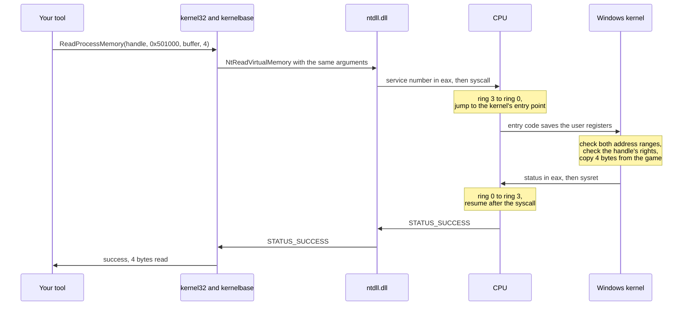
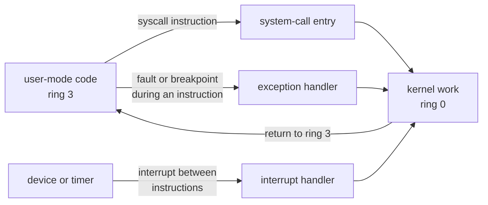
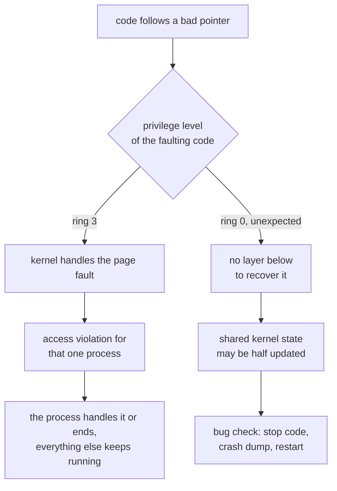

Every tool in this book has asked Windows for something: a handle to a game, a
copy of four bytes, a list of loaded modules. Each time, something checked
whether the tool was allowed to ask, did the work, and sometimes said no. That
something is the **kernel**: the core of the operating system, the one program
that runs with the processor's full authority, and the one every other program
must go through to reach anything shared, such as another process's memory, the
disk, the screen, or the network card.

This lesson answers four questions. How does the processor keep ordinary
programs away from the kernel's powers? How does a program ask the kernel for
something anyway? What does the kernel do with its authority? And why can one
kernel bug stop the whole computer, when a bug in a game only ends the game?
Each answer gets one clear example here, and [Lesson 14.7](/pages/14/07/)
comes back later to read the exact bits the processor checks and to follow one
request through the kernel a layer at a time.

## Two modes, enforced by the processor

The kernel and a game run on the same processor, often on the same core, taking
turns many times a second. What stops the game from doing what the kernel does:
rewriting another process's memory, reprogramming the disk controller, or
simply never giving the processor back?

A rule written only in software could not stop it. If the kernel's protections
were ordinary code and data, the program being restricted could overwrite them,
the same way a debugger overwrites an instruction with a breakpoint. The rule
has to live somewhere the restricted program cannot reach, and the only such
place is the processor itself.

So the processor tracks a **privilege level** for the code it is running, and
it checks every instruction and every memory access against that level. x86
processors define four levels, numbered 0 to 3 and usually drawn as nested
**rings**, with ring 0 the most privileged. Windows uses two of them:

- **kernel mode**, ring 0, for the kernel and drivers;
- **user mode**, ring 3, for everything else: games, browsers, debuggers, and
  every tool in this book.

[Lesson 10.7](/pages/10/07/) introduced the two modes as permission levels. The
processor records the current level in two bits of one of its registers, which
[Lesson 14.7](/pages/14/07/#the-current-level-is-two-bits-of-a-register) reads
in a debugger. What matters here is what the processor refuses to do while the
level is 3.

### What ring 3 is not allowed to do

At ring 3 the processor refuses two kinds of thing.

**Privileged instructions.** Some instructions only make sense for whoever runs
the machine. `hlt` stops the processor until the next interrupt. `cli` turns
interrupts off, which would silence the timer the kernel relies on to take the
processor back. `mov cr3, rax` switches to a different set of page tables,
which means a different process's whole view of memory
([Lesson 11.6](/pages/11/06/)). `wrmsr` rewrites the processor's internal
settings. At ring 3, each of these raises a **general-protection fault**
instead of running, and the kernel turns the fault into an exception that
normally ends the program.

**Memory marked for the kernel.** Every page-table entry carries a
**user/supervisor** bit, bit 2. When that bit is 0, the page is a supervisor
page, and any access from ring 3 causes a page fault, even though the address
is valid and the page is present. Windows maps its own code and data into the
upper half of every 64-bit process's address space, from
`0xFFFF_8000_0000_0000` upward, and clears bit 2 on every one of those pages.
The kernel can share an address space with the game, and the game still cannot
touch it. [Lesson 14.7](/pages/14/07/#one-bit-marks-a-page-as-the-kernels)
compares the flag bits of a user page and a kernel page.

Put the two checks together and user-mode code is boxed in. It cannot run the
instructions that change the rules, and it cannot touch the memory where the
rules are kept, including the page tables themselves.

## A system call is the only way in

If ring 3 cannot touch kernel memory or raise its own level, how does
`ReadProcessMemory` ever reach code that can read another process? Through a
**system call**: an instruction that switches the processor to ring 0 and jumps
to an address the kernel chose. On x86-64 the instruction is `syscall`. When
the processor executes it, it:

1. copies the address of the next instruction into `rcx` and the flags register
   into `r11`, so the kernel can come back later;
2. switches the privilege level to 0;
3. jumps to an address held in a processor setting that only ring 0 can change.
   The kernel wrote that address during boot, using `wrmsr`.

Step 3 is what makes the design safe. A program chooses *when* to enter the
kernel, never *where*. It cannot land in the middle of a kernel function and
skip the checks at its start, because every system call from every program
arrives at the same kernel entry point, and the code there inspects the request
before doing anything with it.

## Follow one call into the kernel and back

Take a read like the ones in [Lesson 10.3](/pages/10/03/): a handle to the game
opened with only query and read rights, and a request for 4 bytes at address
`0x0050_1000`. Here is the whole round trip:

Your tool's call passes through `kernel32.dll` and `kernelbase.dll`, the layers
that [Lesson 10.7](/pages/10/07/) followed down the stack, to
`NtReadVirtualMemory` in `ntdll.dll`. That function is only a few instructions
long: it puts a **service number**, which tells the kernel which of its
routines to run, into the `eax` register, and executes `syscall`.

On the other side, the kernel's entry code moves onto a stack of its own and
saves your registers. Then the kernel's own `NtReadVirtualMemory` checks the
request before touching anything. Both address ranges, the 4 bytes in the game
and your tool's buffer, must lie in user space, which is why
`ReadProcessMemory` can never read kernel memory, whatever handle you hold. And
the handle must carry the right the operation needs: `PROCESS_VM_READ` for a
read, which this handle has, or `PROCESS_VM_WRITE` for a write, which it lacks.
A handle's rights are fixed when it is opened, and nothing done with it
afterward can add one.

Only then does the kernel copy the 4 bytes into your buffer. It puts a status
code in `eax`, here `STATUS_SUCCESS`, which is 0, and executes `sysret`, the
reverse of `syscall`, which drops the level back to 3 and resumes your thread
after its `syscall`. On a failure, `kernelbase.dll` turns the status into the
error number that `GetLastError` reports, such as 5 for access denied.
[Lesson 14.7](/pages/14/07/#the-same-call-one-layer-at-a-time) follows each
step with the values involved, including the arithmetic of the rights check.

## The kernel runs only when a door opens

A system call is one of three ways the processor ever enters the kernel. The
other two are **exceptions**, raised by the instruction that is running (a page
fault, a division by zero, the `int3` breakpoint), and **interrupts**, signals
from hardware that arrive between instructions whether or not the running
program expects them.

So the kernel is not a separate program running beside your game and watching
it. It is code that runs when one of these doors opens, on whichever core the
door opened on, and that returns when its work is done.

The processor finds exception and interrupt handlers through the **interrupt
descriptor table**, which the kernel fills in at boot. Each entry is chosen by
a one-byte **vector** number. One byte holds 2⁸ = 256 values, so the table has
at most 256 entries, numbered 0 to 255. The processor fixes the meaning of
vectors 0 to 31: vector 3 is the breakpoint exception that the byte `0xCC`,
`int3`, raises ([Lesson 2.3](/pages/2/03/)), vector 13 is the general-protection
fault, and vector 14 is the page fault. Devices are given vectors from 32 up.

## What the kernel does with its authority

### It schedules threads

A computer has a handful of processor cores and, at any moment, hundreds or
thousands of threads ([Lesson 10.6](/pages/10/06/) described ready, running,
and waiting threads). The kernel's **scheduler** decides which ready thread
runs on each core. It keeps the right to decide through a timer interrupt. By
default, Windows sets a timer to interrupt 64 times a second, once every
1,000 ÷ 64 = 15.625 milliseconds. Many games ask Windows for a faster timer so
that short waits end closer to on time.

At each tick, and whenever a running thread stops to wait for input, a lock, or
a timer, the scheduler can pick another thread. Changing threads is a **context
switch**: the kernel saves the old thread's registers into its context, loads
the new thread's registers, and, if the new thread belongs to a different
process, loads that process's top-level page-table address into `cr3`. The
program never sees the switch. Its registers come back exactly as they were.

### It manages every process's memory

Each process has its own page tables, and only the kernel writes them. When a
game allocates memory, the kernel often records only the reservation. The first
time the game touches one of the new pages, the processor finds no valid entry
and raises a page fault. The kernel picks a free physical page, fills it with
zeros so that no other process's old data can leak into it, writes the entry,
and runs the faulting instruction again. The game never sees the fault.
[Lesson 10.5](/pages/10/05/) looked at the result from outside, and
[Lesson 11.6](/pages/11/06/) walked the tables themselves.

### It handles interrupts

When a device needs attention, because a key was pressed, a disk transfer
finished, or a network packet arrived, it raises an interrupt. The processor
finishes its current instruction, saves where it was, enters ring 0 if it was
not there already, and runs the handler for that vector. The interrupted code,
kernel or user, resumes afterward as if nothing had happened. Handlers must be
short, because other work on that core waits while they run;
[Lesson 14.2](/pages/14/02/) shows how drivers split the work.

### It owns devices through drivers

No user program touches a device's hardware. Each device is owned by a
**driver**, kernel code that knows that one device's registers and rules, and
the kernel routes every request for the device through it. Lesson 14.2 follows
one request all the way down to the hardware.

### It enforces security checks

Every check in this lesson, the handle's rights and the address ranges alike,
runs in ring 0, because a check performed in user mode could be skipped by the
very program it restricts. The kernel also enforces the access tokens and
integrity levels from Lesson 10.3, the page protections from Lesson 10.5, and
the signing rules that decide which drivers may load at all (Lesson 14.2).

## Why a kernel bug takes the whole machine down

When user-mode code follows a bad pointer, the processor raises a page fault
and the kernel handles it. The kernel checks its records, finds that nothing
valid lives at that address, and turns the fault into an access-violation
exception for that one process. The program's own handler, a debugger, or
Windows Error Reporting deals with it, and in the worst case one process ends.
The kernel is the safety net under every user-mode program.

Nothing sits under the kernel. Kernel code does catch faults it expects, such as
touching a user buffer that another thread may have freed; the copy behind
`ReadProcessMemory` is written to catch exactly those. But a driver that follows
a bad pointer by mistake raises a fault inside the kernel itself, and all
kernel code and all drivers share one address space and one set of data
structures: the scheduler's lists, the memory manager's page records, and the
locks that guard them. The fault may have struck halfway through updating one
of those structures, with a lock still held. The kernel cannot tell which of
its own records are now wrong, and carrying on could write corrupted data to
disk. So Windows stops on purpose.

That deliberate stop is a **bug check**, better known as the blue screen.
Windows shows a stop code, such as `0x50` PAGE_FAULT_IN_NONPAGED_AREA or `0xD1`
DRIVER_IRQL_NOT_LESS_OR_EQUAL, writes a crash dump of the whole machine if it
can ([Lesson 10.8](/pages/10/08/) captured a dump of one process), and
restarts.

This is why the book keeps its experiments in user mode
([Lesson 11.5](/pages/11/05/)) and inside a virtual machine. A crash in a
user-mode lab ends one process, and even a bug check inside a virtual machine
stops only that virtual machine ([Lesson 14.3](/pages/14/03/)).

## Why some anti-cheat runs a kernel component

Anti-cheat software exists to notice when another program interferes with a
game. If the anti-cheat runs in user mode, it has exactly the same privilege as
the cheat it is looking for. Each can open the other, read the other's memory,
and patch the other's code; whichever acts last wins, and neither can trust
what the other reports. With equal privilege, neither side can have the final
word.

A kernel component changes that balance. Running in ring 0 lets it use
documented Windows facilities that user-mode code cannot reach:

- **process and image-load notifications**, so it learns about every new
  process and every DLL or driver as it loads, instead of scanning for them
  afterward;
- **handle-operation callbacks**, which run while another process opens a handle
  to the game and may remove rights from the request. A tool that asks for read
  and write rights can receive a handle without them, and its
  `ReadProcessMemory` then fails at exactly the rights check described above;
- a view of loaded drivers and system state that user-mode code cannot quietly
  alter.

The costs are the other half of this lesson. Anti-cheat code in the kernel has
the same authority as the rest of the kernel, so its bugs become bug checks on
players' machines, and a vulnerability in it becomes a vulnerability in every
machine it is installed on. It asks players to trust a game company with ring-0
code. And it does not end the contest. Cheat developers followed it down with
drivers of their own, with hypervisors running beneath the whole operating
system, and with hardware that reads memory without asking the processor
([Lesson 11.6](/pages/11/06/)). Each lower layer is harder for the layers above
it to observe, which is why Windows answered with driver-signing rules,
blocklists of vulnerable drivers, and memory integrity, covered in the next two
lessons. This book studies those mechanisms as defenses and builds none of the
attacks.

References: [User mode and kernel mode](https://learn.microsoft.com/en-us/windows-hardware/drivers/gettingstarted/user-mode-and-kernel-mode), [process security and access rights](https://learn.microsoft.com/en-us/windows/win32/procthread/process-security-and-access-rights), [bug check code reference](https://learn.microsoft.com/en-us/windows-hardware/drivers/debugger/bug-check-code-reference2), and [`ObRegisterCallbacks`](https://learn.microsoft.com/en-us/windows-hardware/drivers/ddi/wdm/nf-wdm-obregistercallbacks).
