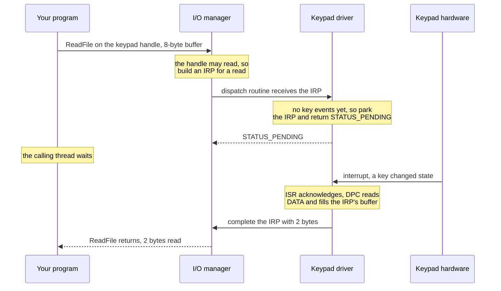
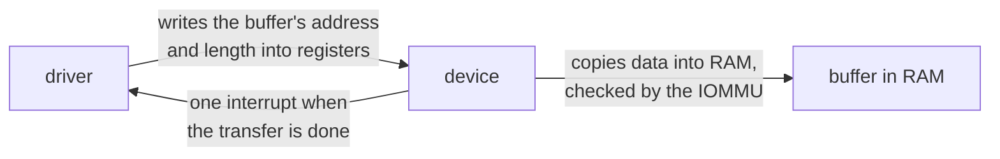
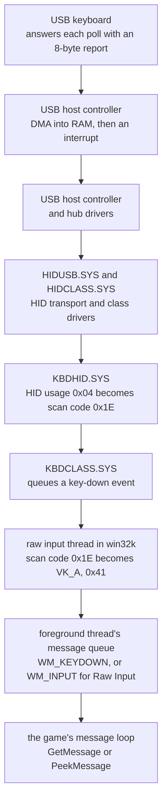

import MemoryStrip from '../../../../components/MemoryStrip.astro';

[Lesson 14.1](/pages/14/01/) said that no user program touches hardware.
Something has to, though. When you press a key, bytes arrive from a keyboard;
when a game loads a level, a disk controller delivers the file. The code that
operates each device is its **device driver**: kernel code that owns one kind
of device, knows that device's registers and rules, and is the only software
allowed to work it. Windows drivers are `.sys` files in the same PE format as
programs and DLLs (Chapter 7), loaded into the kernel's half of memory.

This lesson follows one request from a program down to a device and back,
looks at how a driver talks to hardware through registers and interrupts,
traces a key press from a USB keyboard to a game, and ends with why Windows is
strict about which drivers it will load. Everything here stays conceptual.
[Lesson 14.8](/pages/14/08/) comes back later to decode the same requests and
registers bit by bit, and its lab runs a pretend device and driver as an
ordinary user-mode program.

## Why the kernel owns every device

Suppose two programs could drive the same disk controller directly. One writes
the number of the sector it wants; a microsecond later the other overwrites it
with a different sector; the first program receives the wrong data. Worse, a
program could point the controller's copying engine at another process's
memory. Devices hold state that everyone shares, and many can reach memory that
belongs to anyone ([Lesson 11.6](/pages/11/06/)), so the operating system
cannot let programs work them directly.

Instead, one driver owns each device. The kernel sends it every request for
that device, each one already checked, and the driver is the only code that
reads or writes the device's registers.

Windows represents each device as a **device object**, and several drivers can
stack on one device:

- a **bus driver** talks to the bus the device is plugged into, such as USB or
  PCI Express;
- a **function driver** knows the device itself and does the real work;
- optional **filter drivers** watch or adjust requests on their way past.

A request enters at the top of this **driver stack**, and each driver either
handles it or passes it to the driver below.

## A request's path from a program to a device

A program cannot call a function inside a driver, because the driver lives in
ring 0. Instead, the program opens the device much like a file, receives a
handle, and makes requests through two general-purpose calls:

- `ReadFile` and `WriteFile` move data from or to the device;
- `DeviceIoControl` sends a numbered command, a **control code**, for anything
  that is not simply reading or writing, along with an input buffer and an
  output buffer.

Both travel the system-call path from Lesson 14.1, through `kernelbase.dll`,
`ntdll.dll`, and `syscall`, and arrive at the kernel's **I/O manager**, the
part of the kernel that runs every device request. The I/O manager checks the
handle and then describes the request in an **I/O request packet**, or
**IRP**: a kernel data structure that serves as the request's work order. It
names the operation, carries the parameters and buffers, travels down the
driver stack, and comes back up carrying the result.

Here is a read from this lesson's toy keypad, a simple imaginary device that
the lab in Lesson 14.8 simulates, made before any key has been pressed:

The driver's **dispatch routine** is the function the I/O manager calls with a
new IRP. If the dispatch routine can finish at once, it **completes** the IRP,
handing it back with a status and a byte count. If it has to wait for the
hardware, it keeps the IRP, returns `STATUS_PENDING`, and completes the IRP
later, from the code that runs when the device interrupts. Meanwhile the
program's thread waits inside `ReadFile`.

A `DeviceIoControl` request is checked twice. Each control code declares the
rights that the caller's handle must hold, and the I/O manager refuses a
request from a handle without them before the driver ever runs. The IRP also
records that the request came from user mode, so the driver must treat every
parameter as untrusted: it compares the whole control code with the ones it
defines, and it never writes more bytes than the request says the caller's
buffer can hold. [Lesson 14.8](/pages/14/08/#a-control-code-is-four-fields-in-one-number)
unpacks a control code into its four fields.

## Registers: how a driver talks to hardware

A device exposes a small set of **registers**: storage locations inside the
device that software reads to learn the device's state and writes to give it
commands. On a modern PC most devices expose their registers through
**memory-mapped I/O**: the registers answer to a range of *physical* addresses,
as if they were memory. When the processor reads or writes one of those
addresses, the access goes to the device instead of to RAM. The driver asks the
kernel to map that physical range into kernel virtual addresses, and then reads
and writes it with ordinary load and store instructions. x86 also has an older
mechanism, **port I/O**, with its own `in` and `out` instructions; the classic
PS/2 keyboard controller answers at ports `0x60` and `0x64`.

The toy keypad, modeled loosely on that PS/2 controller, has four registers,
each 4 bytes wide, one after another:

<MemoryStrip
  cells="+0x00=CONTROL|+0x04=STATUS|+0x08=DATA|+0x0C=ACK"
  groups="0-0:driver writes|1-2:driver reads|3-3:driver writes"
  caption="The toy keypad's register block. Each register is 4 bytes, so each one starts 4 bytes after the last (`0x0C` is 12) and the block fills 4 × 4 = 16 bytes."
/>

- **CONTROL** is where the driver switches the device on and allows it to
  interrupt.
- **STATUS** tells the driver whether key events are waiting, and how many.
- **DATA** holds the event at the front of the device's queue: a **scan code**,
  a number that names a physical key position, plus whether that key was
  pressed or released. The A key's scan code is `0x1E`.
- **ACK** is where the driver tells the device that its interrupt has been
  handled.

Two of these registers break the rule that reading memory changes nothing.
Reading DATA removes the event it returns, so the next read returns the next
event, and a tool that read DATA “just to look” would silently swallow a key
press. STATUS can change between two reads with no instruction in between,
because the device changes it. So register accesses are never cached, merged,
or skipped: the kernel maps device memory as uncacheable, and drivers use
dedicated read-register and write-register routines that the compiler must
carry out exactly as written.
[Lesson 14.8](/pages/14/08/#the-toy-keypads-registers-bit-by-bit) places the
four registers at a physical address and decodes every bit in them.

## Interrupts: how a device gets the driver's attention

The driver could read STATUS over and over until an event appears. That is
**polling**, and it wastes a processor core on a device that sits idle almost
all the time. Instead, the keypad raises an **interrupt**, a hardware signal
that makes the processor stop between two instructions and run the handler the
kernel registered for that device's vector ([Lesson 14.1](/pages/14/01/)).

A driver's interrupt handling comes in two halves:

- The **interrupt service routine**, or **ISR**, runs immediately, while other
  work on that core waits, so it does the minimum. It reads STATUS to confirm
  the interrupt really came from its device, because several devices can share
  one interrupt line; writes ACK so the device lowers the line; and queues the
  second half.
- The **deferred procedure call**, or **DPC**, runs moments later at a lower
  priority, with interrupts enabled again. It does the real work: it drains the
  events, fills the waiting IRP's buffer, and completes the IRP.

For a press and release of A, the DPC collects two events, *A pressed* and *A
released*, and completes the parked read with those 2 bytes. The I/O manager
copies them into the program's buffer and wakes its thread, and `ReadFile`
returns. [Lesson 14.8](/pages/14/08/#the-isr-and-the-dpc-register-by-register)
follows both halves register by register.

## DMA: letting the device copy the data itself

Registers suit a keypad, which delivers a byte now and then. A disk or a
network card moves megabytes, and fetching them one register read at a time
would keep a core busy doing nothing but copying. Such devices use **direct
memory access**, or **DMA**: the driver tells the device where a buffer is and
how big it is, the device copies the data straight into or out of RAM, and it
interrupts once when the whole transfer is done.

The address the driver gives the device is not a virtual address, because a
device has no access to any process's page tables. It is a physical address or,
on a machine with an **IOMMU**, a device address that the IOMMU translates and
limits to the buffers the driver approved. [Lesson 11.6](/pages/11/06/)
explains that translation and why Windows uses it to stop a malicious device
from reading all of memory.

## A key press, from a USB keyboard to a game

A real keyboard is more complicated than the toy keypad, but every layer it
passes through is a device, a driver, or a queue from this lesson.
[Lesson 1.2](/pages/1/02/) drew four layers between your code and the keyboard.
Here are the layers inside that picture, for a USB keyboard on a modern PC:

A USB device never speaks first. The host controller asks each device for news
on a fixed schedule, and a keyboard asked 125 times a second is asked every
1,000 ÷ 125 = 8 milliseconds; many gaming keyboards are asked every
millisecond. The keyboard answers with a **HID report** (HID, *human interface
device*, is the USB standard for keyboards, mice, and controllers), which lists
the keys held down at that moment by their HID **usage** numbers. A is usage
`0x04`.

The host controller writes the report into RAM by DMA and interrupts, and the
report climbs the driver stack. The keyboard mapper driver, `KBDHID.SYS`,
converts usage `0x04` into scan code `0x1E`, the numbering that Windows
keyboard drivers have used since PS/2 keyboards, and the keyboard class driver,
`KBDCLASS.SYS`, queues a key-down event.

The **raw input thread**, inside `win32k`, the kernel part of the Windows window
manager, reads those events. It translates the scan code into a **virtual-key
code** using the active keyboard layout, updates the key-state table that
`GetAsyncKeyState` reads ([Lesson 8.6](/pages/8/06/)), and posts the event to
the message queue of the thread that owns the foreground window. On a US
layout, scan code `0x1E` becomes `VK_A`, `0x41`, which is also the ASCII code
for the letter A: 4 × 16 + 1 = 65. For security, Windows opens keyboards
exclusively for this thread, so an ordinary program cannot read keystrokes
straight from the keyboard's driver.

The game's message loop then takes the event out with `GetMessage` or
`PeekMessage`, as a `WM_KEYDOWN` message, or as `WM_INPUT` if the game
registered for Raw Input. [Lesson 14.8](/pages/14/08/#a-key-press-in-bytes)
reads the report and the message bit by bit. Synthetic input from `SendInput`
joins this path at the raw input thread, above every driver in the diagram,
which is why programs watching input at that level can tell it apart from key
presses that came through a keyboard.

## Why Windows insists on signed drivers

Loading a driver puts new code into ring 0, where, as Lesson 14.1 showed,
nothing sits beneath it to catch its mistakes and nothing can overrule it. So
Windows checks where a driver came from before loading it. 64-bit Windows
refuses kernel-mode code without a valid digital signature, the kind of
signature [Lesson 9.7](/pages/9/07/) checked on game files. Since Windows 10
version 1607, on a PC with Secure Boot on, a new driver must be signed by
Microsoft itself, through its hardware developer program, which requires the
publisher to prove its identity with an extended-validation certificate.
**Secure Boot** is the firmware check that allows only signed boot components
to start, which also keeps these rules from being relaxed before Windows is
running.

A signature answers two questions: who published this driver, and has it
changed since? It does not answer the question that matters most: is the code
safe? A correctly signed driver can still offer a control code that reads or
writes any memory for any caller, or forget to check a buffer length. Attackers
look for exactly those drivers, old and legitimately signed, and load one to
borrow its bug. Microsoft's answer is the **vulnerable driver blocklist**: a
list of signed drivers known to be exploitable, which Windows refuses to load.
Since the Windows 11 2022 update the blocklist is on by default, and it is
always enforced when memory integrity is on. [Lesson 14.3](/pages/14/03/)
explains memory integrity, which uses the hypervisor to stop even kernel code
from creating new executable code. [Lesson 11.5](/pages/11/05/) showed how to
list the drivers loaded on your own machine and why each new one deserves a
reason.

Developers testing their own drivers use test-signing modes that deliberately
relax these checks. Those modes belong on a disposable test machine, and this
book never uses them.

## Why a cheat driver endangers its own user

Some cheats for online games ship as drivers, on the theory that ring 0 sees
everything. Whatever such a driver does to a game, here is what it does to the
machine running it:

- **It runs with the kernel's full authority and comes from an anonymous
  author.** Its bugs become bug checks and corrupted files on the user's own
  computer, with no vendor, testing, or update process behind it.
- **It often comes with instructions to switch protections off**, such as
  Secure Boot, memory integrity, the vulnerable driver blocklist, or signature
  checks. Each of those protects the machine against all kernel malware, not
  only against cheats, and turning one off lowers the defense for everything.
- **Many rely on an old signed driver with a known bug** to reach ring 0. The
  bug cannot tell who is asking: while that driver is loaded, any other program
  on the machine can send the same control code and read or write kernel
  memory.
- **A kernel driver is the most powerful place malware can live.** Installing
  one from an anonymous seller hands that seller the whole computer: saved
  passwords, browser sessions, banking, and the power to hide further software.
- **Anti-cheat systems look for exactly these drivers**, and the penalties
  usually apply to the whole account, sometimes to the hardware.

The habits from Lesson 11.5 apply directly: know which drivers are installed,
give every new one a reason and a trustworthy source, and never lower a Windows
protection so that someone else's kernel code can load.

References: [example I/O request](https://learn.microsoft.com/en-us/windows-hardware/drivers/kernel/example-i-o-request---the-details), [security issues for I/O control codes](https://learn.microsoft.com/en-us/windows-hardware/drivers/kernel/security-issues-for-i-o-control-codes), [keyboard and mouse HID client drivers](https://learn.microsoft.com/en-us/windows-hardware/drivers/hid/keyboard-and-mouse-hid-client-drivers), [driver signing policy](https://learn.microsoft.com/en-us/windows-hardware/drivers/install/kernel-mode-code-signing-policy--windows-vista-and-later-), and [Microsoft recommended driver block rules](https://learn.microsoft.com/en-us/windows/security/application-security/application-control/app-control-for-business/design/microsoft-recommended-driver-block-rules).
