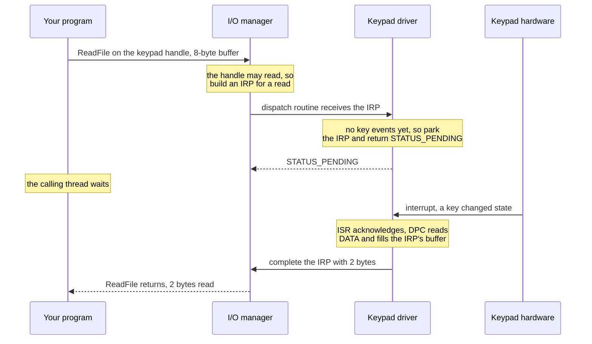
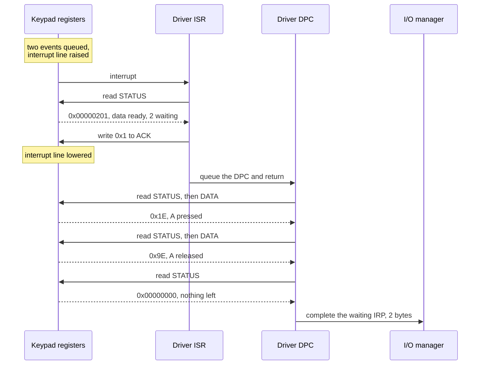
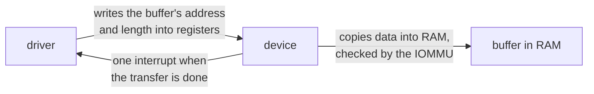
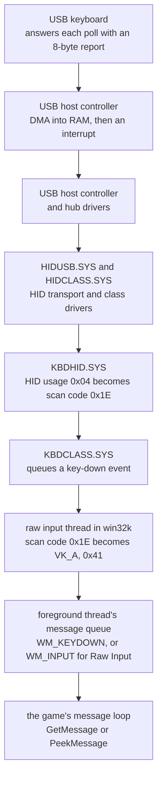

import MemoryStrip from '../../../../components/MemoryStrip.astro';
import Quiz from '../../../../components/Quiz.astro';

[Lesson 14.1](/pages/14/01/) said that no user program touches hardware.
Something has to, though. When you press a key, bytes arrive from a keyboard;
when a game loads a level, a disk controller delivers the file. The code that
operates each device is its **device driver**: kernel code that owns one kind
of device, knows that device's registers and rules, and is the only software
allowed to work it. Windows drivers are `.sys` files in the same PE format as
programs and DLLs (Chapter 7), loaded into the kernel's half of memory.

This lesson follows one request from a program down to a device and back,
looks at how a driver talks to hardware through registers and interrupts,
traces a key press from a USB keyboard to a game, and ends with why Windows is
strict about which drivers it will load. Everything stays conceptual or
simulated. The lab at the end is an ordinary user-mode program that pretends to
be a device and its driver.

## Why the kernel owns every device

Suppose two programs could drive the same disk controller directly. One writes
the number of the sector it wants; a microsecond later the other overwrites it
with a different sector; the first program receives the wrong data. Worse, a
program could point the controller's copying engine at another process's
memory. Devices hold state that everyone shares, and many can reach memory that
belongs to anyone ([Lesson 11.6](/pages/11/06/)), so the operating system
cannot let programs work them directly.

Instead, one driver owns each device. The kernel sends it every request for
that device, each one already checked, and the driver is the only code that
reads or writes the device's registers.

Windows represents each device as a **device object**, and several drivers can
stack on one device:

- a **bus driver** talks to the bus the device is plugged into, such as USB or
  PCI Express;
- a **function driver** knows the device itself and does the real work;
- optional **filter drivers** watch or adjust requests on their way past.

A request enters at the top of this **driver stack**, and each driver either
handles it or passes it to the driver below.

## A request's path from a program to a device

A program cannot call a function inside a driver, because the driver lives in
ring 0. Instead, the program opens the device much like a file, receives a
handle, and makes requests through two general-purpose calls:

- `ReadFile` and `WriteFile` move data from or to the device;
- `DeviceIoControl` sends a numbered command, a **control code**, for anything
  that is not simply reading or writing, along with an input buffer and an
  output buffer.

Both travel the system-call path from Lesson 14.1, through `kernelbase.dll`,
`ntdll.dll`, and `syscall`, and arrive at the kernel's **I/O manager**, the
part of the kernel that runs every device request. The I/O manager checks the
handle and then describes the request in an **I/O request packet**, or
**IRP**: a kernel data structure that serves as the request's work order. It
names the operation, carries the parameters and buffers, travels down the
driver stack, and comes back up carrying the result.

Here is a read from this lesson's toy keypad, a simple imaginary device that
the lab simulates, made before any key has been pressed:



The driver's **dispatch routine** is the function the I/O manager calls with a
new IRP. If the dispatch routine can finish at once, it **completes** the IRP,
handing it back with a status and a byte count. If it has to wait for the
hardware, it keeps the IRP, returns `STATUS_PENDING`, and completes the IRP
later, from the code that runs when the device interrupts. Meanwhile the
program's thread waits inside `ReadFile`.

A `DeviceIoControl` request carries more parameters. These are the parts of
its IRP that the keypad driver reads (Windows keeps some in the IRP itself and
some in a per-driver *stack location* attached to it):

<MemoryStrip
  column
  cells="operation=IRP_MJ_DEVICE_CONTROL|control code=0x80006004|output length=4 bytes|system buffer=kernel copy of the caller's buffer|requestor=user mode|status=set at completion|information=bytes returned"
  caption="What a driver reads from an IRP for a `DeviceIoControl` request. *Requestor* says the request came from user mode, so every parameter is untrusted."
/>

For most control codes the I/O manager uses **buffered I/O**: it copies the
caller's input into a kernel buffer, the *system buffer*, before the driver
runs, and copies the output back to the caller after completion. The driver
never touches the program's memory directly. It still has to respect the
lengths: the output length says how many bytes the caller's buffer can hold,
and writing even one byte more would overrun kernel memory.

### A control code is four fields in one number

A control code is a 32-bit number that packs four fields, built by a macro
called `CTL_CODE`:

- bits 16 to 31, the **device type**: values from `0x8000` up belong to
  hardware vendors, lower ones to Microsoft;
- bits 14 and 15, the **access** the caller's handle must hold: 0 for any, 1
  for read, 2 for write, 3 for both;
- bits 2 to 13, the **function** number: vendors use `0x800` and up;
- bits 0 and 1, the **method**, which says how buffers travel: 0 means
  buffered.

The toy keypad defines one control code, *get status*, with device type
`0x8000`, function `0x801`, the buffered method, and read access. Packing it
takes one shift per field:

- `0x8000` shifted left by 16 bits is `0x8000_0000`;
- the access value 1 shifted left by 14 bits is 2¹⁴ = 16,384 = `0x4000`;
- `0x801` shifted left by 2 bits is `0x801` × 4 = `0x2004`, because
  `0x800` × 4 = `0x2000` and 1 × 4 = 4;
- the method, 0, adds nothing.

`0x8000_0000` + `0x4000` + `0x2004` = `0x8000_6004`. The top half, `0x8000`, is
the device type, and the low half, `0x6004`, holds the other three fields:

<MemoryStrip
  cells="15=0|14=1|13=1|12=0|11=0|10=0|9=0|8=0|7=0|6=0|5=0|4=0|3=0|2=1|1=0|0=0"
  marks="0-1"
  groups="0-1:access `01`|2-13:function `1000 0000 0001` = `0x801`|14-15:method `00`"
  groups2="0-3:hex `6`|4-7:hex `0`|8-11:hex `0`|12-15:hex `4`"
  caption="The low 16 bits of the control code `0x8000_6004`. Access `01` is read; method `00` is buffered."
/>

The access field is a security check that happens before the driver runs. The
I/O manager compares it with the rights on the caller's handle and refuses the
request, without ever calling the driver, if the handle lacks them. A driver
that declares a powerful command with access 0, *any access*, lets every
program that can open the device send it, which is one of the classic driver
mistakes. Drivers are also expected to compare the whole 32-bit code, not just
the function number, so that a code with the right function but a different
method or access is refused.

<Quiz
  id="driver-ioctl-near-miss"
  title="Spot the near miss"
  prompt="The keypad driver receives the control code `0x8000_6007` instead of `0x8000_6004`. What changed, and what should the driver do?"
  options="Only the method bits changed, from `00` to `11`, so the driver should refuse the request because it is not exactly the code it defines||The function number changed to `0x802`, so the driver should run a different command||Nothing that matters: the driver should mask off the low bits and run the command||The access bits changed, so the I/O manager will refuse it before the driver sees it"
  answer="0"
  explanation="`0x7` is `0111` and `0x4` is `0100`, so only bits 0 and 1 differ: the method went from 0, buffered, to 3, which passes the caller's raw user-mode addresses instead of a safe kernel copy. Bits 14 and 15 are still `01`, so the I/O manager's access check passes and the decision falls to the driver. A driver that ignored the method would treat raw user pointers as a kernel buffer. Comparing the whole 32-bit value refuses the request."
/>

## Registers: how a driver talks to hardware

A device exposes a small set of **registers**: storage locations inside the
device that software reads to learn the device's state and writes to give it
commands. On a modern PC most devices expose their registers through
**memory-mapped I/O**: the registers answer to a range of *physical* addresses,
as if they were memory. When the processor reads or writes one of those
addresses, the access goes to the device instead of to RAM. The driver asks the
kernel to map that physical range into kernel virtual addresses, and then reads
and writes it with ordinary load and store instructions. x86 also has an older
mechanism, **port I/O**, with its own `in` and `out` instructions; the classic
PS/2 keyboard controller answers at ports `0x60` and `0x64`.

The toy keypad, modeled loosely on that PS/2 controller, has four 32-bit
registers, 16 bytes in all. Suppose the firmware placed them at physical
address `0xFEB0_1000`: CONTROL at offset `+0x00`, STATUS at `+0x04`, DATA at
`+0x08`, and ACK at `+0x0C`. STATUS therefore answers at
`0xFEB0_1000` + 4 = `0xFEB0_1004`. Here is the block after the driver has
started the device and the A key has been pressed and released:

<MemoryStrip
  cells="+0x00=03|+0x01=00|+0x02=00|+0x03=00|+0x04=01|+0x05=02|+0x06=00|+0x07=00|+0x08=1E|+0x09=00|+0x0A=00|+0x0B=00|+0x0C=00|+0x0D=00|+0x0E=00|+0x0F=00"
  marks="0|4-5|8"
  groups="0-3:CONTROL `0x00000003`|4-7:STATUS `0x00000201`|8-11:DATA `0x0000001E`|12-15:ACK"
  caption="The toy keypad's register block, byte by byte. Each register is little-endian, so its lowest byte comes first. DATA shows what a read would return right now."
/>

**CONTROL**, `0x0000_0003`, is written by the driver. Bit 0, *enable*, makes the
device scan its keys, and bit 1, *interrupt enable*, lets it interrupt. 3 = 2 +
1, so both bits are set. The other 30 bits are reserved and must be written as
0.

**STATUS**, `0x0000_0201`, is read-only and describes the device at this
moment. Because the register is little-endian, byte `+0x04` holds bits 0 to 7
and byte `+0x05` holds bits 8 to 15. Byte `+0x04` is `0x01`: bit 0, *data
ready*, is set, so an event is waiting, and bit 1, *overflow*, is clear. Byte
`+0x05` is `0x02`: bits 8 to 15 form an 8-bit *count* of waiting events, here
2. As one number, `0x0201` = 2 × 256 + 1 = 513. Dividing 513 by 256 gives 2
remainder 1: the count, and the low byte's flags.

**DATA**, `0x0000_001E`, holds the event at the front of the device's queue.
Bits 0 to 6 are a **scan code**, a number that names a physical key position,
and bit 7 is set when the key was released rather than pressed. `0x1E` is
1 × 16 + 14 = 30, binary `0001 1110`. Its bit 7 is 0, so the front event is *A
pressed*: 30 is the scan code of the A key in the numbering Windows uses, known
as set 1. The event behind it is `0x9E`:

<MemoryStrip
  cells="bit 7=1|bit 6=0|bit 5=0|bit 4=1|bit 3=1|bit 2=1|bit 1=1|bit 0=0"
  marks="0"
  groups="0-0:released|1-7:scan code `001 1110` = `0x1E`"
  caption="The second event in the queue, `0x9E`: the same key, released."
/>

`0x9E` is 9 × 16 + 14 = 158. Bit 7 is worth 2⁷ = 128 = `0x80`, and 158 − 128 =
30, so the remaining bits name the A key again: *A released*.

**ACK** is write-only and reads as 0. Writing a 1 to bit 0 tells the device
its interrupt has been handled, and the device lowers its interrupt signal;
writing a 1 to bit 1 clears the overflow flag. Bits written as 0 change
nothing. This **write-1-to-clear** convention is common because it lets a
driver clear one flag without first reading the register to preserve the
others.

Two of these registers break the rule that reading memory changes nothing.
Reading DATA removes the event it returns, so the next read returns the next
event, and a tool that read DATA “just to look” would silently swallow a key
press. STATUS can change between two reads with no instruction in between,
because the device changes it. So register accesses are never cached, merged,
or skipped: the kernel maps device memory as uncacheable, and drivers use
dedicated read-register and write-register routines that the compiler must
carry out exactly as written.

<Quiz
  id="driver-status-decode"
  title="Decode a STATUS value"
  prompt="The keypad's STATUS register reads `0x0000_0403`. What is the device reporting?"
  options="Three events waiting, and the device is disabled||Four events waiting, data ready, and at least one event was dropped||1,027 events waiting||Data ready, no overflow, and three events waiting"
  answer="1"
  explanation="Split the value by bytes. The low byte, `0x03`, is `0000 0011`, so bit 0 (data ready) and bit 1 (overflow) are both set. The next byte, `0x04`, is the count in bits 8 to 15: 4 events waiting. As one number `0x0403` is 4 × 256 + 3 = 1,027, but only the separate fields mean anything. Four is also the toy keypad's queue size, so the queue was full when an event was dropped."
/>

## Interrupts: how a device gets the driver's attention

The driver could read STATUS over and over until *data ready* appears. That is
**polling**, and it wastes a processor core on a device that sits idle almost
all the time. Instead, the keypad raises an **interrupt**, a hardware signal
that makes the processor stop between two instructions and run the handler the
kernel registered for that device's vector ([Lesson 14.1](/pages/14/01/)).

A driver's interrupt handling comes in two halves:

- The **interrupt service routine**, or **ISR**, runs immediately, while other
  work on that core waits, so it does the minimum. It reads STATUS to confirm
  the interrupt really came from its device, because several devices can share
  one interrupt line; writes ACK so the device lowers the line; and queues the
  second half.
- The **deferred procedure call**, or **DPC**, runs moments later at a lower
  priority, with interrupts enabled again. It does the real work: it drains the
  events, fills the waiting IRP's buffer, and completes the IRP.

Here is that sequence for the two events above, with the value each register
returns:



The last read of STATUS returns 0: both events have been read, so the queue is
empty, and the overflow flag was never set. Completing the IRP hands it back to
the I/O manager, which copies the 2 bytes into the program's buffer and wakes
the waiting thread, and `ReadFile` returns with 2 bytes read.

## DMA: letting the device copy the data itself

Registers suit a keypad, which delivers a byte now and then. A disk or a
network card moves megabytes, and fetching them one register read at a time
would keep a core busy doing nothing but copying. Such devices use **direct
memory access**, or **DMA**: the driver tells the device where a buffer is and
how big it is, the device copies the data straight into or out of RAM, and it
interrupts once when the whole transfer is done.



The address the driver gives the device is not a virtual address, because a
device has no access to any process's page tables. It is a physical address or,
on a machine with an **IOMMU**, a device address that the IOMMU translates and
limits to the buffers the driver approved. [Lesson 11.6](/pages/11/06/)
explains that translation and why Windows uses it to stop a malicious device
from reading all of memory.

## A key press, from a USB keyboard to a game

A real keyboard is more complicated than the toy keypad, but every layer it
passes through is a device, a driver, or a queue from this lesson.
[Lesson 1.2](/pages/1/02/) drew four layers between your code and the keyboard.
Here are the layers inside that picture, for a USB keyboard on a modern PC:



### The keyboard's report

A USB device never speaks first. The host controller asks each device for news
on a fixed schedule, and a keyboard asked 125 times a second is asked every
1,000 ÷ 125 = 8 milliseconds; many gaming keyboards are asked 1,000 times a
second, every millisecond. The keyboard answers with a **HID report**, where
HID, *human interface device*, is the USB standard for keyboards, mice, and
controllers. In the simple *boot* format that every PC understands, a report is
8 bytes:

<MemoryStrip
  cells="byte 0=02|byte 1=00|byte 2=04|byte 3=00|byte 4=00|byte 5=00|byte 6=00|byte 7=00"
  marks="0|2"
  groups="0-0:modifiers|1-1:reserved|2-7:up to six keys held"
  caption="A boot-format report while left Shift and A are held."
/>

Byte 0 holds one bit per modifier key: bit 0 is left Ctrl, bit 1 left Shift,
bit 2 left Alt, bit 3 the left Windows key, and bits 4 to 7 the same four keys
on the right. `0x02` is binary `0000 0010`, so only bit 1 is set: left Shift.
Bytes 2 to 7 list up to six keys currently held, each as a HID **usage**
number. The letters A to Z are usages 4 to 4 + 25 = 29, or `0x04` to `0x1D`, so
`0x04` is A. Six slots is also why a keyboard reporting in boot format cannot
report a seventh key held at the same time.

### The drivers

The USB host controller writes the report into RAM by DMA and interrupts. Its
driver and the USB hub driver pass the report up the stack to the HID class
driver, which understands reports in general. The keyboard mapper driver,
`KBDHID.SYS`, converts HID usage `0x04` into scan code `0x1E`, the numbering
that Windows keyboard drivers have used since PS/2 keyboards and that the toy
keypad used too. The keyboard class driver, `KBDCLASS.SYS`, queues a key-down
event for scan code `0x1E`. A release carries the same scan code with a
separate *break* flag, rather than the `0x80` bit of the old PS/2 wire format.

### The raw input thread and the message queue

A thread inside `win32k`, the kernel part of the Windows window manager, reads
those events. It translates the scan code into a **virtual-key code** using the
active keyboard layout, updates the key-state table that `GetAsyncKeyState`
reads ([Lesson 8.6](/pages/8/06/)), and posts the event to the message queue of
the thread that owns the foreground window. On a US layout, scan code `0x1E`
becomes `VK_A`, `0x41`, which is also the ASCII code for the letter A:
4 × 16 + 1 = 65. For security, Windows opens keyboards exclusively for this
thread, so an ordinary program cannot read keystrokes straight from the
keyboard's driver.

The game's message loop takes the event out with `GetMessage` or `PeekMessage`
as a `WM_KEYDOWN` message, or as `WM_INPUT` if the game registered for Raw
Input. The message's `lParam` packs the details of the key press into 32 bits:

<MemoryStrip
  cells="=0|=0|=1|=E|=0|=0|=0|=1"
  groups="0-1:flags|2-3:scan code|4-7:repeat count"
  groups2="0-1:`0x00`|2-3:`0x1E`|4-7:`0x0001` = 1"
  caption="The `lParam` of the `WM_KEYDOWN` for a first press of A, `0x001E_0001`, one hex digit per box."
/>

`0x1E` shifted left by 16 bits is `0x001E_0000`, and adding a repeat count of 1
gives `0x001E_0001`. The top byte holds flags. For the matching `WM_KEYUP`,
bit 30 (*the key was down before*) and bit 31 (*the key is being released*)
are set. Within the top byte, bit 31 is worth `0x80` and bit 30 is worth
`0x40`, so the top byte becomes `0x80` + `0x40` = `0xC0` and the `lParam` is
`0xC01E_0001`.

Synthetic input from `SendInput` joins this path at the raw input thread, above
every driver in the diagram. That is why programs watching input at that level
can tell such events apart from key presses that came through a keyboard.

## Why Windows insists on signed drivers

Loading a driver puts new code into ring 0, where, as Lesson 14.1 showed,
nothing sits beneath it to catch its mistakes and nothing can overrule it. So
Windows checks where a driver came from before loading it. 64-bit Windows
refuses kernel-mode code without a valid digital signature, the kind of
signature [Lesson 9.7](/pages/9/07/) checked on game files. Since Windows 10
version 1607, on a PC with Secure Boot on, a new driver must be signed by
Microsoft itself, through its hardware developer program, which requires the
publisher to prove its identity with an extended-validation certificate.
**Secure Boot** is the firmware check that allows only signed boot components
to start, which also keeps these rules from being relaxed before Windows is
running.

A signature answers two questions: who published this driver, and has it
changed since? It does not answer the question that matters most: is the code
safe? A correctly signed driver can still offer a control code that reads or
writes any memory for any caller, or forget to check a buffer length. Attackers
look for exactly those drivers, old and legitimately signed, and load one to
borrow its bug. Microsoft's answer is the **vulnerable driver blocklist**: a
list of signed drivers known to be exploitable, which Windows refuses to load.
Since the Windows 11 2022 update the blocklist is on by default, and it is
always enforced when memory integrity is on. [Lesson 14.3](/pages/14/03/)
explains memory integrity, which uses the hypervisor to stop even kernel code
from creating new executable code. [Lesson 11.5](/pages/11/05/) showed how to
list the drivers loaded on your own machine and why each new one deserves a
reason.

Developers testing their own drivers use test-signing modes that deliberately
relax these checks. Those modes belong on a disposable test machine, and this
book never uses them.

## Why a cheat driver endangers its own user

Some cheats for online games ship as drivers, on the theory that ring 0 sees
everything. Whatever such a driver does to a game, here is what it does to the
machine running it:

- **It runs with the kernel's full authority and comes from an anonymous
  author.** Its bugs become bug checks and corrupted files on the user's own
  computer, with no vendor, testing, or update process behind it.
- **It often comes with instructions to switch protections off**, such as
  Secure Boot, memory integrity, the vulnerable driver blocklist, or signature
  checks. Each of those protects the machine against all kernel malware, not
  only against cheats, and turning one off lowers the defense for everything.
- **Many rely on an old signed driver with a known bug** to reach ring 0. The
  bug cannot tell who is asking: while that driver is loaded, any other program
  on the machine can send the same control code and read or write kernel
  memory.
- **A kernel driver is the most powerful place malware can live.** Installing
  one from an anonymous seller hands that seller the whole computer: saved
  passwords, browser sessions, banking, and the power to hide further software.
- **Anti-cheat systems look for exactly these drivers**, and the penalties
  usually apply to the whole account, sometimes to the hardware.

The habits from Lesson 11.5 apply directly: know which drivers are installed,
give every new one a reason and a trustworthy source, and never lower a Windows
protection so that someone else's kernel code can load.

## Simulate a device and its driver

The lab [`toy_driver_lab.rs`](/rust-labs/src/bin/toy_driver_lab.rs) builds the
toy keypad and a driver for it as an ordinary user-mode program. Nothing in it
touches hardware or the kernel: the register block is a Rust struct, the
interrupt line is a `bool`, and an IRP is a small struct in a queue. What it
keeps from the real thing are the rules this lesson described.

The device's register read shows DATA's side effect in one line:

```rust
fn read32(&mut self, offset: usize) -> Result<u32, BusError> {
    match register(offset)? {
        CONTROL => Ok(self.control),
        STATUS => Ok(self.status()),
        // Reading DATA is not a pure read: it removes the front event.
        DATA => Ok(self.events.pop_front().map_or(0, u32::from)),
        _ => Ok(0), // ACK is write only and reads as zero
    }
}
```

`register` refuses an offset that is not a multiple of 4 or that lies past the
16-byte block, so a mistyped offset becomes an error instead of a read of the
wrong register. The driver's ISR is as short as this lesson says it should be:

```rust
fn isr(&mut self, device: &mut ToyKeypad) -> Result<bool, BusError> {
    let status = device.read32(STATUS)?;
    if status & STATUS_DATA_READY == 0 {
        return Ok(false); // the line is shared, and another device raised it
    }
    device.write32(ACK, ACK_INTERRUPT)?;
    self.dpc_queued = true;
    Ok(true)
}
```

The dispatch routine compares the whole control code and checks the output
length before it copies anything, and a separate `submit` function plays the
I/O manager, refusing any request whose handle lacks the access bits its code
demands.

Build it, then run it from the `rust-labs` folder:

```powershell
cargo run --bin toy_driver_lab
```

The program parks a read request, presses and releases A, prints the register
block drawn above, runs the ISR and the DPC, and shows the read completing with
`0x1E` and `0x9E`. It then sends four control requests: one from a handle
without read access, one with the near-miss code `0x8000_6007`, one with a
2-byte buffer, and a valid one. Finally it presses keys six times with no
driver running in between, to show the four-slot queue setting its overflow
flag. The tests beside it check the register bytes from this lesson, the
write-1-to-clear rule, the overflow, every refused request, and that waiting
reads complete in order.

Then set `QUEUE_CAPACITY` to 2 and work out which tests must now fail before
running them.

References: [example I/O request](https://learn.microsoft.com/en-us/windows-hardware/drivers/kernel/example-i-o-request---the-details), [defining I/O control codes](https://learn.microsoft.com/en-us/windows-hardware/drivers/kernel/defining-i-o-control-codes), [security issues for I/O control codes](https://learn.microsoft.com/en-us/windows-hardware/drivers/kernel/security-issues-for-i-o-control-codes), [keyboard and mouse HID client drivers](https://learn.microsoft.com/en-us/windows-hardware/drivers/hid/keyboard-and-mouse-hid-client-drivers), [`WM_KEYDOWN`](https://learn.microsoft.com/en-us/windows/win32/inputdev/wm-keydown), [driver signing policy](https://learn.microsoft.com/en-us/windows-hardware/drivers/install/kernel-mode-code-signing-policy--windows-vista-and-later-), and [Microsoft recommended driver block rules](https://learn.microsoft.com/en-us/windows/security/application-security/application-control/app-control-for-business/design/microsoft-recommended-driver-block-rules).
