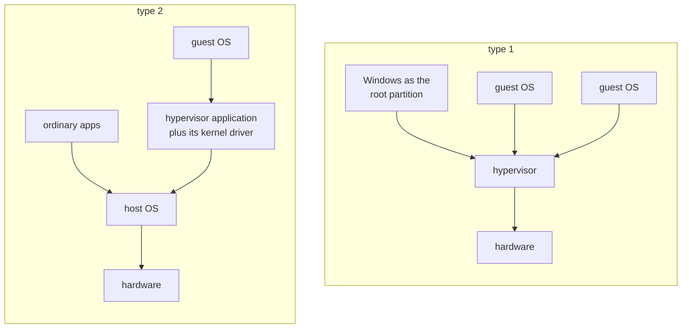
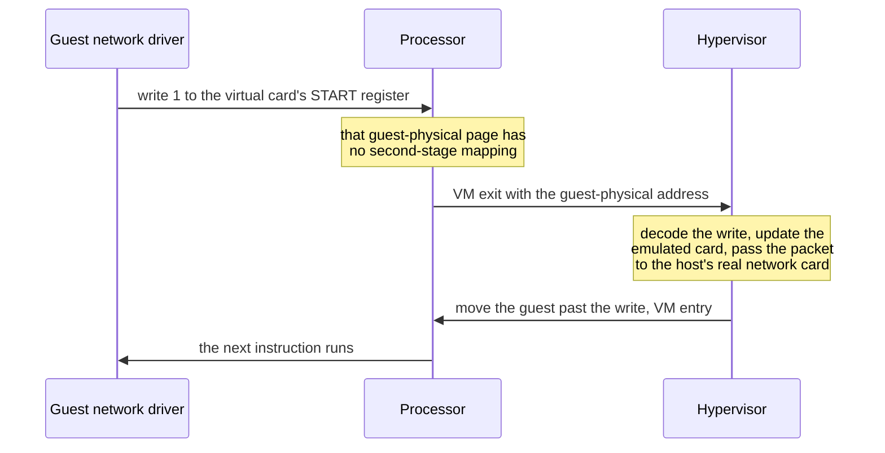
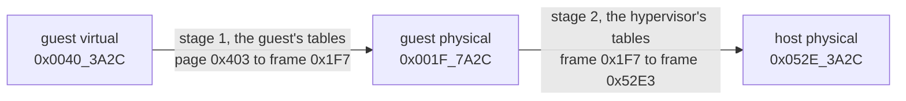
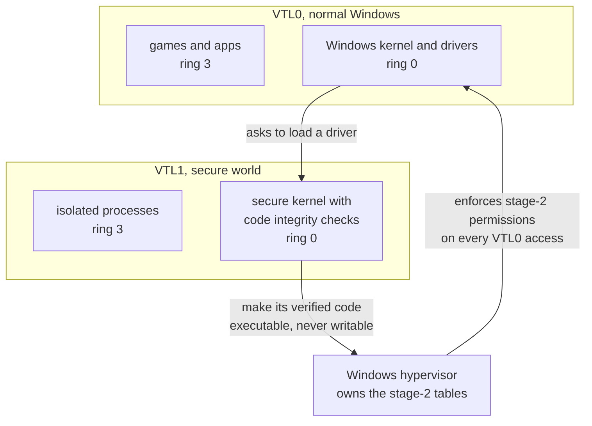

import MemoryStrip from '../../../../components/MemoryStrip.astro';
import Quiz from '../../../../components/Quiz.astro';

[Lesson 1.7](/pages/1/07/) set up a Windows virtual machine for this book's
labs and promised that a snapshot could undo a bad experiment. It did not say
how one computer can pretend to be several, or what a snapshot actually
stores. This lesson does. It ends where [Lesson 14.2](/pages/14/02/) left off,
with Windows using the same machinery to protect its own kernel.

## A computer inside a computer

A **virtual machine** (VM) is a complete computer made of software: virtual
processors, virtual RAM, a virtual disk, a virtual network card, and a virtual
screen, convincing enough that an unmodified operating system installs and runs
on it. The operating system inside is the **guest**, and the real computer is
the **host**. The software that creates virtual machines and shares the real
hardware among them is the **hypervisor**, also called a *virtual machine
monitor*.

This is a different kind of virtual machine from the one in
[Lesson 12.7](/pages/12/07/). Lua's virtual machine is a program that carries
out Lua bytecode, an instruction set that no processor runs in silicon. A
hypervisor's virtual machine offers the *same* instruction set as the real
processor, x86-64, so the guest's instructions run directly on the real
processor, and the hypervisor steps in only when the guest touches something
that must stay under the host's control.

### Type 1 and type 2 hypervisors

In the figure below, each arrow points from a piece of software to whatever it
runs on:

A **type 1** hypervisor runs directly on the hardware, with no operating system
underneath it. Every operating system on the machine runs above it, including
the one that manages the others. Hyper-V is type 1: when it is turned on, the
hypervisor starts first at boot, and your Windows becomes the *root partition*,
a privileged guest that manages the other guests. Xen and VMware ESXi are also
type 1.

A **type 2** hypervisor is an application that runs on an ordinary **host
operating system** and relies on it for scheduling, memory, and devices.
VirtualBox and VMware Workstation are type 2. Even they need ring 0 for the
processor's virtualization instructions, so each installs a kernel driver
alongside its application.

The line blurs in practice. KVM turns the Linux kernel itself into a
hypervisor. And on a Windows PC where the Windows hypervisor is already running,
as it is whenever memory integrity is on (the last section explains why),
VirtualBox and VMware run their guests through Windows' own hypervisor instead
of directly on the processor.

## Why a guest cannot simply run in user mode

The obvious way to build a hypervisor is to run the guest's kernel in ring 3,
where every privileged instruction it tries causes a fault, and have the
hypervisor catch each fault and do to the *virtual* machine what the
instruction would have done to a real one. This is called **trap and
emulate**: the guest's ordinary instructions run at full speed, and only the
sensitive ones cost extra.

In 1974 Gerald Popek and Robert Goldberg stated the condition for trap and
emulate to work: every instruction that reads or changes the machine's control
state must fault when it runs outside the most privileged level. For many years
x86 did not meet it. The classic example is `popf`, which loads the flags
register, including the *interrupt flag* that switches interrupts on and off.
In ring 0, `popf` changes the interrupt flag. In ring 3 it silently leaves the
flag alone and raises no fault. A guest kernel running in ring 3 that used
`popf` to switch interrupts back on would carry on believing they were on, and
the hypervisor would never find out, because nothing trapped.

Early x86 hypervisors worked around the problem. VMware, from 1999, examined
the guest kernel's code as it ran and rewrote the problem instructions into
safe sequences, a technique called **binary translation**. Xen, from 2003,
modified the guest kernel's source code so that it asked the hypervisor
directly instead of running those instructions, which is called
**paravirtualization**. Both worked, and both were complicated.

## Hardware virtualization: VT-x and AMD-V

In 2005 and 2006, Intel and AMD added hardware support, called **Intel VT-x**
and **AMD-V**. Both add a separate processor mode for guests. Intel calls it
*VMX non-root operation*, and the hypervisor runs in *VMX root operation*.
Inside the guest mode, the guest gets its own complete set of rings 0 to 3, so
the guest kernel runs in its own ring 0, unmodified, and `popf` behaves exactly
as the guest kernel expects.

The hypervisor keeps one control structure for each virtual processor, called
the VMCS on Intel and the VMCB on AMD. It holds three things:

- the guest's saved state: every register, including the instruction pointer
  and `cr3`;
- the host's state, reloaded whenever the guest stops;
- the exit controls: the list of guest actions that must hand control to the
  hypervisor.

The hypervisor starts or resumes a guest with a **VM entry** (`vmlaunch` or
`vmresume` on Intel, `vmrun` on AMD). The processor loads the guest's state and
runs the guest's instructions natively, at full speed, until one of the listed
actions happens.

## What a VM exit is

A **VM exit** is the processor stopping a guest and handing control to the
hypervisor. The processor saves the guest's state into the control structure,
loads the host's state, and jumps to the hypervisor's exit handler, along with
a number that says why, the **exit reason**, and details such as the address
involved. The hypervisor deals with the cause, adjusts the guest's saved state
(usually moving its instruction pointer past the instruction it just handled),
and enters the guest again. From inside the guest, the instruction simply seems
to have taken effect.

Typical causes of an exit:

- `cpuid`, the instruction that describes the processor. On Intel it always
  exits, so the hypervisor decides what the guest is told about its processor.
- Port I/O to a virtual device, such as the `in` and `out` instructions from
  Lesson 14.2.
- An access to a guest-physical address that has no usable mapping in the
  second stage of translation, described in the next section. That is how the
  hypervisor catches accesses to a virtual device's memory-mapped registers.
- `hlt`, when a virtual processor has nothing to do and the hypervisor can give
  the real core to other work.
- Interrupts from real hardware, which belong to the host.

Here is one exit, caused by a guest's network driver writing to a register of
its virtual network card:

Exits are expensive. The round trip of exit, handling, and entry takes hundreds
to thousands of processor cycles, where an ordinary instruction takes about
one. So hypervisors keep exits rare. The guest's ordinary instructions, its own
system calls, and its own page faults never leave the guest, and modern guests
use *paravirtual* devices, virtual devices designed to need few exits. It is
the idea [Lesson 10.7](/pages/10/07/) called limited direct execution, one
level further down: run natively, and trap only what must stay under control.

<Quiz
  id="vm-exit-causes"
  title="Which one leaves the guest?"
  prompt="A guest runs on an Intel processor with hardware virtualization and second-level address translation. Which of these guest actions causes a VM exit?"
  options="An `add` instruction in a guest program||A system call from a guest program into the guest kernel||A `cpuid` instruction||A page fault on a guest virtual page that the guest kernel has not mapped yet"
  answer="2"
  explanation="Ordinary instructions and system calls run natively inside the guest, and a fault on a page the guest's own tables do not map is delivered to the guest kernel, which handles it as it would on real hardware. `cpuid` always exits on Intel processors, so the hypervisor controls what the guest learns about its processor."
/>

## Two stages of address translation

Each guest believes it owns physical memory starting at address 0. It cannot:
the host's real memory also starts at 0, and several guests share it. So a
guest's “physical” addresses are really **guest physical addresses**, and they
must be translated once more into **host physical addresses**, the real
addresses of RAM.

With **second-level address translation** (SLAT), the processor does both
translations in hardware. Intel calls its version *extended page tables* (EPT);
AMD calls its version *nested page tables* (NPT). The two stages have different
owners:

- **Stage 1** turns a guest virtual address into a guest physical address,
  through the guest's own page tables. The guest kernel writes these tables and
  switches between them by loading its own `cr3`, exactly as it would on a real
  machine.
- **Stage 2** turns a guest physical address into a host physical address,
  through tables that only the hypervisor writes. The guest cannot see them,
  name them, or change them.

### A worked translation

Pages are 4 KiB, which is 4 × 1,024 = 4,096 bytes. Since 2¹² = 4,096, the
lowest 12 bits of an address choose a byte within its page, the **offset**, and
all the bits above them name the page. Each hex digit stands for 4 bits, so the
12 offset bits are exactly the last three hex digits;
[Lesson 10.5](/pages/10/05/) made the same split. Take the guest virtual
address `0x0040_3A2C`:

<MemoryStrip
  cells="=0|=0|=4|=0|=3|=A|=2|=C"
  groups="0-4:guest virtual page `0x00403`|5-7:offset `0xA2C`"
  caption="The guest virtual address `0x0040_3A2C`, split before its last three hex digits."
/>

The offset is `0xA2C` = 10 × 256 + 2 × 16 + 12 = 2,560 + 32 + 12 = 2,604,
safely less than 4,096. The page number is `0x403` = 4 × 256 + 3 = 1,027. As a
check, page 1,027 starts at byte 1,027 × 4,096 = 4,206,592, and 4,206,592 +
2,604 = 4,209,196, which is `0x0040_3A2C` written in decimal.

**Stage 1.** The guest kernel's page tables map guest virtual page `0x403` to
guest physical frame `0x1F7`. A **frame** is a page-sized block of physical
memory. Translation replaces the page number with the frame number and keeps
the offset:

<MemoryStrip
  cells="=0|=0|=1|=F|=7|=A|=2|=C"
  groups="0-4:guest physical frame `0x001F7`|5-7:offset `0xA2C`, unchanged"
  caption="The guest physical address `0x001F_7A2C` = `0x1F7` × `0x1000` + `0xA2C`."
/>

Multiplying by `0x1000`, which is 4,096, shifts a number left by three hex
digits, so `0x1F7` × `0x1000` = `0x1F_7000`, and adding the offset gives
`0x1F_7A2C`. On a real machine the translation would end here, with a RAM
address. In a guest, `0x001F_7A2C` is only the guest's idea of one.

**Stage 2.** The hypervisor's tables map guest physical frame `0x1F7` to host
physical frame `0x52E3`:

<MemoryStrip
  cells="=0|=5|=2|=E|=3|=A|=2|=C"
  groups="0-4:host physical frame `0x052E3`|5-7:offset `0xA2C`, unchanged"
  caption="The host physical address `0x052E_3A2C`: where the byte really is in RAM."
/>

`0x52E3` × `0x1000` = `0x52E_3000`, and adding `0xA2C` gives `0x052E_3A2C`. The
offset rode through both stages untouched; each stage only swapped the number
above it.

Each stage can also refuse. If the guest's own tables have no entry for a
virtual page, the processor raises an ordinary page fault *inside the guest*,
and the guest kernel handles it as it always would. If the hypervisor's tables
have no entry for a guest physical frame, as for the network card's register
page in the previous section, the result is a VM exit. Stage-2 entries also
carry their own read, write, and execute permissions, and an access succeeds
only if both stages allow it.

The second stage is where a guest's isolation comes from. A guest can write
anything it likes into its own page tables, but every address they produce is
only a guest physical address, and only the frames the hypervisor maps in stage
2 exist for that guest. Memory that belongs to the host or to another guest has
no guest physical address at all, so no instruction the guest can execute is
able to name it.

<Quiz
  id="vm-two-stage-translation"
  title="Translate one more address"
  prompt="Using the same mappings as the worked example, which host physical address holds the byte at guest virtual address `0x0040_3F00`?"
  options="`0x052E_3F00`||`0x001F_7F00`||`0x052E_4F00`||`0x0040_3F00`"
  answer="0"
  explanation="`0x0040_3F00` lies on the same guest virtual page, `0x403`, at offset `0xF00`. Stage 1 maps page `0x403` to guest frame `0x1F7`, giving `0x001F_7F00`, which is only a guest physical address. Stage 2 maps frame `0x1F7` to host frame `0x52E3`. The offset never changes, so the answer is `0x52E3` × `0x1000` + `0xF00` = `0x052E_3F00`."
/>

### What two stages cost

Real translation is not one table lookup per stage but a four-level walk
([Lesson 11.6](/pages/11/06/)), and with two stages the walks multiply. The
guest's page tables live in guest physical memory, so each of the four entries
the processor reads during the guest's walk sits at a guest physical address
that must first go through a four-level stage-2 walk. Each guest level
therefore costs 4 reads to find its table plus 1 read of the entry itself,
4 + 1 = 5 reads, and 4 × 5 = 20 reads for the whole stage-1 walk. The guest
physical address that comes out needs one more four-level stage-2 walk:
20 + 4 = 24 memory reads to translate one address, where a machine without
virtualization needs 4.

The processor avoids paying that on every access with its **translation
lookaside buffer** (TLB), a small cache of recent translations. The TLB keeps
the final guest-virtual-to-host-physical answer, so a program that touches the
same pages again, as programs mostly do, pays for the walk once.

## What a snapshot saves and restores

Lesson 1.7 took snapshots before any experiment. A snapshot can capture a whole
running computer because everything that makes up a guest is something the
hypervisor owns:

- **The disk.** A guest's disk is an ordinary file on the host. Taking a
  snapshot freezes that file and starts a new *differencing* file, the delta,
  which receives every later write. A read checks the delta first and falls
  back to the frozen base.
- **The memory.** The guest's RAM is host memory that the stage-2 tables map.
  Because the hypervisor knows exactly which host frames those are, it can
  write all of them to a file, and a snapshot of a running VM includes that
  file.
- **The processors and devices.** Each virtual processor's saved state from its
  control structure, every register including the instruction pointer, plus the
  state of every emulated device.

<MemoryStrip
  cells="block 0=base|block 1=delta|block 2=base|block 3=base|block 4=delta|block 5=base"
  marks="1|4"
  caption="A virtual disk after a snapshot. Blocks 1 and 4 were written since, so their new contents live in the delta; the others are still read from the frozen base. Restoring the snapshot discards the delta."
/>

Restore all three, and the guest continues from exactly the instruction it had
reached, with its disk exactly as it was. Restoring is quick because nothing is
copied back: the hypervisor throws the delta away. Deleting a snapshot is the
slow direction, because the delta's blocks must then be merged into the base.

A snapshot cannot put back anything that left the virtual machine: a file
copied to the host through a shared folder, a message already sent over the
network (the other end still has it), a change to an online account, or a
change to the host itself. It also relies on the hypervisor's isolation
holding. A bug in the hypervisor that lets guest code run on the host, called a
**VM escape**, would put an attacker beyond any snapshot's reach. Such bugs
usually sit in the code that emulates devices; they are rare and valuable, and
they are patched quickly. That is why Lesson 1.7 keeps shared folders, the
shared clipboard, and USB passthrough off until they are needed, and why the
host's hypervisor deserves updates as promptly as Windows does.

That is the case for running this book's Windows labs in a VM. A bug check in
the guest's kernel or a bad driver in the guest ([Lesson 14.1](/pages/14/01/),
Lesson 14.2) stops only the guest. Debuggers and memory tools, which need broad
rights inside the guest, get none outside it. And a restore returns a whole
machine, not just one program, to a known state.

## How a program can tell it is in a virtual machine

A guest runs real instructions on a real processor, so most of what it does
looks identical inside and outside a VM. A program that wants to know can
still find out, in a few ways:

- **The processor says so.** Hypervisors announce themselves on purpose. When a
  program runs `cpuid` with input 1, bit 31 of the result in `ecx` is the
  *hypervisor present* bit: 0 on bare hardware, set by a hypervisor. Bit 31 is
  worth 2³¹ = 2,147,483,648, which is `0x8000_0000`, because the top hex digit
  `8` is binary `1000`. A second input, `0x4000_0000`, returns the hypervisor's
  name as twelve ASCII characters, such as `Microsoft Hv`. This is a feature,
  not a leak: guests use it to find out which faster, hypervisor-aware drivers
  they can load.
- **The hardware looks virtual.** Virtual disks, graphics adapters, and network
  cards report model names from the hypervisor's vendor, and virtual network
  cards get addresses from ranges assigned to those vendors.
- **Some instructions are slow.** Anything that causes a VM exit takes far
  longer than it would on bare hardware, and careful timing can notice.

Guest tools ask so they can install the right drivers. Licensing software asks.
Malware asks so it can behave innocently inside the sandboxes that analysts use
to study it. Some anti-cheat systems ask, and refuse to run a protected game in
a VM, because a hypervisor can see and change everything a guest does. That is
one more reason this book's targets are offline, single-player builds running
in your own VM.

The first check is weaker than it looks. On a Windows 11 PC with memory
integrity on, Windows itself runs on the Windows hypervisor, so the
hypervisor-present bit is set on an ordinary desktop too. The next section
explains why.

## Windows uses the hypervisor to protect itself

Lesson 14.1 ended with an uncomfortable fact: kernel code can do anything, so a
single exploited driver bug hands an attacker the whole kernel.
**Virtualization-based security** (VBS) answers with the machinery from this
lesson. At boot, the Windows hypervisor starts first, and Windows runs above it
in two **virtual trust levels**:

- **VTL0**, the normal world: the Windows kernel, drivers, and every program,
  in their usual rings 0 and 3;
- **VTL1**, the secure world: a small *secure kernel* and a few isolated
  processes, such as the one that guards login secrets when Credential Guard is
  on.

The hypervisor keeps separate stage-2 permissions for each trust level. VTL1
can ask the hypervisor to change VTL0's permissions. Nothing in VTL0, not even
ring-0 kernel code, can change them, because the stage-2 tables cannot be
reached from inside VTL0 at all.

**Memory integrity**, also called **HVCI** (hypervisor-protected code
integrity), is the VBS feature that uses this arrangement for the kernel's own
code. The code-integrity checks that decide whether a driver is properly signed
run in VTL1, where a compromised VTL0 kernel cannot tamper with them. A kernel
page becomes executable in stage 2 only after its code passes those checks, and
an executable page is never writable.

Suppose an attacker finds a driver bug that lets them write anywhere in kernel
memory, the worst case from Lesson 14.1. They can still corrupt data. They
cannot write new instructions into a code page, because code pages are not
writable in stage 2, and they cannot turn a data page into code, because only
VTL1 grants execute permission and it grants it only to signed code. The
vulnerable driver blocklist from Lesson 14.2 is enforced whenever memory
integrity is on.

Memory integrity is on by default on clean installs of Windows 11 on compatible
hardware. It needs the processor's virtualization support and SLAT, which is
one more reason to leave virtualization enabled in the firmware settings. On
such a PC, VirtualBox and VMware run their guests through the Windows
hypervisor instead of directly on the processor, which can make a lab VM
somewhat slower. That is not a reason to turn memory integrity off:
[Lesson 11.5](/pages/11/05/) lists it among the protections worth keeping.

References: [Hyper-V architecture](https://learn.microsoft.com/en-us/virtualization/hyper-v-on-windows/reference/hyper-v-architecture), [hypervisor feature discovery](https://learn.microsoft.com/en-us/virtualization/hyper-v-on-windows/tlfs/feature-discovery), [virtualization-based security](https://learn.microsoft.com/en-us/windows-hardware/design/device-experiences/oem-vbs), [memory integrity and VBS enablement](https://learn.microsoft.com/en-us/windows-hardware/design/device-experiences/oem-hvci-enablement), [isolated user mode processes](https://learn.microsoft.com/en-us/windows/win32/procthread/isolated-user-mode--ium--processes), and the virtual-machine extensions volume of the [Intel Software Developer Manuals](https://www.intel.com/content/www/us/en/developer/articles/technical/intel-sdm.html).
