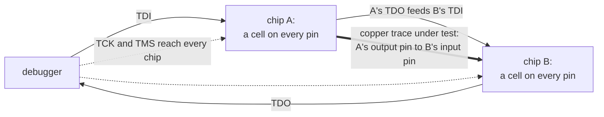
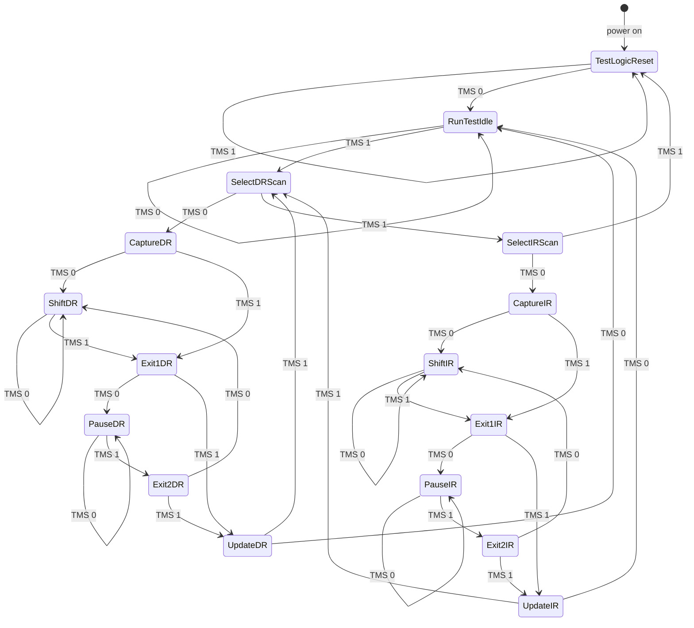
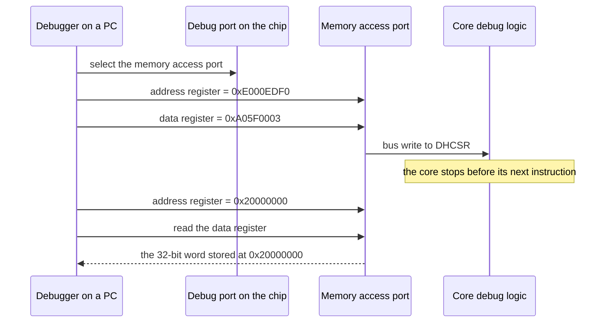
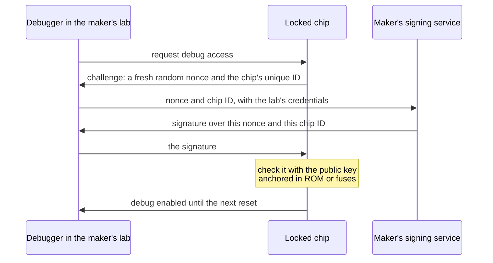

import MemoryStrip from '../../../../components/MemoryStrip.astro';
import Quiz from '../../../../components/Quiz.astro';

Every debugger in this book so far has been a program asking other software for
permission. The debugger of [Lesson 7.7](/pages/7/07/) asks Windows to pause a
thread, and Windows agrees because the debugger holds the right access.
[Lesson 14.1](/pages/14/01/) showed the processor enforcing a boundary between
user mode and the kernel, and [Lesson 14.3](/pages/14/03/) put a hypervisor
underneath the kernel. This lesson goes below all of them, to a debugger that
asks no software at all, because it is wired into the chip.

It began as something far more modest: a way to find bad solder joints.

## Why circuit boards needed a test port

A circuit board is a sheet of fibreglass with copper wires, called **traces**,
printed on it. Chips are soldered on top, and every pin of every chip must make
a good electrical joint with its trace. A factory building thousands of boards a
day always produces some bad joints: a blob of solder that bridges two pins, or
a pin that never touches its pad. Every connection has to be checked before a
board ships.

For decades the check was a **bed of nails**: a fixture of spring-loaded metal
pins pressed onto test points all over the board, so a tester could drive a
signal into one end of a trace and measure it at the other. That approach
struggled in the 1980s as surface-mounted chips packed their pins closer
together, and it became hopeless once packages hid their connections
underneath. A ball grid array, for example, joins the board through a grid of
solder balls on its underside, and once it is soldered down no probe can reach
them.

In 1985 a group of electronics companies formed the Joint Test Action Group to
solve the problem. Their design was standardised in 1990 as IEEE 1149.1, and
everyone calls it **JTAG** after the group. The idea was to stop probing the
board from outside and build the probes into the chips.

## Boundary scan: a probe on every pin

A chip that supports JTAG places a small circuit called a **boundary-scan cell**
between each pin and the chip's internal logic. In normal operation the cell is
transparent: signals pass straight through, and the chip behaves as though the
cell were not there. In test mode the cell can do two other things:

- **capture**: record the level currently on its pin, 1 or 0;
- **drive**: put a chosen level onto the pin, overriding the chip's own logic.

The cells are linked one after another into a line called the **boundary-scan
register**, so their contents can be moved out one bit at a time through a
single wire while new contents move in through another. Chips on the same board
are linked the same way, the output wire of one feeding the input wire of the
next. The result is a **scan chain**:



Testing the thick trace takes two passes. Load a 1 into the cell on chip A's
pin and switch A's cells to drive; switch chip B's cells to capture; then shift
everything out and look at the cell on B's pin. A good joint reads 1. Then repeat
with a 0, because a pin accidentally joined to the power supply would read 1
whatever A drove. The two patterns together catch a trace stuck at 1 and a trace
stuck at 0. Test software computes patterns that check every trace on a board at
once.

## Four wires and a clock

The JTAG connection on each chip is called the **Test Access Port**, or **TAP**.
It uses four signals:

| Signal | Name | Direction | Job |
|---|---|---|---|
| TCK | Test Clock | into the chip | every action happens on a tick of this clock |
| TMS | Test Mode Select | into the chip | steers the port from one state to the next |
| TDI | Test Data In | into the chip | bits enter the chain here |
| TDO | Test Data Out | out of the chip | bits leave the chain here |

An optional fifth signal, TRST (Test Reset), resets the port directly.

The chip reads TMS and TDI when TCK rises from 0 to 1, called the **rising
edge**, and changes TDO when TCK falls back to 0, the **falling edge**. Each
wire is read on one edge and changed on the other, so no wire is ever read at
the moment it changes.

The standard also requires TMS and TDI to read as 1 when nothing drives them.
That small rule matters twice below.

## Shift registers: many bits through one wire

A **shift register** is a row of one-bit storage cells wired so that, on every
clock tick, each cell takes the value of its neighbour. A new bit enters at one
end and the bit at the other end falls out. JTAG always shifts toward TDO: the
cell next to TDO, bit 0, leaves first, every other bit moves down one place, and
the bit arriving from TDI enters at the top.

Take a small chip with four pins and a 4-bit boundary-scan register, bits `b3`
to `b0`. The test captures the pins: pin 0 reads 1, pin 1 reads 0, pin 2 reads
1, and pin 3 reads 1. Each cell now holds its own pin's level:

<MemoryStrip
  cells="b3 · pin 3=1|b2 · pin 2=1|b1 · pin 1=0|b0 · pin 0=1"
  groups="0-3:TDI enters at `b3`, TDO leaves from `b0`"
  caption="After the capture, each cell holds its pin's level. `b0` sits next to TDO, so pin 0's level will leave first."
/>

Now the debugger runs four clocks, sending 1, 1, 0, 0 into TDI, first bit
first. On each clock, TDO receives `b0`, then `b0` takes `b1`'s value, `b1`
takes `b2`'s, `b2` takes `b3`'s, and `b3` takes the bit from TDI:

| Clock | TDI sends | TDO receives | `b3 b2 b1 b0` after the clock |
|---:|---:|---|---|
| start | | | `1 1 0 1` |
| 1 | 1 | 1, pin 0's level | `1 1 1 0` |
| 2 | 1 | 0, pin 1's level | `1 1 1 1` |
| 3 | 0 | 1, pin 2's level | `0 1 1 1` |
| 4 | 0 | 1, pin 3's level | `0 0 1 1` |

Check clock 1: TDO receives `b0`, which is 1. Then `b0` takes `b1`'s 0, `b1`
takes `b2`'s 1, `b2` takes `b3`'s 1, and `b3` takes the incoming 1, giving
`1 1 1 0`. The other rows follow the same rule.

The same four clocks did two jobs. They read the pins out in order, pin 0 to
pin 3, and they loaded a new pattern. The first bit sent travelled furthest and
ended in `b0`; the last bit sent stopped in `b3`:

<MemoryStrip
  cells="b3=0|b2=0|b1=1|b0=1"
  caption="After four clocks, the old levels have left through TDO and the new pattern 1, 1, 0, 0 sits in `b0` to `b3`."
/>

Look at the register after clock 2: `1 1 1 1`, a pattern nobody asked for. While
bits ripple through, the register passes through meaningless in-between values.
If the pins followed the register directly, they would flicker through every one
of them. So each cell has a second latch that actually drives the pin, and it
copies the shifted value only once the whole pattern is in place. That separate
copy step is why the controller in the next section has **Update** states.

## The TAP controller: 16 states steered by one wire

The debugger has one wire, TMS, for giving orders, yet it needs to say "capture
now", "shift", "pause", and "update". The chip solves this with a small state
machine, the **TAP controller**. At every rising edge of TCK the controller moves
to one of two next states, chosen by whether TMS is 0 or 1. The standard defines
16 states. The diagram writes their names without hyphens; the standard spells
them Test-Logic-Reset, Run-Test/Idle, Select-DR-Scan, Capture-DR, and so on.



The machine has two matching columns. States ending in DR work on a **data
register**, such as the boundary-scan register; states ending in IR work on the
**instruction register**, described in the next section. Down each column:

- **Capture** loads the register's shift stage from its inputs: the pin levels,
  for the boundary-scan register.
- **Shift** moves one bit from TDI toward TDO on every clock, for as long as TMS
  stays 0.
- **Exit1**, **Pause**, and **Exit2** leave the shifting, wait if the debugger
  needs time to fetch more data, and resume without starting over.
- **Update** copies the shifted-in value to the register's outputs in one step.

Test-Logic-Reset is the state in which the chip ignores the test logic and works
normally. Run-Test/Idle is a resting place between operations.

Each state does its work on the rising edge that *leaves* it. The capture
happens on the clock that moves from Capture-DR to Shift-DR, and the last bit of
a scan is shifted by the same clock that raises TMS to leave Shift-DR for
Exit1-DR. To shift 64 bits, the debugger sends 63 clocks with TMS at 0 and then
the 64th with TMS at 1. Getting from a fresh reset to the first shift takes four
clocks:

| Clock | TMS | From | To |
|---:|---:|---|---|
| 1 | 0 | Test-Logic-Reset | Run-Test/Idle |
| 2 | 1 | Run-Test/Idle | Select-DR-Scan |
| 3 | 0 | Select-DR-Scan | Capture-DR |
| 4 | 0 | Capture-DR, where the register loads | Shift-DR |

One property of the table makes the controller impossible to lose: five clocks
with TMS at 1 reach Test-Logic-Reset from any state. From Shift-DR the path is
Exit1-DR, Update-DR, Select-DR-Scan, Select-IR-Scan, and Test-Logic-Reset, which
is five steps, and no state is further away. A debugger that is unsure of the
state therefore sends five 1s on TMS and starts from a known place. And because
an undriven TMS reads as 1, a chip whose test port is not connected to anything
sits in Test-Logic-Reset permanently and works normally.

## Instructions choose which register sits in the chain

Scanning through the IR column loads a chip's instruction register, and the
instruction decides which data register the DR column works on. The standard
requires a few instructions and leaves the rest to each chip's designer:

- **BYPASS** selects a one-bit register that always captures 0. Its code must be
  all ones, so a chip with a 4-bit instruction register uses `1111`. BYPASS
  shrinks a chip to a single bit, so the debugger can reach other chips on the
  chain without shifting through this one's long registers.
- **EXTEST** and **SAMPLE/PRELOAD** select the boundary-scan register for the
  board tests above.
- **IDCODE** is optional but nearly universal. It selects a 32-bit register that
  identifies the chip, and a chip that has one selects it automatically on reset.

Any code a chip does not define must behave as BYPASS. Together with the rule
that an undriven TDI reads as 1, this means a broken chain fails safe: ones
shifted in select BYPASS, not a test mode that drives the pins against the
chip's own outputs.

## Worked example: count the chips on a chain

A debugger attached to an unfamiliar board can count its chips in two scans.

1. Reset, then shift plenty of ones through the instruction registers. The
   debugger does not know how long each register is, and it does not need to:
   every register ends up full of ones, which is BYPASS, and the spare ones fall
   out of TDO.
2. Scan the data registers. Each chip now contributes one bypass bit, which
   captured 0. Send a single 1 followed by 0s, and count the clocks until the 1
   comes back.

Here is the second scan on a board with two chips, A nearest TDI and B nearest
TDO. On each clock, TDO receives B's bit, B takes A's old bit, and A takes the
bit from TDI:

| Clock | TDI sends | TDO receives | A's bit after | B's bit after |
|---:|---:|---:|---:|---:|
| start | | | 0 | 0 |
| 1 | 1 | 0 | 1 | 0 |
| 2 | 0 | 0 | 0 | 1 |
| 3 | 0 | 1 | 0 | 0 |

<MemoryStrip
  cells="TDI=0|chip A=0|chip B=1|TDO=0"
  marks="2"
  groups="1-2:the whole data chain: one bypass bit per chip"
  caption="After clock 2, the 1 sent on clock 1 sits in chip B's bypass bit. On clock 3 it reaches TDO."
/>

The 1 went in on clock 1 and came out on clock 3, so the chain held it for
3 − 1 = 2 clocks. Each one-bit register holds a bit for exactly one clock, so
there are 2 chips.

<Quiz
  id="jtag-bypass-count"
  title="Count the chips"
  prompt="Every chip on a chain is in BYPASS. The debugger sends a single 1 on clock 1, followed by 0s, and the 1 comes out of TDO on clock 4. How many chips are on the chain?"
  options="3||4||1||It depends on how long each chip's instruction register is"
  answer="0"
  explanation="Each chip in BYPASS adds a one-bit register, and each one-bit register holds the bit for one clock. The 1 was held for 4 − 1 = 3 clocks, so it passed through 3 chips. Instruction-register lengths stop mattering once every chip is in BYPASS, because the data path is then one bit per chip."
/>

## Reading a chip's identity

After reset, every chip with an IDCODE register has it selected, so one data
scan reads every ID on the chain. For two chips that is 32 + 32 = 64 bits. They
come out lowest bit first, and the chip nearest TDO answers first: the first 32
bits belong to chip B.

Bit 0 of every IDCODE is 1, and that is deliberate. A bypass register captures
0, so the first bit from each chip tells the debugger what kind of register it
is reading. A 1 means a 32-bit IDCODE follows; a 0 means a chip with no IDCODE,
sitting in BYPASS, which contributes that single bit and nothing more.

Chip A in this lesson's lab contains Arm's JTAG debug port, found in many
microcontrollers, and it answers `0x4BA00477`. The 32 bits split into three
fields plus the fixed 1:

<MemoryStrip
  cells="31–28=4|27–24=B|23–20=A|19–16=0|15–12=0|11–8=4|7–4=7|3–0=7"
  groups="0:version|1-4:part number `0xBA00`|5-7:manufacturer and the fixed 1"
  caption="Each box is one hex digit, four bits, labelled with the bit numbers it covers."
/>

- Bits 31 to 28 are the first hex digit: version 4.
- Bits 27 to 12 are the next four digits: part number `0xBA00`.
- Bits 11 to 0 are `0x477`, which is 4 × 256 + 7 × 16 + 7 = 1,143. Its lowest
  bit is the fixed 1. Removing that bit means subtracting 1 and halving:
  (1,143 − 1) ÷ 2 = 571. In hex, 571 = 2 × 256 + 3 × 16 + 11 = `0x23B`, the
  manufacturer code that JEDEC, the industry body that hands out these numbers,
  assigned to Arm.

## From a test port to a debugger

The standard left room for chip designers to add private instructions and data
registers, and designers used that room to connect the TAP to **on-chip debug
logic**. Through the same four wires, a debugger can then:

- **halt** the processor core, stopping it between two instructions whatever it
  is running, the kernel included;
- **single-step**, running exactly one instruction and halting again;
- **read and write the core's registers**, including the program counter;
- **read and write memory**, through a debug unit that issues reads and writes
  on the chip's internal bus exactly as the CPU does;
- **set hardware breakpoints and watchpoints**, comparators that halt the core
  when it fetches from, or accesses, a chosen address. They work like the x86
  debug registers of [Lesson 2.3](/pages/2/03/), except that they are programmed
  from outside the chip.

The difference from Chapter 7 is where the request goes. A Windows debugger asks
the operating system to pause one thread. A JTAG debugger stops the whole
processor, and the operating system has no say, because it is no longer running.

Arm's Cortex-M processors, used in a great many microcontrollers, show how
ordinary the mechanism is. Their debug controls sit at fixed addresses in the
memory map, described in Arm's public architecture manual, so the debugger halts
the core with a plain memory write through the debug port. The control is DHCSR,
the Debug Halting Control and Status Register, at address `0xE000EDF0`. Its low
three bits are:

| Bit | Name | Value of the bit | Effect when written as 1 |
|---:|---|---:|---|
| 0 | `C_DEBUGEN` | 1 | allow halting debug |
| 1 | `C_HALT` | 2 | stop the core |
| 2 | `C_STEP` | 4 | while `C_HALT` is 0, run one instruction and stop |

Every write must also carry `0xA05F` in the upper 16 bits, or the processor
ignores it. That key is printed in the public manual, so it is not a password.
It stops a stray write from buggy software halting the core by accident.

Putting `0xA05F` in the upper half gives `0xA05F0000`. Adding bit values to it:

- halt: `0xA05F0000` + 2 + 1 = `0xA05F0003`;
- step one instruction while halted: `0xA05F0000` + 4 + 1 = `0xA05F0005`;
- resume: `0xA05F0000` + 1 = `0xA05F0001`.

The debugger reaches DHCSR through a **memory access port** in the debug logic.
The port has an address register and a data register, called TAR and DRW in
Arm's documentation: write an address to the first, then read or write the
second, and the port performs that bus access.



The second read fetches the first word of the chip's RAM, which starts at
`0x20000000` on Cortex-M. Core registers come through two more memory-mapped
registers, one to choose a register by number and one to carry its value.

## SWD: the same debugger on two wires

Four signals, or five with TRST, are a lot for a small microcontroller with
twenty pins. Arm designed **Serial Wire Debug**, **SWD**, which needs two:
SWCLK, a clock, and SWDIO, a single data wire that the debugger and the chip
take turns driving. Instead of walking a state machine, SWD sends packets. Every
transaction begins with an 8-bit request from the debugger:

- **Start**: always 1.
- **APnDP**: 0 for a debug port register, 1 for an access port register.
- **RnW**: 1 to read, 0 to write.
- **A2** and **A3**: two address bits that choose one of four registers.
- **Parity**: makes the count of 1s among APnDP, RnW, A2, A3, and the parity bit
  itself even.
- **Stop**: always 0. **Park**: always 1.

The first request a debugger usually sends reads the debug port's ID register,
register 0. That needs APnDP = 0, RnW = 1, A2 = 0, and A3 = 0. Those four bits
contain one 1, an odd count, so the parity bit is 1, which makes two:

<MemoryStrip
  cells="Start=1|APnDP=0|RnW=1|A2=0|A3=0|Parity=1|Stop=0|Park=1"
  groups="1-4:read debug port register 0|5:evens out the 1s"
  caption="Sent left to right, one bit per SWCLK tick. As a byte with the first bit as bit 0, it is 1 + 4 + 32 + 128 = 165 = `0xA5`."
/>

The bits in the order sent are 1, 0, 1, 0, 0, 1, 0, 1. Treating the first as bit
0, the 1s sit in bits 0, 2, 5, and 7, worth 1, 4, 32, and 128, for a total of
165. In hex that is 10 × 16 + 5 = `0xA5`. After the request the wire turns
around, the chip answers with a 3-bit acknowledgement (OK, WAIT, or FAULT), and
a read then delivers 32 data bits and a parity bit. The ID comes back in the same
format as a JTAG IDCODE. For many Cortex-M chips it is `0x2BA01477`: version 2,
part number `0xBA01` for the serial-wire version of the port, and the same Arm
manufacturer code, `0x23B`.

Many chips offer both protocols on shared pins, with SWDIO on the TMS pin and
SWCLK on the TCK pin, and a special bit sequence switches the port from one to
the other. Behind either protocol sits the same debug port, so halting,
stepping, and memory access work the same way.

## Why shipped devices lock the port

Everything above needs one thing: an open debug port. The debug logic does not
care what software the chip runs. A debugger that can halt the core and read
memory can read whatever that memory holds, such as encryption keys, a game
console's decrypted code, or a phone owner's data. It can also write memory,
so it can change code that secure boot ([Lesson 14.5](/pages/14/05/)) checked a
moment earlier. The protections of Chapters 10 and 11 — privilege levels, memory
protection, the kernel boundary — are all enforced by the processor that the
debugger has just stopped.

So production devices close the port, in layers from weakest to strongest:

- **Leave out the connector.** Makers often omit the header and leave unmarked
  pads. That only adds effort, because the traces are still there.
- **Turn debug off in early boot code.** The first software to run disables the
  debug logic. It protects only from that moment on, and only if nothing can run
  earlier.
- **Blow a fuse.** An **eFuse** is a one-time programmable bit: a tiny link on
  the chip that the factory can change once, from 0 to 1, and that nothing can
  change back. Hardware reads the fuses at power-on, before any software runs,
  and a fuse that says "debug disabled" keeps the debug logic off. Many
  microcontrollers offer levels: fully open, memory reads blocked while a
  debugger is attached, and debug permanently disabled.
- **Require authentication.** The port stays present but locked until the
  debugger proves it is allowed in.

**Secure debug authentication** is a challenge and a signed answer:



Each part closes a specific gap. The **nonce**, a number used once
([Lesson 9.8](/pages/9/08/)), makes old answers useless, because a recorded
signature covers a different number. The chip ID makes each answer good for one
unit, so a signature leaked from a repair bench unlocks nothing else. The
private key never leaves the maker, so knowing exactly how the protocol works,
as you now do, does not help anyone forge an answer.

The lock follows the chip through its life. Chips usually leave the chip factory
open for manufacturing tests, are locked as the last step before a product
ships, and may enter a return-for-analysis state, reachable only through
authentication, if a unit comes back broken. Each step is a one-way fuse change.
The hardware that reads those fuses is built to **fail closed**: designers
assume someone will try to disturb the check itself, so any fuse reading other
than a clean "open" leaves debug off.

A product shipped with its debug port open is a well-known and often repeated
mistake. Fixing it costs almost nothing at the factory and is nearly impossible
once the devices are in customers' hands. Development boards sold for learning
embedded programming are the opposite case: they leave SWD open on purpose and
document it, because their owners are the developers.

<Quiz
  id="jtag-debug-below-the-kernel"
  title="Why the kernel cannot help"
  prompt="A phone's kernel marks a page holding a key as readable only in kernel mode. An engineer halts the processor through an open JTAG port and reads that page. Why did the kernel's protection not stop the read?"
  options="The debug logic reads memory over the chip's bus itself, and the kernel's rules are enforced by a processor that is now stopped||The kernel always gives debuggers permission to read||JTAG reads memory faster than the kernel can check it||The page was never really protected"
  answer="0"
  explanation="Memory protection is enforced by the running processor as it executes code. A halted core executes nothing, and the debug unit performs its own bus reads. That is why production devices lock the port in hardware, with fuses and authentication, instead of relying on software running on the chip."
/>

## Simulate a TAP controller

The portable lab [`jtag_tap_lab.rs`](/rust-labs/src/bin/jtag_tap_lab.rs)
simulates the board from this lesson: chip A with Arm's JTAG debug port, which
answers `0x4BA00477`, and a made-up sensor as chip B. No hardware is involved.
The four wires are function arguments, and the board is a `Vec` of chips. Every
chip sees the same TCK and TMS, so their controllers move in lockstep and one
`TapState` describes them all.

The controller is a `match` with one row per state, giving the next state for
TMS at 0 and at 1, exactly like the diagram. The shift register is five lines:

```rust
fn shift_dr(&mut self, bit_in: bool) -> bool {
    let top = if self.selects_idcode() { 31 } else { 0 };
    let bit_out = (self.dr_shift & 1) == 1;
    self.dr_shift = (self.dr_shift >> 1) | (u32::from(bit_in) << top);
    bit_out
}
```

`& 1` keeps only bit 0, the bit leaving toward TDO. `>> 1` moves every bit down
one place. `<< top` puts the incoming bit at the top: bit 31 for the IDCODE
register, or bit 0 for the one-bit bypass register, where the top and the bottom
are the same cell. The chain passes each chip's outgoing bit into the next chip:

```rust
self.chips.iter_mut().fold(tdi, |bit, chip| shift(chip, bit))
```

Build it, then run it from the `rust-labs` folder:

```powershell
cargo run --bin jtag_tap_lab
```

The lab walks from Shift-DR to Test-Logic-Reset in five clocks and confirms that
no state needs more. It reads both IDCODEs, chip B's first because chip B is
nearest TDO, and splits Arm's into the fields above. It counts the chips by
timing a single 1 through their bypass bits. Finally, it puts chip A on IDCODE
and chip B on BYPASS, which makes the data chain 32 + 1 = 33 bits long. The
tests check that every state resets within five clocks, that exactly six states
can wait in place, that undefined instructions behave as BYPASS, and that
instructions land in chain order.

Then add a third chip to `board()`. Before you run it, predict what
`count_chips` reports and how many bits the IDCODE scan in `main` now needs.
