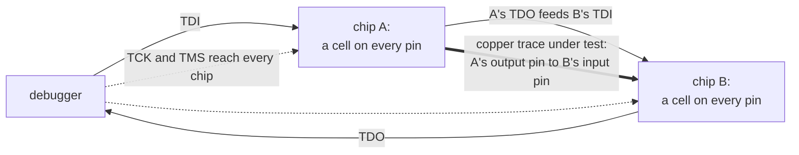
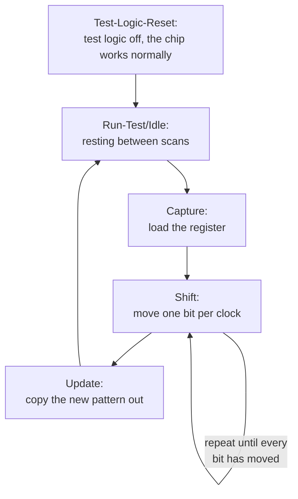
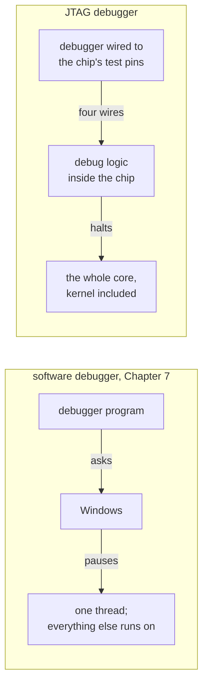
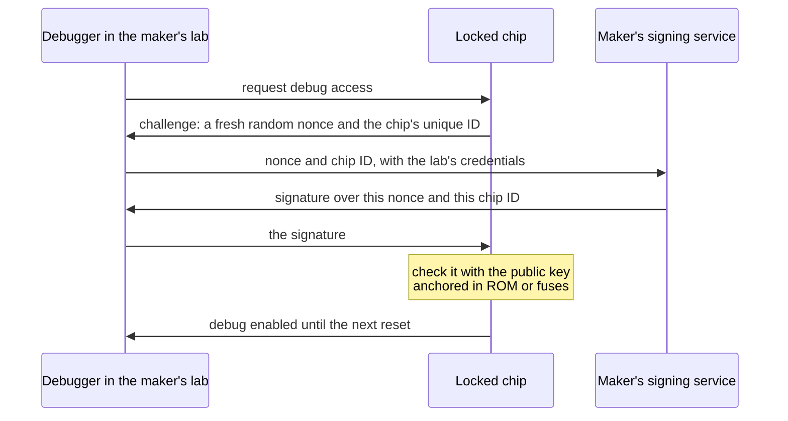

import MemoryStrip from '../../../../components/MemoryStrip.astro';
import Quiz from '../../../../components/Quiz.astro';

Every debugger in this book so far has been a program asking other software for
permission. The debugger of [Lesson 7.7](/pages/7/07/) asks Windows to pause a
thread, and Windows agrees because the debugger holds the right access.
[Lesson 14.1](/pages/14/01/) showed the processor enforcing a boundary between
user mode and the kernel, and [Lesson 14.3](/pages/14/03/) put a hypervisor
underneath the kernel. This lesson goes below all of them, to a debugger that
asks no software at all, because it is wired into the chip.

It began as something far more modest: a way to find bad solder joints.

## Why circuit boards needed a test port

A circuit board is a sheet of fibreglass with copper wires, called **traces**,
printed on it. Chips are soldered on top, and every pin of every chip must make
a good electrical joint with its trace. A factory building thousands of boards a
day always produces some bad joints: a blob of solder that bridges two pins, or
a pin that never touches its pad. Every connection has to be checked before a
board ships.

For decades the check was a **bed of nails**: a fixture of spring-loaded metal
pins pressed onto test points all over the board, so a tester could drive a
signal into one end of a trace and measure it at the other. That approach
struggled in the 1980s as surface-mounted chips packed their pins closer
together, and it became hopeless once packages hid their connections
underneath. A ball grid array, for example, joins the board through a grid of
solder balls on its underside, and once it is soldered down no probe can reach
them.

In 1985 a group of electronics companies formed the Joint Test Action Group to
solve the problem. Their design was standardised in 1990 as IEEE 1149.1, and
everyone calls it **JTAG** after the group. The idea was to stop probing the
board from outside and build the probes into the chips.

## Boundary scan: a probe on every pin

A chip that supports JTAG places a small circuit called a **boundary-scan cell**
between each pin and the chip's internal logic. In normal operation the cell is
transparent: signals pass straight through, and the chip behaves as though the
cell were not there. In test mode the cell can do two other things:

- **capture**: record the level currently on its pin, 1 or 0;
- **drive**: put a chosen level onto the pin, overriding the chip's own logic.

The cells are wired one after another into a **shift register**: a row of
one-bit cells in which, on every clock tick, each cell takes its neighbour's
value, so a new bit enters at one end and the bit at the far end falls out. The
captured levels can therefore leave one at a time through a single wire while a
new pattern arrives through another. This row is the chip's **boundary-scan
register**, and [Lesson 14.10](/pages/14/10/#shift-registers-many-bits-through-one-wire)
shifts a four-pin chip's register one clock at a time.

Chips on the same board are linked the same way, the output wire of one chip
feeding the input wire of the next, so the whole board forms one long shift
register called a **scan chain**.

## Four wires and a scan chain

The JTAG connection on each chip is called the **Test Access Port**, or **TAP**.
It uses four signals:

| Signal | Name | Direction | Job |
|---|---|---|---|
| TCK | Test Clock | into the chip | every action happens on a tick of this clock |
| TMS | Test Mode Select | into the chip | steers the port from one state to the next |
| TDI | Test Data In | into the chip | bits enter the chain here |
| TDO | Test Data Out | out of the chip | bits leave the chain here |

An optional fifth signal, TRST (Test Reset), resets the port directly.

Every chip receives the same TCK and TMS, while the data runs in series, from
the debugger's TDI through each chip in turn and back from the last chip's TDO:

Testing the thick trace takes two passes. Load a 1 into the cell on chip A's
pin and switch A's cells to drive; switch chip B's cells to capture; then shift
everything out and look at the cell on B's pin. A good joint reads 1. Then repeat
with a 0, because a pin accidentally joined to the power supply would read 1
whatever A drove. The two patterns together catch a trace stuck at 1 and a trace
stuck at 0. Test software computes patterns that check every trace on a board at
once.

## The TAP controller: steering with one wire

The debugger has one wire, TMS, for giving orders, yet it needs to say "capture
now", "shift", and "update". The chip solves this with a small **state
machine** called the **TAP controller**: a circuit that is always in exactly one
of a fixed list of states. On every tick of TCK it moves to one of two next
states, and the level of TMS, 0 or 1, picks which, so a sequence of levels on
TMS walks the controller wherever the debugger needs it.

Reading or loading a register follows the same main path every time:

- **Capture** loads the register from its inputs: for the boundary-scan
  register, the levels on the pins.
- **Shift** moves the register one place toward TDO per clock, so a 32-bit
  register takes 32 clocks, its old contents leaving through TDO as new bits
  arrive from TDI.
- **Update** copies the new pattern to the register's outputs in one step, so
  the pins never see the in-between patterns the register passes through while
  bits ripple along.

The standard defines 16 states in all. The path above exists twice: once for a
**data register**, such as the boundary-scan register, and once for the
**instruction register**, described next. The remaining states choose between
the two copies, leave the shifting, and let the debugger pause partway through a
scan and resume without starting over.
[Lesson 14.10](/pages/14/10/#the-tap-controller-all-16-states) draws all 16
states and follows them one clock at a time.

One more property makes the controller impossible to lose: from any state, five
clocks with TMS at 1 reach Test-Logic-Reset, as Lesson 14.10 checks state by
state. A debugger unsure where the controller is sends five 1s on TMS and starts
again from a known place.

## Instructions choose which register sits in the chain

Scanning through the instruction register's copy of the path loads each chip's
instruction register, and the instruction decides which data register the data
copy works on. The standard requires a few instructions and leaves the rest to
each chip's designer:

- **BYPASS** selects a one-bit register. It shrinks a chip to a single bit in
  the chain, so the debugger can reach other chips without shifting through this
  one's long registers.
- **EXTEST** and **SAMPLE/PRELOAD** select the boundary-scan register for board
  tests like the one above.
- **IDCODE** is optional but nearly universal. It selects a 32-bit register
  holding a number that identifies the chip: its manufacturer, its part number,
  and its version. A chip that has one selects it automatically on reset.

Those two small registers let a debugger explore a board it knows nothing
about. Right after reset, one data scan reads the ID of every chip that has one.
And with every chip in BYPASS, each chip adds exactly one bit to the chain, so
timing a single 1 from TDI to TDO counts the chips.
[Lesson 14.10](/pages/14/10/#worked-example-count-the-chips-on-a-chain) does
both on a two-chip board.

## From a test port to a debugger

The standard left room for chip designers to add private instructions and data
registers, and designers used that room to connect the TAP to **on-chip debug
logic**. Through the same four wires, a debugger can then:

- **halt** the processor core, stopping it between two instructions whatever it
  is running, the kernel included;
- **single-step**, running exactly one instruction and halting again;
- **read and write the core's registers**, including the program counter;
- **read and write memory**, through a debug unit that issues reads and writes
  on the chip's internal bus exactly as the CPU does;
- **set hardware breakpoints and watchpoints**, comparators that halt the core
  when it fetches from, or accesses, a chosen address. They work like the x86
  debug registers of [Lesson 2.3](/pages/2/03/), except that they are programmed
  from outside the chip.

The difference from Chapter 7 is where the request goes. A Windows debugger asks
the operating system to pause one thread. A JTAG debugger stops the whole
processor, and the operating system has no say, because it is no longer running.

Arm's Cortex-M processors, found in a great many microcontrollers, the
single-chip computers inside things like keyboards and game controllers, show
how ordinary the mechanism is. Their debug controls sit at fixed addresses in
the memory map, and the debug logic includes a **memory access port** that
performs bus reads and writes for the debugger. So halting the core takes one
memory write: a value with its halt bit set, written into a debug control
register, stops the core before its next instruction, and reading RAM afterwards
takes one memory read.
[Lesson 14.10](/pages/14/10/#halting-a-cortex-m-core-with-one-write) builds
that value bit by bit and follows the write to the core.

## SWD: the same debugger on two wires

Four signals, or five with TRST, are a lot for a small microcontroller with
twenty pins. Arm designed **Serial Wire Debug**, **SWD**, which needs two:
SWCLK, a clock, and SWDIO, a single data wire that the debugger and the chip
take turns driving. Instead of walking a state machine, SWD sends packets.

Every transaction begins with an 8-bit request that names a register and says
whether it will be read or written. The wire then turns around, and the chip
answers with a 3-bit acknowledgement: OK, WAIT, or FAULT. A read then delivers
32 data bits and a **parity bit**, an extra bit chosen to make the number of 1s
even, so that a single bit damaged on the wire shows up as an odd count:

<MemoryStrip
  cells="request=8 bits|turnaround|ack=3 bits|data=32 bits|parity=1 bit|turnaround"
  groups="0:sent by the debugger|2-4:sent by the chip"
  caption="One SWD read on the single data wire, in time order from left to right. During each turnaround neither side drives the wire, so it can change hands."
/>

Many chips offer both protocols on shared pins, with SWDIO on the TMS pin and
SWCLK on the TCK pin, and a special bit sequence switches the port from one to
the other. Behind either protocol sits the same debug port, so halting,
stepping, and memory access work the same way.
[Lesson 14.10](/pages/14/10/#inside-an-swd-request) builds the first request a
debugger usually sends, bit by bit.

## Why shipped devices lock the port

Everything above needs one thing: an open debug port. The debug logic does not
care what software the chip runs. A debugger that can halt the core and read
memory can read whatever that memory holds, such as encryption keys, a game
console's decrypted code, or a phone owner's data. It can also write memory,
so it can change code that secure boot
([Lesson 14.5](/pages/14/05/#secure-boot-a-chain-of-trust)) checked a moment
earlier. The protections of Chapters 10 and 11 — privilege levels, memory
protection, the kernel boundary — are all enforced by the processor that the
debugger has just stopped.

So production devices close the port, in layers from weakest to strongest:

- **Leave out the connector.** Makers often omit the header and leave unmarked
  pads. That only adds effort, because the traces are still there.
- **Turn debug off in early boot code.** The first software to run disables the
  debug logic. It protects only from that moment on, and only if nothing can run
  earlier.
- **Blow a fuse.** An **eFuse** is a one-time programmable bit: a tiny link on
  the chip that the factory can change once, from 0 to 1, and that nothing can
  change back. Hardware reads the fuses at power-on, before any software runs,
  and a fuse that says "debug disabled" keeps the debug logic off. Many
  microcontrollers offer levels: fully open, memory reads blocked while a
  debugger is attached, and debug permanently disabled.
- **Require authentication.** The port stays present but locked until the
  debugger proves it is allowed in.

**Secure debug authentication** is a challenge and a signed answer:

Each part closes a specific gap. The **nonce**, a number used once
([Lesson 9.8](/pages/9/08/)), makes old answers useless, because a recorded
signature covers a different number. The chip ID makes each answer good for one
unit, so a signature leaked from a repair bench unlocks nothing else. The
private key never leaves the maker, so knowing exactly how the protocol works,
as you now do, does not help anyone forge an answer.

The lock follows the chip through its life. Chips usually leave the chip factory
open for manufacturing tests, are locked as the last step before a product
ships, and may enter a return-for-analysis state, reachable only through
authentication, if a unit comes back broken. Each step is a one-way fuse change.
The hardware that reads those fuses is built to **fail closed**: designers
assume someone will try to disturb the check itself, so any fuse reading other
than a clean "open" leaves debug off.

A product shipped with its debug port open is a well-known and often repeated
mistake. Fixing it costs almost nothing at the factory and is nearly impossible
once the devices are in customers' hands. Development boards sold for learning
embedded programming are the opposite case: they leave SWD open on purpose and
document it, because their owners are the developers.

<Quiz
  id="jtag-debug-below-the-kernel"
  title="Why the kernel cannot help"
  prompt="A phone's kernel marks a page holding a key as readable only in kernel mode. An engineer halts the processor through an open JTAG port and reads that page. Why did the kernel's protection not stop the read?"
  options="The debug logic reads memory over the chip's bus itself, and the kernel's rules are enforced by a processor that is now stopped||The kernel always gives debuggers permission to read||JTAG reads memory faster than the kernel can check it||The page was never really protected"
  answer="0"
  explanation="Memory protection is enforced by the running processor as it executes code. A halted core executes nothing, and the debug unit performs its own bus reads. That is why production devices lock the port in hardware, with fuses and authentication, instead of relying on software running on the chip."
/>

The JTAG lab is in [Lesson 14.10](/pages/14/10/#simulate-a-tap-controller): a
simulated two-chip scan chain that you drive one clock at a time.
