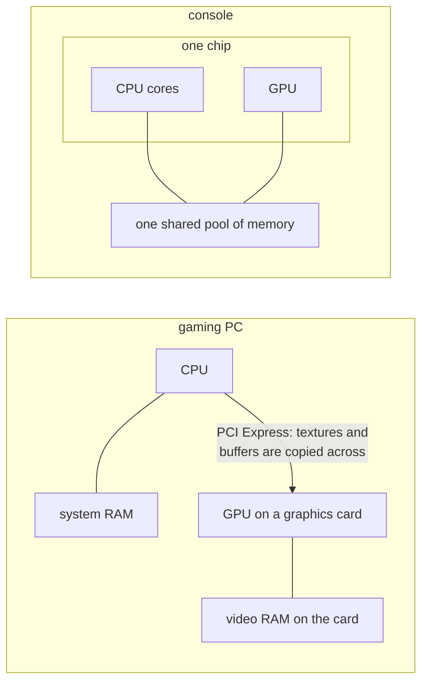
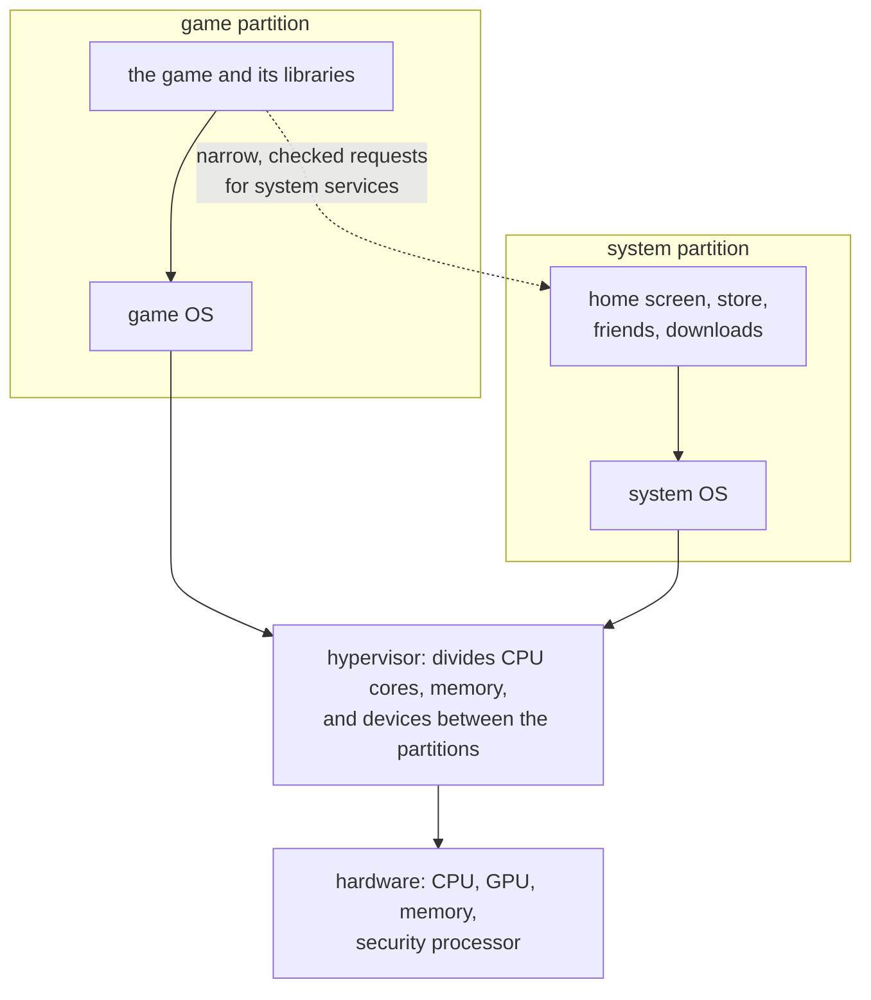
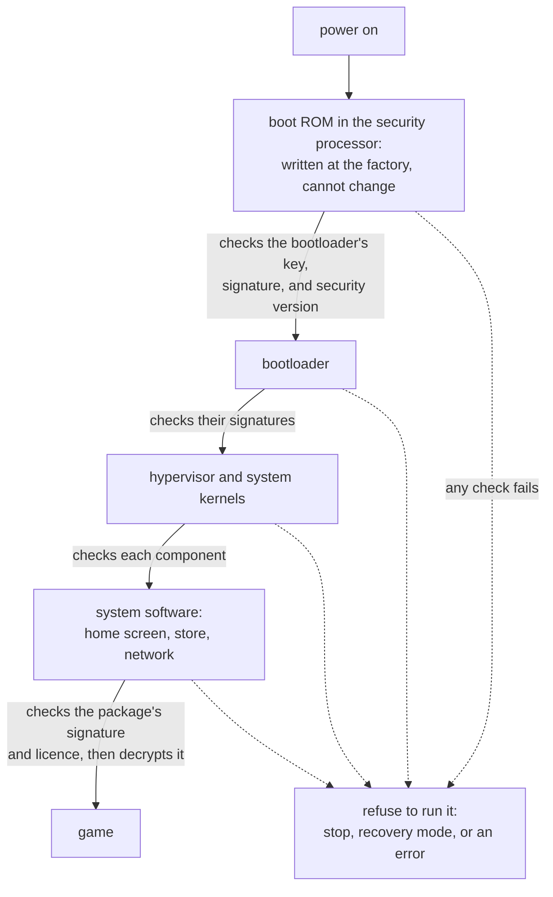
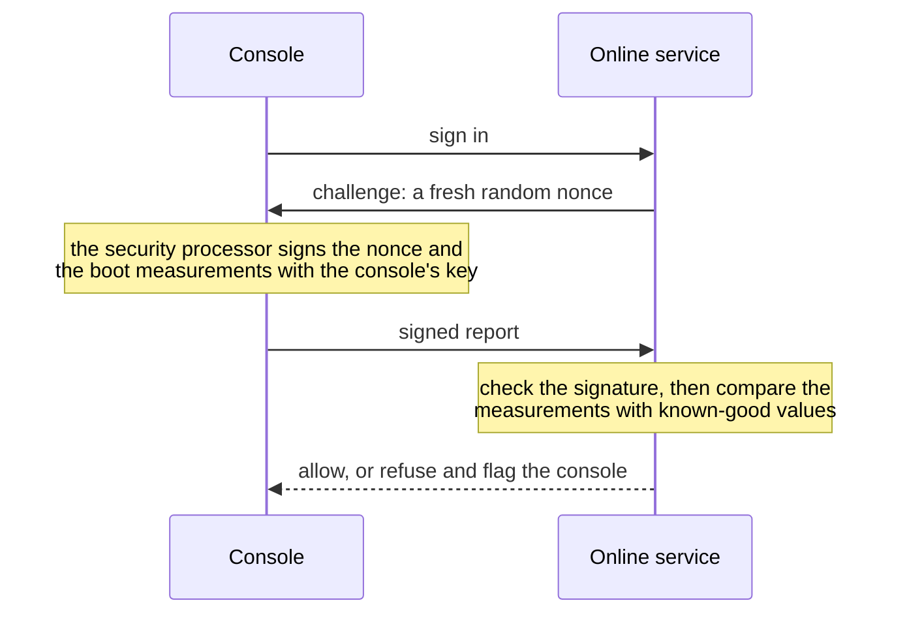

import MemoryStrip from '../../../../components/MemoryStrip.astro';
import Quiz from '../../../../components/Quiz.astro';

Open a current game console and you find parts a PC builder would recognise: a
processor, a graphics processor, memory, an SSD, and a network adapter. The
PlayStation 5 and the Xbox Series X even run the same x86-64 instruction set as
most PCs. Yet a PC runs whatever its owner installs, while a console runs only
what its maker has approved. Both facts come from design choices, and this
lesson follows them from the chip up.

## A fixed computer on one chip

Three well-known consoles:

| Console | Released | CPU | GPU | Memory |
|---|---|---|---|---|
| PlayStation 5 | 2020 | 8 AMD Zen 2 cores, x86-64 | AMD RDNA 2, 36 compute units | 16 GB GDDR6, shared |
| Xbox Series X | 2020 | 8 AMD Zen 2 cores, x86-64 | AMD RDNA 2, 52 compute units | 16 GB GDDR6, shared |
| Nintendo Switch | 2017 | Arm Cortex-A57 cores | Nvidia Maxwell-based | 4 GB LPDDR4, shared |

Two things in that table differ from a typical gaming PC.

First, the CPU cores and the GPU sit on the same piece of silicon. A chip that
holds most of a computer's parts is called a **system on a chip**, or **SoC**.

Second, the word "shared" in the memory column. A gaming PC gives the CPU
system RAM on the motherboard and gives the graphics card its own video RAM, so
anything the GPU needs, such as the textures and vertex buffers of
[Chapter 5](/pages/5/01/), is copied across the PCI Express bus. In a console,
the CPU and the GPU use one pool of memory: the CPU writes a buffer, and the GPU
reads the very same bytes. This design is called **unified memory**.

The shared pool has to satisfy its hungriest reader, the GPU, so consoles build
it from graphics memory. The PlayStation 5's memory bus is 256 bits wide, one
wire per bit, and each wire carries 14 billion bits per second. That is
256 × 14 = 3,584 billion bits per second, and dividing by 8 bits per byte gives
448 GB every second, for the CPU and GPU alike.

The third difference is not in the table because it is the table: every
PlayStation 5 has the same chip, the same memory, and the same clock speeds. A
PC game has to run on thousands of combinations of parts; a console game is
tuned for exactly one. At 60 frames per second, each frame gets
1,000 ms ÷ 60 ≈ 16.7 ms for all of its work, from game logic and physics to
rendering ([Lesson 1.10](/pages/1/10/)). A measurement on one console holds for
every console, so developers can spend that budget almost to the last
millisecond. They can even compile their shaders ahead of time for the one GPU
and ship the results on the disc, a luxury that emulators lack, as
[Lesson 14.6](/pages/14/06/#graphics-and-audio) shows.

Sharing the PC's instruction set does not make a console game a PC game,
though. Its machine code calls the console's own operating system and graphics
interfaces, such as a console version of Direct3D 12 on Xbox and Sony's own
interfaces on PlayStation, which is why moving a console game to PC is still
porting work.

## The software stack: a hypervisor and two partitions

When Microsoft introduced the Xbox One in 2013, it described the console as
running three operating systems at once: a hypervisor that owns the hardware, a
game partition that runs the current game, and a Windows-based partition for
the home screen and apps. Other consoles differ in the details, but the same
shape keeps appearing:

A **partition** here is a virtual machine in the sense of
[Lesson 14.3](/pages/14/03/): an operating system that sees only the cores,
memory, and devices the hypervisor gives it. The split pays for itself three
ways:

- **Predictable timing.** The game partition has CPU cores and memory reserved
  for it, so a background download cannot steal time from a frame. With 16.7 ms
  per frame, a background task that takes 2 ms at the wrong moment is a visible
  stutter.
- **Containment.** A bug in a game, such as a crash caused by a malformed save
  file, stays inside the game partition. The system partition's memory, where
  account tokens and purchase records live, is not even mapped into the game's
  address space.
- **Independent updates.** The system software can change without touching the
  game partition that thousands of shipped games depend on.

Most console chips also contain a small, separate **security processor**. It
starts before the main cores, holds the console's keys, and performs the checks
described next. The main cores never see those keys.

## Secure boot: a chain of trust

When a console powers on, which code runs first, and why should anyone trust it?
**Secure boot** answers with a **chain of trust**: each stage checks the digital
signature ([Lesson 9.7](/pages/9/07/)) of the next stage before running it, and
refuses if the check fails.

The first link is the **boot ROM**, a small program written into the chip when
it is manufactured, which no software, update, or owner can change. It is the
**root of trust**: every later stage is trusted only because an earlier stage
checked it, and the chain ends at the one piece of code that needs no check
because nobody can alter it.

Each check is a digital signature, the same mechanism Windows uses on programs:
the console maker signs every stage with a private key kept in its own
buildings, and the console checks each signature with the matching public key,
which can check signatures but cannot make them
([Lesson 9.7](/pages/9/07/#how-a-signature-is-made-and-checked) walks through
how). The boot ROM needs that public key to check the first signature, and the
key must be as unchangeable as the ROM. Chips keep such values in **eFuses**, the
one-time programmable bits of
[Lesson 14.4](/pages/14/04/#why-shipped-devices-lock-the-port). Each fuse is a
physical structure on the chip, so a 2,048-bit RSA public key would need 2,048
of them. Chips store a SHA-256 hash of the key instead, which is 256 bits and so
256 fuses, and the key itself travels in flash storage alongside the bootloader:

<MemoryStrip
  cells="security version=3|code length=65,536|public key=256 bytes|code=65,536 bytes|signature=256 bytes"
  groups="0-1:header|2:its hash must match the fuses|3:the next stage|4:signs the header and code"
  caption="A boot image in flash. With RSA-2048, the key and the signature are each 2,048 bits, which is 2,048 ÷ 8 = 256 bytes."
/>

Before it runs a single instruction of the bootloader, the boot ROM:

1. hashes the public key that came with the image and compares the result with
   the fused hash, since a mismatch means someone supplied their own key;
2. hashes the header and the code;
3. checks the signature against that hash using the now-trusted key;
4. checks the security version, described in the next section;
5. only then jumps to the code.

Each later stage repeats the pattern for the stage after it, with keys that the
earlier, already-checked stage vouches for. A bug in any later stage can
therefore be fixed by an update, because the stage before it checks the
replacement's signature like any other. A bug in the boot ROM cannot be fixed on
consoles already sold: nothing checks the ROM and nothing can rewrite it, so
only a new revision of the chip fixes it. This has happened to at least one
console family, whose early units remain modifiable for that reason alone.

<Quiz
  id="console-boot-rom-flaw"
  title="The one stage no update reaches"
  prompt="A flaw is found in one stage of a console's boot chain. Which stage's flaw cannot be fixed by a system update on consoles that are already sold?"
  options="The boot ROM||The bootloader||The system kernel||The game partition's OS"
  answer="0"
  explanation="The boot ROM is written into the chip at the factory and cannot be rewritten, and nothing runs before it to check it. Every later stage can be replaced by an update, because the stage before it verifies the new version's signature like any other. A boot ROM flaw is fixed only in new chips."
/>

## Anti-rollback: old versions stay dead

A signature proves who made the code, not that it is the latest version. If
version 4 of the bootloader fixes a security hole in version 3, version 3 is
still genuinely signed, and without another check anyone could reinstall it and
use its hole.

Consoles stop this with **anti-rollback**, a security version counter kept in
fuses. Each boot image carries a security version, and the boot code refuses any
image whose version is below the number of blown fuses:

<MemoryStrip
  cells="fuse 0=1|fuse 1=1|fuse 2=1|fuse 3=0|fuse 4=0|fuse 5=0|fuse 6=0|fuse 7=0"
  marks="0-2"
  caption="A bank of eight anti-rollback fuses. Three are blown, 1 + 1 + 1 = 3, so the minimum accepted security version is 3."
/>

When an update fixes a security hole, it raises the security version to 4 and
blows fuse 3, and from then on a version-3 image is refused. A fuse cannot be
unblown, so the minimum only ever rises. And because a bank of eight fuses can
count only to 8, makers raise the security version only for updates that fix a
security flaw, not for every update: each increase spends a fuse forever.

<Quiz
  id="console-anti-rollback"
  title="Genuine, signed, and refused"
  prompt="A console's anti-rollback fuses record a minimum security version of 3. It is offered a boot image that the platform holder genuinely signed, with security version 2. What happens?"
  options="The boot code refuses it, because 2 is below the fused minimum of 3||It runs, because the signature is valid||It runs, and the console blows another fuse||It runs only while the console is offline"
  answer="0"
  explanation="A signature proves who made the code, not that it is current. Version 2 may contain a hole that version 3 fixed, so the boot code compares the image's security version with the count of blown fuses and refuses anything lower, however genuine its signature."
/>

## Code signing and encrypted game packages

The chain does not stop at boot. Everything a console runs, including system
updates, apps, and every game, must carry the platform holder's signature, which
the system software checks before launching it. Unsigned code simply does not
run. On Windows, by contrast, an Authenticode signature
([Lesson 9.7](/pages/9/07/)) is optional for ordinary programs, and an unsigned
program runs after a warning, because the owner decides.

Game packages are also encrypted, and the two protections do different jobs
([Lesson 9.8](/pages/9/08/)). The signature proves that the package came,
unchanged, from the platform holder. The encryption hides the contents, so the
code cannot be read, or copied to run elsewhere, outside a console holding the
right keys. Those keys stay inside the security processor, which decrypts
content for the game without ever handing the keys to the game or to the system
software. Digital purchases add a licence check before anything is decrypted.

Signing everything has a consequence for memory. Code that a program writes for
itself at run time was never signed, so consoles generally do not let ordinary
games mark memory as both writable and executable, the combination that
[Lesson 10.5](/pages/10/05/) treats as a place where data can become code. That
rule returns in [Lesson 14.6](/pages/14/06/#interpreters-and-dynamic-recompilers),
because an emulator's fastest technique needs exactly that combination.

## Why a console is harder to modify than a PC

| Question | Typical PC | Typical console |
|---|---|---|
| Who decides which code may run? | the owner, as administrator | the platform holder, through signatures |
| Where does trust start? | firmware whose Secure Boot keys the owner can change or switch off | a boot ROM and a fused key hash that nobody can change |
| Can the owner debug a running game? | yes, as Chapters 2 and 7 do | no; that needs a development kit |
| Who holds the storage keys? | the owner, if the disk is encrypted at all | the security processor, never software |
| Can old system software be reinstalled? | usually | no; anti-rollback fuses refuse it |

The deeper difference is whose interests the protections serve. A PC's security
defends its owner against other people: malware, other users, network
attackers. The owner is the administrator and may switch any of it off. A
console's security also defends the platform holder and game publishers against
the owner: against copying games, against cheating in online play, and against
running unapproved software. So a console is built so that its owner cannot
switch the protections off, down to debug ports locked with fuses
([Lesson 14.4](/pages/14/04/#why-shipped-devices-lock-the-port)).

Game developers still need to debug. Licensed studios receive **development
kits**: consoles with debugging enabled and different keys, which run unsigned
test builds. A retail console lacks those permissions by design.

## Why online services ban modified consoles

An online service decides whether to let a console into matchmaking, the store,
and cloud saves. It cannot look inside the console, so it needs the console to
prove what software it booted. That proof is called **remote attestation**:

As each boot stage runs, it records a hash of the next stage before starting it.
Those hashes, called **measurements**, describe exactly what booted. The
security processor signs the service's nonce together with the measurements,
using a key unique to that console, fused at the factory, that no software can
read. The service checks the signature and compares the measurements with the
values genuine software produces. Console makers do not publish their exact
protocols, but PCs with a TPM security chip use the same idea, called measured
boot.

A console running modified software cannot produce a valid report. The modified
software cannot reach the key, and it cannot make the measurements match
software it is not. Why ban the console rather than just ignore the report? A
modified console can run cheats in matches with other people, run pirated games,
and send the service messages that genuine software never would, so nothing it
says can be trusted. Banning it by its unique ID, and sometimes the account,
protects other players and the store. The ban is the service's decision under
the terms of service the owner accepted, not a technical malfunction.

Attestation is one layer, not the whole defence. Well-designed online games
still check every action on the server, as [Chapter 6](/pages/6/01/) describes,
because no check on the client is perfect. A server that believes a console's
claim about where a player is standing has the same weakness as one that
believes a PC's.

## Homebrew and the law

**Homebrew** is software written by hobbyists for a platform without the
platform holder's licence: games, tools, media players, and emulators. Its
position is contested, and it is worth describing precisely rather than taking a
side.

Platform holders have sometimes opened official doors. In the late 1990s Sony
sold the Net Yaroze, a black PlayStation that hobbyists could program. The
PlayStation 3's "Other OS" feature let owners install Linux until a 2010 system
update removed it. Microsoft's Developer Mode turns a retail Xbox into a limited
development kit for apps, for anyone with a developer account.

Because a console runs only signed code, unofficial homebrew depends on a flaw
somewhere in the chain of trust. Platform holders treat exploiting such a flaw as
circumvention. They patch it, ban consoles detected online running modified
software, and have sued, and in some cases seen prosecuted, people who sold
modification devices commercially. Many countries have anti-circumvention laws,
such as section 1201 of the US Digital Millennium Copyright Act and Article 6 of
the EU's 2001 Copyright Directive. These make it unlawful to break technical
measures that protect copyrighted works, with exemptions that vary by country
and by kind of device. Running pirated games is copyright infringement however
the console was modified.

On the other side, homebrew developers and some researchers argue that owners
should be able to run their own code on hardware they bought, and that
preserving old software depends on it. Where the line falls depends on the
country, the device, and exactly what is done, and this lesson is not legal
advice.

This book stays out of that territory: none of its labs modify a console.
[Lesson 14.6](/pages/14/06/) studies console software from the other side, with
an emulator running on your own PC and programs you are allowed to run.
