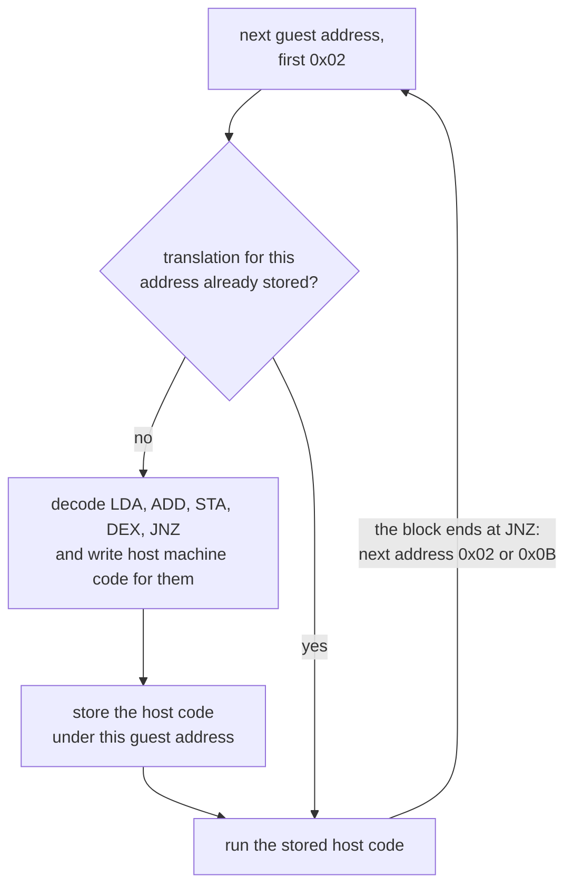
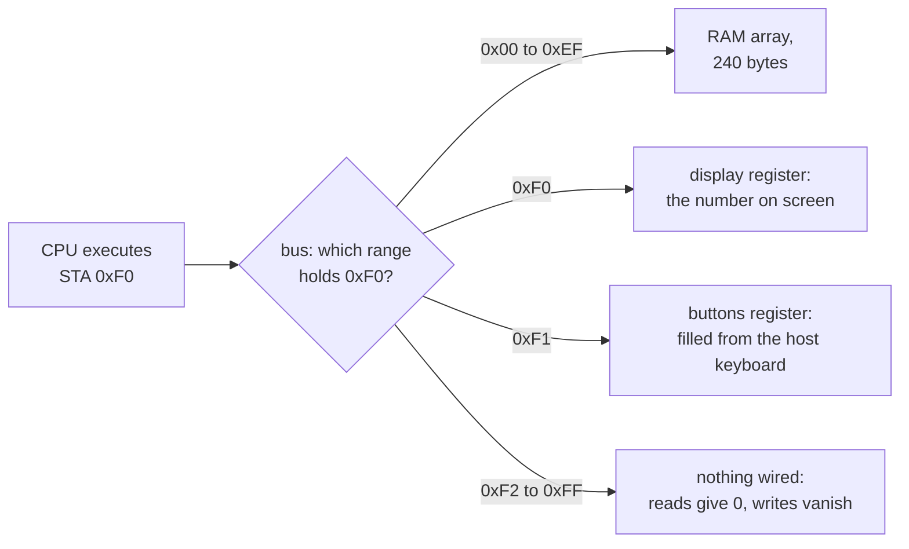

import MemoryStrip from '../../../../components/MemoryStrip.astro';
import Quiz from '../../../../components/Quiz.astro';

[Lesson 1.11](/pages/1/11/) promised that an emulator is a program whose data is
the software of an entire other computer. This lesson keeps the promise. An
**emulator** is a program that imitates another computer's hardware closely
enough that software written for that computer runs on it unchanged. The
imitated machine and its software are the **guest**; the computer running the
emulator is the **host**.

[Lesson 12.7](/pages/12/07/) built a virtual machine for bytecode that was
designed to be interpreted. An emulator interprets machine code that was
designed for a real chip, and it has to reproduce whatever that chip does,
including its quirks.

## The loop at the heart of every CPU

[Lesson 2.2](/pages/2/02/) described the cycle a CPU repeats: fetch the bytes at
the instruction pointer, decode them, execute, and move on. In a real CPU,
circuits do that. In an emulator, a loop does:

```text
loop:
    opcode = memory[pc]       fetch the byte the program counter points at
    pc = pc + 1               move past it
    decode opcode             work out which instruction it is
    execute it                change registers, memory, and flags
    add its cycles            keep time
```

The **program counter**, or PC, holds the address of the next byte to fetch; x86
calls the same register the instruction pointer. An emulator that runs this loop
once per guest instruction is an **interpreter**. Everything else in this lesson
is either a faster way to run the loop or a way to imitate the rest of the
machine around it.

## A toy 8-bit CPU

The lab's CPU is made up, but it is built like the 8-bit processors in 1980s
consoles. It has four registers:

- **PC**, 8 bits, the program counter. Eight bits can name 2⁸ = 256 addresses,
  `0x00` to `0xFF`, so the whole machine has 256 addresses.
- **A**, 8 bits, the accumulator, where arithmetic happens.
- **X**, 8 bits, a second register, used here as a loop counter.
- **Z**, 1 bit, the **zero flag**: 1 when the last result was zero, 0 otherwise.

It understands seven instructions. The first byte of each, the **opcode**, says
which instruction it is; some instructions carry a second byte, the operand:

| Bytes | Written as | Length | What it does | Cycles |
|---|---|---:|---|---|
| `01 n` | `LDX #n` | 2 | X = n; Z = 1 if X is 0 | 2 |
| `02 a` | `LDA a` | 2 | A = the byte at address a; Z = 1 if A is 0 | 3 |
| `03 n` | `ADD #n` | 2 | A = A + n, wrapping past 255 back to 0; Z = 1 if A is 0 | 2 |
| `04 a` | `STA a` | 2 | store A at address a | 3 |
| `05` | `DEX` | 1 | X = X − 1, wrapping below 0 to 255; Z = 1 if X is 0 | 1 |
| `06 a` | `JNZ a` | 2 | if Z is 0, jump: PC = a | 2, or 3 if it jumps |
| `FF` | `HLT` | 1 | stop | 1 |

A `#` marks an **immediate**: `#5` means the number 5 itself, while an operand
without `#` is an address, and the instruction uses the byte stored there. `STA`
and `JNZ` leave Z alone. Every other byte value is not an instruction, and the
lab reports it as an error instead of guessing.

A **cycle** is one tick of the CPU's clock, and every number in the last column
comes from one rule: the CPU spends one cycle on each memory access, meaning
each instruction byte it fetches and each data byte it reads or writes, plus one
extra cycle when a jump is taken, to load the new address into PC. So `LDX #n`
fetches 2 bytes, 2 cycles; `LDA a` fetches 2 and reads 1, 3 cycles; `STA a`
fetches 2 and writes 1, 3 cycles; `DEX` fetches 1, 1 cycle; `JNZ a` fetches 2,
plus 1 if it jumps. Real 8-bit CPUs, such as the 6502 inside the NES, have
similar costs for similar reasons.

## The program in memory

The program adds 5 gold twice and then shows the total on the console's
display. Gold lives at address `0x80` and starts at 10:

```text
address  bytes   instruction   meaning
0x00     01 02   LDX #2        X = 2: go round the loop twice
0x02     02 80   LDA 0x80      A = gold
0x04     03 05   ADD #5        A = A + 5
0x06     04 80   STA 0x80      gold = A
0x08     05      DEX           X = X - 1
0x09     06 02   JNZ 0x02      back to 0x02 while X is not 0
0x0B     04 F0   STA 0xF0      show A on the display
0x0D     FF      HLT           stop
```

Each address is the one before it plus that instruction's length:
`0x00` + 2 = `0x02`, and so on down to `0x08` + 1 = `0x09`,
`0x09` + 2 = `0x0B`, and `0x0B` + 2 = `0x0D`. The last byte sits at `0x0D`,
which is 13, so the program fills addresses 0 to 13, which is 14 bytes:

<MemoryStrip
  cells="0x00=01|=02|0x02=02|=80|0x04=03|=05|0x06=04|=80|0x08=05|0x09=06|=02|0x0B=04|=F0|0x0D=FF"
  groups="0-1:`LDX #2`|2-3:`LDA 0x80`|4-5:`ADD #5`|6-7:`STA 0x80`|8:`DEX`|9-10:`JNZ 0x02`|11-12:`STA 0xF0`|13:`HLT`"
  caption="The program as it sits in RAM, one byte per box. Nothing marks where one instruction ends; the CPU knows each instruction's length from its opcode."
/>

The program and its data share one memory, as they do in every
stored-program computer. At power-on the machine looks like this:

<MemoryStrip
  cells="PC=0x00|A=0|X=0|Z=0|0x80 · gold=10"
  groups="0-3:CPU registers|4:RAM"
  caption="Before step 1: every register is 0, and gold at `0x80` holds 10, which is `0x0A`."
/>

## Trace the program

The first pass goes from power-on through the jump back:

| Step | PC | Instruction | What happens | A | X | Z | Gold | Cycles |
|---:|---|---|---|---:|---:|---:|---:|---|
| 1 | `0x00` | `LDX #2` | X = 2, not 0, so Z = 0 | 0 | 2 | 0 | 10 | 0 + 2 = 2 |
| 2 | `0x02` | `LDA 0x80` | A = the byte at `0x80`, 10 | 10 | 2 | 0 | 10 | 2 + 3 = 5 |
| 3 | `0x04` | `ADD #5` | A = 10 + 5 = 15 | 15 | 2 | 0 | 10 | 5 + 2 = 7 |
| 4 | `0x06` | `STA 0x80` | gold = A = 15 | 15 | 2 | 0 | 15 | 7 + 3 = 10 |
| 5 | `0x08` | `DEX` | X = 2 − 1 = 1, not 0, so Z = 0 | 15 | 1 | 0 | 15 | 10 + 1 = 11 |
| 6 | `0x09` | `JNZ 0x02` | Z is 0, so PC = `0x02` | 15 | 1 | 0 | 15 | 11 + 3 = 14 |

The second pass repeats the loop body, and this time the counter runs out:

| Step | PC | Instruction | What happens | A | X | Z | Gold | Cycles |
|---:|---|---|---|---:|---:|---:|---:|---|
| 7 | `0x02` | `LDA 0x80` | A = the byte at `0x80`, 15 | 15 | 1 | 0 | 15 | 14 + 3 = 17 |
| 8 | `0x04` | `ADD #5` | A = 15 + 5 = 20 | 20 | 1 | 0 | 15 | 17 + 2 = 19 |
| 9 | `0x06` | `STA 0x80` | gold = A = 20 | 20 | 1 | 0 | 20 | 19 + 3 = 22 |
| 10 | `0x08` | `DEX` | X = 1 − 1 = 0, so Z = 1 | 20 | 0 | 1 | 20 | 22 + 1 = 23 |
| 11 | `0x09` | `JNZ 0x02` | Z is 1, no jump | 20 | 0 | 1 | 20 | 23 + 2 = 25 |
| 12 | `0x0B` | `STA 0xF0` | the display shows 20 | 20 | 0 | 1 | 20 | 25 + 3 = 28 |
| 13 | `0x0D` | `HLT` | stop | 20 | 0 | 1 | 20 | 28 + 1 = 29 |

In hex, 15 is `0x0F` and 20 is 1 × 16 + 4 = `0x14`. At step 11, fetching `JNZ`
and its operand has already moved PC from `0x09` to `0x09` + 2 = `0x0B`, so not
jumping needs no extra work: the next instruction is simply the next one.

The whole run takes 29 cycles: 2 for `LDX`, then 3 + 2 + 3 + 1 + 3 = 12 for the
first pass, 3 + 2 + 3 + 1 + 2 = 11 for the second, and 3 + 1 = 4 for the ending.
2 + 12 + 11 + 4 = 29. When the machine stops, it looks like this:

<MemoryStrip
  cells="PC=0x0E|A=20|X=0|Z=1|0x80 · gold=20|0xF0 · display=20"
  groups="0-3:CPU registers|4:RAM|5:I/O"
  caption="After `HLT`. PC is `0x0E`, one past the `HLT` at `0x0D`, because fetching the opcode moved it on."
/>

<Quiz
  id="emulator-jnz-falls-through"
  title="Why the loop ends"
  prompt="At step 11 of the trace, `JNZ 0x02` does not jump. Why not?"
  options="DEX at step 10 made X zero, which set Z to 1||A holds 20, which is not zero||0x02 is not a valid jump target||JNZ can only jump once per program"
  answer="0"
  explanation="`JNZ` jumps only while Z is 0, and Z records whether the last result was zero. The instruction just before it, `DEX`, computed X = 1 − 1 = 0, so Z became 1. `ADD` sets Z too, but `DEX` ran after it, and neither `STA` nor `JNZ` changes Z."
/>

## The interpreter in Rust

The lab's `step` function is that trace, as code. It fetches the opcode,
decodes it, and runs one arm of a `match`. Each arm's last value is the
instruction's cost in cycles:

```rust
fn step(&mut self) -> Result<u8, EmuError> {
    if self.cpu.halted {
        return Ok(0);
    }
    let at = self.cpu.pc;
    let opcode = self.fetch();
    let instruction = Opcode::decode(opcode).ok_or(EmuError::IllegalOpcode { at, opcode })?;
    let cycles = match instruction {
        Opcode::Lda => {
            let address = self.fetch();
            self.cpu.a = self.read(address);
            self.cpu.zero = self.cpu.a == 0;
            3
        }
        Opcode::Jnz => {
            let target = self.fetch();
            if self.cpu.zero {
                2
            } else {
                self.cpu.pc = target;
                3
            }
        }
        // The other five arms follow the same pattern.
    };
    self.cpu.cycles += u64::from(cycles);
    Ok(cycles)
}
```

`fetch` reads the byte at PC and adds 1 to PC, so each call consumes one byte of
the instruction. `Opcode::decode` is a `match` on the byte that returns `None`
for anything that is not an instruction, and the `?` turns that into an
`IllegalOpcode` error that names the address. A real CPU meeting an unknown
opcode might raise an exception, as x86 does, or do something undocumented. An
emulator that guessed would hide bugs in the guest program and in itself.

## Interpreters and dynamic recompilers

An interpreter pays for fetching and decoding every time an instruction runs,
typically many host instructions for each guest instruction. The loop body
above is five instructions, from `LDA` to `JNZ`. If it ran 1,000 times instead
of twice, the interpreter would decode 5 × 1,000 = 5,000 instructions, although
only five different ones exist.

A **dynamic recompiler**, also called a **JIT** (just-in-time compiler), removes
most of that repetition. The first time guest code runs, it translates it into
host machine code and stores the translation; every later time, it runs the
stored host code directly. It translates a **block**, a run of instructions that
ends at a jump, because after a jump the next instruction could be anywhere. The
loop body, from `0x02` to `0x0A`, is one block:



With a recompiler, those 1,000 passes cost 5 decodes and 1,000 runs of native
code instead of 5,000 decodes. Consoles whose CPUs execute hundreds of millions
of instructions per second, such as the GameCube and the PlayStation 2, are
emulated with recompilers, as in the Dolphin and PCSX2 emulators, because an
interpreter cannot keep up.

The speed has two costs:

- **Self-modifying code.** Code is data, so a guest program may overwrite its
  own instructions. A stored translation then describes code that no longer
  exists. The recompiler must notice writes to addresses it has translated and
  throw those translations away.
- **Writable, then executable memory.** A recompiler writes host machine code
  into memory and then runs it. [Lesson 14.5](/pages/14/05/) showed that
  consoles, and some phone platforms, refuse ordinary programs exactly that
  combination. Emulators on those platforms have to interpret.

<Quiz
  id="emulator-stale-translation"
  title="When code changes under a recompiler"
  prompt="A recompiler has translated the loop block from `0x02` to `0x0A`. The guest program then stores a new byte at `0x05`, the operand of `ADD #5`. What must the emulator do before the block runs again?"
  options="Throw away the stored translation that covers 0x05 and translate the block again||Nothing, because the stored translation is still correct||Run the old translation once more, then translate again||Stop the guest, because code is not allowed to change"
  answer="0"
  explanation="The stored host code still adds 5, which no longer matches the guest's memory. Code is data, and a guest may legally rewrite its own instructions, so the recompiler has to watch for writes to translated addresses and discard those translations. Otherwise the emulated program runs code that no longer exists."
/>

## The memory map and memory-mapped I/O

The toy console has 256 addresses, but not all of them are RAM. Its **memory
map** says what answers at each address:

| Addresses | What answers |
|---|---|
| `0x00` to `0xEF` | RAM: `0xF0` = 15 × 16 = 240 bytes |
| `0xF0` | the display: writing a byte here shows it on the screen |
| `0xF1` | the buttons: reading here returns which buttons are held |
| `0xF2` to `0xFF` | nothing: reads give 0, and writes vanish |

A device that answers at an address this way uses **memory-mapped I/O**. To the
CPU, step 12's `STA 0xF0` is an ordinary store. The address alone decides that
the byte goes to the display instead of RAM. In hardware, address-decoding
circuits make that choice. In the emulator, one function does, and every read
the CPU makes goes through it:

```rust
fn read(&self, address: u8) -> u8 {
    match address {
        0x00..=0xEF => self.ram[usize::from(address)],
        DISPLAY => self.display,
        BUTTONS => self.buttons,
        _ => 0, // 0xF2 to 0xFF: nothing is wired there
    }
}
```



Real consoles work the same way on a larger scale. The NES has 2 KiB of RAM at
`0x0000` to `0x07FF`; `0x0800` is 8 × 256 = 2,048 bytes. Its address decoder
ignores the top address bits for RAM, so the same 2,048 bytes answer again at
`0x0800`, `0x1000`, and `0x1800`: the range up to `0x2000`, which is 8,192
bytes, holds 8,192 ÷ 2,048 = 4 copies. This is called **mirroring**. The picture
chip's registers start at `0x2000`, and the controllers answer at `0x4016` and
`0x4017`. An NES emulator's `read` is a bigger version of the one above.

## Timing and cycle counting

Inside a real console, the CPU, the picture chip, and the sound chip all run at
the same time, each from its own clock. Older games depended on that timing
exactly. A game might change a picture-chip register partway down the screen to
split it into a scrolling playfield and a fixed status bar; if the emulated CPU
reaches that write too early or too late, the split lands on the wrong line. So
emulators count cycles and keep the parts in step: run the CPU for a slice of
cycles, advance the other chips by the same amount of time, and repeat.

Suppose the toy console's clock runs at 1.2 MHz, which is 1,200,000 cycles per
second, and the screen redraws 60 times a second. Each frame then lasts
1,200,000 ÷ 60 = 20,000 cycles. The emulator's frame loop runs instructions
until 20,000 cycles are used, draws the frame, and waits until 1/60 of a second
of real time has passed, so the game plays at its original speed on a host that
could run it thousands of times faster.

An instruction cannot stop halfway, so a frame can run past its budget. The lab
shows this with a tiny budget of 18 cycles on the traced program. After step 7
it has used 17 cycles, which is less than 18, so it runs step 8, an `ADD` worth
2 cycles, and reaches 19. That is at least 18, so the frame ends. It overshot by
19 − 18 = 1 cycle, and the emulator gives the next frame 18 − 1 = 17 cycles,
which keeps the long-run average at exactly 18 per frame. The overshoot can
never exceed 2: the frame's last instruction starts with at most 17 cycles used
and costs at most 3, and 17 + 3 = 20 = 18 + 2.

Here is the machine at that frame boundary:

<MemoryStrip
  cells="PC=0x06|A=20|X=1|Z=0|0x80 · gold=15"
  marks="1|4"
  groups="0-3:CPU registers|4:RAM"
  caption="Where the 18-cycle budget stops. The new total, 20, exists only in A; gold in RAM still says 15 until `STA` at `0x06` runs."
/>

## Graphics and audio

Consoles of the 8-bit and 16-bit eras had a dedicated picture chip that built
each frame line by line from **tiles**, small blocks of pixels, and **sprites**,
movable images, kept in video memory, in step with the television's scanning
beam. An emulator imitates that chip's rules, writes the resulting pixels into
an array called a **framebuffer**, and hands the array to the host's GPU as a
texture, one of the objects [Chapter 5](/pages/5/01/) observes.

3D consoles are harder. Their GPUs run command lists and shaders written for
that GPU's own design, so the emulator translates the guest's commands into a
host graphics interface such as Vulkan or Direct3D, and the guest's shaders into
host shaders. That translation happens while the game runs, the first time each
effect appears, which is why emulated games can stutter the first time they show
something new, and why emulators keep a cache of translated shaders. The
original console never had this problem, because its games shipped shaders
already compiled for its one GPU ([Lesson 14.5](/pages/14/05/)).

Sound works the same way in a different currency. The guest's sound chip
produces a stream of **samples**, numbers that describe the sound wave, and a
typical host plays 48,000 of them per second. At 60 frames per second the
emulator must therefore produce 48,000 ÷ 60 = 800 samples every frame. Audio is
the least forgiving part of the machine. A late video frame just leaves the
previous picture up a moment longer, but if the samples run out, the speakers
click and crackle. Many emulators pace themselves by the audio device for that
reason.

## Save states: the whole machine as bytes

A **save state** is everything the machine is, written out: every register, all
of RAM, the I/O registers, and the emulator's own timing position. Loading one
overwrites all of it, so the machine carries on as though nothing had happened.
A game's own save file, like the ones in [Lesson 9.2](/pages/9/02/), stores only
what the game chooses, in the game's format. A save state works for any game, at
any instant, even in the middle of a frame.

The frame boundary above shows why the registers matter. At that instant the
new gold total exists only in A, so a snapshot of RAM alone would restore
gold = 15 and lose the 20. The lab's save state stores every part:

<MemoryStrip
  cells="PC=0x06|A=20|X=1|Z=0|halted=0|cycles=19|RAM=240 bytes|display=0|buttons=0"
  groups="0-3:CPU registers|4-5:emulator bookkeeping|6:all of RAM|7-8:I/O registers"
  caption="The lab's save state at the frame boundary. As bytes: 5 for PC, A, X, Z, and halted, 8 for the cycle count, 240 for RAM, and 2 for the I/O registers, so 5 + 8 + 240 + 2 = 255."
/>

Reading a save state back is parsing input from outside the program, so the lab
checks it the way Lesson 9.2 checks a save file: the data must be exactly 255
bytes, and the two flag bytes must be 0 or 1. Real emulators also store a
version number, because the layout changes as the emulator does, and a state
saved by one version may not load in another.

## Why emulated games are easy to inspect

Chapters 1 and 2 needed scanners, debuggers, and pointer paths because Windows
keeps each process's memory private and moves things around. An emulator
removes both obstacles.

- **The guest's RAM is one array.** The emulator can display it, search it, and
  change it directly. A RAM search in an emulator is the scan of
  [Lesson 1.8](/pages/1/08/), keeping the candidates whose value changed as
  expected, run over the guest's RAM: 2,048 bytes on an NES, instead of the
  gigabytes a PC game can occupy.
- **Addresses do not move.** Old consoles have no virtual memory and no ASLR
  ([Lesson 2.8](/pages/2/08/)), and their games keep variables at fixed
  addresses. Gold found at an address today is at the same address tomorrow, and
  on every other copy of the same game, with no pointer path
  ([Lesson 2.9](/pages/2/09/)) needed.
- **The emulator is already a debugger.** Every guest memory access passes
  through the emulator's `read` and `write`. A watchpoint on gold is one `if`
  in `write` that checks the address and records PC. That is the answer the
  debug registers of [Lesson 2.3](/pages/2/03/) gave, with no debug registers
  involved.

Fixed addresses are also what made commercial cheat devices possible. The Game
Genie sat between the cartridge and the console, and whenever the console read a
particular cartridge address, it substituted a different byte, patching the
game's code or data as it was read. Action Replay and GameShark codes worked on
RAM instead, writing a chosen value to a chosen address once every frame. A
cheat code of that second kind is just an address and a value.

The lab implements the second kind, and it reproduces the way such codes fail.
With the 18-cycle frames, a cheat writes 99 to gold at the end of frame 1. But
the game had already copied gold into A, so at the start of frame 2, step 9
stores A's 20 over the 99, and step 12 shows 20 on the display. The cheat writes
99 again at the end of frame 2, so RAM holds 99 while the screen says 20. A game
that keeps a value in a register, or recomputes it from other data, beats a
once-per-frame write.

All of this is for single-player games played alone. An emulator that plays
online with other people, or that submits scores to a shared leaderboard, is
part of a multiplayer service, and the same limits apply as everywhere else in
this book.

## The legal line

Writing and using an emulator is legal in many countries. In the United States,
a 2000 appeals court decision in *Sony v. Connectix* held that copying the
PlayStation's BIOS during reverse engineering, in order to build a compatible
emulator, was fair use. A 1992 decision had already found the Game Genie lawful,
because it changed a game only while the owner played it.

What the emulator runs is a different matter. A console's BIOS or system
firmware and its games are copyrighted, and downloading them from the internet
is generally copyright infringement. Emulator projects that shipped decryption
keys or firmware, or that were promoted for piracy, have been sued, and some
have shut down. Several emulators avoid needing the original firmware by
replacing it with their own code.

That leaves plenty to run legitimately:

- **homebrew** games that their authors release for anyone to play;
- public-domain or freely licensed programs;
- test programs that emulator developers write to check CPU and video behaviour;
- dumps you make yourself of games you own, where your country's law allows
  making them.

This lesson's lab sidesteps the question entirely: it emulates a machine that
does not exist, running a program written for this page.

## Run the toy console

The portable lab
[`toy_emulator_lab.rs`](/rust-labs/src/bin/toy_emulator_lab.rs) is the console
from this lesson: the CPU, the 240 bytes of RAM, the display and buttons
registers, the `step` interpreter, a `run` loop with a cycle budget, frames with
constant-write cheats, and a `SaveState` that copies the registers and memory and
converts them to and from 255 bytes.

Build it, then run it from the `rust-labs` folder:

```powershell
cargo run --bin toy_emulator_lab
```

The lab first runs the traced program one instruction at a time and prints the
same numbers as the tables above. Then it stops a run at the 18-cycle boundary,
takes a save state, runs to the end, loads the state, and runs again, arriving
at an identical machine. Finally, it runs two frames with the gold cheat and
shows RAM at 99 while the display says 20. The tests check every one of the 13
trace steps, both costs of `JNZ`, wrapping at 255, the budget stop, the save
state's round trip through 255 bytes, the rejection of damaged save states and
unknown opcodes, and the cheat's race with register A.

Then give the console a watchpoint: a `watch: Option<u8>` field, and an `if` in
`write` that records `self.cpu.pc` whenever the watched address is written.
Before you run the traced program with gold watched, predict which PC values it
records and why they are not `0x06`, the address of the `STA`.
