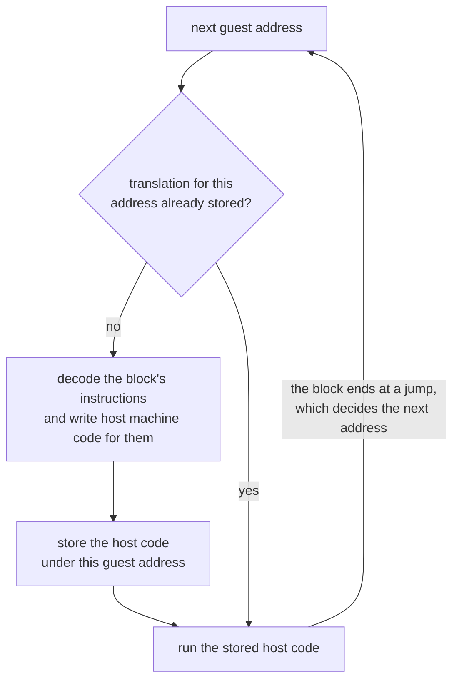
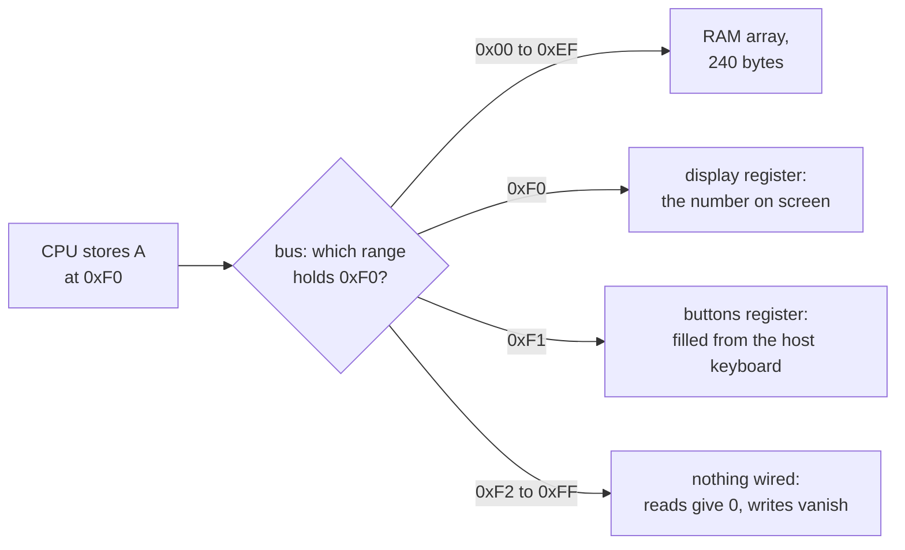

import MemoryStrip from '../../../../components/MemoryStrip.astro';
import Quiz from '../../../../components/Quiz.astro';

[Lesson 1.11](/pages/1/11/) promised that an emulator is a program whose data is
the software of an entire other computer. This lesson keeps the promise. An
**emulator** is a program that imitates another computer's hardware closely
enough that software written for that computer runs on it unchanged. The
imitated machine and its software are the **guest**; the computer running the
emulator is the **host**.

[Lesson 12.7](/pages/12/07/) built a virtual machine for bytecode that was
designed to be interpreted. An emulator interprets machine code that was
designed for a real chip, and it has to reproduce whatever that chip does,
including its quirks.

## The loop at the heart of every CPU

[Lesson 2.2](/pages/2/02/) described the steps a CPU repeats: fetch the bytes at
the instruction pointer, decode them, execute, and move on. In a real CPU,
circuits do that. In an emulator, a loop does:

```text
loop:
    opcode = memory[pc]       fetch the byte the program counter points at
    pc = pc + 1               move past it
    decode opcode             work out which instruction it is
    execute it                change registers, memory, and flags
    add its cycles            keep time
```

The **program counter**, or PC, holds the address of the next byte to fetch; x86
calls the same register the instruction pointer. The last line counts
**cycles**, ticks of the guest CPU's clock, so the emulator knows how long the
real chip would have taken. An emulator that runs this loop once per guest
instruction is an **interpreter**. Everything else in this lesson is either a
faster way to run the loop or a way to imitate the rest of the machine around
it.

## One instruction through the loop

To watch the loop work, take a made-up 8-bit console, the one
[Lesson 14.11](/pages/14/11/) emulates in full. Like the processors in 1980s
consoles, its CPU has a program counter and a few small registers, and it does
its arithmetic in one called A, the **accumulator**. Each instruction is one or
two bytes long. The first byte, the **opcode**, says which instruction it is;
some instructions carry a second byte, the **operand**.

The bytes `03 05` mean `ADD #5`: add the number 5 to A. Suppose they sit at
addresses `0x04` and `0x05`, PC holds `0x04`, and A holds 10:

<MemoryStrip
  cells="PC=0x04|A=10|0x04=03|0x05=05"
  groups="0-1:CPU registers|2-3:`ADD #5` in memory"
  caption="Before the loop runs: PC points at the opcode `03`, and A holds 10."
/>

One pass of the loop does four things:

1. **Fetch**: read the byte at PC, `03`, and add 1 to PC, making it `0x05`.
2. **Decode**: `03` is `ADD`, which takes one operand byte.
3. **Execute**: fetch the operand, `05`, which adds 1 to PC again and makes it
   `0x06`. Then set A = 10 + 5 = 15.
4. **Keep time**: this CPU spends one cycle on every byte it reads or writes in
   memory. `ADD #5` read two bytes, so it costs 2 cycles.

<MemoryStrip
  cells="PC=0x06|A=15|0x04=03|0x05=05"
  marks="0-1"
  groups="0-1:CPU registers|2-3:`ADD #5` in memory"
  caption="After one pass: A holds 15, and PC = `0x04` + 2 = `0x06`, the first byte of the next instruction."
/>

Nothing in memory marks where one instruction ends and the next begins. The CPU
knows each instruction's length from its opcode, and fetching the bytes moves PC
past them, so PC lands on the next instruction without any extra work.
[Lesson 14.11](/pages/14/11/#a-toy-8-bit-cpu) lists all seven instructions of
this CPU, loads a 14-byte program, and follows it instruction by instruction.

## Interpreters and dynamic recompilers

An interpreter pays for fetching and decoding every time an instruction runs,
typically many host instructions for each guest instruction. Suppose a loop of
five guest instructions runs 1,000 times. The interpreter decodes
5 × 1,000 = 5,000 instructions, although only five different ones exist.

A **dynamic recompiler**, also called a **JIT** (just-in-time compiler), removes
most of that repetition. The first time guest code runs, it translates it into
host machine code and stores the translation; every later time, it runs the
stored host code directly. It translates a **block**, a run of instructions that
ends at a jump, because after a jump the next instruction could be anywhere:



With a recompiler, the 1,000 passes of that loop cost 5 decodes and 1,000 runs
of native code instead of 5,000 decodes. Consoles whose CPUs execute hundreds of
millions of instructions per second, such as the GameCube and the PlayStation 2,
are emulated with recompilers, as in the Dolphin and PCSX2 emulators, because an
interpreter cannot keep up.

The speed has two costs:

- **Self-modifying code.** Code is data, so a guest program may overwrite its
  own instructions. A stored translation then describes code that no longer
  exists. The recompiler must notice writes to addresses it has translated and
  throw those translations away.
- **Writable, then executable memory.** A recompiler writes host machine code
  into memory and then runs it.
  [Lesson 14.5](/pages/14/05/#code-signing-and-encrypted-game-packages) showed
  that consoles, and some phone platforms, refuse ordinary programs exactly that
  combination. Emulators on those platforms have to interpret.

<Quiz
  id="emulator-stale-translation"
  title="When code changes under a recompiler"
  prompt="A recompiler has translated a guest loop into host code and stored it. The guest program then writes a new byte into the middle of that loop, over the operand of an `ADD` instruction. What must the emulator do before the loop runs again?"
  options="Throw away the stored translation that covers the changed address and translate the block again||Nothing, because the stored translation is still correct||Run the old translation once more, then translate again||Stop the guest, because code is not allowed to change"
  answer="0"
  explanation="The stored host code still adds the old number, which no longer matches the guest's memory. Code is data, and a guest may legally rewrite its own instructions, so the recompiler has to watch for writes to translated addresses and discard those translations. Otherwise the emulated program runs code that no longer exists."
/>

## The memory map and memory-mapped I/O

The toy console's PC is 8 bits wide, and eight bits can name 2⁸ = 256
addresses, `0x00` to `0xFF`. Not all of them are RAM. The console's **memory
map** says what answers at each address:

| Addresses | What answers |
|---|---|
| `0x00` to `0xEF` | RAM: `0xF0` = 15 × 16 = 240 bytes |
| `0xF0` | the display: writing a byte here shows it on the screen |
| `0xF1` | the buttons: reading here returns which buttons are held |
| `0xF2` to `0xFF` | nothing: reads give 0, and writes vanish |

A device that answers at an address this way uses **memory-mapped I/O**. To the
CPU, storing A at `0xF0` is an ordinary store instruction. The address alone
decides that the byte goes to the display instead of RAM. In hardware,
address-decoding circuits make that choice. In the emulator, a pair of
functions does, one for reads and one for writes, and every memory access the
CPU makes goes through them:



Real consoles have far bigger maps, with more RAM, a picture chip, a sound chip,
and controller ports, but an emulator handles them the same way.
[Lesson 14.11](/pages/14/11/#the-memory-map-as-code) writes the toy console's
map as code and looks at part of the NES's.

## Timing and cycle counting

Inside a real console, the CPU, the picture chip, and the sound chip all run at
the same time, each from its own clock. Older games depended on that timing
exactly. A game might change a picture-chip register partway down the screen to
split it into a scrolling playfield and a fixed status bar; if the emulated CPU
reaches that write too early or too late, the split lands on the wrong line. So
emulators count cycles and keep the parts in step: run the CPU for a slice of
cycles, advance the other chips by the same amount of time, and repeat.

Suppose the toy console's clock runs at 1.2 MHz, which is 1,200,000 cycles per
second, and the screen redraws 60 times a second. Each frame then lasts
1,200,000 ÷ 60 = 20,000 cycles. The emulator's frame loop runs instructions
until 20,000 cycles are used, draws the frame, and waits until 1/60 of a second
of real time has passed, so the game plays at its original speed on a host that
could run it thousands of times faster.

An instruction cannot stop halfway, so a frame can end slightly past its budget.
The emulator then takes the extra cycles off the next frame, which keeps the
average exact. [Lesson 14.11](/pages/14/11/#frame-budgets-and-overshoot) ends a
frame partway through a program and works out the numbers.

## Graphics and audio

Consoles of the 8-bit and 16-bit eras had a dedicated picture chip that built
each frame line by line from **tiles**, small blocks of pixels, and **sprites**,
movable images, kept in video memory, in step with the television's scanning
beam. An emulator imitates that chip's rules, writes the resulting pixels into
an array called a **framebuffer**, and hands the array to the host's GPU as a
texture, one of the objects [Chapter 5](/pages/5/01/) observes.

3D consoles are harder. Their GPUs run command lists and shaders written for
that GPU's own design, so the emulator translates the guest's commands into a
host graphics interface such as Vulkan or Direct3D, and the guest's shaders into
host shaders. That translation happens while the game runs, the first time each
effect appears, which is why emulated games can stutter the first time they show
something new, and why emulators keep a cache of translated shaders. The
original console never had this problem, because its games shipped shaders
already compiled for its one GPU
([Lesson 14.5](/pages/14/05/#a-fixed-computer-on-one-chip)).

Sound works the same way in a different currency. The guest's sound chip
produces a stream of **samples**, numbers that describe the sound wave, and a
typical host plays 48,000 of them per second. At 60 frames per second the
emulator must therefore produce 48,000 ÷ 60 = 800 samples every frame. Audio is
the least forgiving part of the machine. A late video frame just leaves the
previous picture up a moment longer, but if the samples run out, the speakers
click and crackle. Many emulators pace themselves by the audio device for that
reason.

## Save states: the whole machine as bytes

A **save state** is everything the machine is, written out: every register, all
of RAM, the I/O registers, and the emulator's own timing position. Loading one
overwrites all of it, so the machine carries on as though nothing had happened.
A game's own save file, like the ones in [Lesson 9.2](/pages/9/02/), stores only
what the game chooses, in the game's format. A save state works for any game, at
any instant, even in the middle of a frame.

The registers matter as much as RAM. Partway through a calculation, a new value
may exist only in a register, not yet stored to memory, so a snapshot of RAM
alone would lose it. Reading a save state back
is parsing input from outside the program, so emulators check its length and
fields the way Lesson 9.2 checks a save file. Real emulators also store a
version number, because the layout changes as the emulator does, and a state
saved by one version may not load in another.
[Lesson 14.11](/pages/14/11/#a-save-state-byte-by-byte) catches the toy console
at exactly such a moment and writes its state out byte by byte.

## Why emulated games are easy to inspect

Chapters 1 and 2 needed scanners, debuggers, and pointer paths because Windows
keeps each process's memory private and moves things around. An emulator
removes both obstacles.

- **The guest's RAM is one array.** The emulator can display it, search it, and
  change it directly. A RAM search in an emulator is the scan of
  [Lesson 1.8](/pages/1/08/), keeping the candidates whose value changed as
  expected, run over the guest's RAM: on an NES, 2 KiB, which is
  2 × 1,024 = 2,048 bytes, instead of the gigabytes a PC game can occupy.
- **Addresses do not move.** Old consoles have no virtual memory and no ASLR
  ([Lesson 2.8](/pages/2/08/)), and their games keep variables at fixed
  addresses. Gold found at an address today is at the same address tomorrow, and
  on every other copy of the same game, with no pointer path
  ([Lesson 2.9](/pages/2/09/)) needed.
- **The emulator is already a debugger.** Every guest memory access passes
  through the emulator's read and write functions. A watchpoint on a variable is
  one `if` in the write function that checks the address and records PC. That
  is the answer the debug registers of [Lesson 2.3](/pages/2/03/) gave, with no
  debug registers involved.

Fixed addresses are also what made commercial cheat devices possible. The Game
Genie sat between the cartridge and the console, and whenever the console read a
particular cartridge address, it substituted a different byte, patching the
game's code or data as it was read. Action Replay and GameShark codes worked on
RAM instead, writing a chosen value to a chosen address once every frame. A
cheat code of that second kind is just an address and a value.

Such a code can lose a race with the game. If the game has already copied the
value into a register, it later stores its own number back over the cheat's,
and a game that recomputes the value from other data overwrites it the same way.
[Lesson 14.11](/pages/14/11/#a-cheat-code-racing-a-register) shows the race
cycle by cycle, ending with RAM holding the cheat's 99 while the screen shows
20.

All of this is for single-player games played alone. An emulator that plays
online with other people, or that submits scores to a shared leaderboard, is
part of a multiplayer service, and the same limits apply as everywhere else in
this book.

## The legal line

Writing and using an emulator is legal in many countries. In the United States,
a 2000 appeals court decision in *Sony v. Connectix* held that copying the
PlayStation's BIOS during reverse engineering, in order to build a compatible
emulator, was fair use. A 1992 decision had already found the Game Genie lawful,
because it changed a game only while the owner played it.

What the emulator runs is a different matter. A console's BIOS or system
firmware and its games are copyrighted, and downloading them from the internet
is generally copyright infringement. Emulator projects that shipped decryption
keys or firmware, or that were promoted for piracy, have been sued, and some
have shut down. Several emulators avoid needing the original firmware by
replacing it with their own code.

That leaves plenty to run legitimately:

- **homebrew** games that their authors release for anyone to play;
- public-domain or freely licensed programs;
- test programs that emulator developers write to check CPU and video behaviour;
- dumps you make yourself of games you own, where your country's law allows
  making them.

The toy console of [Lesson 14.11](/pages/14/11/) sidesteps the question
entirely: it emulates a machine that does not exist, running a program written
for this book.
