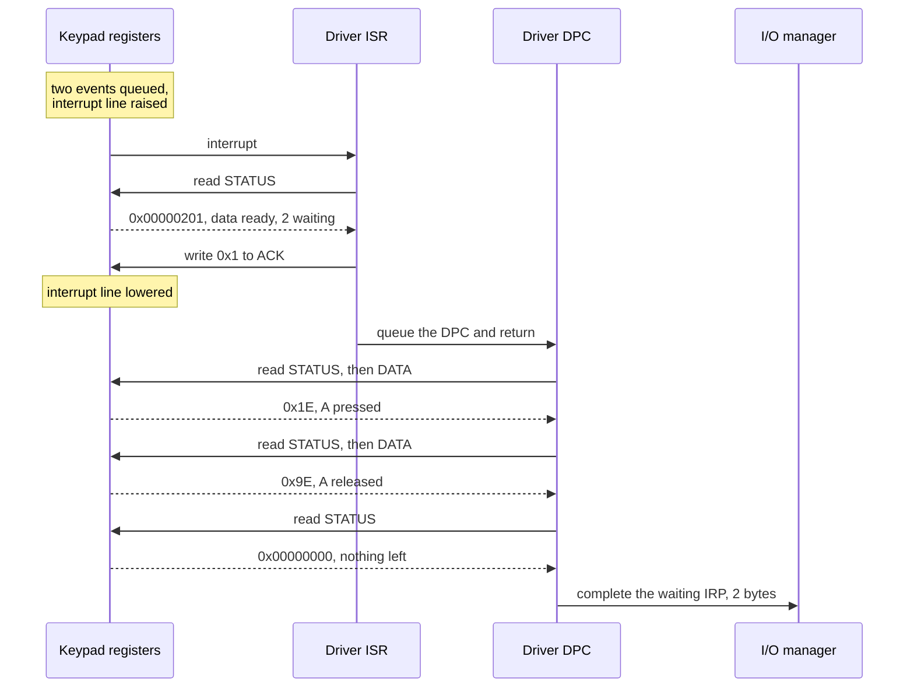

import MemoryStrip from '../../../../components/MemoryStrip.astro';
import Quiz from '../../../../components/Quiz.astro';

[Lesson 14.2](/pages/14/02/) followed a request from a program down to the toy
keypad and back, and a key press from a USB keyboard up to a game, without
opening any of the numbers on the way. This lesson opens them: the parameters
of a `DeviceIoControl` request, the four fields packed into a control code, the
keypad's registers byte by byte, the values its interrupt handlers read, and
the bytes of a real key press. It ends with a lab that runs the keypad and its
driver as an ordinary program.

## What a driver reads from a control request

A `DeviceIoControl` request carries more parameters than a read. These are the
parts of its IRP that the keypad driver reads (Windows keeps some in the IRP
itself and some in a per-driver *stack location* attached to it):

<MemoryStrip
  column
  cells="operation=IRP_MJ_DEVICE_CONTROL|control code=0x80006004|output length=4 bytes|system buffer=kernel copy of the caller's buffer|requestor=user mode|status=set at completion|information=bytes returned"
  caption="What a driver reads from an IRP for a `DeviceIoControl` request. *Requestor* says the request came from user mode, so every parameter is untrusted."
/>

For most control codes the I/O manager uses **buffered I/O**: it copies the
caller's input into a kernel buffer, the *system buffer*, before the driver
runs, and copies the output back to the caller after completion. The driver
never touches the program's memory directly. It still has to respect the
lengths: the output length says how many bytes the caller's buffer can hold,
and writing even one byte more would overrun kernel memory.

## A control code is four fields in one number

A control code is a 32-bit number that packs four fields, built by a macro
called `CTL_CODE`:

- bits 16 to 31, the **device type**: values from `0x8000` up belong to
  hardware vendors, lower ones to Microsoft;
- bits 14 and 15, the **access** the caller's handle must hold: 0 for any, 1
  for read, 2 for write, 3 for both;
- bits 2 to 13, the **function** number: vendors use `0x800` and up;
- bits 0 and 1, the **method**, which says how buffers travel: 0 means
  buffered.

Packing the fields into one number uses a **shift**. Shifting a number left by
*n* bits moves every bit *n* places toward the high end and fills the places it
leaves with zeros. Each place a bit moves doubles what it is worth, so a shift
left by *n* bits multiplies the number by 2ⁿ. A shift by 4 bits moves a number
exactly one hex digit, because each hex digit stands for 4 bits.

The toy keypad defines one control code, *get status*, with device type
`0x8000`, function `0x801`, the buffered method, and read access. Packing it
takes one shift per field:

- `0x8000` shifted left by 16 bits, which is 16 ÷ 4 = 4 hex digits, is
  `0x8000_0000`;
- the access value 1 shifted left by 14 bits is 2¹⁴ = 16,384. That is
  4 × 4,096, and 4,096 = 16³ is the value of a 1 in the fourth hex digit, so
  16,384 is `0x4000`;
- `0x801` shifted left by 2 bits is `0x801` × 2² = `0x801` × 4 = `0x2004`,
  because `0x800` × 4 = `0x2000` (8 × 4 = 32, which is `0x20`, and the two
  zero digits stay behind it) and 1 × 4 = 4;
- the method, 0, adds nothing.

`0x8000_0000` + `0x4000` + `0x2004` = `0x8000_6004`. The top half, `0x8000`, is
the device type, and the low half, `0x6004`, holds the other three fields. Here
are its sixteen bits, one byte at a time:

<MemoryStrip
  cells="15=0|14=1|13=1|12=0|11=0|10=0|9=0|8=0"
  marks="0-1"
  groups="0-1:access `01`|2-7:function, first 6 bits `100000`"
  groups2="0-3:hex `6`|4-7:hex `0`"
  caption="Bits 15 to 8 of the control code `0x8000_6004`, the byte `0x60`. Access `01` is read, and the function number begins here."
/>

<MemoryStrip
  cells="7=0|6=0|5=0|4=0|3=0|2=1|1=0|0=0"
  groups="0-5:function, last 6 bits `000001`|6-7:method `00`"
  groups2="0-3:hex `0`|4-7:hex `4`"
  caption="Bits 7 to 0, the byte `0x04`. The function's twelve bits, `1000 0000 0001`, are `0x801`; method `00` is buffered."
/>

The access field is a security check that happens before the driver runs. The
I/O manager compares it with the rights on the caller's handle and refuses the
request, without ever calling the driver, if the handle lacks them. A driver
that declares a powerful command with access 0, *any access*, lets every
program that can open the device send it, which is one of the classic driver
mistakes. Drivers are also expected to compare the whole 32-bit code, not just
the function number, so that a code with the right function but a different
method or access is refused.

<Quiz
  id="driver-ioctl-near-miss"
  title="Spot the near miss"
  prompt="The keypad driver receives the control code `0x8000_6007` instead of `0x8000_6004`. What changed, and what should the driver do?"
  options="Only the method bits changed, from `00` to `11`, so the driver should refuse the request because it is not exactly the code it defines||The function number changed to `0x802`, so the driver should run a different command||Nothing that matters: the driver should mask off the low bits and run the command||The access bits changed, so the I/O manager will refuse it before the driver sees it"
  answer="0"
  explanation="`0x7` is `0111` and `0x4` is `0100`, so only bits 0 and 1 differ: the method went from 0, buffered, to 3, which passes the caller's raw user-mode addresses instead of a safe kernel copy. Bits 14 and 15 are still `01`, so the I/O manager's access check passes and the decision falls to the driver. A driver that ignored the method would treat raw user pointers as a kernel buffer. Comparing the whole 32-bit value refuses the request."
/>

## The toy keypad's registers, bit by bit

Lesson 14.2 named the toy keypad's four 32-bit registers, which take
4 × 4 = 16 bytes in all. Suppose the firmware placed them at physical address
`0xFEB0_1000`: CONTROL at offset `+0x00`, STATUS at `+0x04`, DATA at `+0x08`,
and ACK at `+0x0C`. STATUS therefore answers at `0xFEB0_1000` + 4 =
`0xFEB0_1004`. Here is the block after the driver has started the device and
the A key has been pressed and released, 8 bytes at a time:

<MemoryStrip
  cells="+0x00=03|+0x01=00|+0x02=00|+0x03=00|+0x04=01|+0x05=02|+0x06=00|+0x07=00"
  marks="0|4-5"
  groups="0-3:CONTROL `0x00000003`|4-7:STATUS `0x00000201`"
  caption="The first 8 bytes of the register block. Each register is little-endian, so its lowest byte comes first."
/>

<MemoryStrip
  cells="+0x08=1E|+0x09=00|+0x0A=00|+0x0B=00|+0x0C=00|+0x0D=00|+0x0E=00|+0x0F=00"
  marks="0"
  groups="0-3:DATA `0x0000001E`|4-7:ACK"
  caption="The last 8 bytes. DATA shows what a read would return right now, and ACK always reads as 0."
/>

**CONTROL**, `0x0000_0003`, is written by the driver. Bit 0, *enable*, makes the
device scan its keys, and bit 1, *interrupt enable*, lets it interrupt. 3 = 2 +
1, so both bits are set. The other 30 bits are reserved and must be written as
0.

**STATUS**, `0x0000_0201`, is read-only and describes the device at this
moment. Because the register is little-endian, byte `+0x04` holds bits 0 to 7
and byte `+0x05` holds bits 8 to 15. Byte `+0x04` is `0x01`: bit 0, *data
ready*, is set, so an event is waiting, and bit 1, *overflow*, is clear. Byte
`+0x05` is `0x02`: bits 8 to 15 form an 8-bit *count* of waiting events, here
2. As one number, `0x0201` = 2 × 256 + 1 = 513. Dividing 513 by 256 gives 2
remainder 1: the count, and the low byte's flags.

**DATA**, `0x0000_001E`, holds the event at the front of the device's queue.
Bits 0 to 6 are the scan code, and bit 7 is set when the key was released
rather than pressed. `0x1E` is 1 × 16 + 14 = 30, binary `0001 1110`. Its bit 7
is 0, so the front event is *A pressed*: 30 is the scan code of the A key in
the numbering Windows uses, known as set 1. The event behind it is `0x9E`:

<MemoryStrip
  cells="bit 7=1|bit 6=0|bit 5=0|bit 4=1|bit 3=1|bit 2=1|bit 1=1|bit 0=0"
  marks="0"
  groups="0-0:released|1-7:scan code `001 1110` = `0x1E`"
  caption="The second event in the queue, `0x9E`: the same key, released."
/>

`0x9E` is 9 × 16 + 14 = 158. Bit 7 is worth 2⁷ = 128 = `0x80`, and 158 − 128 =
30, so the remaining bits name the A key again: *A released*.

**ACK** is write-only and reads as 0. Writing a 1 to bit 0 tells the device
its interrupt has been handled, and the device lowers its interrupt signal;
writing a 1 to bit 1 clears the overflow flag. Bits written as 0 change
nothing. This **write-1-to-clear** convention is common because it lets a
driver clear one flag without first reading the register to preserve the
others.

<Quiz
  id="driver-status-decode"
  title="Decode a STATUS value"
  prompt="The keypad's STATUS register reads `0x0000_0403`. What is the device reporting?"
  options="Three events waiting, and the device is disabled||Four events waiting, data ready, and at least one event was dropped||1,027 events waiting||Data ready, no overflow, and three events waiting"
  answer="1"
  explanation="Split the value by bytes. The low byte, `0x03`, is `0000 0011`, so bit 0 (data ready) and bit 1 (overflow) are both set. The next byte, `0x04`, is the count in bits 8 to 15: 4 events waiting. As one number `0x0403` is 4 × 256 + 3 = 1,027, but only the separate fields mean anything. Four is also the toy keypad's queue size, so the queue was full when an event was dropped."
/>

## The ISR and the DPC, register by register

Lesson 14.2 split a driver's interrupt handling into a short interrupt service
routine and a deferred procedure call that does the real work. Here is that
sequence for the two events above, with the value each register returns:



The ISR writes `0x1` to ACK. Only bit 0 is set, so the device lowers its
interrupt line and leaves the overflow flag, bit 1, as it was. The last read of
STATUS returns 0: both events have been read, so the queue is empty, and the
overflow flag was never set. The 2 bytes the DPC collected, `0x1E` and `0x9E`,
are what the parked read receives when the DPC completes it.

## A key press in bytes

Two stops on the path from a USB keyboard to a game, the keyboard's report and
the message the game finally receives, pack their facts into bits.

### The keyboard's report

In the simple *boot* format that every PC understands, a keyboard's HID report
is 8 bytes:

<MemoryStrip
  cells="byte 0=02|byte 1=00|byte 2=04|byte 3=00|byte 4=00|byte 5=00|byte 6=00|byte 7=00"
  marks="0|2"
  groups="0-0:modifiers|1-1:reserved|2-7:up to six keys held"
  caption="A boot-format report while left Shift and A are held."
/>

Byte 0 holds one bit per modifier key: bit 0 is left Ctrl, bit 1 left Shift,
bit 2 left Alt, bit 3 the left Windows key, and bits 4 to 7 the same four keys
on the right. `0x02` is binary `0000 0010`, so only bit 1 is set: left Shift.
Bytes 2 to 7 list up to six keys currently held, each as a HID usage number.
The letters A to Z are usages 4 to 4 + 25 = 29, or `0x04` to `0x1D`
(1 × 16 + 13 = 29), so `0x04` is A. Six slots is also why a keyboard reporting in boot format cannot report a
seventh key held at the same time.

### From scan code to message

`KBDHID.SYS` turns usage `0x04` into scan code `0x1E`. The toy keypad marked a
release by setting bit 7, `0x80`, which is how PS/2 keyboards sent it over
their wire. The events that `KBDCLASS.SYS` queues keep the scan code on its own
and mark a release with a separate *break* flag instead.

When the game's `WM_KEYDOWN` message arrives, its `lParam` packs the details of
the key press into 32 bits:

<MemoryStrip
  cells="=0|=0|=1|=E|=0|=0|=0|=1"
  groups="0-1:flags|2-3:scan code|4-7:repeat count"
  groups2="0-1:`0x00`|2-3:`0x1E`|4-7:`0x0001` = 1"
  caption="The `lParam` of the `WM_KEYDOWN` for a first press of A, `0x001E_0001`, one hex digit per box."
/>

`0x1E` shifted left by 16 bits, which is 4 hex digits, is `0x001E_0000`, and
adding a repeat count of 1 gives `0x001E_0001`. The top byte, bits 24 to 31,
holds flags. For the matching `WM_KEYUP`, bit 30 (*the key was down before*)
and bit 31 (*the key is being released*) are set. Bit 31 is bit 7 of the top
byte, worth 2⁷ = 128 = `0x80`, and bit 30 is its bit 6, worth 2⁶ = 64 =
`0x40`, so the top byte becomes `0x80` + `0x40` = `0xC0` and the `lParam` is
`0xC01E_0001`.

## Simulate a device and its driver

The lab [`toy_driver_lab.rs`](/rust-labs/src/bin/toy_driver_lab.rs) builds the
toy keypad and a driver for it as an ordinary user-mode program. Nothing in it
touches hardware or the kernel: the register block is a Rust struct, the
interrupt line is a `bool`, and an IRP is a small struct in a queue. What it
keeps from the real thing are the rules described in Lesson 14.2 and here.

The device's register read shows DATA's side effect in one line:

```rust
fn read32(&mut self, offset: usize) -> Result<u32, BusError> {
    match register(offset)? {
        CONTROL => Ok(self.control),
        STATUS => Ok(self.status()),
        // Reading DATA is not a pure read: it removes the front event.
        DATA => Ok(self.events.pop_front().map_or(0, u32::from)),
        _ => Ok(0), // ACK is write only and reads as zero
    }
}
```

`register` refuses an offset that is not a multiple of 4 or that lies past the
16-byte block, so a mistyped offset becomes an error instead of a read of the
wrong register. The driver's ISR is as short as Lesson 14.2 says it should be:

```rust
fn isr(&mut self, device: &mut ToyKeypad) -> Result<bool, BusError> {
    let status = device.read32(STATUS)?;
    if status & STATUS_DATA_READY == 0 {
        return Ok(false); // the line is shared, and another device raised it
    }
    device.write32(ACK, ACK_INTERRUPT)?;
    self.dpc_queued = true;
    Ok(true)
}
```

The dispatch routine compares the whole control code and checks the output
length before it copies anything, and a separate `submit` function plays the
I/O manager, refusing any request whose handle lacks the access bits its code
demands.

Build it, then run it from the `rust-labs` folder:

```powershell
cargo run --bin toy_driver_lab
```

The program parks a read request, presses and releases A, prints the register
block drawn above, runs the ISR and the DPC, and shows the read completing with
`0x1E` and `0x9E`. It then sends four control requests: one from a handle
without read access, one with the near-miss code `0x8000_6007`, one with a
2-byte buffer, and a valid one. Finally it presses keys six times with no
driver running in between, to show the four-slot queue setting its overflow
flag. The tests beside it check the register bytes from this lesson, the
write-1-to-clear rule, the overflow, every refused request, and that waiting
reads complete in order.

Then set `QUEUE_CAPACITY` to 2 and work out which tests must now fail before
running them.

References: [defining I/O control codes](https://learn.microsoft.com/en-us/windows-hardware/drivers/kernel/defining-i-o-control-codes), [security issues for I/O control codes](https://learn.microsoft.com/en-us/windows-hardware/drivers/kernel/security-issues-for-i-o-control-codes), [keyboard and mouse HID client drivers](https://learn.microsoft.com/en-us/windows-hardware/drivers/hid/keyboard-and-mouse-hid-client-drivers), and [`WM_KEYDOWN`](https://learn.microsoft.com/en-us/windows/win32/inputdev/wm-keydown).
