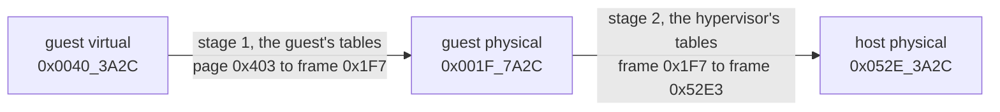

import MemoryStrip from '../../../../components/MemoryStrip.astro';
import Quiz from '../../../../components/Quiz.astro';

[Lesson 14.3](/pages/14/03/) described what a hypervisor does: it runs a
guest's instructions natively, takes control back through VM exits, and
translates every guest address a second time. This lesson looks underneath. It
shows why x86 needed new hardware before a guest's kernel could run unmodified,
follows one address through both stages of translation digit by digit, counts
what the second stage costs, and ends with the ways software inside a guest can
tell that it is there.

## Why a guest cannot simply run in user mode

The obvious way to build a hypervisor is to run the guest's kernel in ring 3,
where every privileged instruction it tries causes a fault, and have the
hypervisor catch each fault and do to the *virtual* machine what the
instruction would have done to a real one. This is called **trap and
emulate**: the guest's ordinary instructions run at full speed, and only the
sensitive ones cost extra.

In 1974 Gerald Popek and Robert Goldberg stated the condition for trap and
emulate to work: every instruction that reads or changes the machine's control
state must fault when it runs outside the most privileged level. For many years
x86 did not meet it. The classic example is `popf`, which loads the flags
register, including the *interrupt flag* that switches interrupts on and off.
In ring 0, `popf` changes the interrupt flag. In ring 3 it silently leaves the
flag alone and raises no fault. A guest kernel running in ring 3 that used
`popf` to switch interrupts back on would carry on believing they were on, and
the hypervisor would never find out, because nothing trapped.

Early x86 hypervisors worked around the problem. VMware, from 1999, examined
the guest kernel's code as it ran and rewrote the problem instructions into
safe sequences, a technique called **binary translation**. Xen, from 2003,
modified the guest kernel's source code so that it asked the hypervisor
directly instead of running those instructions, which is called
**paravirtualization**. Both worked, and both were complicated. The hardware
support from Lesson 14.3, VT-x and AMD-V, made both workarounds unnecessary for
running an unmodified kernel: it gives the guest its own ring 0, where `popf`
behaves exactly as the guest kernel expects.

## A worked translation

Lesson 14.3 split a guest's address translation into two stages. The guest's
own page tables turn a guest virtual address into a guest physical address,
and the hypervisor's tables turn that into a host physical address, the real
location in RAM. Here is one address going through both:

Pages are 4 KiB, which is 4 × 1,024 = 4,096 bytes. Since 2¹² = 4,096, the
lowest 12 bits of an address choose a byte within its page, the **offset**, and
all the bits above them name the page. Each hex digit stands for 4 bits, so the
12 offset bits are exactly the last three hex digits;
[Lesson 10.5](/pages/10/05/) made the same split. Take the guest virtual
address `0x0040_3A2C`:

<MemoryStrip
  cells="=0|=0|=4|=0|=3|=A|=2|=C"
  groups="0-4:guest virtual page `0x00403`|5-7:offset `0xA2C`"
  caption="The guest virtual address `0x0040_3A2C`, split before its last three hex digits."
/>

The offset is `0xA2C` = 10 × 256 + 2 × 16 + 12 = 2,560 + 32 + 12 = 2,604,
safely less than 4,096. The page number is `0x403` = 4 × 256 + 3 = 1,027. As a
check, page 1,027 starts at byte 1,027 × 4,096 = 4,206,592, and 4,206,592 +
2,604 = 4,209,196, which is `0x0040_3A2C` written in decimal.

**Stage 1.** The guest kernel's page tables map guest virtual page `0x403` to
guest physical frame `0x1F7`. A **frame** is a page-sized block of physical
memory. Translation replaces the page number with the frame number and keeps
the offset:

<MemoryStrip
  cells="=0|=0|=1|=F|=7|=A|=2|=C"
  groups="0-4:guest physical frame `0x001F7`|5-7:offset `0xA2C`, unchanged"
  caption="The guest physical address `0x001F_7A2C` = `0x1F7` × `0x1000` + `0xA2C`."
/>

Multiplying by `0x1000`, which is 4,096, shifts a number left by three hex
digits, so `0x1F7` × `0x1000` = `0x1F_7000`, and adding the offset gives
`0x1F_7A2C`. On a real machine the translation would end here, with a RAM
address. In a guest, `0x001F_7A2C` is only the guest's idea of one.

**Stage 2.** The hypervisor's tables map guest physical frame `0x1F7` to host
physical frame `0x52E3`:

<MemoryStrip
  cells="=0|=5|=2|=E|=3|=A|=2|=C"
  groups="0-4:host physical frame `0x052E3`|5-7:offset `0xA2C`, unchanged"
  caption="The host physical address `0x052E_3A2C`: where the byte really is in RAM."
/>

`0x52E3` × `0x1000` = `0x52E_3000`, and adding `0xA2C` gives `0x052E_3A2C`. The
offset rode through both stages untouched; each stage only swapped the number
above it.

<Quiz
  id="vm-two-stage-translation"
  title="Translate one more address"
  prompt="Using the same mappings as the worked example, which host physical address holds the byte at guest virtual address `0x0040_3F00`?"
  options="`0x052E_3F00`||`0x001F_7F00`||`0x052E_4F00`||`0x0040_3F00`"
  answer="0"
  explanation="`0x0040_3F00` lies on the same guest virtual page, `0x403`, at offset `0xF00`. Stage 1 maps page `0x403` to guest frame `0x1F7`, giving `0x001F_7F00`, which is only a guest physical address. Stage 2 maps frame `0x1F7` to host frame `0x52E3`. The offset never changes, so the answer is `0x52E3` × `0x1000` + `0xF00` = `0x052E_3F00`."
/>

## What two stages cost

Real translation is not one table lookup per stage but a four-level walk
([Lesson 11.6](/pages/11/06/)), and with two stages the walks multiply. The
guest's page tables live in guest physical memory, so each of the four entries
the processor reads during the guest's walk sits at a guest physical address
that must first go through a four-level stage-2 walk. Each guest level
therefore costs 4 reads to find its table plus 1 read of the entry itself,
4 + 1 = 5 reads, and 4 × 5 = 20 reads for the whole stage-1 walk. The guest
physical address that comes out needs one more four-level stage-2 walk:
20 + 4 = 24 memory reads to translate one address, where a machine without
virtualization needs 4.

The processor avoids paying that on every access with its **translation
lookaside buffer** (TLB), a small cache of recent translations. The TLB keeps
the final guest-virtual-to-host-physical answer, so a program that touches the
same pages again, as programs mostly do, pays for the walk once.

## How a program can tell it is in a virtual machine

A guest runs real instructions on a real processor, so most of what it does
looks identical inside and outside a VM. A program that wants to know can
still find out, in a few ways:

- **The processor says so.** Hypervisors announce themselves on purpose. When a
  program runs `cpuid` with input 1, bit 31 of the result in `ecx` is the
  *hypervisor present* bit: 0 on bare hardware, set by a hypervisor. Bit 31 is
  worth 2³¹ = 2,147,483,648, which is `0x8000_0000`, because the top hex digit
  `8` is binary `1000`. A second input, `0x4000_0000`, returns the hypervisor's
  name as twelve ASCII characters, such as `Microsoft Hv`. This is a feature,
  not a leak: guests use it to find out which faster, hypervisor-aware drivers
  they can load.
- **The hardware looks virtual.** Virtual disks, graphics adapters, and network
  cards report model names from the hypervisor's vendor, and virtual network
  cards get addresses from ranges assigned to those vendors.
- **Some instructions are slow.** Anything that causes a VM exit takes far
  longer than it would on bare hardware, and careful timing can notice.

Guest tools ask so they can install the right drivers. Licensing software asks.
Malware asks so it can behave innocently inside the sandboxes that analysts use
to study it. Some anti-cheat systems ask, and refuse to run a protected game in
a VM, because a hypervisor can see and change everything a guest does. That is
one more reason this book's targets are offline, single-player builds running
in your own VM.

The first check is weaker than it looks. On a Windows 11 PC with memory
integrity on, Windows itself runs on the Windows hypervisor, so the
hypervisor-present bit is set on an ordinary desktop too.
[Lesson 14.3](/pages/14/03/#windows-uses-the-hypervisor-to-protect-itself)
explains why.

References: [hypervisor feature discovery](https://learn.microsoft.com/en-us/virtualization/hyper-v-on-windows/tlfs/feature-discovery) and the virtual-machine extensions volume of the [Intel Software Developer Manuals](https://www.intel.com/content/www/us/en/developer/articles/technical/intel-sdm.html).
