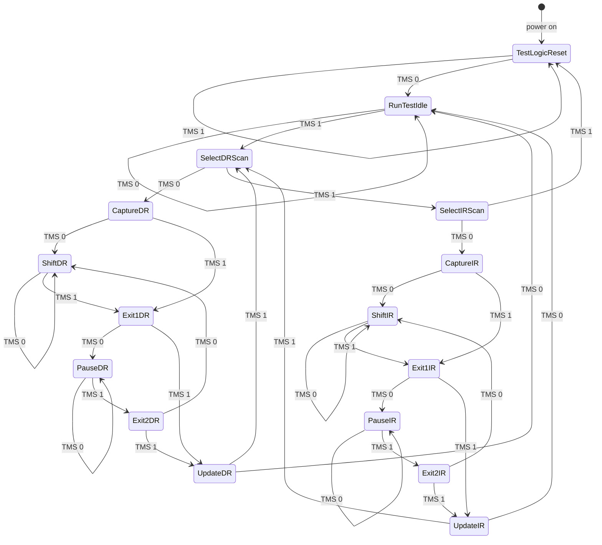
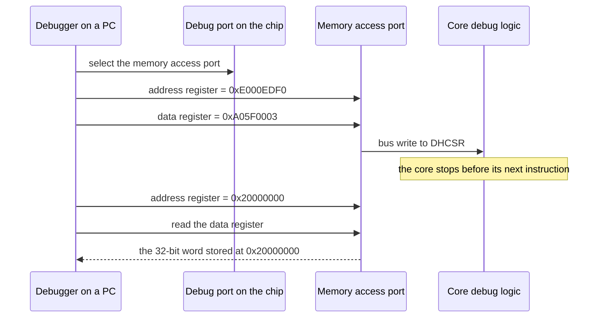

import MemoryStrip from '../../../../components/MemoryStrip.astro';
import Quiz from '../../../../components/Quiz.astro';

[Lesson 14.4](/pages/14/04/) explained what JTAG is for and what each of its
parts does. This lesson drives those parts one clock at a time, from a four-bit
shift register to the packet that opens an SWD session, and ends with a lab that
simulates a two-chip scan chain.

## Two clock edges and two default levels

TCK is a clock: a wire that switches from 0 to 1 and back, over and over. The
moment it rises from 0 to 1 is called the **rising edge**, and the moment it
falls back to 0 is the **falling edge**. A JTAG chip reads TMS and TDI on the
rising edge and changes TDO on the falling edge. Each wire is read on one edge
and changed on the other, so no wire is ever read at the moment it changes.

The standard also requires TMS and TDI to read as 1 when nothing drives them.
That small rule matters twice below.

## Shift registers: many bits through one wire

A shift register moves every bit one place along on each clock. JTAG always
shifts toward TDO: the cell next to TDO, bit 0, leaves first, every other bit
moves down one place, and the bit arriving from TDI enters at the top.

Take a small chip with four pins and a 4-bit boundary-scan register, bits `b3`
to `b0`. The test captures the pins: pin 0 reads 1, pin 1 reads 0, pin 2 reads
1, and pin 3 reads 1. Each cell now holds its own pin's level:

<MemoryStrip
  cells="b3 · pin 3=1|b2 · pin 2=1|b1 · pin 1=0|b0 · pin 0=1"
  groups="0-3:TDI enters at `b3`, TDO leaves from `b0`"
  caption="After the capture, each cell holds its pin's level. `b0` sits next to TDO, so pin 0's level will leave first."
/>

Now the debugger runs four clocks, sending 1, 1, 0, 0 into TDI, first bit
first. On each clock, TDO receives `b0`, then `b0` takes `b1`'s value, `b1`
takes `b2`'s, `b2` takes `b3`'s, and `b3` takes the bit from TDI:

| Clock | TDI sends | TDO receives | `b3 b2 b1 b0` after the clock |
|---:|---:|---|---|
| start | | | `1 1 0 1` |
| 1 | 1 | 1, pin 0's level | `1 1 1 0` |
| 2 | 1 | 0, pin 1's level | `1 1 1 1` |
| 3 | 0 | 1, pin 2's level | `0 1 1 1` |
| 4 | 0 | 1, pin 3's level | `0 0 1 1` |

Check clock 1: TDO receives `b0`, which is 1. Then `b0` takes `b1`'s 0, `b1`
takes `b2`'s 1, `b2` takes `b3`'s 1, and `b3` takes the incoming 1, giving
`1 1 1 0`. The other rows follow the same rule.

The same four clocks did two jobs. They read the pins out in order, pin 0 to
pin 3, and they loaded a new pattern. The first bit sent travelled furthest and
ended in `b0`; the last bit sent stopped in `b3`:

<MemoryStrip
  cells="b3=0|b2=0|b1=1|b0=1"
  caption="After four clocks, the old levels have left through TDO and the new pattern 1, 1, 0, 0 sits in `b0` to `b3`."
/>

Look at the register after clock 2: `1 1 1 1`, a pattern nobody asked for. While
bits ripple through, the register passes through meaningless in-between values.
If the pins followed the register directly, they would flicker through every one
of them. So each cell has a second one-bit store, called a **latch**, that
actually drives the pin, and the latch copies the shifted value only once the
whole pattern is in place. That copy is the Update step of Lesson 14.4.

## The TAP controller: all 16 states

Lesson 14.4 followed the main path through the TAP controller: Capture, Shift,
and Update. Here is the whole machine. At every rising edge of TCK it moves to
one of two next states, chosen by whether TMS is 0 or 1. The diagram writes the
16 state names without hyphens; the standard spells them Test-Logic-Reset,
Run-Test/Idle, Select-DR-Scan, Capture-DR, and so on.



The machine has two matching columns. States ending in DR work on a data
register, such as the boundary-scan register; states ending in IR work on the
instruction register. Down each column:

- **Select** chooses a column. With TMS at 0 it enters that column's Capture
  state; with TMS at 1 it moves on, from Select-DR-Scan to Select-IR-Scan, and
  from Select-IR-Scan to Test-Logic-Reset.
- **Capture** loads the register's shift stage from its inputs: the pin levels,
  for the boundary-scan register.
- **Shift** moves one bit from TDI toward TDO on every clock, for as long as TMS
  stays 0.
- **Exit1**, **Pause**, and **Exit2** leave the shifting, wait if the debugger
  needs time to fetch more data, and resume without starting over.
- **Update** copies the shifted-in value to the register's outputs in one step.

Test-Logic-Reset is the state in which the chip ignores the test logic and works
normally, and Run-Test/Idle is a resting place between operations. Six states
can wait in place for as long as TMS holds steady: Test-Logic-Reset with TMS at
1, and Run-Test/Idle, Shift-DR, Pause-DR, Shift-IR, and Pause-IR with TMS at 0.
Every other state lasts exactly one clock.

Each state does its work on the rising edge that *leaves* it. The capture
happens on the clock that moves from Capture-DR to Shift-DR, and the last bit of
a scan is shifted by the same clock that raises TMS to leave Shift-DR for
Exit1-DR. To shift 64 bits, the debugger sends 63 clocks with TMS at 0 and then
the 64th with TMS at 1. Getting from a fresh reset to the first shift takes four
clocks:

| Clock | TMS | From | To |
|---:|---:|---|---|
| 1 | 0 | Test-Logic-Reset | Run-Test/Idle |
| 2 | 1 | Run-Test/Idle | Select-DR-Scan |
| 3 | 0 | Select-DR-Scan | Capture-DR |
| 4 | 0 | Capture-DR, where the register loads | Shift-DR |

<Quiz
  id="jtag-shift-last-bit"
  title="The clock that leaves Shift-DR"
  prompt="The controller has just entered Shift-DR, and the debugger wants to shift exactly 8 bits through a data register and then stop shifting. How should it set TMS on the next clocks?"
  options="7 clocks with TMS at 0, then an 8th clock with TMS at 1||8 clocks with TMS at 0, then a 9th clock with TMS at 1||8 clocks with TMS at 1||1 clock with TMS at 1, then 8 clocks with TMS at 0"
  answer="0"
  explanation="Every clock spent in Shift-DR shifts one bit, including the clock that raises TMS to leave for Exit1-DR, because each state does its work on the rising edge that leaves it. Seven clocks with TMS at 0 shift bits 1 to 7 and stay in Shift-DR; the eighth, with TMS at 1, shifts bit 8 and leaves. A ninth clock would shift one bit too many."
/>

Lesson 14.4 said that five clocks with TMS at 1 reach Test-Logic-Reset from any
state. To check it, hold TMS at 1 and work outward from Test-Logic-Reset,
following the arrows labelled TMS 1:

| Starting state | Path with TMS at 1 | Clocks |
|---|---|---:|
| Select-IR-Scan | straight to Test-Logic-Reset | 1 |
| Select-DR-Scan | Select-IR-Scan, then as above | 1 + 1 = 2 |
| Run-Test/Idle, Update-DR, or Update-IR | Select-DR-Scan, then as above | 1 + 2 = 3 |
| Exit1 or Exit2, in either column | that column's Update, then as above | 1 + 3 = 4 |
| Capture, Shift, or Pause, in either column | Exit1 from Capture or Shift, Exit2 from Pause, then as above | 1 + 4 = 5 |

The rows cover 1 + 1 + 3 + 4 + 6 = 15 states, and Test-Logic-Reset itself needs
0 clocks, so all 16 are accounted for and none needs more than five. From
Shift-DR, for example, the path is Exit1-DR, Update-DR, Select-DR-Scan,
Select-IR-Scan, and Test-Logic-Reset. Extra clocks do no harm, because
Test-Logic-Reset stays put while TMS is 1, so a debugger that is unsure of the
state sends five 1s on TMS and starts from a known place. And because an
undriven TMS reads as 1, a chip whose test port is not connected to anything
sits in Test-Logic-Reset permanently and works normally.

## BYPASS, IDCODE, and a chain that fails safe

A few fixed rules about instruction codes shape how a debugger drives a chain.

BYPASS must be all ones, so a chip with a 4-bit instruction register uses
`1111`, and the one-bit register it selects always captures 0. A chip with an
IDCODE register selects IDCODE on reset, so no instruction scan is needed before
reading IDs.

Any code a chip does not define must behave as BYPASS. Together with the rule
that an undriven TDI reads as 1, this means a broken chain fails safe: a chip
whose TDI wire is cut receives nothing but ones, which select BYPASS, not a test
mode that drives the pins against the chip's own outputs.

Instructions are bits in the chain like any others. In one instruction scan the
first bits shifted in travel furthest, so to give every chip its own
instruction, the debugger sends the instruction for the chip nearest TDO first
and the one for the chip nearest TDI last.

## Worked example: count the chips on a chain

A debugger attached to an unfamiliar board can count its chips in two scans.

1. Reset, then shift plenty of ones through the instruction registers. The
   debugger does not know how long each register is, and it does not need to:
   every register ends up full of ones, which is BYPASS, and the spare ones fall
   out of TDO.
2. Scan the data registers. Each chip now contributes one bypass bit, which
   captured 0. Send a single 1 followed by 0s, and count the clocks until the 1
   comes back.

Here is the second scan on a board with two chips, A nearest TDI and B nearest
TDO. On each clock, TDO receives B's bit, B takes A's old bit, and A takes the
bit from TDI:

| Clock | TDI sends | TDO receives | A's bit after | B's bit after |
|---:|---:|---:|---:|---:|
| start | | | 0 | 0 |
| 1 | 1 | 0 | 1 | 0 |
| 2 | 0 | 0 | 0 | 1 |
| 3 | 0 | 1 | 0 | 0 |

<MemoryStrip
  cells="TDI=0|chip A=0|chip B=1|TDO=0"
  marks="2"
  groups="1-2:the whole data chain: one bypass bit per chip"
  caption="After clock 2, the 1 sent on clock 1 sits in chip B's bypass bit. On clock 3 it reaches TDO."
/>

The 1 went in on clock 1 and came out on clock 3, so the chain held it for
3 − 1 = 2 clocks. Each one-bit register holds a bit for exactly one clock, so
there are 2 chips.

<Quiz
  id="jtag-bypass-count"
  title="Count the chips"
  prompt="Every chip on a chain is in BYPASS. The debugger sends a single 1 on clock 1, followed by 0s, and the 1 comes out of TDO on clock 4. How many chips are on the chain?"
  options="3||4||1||It depends on how long each chip's instruction register is"
  answer="0"
  explanation="Each chip in BYPASS adds a one-bit register, and each one-bit register holds the bit for one clock. The 1 was held for 4 − 1 = 3 clocks, so it passed through 3 chips. Instruction-register lengths stop mattering once every chip is in BYPASS, because the data path is then one bit per chip."
/>

## Reading a chip's identity

After reset, every chip with an IDCODE register has it selected, so one data
scan reads every ID on the chain. For two chips that is 32 + 32 = 64 bits. They
come out lowest bit first, and the chip nearest TDO answers first: the first 32
bits belong to chip B.

Bit 0 of every IDCODE is 1, and that is deliberate. A bypass register captures
0, so the first bit from each chip tells the debugger what kind of register it
is reading. A 1 means a 32-bit IDCODE follows; a 0 means a chip with no IDCODE,
sitting in BYPASS, which contributes that single bit and nothing more.

Chip A in this lesson's lab contains Arm's JTAG debug port, found in many
microcontrollers, and it answers `0x4BA00477`. The 32 bits split into three
fields plus the fixed 1:

<MemoryStrip
  cells="31–28=4|27–24=B|23–20=A|19–16=0|15–12=0|11–8=4|7–4=7|3–0=7"
  groups="0:version|1-4:part number `0xBA00`|5-7:manufacturer and the fixed 1"
  caption="Each box is one hex digit, four bits, labelled with the bit numbers it covers."
/>

- Bits 31 to 28 are the first hex digit: version 4.
- Bits 27 to 12 are the next four digits: part number `0xBA00`.
- Bits 11 to 0 are `0x477`, which is 4 × 256 + 7 × 16 + 7 = 1,143. Its lowest
  bit is the fixed 1. Removing that bit means subtracting 1 and halving:
  (1,143 − 1) ÷ 2 = 571. In hex, 571 = 2 × 256 + 3 × 16 + 11 = `0x23B`, the
  manufacturer code that JEDEC, the industry body that hands out these numbers,
  assigned to Arm.

## Halting a Cortex-M core with one write

Lesson 14.4 showed that a Cortex-M debugger halts the core with an ordinary
memory write through the debug port. The register it writes is DHCSR, the Debug
Halting Control and Status Register, at address `0xE000EDF0`, described in
Arm's public architecture manual. Its low three bits are:

| Bit | Name | Value of the bit | Effect when written as 1 |
|---:|---|---:|---|
| 0 | `C_DEBUGEN` | 1 | allow halting debug |
| 1 | `C_HALT` | 2 | stop the core |
| 2 | `C_STEP` | 4 | while `C_HALT` is 0, run one instruction and stop |

Every write must also carry `0xA05F` in the upper 16 bits, or the processor
ignores it. That key is printed in the public manual, so it is not a password.
It stops a stray write from buggy software halting the core by accident.

A 32-bit value has eight hex digits, four bits each, so its upper 16 bits are
the first four digits, and putting `0xA05F` there gives `0xA05F0000`. Adding bit
values to it:

- halt: `0xA05F0000` + 2 + 1 = `0xA05F0003`;
- step one instruction while halted: `0xA05F0000` + 4 + 1 = `0xA05F0005`;
- resume: `0xA05F0000` + 1 = `0xA05F0001`.

The write travels through the memory access port of Lesson 14.4. The port has an
address register and a data register, called TAR and DRW in Arm's
documentation: write an address to the first, then read or write the second, and
the port performs that bus access.



The second read fetches the first word of the chip's RAM, which starts at
`0x20000000` on Cortex-M. Core registers come through two more memory-mapped
registers, one to choose a register by number and one to carry its value.

## Inside an SWD request

Lesson 14.4 showed the shape of an SWD read: an 8-bit request, a turnaround, a
3-bit acknowledgement, 32 data bits, and a parity bit. The request's eight bits,
in the order they are sent, are:

- **Start**: always 1.
- **APnDP**: 0 for a debug port register, 1 for an access port register.
- **RnW**: 1 to read, 0 to write.
- **A2** and **A3**: two address bits that choose one of four registers.
- **Parity**: makes the count of 1s among APnDP, RnW, A2, A3, and the parity bit
  itself even.
- **Stop**: always 0. **Park**: always 1.

The first request a debugger usually sends reads the debug port's ID register,
register 0. That needs APnDP = 0, RnW = 1, A2 = 0, and A3 = 0. Those four bits
contain one 1, an odd count, so the parity bit is 1, which makes two:

<MemoryStrip
  cells="Start=1|APnDP=0|RnW=1|A2=0|A3=0|Parity=1|Stop=0|Park=1"
  groups="1-4:read debug port register 0|5:evens out the 1s"
  caption="Sent left to right, one bit per SWCLK tick. As a byte with the first bit as bit 0, it is 1 + 4 + 32 + 128 = 165 = `0xA5`."
/>

The bits in the order sent are 1, 0, 1, 0, 0, 1, 0, 1. Treating the first as bit
0, the 1s sit in bits 0, 2, 5, and 7, worth 1, 4, 32, and 128, for a total of
165. In hex that is 10 × 16 + 5 = `0xA5`.

The ID comes back in the same format as a JTAG IDCODE. For many Cortex-M chips
it is `0x2BA01477`. Split the same way as above, that is version 2, part number
`0xBA01` for the serial-wire version of the port, and the low three digits
`0x477` once again, so the same Arm manufacturer code, `0x23B`.

## Simulate a TAP controller

The portable lab [`jtag_tap_lab.rs`](/rust-labs/src/bin/jtag_tap_lab.rs)
simulates the board from this lesson: chip A with Arm's JTAG debug port, which
answers `0x4BA00477`, and a made-up sensor as chip B. No hardware is involved.
The four wires are function arguments, and the board is a `Vec` of chips. Every
chip sees the same TCK and TMS, so their controllers move in lockstep and one
`TapState` describes them all.

The controller is a `match` with one row per state, giving the next state for
TMS at 0 and at 1, exactly like the diagram. The shift register is five lines:

```rust
fn shift_dr(&mut self, bit_in: bool) -> bool {
    let top = if self.selects_idcode() { 31 } else { 0 };
    let bit_out = (self.dr_shift & 1) == 1;
    self.dr_shift = (self.dr_shift >> 1) | (u32::from(bit_in) << top);
    bit_out
}
```

`& 1` keeps only bit 0, the bit leaving toward TDO. `>> 1` moves every bit down
one place. `<< top` puts the incoming bit at the top: bit 31 for the IDCODE
register, or bit 0 for the one-bit bypass register, where the top and the bottom
are the same cell. The chain passes each chip's outgoing bit into the next chip:

```rust
self.chips.iter_mut().fold(tdi, |bit, chip| shift(chip, bit))
```

Build it, then run it from the `rust-labs` folder:

```powershell
cargo run --bin jtag_tap_lab
```

The lab walks from Shift-DR to Test-Logic-Reset in five clocks and confirms that
no state needs more. It reads both IDCODEs, chip B's first because chip B is
nearest TDO, and splits Arm's into the fields above. It counts the chips by
timing a single 1 through their bypass bits. Finally, it puts chip A on IDCODE
and chip B on BYPASS, which makes the data chain 32 + 1 = 33 bits long. The
tests check that every state resets within five clocks, that exactly six states
can wait in place, that undefined instructions behave as BYPASS, and that
instructions land in chain order.

Then add a third chip to `board()`. Before you run it, predict what
`count_chips` reports and how many bits the IDCODE scan in `main` now needs.
