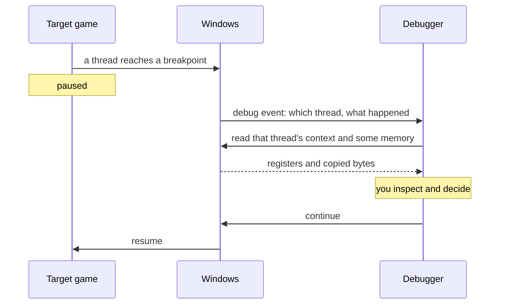
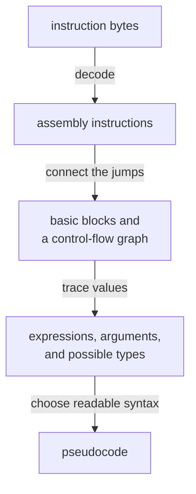

import MemoryStrip from '../../../../components/MemoryStrip.astro';

The first scan showed where gold might be stored. This chapter follows that
lead into instructions: first how to read and pause them, then how to trace a
game rule and recover a path to state after addresses move. It ends by showing
what a temporary control-flow detour must preserve. The debugger lessons can
also be revisited by tool action: read assembly, set a breakpoint, follow a
caller, or check an address path.

## A debugger can pause and inspect a running program

A memory scanner answers, “Where might this value live?” A debugger answers, “Which instruction just touched it?” In the Lesson 1.9 experiment, a purchase narrowed many candidate addresses to one changing gold value. Suppose it fell from 100 to 75 when you recruited a unit. Which instruction made that subtraction?

The address gives us a route into the running program. Find it again, ask the debugger to **break on writes** to its four bytes, then recruit one unit costing 25 gold. A breakpoint means “pause when this event happens.” At that pause, compare the address being written and the value being subtracted with the gold address and price you already know. Repeat with another affordable purchase before treating the match as an explanation. Lesson 2.4 walks through this experiment in x64dbg.

When a debugger pauses a process, you can inspect:

- the next instruction the CPU will run;
- register values;
- the call stack;
- nearby memory;
- the condition flags used by branches.

This is not a special “hacking mode.” Developers use the same ideas to find bugs in their own programs.

## What actually happens when a debugger attaches

A debugger is a separate process. It requests the required process and thread
access rights from Windows, and Windows begins sending it **debug events**. An
event can mean:

- a process or thread started;
- a DLL was loaded;
- an exception happened;
- a breakpoint was reached;
- the process exited.

When an event stops a thread, the debugger can ask Windows for that thread’s
**context**. A context is a snapshot of its registers, including the
instruction pointer that says where the CPU will continue. The debugger can
also copy memory from the process and show the copied bytes in friendlier
forms.

The target and debugger do not merge into one program. Windows remains the
gatekeeper between them:



Many debuggers pause the rest of the process while you inspect one event. That
prevents other game threads from changing registers and memory while you read
them, but it also means audio, rendering, and network work temporarily stop.

## Disassembly versus debugging

**Disassembly** translates machine-code bytes into assembly instructions. It is a snapshot of what the bytes *could* mean.

**Debugging** watches those instructions run. It lets you see what the registers and memory contain at that exact moment.

Reading code without running it is called **static analysis**. Watching it run
is **dynamic analysis**. They answer different questions:

| View | What it can establish |
|---|---|
| Disassembly | possible instructions, branch targets, referenced constants, and call relationships |
| Live debugging | the path actually taken, concrete register values, live addresses, and the thread that executed it |

Neither view replaces the other. The disassembly shows paths that one test run
did not take. The live debugger shows which path a real game event actually
took, and with which values.

A **decompiler** goes one step further and guesses at higher-level expressions,
loops, and function arguments. Those guesses can be useful, but the machine
code is the final record of what the CPU executes. A friendly decompiler name
such as `player_health` is only a guess until the program's behavior matches
it.

## What a decompiler can recover—and what it cannot

Compilation keeps the effects a computer must perform, but it can discard many
choices that only helped the original programmer. Local names, comments, source
file boundaries, and the exact spelling of a loop may be gone. Optimizations can
inline a function, reuse one register for unrelated values, remove a variable, or
turn a branch into arithmetic.

A decompiler therefore works upward through several reconstructions:



Every upward step is useful, but it adds interpretation. Two different source
programs can compile to the same machine behavior, so exact original source is
often unknowable. What you can recover is a description that matches what the
machine code does, not a perfect transcript of the original source.

Pseudocode is a draft, and most decompilers let you rename values and change
types in it:

- rename a value once its use is clear from the code and from live values;
- change a type when instruction width, signedness, API contracts, and live
  values agree;
- check the control-flow graph — the map of which instruction can run after
  which, built by following every jump — when an `if` or loop looks strange;
- return to assembly when one incorrect type makes later expressions look
  impossible.

This prevents a common failure chain: one guessed pointer becomes a guessed
structure, which gives every field a confident-looking but incorrect name. 🔎

## Start from a value you can see

Scrolling through thousands of instructions hoping one looks important rarely
works. The visible gold value gives you a way in:

> Which instruction changes my gold when I recruit a unit?

Then:

1. Find the gold address with a memory scanner.
2. Set a breakpoint on writes to that address.
3. Perform exactly one gold-changing action, so the pause can be tied to that
   action.
4. Inspect the instruction that triggered the pause.

You used a visible value as a trail back to the code. The pause is evidence of one execution, not a guarantee that the same instruction serves only recruitment. A later test can distinguish those possibilities.

Different practice targets may use 32-bit or 64-bit code, different calling
conventions, and different build settings. The technique carries over from a
worked example; its addresses and register choices do not.

## Registers hold values the CPU is using now

Lesson 1.2 introduced registers as the CPU's small working places. Assembly names them `rax`, `rbx`, `rcx`, and `rdx` on 64-bit x86. `rax` is 64 bits wide. `eax` refers to its lower 32 bits, `ax` to the lower 16, and `al` to the lowest 8. The Wesnoth lab uses 32-bit registers such as `eax`; this wider view shows how the names fit together.

<MemoryStrip
  cells="=11|=22|=33|=44|=55|=66|=77|=88"
  groups="0-7:`rax`: all 64 bits, 0x1122334455667788"
  groups2="4-7:`eax`: the low 32 bits, 0x55667788"
  groups3="6-7:`ax`: the low 16, 0x7788"
  groups4="7-7:`al`: 0x88"
  caption="One register, written most significant byte first, the way a debugger shows it. The shorter names are views of its low end, not separate registers. Writing `eax` also clears the upper half of `rax`; writing `ax` or `al` leaves the rest alone."
/>

The names look odd because they are old, not because the idea is complicated.

## Memory, registers, and the stack answer different questions

Registers are the values this thread needs immediately. Memory holds far more
data but is slower to access. The stack is one memory area used to organize
function calls.

Suppose the debugger stops here:

```nasm
sub dword ptr [ebx+30h], eax
```

- `eax` contains one immediate input, perhaps a price;
- `ebx` contains a base address, perhaps a pointer to a side object;
- `30h` is an offset, a distance from that base;
- `[ebx+30h]` means “access memory at the calculated address”;
- `dword ptr` says the memory operation is four bytes wide.

<MemoryStrip
  cells="ebx →=side object starts|=· · ·|+30h=gold"
  marks="2"
  groups="0-1:offset `30h`: 48 bytes along"
  caption="`[ebx+30h]` names the four bytes 48 bytes past the address in `ebx`. The instruction subtracts `eax` from them and writes the result back."
/>

The register names alone do not prove those meanings. Compare the calculated
address with the gold address, compare `eax` with the known unit price, and
repeat the action. If the address equals the gold address and `eax` equals the
price every time, this instruction is the one that spends gold.

The **call stack** answers another question: “Which chain of function calls
brought this thread here?” A low-level update function may be called by a
recruit action, an AI simulation, and a save loader. The caller tells you which
of those uses triggered this pause.

## Recover source-level meaning from machine state

At source level, the compiler chooses registers for you. Recall the guarded purchase in Lesson 1.4: if the player has at least 25 gold, subtract 25; otherwise, leave gold unchanged. The compiler may express that decision as a comparison, branch, and subtraction. In a debugger, you see those pieces and the current register values instead of the original variable names. Reconstruct the rule by checking both an affordable and an unaffordable attempt. Lesson 3.1 introduces Rust's `Option` type for expressing the failed purchase explicitly.

## A safe first session

Use the VM snapshot and offline target from section one. Attach x64dbg, pause the game, look at the CPU view, then resume without changing anything.

Success for this lesson is simple: you can pause and resume the process, and you know which panels show instructions, registers, memory, and the stack. Lesson 2.2 teaches how to read those instructions; Lesson 2.4 returns to the gold question as a complete lab.
