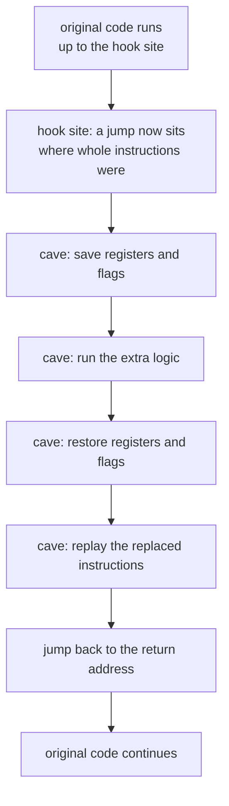

import CodeTrace from '../../../../components/CodeTrace.astro';
import Frame from '../../../../components/kit/Frame.astro';
import MemoryStrip from '../../../../components/MemoryStrip.astro';
import MarginNote from '../../../../components/kit/MarginNote.astro';

## The problem with replacing code

The pointer path gives us a repeatable way to find data, but it cannot add
behavior. Replacing the gold-changing instruction with `nop` was useful for
one quick test, but it could only remove behavior. What if we want to observe
values, add a check, or run several instructions and then resume the game?

A **code cave** is a spare executable area used for extra code. A **detour** redirects execution there and then returns.

The road-diversion image behind the name is worth taking literally, because
every part of it maps onto something you have to get right. You put a sign at
one junction sending traffic down a side road that rejoins the main road
further along. You have not demolished the main road, so traffic can be
restored by removing the sign. The side road must rejoin — a diversion that
just stops leaves everyone stranded, which is what a detour with no return jump
does. And the sign has to replace a whole junction, not half of one, which is
the instruction-boundary problem below.



## A detour needs five parts

A responsible detour has:

1. **hook site** — the instructions being replaced;
2. **saved bytes** — an exact copy of those original instructions;
3. **cave** — memory where the new code can execute;
4. **extra logic** — the observation or change;
5. **return address** — the first untouched instruction after the hook.

If any one is wrong, the game may crash or behave strangely.

<Frame caption="A detour must reconnect with normal execution">
  
</Frame>

<MarginNote kind="brief">A detour has five parts: a hook site, saved bytes, a cave, the extra logic, and a return address. Get one wrong and the game may crash.</MarginNote>

## Instructions are not all the same size

On x86, one instruction may be 1 byte and another may be 7 bytes. A typical near jump needs 5 bytes. You must replace **whole instructions** until you have enough room.

The reason is that the CPU keeps no map of where instructions begin. It starts
decoding at whatever address it is handed and reads forward, letting each
opcode announce how many bytes it consumes. Start it one byte late and every
instruction from that point on is decoded from the wrong position.

Take the six-byte span this lesson hooks:

<MemoryStrip
  cells="0x1000=8B|=01|0x1002=8D|=74|=26|=00"
  groups="0-1:`mov eax, [ecx]`|2-5:`lea esi, [esi]`"
  caption="Two whole instructions, six bytes."
/>

A five-byte jump written over it covers `8B 01 8D 74 26` and strands the final
`00`. When the cave later returns to `0x1005`, the CPU does not see “the
leftover tail of a `lea`.” It sees a fresh byte stream beginning with `00`,
which starts a completely different instruction that swallows whatever follows
as its operands. Execution continues confidently into nonsense, and the crash
usually surfaces somewhere unrelated a few instructions later — which is what
makes this mistake so hard to diagnose after the fact.

<MemoryStrip
  cells="0x1000=E9|=??|=??|=??|=??|0x1005=00"
  marks="5"
  groups="0-4:`jmp` to the cave|5-5:stranded"
  caption="Bad: exactly five bytes copied. The cave returns to `0x1005`, and the CPU starts a new instruction at the orphaned `00`."
/>

<MemoryStrip
  cells="0x1000=E9|=??|=??|=??|=??|=90"
  groups="0-4:`jmp` to the cave|5-5:`nop`"
  caption="Good: both whole instructions covered, the spare byte filled with `nop`. The cave returns to `0x1006`, the first untouched byte."
/>

So you round up to the next instruction boundary: cover all six bytes and fill
the spare sixth byte with a `nop`. The return address is the hook address plus
the total number of whole bytes replaced.

<MarginNote kind="alternative">Think of cutting a sentence to paste in a sticker: cut between words, never in the middle of one, or the leftover letters read as nonsense.</MarginNote>


<CodeTrace trace="handoff-instruction-span" />

## Follow the detour before writing a DLL

For the pinned Wesnoth 1.14.9 build, the Terrain Description menu reaches a
six-byte span at `0x00CC_AF8A`: `8B 01 8D 74 26 00`. The first two bytes
encode `mov eax,[ecx]`; the other four encode an alignment `lea`. A jump
needs five bytes, so it must cover both whole instructions and resume at
`0x00CC_AF90`, the first untouched byte.

This short x86 sketch puts code beside the flow diagram above. The two
instructions near the end replay the behavior removed from the hook site;
the final jump lands after all six covered bytes:

```nasm
pushfd                 ; save the interrupted flags
pushad                 ; save the 32-bit general registers
call extra_logic       ; observe or change something
popad
popfd
mov eax, [ecx]         ; replay the first covered instruction
lea esi, [esi]         ; replay the second covered instruction
jmp 0x00CCAF90        ; first untouched Wesnoth instruction
```

`extra_logic` is a placeholder, not a ready-to-install hook. The exact
implementation also has to verify the original bytes, encode a reachable
relative jump, and restore the patch when disabled.

Lesson 2.10 uses x64dbg to trace that route with breakpoints before adding
behavior. [Lesson 6.4](/pages/8/03/#apply-it-to-wesnoth-1149) then builds the
full DLL version: checked gold pointer path, naked x86 cave, relative jump
bytes, saved registers and flags, injector commands, F1 toggle, and restoration.
The exact code and stack diagram live beside that runnable implementation.

## Why assembly is still required

A detour begins and ends at machine-code boundaries. The surrounding program can:

- allocate and own buffers;
- calculate and verify addresses;
- decode instructions with a library;
- build a patch plan;
- restore original bytes automatically;
- expose a small safe API.

The final jump bytes and an in-process hook still require `unsafe` code and a
small amount of assembly. Typed code manages the larger, error-prone lifecycle:

```rust
struct Patch {
    address: usize,
    original: Vec<u8>,
    replacement: Vec<u8>,
}

impl Patch {
    fn is_compatible_with(&self, found: &[u8]) -> bool {
        found == self.original
    }
}
```

Before writing, compare the bytes in memory with `original`. If they differ, stop. The target may be a different version or another tool may already have changed it.

<MarginNote kind="narration">Checking the original bytes first turns a game update into a clean refusal, instead of a crash from writing a jump into the middle of different code.</MarginNote>

## Restore is part of the design

A patch is not complete until it has a cleanup path. Plan restoration before applying the detour:

- store the exact original bytes;
- restore them when the feature is disabled;
- restore them when the tool exits normally;
- make repeated enable/disable operations safe.

This habit will shape the wrappers we build later.

The key distinction is **lifecycle code versus boundary code**. The manager owns
the patch, validates the target, reports failures, and restores state. Assembly describes
the few CPU instructions that must run at the exact hijacked boundary.
