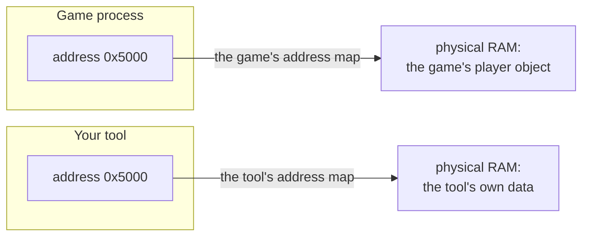
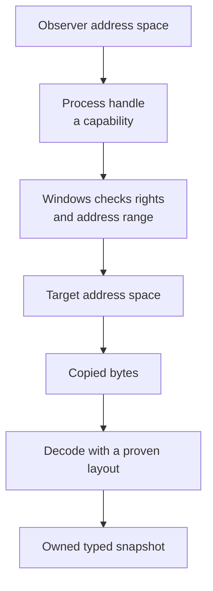
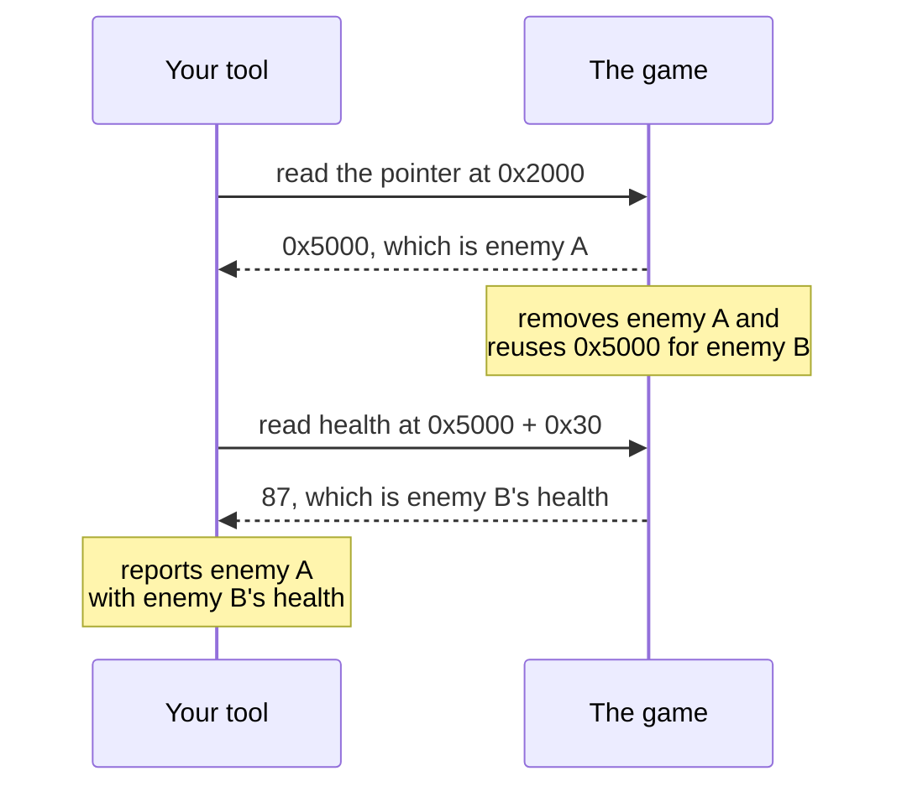
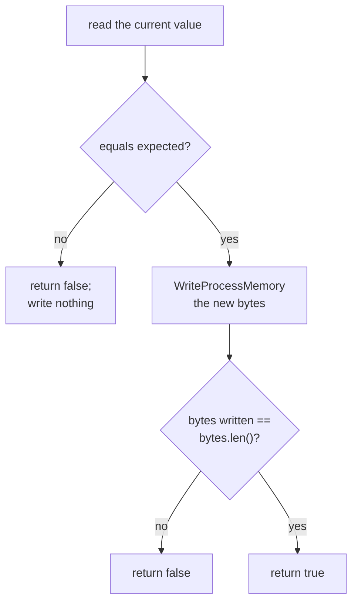

import MemoryStrip from '../../../../components/MemoryStrip.astro';
import Quiz from '../../../../components/Quiz.astro';

## External means “a separate process”

Our tool runs beside the game, not inside it. Windows must grant a process handle with specific rights before the tool can read or write memory.

An address makes sense only in a process's address space. The number `0x5000`
can exist in both processes without naming the same bytes. The process matters
as much as the numeric address:



Windows maps virtual addresses separately for each process. Reading a local
pointer with the same number would inspect the tool's own memory. A process
**handle** names the target and carries the rights granted for this opening;
the Windows read uses that handle with the target address and a byte count.
Lesson 11.5 later examines handles in more depth.

For this lab, the program discovers `wesnoth.exe` with the Windows ToolHelp API,
opens it, resolves the verified pointer chain, and performs the guarded write.
There is no PID or raw-address placeholder for the reader to fill in.

An external tool cannot dereference a target-process pointer directly. Windows
mediates the boundary, and the handle represents the particular access the
observer was granted:



The returned bytes belong to the observer, but their interpretation is valid
only for the target build and moment that justified the layout. A write is a
separate, stronger capability and needs its own expected-value check.

Even two successful reads can describe different moments. Suppose the tool
follows a player pointer, the game removes that player and reuses the same
allocation, and the tool then reads health. Both requests can succeed while
the combined result describes no real player:



Check the returned byte count and revalidate the object path after a multi-step
read. That reduces stale observations; it does not turn several Windows calls
into one atomic snapshot. [Lesson 4.2](/pages/4/02/) builds a bounded
double-capture check for that remaining uncertainty.

## Hands-on target: Wesnoth 1.14.9

For the exact 32-bit Windows build used by this book, the verified gold path is:


This is the practical result from Lesson 2.7. Confirm it in Cheat Engine before running the tool: add a pointer manually, use `0x017EED18` as the base, then add offsets `0xA90` and `0x4`. Start three fresh local matches and verify that it resolves to the gold shown in the game each time.

:::tip
These constants belong to **Wesnoth 1.14.9, 32-bit Windows**. They are intentionally concrete so you can reproduce the hack. On any other build these addresses can point somewhere else, so stop before reading or writing.
:::

## Own the handle with a type

A Windows handle is an **opaque ticket** stored in one process's handle table.
It is not the process, file, event, or section itself, and it is not an address
you should dereference. Windows uses the ticket to find the kernel-managed
object and to remember which access rights this particular opening received.
Two handles can therefore name the same object while granting different
permissions.

That gives a handle four rules:

1. **Scope:** a handle value is normally meaningful only in the process whose
   handle table contains it. `DuplicateHandle` can deliberately create another.
2. **Rights:** `OpenProcess(PROCESS_VM_READ, ...)` asks for a capability. The
   returned handle carries only the rights Windows granted for that opening.
3. **Lifetime:** the handle stays valid until its owner closes it. Closing the
   last handle to many kernel objects lets Windows destroy that object.
4. **Correct closer:** many kernel-object handles use `CloseHandle`, but not
   every Windows value does. `SOCKET`, `HKEY`, `HMODULE`, and `HWND` follow
   their own APIs and ownership rules. Never call `CloseHandle` merely because
   a type's name begins with `H`.

The [`HANDLE`](https://learn.microsoft.com/en-us/windows/win32/sysinfo/kernel-objects)
type is intentionally opaque. The `Drop` trait gives an owned handle an
automatic cleanup path:

```rust
use windows::Win32::{
    Foundation::{CloseHandle, HANDLE},
    System::Threading::{
        OpenProcess, PROCESS_QUERY_INFORMATION, PROCESS_VM_OPERATION,
        PROCESS_VM_READ, PROCESS_VM_WRITE,
    },
};

struct OwnedHandle(HANDLE);

impl OwnedHandle {
    fn raw(&self) -> HANDLE {
        // 👀 Borrow the ticket for one API call; ownership stays in `self`.
        self.0
    }
}

impl Drop for OwnedHandle {
    fn drop(&mut self) {
        // 🧹 SAFETY: this instance owns the live handle and closes it exactly once.
        let _ = unsafe { CloseHandle(self.0) };
    }
}
```

The wrapper itself is not magic. Its constructor must accept only a valid,
owned handle; it must not wrap pseudo-handles such as `GetCurrentProcess()` as
though they need closing; and its raw value should be borrowed briefly instead
of copied into long-lived state. In larger tools, `std::os::windows::io` types
such as `OwnedHandle` and `BorrowedHandle` can express the same ownership split
for compatible handle families.

The ownership improvement is small in code and large in behavior:

```diff
 fn load_gold(process_id: u32, rights: PROCESS_ACCESS_RIGHTS) -> anyhow::Result<u32> {
-    let handle = OpenProcess(rights, false, process_id)?;
-    let gold = read_gold(handle)?;
-    CloseHandle(handle)?;
-    Ok(gold)
+    let process = Process::open(process_id, rights)?;
+    let gold = process.read_gold()?;
+    Ok(gold) // OwnedHandle::drop closes the handle on every return path
 }
```

:::note[Why this version?]
Every use of `?` can return early. Manual cleanup at the
bottom is skipped by those early returns, while `Drop` runs when the owning
value leaves scope. Keeping `OwnedHandle` private also prevents callers from
copying the raw handle and closing it twice. The wrapper does not hide Windows
errors; it only makes the cleanup rule automatic.
:::

The `Process` type stores this `OwnedHandle`. The rest of the program cannot
forget to close it. Its complete ToolHelp implementation is in
[`process.rs`](/windows-labs/src/windows_impl/process.rs); the important
discovery step is:

```rust
pub fn find(name: &str) -> anyhow::Result<ProcessEntry> {
    Process::list()?
        .into_iter()
        .find(|entry| entry.name.eq_ignore_ascii_case(name))
        .with_context(|| format!("process {name:?} is not running"))
}
```

`Process::list` creates a `TH32CS_SNAPPROCESS` snapshot, initializes
`PROCESSENTRY32W.dwSize`, and repeatedly calls `Process32FirstW` and
`Process32NextW`. That code is shown in full in the linked source rather than
being replaced by “enumerate processes here.”

## Read into a byte buffer

Put `ReadProcessMemory` behind a method:

```rust
use std::ffi::c_void;
use windows::Win32::System::Diagnostics::Debug::ReadProcessMemory;

impl Process {
    fn read_exact(&self, address: usize, buffer: &mut [u8]) -> windows::core::Result<()> {
        let mut bytes_read = 0_usize;

        // 🛡️ SAFETY:
        // - `buffer` is valid for exactly `buffer.len()` writable bytes.
        // - Windows validates the remote address against the target process.
        // - `self.handle` remains open for this call.
        unsafe {
            ReadProcessMemory(
                self.handle,
                address as *const c_void,
                buffer.as_mut_ptr().cast(),
                buffer.len(),
                Some(&mut bytes_read),
            )?;
        }

        // ✅ A successful API call may still report a short copy. Callers asked
        // for an exact value, so returning partly old buffer data would be a bug.
        if bytes_read != buffer.len() {
            return Err(windows::core::Error::from_win32());
        }
        Ok(())
    }

    fn read_u32(&self, address: usize) -> windows::core::Result<u32> {
        let mut bytes = [0_u8; 4];
        self.read_exact(address, &mut bytes)?;
        // 🧭 These Windows/x86 course targets store integers least-significant
        // byte first; the conversion documents that byte-order agreement.
        Ok(u32::from_le_bytes(bytes))
    }
}
```

The public method returns a normal `u32`. Raw pointers never escape the wrapper.

## Read the verified gold

The wrapper now returns ordinary values, so the caller can follow the
previously verified pointer path without touching raw pointers. In this
example, `wesnoth_gold_address` resolves the current run's gold field;
`read_u32` copies its four bytes into the tool. A successful run prints the
address and the current gold value. A missing process, invalid path, or failed
read returns an error through `?` instead of printing a made-up result.

```rust
use anyhow::{Context, Result};

fn main() -> Result<()> {
    let process = Process::open_by_name("wesnoth.exe", false)?;
    let gold_address = wesnoth_gold_address(&process)?;
    let gold = process.read_u32(gold_address)?;
    println!("Gold at {gold_address:#010x}: {gold}");
    Ok(())
}
```

Run the tool from an ordinary terminal in the VM. If Windows denies access, report the error; do not automatically demand more privileges.

## Add a guarded write

Writing should be opt-in and should verify the expected old value first:



The method below turns the diagram into a checked write. Given an address,
the value we expect there, and a replacement, it returns `Ok(false)` without
writing if the value has changed. A matching value permits one four-byte
write, and the result is `true` only when Windows reports all four bytes
written. Another game thread can still race this check, so the caller must
treat the result as evidence for this attempt, not a permanent guarantee.

```rust
use windows::Win32::System::Diagnostics::Debug::WriteProcessMemory;

impl Process {
    fn write_u32_if(
        &self,
        address: usize,
        expected: u32,
        replacement: u32,
    ) -> windows::core::Result<bool> {
        // ⚠️ Re-read immediately before writing. A scan result is only an old
        // observation, and the running game may have changed this value since.
        if self.read_u32(address)? != expected {
            return Ok(false);
        }

        let bytes = replacement.to_le_bytes();
        let mut written = 0_usize;

        // 🛡️ SAFETY: `bytes` is a live readable buffer; Windows validates the
        // destination; the handle was opened with write and operation rights.
        unsafe {
            WriteProcessMemory(
                self.handle,
                address as *const c_void,
                bytes.as_ptr().cast(),
                bytes.len(),
                Some(&mut written),
            )?;
        }

        // ✅ Do not claim success when Windows copied only part of the value.
        Ok(written == bytes.len())
    }
}
```

Open the handle with `allow_write: true` only when the user explicitly requests a lab change.

## Defeat the moving-address problem

Wesnoth 1.14.9 is a 32-bit target, so a 64-bit tool must read its pointers as **four-byte `u32` values**, not as the tool's native `usize`:

<MemoryStrip
  cells="=b0|=b1|=b2|=b3|=b4|=b5|=b6|=b7"
  marks="0-3"
  groups="0-3:the actual 32-bit pointer: `read_u32` takes exactly these 4 bytes|0-7:a native 64-bit `usize` read would consume all 8 bytes here"
  caption="For example: reading a native `usize` on a 64-bit tool silently absorbs the next field's 4 bytes into the pointer value."
/>

```rust
const WESNOTH_PLAYER_ROOT: usize = 0x017E_ED18;
const GAME_OFFSET: usize = 0x0A90;
const GOLD_OFFSET: usize = 0x0004;

fn read_pointer32(process: &Process, address: usize) -> windows::core::Result<usize> {
    // 📏 Pointer width belongs to the target process, not to this tool. Reading
    // a native usize here would consume eight bytes in a 64-bit build.
    Ok(process.read_u32(address)? as usize)
}

fn wesnoth_gold_address(process: &Process) -> anyhow::Result<usize> {
    let player = read_pointer32(process, WESNOTH_PLAYER_ROOT)?;
    anyhow::ensure!(player != 0, "no local match is active");

    let game_pointer_address = player.checked_add(GAME_OFFSET)
        .context("game pointer address overflowed")?;
    let game = read_pointer32(process, game_pointer_address)?;
    anyhow::ensure!(game != 0, "game object is unavailable");

    game.checked_add(GOLD_OFFSET)
        .context("gold address overflowed")
}
```

Now perform the actual hack:

```rust
let process = Process::open_by_name("wesnoth.exe", true)?;
let gold_address = wesnoth_gold_address(&process)?;
let old_gold = process.read_u32(gold_address)?;

println!("gold at {gold_address:#010x}: {old_gold}");
let changed = process.write_u32_if(gold_address, old_gold, 999)?;
anyhow::ensure!(changed, "gold changed before the guarded write");
println!("gold is now 999");
```

Return to Wesnoth and recruit a unit or end the turn to refresh the display. The gold should show `999` and behave as real spendable gold. Close and reopen the game to prove that the program resolves the dynamic address again.

You can build and run the finished program directly:

```powershell
cd windows-labs
cargo build --release --target i686-pc-windows-msvc --bin wesnoth_gold
.\target\i686-pc-windows-msvc\release\wesnoth_gold.exe 999
```

The complete entry point is [`wesnoth_gold.rs`](/windows-labs/src/bin/wesnoth_gold.rs).

## Make failure useful

Test these cases:

- wrong PID;
- target closed;
- malformed hex address;
- unreadable address;
- expected value does not match;
- pointer in the chain is zero.

A good low-level tool is not the one that never sees errors. It is the one that sees errors clearly and stops before making a bad write.

<Quiz
  id="guarded-write-reason"
  type="multiple-choice"
  title="Guard the final write"
  prompt="Why read the current value and compare it with the expected value immediately before writing?"
  options="It makes Windows assign a permanent address||It turns a 32-bit target into a 64-bit target||It catches a stale scan result or a value that changed since you inspected it||It allows the tool to ignore handle permissions"
  answer="2"
  explanation="A scan or earlier read describes only the moment it happened. The process keeps running. A final comparison catches a restart, race, wrong build, or normal game update before your tool writes to a location whose meaning has changed."
/>
