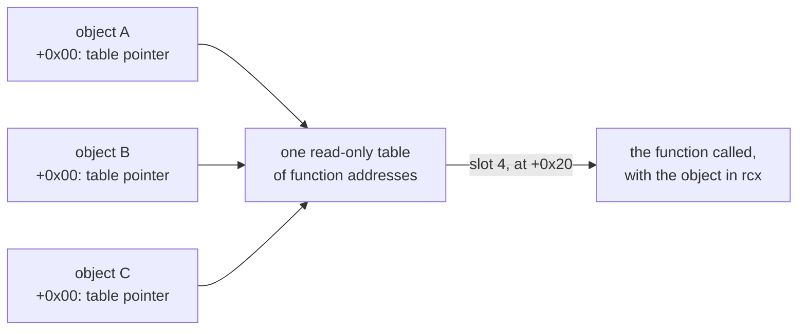
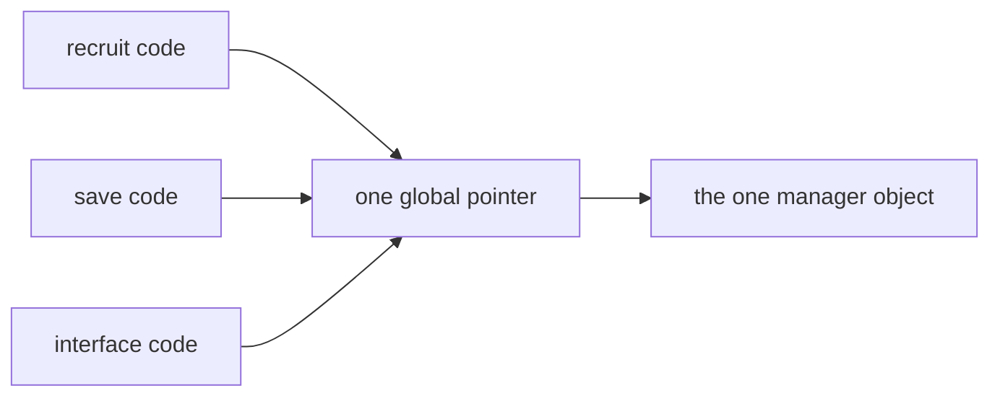
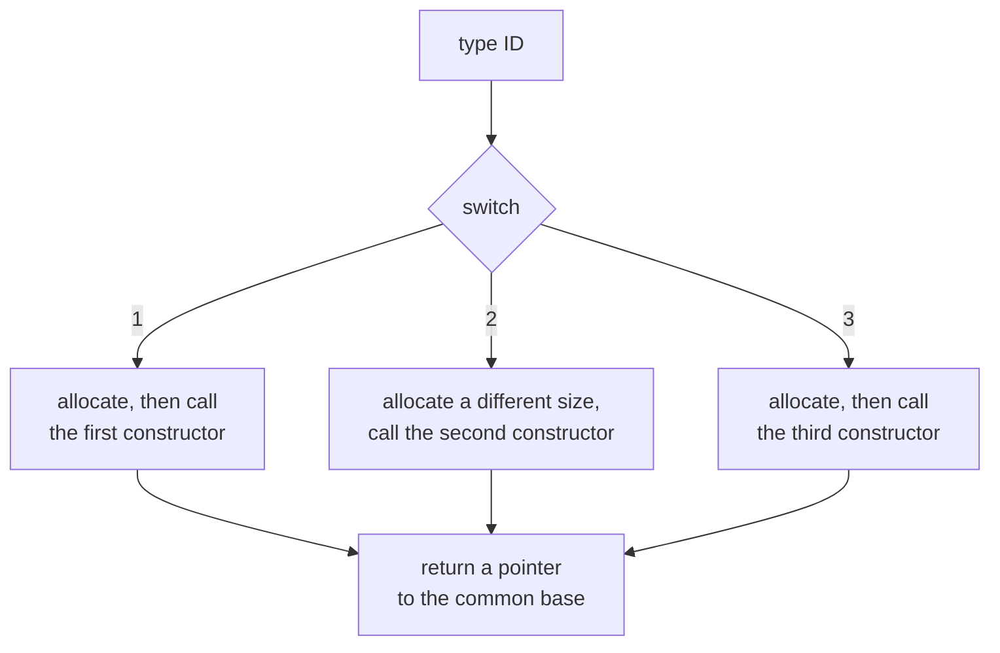
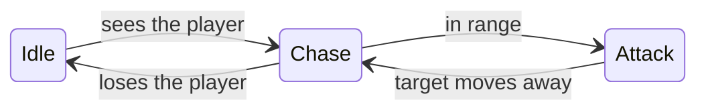
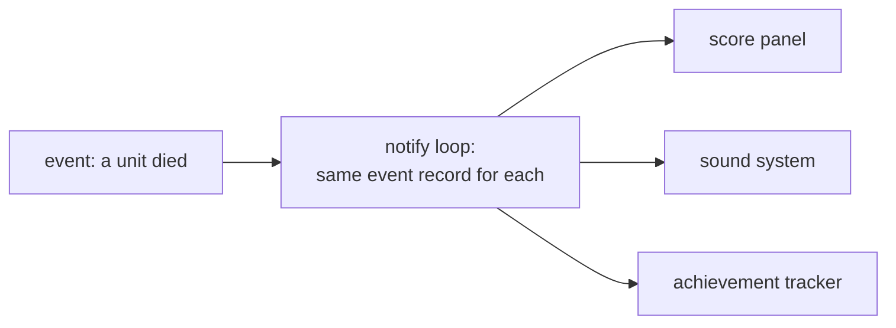

import MemoryStrip from '../../../../components/MemoryStrip.astro';

## Source patterns do not survive as labels

A C++ programmer may write a class named `EnemyFactory`, a `State` interface, and an `Observer` list. The processor never sees those friendly names. After compilation it sees addresses, loads, stores, comparisons, and calls.

That sounds discouraging, but design patterns still leave **shapes** in memory and code. A vtable is a row of function pointers. A factory allocates an object and initializes it. An observer loop walks a collection and calls similar functions. One shape alone is common in unrelated code, but several that fit together usually point to one pattern. 🧩

When debug symbols exist for a build, they give the real names and layouts, so they can check a layout recovered from the version-pinned executable.

## A pattern name communicates intent

Design patterns are shared names for recurring design decisions. They do not
all exist merely to “remove dependencies,” and two patterns can produce
similar-looking machine code. Their important difference is often **intent**:
why the pieces are separated and what kind of change the design expects.

For example, both State and Strategy may delegate through a function table.
State usually represents behavior that changes as an object moves through a
lifecycle. Strategy usually selects one replaceable rule. Observed transitions
and call sites matter more than the table shape.

In your own tool, use a pattern after repeated change exposes a real
problem: duplicated lifecycle code, tangled ownership, or features that cannot
be tested separately. Do not add a factory, observer, or trait hierarchy only
because the name sounds professional. A smaller function or enum is often the
clearer design.

In a compiled game, a pattern name describes a likely role. It does not
recreate the original source or prove what the programmer intended.

## Start from what the code does, not class names

Suppose three heap objects all begin with the same pointer. That pointer leads into a read-only section containing executable addresses. Several call sites do this:

```asm
mov rcx, rbx          ; rcx is probably the current object (`this`)
mov rax, [rcx]        ; read the first field, possibly a vtable pointer
call qword ptr [rax+20h] ; call virtual slot 4
```



What this code shows is small:

> Objects at these addresses share a function table, and slot four receives the object address.

Slot four is at `+0x20` because each slot holds one 8-byte function address on 64-bit Windows, and `0x20` is 2 × 16 = 32 bytes, which is 32 ÷ 8 = 4 slots past slot zero.

The code does **not** show the source class name, the inheritance tree, or the method name. Two facts can be checked directly: offset `0x00` points into read-only module memory, and the entries of that table point to executable module pages. Together they match how C++ compilers implement a vptr, so offset `0x00` is very likely one. A name such as `Actor` is a label chosen from the object's behavior; nothing in the binary says what the original class was called.

## Five patterns and the clues they leave

### Singleton or global manager

A singleton is one shared object. Look for many functions loading the same global pointer before accessing fields:

```asm
mov rax, [rip+player_manager]
test rax, rax
je not_ready
mov ecx, [rax+30h]
```



One global pointer alone does not make a singleton; it might be a cache or the current scene. A singleton is allocated once during initialization, reused by many unrelated call sites, and released at shutdown.

### Factory

A factory chooses which concrete object to create. A common compiled shape is:

1. inspect a type ID;
2. choose an allocation size;
3. call an allocator;
4. call one of several constructors;
5. return a common base pointer.



A switch followed by several constructor calls is more useful than the word “factory.” Follow each constructor and compare its first vptr write and field initialization.

### State or strategy

State and strategy patterns both replace one behavior with another. Memory may contain a pointer to a small behavior object or a function table. The owner delegates work to it each update.



Each arrow is a moment when the owner's behavior pointer changes. If it changes when an enemy moves from idle to chase to attack, “state” is a useful name. If it changes when a weapon changes its aiming rule, “strategy” may fit better. The bytes do not care which textbook word you choose; behavior over time is the deciding clue.

### Observer

An observer system keeps a collection of listeners and calls them when an event occurs. Look for one loop that:

- walks a vector, list, or handle table;
- passes the same event record to each element;
- makes a direct or virtual call;
- tolerates an empty collection.



Do not confuse this with an ordinary entity update loop. An observer loop usually starts from an event or notification function and passes similar event data to many unlike objects.

### Component or entity-component system

Composition stores behavior in separate components rather than one deep inheritance tree. Useful clues include:

- an entity ID used to index several pools;
- type IDs mapped to separate arrays;
- bit masks describing which components an entity owns;
- tightly packed arrays of positions or health values;
- systems that loop over one component type at a time.

<MemoryStrip
  cells="=pos 0|=pos 1|=pos 2|=pos 3|=pos 4"
  groups="0-4:one component type, packed together"
  caption="A movement system walks this array and touches nothing else."
/>

If position records are contiguous while unrelated entity fields live elsewhere, do not force them into one giant `Player` structure. The game may be data-oriented.

## Constructors are layout witnesses

A constructor often writes the vptr and then initializes fields:

```asm
mov [rcx], rax        ; vptr at +0x00
mov dword ptr [rcx+8], 64h ; likely integer default 100
mov qword ptr [rcx+10h], 0 ; likely pointer or 64-bit field
```

<MemoryStrip
  cells="+0x00=vptr|+0x04=vptr|+0x08=100|+0x0C=?|+0x10=0|+0x14=0"
  marks="3"
  groups="0-1:`mov [rcx], rax`: 8 bytes|2-2:`dword` 100|3-3:not written|4-5:`qword` 0"
  caption="Each box is four bytes. The three stores reach `+0x18`; the bytes at `+0x0C` are never written, so they stay unknown."
/>

The last store starts at `+0x10` and writes a `qword`—eight bytes—so the constructor touches bytes through `+0x18` (`0x10 + 8 = 0x18`). That gives a minimum object size of at least `0x18` bytes, but alignment may make the allocation larger. Compare the allocator’s requested size, constructor stores, destructor reads, and ordinary methods. No single function tells the whole story.

## A repeatable reconstruction method

1. Collect several live object addresses from the exact local build.
2. Group objects by their first pointer and validate that it leads to executable function entries.
3. Find code that writes that first pointer; it may be a constructor.
4. Find code that allocates the object and read the requested size.
5. Label every repeated field access as `field_08`, `field_10`, and so on.
6. Watch which actions change each field.
7. Find virtual call slots and trace their arguments and side effects.
8. Name a pattern only when several of these shapes agree.
9. Compare with source or debug symbols as a final answer key.

The goal is not to make the class diagram look impressive. The goal is to build a model that correctly predicts what the program will do next.

## Common mistakes

- ❌ Naming a class from one interesting string.
- ✅ Naming fields provisionally, such as `field_08`, until their behavior is clear.
- ❌ Treating every first pointer as a vptr.
- ✅ Checking page permissions and several table entries.
- ❌ Assuming inheritance because two objects share fields.
- ✅ Checking vtables, constructors, conversions, and call behavior.
- ❌ Forcing an entity-component design into one C-style struct.
- ✅ Letting access patterns reveal where each component really lives.

Next, we will add ownership and lifetime clues so the recovered model explains not just *what* an object is, but *who keeps it alive*.
