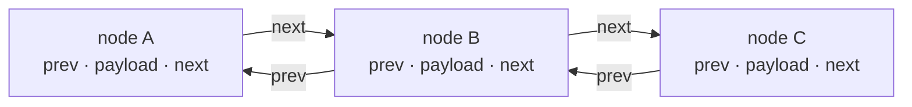
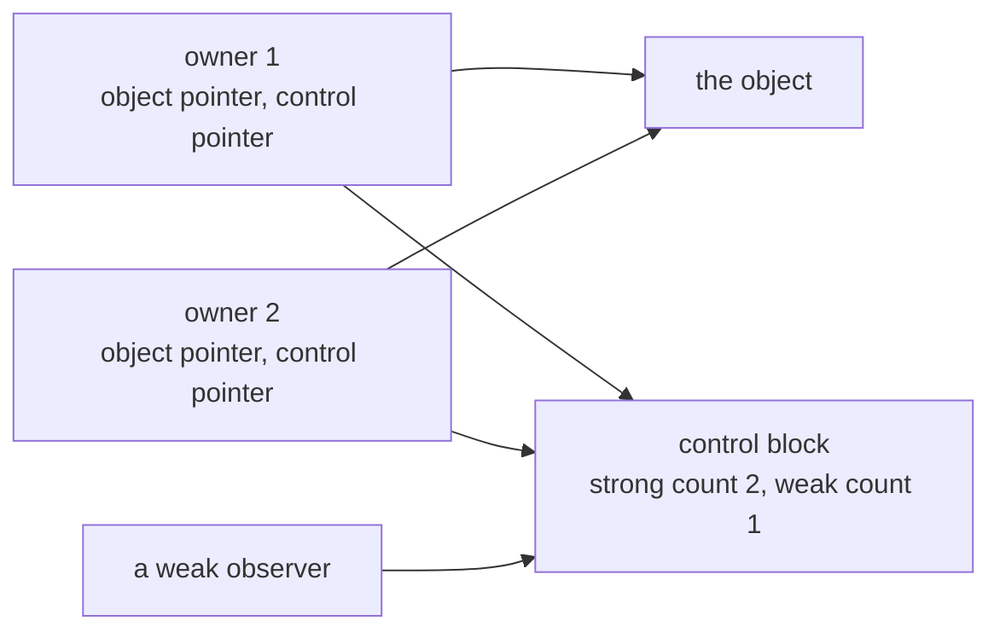
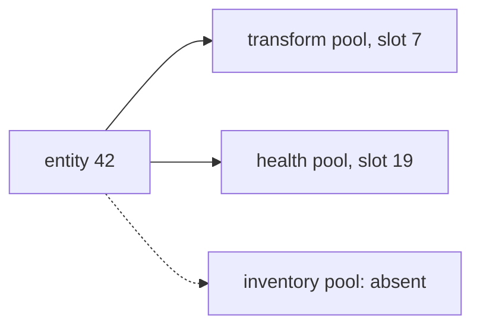

import MemoryStrip from '../../../../components/MemoryStrip.astro';

## A field layout is only half a model

Imagine that offset `0x40` points to a weapon. Knowing that does not answer the dangerous questions:

- Does the player own the weapon?
- Can several players share it?
- Can it disappear while another system still remembers it?
- Is the value a pointer, an index, or a generation-checked handle?

These are **lifetime** questions. A reliable memory tool needs them because an address that was correct one frame ago may now belong to a different allocation.

## Recognize behavior before naming a container

Compiler libraries have implementation details that can change. Instead of memorizing one screenshot of `std::vector`, recognize its behavior.

A vector-like container commonly needs three logical facts:

| Fact | Meaning |
|---|---|
| begin | address of the first element |
| end | one element past the last live element |
| capacity end | one element past the allocated storage |

The element count is `(end - begin) / element_size`. Before using that formula, verify all of these:

```text
begin <= end <= capacity_end
(end - begin) is divisible by element_size
the addresses belong to readable memory
the resulting count fits a sensible limit
```

Worked through with real numbers, a vector of 32-byte entities might look like
this:

```text
begin        = 0x0453_1000
end          = 0x0453_1140
capacity_end = 0x0453_1400

end - begin          = 0x140 = 1×256 + 4×16  =  320 bytes
capacity_end - begin = 0x400 = 4×256         = 1024 bytes

320 / 32  = 10 live elements
1024 / 32 = 32 elements of allocated room
```

<MemoryStrip
  cells="0x04531000=0|=1|=2|=· · ·|=9|0x04531140=10|=· · ·|=31"
  marks="0-4"
  groups="0-4:live: 0x140 ÷ 32 = 10 elements|5-7:allocated, never constructed: 22"
  caption="The element storage behind `begin`, `end`, and `capacity_end`. Boxes are elements, not bytes."
/>

The gap between `end` and `capacity_end` is the container's spare room. That is
exactly why the count has to come from `end` rather than from the size of the
allocation — using the allocation would report 32 entities, 22 of which were
never constructed.

Notice how much rests on `element_size` being correct. Guess 16 bytes instead
of 32 and the same three pointers report 320 / 16 = 20 elements, half of them
the second halves of real entities. Every address is readable and the count
looks entirely reasonable. The divisibility check rejects many wrong guesses,
but not one that happens to divide evenly like this, so the element size has to
come from somewhere else: the stride the code actually uses when it walks from
one element to the next.

Those checks describe meaning. They remain useful even if a compiler changes field order.

## Fixed offsets and scaled offsets answer different questions

Machine code often exposes an address formula. Read the formula before naming
the container:

```text
base + fixed_offset             → one possible field
base + index × stride           → one possible array element
base + index × stride + offset  → one field inside an array element
```

<MemoryStrip
  cells="+0x00=record 0|+0x08=field|+0x30=record 1|+0x38=field|+0x60=record 2|+0x68=field"
  marks="1|3|5"
  groups="0-1:0x30 bytes|2-3:0x30 bytes|4-5:0x30 bytes"
  caption="`base + index × 0x30 + 0x08` lands on the highlighted field of each record. Not to scale."
/>

For example, `base + index * 0x30 + 0x08` suggests records that are `0x30`
bytes apart and a candidate field eight bytes into each record. Test several
indexes and compare the same behavior at each calculated address.

The formula shows how the code computes an address, not the declared type. A
compiler can unroll a small loop into three fixed-offset stores, making an array
look like a structure. Conversely, a table-driven system can compute what is
logically a field offset, making a structure look indexed. Access patterns over
time settle it:

- repeated neighboring strides support an array-of-records model;
- many unrelated functions reusing the same constants support named fields;
- allocation size gives an upper bound, not a complete layout;
- instruction width constrains a field's size, not necessarily its full type;
- one readable value never distinguishes a pointer, handle, counter, or bit set.

## Strings can store short text inside themselves

Many C++ string implementations use a **small-string optimization**. Short names may live directly inside the string object, while longer names use a heap buffer. This explains a confusing sight: one player name looks like text at offset `0x20`, but a longer name makes the same bytes look like a pointer.

Here is one real implementation's layout, the 32-bit Microsoft C++ library's
`std::string`, holding a short name and then a long one:

<MemoryStrip
  cells="+0x00=Ada, then a zero byte|+0x10=size 3|+0x14=capacity 15"
  groups="0-0:16 bytes: the text itself"
  caption="Short: up to 15 characters live inside the object."
/>

<MemoryStrip
  cells="+0x00=pointer to heap text|+0x10=size 40|+0x14=capacity ≥ 40"
  marks="0"
  groups="0-0:the same 16 bytes now start with a pointer"
  caption="Long: the first four bytes point to a heap buffer, and the capacity tells you which mode you are in."
/>

Do not read an assumed pointer until you identify the mode flag or length behavior. Compare the same object with names on both sides of the suspected short-string limit. 🔬

## Linked structures leave different clues

A vector keeps its elements side by side, so code finds element *n* with
arithmetic. Three other common containers give up that arithmetic in exchange
for something else, and each exchange leaves a recognisable pattern in the code
that walks it.

### A linked list: every element points to the next

A **linked list** stores each element in its own heap block, called a **node**,
together with the address of the next node, and often the previous one too. It
exists to make inserting and removing cheap. Taking the first of 10,000 elements
out of a vector means sliding the other 9,999 down one place; taking it out of a
doubly linked list means rewriting two pointers in its neighbours.



The price is that a list has no arithmetic shortcut. Reaching the 1,000th node
takes 1,000 reads, each one loading the next pointer out of the node just
reached. That repeated load from a fixed offset inside the current node, such as
`mov eax, [eax+4]` in a loop, is the list's clue. The nodes are wherever the
allocator put them, not in one block.

### A search tree: each comparison discards half

A **binary search tree** node holds a key and two child pointers: smaller keys
go to the left, larger ones to the right. Finding a key means comparing and
stepping left or right, and each step throws away about half of what is left,
so a tree of 1,000,000 entries needs only about 20 steps: halving 1,000,000
twenty times reaches 1, because 2²⁰ = 1,048,576. `std::map` is built on such a
tree. Its clue is a loop that compares a key and then loads one of two pointers
depending on the result. Its failure is lopsidedness: keys inserted in sorted
order all go the same way and turn the tree into a slow list, which is why real
implementations rebalance themselves.

### A hash table: arithmetic picks the bucket

A **hash table** turns the key into a number, its **hash**, and uses that number
to pick one slot, or **bucket**, in an array of buckets. Only the entries in that
bucket are checked, so a lookup costs about the same with 10 entries or
10,000,000. With 16 buckets, a hash of `0x5A3` selects bucket
`0x5A3 & 0xF` = 3, because the mask `0xF` keeps only the last hex digit. The
clue is arithmetic on the key (multiplies, shifts, XORs), then that mask or a
remainder, then a short walk through one bucket. Two keys can land in the same
bucket, a **collision**, which is why each bucket may hold a short list.
[Lesson 12.2](/pages/12/02/#how-a-map-finds-a-key) shows the same idea inside
Lua's tables.

Validate structural invariants:

- a doubly linked node’s `next.prev` should return to the node;
- tree children should eventually end at a sentinel or null;
- bucket indices must stay below the bucket count;
- traversal needs a maximum-node limit and a visited-address set.

The visited set is important. Corrupted data could form a cycle and otherwise trap a scanner forever.

## Raw pointers, smart pointers, and handles

### Unique ownership

If one owner’s destructor directly destroys the pointed object, and moves clear the old pointer, unique ownership is likely. That resembles C++ `unique_ptr`, but use a neutral label until symbols confirm it.

### Shared ownership

Shared objects often have a separate control block with strong and weak reference counts. Copies increment a count; releases decrement it; a transition to zero calls a destructor. The object pointer and control-block pointer may travel together.



Never edit a suspected count. The calls around it show whether its updates are atomic, as a thread-safe reference count's must be; a plain integer that happens to rise and fall is not enough to call something a reference count.

### Handles

Games often avoid long-lived raw pointers by storing a small handle:

```rust
#[derive(Debug, Clone, Copy, PartialEq, Eq)]
struct Handle {
    index: u32,
    generation: u32,
}

fn resolve<'a, T>(handle: Handle, slots: &'a [Slot<T>]) -> Option<&'a T> {
    let slot = slots.get(handle.index as usize)?;
    (slot.generation == handle.generation).then_some(slot.value.as_ref()?)
}

struct Slot<T> {
    generation: u32,
    value: Option<T>,
}
```

The index chooses a slot. The generation proves that the slot still represents the same logical object. If a deleted entity’s slot is reused, its generation changes and old handles stop resolving. ✅

## Follow destruction as carefully as construction

Constructors show default values and vptr writes. Destructors show ownership:

1. Which child objects are destroyed?
2. Which pointers are merely cleared?
3. Which reference counts are released?
4. Which collections remove the object?
5. Is memory freed immediately or returned to a pool?

Set a breakpoint on an owned toy object’s destructor and delete it through the normal game action. The call chain and the fields the destructor touches answer those five questions. Repeat the experiment, because one run may include unrelated cleanup.

## Component pools store fields in separate collections

In an entity-component system, an entity handle may resolve into several pools:



A sparse set often combines a sparse index array with a dense component array. Deletion may swap the final dense element into the removed slot, so a component’s address can move even while the entity remains valid.

<MemoryStrip
  cells="slot 0=A|slot 1=B|slot 2=C|slot 3=D"
  marks="1"
  caption="A dense component array. Entity B's component is about to be removed."
/>

<MemoryStrip
  cells="slot 0=A|slot 1=D|slot 2=C"
  marks="1"
  caption="Swap-remove: the last element, D, moves into the hole. D's entity did not change, but its component now lives at a different address."
/>

That is why a stable entity ID is often more meaningful than a cached component pointer.

## Make the model honest

Do not immediately use `#[repr(C)] struct Player` for a layout that is only partly known. A staged representation shows which parts are still unknown:

```rust
#[derive(Debug, Clone, Copy)]
struct SuspectedPlayerLayout {
    object_size: usize,
    health_offset: Option<usize>,
    weapon_link_offset: Option<usize>,
    weapon_link_kind: LinkKind,
}

#[derive(Debug, Clone, Copy)]
enum LinkKind {
    Unknown,
    RawPointer,
    SharedOwner,
    GenerationalHandle,
}
```

An `Option` says the field has not been confirmed. `Unknown` prevents a guess from silently becoming a fact. Once source, symbols, and repeated behavior agree, the model can become more precise.

## Checks a recovered layout should pass

- object size agrees with allocation and construction;
- every field offset is seen at multiple call sites;
- container count and capacity pass arithmetic checks;
- traversal has bounds and cycle detection;
- ownership claims agree with destruction behavior;
- cached addresses are invalidated when the game changes scenes;
- the layout is stored with the build it belongs to;
- disagreements remain visible instead of being “fixed” by guessing.
