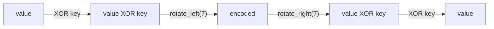
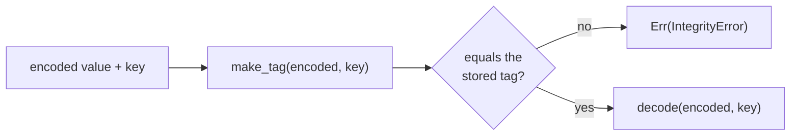

import { Badge, Steps } from '../../../../components/kit';
import AnimatedFlow from '../../../../components/AnimatedFlow.astro';

## Obfuscation changes the representation

A game does not have to store health as the obvious integer `125`. It might XOR the value with a key, rotate the bits, split it across fields, or store both a value and a check value.

This is **obfuscation**: it makes a value less obvious. If the running program can decode it, an analyst can usually trace that decoding logic too. Obfuscation is not the same as encryption, and neither one automatically makes a program fair or secure.

We use the book’s own toy type. Do not use this lesson to defeat protection in a third-party competitive game.

## Start at where meaning appears

Searching memory for the number `125` may fail because that representation never exists for long. A better question is:

> Which instruction produces the value that the health bar or damage rule uses?

In a debug build, place a breakpoint near the rendering or gameplay function, then step backward through the data flow. A small decode might compile into operations like:

```asm
mov eax, [rcx+28h] ; read encoded field
ror eax, 7         ; undo a left rotation
xor eax, edx       ; remove the key
```

Follow `edx` too. A transform without its key is only half the formula.

## Write the formula in both directions

The lab uses:



The inverse relationship is easy to test:

```rust
const ROTATION: u32 = 7;

fn encode(value: u32, key: u32) -> u32 {
    (value ^ key).rotate_left(ROTATION)
}

fn decode(encoded: u32, key: u32) -> u32 {
    encoded.rotate_right(ROTATION) ^ key
}

for value in [0, 1, 100, u32::MAX] {
    assert_eq!(decode(encode(value, 0xA1B2_C3D4), 0xA1B2_C3D4), value);
}
```

That last property is the important one: decoding the encoded value must recover the starting value for many inputs, not only one lucky example.

Follow the loop's `100` case with its key `0xA1B2_C3D4`. The changing numbers
below are all 32-bit values; the final result must return to the starting one:

<AnimatedFlow
  title="Undo a transformation in the opposite order"
  stages={[
    { label: 'Start with the logical value', detail: 'Use value 100 and key 0xA1B2_C3D4, the same key passed to both functions in the test loop.', role: 'input', value: 'value: 100; key: 0xA1B2C3D4' },
    { label: 'XOR with the key', detail: '100 XOR 0xA1B2_C3D4 gives 0xA1B2_C3B0. This intermediate value is what encode rotates next.', role: 'process', value: 'after XOR: 0xA1B2C3B0' },
    { label: 'Store the rotated representation', detail: 'Rotate the 32-bit intermediate left by seven positions. The encoded value is 0xD961_D850, which differs from the logical value 100.', role: 'state', value: 'encoded: 0xD961D850' },
    { label: 'Undo the rotation first', detail: 'decode rotates 0xD961_D850 right by seven positions. That recovers the intermediate 0xA1B2_C3B0 before applying the key.', role: 'process', value: 'after rotate: 0xA1B2C3B0' },
    { label: 'XOR with the same key again', detail: '0xA1B2_C3B0 XOR 0xA1B2_C3D4 returns 100. The round-trip assertion checks this result against the original input.', role: 'output', value: 'decoded: 100' },
  ]}
  caption="Encoding applies XOR then rotation; decoding reverses the order. This reversible toy representation is not a security guarantee."
/>

## An integrity value is another clue

The lab also stores a toy tag calculated from the encoded value and key. When one bit changes, the tag no longer agrees:



The code makes the two exits explicit. It recomputes the tag from the stored
encoded value and the supplied key; a mismatch returns `IntegrityError`
without decoding. A match permits the inverse transformation and returns the
logical value in `Ok`.

```rust
pub fn read(self, key: u32) -> Result<u32, IntegrityError> {
    if self.tag != make_tag(self.encoded, key) {
        return Err(IntegrityError);
    }

    Ok(decode(self.encoded, key))
}
```

This tag is educational, not cryptographically secure. An attacker who understands `make_tag` can calculate a matching tag. The useful lesson is structural: if a changed value is immediately rejected, look for another field or function that validates it.

## Dynamic keys change over time

Some programs change a key when a level loads, an object is created, or a value is written. Reading the same field at several moments shows which events change the key:

| Moment | Logical value | Encoded bytes | Suspected key source |
|---|---:|---:|---|
| spawn | 125 | `E9 88 …` | constructor argument |
| damage | 100 | `75 84 …` | same object field |
| reload | 125 | different | new session state |

Do not assume a value has “random encryption” merely because its bytes change. The cause may be an ordinary per-object key, a pointer-relative cookie, a checksum, or unrelated neighboring data.

## Run the complete lab

<Badge text="Any computer" variant="success" />

The full implementation lives in `advanced-memory-labs/src/obfuscation.rs`, with a small executable in `src/bin/obfuscation_lab.rs`:

```powershell
cargo run --manifest-path advanced-memory-labs/Cargo.toml --bin obfuscation_lab
cargo test --manifest-path advanced-memory-labs/Cargo.toml obfuscation
```

The demo prints a transformed value, decodes it, flips one bit, and shows the integrity failure. Its tests prove both the round trip and the failure case.

## The analysis, step by step

<Steps>

1. Start from the exact build and one object address.
2. Trigger one controlled change in your own target.
3. Capture the encoded field before and after.
4. Find the code that reads the field for a meaningful decision.
5. Trace every operand feeding the decoded result.
6. Express the operations as a small pure function.
7. Test the inverse over many inputs.
8. Look for validation or duplicate fields.

</Steps>

## What not to conclude

- ❌ “XOR means this is secure encryption.”
- ✅ XOR can be one reversible step; security depends on a complete, reviewed construction and key handling.
- ❌ “The value changed, so my offset is wrong.”
- ✅ The representation or key may have changed.
- ❌ “One successful decode proves the formula.”
- ✅ Test several values, sessions, and objects.
- ❌ “An integrity field is impossible to reproduce.”
- ✅ First determine whether it is a checksum, a keyed MAC (message authentication code, which needs a secret key), or an authenticated-encryption tag.

The next lesson returns to game text and its byte encoding. For the deeper
distinction between checksums, signatures, encryption, and authenticated
formats, continue to [Chapter 9's integrity and protection lessons](/pages/9/07/).
