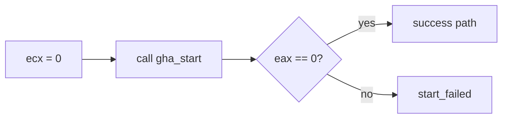
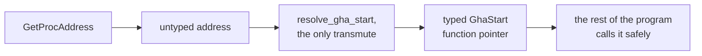

## A function name is not a contract

A DLL export table may reveal a name such as `gha_start`, `GetPlayer`, or `FormatMessage`. That name only tells you that other code can locate the function. It does not fully explain:

- which arguments the caller passes;
- where those arguments arrive;
- what the return value means;
- which side owns pointed-to memory;
- whether the call changes global state;
- whether it is safe to call more than once.

Reconstructing those rules is **interface reversing**. We will practice on this book's own Windows DLL, where the source is available afterward for checking our conclusions.

## Reconstruct four parts of every boundary

Treat a machine-level function boundary as four connected contracts:

1. **Representation:** How many bits does each value use, and is it an integer, float, pointer, flag set, or structure?
2. **Transport:** Which registers or stack locations carry arguments and results?
3. **Ownership:** Who allocates, may mutate, and eventually releases pointed-to data?
4. **Lifetime:** For how long do those addresses and returned views remain valid?

Calling conventions mainly answer transport. They do not answer ownership or lifetime. A function can correctly receive a pointer in `rcx` and still crash later because the caller freed the buffer too early. Likewise, a return value in `rax` might be a borrowed pointer, an owned allocation, a handle, or merely a status code.

Each part of the contract follows from something the machine code does. A callee that reads four bytes through the pointer and never stores it needs only a short read-only borrow. A callee that saves the pointer in a global needs the data to outlive the call.

## Begin with the caller

On 64-bit Windows, the first four integer or pointer arguments normally arrive in `rcx`, `rdx`, `r8`, and `r9`. A return value normally leaves in `rax`. On 32-bit Windows, several calling conventions exist, so also inspect stack cleanup and decorated export names.

Suppose a call site looks like this:



```nasm
xor ecx, ecx
call qword ptr [gha_start]
test eax, eax
jne start_failed
```

Read in plain English, before any types are guessed, the call site says:

1. The caller puts zero in the first argument register.
2. It makes an indirect call through an imported function slot.
3. It tests the low 32 bits of the result.
4. Zero takes the success path; nonzero takes the failure path.

That supports a tentative contract:

```rust
type GhaStart = unsafe extern "system" fn(argument: *mut core::ffi::c_void) -> u32;
```

`extern "system"` selects the platform's Windows **ABI**—application binary interface, the complete machine-level agreement between compiled pieces: which registers or stack slots carry arguments, who cleans up the stack, and where the return value lands. It is the compiled counterpart to a source-level API. `unsafe` is honest: the compiler cannot prove that a raw address really points to a function with this exact contract.

## Where each part of the contract shows up

A decompiler's guessed types are only a starting point. Each question about the contract has a place in the machine code that settles it:

| Question | Where the answer shows up |
| --- | --- |
| Argument count | Registers or stack slots prepared at several call sites |
| Argument type | How the callee reads it: dereference, arithmetic, comparison, or API pass-through |
| Result meaning | Branches and messages immediately after the call |
| Buffer length | Bounds checks, loop limits, and paired size arguments |
| Ownership | Allocation/free calls and whether the caller stores the pointer |
| Repeatability | Global flags, reference counts, or “already started” branches |

One call with a null argument does not prove the argument must always be null. Find a second caller or change the controlled test program.

## Separate lookup from calling

`GetProcAddress` returns an untyped address. Keep the dangerous conversion in one function:



```rust
use core::ffi::c_void;
use windows::{
    Win32::System::LibraryLoader::{GetProcAddress, HMODULE},
    core::PCSTR,
};

type GhaStart = unsafe extern "system" fn(*mut c_void) -> u32;

unsafe fn resolve_gha_start(module: HMODULE) -> anyhow::Result<GhaStart> {
    // SAFETY: the byte string is NUL-terminated and lives for this call. 🔎
    let raw = unsafe { GetProcAddress(module, PCSTR(b"gha_start\0".as_ptr())) }
        .ok_or_else(|| anyhow::anyhow!("DLL does not export gha_start"))?;

    // SAFETY: our debugger evidence and matching test DLL establish this ABI.
    Ok(unsafe { core::mem::transmute::<unsafe extern "system" fn() -> isize, GhaStart>(raw) })
}
```

Why not scatter `transmute` through the program? Because every conversion is a promise about ABI and types. One narrow boundary gives reviewers one place to check that promise.

## Wrap machine results in named variants

The course DLL returns:

- `0` when the worker started;
- `1` when it was already running;
- `2` when the worker thread could not start.

Give those numbers names:

```rust
#[derive(Clone, Copy, Debug, Eq, PartialEq)]
enum StartStatus {
    Started,
    AlreadyRunning,
    ThreadCreationFailed,
    Unknown(u32),
}

impl From<u32> for StartStatus {
    fn from(raw: u32) -> Self {
        match raw {
            0 => Self::Started,
            1 => Self::AlreadyRunning,
            2 => Self::ThreadCreationFailed,
            value => Self::Unknown(value),
        }
    }
}
```

Keep `Unknown`. A future DLL can add a status without making your wrapper silently call it success.

## Prove the calling convention

A wrong ABI can appear to work in one small test and still corrupt registers or the stack. The call itself may return without crashing; the damage shows up later, when an unrelated function reads garbage from a register it expected the callee to preserve, or when a mismatched stack-cleanup convention leaves `esp` off by a few bytes and a later `ret` lands somewhere nonsensical. Check:

1. Which architecture is the caller and DLL?
2. Who removes stack arguments on 32-bit builds?
3. Does the callee return with a plain `ret` or `ret N`?
4. Does a decorated name encode argument bytes?
5. Do several calls return with the stack pointer unchanged?

For x64 Windows there is one main user-mode convention, but argument type and ownership can still be wrong.

## Test with a contract matrix

Test against the DLL from `windows-labs` rather than an unknown third-party export. Each test has an expected result:

| Test | Expected result |
| --- | --- |
| First call with null | Returns `Started` |
| Second call | Returns `AlreadyRunning` |
| Unknown export name | Resolver returns an error; no call occurs |
| Wrong architecture | Windows refuses to load the DLL |
| Stop after start | Export returns and worker observes the stop flag |

The source in `windows-labs/src/windows_impl/dll.rs` then shows the real contract, and any difference from the recovered one points at the exact part of the machine code that was misread.

## Working practices for an undocumented DLL

- Never guess a function pointer type and “try it” in an important process.
- Use the disposable course fixture; a contract recovered from it applies to that exact build.
- Treat every pointer's size, mutability, lifetime, and ownership as a separate question.
- Preserve an `Unknown` result path.
- Keep loading, resolving, converting, calling, and unloading as visible stages.

This same method works for undocumented game plug-ins, supported mod SDKs, and old middleware. The goal is not merely to make one call succeed. The goal is to explain the interface well enough that a small wrapper can enforce it.
