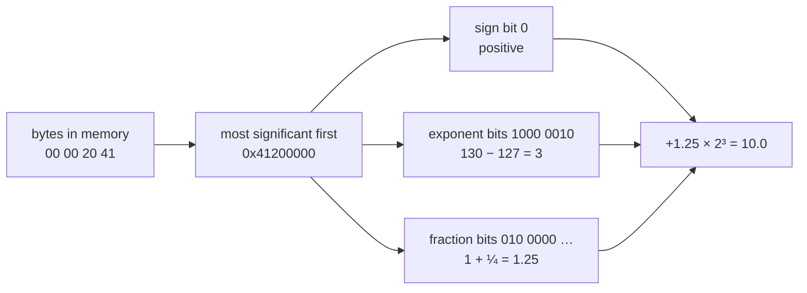

import ConceptLab from '../../../../components/ConceptLab.astro';
import MemoryStrip from '../../../../components/MemoryStrip.astro';
import Quiz from '../../../../components/Quiz.astro';

[Lesson 1.3](/pages/1/03/) made two claims without proving them. The four bytes
`00 00 20 41` are the whole number 1,092,616,192 when a `u32` reads them, and
10.0 when an `f32` reads them. And a pointer's type decides what is read at the
far end, while the pointer's own size stays fixed.

This lesson proves both, one bit at a time, until you can work out every number
yourself. On the way it covers the one thing Lesson 1.3 left out entirely: how
a whole number stores a minus sign.

## Every bit position is a power of two

Lesson 1.3 read a byte by adding up place values: 128, 64, 32, 16, 8, 4, 2, and
1. Each one is two times the one to its right, so each can be written as a
number of twos multiplied together.

Number the positions from the right, starting at 0. Position *n* is then worth
2 multiplied by itself *n* times, which is written 2ⁿ:

| Position | Worth | Written |
|---|---|---|
| 0 | 1 | 2⁰ (no twos multiplied at all) |
| 1 | 2 | 2¹ |
| 2 | 2 × 2 = 4 | 2² |
| 3 | 2 × 2 × 2 = 8 | 2³ |
| 7 | 2 × 2 × 2 × 2 × 2 × 2 × 2 = 128 | 2⁷ |

Counting from 0 is what makes that line up: the rightmost position is 2⁰, and
2⁰ is 1, because no twos have been multiplied in yet.

Wider values keep going. A 32-bit value has positions 0 to 31, and its leftmost
position is worth 2³¹ = 2,147,483,648.

The same notation counts patterns. Every extra bit doubles the number of
patterns, so *n* bits make 2ⁿ of them: 8 bits make 2⁸ = 256, and 32 bits make
2³² = 4,294,967,296. Those are the ranges in Lesson 1.3's type table.

## Negative whole numbers

A `u32` spends all 32 bits on size, so it has no way to say "minus". An `i32`
needs one, and it gets it with a simple change: **the leftmost position is worth
a negative amount**. Every other position keeps its ordinary value.

It is easiest to see in a single byte, the `i8` type. There, the leftmost
position is worth −128 instead of +128:

<MemoryStrip
  cells="−128=1|64=1|32=1|16=1|8=1|4=1|2=1|1=1"
  marks="0"
  groups="0-0:−128|1-7:64 + 32 + 16 + 8 + 4 + 2 + 1 = 127"
  groups2="0-7:−128 + 127 = −1"
  caption="The byte `0xFF` read as an `i8`. The highlighted position is worth −128, so all eight bits set means −1."
/>

Read as a `u8`, the same `0xFF` is 255. Read as an `i8`, it is −1. Nothing about
the byte changed; only the value given to its leftmost position did.

An `i32` works the same way across four bytes, with its leftmost position worth
−2³¹ = −2,147,483,648. So the bytes `FF FF FF FF` are 4,294,967,295 as a `u32`
and −1 as an `i32`. This scheme is called **two's complement**. Its big
advantage is that the CPU can use one adding circuit for both types: add 1 to
`0xFF` and the result carries out of the byte and leaves `0x00`. Read as an
`i8`, that is the correct answer to −1 + 1. Read as a `u8`, it is 255 + 1
wrapping around to 0, because 256 does not fit in a byte.

The `i32` range falls straight out of this. The most negative value has only
the leftmost bit set: −2,147,483,648. The most positive value has every bit set
except the leftmost. Those 31 bits add up to one less than 2³¹, for the same
reason 64 + 32 + 16 + 8 + 4 + 2 + 1 made 127, one less than 128. So the top of
the range is 2,147,483,647.

## Fractions: how an `f32` splits its 32 bits

A whole number cannot hold 3.5 or 0.25. For that, an `f32` uses its 32 bits in
a completely different way. It follows a standard called **IEEE 754**, which is
the rulebook nearly every CPU uses for fractional numbers.

To see the idea, start with how scientists write very large or very small
numbers:

```text
1,500     =  1.5  × 10³
0.0025    =  2.5  × 10⁻³
```

Slide the decimal point until exactly one non-zero digit sits in front of it,
then count how far you slid it as a power of ten. A negative power means the
point slid the other way: 10⁻³ means "divide by 10 three times".

An `f32` does the same thing in binary. Take 10. As a binary whole number it is
`1010`, because the positions holding a 1 are worth 8 and 2, and 8 + 2 = 10.
Slide the binary point three places to the left and count those three places as
a power of two:

```text
10  =  1010 in binary  =  1.010 in binary × 2³
```

That number now has three parts: a sign (positive), a power of two (3), and the
digits after the point (`010`). The 1 in front of the point is missing from that
list on purpose; step 5 below explains why it never needs storing. An `f32`
stores exactly those three things, in three fields that together use all 32
bits:

| Field | Bits | What it stores |
|---|---|---|
| sign | 1 | 0 for positive, 1 for negative |
| exponent | 8 | the power of two, shifted by 127 |
| fraction | 23 | the digits after the binary point |

1 + 8 + 23 = 32. The name *floating point* comes from that middle field: the
exponent decides where the binary point floats to.

Here is 10.0 as it sits in memory: the bytes `00 00 20 41`. Little endian put
the least-significant byte first, so written most-significant first, the way you
write a number, they are `41 20 00 00`. In binary, `0x41` is `0100 0001` and
`0x20` is `0010 0000`.

The fields do not follow the byte boundaries. Keep the same 32 bits in the same
order and regroup them: the first bit is the sign, the next eight are the
exponent, and the last 23 are the fraction.

```text
as bytes:   0100 0001  0010 0000  0000 0000  0000 0000
as fields:  0  1000 0010  010 0000 0000 0000 0000 0000
```

Here are the fields drawn as boxes:

<MemoryStrip
  cells="sign=0|exponent, 8 bits=1000 0010|fraction, 23 bits=010 0000 0000 0000 0000 0000"
  groups="0-0:positive|1-1:130 − 127 = 3, so × 2³|2-2:1 + ¼ = 1.25"
  caption="10.0 as an `f32`: 1.25 × 2³ = 10. The next six steps explain every number in this picture."
/>

### Step 1: the sign bit

The first bit is 0, so the number is positive. A 1 there would make it −10.0 and
change nothing else.

### Step 2: read the exponent field as a whole number

The next eight bits, `1000 0010`, are an ordinary unsigned whole number, read
with the same place values as any byte:

<MemoryStrip
  cells="128=1|64=0|32=0|16=0|8=0|4=0|2=1|1=0"
  marks="0|6"
  groups="0-0:2⁷|6-6:2¹"
  groups2="0-7:128 + 2 = 130"
  caption="The exponent field. Only two positions hold a 1: position 7, worth 2⁷ = 128, and position 1, worth 2¹ = 2."
/>

That is where the 128 and the 2 come from. The leftmost bit of an eight-bit
field sits in position 7 and is worth 2⁷ = 128. The second bit from the right
sits in position 1 and is worth 2¹ = 2. No other bit is set, so the field holds
128 + 2 = 130.

### Step 3: subtract the bias

The real power of two is not 130. It is the stored number minus **127**:

```text
130 − 127 = 3,  so the number is multiplied by 2³ = 8
```

That 127 is called the **bias**, and it exists to solve a real problem. An
eight-bit field can only store 0 to 255, with no minus sign. But exponents need
to be negative too, because numbers smaller than 1 are written with a negative
power of two, the way 0.0025 needed 10⁻³:

```text
0.5   =  1.0 in binary × 2⁻¹
0.25  =  1.0 in binary × 2⁻²
```

One fix would be to spend one of the eight bits on a minus sign. IEEE 754 does
something neater: it shifts the whole range. Every stored exponent is the real
exponent plus 127, so the reader subtracts 127 to get it back.

| Stored field | Real exponent | Multiplies by |
|---|---|---|
| 1 | 1 − 127 = −126 | 2⁻¹²⁶, a tiny fraction |
| 126 | −1 | ½ |
| 127 | 0 | 1 |
| 130 | 3 | 8 |
| 254 | 127 | 2¹²⁷, an enormous number |

127 is used because it sits in the middle of 0 to 255, so there are about as
many negative exponents as positive ones. The stored values 0 and 255 are kept
aside for special cases, covered later in this lesson, which is why the table
stops at 1 and 254.

The shift has a bonus. Because a bigger stored exponent always means a bigger
number, two positive `f32` values compare in the same order as their raw bit
patterns do, which lets hardware compare floats cheaply.

### Step 4: read the fraction field

The last 23 bits are the digits after the binary point. In decimal, the digits
after the point are worth a tenth, a hundredth, a thousandth — each position a
tenth of the one before. In binary each position is worth **half** the one
before:

<MemoryStrip
  cells="½=0|¼=1|⅛=0|1/16=0|1/32=0|1/64=0|the other 17=all 0"
  marks="1"
  groups="1-1:0.25"
  caption="The fraction field's place values. The last of the 23 is worth 1/8,388,608. For 10.0 only the ¼ position holds a 1."
/>

So the fraction `010 0000 …` means 0 × ½ + 1 × ¼ + nothing else = 0.25. That
matches the `.010` in `1.010 × 2³` from the start of this section.

### Step 5: put back the hidden 1

Scientific notation always leaves one non-zero digit in front of the point. In
decimal that digit can be anything from 1 to 9. In binary the only non-zero
digit is 1, so in front of the point there is **always** a 1.

A bit that is always 1 tells you nothing, so an `f32` does not store it. It is
called the **hidden bit**, and the reader adds it back:

```text
1 + 0.25 = 1.25
```

The full number with its hidden 1 put back, 1.25 here, is called the
**significand**. Many tools and older books call it the **mantissa**. Leaving
the 1 out gives an `f32` 24 bits of precision from 23 stored bits.

### Step 6: put the pieces together

In the formula below, `^` means "to the power of", so `2^3` is the same as 2³.
The sign counts as +1 for positive and −1 for negative.

```text
value  =  sign  ×  significand  ×  2^(stored exponent − 127)
       =  +1    ×  1.25         ×  2^(130 − 127)
       =  1.25 × 8
       =  10.0
```



A `u32` reads the same four bytes with none of these boundaries. It treats all
32 bits as one whole number, and gets something unrecognisable:

<MemoryStrip
  cells="=00|=00|=20|=41"
  groups="0-3:read as `u32`: 1,092,616,192"
  groups2="0-3:read as `f32`: 10.0"
  caption="One four-byte pattern, read two ways. Both readings are correct; they answer different questions."
/>

An `f64` follows the same plan with more room: 1 sign bit, 11 exponent bits
with a bias of 1,023, and 52 fraction bits.

## What the rest of the fraction bits are for

For 10.0, only one fraction bit is set and the other 22 are 0. They are not
wasted. They hold finer and finer halves — ⅛, 1/16, 1/32, all the way down to
1/8,388,608 — and 10.0 simply does not need any of them, because it is exactly
1.25 × 8. That is like writing 1.2500000 in decimal: the extra zeros are real
digits that happen to be zero.

Most numbers are not that tidy. Take 10.1. It is 1.2625 × 8, so the fraction has
to be 0.2625. In binary, 0.2625 never ends: its digits settle into `0011`
repeating forever, the same way 1 ÷ 3 is 0.333… forever in decimal. The 23 bits
store as much of it as fits, rounded at the last bit:

<MemoryStrip
  cells="sign=0|exponent=1000 0010|fraction=010 0001 1001 1001 1001 1010"
  groups="1-1:130 − 127 = 3|2-2:about 0.26250005"
  caption="10.1 as an `f32`, the bytes `9A 99 21 41` in memory. Nearly every fraction bit is now doing work, and the stored value is still only close to 10.1."
/>

The stored fraction is 0.2625000476…, so the value is 1.2625000476… × 8 =
10.100000381…, the closest an `f32` can get. A debugger that prints enough
digits shows `10.10000038`. This is why float values found in games are rarely
round, and why memory scanners let you search for a float within a small range
instead of only an exact value.

The last fraction bit sets how fine that precision is. It is worth 1/8,388,608,
and for numbers near 10 it is multiplied by 2³ = 8, so neighbouring `f32` values
near 10 are about 0.00000095 apart. That works out to roughly seven
significant decimal digits.

<details>
<summary>Where the binary digits of 0.2625 come from</summary>

To turn a fraction into binary digits, double it again and again. Each time the
result reaches 1 or more, the next binary digit is 1 and you keep only the part
after the point. Otherwise the digit is 0.

```text
0.2625 × 2 = 0.525   → digit 0
0.525  × 2 = 1.05    → digit 1, keep 0.05
0.05   × 2 = 0.1     → digit 0
0.1    × 2 = 0.2     → digit 0
0.2    × 2 = 0.4     → digit 0
0.4    × 2 = 0.8     → digit 0
0.8    × 2 = 1.6     → digit 1, keep 0.6
0.6    × 2 = 1.2     → digit 1, keep 0.2
```

After the eighth line the leftover is 0.2 again, just as it was after the
fourth line. So lines five to eight repeat forever, producing `0011` over and
over: 0.2625 is `0.0100 0011 0011 0011 …` in binary. The fraction field holds
the first 23 of those digits, rounded at the last one.

Doubling works because each doubling moves the binary point one place to the
right, pulling the next digit in front of it.

</details>

## Patterns kept aside for special values

The stored exponents 0 and 255 do not follow the formula:

| Stored exponent | Fraction | Meaning |
|---|---|---|
| 0 | all zero | zero; with the sign bit set, −0 |
| 0 | not zero | a number too small for the normal formula: the hidden digit becomes 0 and the power is fixed at 2⁻¹²⁶ |
| 255 | all zero | infinity, for example the result of 1.0 ÷ 0.0 |
| 255 | not zero | NaN, "not a number", for example the result of 0.0 ÷ 0.0 |

Zero needs its own pattern because it has no leading 1 to hide.

The exponent-0 rule also explains what the first four bytes of Lesson 1.3 mean
as a float. Read `64 00 00 00` as an `f32` and, most significant first, it is
`0x00000064`: sign 0, exponent field 0, fraction 100 out of 8,388,608. With the
hidden digit off and the power fixed at 2⁻¹²⁶, the value is 100 ÷ 8,388,608 ×
2⁻¹²⁶, about 1.4 × 10⁻⁴³: a decimal point, then 42 zeros, then 14. A `u32` read
of the same bytes gives 100.

<Quiz
  id="f32-exponent-field"
  title="Decode an exponent"
  prompt="An `f32`'s exponent field holds `1000 0011`. What does the number get multiplied by?"
  options="2⁴, because 128 + 2 + 1 = 131 and 131 − 127 = 4||2¹³¹, because the field holds 131||2³, because the field always means 130||It depends on the sign bit"
  answer="0"
  explanation="Positions 7, 1, and 0 hold a 1, worth 128 + 2 + 1 = 131. Subtracting the bias of 127 leaves a real exponent of 4, so the significand is multiplied by 2⁴ = 16."
/>

## Decode a whole position

Lesson 1.3 showed a 3D position stored as three `f32` values in a row:

<MemoryStrip
  cells="+0x00=00|=00|=80|=3F|+0x04=00|=00|=00|=40|+0x08=00|=00|=60|=C0"
  groups="0-3:x = 1.0|4-7:y = 2.0|8-11:z = −3.5"
  caption="A position stored as three `f32` values. The labels are offsets from the start of the position."
/>

Each value decodes with the same six steps. Take z. Its bytes `00 00 60 C0`,
written most significant first, are `0xC0600000`. `0xC0` is `1100 0000` and
`0x60` is `0110 0000`, so regrouping the bits into fields gives:

```text
as bytes:   1100 0000  0110 0000  0000 0000  0000 0000
as fields:  1  1000 0000  110 0000 0000 0000 0000 0000
```

- The sign bit is 1, so the number is negative.
- The exponent field `1000 0000` has only position 7 set, so it holds 128, and
  128 − 127 = 1. The number is multiplied by 2¹ = 2.
- The fraction starts `11`, so it holds ½ + ¼ = 0.75. With the hidden 1 put
  back, the significand is 1.75.

So z = −1 × 1.75 × 2 = −3.5.

<details>
<summary>Decode x and y the same way</summary>

x is `00 00 80 3F`, which is `0x3F800000`. In bits that is
`0011 1111 1000 0000` followed by sixteen zeros. The sign bit is 0. The next
eight bits are `0111 1111`, which is 64 + 32 + 16 + 8 + 4 + 2 + 1 = 127, and
127 − 127 = 0, so the multiplier is 2⁰ = 1. Every fraction bit is 0, so the
significand is just the hidden 1. x = +1 × 1 × 1 = 1.0.

y is `00 00 00 40`, which is `0x40000000`: `0100 0000` followed by 24 zeros.
The sign bit is 0. The exponent field is `1000 0000`, which is 128, and
128 − 127 = 1, so the multiplier is 2¹ = 2. The fraction is all zeros, so the
significand is 1. y = +1 × 1 × 2 = 2.0.

</details>

The interpreter below reads any four bytes as an unsigned, a signed, and a float
value at once, so you can check a decode by hand. Try `00 00 60 C0` for −3.5, or
`9A 99 21 41` to see how close 10.1 really gets.

<ConceptLab
  id="float-byte-lens"
  lab="byte-lens"
  label="Interactive byte interpretation lab"
/>

## What a pointer's type tells the program

Lesson 1.3 followed one pointer value, `0x5000`, through three pointee types:
the same four bytes gave 1,092,616,192 through a `*const u32`, 10.0 through a
`*const f32`, and 0 through a `*const u8`. The pointee type decided how many
bytes to read at the destination and how to interpret them. Two more facts
complete the picture: why the pointer's own size never changes, and how the
pointee type controls a pointer that moves.

### The pointer's size comes from the process

A pointer has to be able to hold any address the process might use. A 32-bit
process numbers its memory with 32-bit addresses. That gives it 2³² =
4,294,967,296 possible addresses, from 0 to 4,294,967,295, and a pointer needs
all 32 bits — 4 bytes — to name any one of them. What it points to plays no
part: a pointer to a single byte and a pointer to a 2,000-byte player object are
both 4 bytes. A 64-bit process uses 64-bit addresses, so every pointer in it is
8 bytes.

<MemoryStrip
  cells="0x2000=00|0x2001=50|0x2002=00|0x2003=00"
  groups="0-3:the address `0x5000` as a pointer in a 32-bit process: 4 bytes"
/>

<MemoryStrip
  cells="0x2000=00|0x2001=50|0x2002=00|0x2003=00|0x2004=00|0x2005=00|0x2006=00|0x2007=00"
  groups="0-7:the same address as a pointer in a 64-bit process: 8 bytes"
  caption="The pointer's size depends only on the process. The pointee type changes nothing here."
/>

Rust's `usize`, the pointer-sized whole number from [Lesson 3.1](/pages/3/01/),
follows the same rule: 4 bytes in a 32-bit program, 8 in a 64-bit one. So a
64-bit tool reading a 32-bit game's pointers must read 4 bytes for each one,
even though its own `usize` is 8.

### The pointee type sets the step size

The pointee type also decides how far a pointer moves. Adding 1 to a pointer
means "the next value of this type", not "the next byte". Rust writes this
`p.add(1)`, and makes you wrap it in `unsafe`, because the compiler cannot check
that the new address still lands inside the list:

<MemoryStrip
  cells="0x5000=0A|=00|=00|=00|0x5004=14|=00|=00|=00|0x5008=1E|=00|=00|=00"
  groups="0-3:`p` → 10|4-7:`p.add(1)` → 20|8-11:`p.add(2)` → 30"
  caption="A `*const u32` named `p` pointing at three `u32` values in a row. Each step moves 4 bytes, one whole `u32`. A `*const u8` would move 1 byte per step."
/>

`0x0A` is 10, `0x14` is 16 + 4 = 20, and `0x1E` is 16 + 14 = 30. A pointer to a
64-byte structure would step 64 bytes at a time.

### None of this is stored in memory

The pointee type lives in the source code and in the compiler, which uses it to
choose the right instructions: a four-byte whole-number read, a float load, or a
one-byte read. The compiled game keeps only those instructions. When you study a
game, you work out what a pointer points to the same way you work out any other
type: from what the code does at the destination.

<Quiz
  id="pointer-add-step"
  title="Step a typed pointer"
  prompt="A `*const u32` named `p` holds the address `0x5000`. Which address does `p.add(2)` point at?"
  options="`0x5008`, because each step moves one whole `u32`, which is 4 bytes||`0x5002`, because each step moves one byte||`0x5004`, because `add` always moves 4 bytes in total||`0x5010`, because each step moves 8 bytes, the size of a 64-bit pointer"
  answer="0"
  explanation="`add` counts in whole values of the pointee type. Two `u32` steps are 2 × 4 = 8 bytes, and `0x5000` + 8 = `0x5008`."
/>
