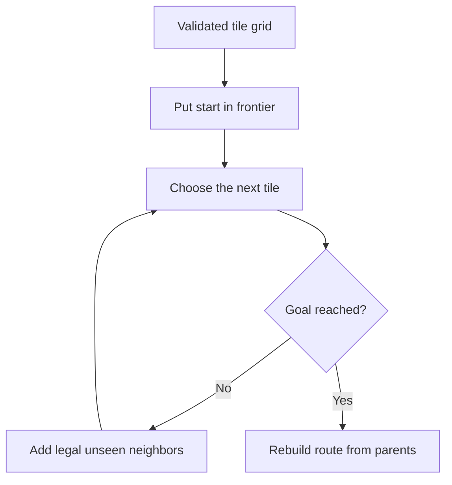
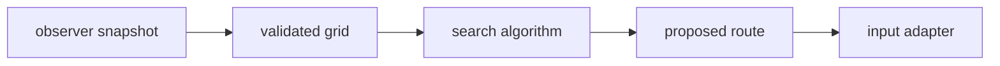
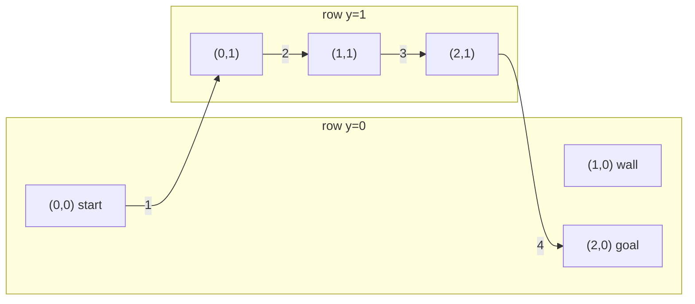

import MemoryStrip from '../../../../components/MemoryStrip.astro';
import Scene from '../../../../components/Scene.astro';

Coordinates can tell a bot where an enemy is, but not how to reach it. If a
wall lies between the player and the target, moving directly toward the target
gets stuck. A route must follow legal neighboring tiles, which turns the map
into a graph-search problem.

## Represent walkable tiles as a graph

A strategy game may store terrain as a flat row-major array. Pathfinding becomes easier to understand when you rename the pieces:

- each walkable tile is a **node**;
- a legal move between neighboring tiles is an **edge**;
- a route is a sequence of connected nodes;
- a wall simply means no edge crosses that tile.

For a map with width `w`, tile `(x, y)` is stored at `y * w + x`. Always bounds-check before performing that multiplication.

BFS and A-Star use the same search loop. The important difference is how the
frontier chooses which tile comes out next:



BFS chooses in first-in-first-out order; A-Star chooses the tile with the best
known cost plus its estimate. Both must reject invalid tiles before searching.

## Breadth-first search first

Breadth-first search (BFS) explores every tile one step away, then two steps away, and so on. On a grid where every move costs the same, the first route it finds is shortest in number of steps.

The queue is what makes that guarantee work. Because tiles leave the queue in
the order they entered it, every tile one step from the start is examined
before any tile two steps away, and so on outward. So the first time BFS
reaches a tile, it must have arrived by the fewest possible steps: a shorter
route would have come out of the queue earlier and got there first.

Notice what that guarantee rests on — every move costing the same. As soon as
some tiles cost more to enter, such as deep water, rough ground, or a slope,
“fewest steps” and “cheapest route” stop being the same question, and BFS
confidently answers the wrong one. Closing that gap is what A-Star is for.

Here is the smallest case where the two questions disagree. `S` is the start,
`G` is the goal, and entering `M` costs 9 instead of the ground cost of 1:

```text
ground  ground  ground
S       M       G
ground  ground  ground
```

BFS finds the direct route in two moves: `S → M → G`. Its travel cost is
9 + 1 = 10. Going around the top takes four moves but costs 1 + 1 + 1 + 1 =
4. A weighted search should choose the longer route because it answers the
cost question. This is a limit of BFS's guarantee, not a flaw in its queue.

```rust
use std::collections::{HashMap, VecDeque};

#[derive(Clone, Copy, Debug, Eq, Hash, PartialEq)]
struct Tile {
    x: i32,
    y: i32,
}

fn neighbors(tile: Tile) -> [Tile; 4] {
    [
        Tile { x: tile.x + 1, y: tile.y },
        Tile { x: tile.x - 1, y: tile.y },
        Tile { x: tile.x, y: tile.y + 1 },
        Tile { x: tile.x, y: tile.y - 1 },
    ]
}

fn bfs(
    start: Tile,
    goal: Tile,
    walkable: impl Fn(Tile) -> bool,
) -> Option<Vec<Tile>> {
    let mut frontier = VecDeque::from([start]);
    let mut came_from = HashMap::from([(start, None)]);

    while let Some(current) = frontier.pop_front() {
        if current == goal {
            break;
        }

        for next in neighbors(current) {
            if walkable(next) && !came_from.contains_key(&next) {
                frontier.push_back(next);
                came_from.insert(next, Some(current));
            }
        }
    }

    let mut current = goal;
    let mut route = vec![goal];
    while current != start {
        current = came_from.get(&current).copied().flatten()?;
        route.push(current);
    }
    route.reverse();
    Some(route)
}
```

`came_from` does two jobs: it marks visited tiles and remembers how to reconstruct the route. If the goal is absent, `?` returns `None` instead of inventing a path.

## Turn coordinates into an array index safely

A `Vec<T>` stores its elements in one contiguous row of memory. A game can use
that row to represent a two-dimensional map by placing row 1 after row 0, row 2
after row 1, and so on. That is why `(x, y)` becomes `y * width + x`.

Do not perform that formula until negative and out-of-range coordinates have
been rejected. Also use checked arithmetic, because a corrupted width from a
bad reverse-engineered layout must not wrap into a believable index:

<MemoryStrip
  cells="(0,0)=0|(1,0)=1|(2,0)=2|(0,1)=3|(1,1)=4|(2,1)=5"
  groups="0-2:row y=0|3-5:row y=1"
  caption="For example, a 3-wide grid: `(x, y)` maps to index `y * width + x`. Row 1 starts right where row 0 ends, at index `width`."
/>

```rust
#[derive(Clone, Copy, Debug)]
enum Terrain {
    Ground,
    Water,
    Wall,
}

#[derive(Clone, Copy, Debug)]
struct TileInfo {
    terrain: Terrain,
    visible: bool,
    movement_cost: u16,
}

struct Grid {
    width: usize,
    height: usize,
    cells: Vec<TileInfo>,
}

impl Grid {
    fn get(&self, tile: Tile) -> Option<&TileInfo> {
        // 🧭 Conversion fails for negative coordinates.
        let x = usize::try_from(tile.x).ok()?;
        let y = usize::try_from(tile.y).ok()?;

        if x >= self.width || y >= self.height {
            return None;
        }

        // 🧮 Checked math refuses impossible dimensions instead of wrapping.
        let index = y.checked_mul(self.width)?.checked_add(x)?;
        self.cells.get(index)
    }
}
```

`cells.get(index)` performs one final length check. That catches an incomplete
snapshot whose header claims a `100 × 100` map but whose copied array contains
fewer than 10,000 tiles.

Keep facts about one tile in one record such as `TileInfo`. Three separate
vectors named `terrain`, `visible`, and `movement_cost` can drift out of sync so
index 42 describes three different tiles. One vector of records makes that
mistake harder to express.

## A-Star adds a useful guess

A-Star uses the known route cost plus a **heuristic**, an estimate of the
remaining cost. On a four-direction grid where every legal move costs at
least 1, Manhattan distance counts the minimum number of horizontal and
vertical moves and cannot overestimate that cost:

```rust
fn manhattan(a: Tile, b: Tile) -> u32 {
    a.x.abs_diff(b.x) + a.y.abs_diff(b.y)
}
```

The heuristic must not overestimate if you want the cheapest-path guarantee.
For movement costs with a different verified minimum, multiply Manhattan
distance by that minimum. If a legal move can cost zero, the safe estimate
from this rule is zero. The search priority is:

```text
priority = cost already paid + estimated cost remaining
```

For the muddy grid above, the direct route has cost 10 and the top route has
cost 4. The estimate guides which tile A-Star explores next; the accumulated
cost still decides whether a newly found route improves an old one. If the
game permits diagonal moves, Manhattan distance can overestimate: `(0,0)` to
`(1,1)` might be one diagonal move while Manhattan counts two. Choose an
estimate that matches the actual movement rules.

Do not include hidden enemy positions in the heuristic. A legitimate observer should plan from information the local game state actually reveals.

Keep the search's bookkeeping names precise:

- the **frontier** contains discovered tiles that still deserve exploration;
- `cost_so_far[tile]` is the cheapest route to that tile found so far;
- `came_from[tile]` records the parent of that cheapest known route;
- the heuristic estimates only the cost that remains.

A tile entering the frontier does not mean its best path is final. If a cheaper
route reaches it later, update its cost and parent. This distinction is why an
implementation that merely marks every discovered tile “done” can return the
wrong route on weighted terrain.

Setting the heuristic to zero turns A-Star into Dijkstra's algorithm. That is a
useful debugging switch: if the zero-heuristic version works but the normal one
does not, inspect the heuristic and movement-cost assumptions before blaming the
recovered map.

## Keep three layers separate



The search function should never call `ReadProcessMemory` or press keys. It accepts an ordinary copied grid and returns ordinary coordinates. This makes it testable on any computer.

The input adapter is the only part allowed to translate one confirmed route step into a supported action in your offline lab.

## Tests that catch real mistakes

For example, here is the exact 3×2 grid this test builds, with the wall
forcing a detour through row 1:



The test below gives BFS the start and goal from the diagram and rejects the
wall tile `(1, 0)`. A valid result begins at `(0, 0)`, ends at `(2, 0)`, and
never includes the wall. The intermediate route follows the open second row.

```rust
#[test]
fn bfs_walks_around_a_wall() {
    let blocked = Tile { x: 1, y: 0 };
    let route = bfs(
        Tile { x: 0, y: 0 },
        Tile { x: 2, y: 0 },
        |tile| (0..=2).contains(&tile.x)
            && (0..=1).contains(&tile.y)
            && tile != blocked,
    ).expect("a route exists through the second row");

    assert_eq!(route.first(), Some(&Tile { x: 0, y: 0 }));
    assert_eq!(route.last(), Some(&Tile { x: 2, y: 0 }));
    assert!(!route.contains(&blocked));
}
```

Follow that test through the queue. The wall removes the direct move, leaving
the route through the open second row:

<Scene name="bfs-around-wall" />

Also test:

- start equals goal;
- goal is completely enclosed;
- coordinates lie outside the map;
- a one-tile corridor;
- terrain cost changes the preferred route;
- the observed grid changes after planning.

That final case matters. A route is based on one snapshot. Before performing the next step, confirm that the current tile and the next tile are still valid. If not, stop and plan again. 🔁

## BFS or A-Star?

Use BFS when the grid is small, every step costs the same, or you are still verifying the map. Use A-Star when the map is large and a meaningful heuristic can avoid exploring most irrelevant tiles.

Both algorithms are only as correct as the recovered grid. A brilliant route through a tile you misclassified as walkable is still wrong. Pathfinding does not replace reverse engineering; it consumes the grid that reverse engineering produced.
