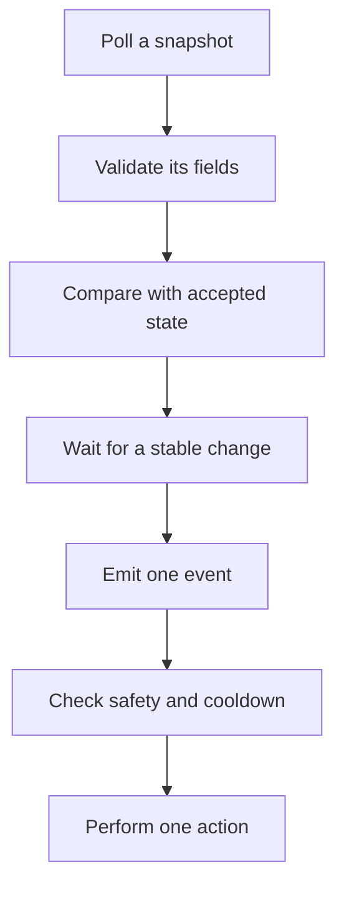
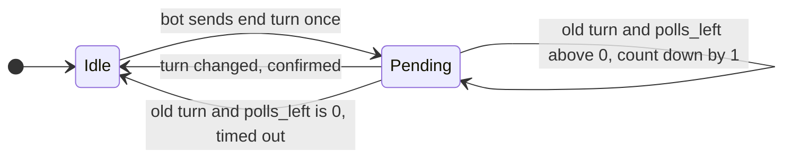

import MemoryStrip from '../../../../components/MemoryStrip.astro';

## Polling is not the same as reacting

An observer might read the same fact twenty times per second:

```text
gold = 120
gold = 120
gold = 120
gold = 145
gold = 145
```

A responsive system should usually produce one event:

```text
GoldChanged { before: 120, after: 145 }
```

The event says **what changed**, while a snapshot says **what is true now**. Keeping both ideas separate prevents a bot from performing the same action on every poll.

A responsive loop should turn noisy polls into one deliberate action in stages,
rather than connecting every poll directly to a click:



Validation protects the model, debouncing protects it from flicker, and the
cooldown prevents a valid event from producing frantic repeated input.

## Level facts and edge facts answer different questions

A snapshot contains **level facts**: “the menu is open” or “gold equals 145.” An event describes an **edge** between two accepted snapshots: “the menu opened” or “gold increased by 25.”

That difference controls behavior. A level-triggered rule such as `if menu_open { click() }` may click on every poll. An edge-triggered rule acts only on the transition from closed to open. Neither form is always better:

- use a level fact to keep a safety condition true, such as “stop while the target is absent”;
- use an edge event for one-time work, such as recording that a turn began;
- use both when an action needs a starting event and an ongoing confirmation.

Here are six polls of `menu_open` and what each kind of rule does with them:

<MemoryStrip
  cells="poll 1=false|poll 2=false|poll 3=true|poll 4=true|poll 5=true|poll 6=false"
  marks="2|5"
  groups="2-4:level rule: clicks on 3 polls"
  groups2="2-2:edge: `MenuOpened`|5-5:edge: `MenuClosed`"
  caption="The level rule fires on every poll where the menu is open, so one opening produces three clicks. The edge rule compares each poll with the one before and fires only at the two highlighted polls, where the value changed."
/>

Events are interpretations, not raw truth. If the observer misses snapshots, `120 -> 145` proves the endpoints but not whether the game passed through `130`. Name an event `GoldChanged`, not `GoldEarned`, unless something else shows why it changed.

## Diff two validated snapshots

```rust
#[derive(Clone, Debug, PartialEq)]
struct StrategySnapshot {
    turn: u32,
    gold: u32,
    selected_unit: Option<u32>,
    menu_open: bool,
}

#[derive(Clone, Debug, Eq, PartialEq)]
enum GameEvent {
    TurnChanged { before: u32, after: u32 },
    GoldChanged { before: u32, after: u32 },
    SelectionChanged { before: Option<u32>, after: Option<u32> },
    MenuOpened,
    MenuClosed,
}

fn diff(before: &StrategySnapshot, after: &StrategySnapshot) -> Vec<GameEvent> {
    let mut events = Vec::new();

    if before.turn != after.turn {
        events.push(GameEvent::TurnChanged { before: before.turn, after: after.turn });
    }
    if before.gold != after.gold {
        events.push(GameEvent::GoldChanged { before: before.gold, after: after.gold });
    }
    if before.selected_unit != after.selected_unit {
        events.push(GameEvent::SelectionChanged {
            before: before.selected_unit,
            after: after.selected_unit,
        });
    }
    match (before.menu_open, after.menu_open) {
        (false, true) => events.push(GameEvent::MenuOpened),
        (true, false) => events.push(GameEvent::MenuClosed),
        _ => {}
    }

    events
}
```

Why use an enum? Each variant defines exactly which data belongs to that event. A typo in a string such as `"turn_chagned"` cannot silently create a new event type.

## Debouncing asks for stability

Some values flicker while a game changes scenes. Debouncing waits for the same candidate value to appear several times before accepting it.

It helps to know *why* a value flickers, because that tells you how long to
wait. During a scene change the game is often rebuilding the very object you
are reading. The pointer is briefly null, or it points at a freshly allocated
record whose fields have not been filled in yet. Your read succeeds and hands
back a real number that was never a real game state:

```text
poll 1   health 100            the old scene
poll 2   health 0              object freed, memory not yet reused
poll 3   health 0
poll 4   health 3452816845     new allocation, uninitialized bytes (0xCDCDCDCD)
poll 5   health 100            the new scene, fully constructed
```

The strange value on poll 4 is the byte `0xCD`, which Microsoft's debug heap
writes into every fresh allocation, repeated four times. One `0xCD` is
12 × 16 + 13 = 205, so the four bytes read as
205 × 256³ + 205 × 256² + 205 × 256 + 205 = 3,452,816,845.

A debouncer keeps two things: the last **accepted** value, and a **candidate**
value with a count. Each poll does one of three things. A poll equal to the
accepted value clears the candidate. A poll equal to the candidate adds one to
its count. Any other value becomes a new candidate with a count of 1. When the
candidate's count reaches the required number, it becomes the accepted value
and the debouncer reports one change.

With three required polls, here is the trace above, followed by 20 points of
real damage that take health from 100 to 100 − 20 = 80:

<MemoryStrip
  cells="poll 1=100|poll 2=0|poll 3=0|poll 4=0xCDCDCDCD|poll 5=100|poll 6=80|poll 7=80|poll 8=80"
  marks="7"
  groups="1-2:candidate `0`: count 1, 2|3-3:new candidate: 1|5-7:candidate `80`: count 1, 2, 3"
  groups2="0-4:accepted stays `100`: no event|7-7:accepted becomes `80`"
  caption="No glitch value lasts three polls in a row, so none of them reaches the bot, and poll 5 clears the candidate by matching the accepted `100`. The real change is accepted on its third matching poll, poll 8, and produces exactly one event."
/>

The code follows those three cases:

```rust
#[derive(Debug)]
struct Debouncer<T> {
    accepted: T,
    candidate: Option<(T, u8)>,
    required_samples: u8,
}

impl<T: Clone + Eq> Debouncer<T> {
    fn observe(&mut self, value: T) -> Option<T> {
        if value == self.accepted {
            self.candidate = None;
            return None;
        }

        match &mut self.candidate {
            Some((candidate, count)) if *candidate == value => *count += 1,
            _ => self.candidate = Some((value.clone(), 1)),
        }

        let stable = self.candidate
            .as_ref()
            .is_some_and(|(_, count)| *count >= self.required_samples);
        if stable {
            self.accepted = value.clone();
            self.candidate = None;
            Some(value)
        } else {
            None
        }
    }
}
```

Debouncing buys correctness with **latency**, and the cost is easy to work out.
At twenty polls per second, polls are 1000 ÷ 20 = 50 milliseconds apart. The
change is accepted on the third poll that shows it, which comes two gaps,
2 × 50 = 100 milliseconds, after the first. That first poll can itself arrive up
to 50 milliseconds after the real change, so every genuine change reaches the
bot 100 to 150 milliseconds late. “Three polls” means nothing without the
polling rate: at 100 polls per second the gaps are 10 milliseconds, and the
same rule costs only 20 to 30 milliseconds.

That delay is cheap for “the match ended” and far too slow for “an enemy
appeared.” Choose the requirement per value rather than once for the whole bot,
and use debouncing for noisy or safety-critical transitions, not for every
coordinate in a smooth animation.

## Add cooldowns after actions

After requesting “end turn,” wait until a snapshot shows that the turn changed. Do not send the same input again merely because the next 50 ms poll still shows the old turn.

A useful action record contains:

- the requested action;
- the time it was requested;
- the state change that will confirm success;
- a timeout;
- a cancellation reason.

The pending action is a small state machine of its own. While it exists, the
bot sends nothing, and each poll either confirms it, counts it down, or times it
out:



The timeout is a number of polls, so it becomes a time through the polling
rate: starting from `polls_left: 20` at one poll every 50 milliseconds gives the
game 20 × 50 = 1000 milliseconds, one second, to show the new turn.

```rust
enum PendingAction {
    EndTurn { old_turn: u32, polls_left: u8 },
}

fn update_pending(action: &mut Option<PendingAction>, snapshot: &StrategySnapshot) {
    let Some(PendingAction::EndTurn { old_turn, polls_left }) = action else {
        return;
    };

    if snapshot.turn != *old_turn || *polls_left == 0 {
        *action = None; // confirmed or timed out; either way, stop repeating input.
    } else {
        *polls_left -= 1;
    }
}
```

In a full program, distinguish confirmed success from timeout in the result. The short sample focuses on the stop condition.

## A safe responsive loop

1. Copy and validate a snapshot.
2. Diff it against the previous accepted snapshot.
3. Debounce noisy state.
4. Feed events to the state machine.
5. Propose at most one bounded action.
6. Wait for its confirmation or timeout.
7. Stop immediately if the target disappears or the user cancels.

This design is useful far beyond game automation. File watchers, user interfaces, network clients, and monitoring tools all turn repeated polls into meaningful events while controlling duplicate work.

Make repeated requests **idempotent** when you can: sending the same request twice should have the same final effect as sending it once. “Select entity 7” can be idempotent; “move selection to the next entity” is not. Idempotence does not replace cooldowns, but it limits damage when a timeout hides a successful first action.
