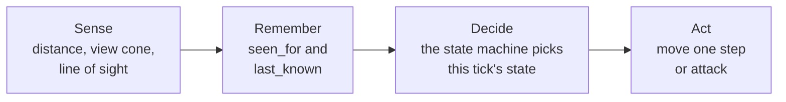
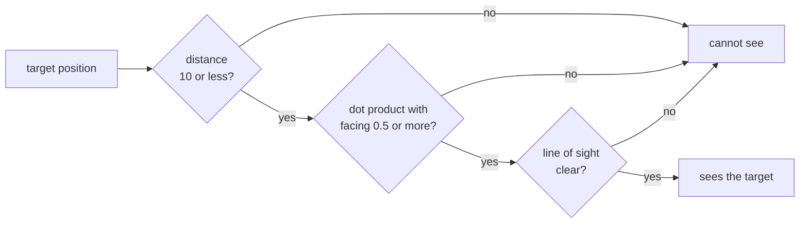
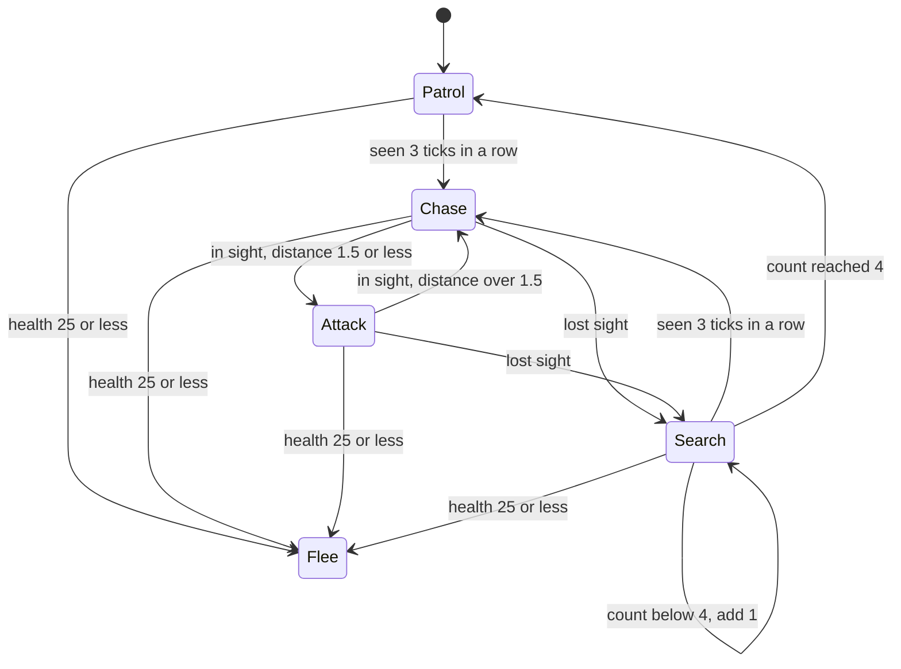
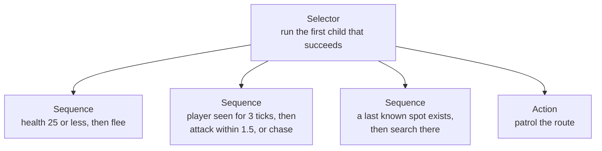

import MemoryStrip from '../../../../components/MemoryStrip.astro';
import Quiz from '../../../../components/Quiz.astro';

## An NPC is a small program that runs every tick

A **non-player character** (NPC) is any character the game controls rather than
a person: a guard, a shopkeeper, an enemy soldier. In games, “AI” means the code
that picks what an NPC does next. It is usually far simpler than the AI in the
news: a handful of rules, checked quickly, many times per second.

The portable lab [`npc_brain_lab.rs`](/rust-labs/src/bin/npc_brain_lab.rs)
builds one such character, a guard, and this lesson follows it piece by piece.
Nothing in it touches a real game.

The game loop from [Lesson 1.4](/pages/1/04/) reads input, updates the world,
and draws a frame. Many games update the world in fixed steps called **ticks**.
Every tick advances the simulation by the same slice of time, however fast the
computer draws. The lab does not pick a tick rate, so this lesson assumes the AI
runs 10 times per second, which makes each tick 1000 ÷ 10 = 100 milliseconds.

An NPC makes one decision per tick, for two reasons:

- **Behavior follows simulated time, not the frame rate.** A guard that reacts
  after 3 ticks reacts after 3 × 100 = 300 milliseconds on a fast computer and on
  a slow one. If it decided once per drawn frame, a machine drawing 144 frames
  per second would make it react faster than one drawing 30.
- **The cost is bounded and the behavior repeats.** Fifty guards cost fifty
  decisions per tick, no matter what the renderer does. The same inputs, tick
  by tick, give the same decisions, which is what lets the lab test its guard
  without drawing anything.

Each tick, the guard's `tick` method runs three stages in a fixed order:



The guard never reads the player's true position directly. It gets the player's
position only through its senses, and remembers the last place it saw them in
`last_known`. That separation is what makes hiding behind a wall work.

Every number the guard uses is a named constant at the top of the lab:

```rust
const VIEW_DISTANCE: f32 = 10.0; // how far the guard can see
const VIEW_CONE_COS: f32 = 0.5; // cosine of half the view cone's angle
const REACTION_TICKS: u32 = 3; // ticks the player must stay visible
const ATTACK_RANGE: f32 = 1.5;
const SEARCH_TICKS: u32 = 4; // how long a lost player is searched for
const FLEE_HEALTH: u32 = 25;
const SPEED: f32 = 1.0; // distance covered in one tick
const SIGHT_STEP: f32 = 0.1; // spacing of line-of-sight samples
```

## Sense: three checks, cheapest first

The guard sees a target only if it passes three checks: it is close enough, it
is inside the view cone, and no wall blocks the straight line to it.

```rust
fn can_see(&self, target: Vec2, walls: &[Wall]) -> bool {
    let offset = target - self.position;
    if offset.length() > VIEW_DISTANCE {
        return false;
    }
    let Some(direction) = offset.normalized() else {
        return true;
    };
    if direction.dot(self.facing) < VIEW_CONE_COS {
        return false;
    }
    line_of_sight(self.position, target, walls)
}
```



The order matters for speed. The first two checks cost a handful of arithmetic
operations each.
The last one walks along a line and tests every wall, so it runs only when the
cheap checks have already passed. (The `let Some(direction) ... else` line
handles one odd case: a target standing exactly on the guard has no direction,
and the lab counts it as seen.)

### Distance

`offset` is the arrow from the guard to the target: the target's position minus
the guard's. Its length comes from Pythagoras. For a guard at (0, 0) and a
player at (4, 3), the offset is (4, 3), and its length is
√(4² + 3²) = √(16 + 9) = √25 = 5. That is within `VIEW_DISTANCE` = 10, so the
first check passes. A player at (15, 0) is 15 away and fails it.

### The view cone and the dot product

A **view cone** is the range of directions an NPC can see: every direction
within some angle of the way it faces. The lab tests it with two ideas.

A **unit vector** is a vector of length 1. It stores a direction and nothing
else. The guard keeps `facing` as a unit vector, and `normalized` turns any
offset into one by dividing both parts by the length. The offset (4, 3) has
length 5, so its direction is (4 ÷ 5, 3 ÷ 5) = (0.8, 0.6).

The **dot product** of two vectors multiplies their matching parts and adds the
results:

```text
a · b = a.x × b.x + a.y × b.y
```

For two unit vectors, the dot product equals the **cosine** of the angle between
them. Here is why, for a guard facing east, (1, 0). Picture a circle of radius 1
around the guard. A unit direction at an angle θ from east ends on that circle,
and the cosine of θ is, by definition, the x-coordinate of that end point: it
is 1 at 0°, falls to 0 at 90°, and reaches −1 at 180°. The dot product with
(1, 0) is x × 1 + y × 0 = x, which is exactly cos θ. Turning the guard to face
another way turns both arrows together, which changes neither the angle between
them nor their dot product, so the same holds for every facing.

Why does 0.5 mean 60°? Take a triangle whose three sides are all 1 long. Its
three angles are equal, and a triangle's angles add up to 180°, so each is
180 ÷ 3 = 60°. Put one corner at the guard with one side pointing east. The
other side from that corner is a unit direction 60° from east, and its far end
sits exactly above the middle of the east side, 0.5 along. So cos 60° = 0.5.

The test `direction.dot(self.facing) < VIEW_CONE_COS` therefore rejects every
direction whose cosine is below 0.5, which is every direction more than 60° from
the facing, on either side. The cone is 60 + 60 = 120° wide.

<MemoryStrip
  cells="0°=1.0|37°=0.8|60°=0.5|90°=0.0|120°=−0.5|180°=−1.0"
  marks="0-2"
  groups="0-2:inside the cone: 0.5 or more|3-5:outside the cone"
  caption="The dot product of the facing and a unit direction at each angle from it. It falls from 1 straight ahead to 0 at a right angle and −1 straight behind. At 120°, 60° past the right angle, the direction's x is the mirror image of the 60° case, −0.5."
/>

For the player at (4, 3), the unit direction is (0.8, 0.6), and the dot product
with the facing (1, 0) is 0.8 × 1 + 0.6 × 0 = 0.8. That is at least 0.5, so the
player is inside the cone (about 37° from the facing, since cos 37° ≈ 0.8). A
player at (0, 5) has direction (0, 1) and a dot product of 0 × 1 + 1 × 0 = 0, a
full 90° to the side, so the guard does not see them.

The code never computes an angle. Turning a dot product back into an angle would
need an inverse cosine, a much slower function. Comparing the dot product with
a cosine worked out once, when the constant was written, gives the same answer
with two multiplications and one addition.

<Quiz
  id="npc-view-cone-dot"
  title="Inside the cone?"
  prompt="A guard faces (1, 0). The unit direction to the player is (0.6, 0.8). With VIEW_CONE_COS = 0.5, can the guard see the player, ignoring walls and distance?"
  options="Yes: 0.6 × 1 + 0.8 × 0 = 0.6, which is at least 0.5||No: 0.8 is larger than 0.6, so the player is mostly to the side||Yes: every direction with a positive y is inside||No: 0.6 + 0.8 = 1.4, which is more than 1"
  answer="0"
  explanation="For unit vectors the dot product is the cosine of the angle between them. 0.6 is at least cos 60° = 0.5, so the player is less than 60° from the facing (about 53°) and inside the cone."
/>

### Line of sight

**Line of sight** asks whether the straight segment between two points is free
of solid geometry. The lab's `line_of_sight` walks from the guard toward the
target in steps of `SIGHT_STEP` = 0.1 and tests each sample point against the
walls. Each wall is an axis-aligned box, meaning its sides run along the x and y
axes, stored as two corners, `min` and `max`. A point is inside when both of its
coordinates lie between the corners.

In the run later in this lesson, the guard stands at (4, 0) on tick 8, the
player at (8, 0), and a wall fills the box from (5.5, −1) to (6.5, 1) between
them. The samples are (4.0, 0), (4.1, 0), (4.2, 0), and so on. By (5.6, 0) a
sample is inside the wall, because 5.5 ≤ 5.6 ≤ 6.5 and −1 ≤ 0 ≤ 1, so the
function returns `false` long before it reaches the player.

A line can also pass over a wall. From (0, 0) to (4, 3), the line rises 3 for
every 4 across, so every point on it has y = 0.75 × x. A wall from (2, −1) to
(3, 1) covers x from 2 to 3, where the line's y runs from 0.75 × 2 = 1.5 to
0.75 × 3 = 2.25, above the wall's top edge at y = 1. No sample lands inside, and
the guard sees the player. The lab's tests check both cases.

Stepping has a blind spot: a wall thinner than 0.1 can sit between two samples
and be missed. It also costs more with distance. A check across the full view
distance takes 10 ÷ 0.1 = 100 samples, each tested against every wall. Engines
instead compute exactly where a ray crosses each collision shape, a ray cast,
but the question they answer is the same one.

## Decide: a finite-state machine

The guard's behavior is a finite-state machine, the same structure
[Lesson 4.4](/pages/4/04/) uses for a macro: a fixed set of named states and a
rule for each move between them. The guard has five states:

- **Patrol:** walk the route. The lab's route is a single point, the guard's
  post at (0, 0), so patrolling means standing there.
- **Chase:** walk toward where the player was last seen.
- **Attack:** the player is within `ATTACK_RANGE` = 1.5.
- **Search:** the player vanished, so go to the last known spot and wait there.
- **Flee:** health is `FLEE_HEALTH` = 25 or less, so run.

The whole decision is one function of the current state and this tick's senses:

```rust
fn decide(current: GuardState, senses: Senses) -> GuardState {
    if senses.health <= FLEE_HEALTH {
        return GuardState::Flee;
    }
    // The reaction delay: one glimpse is not enough to start a chase.
    let reacted = senses.sees_player && senses.seen_for >= REACTION_TICKS;
    match current {
        GuardState::Flee => GuardState::Flee,
        GuardState::Patrol | GuardState::Search { .. } if reacted => GuardState::Chase,
        GuardState::Patrol => GuardState::Patrol,
        GuardState::Chase | GuardState::Attack if senses.sees_player => {
            if senses.distance <= ATTACK_RANGE {
                GuardState::Attack
            } else {
                GuardState::Chase
            }
        }
        GuardState::Chase | GuardState::Attack => GuardState::Search { ticks: 0 },
        GuardState::Search { ticks } if ticks >= SEARCH_TICKS => GuardState::Patrol,
        GuardState::Search { ticks } => GuardState::Search { ticks: ticks + 1 },
    }
}
```

Drawn out, the transitions are:



When no arrow applies, the state stays the same. Three details of the code
decide the shape of that diagram:

- The health check runs before the `match`, so it overrides every state. Nothing
  leads out of Flee in this lab; a fleeing guard flees until the program ends.
- The `match` arms are tried from top to bottom. A searching guard that sees the
  player for 3 ticks goes back to Chase before its counter is even looked at.
- Search starts at count 0 on the tick the player is lost and adds 1 each tick.
  The guard gives up on the tick after the count has reached `SEARCH_TICKS` = 4,
  so a lost player is searched for five ticks: counts 0, 1, 2, 3, and 4.

### Reaction time is counted in ticks

`seen_for` counts the consecutive ticks in which the guard has seen the player,
and drops back to 0 on any tick it does not. The guard only reacts when the
count reaches `REACTION_TICKS` = 3, so one glimpse through a gap never starts a
chase.

At 10 ticks per second, the ticks are 100 milliseconds apart. The count reaches
3 two ticks after the first tick that saw the player, 2 × 100 = 200 milliseconds
later. The player may also have been visible for up to 100 milliseconds before
that first tick sensed them, so the guard reacts 200 to 300 milliseconds after
the player steps into view. That is close to a person's own reaction time of
about a quarter of a second, and that is the point: a guard that turns the
instant one pixel of you appears feels unfair. It is also the filter that
[Lesson 4.7](/pages/4/07/) calls debouncing.

The delay only runs one way. Once chasing, a single tick without sight sends the
guard to Search. Losing the player is instant; noticing them is not.

### One run, tick by tick

The lab's first demo puts the guard at its post, (0, 0), facing east, (1, 0),
with the wall from (5.5, −1) to (6.5, 1). The player stands in the open at
(5, 0) for seven ticks, then slips behind the wall to (8, 0). “Distance” is
measured before the guard moves:

| Tick | Player | Sees | `seen_for` | Distance | State | Guard after acting |
|---:|---|---|---:|---:|---|---|
| 1 | (5, 0) | yes | 1 | 5 | `Patrol` | (0, 0) |
| 2 | (5, 0) | yes | 2 | 5 | `Patrol` | (0, 0) |
| 3 | (5, 0) | yes | 3 | 5 | `Chase` | (1, 0) |
| 4 | (5, 0) | yes | 4 | 4 | `Chase` | (2, 0) |
| 5 | (5, 0) | yes | 5 | 3 | `Chase` | (3, 0) |
| 6 | (5, 0) | yes | 6 | 2 | `Chase` | (4, 0) |
| 7 | (5, 0) | yes | 7 | 1 | `Attack` | (4, 0) |
| 8 | (8, 0) | no | 0 | 4 | `Search { ticks: 0 }` | (5, 0) |
| 9 | (8, 0) | no | 0 | 3 | `Search { ticks: 1 }` | (5, 0) |
| 10 | (8, 0) | no | 0 | 3 | `Search { ticks: 2 }` | (5, 0) |
| 11 | (8, 0) | no | 0 | 3 | `Search { ticks: 3 }` | (5, 0) |
| 12 | (8, 0) | no | 0 | 3 | `Search { ticks: 4 }` | (5, 0) |
| 13 | (8, 0) | no | 0 | 3 | `Patrol` | (4, 0) |
| 14 | (8, 0) | no | 0 | 4 | `Patrol` | (3, 0) |
| 15 | (8, 0) | no | 0 | 5 | `Patrol` | (2, 0) |
| 16 | (8, 0) | no | 0 | 6 | `Patrol` | (1, 0) |

Every row follows from the rules above:

- **Ticks 1 and 2:** the player is 5 away, straight ahead (dot product 1), with
  no wall between them, but `seen_for` is only 1, then 2.
- **Tick 3:** `seen_for` reaches 3, so the guard chases and steps `SPEED` = 1.0
  toward the player, from (0, 0) to (1, 0).
- **Ticks 4 to 7:** each step closes 1 unit. On tick 7 the distance is
  5 − 4 = 1, which is within 1.5, so the guard attacks and stops moving.
- **Tick 8:** the player's new spot is behind the wall, so the line-of-sight
  check fails. The guard switches to Search and walks to `last_known`, (5, 0),
  which is exactly 1 unit away, so it arrives in one step.
- **Ticks 9 to 12:** the guard stands at the spot, facing the wall, while the
  count climbs to 4.
- **Tick 13:** the count has reached 4, so the guard returns to Patrol, turns
  west toward its post, and steps to (4, 0).
- **Ticks 14 to 16:** facing west, (−1, 0), the player due east is straight
  behind it: the dot product is 1 × (−1) + 0 × 0 = −1, far below 0.5.

## Choose among actions: utility scoring

A state machine answers “which mode am I in?” Some decisions are better framed as
“which of these options is best right now?” **Utility AI** gives every option a
score computed from the situation and runs the highest one. The lab's second
demo scores three options for a fighter:

```rust
fn score(choice: Choice, situation: Situation) -> f32 {
    match choice {
        Choice::Attack if situation.enemy_visible => 0.4 + 0.6 * situation.health,
        Choice::TakeCover if situation.enemy_visible && !situation.in_cover => {
            0.9 - 0.6 * situation.health
        }
        Choice::Heal if situation.potions > 0 => 1.0 - situation.health,
        _ => 0.0,
    }
}
```

`health` here is a fraction: 30 health out of 100 is 30 ÷ 100 = 0.3. Each score
is a straight line in `health`, chosen so its meaning is readable. Attack scores
1.0 at full health and falls to 0.4 as health runs out. Taking cover scores 0.3
at full health and rises to 0.9. Healing scores nothing at full health and 1.0
at zero. An option that makes no sense right now, such as healing with no
potions, scores 0.

With an enemy in view, no cover, and one potion, the scores at several health
levels are:

| Health | Attack: 0.4 + 0.6 × h | Take cover: 0.9 − 0.6 × h | Heal: 1.0 − h | Chosen |
|---:|---|---|---|---|
| 1.0 | 0.4 + 0.6 = 1.00 | 0.9 − 0.6 = 0.30 | 0.00 | Attack |
| 0.75 | 0.4 + 0.45 = 0.85 | 0.9 − 0.45 = 0.45 | 0.25 | Attack |
| 0.5 | 0.4 + 0.3 = 0.70 | 0.9 − 0.3 = 0.60 | 0.50 | Attack |
| 0.3 | 0.4 + 0.18 = 0.58 | 0.9 − 0.18 = 0.72 | 0.70 | Take cover |
| 0.2 | 0.4 + 0.12 = 0.52 | 0.9 − 0.12 = 0.78 | 0.80 | Heal |
| 0.1 | 0.4 + 0.06 = 0.46 | 0.9 − 0.06 = 0.84 | 0.90 | Heal |

The switch points come straight from the formulas. Attack and cover score the
same when 0.4 + 0.6h = 0.9 − 0.6h. Adding 0.6h to both sides and taking 0.4 from
both gives 1.2h = 0.5, so h = 0.5 ÷ 1.2 ≈ 0.42. Cover and healing tie when
0.9 − 0.6h = 1.0 − h, which rearranges to 0.4h = 0.1, so h = 0.25. Above about
42% health this fighter attacks, between 25% and 42% it takes cover, and below
25% it drinks a potion. Changing one number in a formula moves one of those
switch points, and that is how designers tune utility AI.

The lab's demo also varies the situation, all at a health of 0.3 except where it
says healthy:

| Situation | Attack | Take cover | Heal | Chosen |
|---|---:|---:|---:|---|
| healthy, enemy in view | 1.00 | 0.30 | 0.00 | Attack |
| hurt, enemy in view, exposed | 0.58 | 0.72 | 0.70 | Take cover |
| hurt, enemy in view, in cover | 0.58 | 0.00 | 0.70 | Heal |
| hurt, in cover, no potions left | 0.58 | 0.00 | 0.00 | Attack |
| healthy, nobody in view | 0.00 | 0.00 | 0.00 | nothing |

Once in cover, taking cover scores 0, so the next best option wins. With no
potions, healing scores 0 too, and attacking is all that is left. With nobody in
view, every option scores 0, and `choose` returns `None`: nothing on this list
is worth doing, so another system, such as the patrol, keeps control.

Utility scoring has its own weak spot. Near a switch point, a tiny change in
health can flip the choice back and forth every tick. Games damp this by adding
a small bonus to whatever the NPC is already doing, so a rival option has to beat
it clearly before the NPC switches. The trade against a state machine is that a
state machine lists every transition by hand, so each new state needs arrows to
and from the old ones, while utility scoring adds one scoring function per
option but hides its behavior in numbers that need tables like the one above to
tune.

## Behavior trees, briefly

Larger games often organize NPC logic as a **behavior tree** instead. The lab
does not build one, but the idea is short. The leaves of the tree are conditions
(“is health 25 or less?”) and actions (“flee”). The inner nodes decide the order.
A **selector** tries its children from left to right and stops at the first one
that succeeds. A **sequence** runs its children in order and stops at the first
one that fails. The engine evaluates the tree from the root every tick.

The guard's priorities fit in one selector:



Compare it with the state diagram. The four arrows into Flee became one child,
placed first, because a behavior tree re-checks its priorities from the top
every tick. The tree keeps no memory between ticks by itself, though. Values
such as `seen_for` and `last_known` live beside it, in a shared store that
engines call a blackboard. Real games mix all three techniques: a behavior tree
for priorities, small state machines inside some of its nodes, and utility
scores to choose between similar actions.

## Moving is a separate system

The lab's guard moves with `move_toward`, which turns to face the target and
steps straight at it. It ignores walls while moving. It only avoids walking into
the wall in the demo because the spot it walks to, (5, 0), happens to be in
front of the wall.

Games split movement off into a navigation system. The decision layer picks
*where* to go. The navigation layer works out *how*: it plans a route over a
grid or a **navigation mesh**, a set of polygons covering the floor an NPC can
walk on, with a search such as A* from [Lesson 4.6](/pages/4/06/), and then
steers the NPC along that route one tick at a time.

## An NPC in memory

The lab's Rust types use Rust's default layout, which lets the compiler order
fields however it likes, so the lab has no fixed offsets to show. A game written
in C++ usually stores each NPC as a structure whose fields sit at fixed
offsets. A toy version of the guard might look like this:

```cpp
struct Guard {              // offset
    float x, y;             // 0x00, 0x04
    float facing_x;         // 0x08
    float facing_y;         // 0x0C
    uint32_t health;        // 0x10
    uint8_t state;          // 0x14: 0 Patrol, 1 Chase, 2 Attack, 3 Search, 4 Flee
                            // 0x15 to 0x17: padding
    uint32_t seen_for;      // 0x18
    uint32_t search_ticks;  // 0x1C
    uint32_t target_id;     // 0x20
};                          // 0x24 bytes in total
```

Every `float` and `uint32_t` takes 4 bytes, so the offsets count up in fours:
0, 4, 8, 12 (`0x0C`), and 16 (`0x10`). The state is stored as a single byte at
20, which is `0x14` (1 × 16 + 4). The next field is 4 bytes wide, and its
**alignment** requires it to start at a multiple of 4. Bytes 21, 22, and 23 are
not, so the compiler leaves them as padding, and `seen_for` starts at 24, which
is `0x18` (1 × 16 + 8). `search_ticks` follows at 28, `0x1C` (1 × 16 + 12), and
`target_id` at 32, `0x20` (2 × 16). The structure ends at 36 bytes, `0x24`
(2 × 16 + 4).

Here is the guard at tick 5 of the run above, mid-chase:

<MemoryStrip
  cells="+0x00 x=3.0|+0x04 y=0.0|+0x08 facing x=1.0|+0x0C facing y=0.0|+0x10 health=100"
  groups="0-1:position|2-3:facing, a unit vector"
  caption="Bytes `0x00` to `0x13` of the toy layout at tick 5: where the guard stands, which way it faces, and its health."
/>

<MemoryStrip
  cells="+0x14 state=1|+0x15 padding=· · ·|+0x18 seen_for=5|+0x1C search_ticks=0|+0x20 target_id=7"
  marks="0"
  groups="0-1:one state byte, three padding bytes|2-3:timers|4-4:who it hunts"
  caption="Bytes `0x14` to `0x23`. The highlighted byte is the state machine's current state, `1` for Chase. The target id `7` is a made-up entity number for the player."
/>

The state byte is an **enum** stored as a small integer. A byte holds
2⁸ = 256 different values, 0 to 255, but only five of them mean anything to the
code:

<MemoryStrip
  cells="0=Patrol|1=Chase|2=Attack|3=Search|4=Flee"
  marks="1"
  caption="What each value of the state byte means in this toy layout. The values 5 to 255 fit in the byte, but no branch of the code expects them."
/>

The target field is an id rather than a pointer. Some games store a raw pointer
to the target object instead, and that pointer goes stale when the target is
destroyed and its memory reused, the problem that generation-checked handles in
[Lesson 1.4](/pages/1/04/) solve.

### What editing the state byte would do

Take a toy program you wrote yourself, or an offline single-player game running
in your lab VM, whose guard follows the lab's rules. Changing the state byte
between two ticks has very different effects depending on the value:

- **Write 4 (Flee) mid-chase:** on the next tick `decide` sees Flee, and nothing
  leads out of Flee, so the guard turns and runs from the last place it saw the
  player until the program restarts. The edit lasts.
- **Write 0 (Patrol) while the player is in view:** `seen_for` is still 5 or
  more, so the very next decision turns Patrol straight back into Chase, before
  the act stage runs. The guard never takes a single patrol step. The edit is
  undone within one tick, 100 milliseconds at 10 ticks per second.
- **Write 0 (Patrol) while the guard is searching:** now the senses agree with
  Patrol, because the player is not in view, so the guard gives up the search
  early and walks home. The edit lasts.
- **Write 9:** no state has that value. What happens depends on how the
  compiler built the `switch` over the state. A range check sends 9 to a
  default branch; a table of jump targets indexed without a check can jump to
  garbage and crash. In the Rust lab, safe code cannot store 9 in a
  `GuardState` at all, because an enum value outside its variants is undefined
  behavior.

The pattern behind those results: the state is an output the game recomputes
from its inputs every tick. An edit to the output survives only when the inputs
agree with it, as `seen_for` did not in the second case. An edit to an input
that the rules read, such as writing 20 into `health`, changes behavior for as
long as the input holds, here by sending the guard into Flee on the next tick.

## Why online NPCs are out of reach

In an online game, the server runs the NPCs. Their state bytes, timers, and
decision code exist in the server's memory, on a machine you do not control. The
server is the **authoritative** copy: its decisions are the ones that count.
Your client receives only what it needs to draw, such as positions,
animations, and perhaps a health bar, and [Lesson 1.4](/pages/1/04/) describes
why changing a client-side copy does not change what the server decides. Editing
an NPC's position or state in client memory changes, at most, what your own
screen draws until the next server update overwrites it. Tampering with a live
multiplayer service is also outside this book's scope; everything above belongs
in your own toy programs and offline games.

## Run the lab

From the `rust-labs` folder:

```powershell
cargo run --bin npc_brain_lab
cargo test --bin npc_brain_lab
```

The first command prints the sixteen-tick run from the table above, then the five
utility situations with their scores and choices. The tests pin down each rule
on its own: one glimpse is not enough to react, a chase becomes an attack within
range, a lost player is searched for and then abandoned, low health overrides
every state, perception checks distance, the cone, and walls separately, the
guard reacts after the delay and closes in, and utility scoring picks the best
option or nothing.

Then change `REACTION_TICKS` to 1 and predict, before running the demo, which
tick the chase starts on and where the guard stands when it attacks. Two of the
tests will fail after that change, because they pin the delay at 3 ticks.
