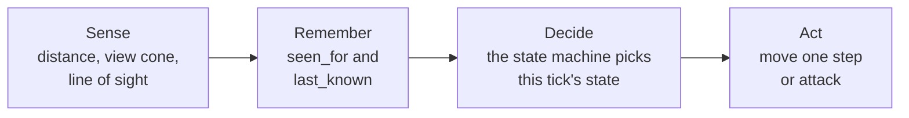
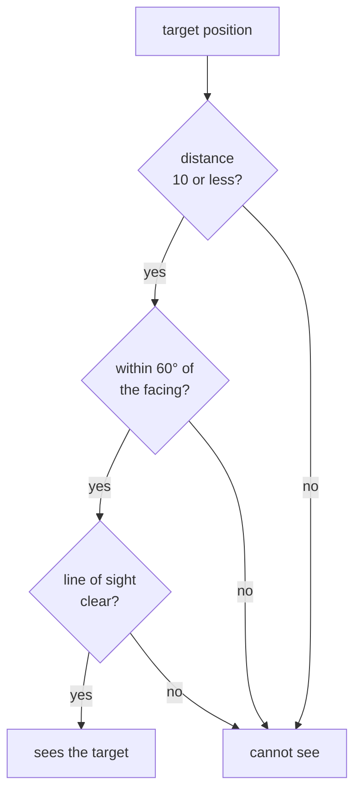
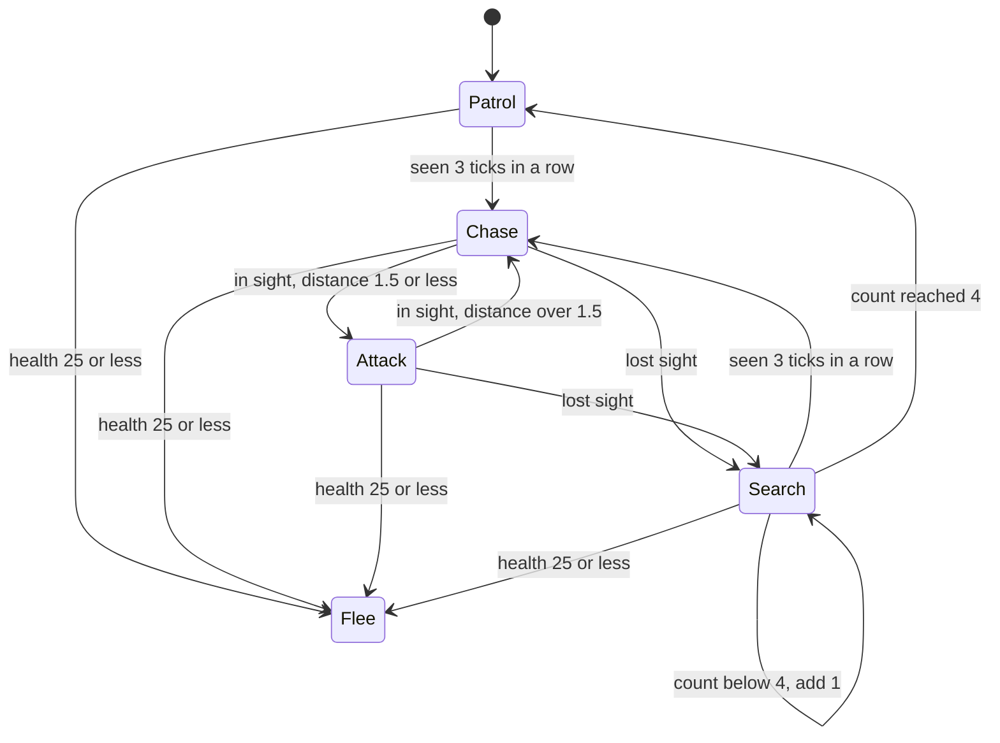

import MemoryStrip from '../../../../components/MemoryStrip.astro';

## An NPC is a small program that runs every tick

A **non-player character** (NPC) is any character the game controls rather than
a person: a guard, a shopkeeper, an enemy soldier. In games, “AI” means the code
that picks what an NPC does next. It is usually far simpler than the AI in the
news: a handful of rules, checked quickly, many times per second.

The portable lab [`npc_brain_lab.rs`](/rust-labs/src/bin/npc_brain_lab.rs)
builds one such character, a guard, and this lesson follows it piece by piece.
Nothing in it touches a real game.

The game loop from [Lesson 1.4](/pages/1/04/) reads input, updates the world,
and draws a frame. Many games update the world in fixed steps called **ticks**.
Every tick advances the simulation by the same slice of time, however fast the
computer draws. The lab runs its guard at 10 ticks per second (the constant
`TICKS_PER_SECOND`), which makes each tick 1000 ÷ 10 = 100 milliseconds.

An NPC makes one decision per tick, for two reasons:

- **Behavior follows simulated time, not the frame rate.** A guard that reacts
  after 3 ticks reacts after 3 × 100 = 300 milliseconds on a fast computer and on
  a slow one. If it decided once per drawn frame, a machine drawing 144 frames
  per second would make it react faster than one drawing 30.
- **The cost is bounded and the behavior repeats.** Fifty guards cost fifty
  decisions per tick, no matter what the renderer does. The same inputs, tick
  by tick, give the same decisions, which is what lets the lab test its guard
  without drawing anything.

Each tick, the guard's `tick` method runs three stages in a fixed order: sense,
decide, and act. Sensing also updates what the guard remembers:



The guard never reads the player's true position directly. It gets the player's
position only through its senses, and remembers the last place it saw them in
`last_known`. That separation is what makes hiding behind a wall work.

## Sense: three checks, cheapest first

The guard sees a target only if it passes three checks, in this order:

1. **Distance:** the target is no more than `VIEW_DISTANCE` = 10 units away.
2. **View cone:** the target is inside the guard's view cone, the range of
   directions it can see: within 60° of the way it faces, on either side, so
   60 + 60 = 120° in all. Everything behind the guard is outside it.
3. **Line of sight:** the straight line from the guard to the target is free of
   solid geometry, so no wall hides the target.



The order matters for speed: the first two checks cost a handful of arithmetic
operations each, while the last walks along the line and tests every wall, so
it runs only after the cheap checks pass. Each check also gives the player a way
to stay unseen: keep your distance, stay behind the guard, or put a wall between
you.

The cone check never measures an angle. It uses a quick calculation called a
**dot product**, and the lab's constant `VIEW_CONE_COS` = 0.5 is the value that
stands for 60°. [Lesson 4.10](/pages/4/10/#the-three-checks-in-code) works
through all three checks in the lab's code and shows why.

## Decide: a finite-state machine

The guard's behavior is a finite-state machine, the same structure
[Lesson 4.4](/pages/4/04/) uses for a macro: a fixed set of named states and a
rule for each move between them. The guard has five states:

- **Patrol:** walk the route. The lab's route is a single point, the guard's
  post at (0, 0), so patrolling means standing there.
- **Chase:** walk toward where the player was last seen.
- **Attack:** the player is within `ATTACK_RANGE` = 1.5.
- **Search:** the player vanished, so go to the last known spot and wait there.
- **Flee:** health is `FLEE_HEALTH` = 25 or less, so run.

The whole decision is one function of the current state and this tick's senses:

```rust
fn decide(current: GuardState, senses: Senses) -> GuardState {
    if senses.health <= FLEE_HEALTH {
        return GuardState::Flee;
    }
    // The reaction delay: one glimpse is not enough to start a chase.
    let reacted = senses.sees_player && senses.seen_for >= REACTION_TICKS;
    match current {
        GuardState::Flee => GuardState::Flee,
        GuardState::Patrol | GuardState::Search { .. } if reacted => GuardState::Chase,
        GuardState::Patrol => GuardState::Patrol,
        GuardState::Chase | GuardState::Attack if senses.sees_player => {
            if senses.distance <= ATTACK_RANGE {
                GuardState::Attack
            } else {
                GuardState::Chase
            }
        }
        GuardState::Chase | GuardState::Attack => GuardState::Search { ticks: 0 },
        GuardState::Search { ticks } if ticks >= SEARCH_TICKS => GuardState::Patrol,
        GuardState::Search { ticks } => GuardState::Search { ticks: ticks + 1 },
    }
}
```

Drawn out, the transitions are:



When no arrow applies, the state stays the same. Three details of the code
decide the shape of that diagram:

- The health check runs before the `match`, so it overrides every state. Nothing
  leads out of Flee in this lab; a fleeing guard flees until the program ends.
- The `match` arms are tried from top to bottom. A searching guard that sees the
  player for 3 ticks goes back to Chase before its counter is even looked at.
- Search starts at count 0 on the tick the player is lost and adds 1 each tick.
  The guard gives up on the tick after the count has reached `SEARCH_TICKS` = 4,
  so a lost player is searched for five ticks: counts 0, 1, 2, 3, and 4.

### Reaction time is counted in ticks

`seen_for` counts the consecutive ticks in which the guard has seen the player,
and drops back to 0 on any tick it does not. The guard only reacts when the
count reaches `REACTION_TICKS` = 3, so one glimpse through a gap never starts a
chase.

At 10 ticks per second, the ticks are 100 milliseconds apart. The count reaches
3 two ticks after the first tick that saw the player, 2 × 100 = 200 milliseconds
later. The player may also have been visible for up to 100 milliseconds before
that first tick sensed them, so the guard reacts 200 to 300 milliseconds after
the player steps into view. That is close to a person's own reaction time of
about a quarter of a second, and that is the point: a guard that turns the
instant one pixel of you appears feels unfair. It is also the filter that
[Lesson 4.7](/pages/4/07/) calls debouncing.

The delay only runs one way. Once chasing, a single tick without sight sends the
guard to Search. Losing the player is instant; noticing them is not.

### One run, tick by tick

The lab's first demo puts the guard at its post, (0, 0), facing east, (1, 0).
A wall fills the box from (5.5, −1) to (6.5, 1): every point with x from 5.5 to
6.5 and y from −1 to 1. The player stands in the open at (5, 0) for ticks 1 to
7, then slips behind the wall to (8, 0) for ticks 8 to 16. “Distance” is
measured before the guard moves:

| Tick | Sees | `seen_for` | Distance | State | Guard after acting |
|---:|---|---:|---:|---|---|
| 1 | yes | 1 | 5 | `Patrol` | (0, 0) |
| 2 | yes | 2 | 5 | `Patrol` | (0, 0) |
| 3 | yes | 3 | 5 | `Chase` | (1, 0) |
| 4 | yes | 4 | 4 | `Chase` | (2, 0) |
| 5 | yes | 5 | 3 | `Chase` | (3, 0) |
| 6 | yes | 6 | 2 | `Chase` | (4, 0) |
| 7 | yes | 7 | 1 | `Attack` | (4, 0) |
| 8 | no | 0 | 4 | `Search { ticks: 0 }` | (5, 0) |
| 9 | no | 0 | 3 | `Search { ticks: 1 }` | (5, 0) |
| 10 | no | 0 | 3 | `Search { ticks: 2 }` | (5, 0) |
| 11 | no | 0 | 3 | `Search { ticks: 3 }` | (5, 0) |
| 12 | no | 0 | 3 | `Search { ticks: 4 }` | (5, 0) |
| 13 | no | 0 | 3 | `Patrol` | (4, 0) |
| 14 | no | 0 | 4 | `Patrol` | (3, 0) |
| 15 | no | 0 | 5 | `Patrol` | (2, 0) |
| 16 | no | 0 | 6 | `Patrol` | (1, 0) |

Every row follows from the rules above:

- **Ticks 1 and 2:** the player is 5 away, straight ahead, and in the open, so
  all three checks pass, but `seen_for` is only 1, then 2.
- **Tick 3:** `seen_for` reaches 3, so the guard chases, stepping `SPEED` = 1.0
  toward the player.
- **Ticks 4 to 7:** each step closes 1 unit. On tick 7 the distance is
  5 − 4 = 1, within 1.5, so the guard attacks and stops moving.
- **Tick 8:** the line from the guard at (4, 0) to the player's new spot at
  (8, 0) runs along y = 0 and passes through the wall where x is between 5.5
  and 6.5, so line of sight fails. The guard switches to Search and walks the
  1 unit to `last_known`, (5, 0).
- **Ticks 9 to 12:** the guard waits there, facing the wall that hides the
  player, while the count climbs to 4.
- **Tick 13:** the count has reached 4, so the guard returns to Patrol, turns
  west toward its post, and steps to (4, 0).
- **Ticks 14 to 16:** the player is now straight behind the guard, 180° from
  its facing and far outside the cone.

Games also use two other ways to decide, often mixed with small state machines:
**utility scoring** runs whichever action scores highest right now, and a
**behavior tree** checks an NPC's priorities from the top every tick.
[Lesson 4.10](/pages/4/10/#choose-among-actions-utility-scoring) works through
both.

## Moving is a separate system

The lab's guard moves with `move_toward`, which turns to face the target and
steps straight at it, ignoring walls. It avoids the wall in the demo only
because the spot it walks to, (5, 0), happens to be in front of it.

Games split movement off into a navigation system. The decision layer picks
*where* to go. The navigation layer works out *how*: it plans a route over a
grid or a **navigation mesh**, a set of polygons covering the floor an NPC can
walk on, with a search such as A* from [Lesson 4.6](/pages/4/06/), then steers
the NPC along that route one tick at a time.

## An NPC in memory

A game written in C++ usually stores each NPC as a structure, a block of memory
with each field at a fixed offset from its start, and keeps the state machine's
current state as a small number in one of those fields. In a toy layout of the
guard, the state is a single byte:

<MemoryStrip
  cells="0=Patrol|1=Chase|2=Attack|3=Search|4=Flee"
  marks="1"
  caption="What each value of the state byte means in the toy layout. The highlighted `1` is Chase. No other value means anything to the code."
/>

[Lesson 4.10](/pages/4/10/#the-guards-structure-byte-by-byte) lays out the whole
structure field by field.

### What editing the state byte would do

Take a toy program you wrote yourself, or an offline single-player game running
in your lab VM, whose guard follows the lab's rules. Changing the state byte
between two ticks has very different effects depending on the value:

- **Write 4 (Flee) mid-chase:** on the next tick `decide` sees Flee, and nothing
  leads out of Flee, so the guard turns and runs from the last place it saw the
  player until the program restarts. The edit lasts.
- **Write 0 (Patrol) mid-chase, with the player in view:** a chase only starts
  after 3 ticks of sight, so `seen_for` is already 3 or more, and the next
  decision turns Patrol straight back into Chase before the act stage runs. The
  guard never takes a patrol step; the edit is undone within one tick,
  100 milliseconds.
- **Write 0 (Patrol) while the guard is searching:** now the senses agree with
  Patrol, because the player is not in view, so the guard gives up the search
  early and walks home. The edit lasts.

The pattern behind those results: the state is an output the game recomputes
from its inputs every tick. An edit to the output survives only when the inputs
agree with it, as `seen_for` did not in the second case. An edit to an input
that the rules read, such as writing 20 into `health`, changes behavior for as
long as the input holds, here by sending the guard into Flee on the next tick.

## Why online NPCs are out of reach

In an online game, the server runs the NPCs. Their state bytes, timers, and
decision code exist in the server's memory, on a machine you do not control. The
server is the **authoritative** copy: its decisions are the ones that count.
Your client receives only what it needs to draw, such as positions,
animations, and perhaps a health bar, and [Lesson 1.4](/pages/1/04/) describes
why changing a client-side copy does not change what the server decides. Editing
an NPC's position or state in client memory changes, at most, what your own
screen draws until the next server update overwrites it. Tampering with a live
multiplayer service is also outside this book's scope; everything above belongs
in your own toy programs and offline games.

## Run the lab

From the `rust-labs` folder:

```powershell
cargo run --bin npc_brain_lab
cargo test --bin npc_brain_lab
```

The first command prints the sixteen-tick run from the table above, then five
situations scored by the utility system from
[Lesson 4.10](/pages/4/10/#choose-among-actions-utility-scoring). The tests pin
down each rule on its own, from the reaction delay and the search timeout to
low health overriding every state, the three perception checks, and the utility
choices.

Then change `REACTION_TICKS` to 1 and predict, before running the demo, which
tick the chase starts on and where the guard stands when it attacks. Two of the
tests will fail after that change, because they pin the delay at 3 ticks.
