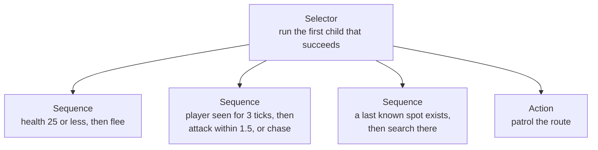

import MemoryStrip from '../../../../components/MemoryStrip.astro';
import Quiz from '../../../../components/Quiz.astro';

[Lesson 4.9](/pages/4/09/) followed a toy guard through sixteen ticks of
sensing, deciding, and acting. This lesson opens up what it described in words:
the arithmetic behind the guard's view cone and line of sight, two other ways
games choose what an NPC does, and where each of the guard's fields sits in
memory.

## The three checks in code

In the lab, the guard's three sensing checks live in one method, cheapest
first:

```rust
fn can_see(&self, target: Vec2, walls: &[Wall]) -> bool {
    let offset = target - self.position;
    if offset.length() > VIEW_DISTANCE {
        return false;
    }
    let Some(direction) = offset.normalized() else {
        return true;
    };
    if direction.dot(self.facing) < VIEW_CONE_COS {
        return false;
    }
    line_of_sight(self.position, target, walls)
}
```

The first two checks read `offset`, the arrow from the guard to the target: the
target's position minus the guard's. For a guard at (0, 0) and a player at
(4, 3), the offset is (4 − 0, 3 − 0) = (4, 3): 4 units along x and 3 along y. A
pair of numbers read as an arrow like this is a **vector**, in the math sense
rather than Rust's growable `Vec`. The lab's `Vec2` type stores one, and the
guard's `facing` is one too.

### Distance

The offset's x and y parts are the two short sides of a right-angled triangle
whose long side is the arrow, so Pythagoras' theorem gives the arrow's length as
√(x² + y²). For (4, 3), that is √(4² + 3²) = √(16 + 9) = √25 = 5, within
`VIEW_DISTANCE` = 10, so the first check passes. A player at (15, 0) is
√(15² + 0²) = 15 away and fails it.

### The view cone and the dot product

A **unit vector** is a vector of length 1. It stores a direction and nothing
else. The guard keeps `facing` as a unit vector: (1, 0) means it faces east,
along the x axis. `normalized` turns any offset into a unit vector by dividing
both parts by the length. The offset (4, 3) has length 5, so its direction is
(4 ÷ 5, 3 ÷ 5) = (0.8, 0.6), whose length is √(0.64 + 0.36) = √1 = 1. A target
standing exactly on the guard has an offset of length 0 and no direction; the
`let Some(direction) ... else` line counts it as seen.

The **dot product** of two vectors multiplies their matching parts and adds the
results:

```text
a · b = a.x × b.x + a.y × b.y
```

For two unit vectors, the dot product equals the **cosine** of the angle between
them. Picture a circle of radius 1 around the guard. A unit direction at some
angle from east ends on that circle, and the cosine of that angle is, by
definition, the x-coordinate of that end point. As the angle grows from 0° to
180°, the end point slides around the circle from right to left, so its x falls
steadily: 1 at 0°, 0 at 90°, and −1 at 180°. For a guard facing east, the dot
product of (1, 0) with a unit direction (x, y) is x × 1 + y × 0 = x, exactly
that cosine.

For any other facing, take the two unit vectors a and b and look at the arrow
from b's tip to a's tip, found the same way as `offset`: (a.x − b.x, a.y − b.y).
Call its length the tip gap. Pythagoras gives the tip gap squared, and
multiplying out the brackets regroups the terms:

```text
(a.x − b.x)² + (a.y − b.y)²
  = a.x² − 2 × a.x × b.x + b.x² + a.y² − 2 × a.y × b.y + b.y²
  = (a.x² + a.y²) + (b.x² + b.y²) − 2 × (a.x × b.x + a.y × b.y)
```

The first two groups are the vectors' lengths squared, 1 each, and the last
bracket is the dot product, so (tip gap)² = 1 + 1 − 2 × (a · b), which
rearranges to a · b = 1 − (tip gap)² ÷ 2. Turning the guard swings both arrows
together like one rigid shape, which leaves the gap between their tips
unchanged, so the dot product cannot change either: what holds facing east
holds for every facing. As a check, the arrow between the tips of (1, 0) and
(0.8, 0.6) is (1 − 0.8, 0 − 0.6) = (0.2, −0.6), so the tip gap squared is
0.04 + 0.36 = 0.4, and 1 − 0.4 ÷ 2 = 0.8, the same as 1 × 0.8 + 0 × 0.6.

Why does 0.5 mean 60°? A triangle whose three sides are all 1 long has three
equal angles, and a triangle's angles add up to 180°, so each is
180 ÷ 3 = 60°. Two of its sides, starting from the same corner, are unit vectors
60° apart whose tips are 1 apart, so their dot product, the cosine of 60°, is
1 − 1² ÷ 2 = 0.5.

The test `direction.dot(self.facing) < VIEW_CONE_COS` therefore rejects every
direction whose cosine is below 0.5. The cosine falls steadily as the angle
grows, so that is every direction more than 60° from the facing, on either side.
The cone is 60 + 60 = 120° wide.

<MemoryStrip
  cells="0°=1.0|37°=0.8|60°=0.5|90°=0.0|120°=−0.5|180°=−1.0"
  marks="0-2"
  groups="0-2:inside the cone: 0.5 or more|3-5:outside the cone"
  caption="The dot product of the facing and a unit direction at each angle from it. It falls from 1 straight ahead to 0 at a right angle and −1 straight behind. At 120°, 60° past the right angle, the direction's x is the mirror image of the 60° case, −0.5."
/>

For the player at (4, 3), the dot product of (0.8, 0.6) with the facing (1, 0)
is 0.8 × 1 + 0.6 × 0 = 0.8, at least 0.5, so the player is inside the cone. (An
**inverse cosine**, the calculator function that turns a cosine back into an
angle, puts them about 37° from the facing.) A player at (0, 5) has direction
(0 ÷ 5, 5 ÷ 5) = (0, 1) and a dot product of 0 × 1 + 1 × 0 = 0, a full 90° to
the side, so the guard does not see them.

The code never computes an angle. Turning a dot product back into an angle would
need that inverse cosine, a much slower function. Comparing the dot product with
a cosine worked out once, when the constant was written, gives the same answer
with two multiplications and one addition.
[Lesson 5.1](/pages/5/01/#length-normalization-and-alignment) uses the same
comparison in three dimensions, for a camera's field of view.

<Quiz
  id="npc-view-cone-dot"
  title="Inside the cone?"
  prompt="A guard faces (1, 0). The unit direction to the player is (0.6, 0.8). With VIEW_CONE_COS = 0.5, can the guard see the player, ignoring walls and distance?"
  options="Yes: 0.6 × 1 + 0.8 × 0 = 0.6, which is at least 0.5||No: 0.8 is larger than 0.6, so the player is mostly to the side||Yes: every direction with a positive y is inside||No: 0.6 + 0.8 = 1.4, which is more than 1"
  answer="0"
  explanation="For unit vectors the dot product is the cosine of the angle between them. 0.6 is at least cos 60° = 0.5, so the player is less than 60° from the facing (about 53°) and inside the cone."
/>

### Line of sight

The last check, `line_of_sight`, walks from the guard toward the target in
steps of `SIGHT_STEP` = 0.1 and tests each sample point against the walls. Each
wall is an axis-aligned box, meaning its sides run along the x and y axes,
stored as two corners, `min` and `max`. A point is inside when both of its
coordinates lie between the corners.

On tick 8 of [Lesson 4.9's run](/pages/4/09/#one-run-tick-by-tick), the guard
stands at (4, 0), the player at (8, 0), and a wall fills the box from (5.5, −1)
to (6.5, 1) between them. The samples are (4.0, 0), (4.1, 0), (4.2, 0), and so
on. By (5.6, 0) a sample is inside the wall, because 5.5 ≤ 5.6 ≤ 6.5 and
−1 ≤ 0 ≤ 1, so the function returns `false` long before it reaches the player.

<MemoryStrip
  cells="x 4.0=guard|x 4.1 to 5.4=clear|x 5.5 to 6.5=wall|x 6.6 to 7.9=not tested|x 8.0=player"
  marks="2"
  caption="Tick 8's line of sight along y = 0, each box labelled by its x values. The walk stops at the first sample inside the wall and never tests the rest."
/>

A line can also slip past a wall. From (0, 0) to (4, 3), the line rises 3 for
every 4 across, so every point on it has y = 3 ÷ 4 × x = 0.75 × x. A wall from
(2, −1) to (3, 1) covers x from 2 to 3, where the line's y runs from
0.75 × 2 = 1.5 to 0.75 × 3 = 2.25, higher than the wall's top edge at y = 1. No
sample lands inside, and the guard sees the player. The lab's tests check both
cases.

Stepping has a blind spot: a wall thinner than 0.1 can sit between two samples
and be missed. It also costs more with distance. A check across the full view
distance takes 10 ÷ 0.1 = 100 samples, each tested against every wall. Engines
instead compute exactly where a ray crosses each collision shape, a **ray
cast**, but the question they answer is the same one.

## Choose among actions: utility scoring

A state machine answers “which mode am I in?” Some decisions are better framed as
“which of these options is best right now?” **Utility AI** gives every option a
score computed from the situation and runs the highest one. The second demo in
the lab from [Lesson 4.9](/pages/4/09/#run-the-lab) scores three options for a
fighter:

```rust
fn score(choice: Choice, situation: Situation) -> f32 {
    match choice {
        Choice::Attack if situation.enemy_visible => 0.4 + 0.6 * situation.health,
        Choice::TakeCover if situation.enemy_visible && !situation.in_cover => {
            0.9 - 0.6 * situation.health
        }
        Choice::Heal if situation.potions > 0 => 1.0 - situation.health,
        _ => 0.0,
    }
}
```

`health` here is a fraction: 30 health out of 100 is 30 ÷ 100 = 0.3. Each score
is a straight line in `health`, chosen so its meaning is readable. Attack scores
1.0 at full health and falls to 0.4 as health runs out. Taking cover scores 0.3
at full health and rises to 0.9. Healing scores nothing at full health and 1.0
at zero. An option that makes no sense right now, such as healing with no
potions, scores 0.

With an enemy in view, no cover, and one potion, the scores at several health
levels are:

| Health | Attack: 0.4 + 0.6 × h | Take cover: 0.9 − 0.6 × h | Heal: 1.0 − h | Chosen |
|---:|---|---|---|---|
| 1.0 | 0.4 + 0.6 = 1.00 | 0.9 − 0.6 = 0.30 | 0.00 | Attack |
| 0.75 | 0.4 + 0.45 = 0.85 | 0.9 − 0.45 = 0.45 | 0.25 | Attack |
| 0.5 | 0.4 + 0.3 = 0.70 | 0.9 − 0.3 = 0.60 | 0.50 | Attack |
| 0.3 | 0.4 + 0.18 = 0.58 | 0.9 − 0.18 = 0.72 | 0.70 | Take cover |
| 0.2 | 0.4 + 0.12 = 0.52 | 0.9 − 0.12 = 0.78 | 0.80 | Heal |
| 0.1 | 0.4 + 0.06 = 0.46 | 0.9 − 0.06 = 0.84 | 0.90 | Heal |

The switch points come straight from the formulas. Attack and cover score the
same when 0.4 + 0.6h = 0.9 − 0.6h. Adding 0.6h to both sides and taking 0.4 from
both gives 1.2h = 0.5, so h = 0.5 ÷ 1.2 ≈ 0.42. Cover and healing tie when
0.9 − 0.6h = 1.0 − h, which rearranges to 0.4h = 0.1, so h = 0.25. Above about
42% health this fighter attacks, between 25% and 42% it takes cover, and below
25% it drinks a potion. Changing one number in a formula moves one of those
switch points, and that is how designers tune utility AI.

The demo also varies the situation, all at a health of 0.3 except where it says
healthy:

| Situation | Attack | Take cover | Heal | Chosen |
|---|---:|---:|---:|---|
| healthy, enemy in view | 1.00 | 0.30 | 0.00 | Attack |
| hurt, enemy in view, exposed | 0.58 | 0.72 | 0.70 | Take cover |
| hurt, enemy in view, in cover | 0.58 | 0.00 | 0.70 | Heal |
| hurt, in cover, no potions left | 0.58 | 0.00 | 0.00 | Attack |
| healthy, nobody in view | 0.00 | 0.00 | 0.00 | nothing |

Once in cover, taking cover scores 0, so the next best option wins. With no
potions, healing scores 0 too, and attacking is all that is left. With nobody in
view, every option scores 0. The lab's `choose` function keeps only scores above
0 before it picks the highest, so it returns `None`: nothing on this list is
worth doing, and another system, such as the patrol, keeps control.

Utility scoring has its own weak spot. Near a switch point, a tiny change in
health can flip the choice back and forth every tick. Games damp this by adding
a small bonus to whatever the NPC is already doing, so a rival option has to beat
it clearly before the NPC switches. The trade against a state machine is that a
state machine lists every transition by hand, so each new state needs arrows to
and from the old ones, while utility scoring adds one scoring function per
option but hides its behavior in numbers that need tables like the one above to
tune.

## Behavior trees, briefly

Larger games often organize NPC logic as a **behavior tree** instead. The lab
does not build one, but the idea is short. The leaves of the tree are conditions
(“is health 25 or less?”) and actions (“flee”). The inner nodes decide the order.
A **selector** tries its children from left to right and stops at the first one
that succeeds. A **sequence** runs its children in order and stops at the first
one that fails. The engine evaluates the tree from the root every tick.

The guard's priorities fit in one selector:



Compare it with the guard's
[state diagram](/pages/4/09/#decide-a-finite-state-machine). The four arrows
into Flee, one from each other state, became one child, placed first, because a
behavior tree re-checks its priorities from the top every tick. The tree keeps
no memory between ticks by itself, though. Values such as `seen_for` and
`last_known` live beside it, in a shared store that engines call a
**blackboard**. Real games mix all three techniques: a behavior tree for
priorities, small state machines inside some of its nodes, and utility scores
to choose between similar actions.

## The guard's structure, byte by byte

[Lesson 4.9](/pages/4/09/#an-npc-in-memory) numbered the guard's states for a
toy C++ layout. Here is the whole structure. The lab cannot show one itself,
because its Rust types use Rust's default layout, which lets the compiler order
fields however it likes. In C++, the fields of a plain structure sit in memory
in the order they are declared:

```cpp
struct Guard {              // offset
    float x, y;             // 0x00, 0x04
    float facing_x;         // 0x08
    float facing_y;         // 0x0C
    uint32_t health;        // 0x10
    uint8_t state;          // 0x14: 0 Patrol, 1 Chase, 2 Attack, 3 Search, 4 Flee
                            // 0x15 to 0x17: padding
    uint32_t seen_for;      // 0x18
    uint32_t search_ticks;  // 0x1C
    uint32_t target_id;     // 0x20
};                          // 0x24 bytes in total
```

Every `float` and `uint32_t` takes 4 bytes, so the offsets count up in fours:
0, 4, 8, 12 (`0x0C`), and 16 (`0x10`). The state is stored as a single byte at
20, which is `0x14` (1 × 16 + 4). The next field is 4 bytes wide, and its
**alignment** requires it to start at a multiple of 4. Bytes 21, 22, and 23 are
not, so the compiler leaves them as padding, and `seen_for` starts at 24, which
is `0x18` (1 × 16 + 8). `search_ticks` follows at 28, `0x1C` (1 × 16 + 12), and
`target_id` at 32, `0x20` (2 × 16). The structure ends at 36 bytes, `0x24`
(2 × 16 + 4).

Here is the guard at the end of tick 5 of
[Lesson 4.9's run](/pages/4/09/#one-run-tick-by-tick), mid-chase. It has seen
the player on ticks 1 to 5, so `seen_for` is 5, and chase steps of 1 on ticks 3,
4, and 5 have taken it to (3, 0), still facing east. Its health is still the 100
that the lab gives every new guard:

<MemoryStrip
  cells="+0x00 x=3.0|+0x04 y=0.0|+0x08 facing x=1.0|+0x0C facing y=0.0|+0x10 health=100"
  groups="0-1:position|2-3:facing, a unit vector"
  caption="Bytes `0x00` to `0x13` of the toy layout at tick 5: where the guard stands, which way it faces, and its health."
/>

<MemoryStrip
  cells="+0x14 state=1|+0x15 padding=· · ·|+0x18 seen_for=5|+0x1C search_ticks=0|+0x20 target_id=7"
  marks="0"
  groups="0-1:one state byte, three padding bytes|2-3:timers|4-4:who it hunts"
  caption="Bytes `0x14` to `0x23`. The highlighted byte is the state machine's current state, `1` for Chase. The target id `7` is a made-up entity number for the player."
/>

The target field is an id rather than a pointer. Some games store a raw pointer
to the target object instead, and that pointer goes stale when the target is
destroyed and its memory reused, the problem that generation-checked handles in
[Lesson 1.4](/pages/1/04/) solve.

### A state value that means nothing

A byte's 8 bits give 2⁸ = 256 different values, 0 to 255, but only 0 to 4 mean
anything to the guard's code. Write 9 into the state byte of a toy program that
follows the lab's rules, and the result depends on how the compiler built the
`switch` statement that picks a branch for each state. Compilers often turn a
`switch` over small numbers into a table of jump targets, one code address per
value. If the compiled code checks the range first, 9 goes to a default branch.
If it indexes the table without a check, it reads whatever bytes lie past the
table's end as an address, jumps there, and usually crashes.

The guard's state is an **enum**, a type whose values come from a fixed list of
names. In the Rust lab, safe code cannot store 9 in a `GuardState` at all. Rust
treats an enum holding a value outside its list as **undefined behavior**: the
language promises nothing about what the program then does, so safe code is
never allowed to create one.
