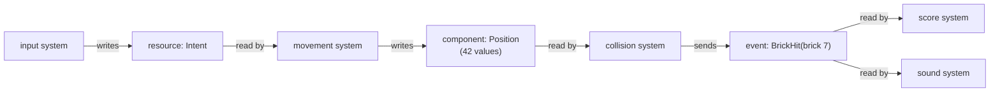
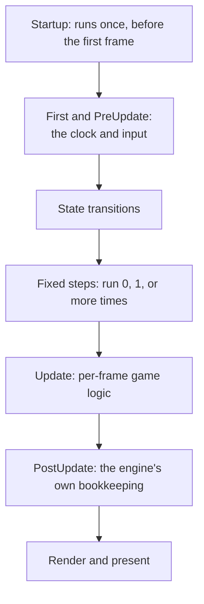

import { Accordion, AccordionGroup, Badge, Example, Fields, HoverCard, Math, Panel, ParamField, Steps, Tab, Tabs } from '../../../../components/kit';
import MemoryStrip from '../../../../components/MemoryStrip.astro';

Lesson 4.1 split a game into entities, components, and systems, and followed one
frame from input to the screen. A real frame runs dozens or hundreds of systems.
Four questions decide what you will see when you look at such a game from outside:

- How do systems pass data to one another?
- Which system runs first, and which can run at the same time?
- Which systems run on a given frame at all?
- How does the engine avoid redoing work for things that did not change?

The answers explain symptoms that look like bugs: a value that updates one frame
late, a copy that does not follow your edit, a number that freezes in a menu. They
hold in every engine of this kind. Where a detail belongs to one engine, the text
names it; the examples use the Breakout game from Lesson 4.1, with 1 paddle, 1
ball, and 40 bricks.

## Three ways systems share data

Systems never call one another. Each is a separate function the engine runs, and
they cooperate only through data the engine owns. That data comes in three shapes:

<Panel title="Where shared data lives">

| Shape | How many exist | Who can read it | In Breakout |
|---|---|---|---|
| **Component** | one per entity that has it | any system that asks for entities with it | `Position` on the paddle, the ball, and 40 bricks: 42 values |
| **Resource** | exactly one for each kind | any system | `Score`, the clock, the settings: one value each |
| **Event** | a short queue of messages | every system that reads that kind | `BrickHit` for brick 7 |

</Panel>



In memory the three look different. The 42 positions are one run of 42 records,
which a scan finds together. A resource is one record at one address, so a scan
for the score finds a single candidate instead of forty. An event is an entry in
a queue that the engine empties again within a frame or two.

## Resources: one value for the whole world

A **resource** is a value that exists once for the whole world, whatever entities
there are: the clock, the score, the settings read at startup, the state of the
keyboard. Because there is exactly one of each kind, a system asks for it by kind
and needs no entity.

The choice between a resource and an entity is about how the data is used. If
every system should treat the value like any other character or object, an entity
is the better home. A single-player game's player can be either. Keeping the
player as an entity lets the same health-and-damage system serve the player and
the enemies, and a resource would not. A score, a clock, or the current level
belongs to the game as a whole, so a resource fits.

## Events: messages with a short life

An **event** carries one fact from the systems that notice it to the systems that
care. The collision system does not know that a score or a sound exists; it sends
`BrickHit` and moves on. Any number of systems can read it, and a new system, such
as a particle burst, can be added later without touching the collision code.

Mechanically an event queue is a list. A sender appends to it. Each reader keeps
its own count of how many entries it has read, so two readers each see every
event once. The engine empties old entries after a short time. Bevy keeps each
event for at least two frames, and other engines choose differently, so a system
that does not run during that window never sees the event. A paused game is the
usual case: the systems that read events stop, the events expire, and the
reaction is lost for good.

Order matters as well, because a reader only sees what has already been sent when
it runs:

<Example title="One brick hit, two orders">

The game runs at 60 frames a second, so a frame is 1000 ÷ 60 = 16.67 ms and frame
10 starts at 10 × 16.67 = 166.7 ms. During frame 10 the collision system sends
`BrickHit`. The score system reads it, but when depends on which runs first:

| Order in the frame | Score system reads the event in | Score changes at | Late by |
|---|---|---|---|
| collision, then score | frame 10 | 166.7 ms | none |
| score, then collision | frame 11 | 183.3 ms | one frame, 16.67 ms |

</Example>

One frame is short. A frame of delay between a bat swing and its sound or a key
press and its effect is something a player can feel, which is why engines let you
state the order.

## Queries: asking for entities by what they have

A system does not loop over every entity and ask what it is. It describes the
components it needs, and the engine hands it exactly the entities that have them.
That description is a **query**. A query can say:

<Fields title="What a query can say">
<ParamField name="data wanted" type="components">

Which components to read or write, such as `Position` and `Velocity`. An entity
is included only if it has all of them.

</ParamField>
<ParamField name="with / without" type="filters">

Components an entity must have, or must not have, without reading their values:
every brick, or everything except the ball.

</ParamField>
<ParamField name="optional" type="component">

A component that may be missing. The system gets the value when it is there and
`None` when it is not.

</ParamField>
<ParamField name="changed / added" type="filters">

Only entities whose component changed, or first appeared, since this system last
ran. The next section covers these.

</ParamField>
</Fields>

In Breakout, with 42 entities, the queries below match:

| Query | Entities it matches | Count |
|---|---|---|
| `Position` and `Velocity` | the ball | 1 |
| `Position` and `Size` | the paddle, the ball, and the bricks | 42 |
| `Position` and `Size`, without `Velocity` | the paddle and the bricks | 41 |
| `Brick` | the bricks | 40 |
| `PlayerControlled` | the paddle | 1 |

A query that should match exactly one entity, such as the player, can ask for
exactly one and fail loudly when there are two or none. A query can also hand out
every pair of entities, and the cost of that grows quickly. With *n* entities
there are *n* × (*n* − 1) ÷ 2 pairs:

<Math block tex="\text{pairs} = \frac{n\,(n-1)}{2}" speak="the number of pairs equals n times n minus one, divided by two" />

For the 42 Breakout entities that is 42 × 41 ÷ 2 = 861 pairs. For 1,000 entities it
is 1,000 × 999 ÷ 2 = 499,500 pairs, and at 60 steps a second that is
499,500 × 60 = 29,970,000 contact tests every second. This is why engines test
only nearby pairs instead of all of them.

## Change detection: do work only for what changed

Some work only needs doing when a value changed. A health bar must be redrawn when
health changes, and not on every frame for every character. **Change detection**
lets a system ask for exactly those entities.

The engine keeps a counter that rises with every frame. When a system writes a
component, the engine stamps that value with the current counter. Each system
remembers the counter from the last time it ran, and a `Changed` query returns
the entities whose stamp is newer than that. Suppose the health-bar system last
ran at counter 41:

| Entity | Health last written at | Newer than 41? | Redrawn? |
|---|---|---|---|
| A | 40 | no | no |
| B | 43 | yes | yes |
| C | 44 | yes | yes |

The saving can be large. With 10,000 characters and a redraw that costs 0.002 ms
each, redrawing all of them costs 10,000 × 0.002 = 20 ms, more than a whole 16.67
ms frame. If only 12 changed this frame, the cost is 12 × 0.002 = 0.024 ms, about
833 times less.

Three consequences follow, and the third one matters when you edit memory:

- A system that was paused and runs again still sees every change since it last
  ran, because it compares against its own counter. Events behave differently,
  as above.
- A removed component is a special case: the data is gone, so there is no stamp to
  read. Engines keep a short list of the entities whose component was removed
  this frame instead.
- Writing a value counts as a change **even when the new value equals the old
  one**. A tool that rewrites a value every frame therefore makes the engine
  believe it changes every frame, and everything triggered by that change runs
  every frame too.

## A frame is a fixed list of schedules

Every system belongs to a **schedule**, a named phase of the frame, and the engine
runs the phases in a fixed sequence. The names below are Bevy's; other engines use
other names for the same idea.



Two things about this list explain a great deal of what you will measure.

First, the fixed steps from Lesson 4.1 are a loop inside the frame. A fixed step
is a slice of game time, not of real time, so the number of steps a frame runs
depends on how long the frame took. With a 60 Hz step, a step is 1000 ÷ 60 = 16.67
ms:

| Frame rate | Frame time | Fixed steps per frame |
|---|---|---|
| 30 frames a second | 33.33 ms | 2 on every frame |
| 60 frames a second | 16.67 ms | 1 on every frame |
| 144 frames a second | 6.94 ms | 60 ÷ 144 = 5 of every 12 frames run one step; the other 7 run none |
| 240 frames a second | 4.17 ms | 1 of every 4 frames runs one step |

<HoverCard kind="example" body="Bevy's default fixed step is 64 steps a second, which is 1000 ÷ 64 = 15.625 ms. Many games choose 60.">The step rate</HoverCard> is
a setting of the game, so a value your tool watches can change once per step in
one game and once per frame in another.

Second, the engine's own work is made of ordinary systems that live in these same
phases. Updating the world position of every object from its parents, and deciding
which objects are visible, run in the bookkeeping phase near the end of the frame.
Anything that reads those results earlier in the frame sees yesterday's answer,
which Lesson 7.1 shows for positions.

## Order and parallel work: when a system may run

Within a phase the engine decides which system runs next from what each one
declares it reads and writes. A system is ready to run when all three conditions
hold:

- no system that is running right now writes any data this one touches, and none
  reads data this one writes;
- every system that was ordered *before* it has finished or been skipped;
- its run conditions, covered next, are true.

A ready system starts on any free CPU thread, so systems that touch different data
run at the same time. When the order of two systems is not stated, the engine may
run them either way round, and the order can even change from one frame to the
next.

Take five systems with these costs: `read_input` writes the player's intent
(1 ms), `enemy_ai` (3 ms), `move_player` writes `Position` and runs after
`read_input` (1 ms), `collide` reads `Position` and sends events (2 ms), and
`play_sounds` reads the events (1 ms). One thread would take 1 + 3 + 1 + 2 + 1 =
8 ms. On two threads the result depends on what `enemy_ai` touches:

<Tabs sync="layout">
<Tab label="The AI reads Position">

`enemy_ai` reads `Position`, so `move_player`, which writes it, must wait for the
AI to finish.

| Time | Thread A | Thread B |
|---|---|---|
| 0 to 1 ms | read_input | enemy_ai |
| 1 to 3 ms | idle: move_player cannot start | enemy_ai |
| 3 to 4 ms | move_player | |
| 4 to 6 ms | collide | |
| 6 to 7 ms | play_sounds | |

The frame's systems take 7 ms.

</Tab>
<Tab label="The AI reads its own copy">

`enemy_ai` reads a copy of last frame's positions, so nothing it touches conflicts.

| Time | Thread A | Thread B |
|---|---|---|
| 0 to 1 ms | read_input | enemy_ai |
| 1 to 2 ms | move_player | enemy_ai |
| 2 to 3 ms | collide | enemy_ai |
| 3 to 4 ms | collide | |
| 4 to 5 ms | play_sounds | |

The longest chain, 1 + 1 + 2 + 1 = 5 ms, sets the frame's systems at 5 ms. The
price is that the AI sees positions one frame old.

</Tab>
</Tabs>

An unstated order costs correctness as well as time. If `move_player` happens to
run before `read_input`, a key pressed during frame *N* is not applied until frame
*N* + 1. At 60 frames a second that adds 16.67 ms of delay, and at 30 frames a
second it adds 33.33 ms. The same mistake in the other direction, a reader running
before the writer it depends on, is the one-frame lag of the events example.

## Run conditions and states

A **run condition** is a yes-or-no check the engine makes before a system runs, on
every frame: is the game in the playing state, has a timer finished, does an enemy
exist? When the answer is no, the system is skipped and anything it would have
changed stays as it was. A condition can be attached to one system or to a whole
set of them.

**States** are the usual source of conditions. A game is in exactly one state of a
kind, such as menu, loading, playing, paused, or game over, and most gameplay
systems run only in the playing state. Changing state is queued rather than
immediate, and the engine carries it out at one fixed point in the next frame:

<Steps>

1. A system asks for the new state. Nothing changes yet.
2. At the start of the next frame the engine runs the exit work of the old state,
   such as despawning the match.
3. It runs the work attached to the move itself.
4. It runs the enter work of the new state, such as spawning the game-over screen.

</Steps>

This is why a value stops changing the moment you open a menu: its system has a
condition that is now false, and nothing is wrong with the value. It also ties back
to events. A system skipped for 120 frames reads nothing from an event queue that
expired in two.

## Commands wait for a safe moment

Creating or removing an entity while systems are running would move data that other
systems are reading. So a system does not do it directly. It records a **deferred
command**, such as "spawn a bullet here" or "despawn brick 7", and the engine applies the
queue at a safe point, normally the end of the phase, or between two systems whose
order was stated.

The consequence is a delay you can measure. A bullet spawned by a system in frame
*N* appears in the queries of later phases, but systems that already ran earlier in
frame *N* cannot see it, and it first reaches them in frame *N* + 1, 16.67 ms later
at 60 frames a second. A despawned entity is gone from the next query in the same
way, and its memory is free to be reused, which is the reuse Lesson 3.6 warned
about.

## How components are stored: tables and sparse sets

Lesson 4.1 said that each kind of component sits in its own run of memory. There are
two common ways to arrange that, and an engine can offer both:

<Tabs sync="storage">
<Tab label="Table storage">

Entities with the same set of components share a table, and each component has a
column of equal-sized records. Take `Position` (8 bytes), `Velocity` (8 bytes), and
`Health` (4 bytes): one row is 8 + 8 + 4 = 20 bytes, and 10,000 entities make
200,000 bytes.

<MemoryStrip
  column
  cells="Position column=10,000 × 8 bytes = 80,000 bytes, one run|Velocity column=10,000 × 8 bytes = 80,000 bytes, one run|Health column=10,000 × 4 bytes = 40,000 bytes, one run"
  caption="One table: each component is one unbroken run, so a system that needs positions reads 80,000 bytes straight through."
/>

Reading is fast, because a system walks one column from start to end. Adding a
component to one entity is the slow case: its row no longer fits this table, so all
20 bytes move to a table that has the new column, and 4 more are written for a
4-byte `Burning` component.

</Tab>
<Tab label="Sparse-set storage">

A component of this kind lives in its own pool, with an index from entity to
position in the pool. Adding `Burning` to one entity appends one 4-byte record to
that pool and an entry to the index. Nothing else moves.

Adding and removing is cheap, but reading costs an extra step for every entity,
because the engine looks in the index before it reaches the value, and the values
are not in entity order. That suits a marker that comes and goes every frame, such
as "this enemy has noticed the player", and does not suit data that every system
reads.

</Tab>
</Tabs>

Tables have a limit of their own. Each distinct set of components needs its own
table. If 10,000 bullets all carry `Position`, `Velocity`, and `Damage`, they share
one table. If each bullet may also carry any of 8 optional markers, up to 2⁸ =
256 different sets can appear, so the same 10,000 bullets are spread over as many
as 256 tables, about 10,000 ÷ 256 = 39 to a table. Each table is a separate run in
memory, and a scan for one component finds it in many pieces.

## The same ideas in a real engine

Everything above holds in any engine of this kind. If you would like to see the names,
Bevy writes the same ideas in a few lines of Rust: a component is a plain struct, a
system is an ordinary function, and a query is the function's parameter list.

<Accordion title="Optional: Breakout's systems in Bevy">

A query for every entity that has both `Position` and `Velocity`, and the clock as a
resource:

```rust
use bevy::prelude::*;

#[derive(Component)]
struct Position { x: f32, y: f32 }

#[derive(Component)]
struct Velocity { x: f32, y: f32 }

fn move_things(time: Res<Time>, mut query: Query<(&mut Position, &Velocity)>) {
    for (mut position, velocity) in &mut query {
        position.x += velocity.x * time.delta_secs();
        position.y += velocity.y * time.delta_secs();
    }
}

// Only the entities whose Position was written since this system last ran.
fn redraw_moved(query: Query<&Position, Changed<Position>>) {
    for position in &query {
        // update this entity's sprite from `position`
    }
}
```

A command to remove the bricks that were hit, and the order and the run condition,
which are written where the systems are added. `Hit` is a marker component that the
collision system adds to a brick, and `GameState` is an enum the game defines. The
other systems are written the same way:

```rust
fn remove_hit_bricks(mut commands: Commands, bricks: Query<Entity, With<Hit>>) {
    for brick in &bricks {
        commands.entity(brick).despawn(); // queued, applied at a safe point
    }
}

fn main() {
    App::new()
        .add_plugins(DefaultPlugins)
        .init_state::<GameState>()
        .add_systems(
            Update,
            (read_input, move_things, collide, remove_hit_bricks, play_sounds)
                .chain()                               // run in this order
                .run_if(in_state(GameState::Playing)), // skipped in every other state
        )
        .run();
}
```

Each piece matches a section above: `Res<Time>` is a resource, the two `Query`
parameters are queries, `Changed<Position>` is change detection, `Commands` holds
deferred commands, `.chain()` states the order, and `.run_if(in_state(...))` is a run
condition. These lines were compiled against Bevy 0.19. Bevy's names change between
versions, so check the one you use.

</Accordion>

## Questions this raises

Three questions that come up once the pieces are in place, each worth a minute and none
needed for the next lesson:

<AccordionGroup>
<Accordion title="Could more CPU threads make the frame's systems finish faster than 5 ms?">

No. The chain `read_input`, `move_player`, `collide`, `play_sounds` runs one system
after another, because each needs the one before it: 1 + 1 + 2 + 1 = 5 ms. Extra threads
can run `enemy_ai` beside the chain, but nothing can start a system before the one it
waits for has finished. The longest chain of waiting systems sets a floor under the
frame, whatever the number of threads. In the first tab above, `enemy_ai` joined that
chain because it read `Position`, and the floor rose to 3 + 1 + 2 + 1 = 7 ms.

</Accordion>
<Accordion title="What happens when two systems write the same value and no order is stated?">

The result depends on which one runs last. Say one system sets a character's speed to 100
and another sets it to 50. If the first runs first, the speed ends the frame at 50, and if
the second runs first, it ends at 100. An unstated order can change from one frame to the
next, so the value can flip between 50 and 100 with no input from you. A number that
alternates like that is a sign of two systems writing it.

</Accordion>
<Accordion title="Why are events dropped after a short time instead of kept until someone reads them?">

A queue that was never emptied would grow for as long as the game ran. An event sent on
every frame that nobody reads would add 60 × 60 = 3,600 events a minute at 60 frames a
second. Dropping each event after a short, fixed time keeps the queue small, at the cost
of the missed-event problem described above.

</Accordion>
</AccordionGroup>

## What this means when you look at a running game

Each mechanism above leaves a mark you can see from outside. Use the table to turn a
symptom into a question:

<Panel title="Symptoms and the engine mechanism behind them">

| What you see | What to suspect |
|---|---|
| One value changes once per step, another once per frame | the first is set by a fixed-step system, the second by a per-frame one |
| A copy of a value shows last frame's number | a system that reads it runs before the system that writes it |
| A spawned object is missing until the next frame | the spawn is a command that has not been applied yet |
| A value freezes in a menu or on pause | its system has a run condition that is now false |
| Rewriting a value every frame makes extra work happen | a write counts as a change, so every change-triggered system runs |
| All the records of one kind sit in one run | table storage, so a scan for it returns one tidy block |
| The same kind of record is scattered | sparse-set storage, or many tables because of different component sets |

</Panel>

Lesson 4.3 returns to one player and builds a snapshot of the game's state, the
copy of those values that a tool can read without disturbing the game.
