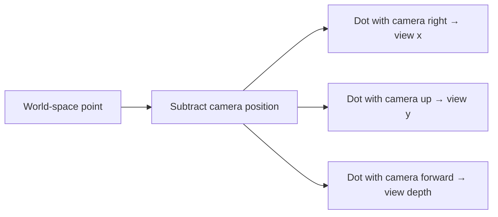
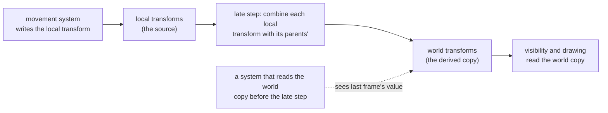
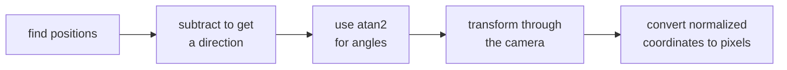

import Frame from '../../../../components/kit/Frame.astro';
import { CardGrid, Example, LinkCard, Panel, Tooltip, SpeedType } from '../../../../components/kit';

import MemoryStrip from '../../../../components/MemoryStrip.astro';
import Scene from '../../../../components/Scene.astro';
import CodeTrace from '../../../../components/CodeTrace.astro';
import MarginNote from '../../../../components/kit/MarginNote.astro';

A tool can know a target's position and still draw its marker in the wrong
place. The target's coordinates describe the world; the screen describes
the picture seen by one camera. We need to account for where that camera
sits, which way it faces, and how perspective changes the apparent size
of distant objects.

[Coordinates, Vectors, and Directions](/pages/4/11/) established the spatial
operations used here: subtract positions to form a displacement, normalize
a vector to keep its direction, and use a dot product to compare alignment.
This lesson follows that geometry through camera frames and projection.

<span id="extend-2d-coordinates-to-three-dimensions"></span>
<span id="position-versus-direction"></span>
<span id="length-normalization-and-alignment"></span>

For the worked coordinate differences and normalized alignment calculations,
see [the vector lesson](/pages/4/11/#length-normalization-and-alignment).

The Rust examples on this page use this small three-coordinate record:

```rust
#[derive(Clone, Copy, Debug)]
struct Vec3 {
    x: f32,
    y: f32,
    z: f32,
}

impl Vec3 {
    fn subtract(self, other: Self) -> Self {
        Self {
            x: self.x - other.x,
            y: self.y - other.y,
            z: self.z - other.z,
        }
    }
}
```

Each field holds one `f32` coordinate. `subtract` computes the component
differences: calling `target.subtract(camera)` gives the displacement from
the camera to the target. The method and record are defined here so the
camera examples can be read without copying a program from another lesson.

## Construct perpendicular directions

The **cross product** produces a direction perpendicular to two input directions:

```text
a × b = (
    aᵧb_z - a_zbᵧ,
    a_zbₓ - aₓb_z,
    aₓbᵧ - aᵧbₓ
)
```

Its length is the area of the parallelogram between the vectors. Camera code uses
it to construct perpendicular `right`, `up`, and `forward` directions. The order
matters: `a × b = -(b × a)`.

For example, `(1, 0, 0) × (0, 1, 0) = (0, 0, 1)`. Reverse the inputs and the
result is `(0, 0, -1)`. Both outputs are perpendicular to the inputs, but only
one points along the intended forward axis. That is why swapping arguments in
a camera-basis calculation can make a view look mirrored rather than merely
changing its notation.

## A coordinate frame is an origin plus directions

Coordinates are not properties a point owns by itself. The numbers make sense only
inside a **coordinate frame**: an origin and three axis directions. The point
`(10, 0, 0)` means “ten units along this frame's x-axis from this frame's origin.”
Change the frame and the same place receives different numbers.

<MarginNote kind="alternative">Coordinates are ruler readings: move or turn the rulers and the numbers change, even when the object stays in the same physical place.</MarginNote>

A practical frame description answers four questions:

1. Where is the origin?
2. Which axis points right or forward?
3. Which axis points up?
4. Do positive rotations follow a left-handed or right-handed convention?

These are not cosmetic choices. If an overlay reads an engine that uses `z` as up
but performs math as though `y` were up, the result may look almost correct near
the origin and drift badly elsewhere.

### Handedness tells you which way positive rotation goes

Point your right thumb along the positive axis. In a **right-handed** coordinate
system, the curl of your fingers shows positive rotation around that axis. A
left-handed system reverses that convention. Handedness also fixes the direction
of a cross product: in a right-handed frame, `right × up = forward` for one common
choice of basis directions.

Do not infer handedness from axis labels alone. An engine may call an axis
`forward` while using a different sign than a math library. Confirm it with three
known movements or by reading the matrix construction code.

### Four engines, four conventions

Engines made different choices, so a coordinate copied from one game means something
else in another. Four common ones:

<Panel title="Axis conventions of four engines">

| Engine | Up | Forward | Handedness |
|---|---|---|---|
| Bevy | +Y | −Z | right-handed |
| Godot | +Y | −Z | right-handed |
| Unity | +Y | +Z | left-handed |
| Unreal Engine | +Z | +X | left-handed |

</Panel>

A tree 5 metres in front of a camera at the origin is at `(0, 0, −5)` in Bevy and at
`(0, 0, 5)` in Unity. It is the same place, with the opposite sign of `z`. The two
engines differ in handedness, so converting between them means flipping exactly one
axis. Unity and Unreal share a handedness, so no flip is needed, but their axes are
named differently and their units differ: Unreal counts in centimetres, and Unity
treats one unit as a metre by convention. A point 500 cm ahead, 100 cm to the right,
and 200 cm up is `(500, 100, 200)` in Unreal, listed as forward, right, up. Unity
lists right, up, forward, in metres: `(100 ÷ 100, 200 ÷ 100, 500 ÷ 100) = (1, 2, 5)`.

An overlay that reads positions from one engine and draws with another's mathematics
has to make this conversion before any of the camera work below. A picture that is
mirrored left to right, or an object that sits 100 times too far away, is what a
missing conversion looks like.

## A basis defines the local axes

A **basis** is the set of directions you measure coordinates against — the
rulers you are holding up. A camera basis usually holds `right`, `up`, and
`forward`.

They have to be *independent*, meaning no one of them can be built by combining
the others. If `up` were just `forward` tilted slightly, the two would partly
measure the same thing and some positions would have no unique description at
all.

When those directions are additionally all exactly length one and all at right
angles to each other, the basis is called **orthonormal**. That is worth
insisting on, because it makes measuring cheap: to find how far along a
direction a point lies, you take a dot product and stop. No division, no
correction for skew.



This is the view transform in plain English. First express the point relative to
the camera, then ask how much of that displacement lies along each camera ruler:

```text
d = world_point - camera_position
view_x = dot(d, camera_right)
view_y = dot(d, camera_up)
view_z = dot(d, camera_forward)
```

The sign of `view_z` depends on the convention. OpenGL camera space traditionally
looks down negative z; many other descriptions use positive forward. A correct
formula with the wrong convention is still a wrong result.

## Yaw and pitch

Many first-person games describe view direction with:

- **yaw**—turn left or right;
- **pitch**—look up or down;
- **roll**—tilt sideways.

To point toward a target, first find the difference:

```rust
let delta = target.subtract(camera);
```

Then derive angles. The exact axis names and signs depend on the game:

<SpeedType id="aim-angles-fn" title="Type the aim angles" recall={[{"text": "delta.y.atan2(delta.x)", "hint": "Find the ground-plane angle from the y and x displacement components, preserving its quadrant."}, {"text": "delta.x.hypot(delta.y)", "hint": "Compute the ground distance from the two perpendicular horizontal components."}, {"text": "delta.z.atan2(flat_distance)", "hint": "Find the elevation angle from height and ground distance."}, {"text": "to_degrees", "hint": "Convert the returned radians into the degree units used for these view angles."}]}>

```rust
fn aim_angles(delta: Vec3) -> (f32, f32) {
    let yaw = delta.y.atan2(delta.x).to_degrees();
    let flat_distance = delta.x.hypot(delta.y);
    let pitch = delta.z.atan2(flat_distance).to_degrees();
    (yaw, pitch)
}
```

</SpeedType>

`atan2` handles all four directions around a circle. Ordinary `atan(y / x)` loses information and breaks when `x` is zero.

Run real numbers through it. Put the camera at the origin and a target at
`(3.0, 4.0, 0.0)` — three units along `x`, four along `y`, no height
difference. `delta.y.atan2(delta.x)` is `atan2(4, 3) ≈ 53.13°`, so the target
sits about 53 degrees around from the positive `x` axis. `flat_distance` is
`hypot(3, 4) = 5`: the straight-line distance across the ground, ignoring
height entirely. With `delta.z = 0`, pitch is `atan2(0, 5) = 0°` — level, as
expected. Raise the target to `(3.0, 4.0, 5.0)` instead and pitch becomes
`atan2(5, 5) = 45°`: the target is now as far up as it is away, a 45-degree
climb.

<Frame caption="Left: the target’s ground displacement is 3 along x and 4 along y, giving distance 5 and yaw about 53.13°. Right: raising that target by 5 makes a 5-by-5 elevation triangle, so pitch is 45°. Distances use equal scales within each view; the side view compresses the ground direction into one axis.">
  
</Frame>

## Turning without gimbal lock: quaternions

Yaw, pitch, and roll are easy to read, and they have two limits. Pitch to 90°, so
the view looks straight up, and yaw and roll then turn around the same line: one of
the three controls is lost, which is called **gimbal lock**. And blending two sets of
angles number by number can turn the long way round, since 350° blended with 10°
passes through 180°.

Engines often store a turn as a **quaternion** instead: four numbers
`(x, y, z, w)` for a turn of angle θ around a unit-length axis `(ax, ay, az)`:

```text
(x, y, z, w) = (ax × sin(θ/2), ay × sin(θ/2), az × sin(θ/2), cos(θ/2))
```

No turn at all is θ = 0, so `sin 0 = 0` and `cos 0 = 1`, giving `(0, 0, 0, 1)`. A 90°
turn about `z`, the axis `(0, 0, 1)`, has θ/2 = 45°, and `sin 45° = cos 45° ≈ 0.7071`,
giving `(0, 0, 0.7071, 0.7071)`. Every quaternion that stands for a turn has length 1:
here 0.7071² + 0.7071² = 0.5 + 0.5 = 1. Applying that quaternion to `(1, 0, 0)` gives
`(0, 1, 0)`, the same result as the 90° rotation in the transform section; the
math library does the multiplication.

Two turns combine by multiplying their quaternions, with no gimbal lock. To blend
them, engines use **slerp**, spherical interpolation, which turns at a steady speed
along the shortest way round. Halfway between no turn and the 90° turn is a 45°
turn: θ/2 = 22.5°, so the quaternion is `(0, 0, 0.3827, 0.9239)`, and 0.3827² + 0.9239² =
0.1465 + 0.8535 = 1.

In memory, four adjacent floats whose squares add up to 1 are very likely a
quaternion. Three angles, by contrast, are usually plain numbers in degrees or radians
that wrap around.

## World space to screen space

A 3D point cannot be drawn directly on a 2D monitor. The renderer transforms it through several spaces:

<CodeTrace trace="scene-vertex-to-screen" />

<Scene name="vertex-to-screen" />

A **coordinate space** is one specific choice of where the origin sits and which way each axis points. The same physical spot in the level gets different numbers in each space, so a coordinate is meaningless until you say which space it belongs to.

- Model space describes a vertex relative to its own model. A character’s hand can be “half a meter from the character’s center.”
- World space describes everything relative to the level’s origin.
- View space moves the world so the camera behaves like the origin looking forward.
- Clip space prepares points for perspective and clipping.
- Screen space uses the pixel dimensions of the window.

The point is not physically moving through five worlds. We keep expressing the same point relative to a different reference frame.

The spaces can be summarized as contracts:

| Space | Origin | Axes/basis | Typical units |
|---|---|---|---|
| Model/local | model pivot | model's own orientation | model units |
| World | level origin | level axes | world units |
| View/camera | camera position | camera right/up/forward | world units |
| Clip | projection-defined | not yet divided by `w` | homogeneous |
| NDC | center of visible volume | API convention | usually `-1..1` |
| Screen | viewport top-left or bottom-left | pixel axes | pixels |

Never add values from different spaces. `world_position + model_offset` is valid
only after the model offset has been rotated/scaled into world space.

## What a matrix actually does

A **matrix** is a rectangular table of numbers. By itself that is just storage.
Matrix-vector multiplication turns it into a transform: multiply each row by
the point components and add the products to make one output component.

```rust
#[derive(Clone, Copy, Debug)]
struct Mat4 {
    values: [f32; 16],
}
```

To produce one number of the output, walk one row of the matrix alongside the
point, multiply each pair, and add the results:

```text
point  = (x, y, z, 1)
row 0  = (a, b, c, d)

output x = a*x + b*y + c*z + d*1
```

As boxes, one row multiplied term by term against the point and added:

<MemoryStrip
  cells="=a|=b|=c|=d"
  groups="0-0:× x|1-1:× y|2-2:× z|3-3:× 1"
  caption="`a·x + b·y + c·z + d·1`. Four rows like this one produce the whole output point."
/>

Do that once per row and you have the whole output point. For a 4×4 matrix that
is four multiply-and-add passes. Nothing more mysterious is happening.

Every transform a renderer uses is just a choice of numbers in those rows. Ones
down the diagonal and zeros elsewhere copy the point unchanged. Twos in the
first three diagonal entries, with the final diagonal entry still `1`, double
the spatial coordinates while keeping `w = 1`; that scales the model. The `d` entry is added
no matter what the input was, which is exactly what moving something requires —
and it is why a 3D point is carried as four numbers rather than three. That
trailing `1` exists to give `d` something to multiply.

So a matrix is a compact way of writing “here is how to work out the new
coordinates from the old ones.” Multiplying two matrices together produces a
single matrix that performs both operations, one after the other.

You do not need to memorize sixteen formulas to use one carefully. Start with the promise:

```text
input point in one coordinate space
× transformation matrix
= output point in another coordinate space
```

Matrix **layout** matters. Some engines store rows next to each other; others store columns next to each other. Some math libraries multiply vectors on the left and others on the right. A transposed or wrongly ordered matrix can produce believable-looking nonsense, which is why we verify it by moving the camera along one axis at a time.

Transform order matters too. Rotation followed by translation usually differs from
translation followed by rotation. In plain English, “turn the model around its own
origin, then place it in the world” is not the same operation as “place it, then turn
the whole world-space position around the origin.” Matrix multiplication records
that order, so swapping two matrices is not a harmless style change.

For one common column-vector convention, the complete transform is written:

```text
clip = projection × view × model × local_point
```

The rightmost operation happens first. A row-vector engine may write the reverse
order. “Row-major versus column-major” describes storage, while “row vectors versus
column vectors” describes the multiplication convention; people often mix up
these two separate choices.

## Transforms: placing an object in the world

A model stores its points relative to its own centre. To draw the object, the
engine carries those points into the world in three steps, in this order:

1. **Scale**: multiply every coordinate by the scale factor.
2. **Rotate**: turn the points around the object's centre.
3. **Translate**: add the object's world position.

Rotating by an angle θ around the vertical `z` axis changes only `x` and `y`:

```text
x' = x × cos(θ) − y × sin(θ)
y' = x × sin(θ) + y × cos(θ)
z' = z
```

Take a crate whose model has a corner at `(1, 0, 0)`. Scale it by 2, turn it 90°
about `z`, and place it at `(10, 5, 0)`. For 90°, `cos` is 0 and `sin` is 1:

```text
scale:      (1, 0, 0) × 2                    = (2, 0, 0)
rotate:     x' = 2×0 − 0×1 = 0, y' = 2×1 + 0×0 = 2   = (0, 2, 0)
translate:  (0 + 10, 2 + 5, 0 + 0)            = (10, 7, 0)
```

The crate's centre, `(0, 0, 0)` in the model, lands at `(10, 5, 0)`, and the corner
ends up 2 units from it along `+y`, which is where a 90° turn sends the corner that
started along `+x`.

Objects can be built from parts. A tank has a turret, and the turret has a gun
barrel. Each part stores a **local transform**, its position and turn *relative to
its parent*, and the engine finds its **world** position by applying its parent's
transform to those local numbers. Put the tank at `(10, 5, 0)`, turned 90°, with
the turret 2 units along the tank's own front and 1 unit up, so the turret's local
position is `(0, 2, 1)`:

```text
turret, tank turned 90°:   rotate (0, 2, 1) -> (0×0 − 2×1, 0×1 + 2×0, 1) = (−2, 0, 1)
                           translate (−2 + 10, 0 + 5, 1 + 0)             = (8, 5, 1)
turret, tank turned 0°:    (0, 2, 1) + (10, 5, 0)                         = (10, 7, 1)
```

The turret's stored numbers, `(0, 2, 1)`, are the same in both lines. Only its world
position changed, because its parent turned. Give the barrel a local position of
`(0, 1, 0)` inside the turret. Inside the tank that is `(0, 2, 1) + (0, 1, 0) = (0, 3, 1)`,
and with the tank turned 90° the world position is `(−3, 0, 1) + (10, 5, 0) = (7, 5, 1)`.

This matters when you read a game's memory. A child object often stores only its
local numbers, so an overlay that wants a world position has to apply the parent's
transform, then the grandparent's, up to the root. Reading the local numbers alone
gives the right answer only for an object with no parent.

Each of these three steps is one matrix, and multiplying them gives one matrix per
object, its **world matrix** (some libraries call it the model matrix). A child's
world matrix combines its parent's world matrix with its own local matrix, in the
order that the library's convention requires, as noted above.

### Two copies of a transform

Many engines, Bevy among them, keep two copies of every object's transform. The
**local transform** is the one game code edits. The **world transform** is derived
from it: once per frame, in a step the engine runs late in the frame (Lesson 4.2), it
multiplies each object's local transform by its parents'. The local copy is the
source, and the world copy is a cached answer.



Take the turret of the tank above, at `(10, 7, 1)` in the world while the tank sits at
`(10, 5, 0)`, not turned. In frame 20 a movement system adds 1 to the tank's `x`. The
turret's local `(0, 2, 1)` does not change at all, and its world copy is not rebuilt
until the engine's late step:

<MarginNote kind="narration">Reading a child’s cached world transform before the parent update propagates can place a marker one update behind the moving object.</MarginNote>

| Moment in frame 20 | Tank local | Turret local | Turret world copy |
|---|---|---|---|
| before the movement system | (10, 5, 0) | (0, 2, 1) | (10, 7, 1) |
| after it, before the world copies are rebuilt | (11, 5, 0) | (0, 2, 1) | (10, 7, 1), now stale |
| after the rebuild | (11, 5, 0) | (0, 2, 1) | (11, 7, 1) |

A system that reads the turret's world position between the second and third rows
gets the previous frame's answer. A tank that moves 60 units a second advances
60 × (1 ÷ 60) = 1 unit in a frame, so a marker drawn from the stale copy trails the
turret by exactly 1 unit. A system that needs the new value in the same frame has to
run after the rebuild, or work out the world position itself from the local numbers,
as above.

Two facts follow for memory work. While the tank drives, the turret's local numbers
stay the same and its world numbers change, so a scan for "the turret's position"
whose value changes with every move has found the world copy. And writing to the
world copy changes nothing that lasts, because the next rebuild overwrites it from
the local transforms. To move the object, write the source.

## Why 3D graphics uses four numbers for a 3D point

A 3D translation cannot be represented by an ordinary 3×3 linear matrix because
linear transforms must keep the origin fixed. That restriction is easy to
confirm for yourself: multiplying any 3×3 matrix by the point `(0, 0, 0)`
multiplies every entry in the matrix by zero, so the answer is always
`(0, 0, 0)` again. No arrangement of nine numbers can shift the origin
somewhere else — and shifting everything by a fixed amount is precisely what
translation means. **Homogeneous coordinates** add a
fourth component so translation fits into the same matrix pipeline as rotation and
scale:

```text
position  (x, y, z) becomes (x, y, z, 1)
direction (x, y, z) becomes (x, y, z, 0)
```

<MemoryStrip
  cells="=x|=y|=z|=1"
  marks="3"
  caption="A position: `(x, y, z, 1)`. The translation matrix's shift term multiplies this `1`, so it reaches the point."
/>

<MemoryStrip
  cells="=x|=y|=z|=0"
  marks="3"
  caption="A direction: `(x, y, z, 0)`. The same shift term multiplies this `0` and vanishes, so translation cannot move a direction."
/>

A translation matrix affects the position because its `w` is `1`, but it does not
move a direction because its `w` is `0`. This distinction is mathematical, not
just extra padding.

After projection, `(x, y, z, w)` also represents the same Euclidean point as
`(kx, ky, kz, kw)` for any nonzero `k`. Dividing by `w` chooses the familiar form
where the last component is one.

A 4×4 view-projection matrix commonly combines the camera and projection steps. The transformed `w` value helps determine whether a point is in front of the camera.

## Why perspective uses `w`

Far-away objects look smaller. After the matrix transformation, perspective division divides the transformed `x`, `y`, and `z` by `w`:

<MarginNote kind="brief">Perspective division makes the same world-sized object occupy fewer screen pixels as its depth increases.</MarginNote>

```text
ndc_x = clip_x / clip_w
ndc_y = clip_y / clip_w
```

The reason this creates perspective at all is that the projection matrix is
built so that the resulting `w` carries the point's distance from the camera.
Dividing by `w` is therefore dividing by depth, and dividing by depth is
precisely what makes distant things small: double the distance and the object
covers half as much screen.

If `w` is zero, the division is undefined. In the forward-positive projection
convention used in this example, a negative `w` puts the point behind the camera
— and the division still yields a perfectly ordinary-looking
coordinate, with both signs flipped. This is the classic overlay bug: an enemy
standing directly behind the player gets drawn on screen in front, mirrored to
the opposite side, with the box sliding the wrong way as they move. Nothing
crashes and no number looks obviously wrong, which is why the check has to be
written out explicitly:

```text
if clip_w <= small_positive_threshold {
    the point is not visible; skip it
}
```

That is why world-to-screen code checks `w` before producing pixels.

For a symmetric perspective camera, the projected scale is proportional to
`1 / depth`. Ignoring signs and API details, the central idea is:

```text
screen_x ∝ view_x / view_depth
screen_y ∝ view_y / view_depth
```

Double the depth while keeping the sideways offset unchanged and the point moves
half as far from the screen center. A perspective matrix stores this division in
`w` so the GPU can delay it until after clipping.

## What field of view and aspect ratio change

The vertical field of view `fov_y` determines how much of the world fits from top
to bottom. The aspect ratio is `width / height`. A common perspective scale is:

```text
y_scale = 1 / tan(fov_y / 2)
x_scale = y_scale / aspect
```

Here is where that comes from. Picture the frustum at some depth `d` straight
ahead of the camera. Half the vertical field of view is the angle from the
center line up to the top edge of what the camera sees, so — for a right
triangle with that angle and an adjacent side of length `d` — the frustum's
half-height at that depth is `d × tan(fov_y / 2)`. A point sitting exactly on
that top edge has `view_y = d × tan(fov_y / 2)`, and it needs to land at the
very top of the screen, NDC `y = 1`. Since `screen_y` is proportional to
`view_y / view_depth`, the scale factor that sends `tan(fov_y / 2)` to `1` is
its reciprocal: `y_scale = 1 / tan(fov_y / 2)`.

Concrete numbers make the zoom effect visible. At `fov_y = 90°`, half the angle
is `45°` and `tan(45°) = 1`, so `y_scale = 1`. Narrow the field of view to
`60°`: half the angle is `30°`, `tan(30°) ≈ 0.577`, and `y_scale ≈ 1.732` — a
bigger multiplier, so the same `view_y / view_depth` now produces a larger NDC
value and the scene looks zoomed in. A smaller field of view makes
`tan(fov_y / 2)` smaller, so the scale grows and the view zooms in.

One practical trap sits in that formula. Trigonometric functions take
<Tooltip tip="A radian measures an angle by the arc it covers on a circle of radius 1. A full turn is 2π = 6.2832 radians, so a quarter turn, 90°, is 6.2832 ÷ 4 = 1.5708 radians.">radians</Tooltip>,
not degrees. Passing `90.0` where `1.5708` was expected produces a scale that
is wrong by a wide margin, and the symptom is a scene that looks nothing like a
camera view rather than an obviously wrong number. Convert at the boundary and
put the unit in the variable name.

`x_scale` reuses that number instead of deriving a separate one. At the same
depth `d`, the frustum's half-width must be `aspect` times its half-height,
because `aspect` is defined as `width / height`. Dividing `y_scale` by `aspect`
shrinks the horizontal scale by exactly that factor, so the wider half-width
still maps to NDC `x = 1`. Skip that division and a widescreen monitor
squashes the image horizontally instead of showing more of the scene.

## Orthographic projection: no shrinking with distance

Perspective divides by depth, so distant things look smaller. An **orthographic**
camera does not divide. It looks at a box-shaped volume, and an object has the same
size at any depth. Two-dimensional games use it, strategy games use it so every tile
keeps its size, and editors and shadow maps use it. Its settings are the size of the
box, not a field of view.

Say an orthographic camera shows a region 20 world units wide and 15 tall, centred
on `(0, 0)`, on an 800 × 600 screen. Across, that is 800 ÷ 20 = 40 pixels per unit, and
down it is 600 ÷ 15 = 40, the same, so nothing is stretched. A point at `(5, 3)` lands at:

```text
screen_x = 400 + 5 × 40 = 600
screen_y = 300 − 3 × 40 = 180     (screen y grows downward, so up is subtracted)
```

Move the point nearer or farther and `(600, 180)` does not change. Zooming changes
the box instead: showing 10 units across, not 20, gives 800 ÷ 10 = 80 pixels per unit,
and the same point lands at `(400 + 5 × 80, 300 − 3 × 80) = (800, 60)`, at the right edge of
the screen.

The reverse also works, because nothing was divided. A click at pixel `(600, 180)` is
the world point `((600 − 400) ÷ 40, (300 − 180) ÷ 40) = (5, 3)`. Turning a cursor
position into a world position is the first step of picking, which Lesson 7.5 builds
on.

## Several cameras, one world

A camera is an object with a position and a turn like any other, plus a projection
and a few settings: which surface it draws into (the window, or an off-screen image),
which rectangle of that surface (its **viewport**), and when it draws compared with
the other cameras (its **order**). A split screen, a minimap, a rear-view mirror, and
a security monitor inside the game each use another camera. A camera that draws into
an off-screen image makes a texture that a material can then show on a mirror or a
monitor. Every formula in this lesson works for each camera separately, using that camera's viewport rather than the whole window.

<Example title="A 1920 × 1080 window with two players and a minimap">

| Camera | Viewport (x, y, width, height) | Aspect | Centre of its picture |
|---|---|---|---|
| player 1 | (0, 0, 960, 1080) | 960 ÷ 1080 = 0.889 | (480, 540) |
| player 2 | (960, 0, 960, 1080) | 960 ÷ 1080 = 0.889 | (960 + 480, 540) = (1440, 540) |
| minimap | (1664, 0, 256, 256) | 256 ÷ 256 = 1 | (1664 + 128, 128) = (1792, 128) |

The window's own aspect is 1920 ÷ 1080 = 1.778. Give player 1's camera that value
instead of 0.889, and its horizontal scale, `y_scale ÷ aspect`, comes out
0.889 ÷ 1.778 = 0.5 times what it should be, so the picture is squeezed to half its
width. And a world point that projects to the middle of player 2's picture belongs at
pixel x = 1440, not at 480.

</Example>

The minimap's viewport lies inside player 2's, so the minimap must draw later. The
camera with the lower order draws first, and a later camera can paint over what is
already there instead of clearing it, which is how a minimap sits on top of the main
picture. Which objects each camera draws is decided by the layer filters, culling, and visibility tests in Lesson 7.2.

In memory, a game with several cameras can hold several view-projection matrices. The
one that belongs to the picture you draw over is the one that changes when you turn
that player's view, and its viewport is the rectangle to use in the pixel conversion
that follows.

## Screen coordinates

After projection and perspective division, normalized coordinates are often in `-1..=1`. Convert them to pixels:

```rust
fn ndc_to_screen(x: f32, y: f32, width: f32, height: f32) -> (f32, f32) {
    let screen_x = (x + 1.0) * 0.5 * width;
    let screen_y = (1.0 - y) * 0.5 * height;
    (screen_x, screen_y)
}
```

The `1.0 - y` flips an upward math axis into a downward screen-pixel axis. The
result counts from the top left of the viewport, so a game with several cameras needs
the viewport's own origin added to give window pixels: for player 2 above, the centre
of the picture is `(480, 540)` inside the viewport and `(960 + 480, 540)` in the
window.

## Texture coordinates: the same top-or-bottom choice

A texture is read with **UV coordinates**. `u` runs across the picture and `v` runs
down it or up it, both from 0 to 1, whatever the picture's size in pixels. APIs
disagree about where `v = 0` is. Direct3D, Vulkan, Metal, WebGPU, and the glTF model
format put it at the top row. Classic OpenGL puts it at the bottom row.

<Example title="One pixel, two conventions">

Take a 256 × 256 texture and the pixel in column 64 and row 32, counting rows from the
top.

| Convention | `u` | `v` |
|---|---|---|
| origin at the top left | 64 ÷ 256 = 0.25 | 32 ÷ 256 = 0.125 |
| origin at the bottom left | 0.25 | 1 − 0.125 = 0.875 |

</Example>

A model made for one convention shows its texture upside down in an engine that
expects the other. The repair is the same flip, `v` becomes `1 − v`, applied when the
model is exported or loaded, and it is the first thing to try when a texture, or a
replaced texture from Lesson 9.4, appears upside down.

## Coordinate sanity checks

Before using values:

```rust
fn valid_point(point: Vec3) -> bool {
    [point.x, point.y, point.z]
        .into_iter()
        .all(|value| value.is_finite() && value.abs() < 1_000_000.0)
}
```

Also verify:

- standing still gives stable coordinates;
- moving along one axis changes the expected field;
- distance grows and shrinks sensibly;
- yaw wraps where expected;
- points behind the camera are rejected.

When a transform fails, identify the earliest wrong space:

| Symptom | First assumption to check |
|---|---|
| every point follows camera translation backward | view translation/sign |
| left and right are mirrored | handedness or x sign |
| correct at center, increasingly wrong near edges | field of view/aspect ratio |
| correct until camera rotates | basis or matrix order |
| behind-camera points appear mirrored | `w` test |
| correct shape but wrong location | viewport origin or window/client-area offset |
| a marker trails a moving object by one frame | the world copy of the transform was read before it was rebuilt |
| picture squeezed in a split-screen half | aspect taken from the window instead of the camera's viewport |
| positions 100 times too large, or one axis mirrored | engine units or handedness not converted |
| texture appears upside down | the `v` origin differs between the file and the engine |

## How the coordinate spaces connect

Do not memorize every engine’s coordinate system. Remember the pipeline:



Later lessons reuse this math in offline observer tools.

## Where camera maths is used next

<CardGrid>
  <LinkCard title="Coordinates, Vectors, and Directions" description="The vectors and directions this lesson builds on." href="/pages/4/11/" />
  <LinkCard title="Camera Rays, Collisions, and Crosshairs" description="A ray from the camera through the cursor." href="/pages/5/05/" />
  <LinkCard title="World-to-Screen Projection and Overlays" description="World points turned into screen pixels." href="/pages/5/09/" />
</CardGrid>
