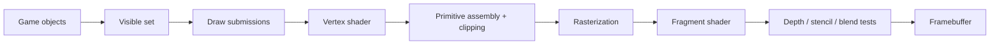
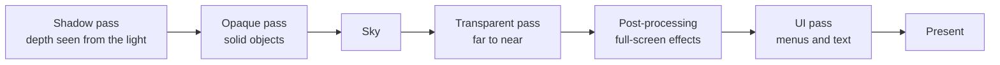
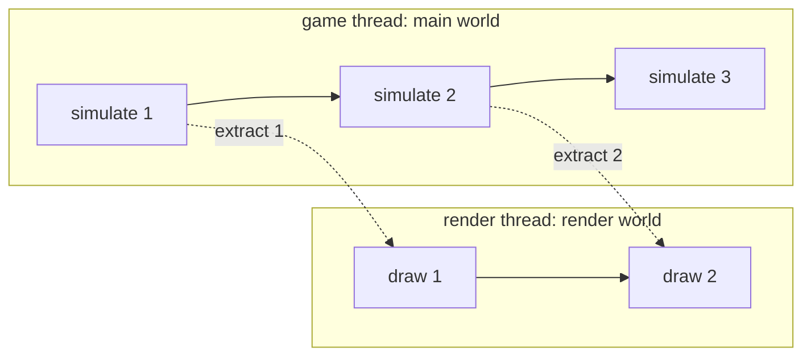

import { Color, Example, Frame, GitHub, Panel, Tab, Tabs, Tooltip } from '../../../../components/kit';
import FormulaBuilder from '../../../../components/FormulaBuilder.astro';
import MarginNote from '../../../../components/kit/MarginNote.astro';

## Use a setting as an anchor

Urban Terror 4.3.4 has console variables that visibly affect rendering. In an offline local session, toggling entity drawing gives us a clean experiment.

<Frame caption="The rendering pipeline: vertices, triangles, rasterization, pixel colour.">
  
</Frame>


<Frame caption="A console command changing how entities are drawn.">


</Frame>

When entities disappear, the game is likely checking a flag before submitting their draw work.

## Follow state through the rendering pipeline

A frame crosses several representations before pixels appear:

```text
game objects -> visible draw list -> vertices and materials -> GPU commands -> fragments -> framebuffer
```

A CPU-side flag can stop an entity before a draw call exists. Graphics state can change how an existing draw is tested. A shader can change the final color. Similar screenshots can therefore come from very different layers.

Find the earliest stage where the output first goes wrong. If no call is submitted, inspect culling or entity selection. If the call exists but pixels disappear, inspect transforms, clipping, depth, and blending. Keeping those stages separate prevents the vague conclusion that “rendering is broken.”



The names differ between graphics APIs, but the responsibilities remain useful:

- the game decides which objects exist and which may be visible;
- a draw submission selects geometry, shader programs, textures, and state;
- a vertex shader transforms each submitted vertex and may calculate values for
  later stages;
- primitive assembly groups vertices into triangles, lines, or points;
- clipping trims or rejects primitives outside the camera's clip volume;
- rasterization finds the pixel-sized **fragments** covered by each primitive;
- a fragment shader computes candidate colors and other outputs;
- depth/stencil tests and blending decide how candidates affect stored pixels.

A fragment is not yet a final pixel. Several triangles may produce fragments for
the same pixel, and tests may reject most of them.

## Geometry is vertices plus an interpretation

A **mesh** is usually a collection of vertices plus enough information to connect
them into primitives. A vertex is a record, not merely a position:

| Attribute | What it commonly represents |
|---|---|
| position | model-space location |
| normal | local surface direction used for lighting |
| texture coordinate | location in a 2D image |
| color | per-vertex tint or data |
| bone indices/weights | how an animation skeleton moves the vertex |

An **index buffer** stores integer vertex references. For example, two triangles
forming a square can share four vertices instead of duplicating six. In an indexed
draw, `count` usually says how many indices to consume—not how many unique vertices,
triangles, or objects exist. With triangle topology and no primitive restart,
`count / 3` is the submitted triangle count, but clipping and degenerate triangles
mean it is still not the number of visible triangles.

## Materials, textures, and light

A mesh says where the surface is. A **material** says how that surface looks: its
base colour, the image wrapped over it, and how it answers light.

The image is a **texture**. Each vertex carries a **texture coordinate** `(u, v)`, a
position inside the image from 0 to 1 on each side, and the rasterizer blends those
coordinates across the triangle so every pixel knows where to look. On a 256 × 256
texture, `(u, v) = (0.25, 0.75)` points at pixel `(0.25 × 256, 0.75 × 256) = (64, 192)`.
Whether `v` counts from the top or the bottom of the image differs between graphics
APIs.

Light is worked out from the **normal**, the direction the surface faces. The
simplest model, **diffuse** lighting, makes a surface brightest when it faces the
light and dark when it faces away. With `N` the unit normal and `L` the unit
direction from the surface toward the light, the brightness is the larger of 0 and
the dot product `N · L` (Lesson 4.7). For `N = (0, 0, 1)` and `L = (0.6, 0, 0.8)`, the
dot product is 0 + 0 + 0.8 = 0.8, so a surface of colour <Color value="rgb(200, 100, 50)" /> is drawn as
`(200 × 0.8, 100 × 0.8, 50 × 0.8)`, which is <Color value="rgb(160, 80, 40)" />. Tilt the surface until the dot
product is 0 or negative and it receives no light from that source.

Realistic engines add to this. **Physically based rendering** (PBR) describes a
material with a few measured-looking properties, such as how rough the surface is
and whether it is metal, usually stored as more textures, and a shader turns them
into the highlights and reflections the eye expects. A **vertex colour** is a tint
stored per vertex and blended across the triangle. A material also states how it
treats transparency: fully opaque, cut out wherever a texture's alpha is low, or
blended.

## Render state is context for interpreting a draw

A draw call does not contain every fact needed to explain its pixels. Its meaning
depends on state already bound to the graphics context:

```text
geometry + topology + transforms + shaders + textures + render state = draw meaning
```

Important state includes face culling, depth comparison, depth writes, stencil
operations, blending, scissor rectangles, color masks, and the current framebuffer.
Changing `depth_test_enabled` is different from changing the depth comparison from
`LESS` to `ALWAYS`, and both are different from leaving the test on while disabling
depth writes.

<MarginNote kind="brief">Depth comparison, depth writes, and enabling the test are separate settings; record which one actually changed.</MarginNote>

<Frame caption="Entities no longer drawn after the command.">


</Frame>

## Search for the flag

Scan for the flag’s current integer value. Toggle it, filter, and repeat. Then set a read breakpoint on a confirmed candidate and render one frame.

<Frame caption="A render flag in the debugger.">


</Frame>

Look for a conditional pattern:

```nasm
cmp dword ptr [render_flag], 0
je skip_entities
call draw_entities
```

Your actual build may use `test` instead of `cmp`, invert the condition, or store the setting in a structure.

## Name the behavior, not just the address

Store the decoded settings in a type whose field names say what each value controls:

```rust
#[derive(Debug)]
struct RenderSettingsSnapshot {
    draw_entities: bool,
    depth_test_enabled: bool,
}

fn decode_bool(raw: u32) -> Result<bool, u32> {
    match raw {
        0 => Ok(false),
        1 => Ok(true),
        unexpected => Err(unexpected),
    }
}
```

Rejecting unexpected values protects you from silently using the wrong address.

## Trace into an entity record

Pause where one entity is prepared for drawing. Compare the pointer across:

- the local player;
- another player;
- a weapon;
- a map object.

<Frame caption="Memory around a possible entity structure.">


</Frame>

Put only confirmed fields into the layout type:

```rust
struct EntityLayout {
    kind: usize,
    position: usize,
    model_id: usize,
    team: usize,
}
```

One field rarely identifies a category by itself. Combine several fields.

## Depth testing in plain English

After geometry is transformed and clipped, it produces candidate screen fragments. Each fragment carries a depth value. The depth test compares that value with the one already stored for the same screen location. When the comparison passes, the fragment may update the color and depth buffers; when it fails, the nearer surface remains.

Depth is therefore not a distance flag stored on one entity. It is a per-fragment comparison performed after projection. If depth testing is disabled or changed to always pass, later fragments can appear on top even when their geometry is behind a wall.

There are two related operations:

1. **depth test:** compare the candidate fragment's stored depth with the current
   depth-buffer value;
2. **depth write:** if the fragment survives, optionally replace the stored value.

Transparent objects often keep the depth test but disable depth writes and render
back-to-front. Turning off the test entirely is not equivalent.

Perspective depth is normally **nonlinear**. More of the depth buffer's numeric
precision is concentrated near the camera. With the traditional mapping, making
the near plane extremely small compared with the far plane wastes precision and
can cause two nearby surfaces to alternate visibility, called *z-fighting*.
Modern engines may use a floating-point reversed-z buffer, where farther values and
the comparison direction are reversed to improve precision. Never hard-code “small
depth means near” until the projection and comparison convention are confirmed.

The depth buffer answers “which submitted fragment wins at this sample?” It does
not answer whether an object is logically visible to gameplay. Collision queries,
portals, fog-of-war systems, and server state may use entirely different data.

<Frame caption="A depth-test experiment in the offline target.">


</Frame>

That visual result shows the depth-test behavior changed; it does **not** prove which objects a call represents. You still need classification tests.

## Transparency and draw order

When a see-through surface is drawn over the pixels already stored, the new colour
and the old one are mixed by the new colour's **alpha**, from 0 (invisible) to 1
(solid):

```text
result = source × alpha + destination × (1 − alpha)
```

A red fragment <Color value="rgb(255, 0, 0)" /> with alpha 0.25 over a blue-ish background
<Color value="rgb(0, 0, 200)" /> gives red `255 × 0.25 + 0 × 0.75 = 63.75`, green `0`, and
blue `0 × 0.25 + 200 × 0.75 = 150`, which rounds to <Color value="rgb(64, 0, 150)" />: the
background shows through, tinted.

Because the mix uses what is already there, order matters. Swap two see-through
layers and the result changes. So engines draw all the solid objects first, with depth
writes on, and then the see-through ones from the farthest to the nearest, with depth
writes off, as described above. Other blend modes combine colors differently: **additive**
blending simply adds the colours, which suits glows and sparks.

Two-dimensional games rely on exactly this. A sprite is a picture with transparent
edges, and sprites are drawn in layer order, back to front.

## Skipping what cannot be seen

The cheapest triangle is one that is never drawn, so engines throw work away early.

- **Frustum culling** skips objects outside the camera's view volume (the frustum from
  Lesson 7.1). Each object gets a bounding sphere (Lesson 4.7), and the sphere is tested
  against the volume's edges. In a flat example, put the camera at the origin looking
  along `+x` with a 90° view, so the visible wedge is where `|y| ≤ x`. An object of
  radius 1 centred at `(10, 12)` is `(12 − 10) ÷ √2 = 1.41` beyond the upper edge, which
  is more than its radius, so it is skipped entirely. One centred at `(10, 10.5)` is only
  `0.5 ÷ √2 = 0.35` beyond it, less than its radius, so it still crosses the edge and is
  drawn. A debug view that draws the frustum and highlights the skipped objects shows
  which ones were culled.
- **Back-face culling** skips triangles that face away from the camera. A triangle with
  normal `(0, 0, 1)` seen from a camera in the direction `(0, 0, −1)` has a dot product
  of −1, which is negative, so its back is showing and it is not drawn.
- **Occlusion culling** skips objects hidden behind others.
- **Levels of detail** swap a model for a cheaper one as it gets far away, and a
  **visibility range** hides an object past a set distance.

All of this happens before any draw call exists, which is why the symptom "an object is
absent from the visible list" in the table below points at the game, not the GPU.

## Who decides whether an object is drawn

Culling is the last of several decisions. Before it, the engine has already asked three
questions about each object:

1. **Its own setting.** An object is visible, hidden, or *inherited*, which means it
   follows its parent.
2. **The result after its parents.** The engine combines each object's setting with its
   parent's, from the root down. An inherited object under a hidden parent is hidden, so
   hiding the tank hides its turret and its barrel. This result is another value derived
   once per frame from the settings, like the world transform in Lesson 7.1.
3. **The view.** For each camera, the object must lie inside the camera's view volume
   (the culling above) and share at least one **render layer** with it.

A render layer is one bit of a number. Every object and every camera carries a mask,
a number whose set bits name the layers it belongs to or can see, and a camera draws an
object only if the two masks share a set bit. The test is a **bitwise AND**, which
compares two numbers bit by bit and keeps a bit only where both have it: `011` AND `101`
is `001`, so 3 AND 5 is 1. A result that is not zero means the masks share a layer. Take
three layers: the world is bit 0 (value 1), the first-person weapon is bit 1 (value 2),
and the minimap icon is bit 2 (value 4).

<MarginNote kind="alternative">Imagine overlapping guest lists: an object appears for a camera when at least one of its layer memberships is on that camera’s accepted list.</MarginNote>

<Example title="Which camera draws which object">

The main camera's mask is 1 + 2 = 3, which is `011` in binary, and the minimap camera's
mask is 1 + 4 = 5, which is `101`.

| Object | Mask | Main camera: 3 AND mask | Minimap camera: 5 AND mask |
|---|---|---|---|
| tree | 1 (`001`) | 1, drawn | 1, drawn |
| weapon | 2 (`010`) | 2, drawn | 0, not drawn |
| icon | 4 (`100`) | 0, not drawn | 4, drawn |

</Example>

The weapon is drawn by the main camera only and the icon by the minimap only, although
all three objects live in the same world. An object that fails one of these three
questions never reaches a draw call, so it is absent from the visible list, which is
the first row of the table at the end of this lesson.

<FormulaBuilder formula="layer-mask" label="Explore the render-layer mask test" />

When an object that should appear does not, the cause is usually one of these, and each
leaves a different trace:

<Panel title="An object that should appear does not">

| Cause | What it looks like |
|---|---|
| Its own setting, or a parent's, is hidden | gone from every camera at every distance |
| It shares no render layer with the camera | drawn by one camera and absent from another |
| It is behind the camera or past the camera's far limit | appears when the camera turns round or moves closer; an object 1,500 units away is never drawn by a camera whose far limit is 1,000 |
| Its scale is 0 on every axis | everything collapses to one point, which has no area to draw; a scale of 0 on one axis flattens it into a sheet that vanishes when seen edge-on |
| Its triangles are <Tooltip tip="A triangle lists its three corners in an order, clockwise or anticlockwise as seen from one side. The renderer treats one direction, usually anticlockwise, as the front, so a mesh whose corners are listed the other way has its outside counted as the back.">wound the wrong way</Tooltip> for back-face culling | the outside is invisible and the inside shows |
| A lit material has no light | drawn, but dark or black, so against a dark background it looks absent |
| In 2D, its depth lies outside the camera's depth range | a camera that sees depths from −1,000 to 0 never draws a sprite at depth 5 |

</Panel>

## A frame is several passes

Most frames are not drawn in one sweep. The engine renders the scene several times
for different purposes, in order, and each sweep is a **pass**. A pass starts by
clearing its target to a **clear colour**, and clearing depth to its farthest value, so
the last frame's picture is not left behind:



- **Shadows.** The shadow pass draws the scene's depth as seen from the light into a
  texture called a **shadow map**. In the main pass, each pixel's position is converted
  to the light's view and compared with the stored depth: if something nearer was
  stored, the pixel is in shadow. A surface point 7.50 away from the light would be
  compared with its own stored depth, 7.50, and rounding could make it shadow itself,
  so the test uses a small **bias**: shadowed only if the stored depth is less than
  7.50 − 0.05 = 7.45. It is not, so the point is lit.
- **Sky and fog.** A **skybox** is a cube texture drawn so that it always looks
  infinitely far away. **Fog** blends a surface toward a haze colour with distance. With
  the fog starting at 10 and ending at 50, a surface 30 away has the factor
  `(50 − 30) ÷ (50 − 10) = 0.5`, so a surface of <Color value="rgb(200, 100, 50)" /> in haze
  <Color value="rgb(150, 150, 150)" /> is drawn as <Color value="rgb(175, 125, 100)" />.
- **Post-processing.** The finished picture is stored as a texture and a full-screen
  rectangle is drawn with a shader that reads it. **Bloom** blurs the brightest parts and
  adds them back, and **colour grading** remaps colours. **Tone mapping** compresses
  **HDR** (high dynamic range) values, where lighting can produce colours above 1.0, into
  the 0 to 1 range a display can show. A simple tone-mapping formula, `c ÷ (1 + c)`, turns a value of
  4.0 into 0.8, a value of 1.0 into 0.5, and a value of 0.5 into 0.33, so bright values
  are squeezed more than dim ones.
- **Render to texture.** A pass can draw into an off-screen texture, not the screen.
  The texture can then be used as a mirror, a security-camera monitor, a minimap, or a
  screen shown inside the 3D world.
- **More than one camera.** Each camera draws into its own rectangle, or its own
  texture. Split-screen is two cameras drawing into the left and right halves of one
  window.
- **Forward and deferred.** A forward renderer lights each object as it draws it. A
  **deferred** renderer first draws position, normal, and colour for every pixel into
  extra textures, then lights the pixels in one later pass, which makes many lights
  affordable but handles see-through surfaces less easily.

## Wider colours and smoother edges

### HDR needs wider pixels

An ordinary picture keeps each colour channel in 8 bits, which is 256 levels from 0 to
1, so nothing can be brighter than 1.0. Lighting can produce more. Say a sunlit wall
comes out at 1.4 and a lamp at 12.0. In an 8-bit picture both are cut off at 1.0 and
look equally bright. **HDR** rendering draws into a texture whose channels are wider
and floating-point, commonly 16 bits each, so the difference survives until the
tone-mapping step at the end compresses the result into the 0 to 1 range of the
display. With the `c ÷ (1 + c)` tone-mapping formula above, the wall becomes 1.4 ÷ 2.4 = 0.58 and
the lamp 12 ÷ 13 = 0.92: still different, and both displayable.

The wider pixels cost memory. A 1920 × 1080 picture has 1920 × 1080 = 2,073,600 pixels.
With 4 channels of 1 byte it takes 2,073,600 × 4 = 8,294,400 bytes, about 8.3 MB. With
4 channels of 2 bytes it takes 2,073,600 × 8 = 16,588,800 bytes, about 16.6 MB.

HDR is also what makes bloom mean something. Bloom blurs only the part of each pixel
above a threshold, here 1.0. The wall has 1.4 − 1.0 = 0.4 above it and the lamp has
12.0 − 1.0 = 11.0, so the lamp glows 11.0 ÷ 0.4 = 27.5 times as strongly. In the 8-bit
picture both had 0 above the threshold, and nothing could glow.

### Smoothing jagged edges

The edge of a diagonal shape comes out as stair-steps, because each pixel is either
inside the shape or outside it. **Anti-aliasing** hides the steps. Three common methods
work in different places:

<Tabs sync="antialiasing">
<Tab label="MSAA">

**Multisample anti-aliasing** tests coverage at several points inside each pixel. With
4 sample points per pixel, written 4×, a triangle that covers 3 of the 4 points of an
edge pixel contributes 3 ÷ 4 = 0.75 of its colour. Over a blue background
<Color value="rgb(0, 0, 200)" />, a red triangle <Color value="rgb(255, 0, 0)" /> covering
3 of 4 points gives `0.75 × (255, 0, 0) + 0.25 × (0, 0, 200) = (191.25, 0, 50)`, drawn as
<Color value="rgb(191, 0, 50)" />.

The shader still runs once per pixel, so the extra cost is memory: colour and depth are
stored for every sample. The colour samples alone take 2,073,600 pixels × 4 samples ×
4 bytes = 33,177,600 bytes, about 33.2 MB, which is four times the 8.3 MB of one sample
per pixel. MSAA smooths the edges of triangles but not sharp patterns that a shader or
a texture draws inside a triangle.

</Tab>
<Tab label="FXAA">

**Fast approximate anti-aliasing** works on the finished picture. It looks for pixels
where the brightness changes sharply from one neighbour to the next and blurs across
those edges. It stores no extra samples and costs one full-screen pass over the
2,073,600 pixels, so it is cheap, and it also smooths edges drawn by shaders and
textures. Its price is that it blurs text and fine texture detail too, because it cannot
tell the edge of a shape from a sharp line in a picture.

</Tab>
<Tab label="TAA">

**Temporal anti-aliasing** shifts the camera by a fraction of a pixel on every frame,
called **jitter**, and blends each pixel with the same pixel's colour from earlier
frames. With 8 different jitter positions, a pixel has been sampled at 8 places after
8 frames, for the cost of keeping one extra copy of the picture. To find where a pixel
was last frame, the engine needs a **motion vector** for it. Where the vectors are wrong,
such as behind a transparent surface, old colours linger and leave a ghost trail behind
a moving object.

</Tab>
</Tabs>

## The renderer works from its own copy

Many engines keep two worlds. The **main world** holds the game: positions, health, and
what is hidden. The **render world** holds what drawing needs: meshes, materials,
lights, and the final transforms. Once per frame an **extract** step copies the data
that drawing needs from the first into the second. The renderer then works only from
its copy, so the game can start simulating the next frame while the renderer is still
drawing this one. That overlap is called **pipelined rendering**.



Suppose simulating a frame takes 6 ms and drawing it takes 8 ms. The extract copy takes
a little time of its own, which the figures ignore:

| Arrangement | Time per frame | Frames per second |
|---|---|---|
| one stage after the other | 6 + 8 = 14 ms | 1000 ÷ 14 = 71 |
| overlapped | the slower stage, 8 ms | 1000 ÷ 8 = 125 |

Overlapping has a price. What is drawn comes from the state copied at extract, so it is
one frame behind the simulation that is already working on the next one.

For memory work this means a game's positions can exist twice, once in each world. The
render copy is overwritten from the main copy at every extract, so editing it changes
the picture only until the next extract, while editing the main copy changes state used by the simulation and future drawing. A hook on a draw call (Lesson 7.10) sees the render copy, and
the movement and damage calculations read the main one. Lesson 7.12 shows how to avoid mixing values from
different frames.

## Two-dimensional rendering uses the same pipeline

A 2D game does not need a different machine. A **sprite** is a quad, two triangles
made from four vertices, with a texture on it, drawn by an orthographic camera
(Lesson 7.1) with alpha blending and layers (above).

Many small pictures are packed into one large image, a **sprite sheet** or **texture
atlas**, so that one texture serves many sprites. Picking a frame means choosing the
texture coordinates for its rectangle. Take a 256 × 256 sheet of 4 × 4 frames, each
64 × 64 pixels. Frame number 5, counting from 0, is in column `5 mod 4 = 1` and row
`5 ÷ 4 = 1` (dropping the remainder), so it covers pixels x from 64 to 128 and y from 64
to 128. As texture coordinates that is `u` from 64 ÷ 256 = 0.25 to 0.5 and `v` from
0.25 to 0.5. Animation is choosing the frame from the clock: at 8 frames per second,
the frame number is the whole part of `time × 8`, wrapped around the number of frames.
Flipping a sprite swaps its left and right `u` values.

Scaling a sprite into a box while keeping its shape uses the smaller of the two
ratios. A 64 × 32 sprite fitted into a 100 × 100 box has ratios 100 ÷ 64 = 1.5625 and
100 ÷ 32 = 3.125, so it is scaled by 1.5625 and ends up 100 × 50.

A **tilemap** is a grid of tile numbers. Drawing it means turning each number into a
quad that points at the right part of the atlas. A screen of 20 × 15 tiles is 300
quads, which is 600 triangles, and the engine can send all of them to the GPU as one
draw call from one atlas instead of 300 separate calls. This is the same grid Lesson
4.5 reads as game state, now seen as pictures.

Pixel-art games often draw the whole scene into a small texture, such as 320 × 180,
and then enlarge it by a whole number, 4, to 1280 × 720. Whole-number scaling keeps
every pixel a crisp square, which is called pixel snapping.

## Keep experiments frame-local

Graphics state is shared. If you change a setting for one draw:

1. save the previous state;
2. apply the temporary state;
3. perform the one draw;
4. restore the previous state.

Forgetting restoration can break the entire frame, menus, or later effects.

<MarginNote kind="narration">A forgotten debug setting can affect the next draw, so a broken menu may reveal a state leak from an earlier world-object experiment.</MarginNote>

A restore guard returns the previous graphics state when its owner leaves scope:

```rust
struct RestoreOnDrop<F: FnOnce()>(Option<F>);

impl<F: FnOnce()> Drop for RestoreOnDrop<F> {
    fn drop(&mut self) {
        if let Some(restore) = self.0.take() {
            restore();
        }
    }
}
```

The actual graphics calls may need FFI, but the “restore no matter how this scope exits” pattern stays in ordinary safe code.

Older OpenGL behaves like a state machine: many calls change context state that later draw calls inherit. Treat each temporary change as a scoped transaction. Capture the exact old value, apply the experiment, perform the intended draw, and restore even on early return. “Set it back to the usual default” is weaker than restoring the value that was actually present.

Also restore state on the same thread and context where it was captured. OpenGL
context state belongs to a current context; a worker thread cannot safely repair
render-thread state merely because it has the same function pointers.

## Separate visibility failures by stage

Use the earliest observable difference to narrow the cause:

<Panel title="Visibility failures by stage">

| Symptom | Likely stage |
|---|---|
| object absent from visible list | game filtering or CPU culling |
| draw call absent | submission/batching path |
| vertices leave clip volume | transform, camera, or clipping |
| fragments exist but fail depth | depth state or existing occluder |
| fragments pass but write no color | color mask, shader discard, stencil |
| color appears but looks wrong | shader inputs, texture, lighting, blend, color space |

</Panel>

This table is a diagnostic order, not proof. Some engines merge or reorder stages,
and GPU-driven pipelines can construct visible lists on the GPU.

## Build the Urban Terror 4.3.4 memory wallhack

The flag trace and frame-local state model above can be understood with the
debugger alone. This pinned in-process implementation applies the verified
detour and DLL lifecycle from [Lesson 6.4](/pages/8/03/) to the rendering
boundary. Keep those ownership and restoration steps intact while following
the exact build-specific addresses below.

The `r_drawentities` trace in this exact build leads through the call at `0x0052F71F`. Inside the entity loop, `ebx` holds the current render entity at `0x0052D2FD`. The field at `[ebx+4]` cycles through values such as `0x0D`, `0x40`, `0x82`, and `0x83`.

Hook this exact point:

```text
hook:    0x0052_D2FD
resume:  0x0052_D303
change:  write 0x0D to dword ptr [ebx+4]
replay:  mov dword ptr [0x0102_AE98], ebx
```

A 32-bit detour cave has the same shape as the Wesnoth cave:

```rust
#[cfg(target_arch = "x86")]
#[unsafe(naked)]
unsafe extern "C" fn render_flag_cave() {
    core::arch::naked_asm!(
        "pushfd",
        "pushad",
        "mov dword ptr [ebx + 4], 0x0D",
        "popad",
        "popfd",
        "mov dword ptr [0x0102_AE98], ebx",
        "jmp {resume}",
        resume = const 0x0052_D303,
    );
}
```

Install a six-byte verified detour at `0x0052D2FD`, enter a local game, enable `cg_thirdperson`, and add bots. The local player and bots should render through walls exactly as in the screenshot. Values `0x83` and `0x40` should not create the same effect; that comparison is how you prove `0x0D` is the relevant render state.

Restore the original six hook bytes when the feature is disabled. This memory-based wallhack is intentionally kept as a full target-specific lab before the more general OpenGL approach.

The DLL already contains the complete verified implementation. Build and inject it into `Quake3-UrT.exe`, enter a local bot match, and press **F1** to toggle this memory wallhook. Press **End** to stop and restore all six bytes. See [`install_urban_terror_memory_wallhook`](/windows-labs/src/windows_impl/game_hooks.rs) and the Urban Terror hotkey worker in [`dll.rs`](/windows-labs/src/windows_impl/dll.rs).

<GitHub path="windows-labs/src/windows_impl/game_hooks.rs" />

<GitHub path="windows-labs/src/windows_impl/dll.rs" />

## What the experiment proves

The comparison isolates how one CPU-side flag changes GPU behavior. It does not prove that every build uses the same flag, address, or rendering path, so keep the executable fingerprint and original bytes beside the result.
