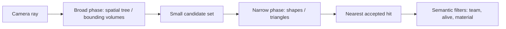

import { Frame, GitHub, Panel } from '../../../../components/kit';

import LessonVideo from '../../../../components/LessonVideo.astro';
import FormulaBuilder from '../../../../components/FormulaBuilder.astro';
import MarginNote from '../../../../components/kit/MarginNote.astro';

## Use an existing UI clue

Use **AssaultCube 1.2.0.2**. Enable nametags, start a single-player deathmatch with eight bots, open the console with `~`, and run `idlebots 1`. AssaultCube displays a name when the crosshair passes over a player, which means the game already computes a target-under-crosshair result.

<Frame caption="AssaultCube showing a target's name.">


</Frame>

Searching for the visible name and breaking on reads can lead from text back to the target-selection logic.

<Frame caption="Searching memory for a player's name.">


</Frame>

## A crosshair is a ray through the camera

For a centered crosshair with no weapon offset, the geometric query begins at the
camera position and travels along the camera's forward direction. A **ray** is:

```text
point(t) = origin + t × direction, where t ≥ 0
```

If `direction` has length one, `t` is distance in world units. If it is not
normalized, `t` is merely a scale parameter. Keep that contract consistent when
comparing hit distances.

<FormulaBuilder formula="ray-point" label="Explore a point along the camera ray" />

```rust
#[derive(Clone, Copy, Debug)]
struct Ray {
    origin: Vec3,
    direction: Vec3, // invariant: finite and normalized
}

impl Ray {
    fn point_at(self, distance: f32) -> Vec3 {
        Vec3 {
            x: self.origin.x + self.direction.x * distance,
            y: self.origin.y + self.direction.y * distance,
            z: self.origin.z + self.direction.z * distance,
        }
    }
}
```

Crosshairs away from screen center require **unprojection**: transform a near and
far screen point back through the inverse view-projection matrix, divide each by
its homogeneous `w`, then normalize the direction between them. A rendered weapon
muzzle may not be the ray origin; many games aim from the camera but spawn a
projectile from the weapon, then reconcile the two paths.

## Ray casting is a nearest-valid-hit problem

A collision system rarely tests every triangle directly. It commonly uses:



The broad phase quickly rejects distant regions. The narrow phase computes more
exact intersections. The query then chooses the smallest nonnegative hit parameter
and filters hits by collision masks and excluded entities.

A sphere intersection illustrates the math. For sphere center `c`, radius `r`,
ray origin `o`, and normalized direction `d`, substitute `o + td` into the sphere
equation:

```text
m = o - c
b = dot(m, d)
c_term = dot(m, m) - r²
discriminant = b² - c_term
```

Each symbol has a plain-English meaning worth holding on to. `m` is the vector
from the sphere's centre to the ray's origin. `b` is the **negative** of how
far along the normalized ray the centre projects: the closest point is at
`t = -b` when that value is nonnegative.
`c_term` compares the origin's distance from the centre against the radius, so
it is negative exactly when the ray starts inside the sphere.

The discriminant then answers one geometric question: how close does the ray
pass to the centre, compared with the radius?

```text
discriminant < 0    the ray passes wide of the sphere   -> no hit
discriminant = 0    the ray grazes the surface          -> one touch point
discriminant > 0    the ray passes through it           -> enters and exits
```

That is why two roots appear when it is positive — one where the ray enters and
one where it leaves. The nearer ray hit
is `t = -b - sqrt(discriminant)`, provided `t ≥ 0`. If the origin is inside the
sphere, the nearer root may be negative and the farther root must be considered.
Production engines use several shape types and acceleration structures, but this
same “generate candidates, reject invalid roots, choose nearest” reasoning applies.

## Picking: the same ray, from the cursor

A mouse cursor is a crosshair that can move. **Picking** is the question "which object
is under the cursor?", and games use it to select units, press buttons, drag items, and
click on the world. It works like the centred crosshair, with one extra step to find the
ray.

<MarginNote kind="alternative">A cursor is a movable crosshair: first turn its screen position into a camera ray, then apply the same nearest-valid-hit reasoning.</MarginNote>

**Step 1: pixel to normalized coordinates.** This reverses the conversion at the end of
Lesson 7.1. On an 800 × 600 window, a cursor at pixel `(600, 150)` has

```text
ndc_x = 2 × 600 ÷ 800 − 1 = 0.5
ndc_y = 1 − 2 × 150 ÷ 600 = 0.5
```

**Step 2: build the ray.** For a perspective camera at the origin looking along `+z`, with
a 90° vertical field of view (`tan 45° = 1`) and aspect 800 ÷ 600 = 1.3333, the ray
leaves the camera in the direction

```text
x = 0.5 × 1.3333 × 1 = 0.6667
y = 0.5 × 1          = 0.5
z = 1
length = √(0.6667² + 0.5² + 1²) = √1.6944 = 1.3017
normalized = (0.5122, 0.3841, 0.7682)
```

A camera that is turned adds one more step, rotating that direction by the camera's own
axes (Lesson 7.1). An **orthographic** camera is simpler: every ray points straight
forward, and the ray's origin is the world point under the cursor, such as the `(5, 3)`
that Lesson 7.1 found for the pixel `(600, 180)`.

**Step 3: test the candidates.** The broad phase keeps the objects whose bounding shapes
the ray might cross, and each is tested, nearest hit wins. For a box that lines up with
the axes the test works one axis at a time. In a flat example, a ray starts at `(0, 0)`
and heads in the direction `(1, 0.5)`, and a box spans x from 4 to 6 and y from 1.5 to 3:

```text
x range:  t from 4 ÷ 1   = 4 to 6 ÷ 1   = 6
y range:  t from 1.5 ÷ 0.5 = 3 to 3 ÷ 0.5 = 6
enters at the later start  = max(4, 3) = 4
leaves at the earlier end  = min(6, 6) = 6
4 ≤ 6, so the ray hits the box, first at t = 4, the point (4, 2)
```

Move the box up so that y spans 3.5 to 5 and the y range becomes t from 7 to 10, so the
ray would have to enter at 7 but has already left at `min(6, 10) = 6`. Entering after
leaving means a miss.

Two other methods are common:

- **Colour picking.** Each object is drawn into an off-screen texture in its own flat
  colour that encodes its number. Object 300 is `300 = 0 × 65536 + 1 × 256 + 44`, so its
  colour is `(0, 1, 44)`. Reading the one pixel under the cursor and decoding the
  colour gives the object, already corrected for anything in front of it. It costs an
  extra pass and a read-back from the GPU.
- **Sprite picking.** In 2D, convert the cursor to a world point as in Lesson 7.1 and
  test whether it falls inside each sprite's rectangle, taking the topmost layer.

Dragging builds on the same query. When the button goes down, the game picks the object.
While the mouse moves, it casts the ray again each frame and moves the object to where the
ray meets a floor or a plane. When the button comes up, it drops the object. Many engines
also have a debug view that draws the ray and the thing it hit, which is the quickest way
to see why a click picked the wrong object.

Lesson 7.9 runs the opposite way, from a world point to a pixel. The "target under the
crosshair" value this lesson hunts for is the result of this computation.

## Rendering visibility and collision visibility differ

The renderer may omit a distant object, draw a transparent surface, or use a
different level-of-detail mesh. A gameplay ray can still collide with its collision
shape. The reverse can also occur: foliage may be visible but configured not to
block shots.

<MarginNote kind="narration">Visible leaves can fail to block a shot, while invisible collision geometry can stop it. Rendering and collision answer different questions.</MarginNote>

| Question | Likely data source |
|---|---|
| what pixel is visible? | depth/render buffers |
| what geometry blocks a shot? | physics/collision query |
| which entity gets a nametag? | UI selection result |
| which entity receives damage? | weapon/gameplay logic |

These results may agree most of the time without being the same variable.

## Collect positive and negative cases

Compare the value the query returns while aiming at:

- empty space;
- a wall;
- yourself, if possible;
- a teammate;
- an opponent;
- a dead player.

One non-zero value does not automatically mean “valid opponent.”

Also vary distance, partial cover, transparent surfaces, camera mode, and weapon.
The purpose is to learn the query's contract: maximum range, ignored object types,
collision mask, and whether it returns the nearest hit or the first accepted entity.

## Model the crosshair result

The crosshair may point at empty space, a teammate, or an opponent. A single
boolean such as `enemy_under_cursor` would hide which step failed. Record
the selected entity, its relationship to the player, and the two properties
that matter for a visible, living target:

```rust
#[derive(Clone, Copy, Debug, Eq, PartialEq)]
struct EntityId(u32);

#[derive(Clone, Copy, Debug, Eq, PartialEq)]
enum Relation {
    SelfPlayer,
    Teammate,
    Opponent,
    Unknown,
}

#[derive(Debug)]
struct CrosshairObservation {
    target: Option<EntityId>,
    relation: Relation,
    alive: bool,
    visible: bool,
}
```

Use `Option<EntityId>` because “nothing selected” is a normal state, not an error.

<MarginNote kind="brief">No selected entity is an ordinary result. Keep it distinct from a failed read or an invalid observation.</MarginNote>

## Decide without acting

Once the observation has been named, the decision can be a small pure
function. For an opponent that is both alive and visible, it returns a
candidate entity ID; for every other combination it returns `Hold`. No
input is sent to the game in this step:

```rust
#[derive(Debug, Eq, PartialEq)]
enum TriggerIntent {
    Hold,
    Candidate(EntityId),
}

fn decide_trigger(observation: &CrosshairObservation) -> TriggerIntent {
    match (
        observation.target,
        observation.relation,
        observation.alive,
        observation.visible,
    ) {
        (Some(id), Relation::Opponent, true, true) => TriggerIntent::Candidate(id),
        _ => TriggerIntent::Hold,
    }
}
```

This function does not press a button. It turns a `CrosshairObservation` into a testable intent. Keeping action separate makes accidental behavior less likely.

The `visible` field needs an exact definition. It might mean “the game's existing
crosshair query selected this entity,” “a collision ray reached its hitbox,” or
“its projected point is inside the viewport.” Name the field after the check that
actually produced it; those definitions are not interchangeable.

## Reproduce the actual AssaultCube hook

The ray, collision, and target-observation model above can be tested without
injection. The pinned hook below applies the DLL lifecycle from
[Lesson 6.4](/pages/8/03/) and the Windows input boundary from
[Lesson 6.7](/pages/8/06/). Follow the target-specific evidence before
writing to its memory.

Search Cheat Engine for one idle bot's name. For each remaining text address, use **Find out what accesses this address**, look away, then look back at the bot. The useful address is accessed heavily only while the nametag is visible.

In x64dbg, the relevant 1.2.0.2 code is:

```text
0x0040_AD9D  call 0x0046_07C0   ; returns target-under-crosshair in eax
0x0040_ADA2  ...                ; resume here after the five-byte call
0x0040_ADA6  conditional jump used by the nametag path
```

When the crosshair is over a player, `eax`/`edi` is non-zero. Looking at empty space produces zero. Replace the five-byte call at `0x0040AD9D` with a verified detour, execute the original call inside the cave, then publish the result to a typed handler:

```rust
use std::sync::atomic::{AtomicBool, Ordering};

static TARGET_UNDER_CROSSHAIR: AtomicBool = AtomicBool::new(false);

extern "C" fn record_target(value: u32) {
    TARGET_UNDER_CROSSHAIR.store(value != 0, Ordering::Release);
}

#[cfg(target_arch = "x86")]
#[unsafe(naked)]
unsafe extern "C" fn trigger_cave() {
    core::arch::naked_asm!(
        "call {original}",
        "pushfd",
        "pushad",
        "push eax",
        "call {record}",
        "add esp, 4",
        "popad",
        "popfd",
        "jmp {resume}",
        original = const 0x0046_07C0,
        record = sym record_target,
        resume = const 0x0040_ADA2,
    );
}
```

The worker thread turns only state transitions into mouse events: send `MOUSEEVENTF_LEFTDOWN` when the atomic changes from false to true and `MOUSEEVENTF_LEFTUP` when it changes back. With the DLL loaded in the offline bot match, moving the crosshair onto a bot should fire; moving away should release the button.

Here is the complete `windows`-crate input boundary used by that worker:

```rust
use std::mem::size_of;
use anyhow::Result;
use windows::Win32::UI::Input::KeyboardAndMouse::{
    INPUT, INPUT_0, INPUT_MOUSE,
    MOUSEEVENTF_LEFTDOWN, MOUSEEVENTF_LEFTUP, MOUSEINPUT,
    SendInput,
};

fn send_left_mouse(pressed: bool) -> Result<()> {
    let flags = if pressed {
        MOUSEEVENTF_LEFTDOWN
    } else {
        MOUSEEVENTF_LEFTUP
    };

    let input = INPUT {
        r#type: INPUT_MOUSE,
        Anonymous: INPUT_0 {
            mi: MOUSEINPUT {
                dx: 0,
                dy: 0,
                mouseData: 0,
                dwFlags: flags,
                time: 0,
                dwExtraInfo: 0,
            },
        },
    };

    let structure_size = i32::try_from(size_of::<INPUT>())?;
    // SAFETY: `input` is fully initialized and the size matches this INPUT type.
    let sent = unsafe { SendInput(&[input], structure_size) };
    anyhow::ensure!(sent == 1, "SendInput sent {sent} of 1 event");
    Ok(())
}
```

The actual worker remembers whether it previously pressed the button:

```rust
let mut mouse_down = false;

while !stop.load(Ordering::Acquire) {
    let wants_mouse_down = hook_is_enabled
        && TARGET_UNDER_CROSSHAIR.load(Ordering::Acquire);

    if wants_mouse_down != mouse_down {
        send_left_mouse(wants_mouse_down)?;
        mouse_down = wants_mouse_down;
    }

    std::thread::sleep(std::time::Duration::from_millis(8));
}

if mouse_down {
    send_left_mouse(false)?;
}
```

This comparison is **edge detection**. Holding a target does not send thousands
of repeated down events; only a false-to-true or true-to-false change produces
input. The build-checked cave, original call bytes, detour installer, input
function, and DLL worker are in
[`game_hooks.rs`](/windows-labs/src/windows_impl/game_hooks.rs) and
[`dll.rs`](/windows-labs/src/windows_impl/dll.rs).

<GitHub path="windows-labs/src/windows_impl/game_hooks.rs" />

<GitHub path="windows-labs/src/windows_impl/dll.rs" />

Always send the final mouse-up event when disabling or unloading the feature. Otherwise Windows can keep the button logically held down.

<LessonVideo
  title="Crosshair-triggered firing in AssaultCube"
  src="/assets/images/5/5/cube.mp4"
  poster="/assets/images/5/5/cube1.png"
  duration="4 seconds"
  caption="The original trigger demonstration connects a target under the crosshair to firing. Watch when the target enters the crosshair; the implementation above turns changes in that result into mouse-down and mouse-up edges."
/>

## Add debounce

A target result may flicker for a frame. Require repeated agreement:

```rust
struct StableTarget {
    last: Option<EntityId>,
    matching_frames: u8,
}

impl StableTarget {
    fn observe(&mut self, current: Option<EntityId>) -> bool {
        if current.is_some() && current == self.last {
            self.matching_frames = self.matching_frames.saturating_add(1);
        } else {
            self.last = current;
            self.matching_frames = u8::from(current.is_some());
        }
        self.matching_frames >= 3
    }
}
```

## Verify the source

The name-rendering path may use a cached or display-only target. Confirm it updates at the expected time and matches the game’s own hit logic.

<Frame caption="Code associated with the name display.">


</Frame>

Trace the value’s producer, not only its final display. Reusing an internal result is more reliable than recreating a ray test from incomplete data.

When tracing the producer, identify:

- where the ray origin and direction come from;
- the maximum query distance;
- collision layers or masks;
- ignored entities, especially the local player;
- whether the result is a pointer, index, handle, or cached UI record;
- when during the frame the result becomes valid;
- whether a later gameplay check can reject the UI selection.

## Failure patterns reveal the wrong assumption

<Panel title="Failure patterns and what they suggest">

| Symptom | Check first |
|---|---|
| target appears selected through thin walls | collision mask or stale cached result |
| selection is offset while moving | camera snapshot timing |
| center works but edge crosshair does not | missing screen unprojection |
| nearest target is skipped | ignored layers, dead state, or hitbox mismatch |
| result points to a reused entity | handle generation/lifetime |
| flicker at silhouette edges | ray precision, animation, or frame-to-frame pose changes |

</Panel>

## Scope

The implementation is tied to the offline bot-match state model. A multiplayer server may own hit and firing decisions, so a crosshair result read from the local client does not decide what the server accepts.

The lasting skill is finding an existing semantic result—“the object under the crosshair”—and representing its normal, missing, and invalid states cleanly.
