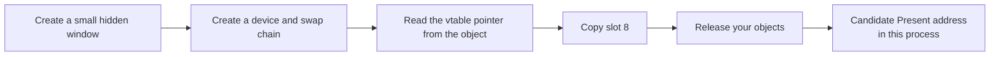
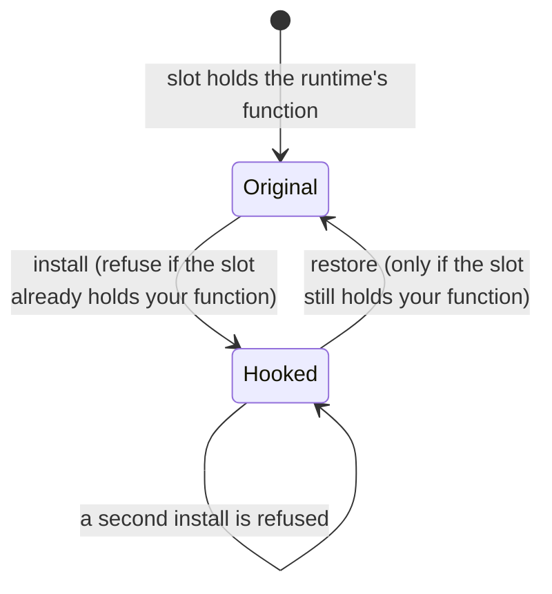

import MemoryStrip from '../../../../components/MemoryStrip.astro';

## The OpenGL method does not transfer

Lesson 7.3 found `glDrawElements` by its exported name, then detoured an
instruction inside it. OpenGL is a C API: `opengl32.dll` exports that
function, so `GetProcAddress` can hand you its entry address. Lesson 6.5
used the import table as a different redirection point for named functions.

An **export** is a function a DLL makes findable by name. Ask
`GetProcAddress` for `Present` in `d3d11.dll`, or inspect that DLL's export
list: the method is not there. Neither are `DrawIndexed` and `Draw`. The
public names are mostly creators such as `D3D11CreateDevice`, not the method
that runs once per frame. Lesson 5.3 showed where a PE file stores its
export list; this lookup now uses that file-format detail.

This is not obfuscation. Direct3D is built on **COM**, the Component Object
Model — Microsoft's convention for handing out objects whose methods are reached
through a table of function pointers rather than by name. COM does not expose
methods as exports. It exposes objects.

## A COM interface stores a table of methods

A C++ object may begin with a pointer to a table of function addresses,
called a **vtable**. A COM interface pointer uses that arrangement as a
published ABI contract, rather than leaving it for us to infer from
disassembly. Lesson 3.4 showed the same memory shape in a game object:

Picture a numbered control panel. Button 8 on an `IDXGISwapChain` is labeled
`Present` by the interface contract, but the panel does not contain a universal
street address for the code behind it. One object supplies a vtable pointer;
slot 8 in that table supplies the function pointer for this implementation.
The panel picture helps with the stable *number*. The two real memory reads
below are what locate the code in this process:

```text
swap_chain          ->  0x0000_01F4_8A20_0000   the object
read [swap_chain]   ->  0x0000_7FFA_1C30_5000   its vtable
vtable + 8 * 8      ->  0x0000_7FFA_1C30_5040   the slot for method 8
read that slot      ->  0x0000_7FFA_1C28_9A10   the function that runs
```

Two lookups, the same shape as the virtual call you traced in Chapter 3. The
difference is that here the layout is a contract. Microsoft cannot reorder the
methods of a published interface without breaking every compiled program that
uses it, which is what makes a vtable index a usable, stable fact.

Each slot is one pointer wide: eight bytes in a 64-bit process, four in a
32-bit one. Get that wrong and every index lands halfway between two entries.

## Derive the index; do not memorize it

You will find lists of "magic" Direct3D vtable indices online. Take the number
as a hint and derive it yourself, because the derivation takes a minute and
tells you immediately when a list is talking about a different interface.

The rule is that a vtable begins with the methods of the interfaces it
inherits, in inheritance order, each in declaration order. `IDXGISwapChain`
inherits like this:

<MemoryStrip
  column
  cells="slot 0=QueryInterface|slot 1=AddRef|slot 2=Release|slot 3=SetPrivateData|slot 4=SetPrivateDataInterface|slot 5=GetPrivateData|slot 6=GetParent|slot 7=GetDevice|slot 8=Present"
  marks="8"
  groups="0-2:IUnknown|3-6:IDXGIObject|7-7:IDXGIDeviceSubObject|8-8:IDXGISwapChain"
  caption="`IDXGISwapChain`'s vtable. Each inherited interface contributes its methods in declaration order before `Present` gets its own slot."
/>

3 + 4 + 1 = 8. `Present` is index 8, and now you know *why*, which means you
can work out `ResizeBuffers` the same way instead of searching for it.

The same count applied to `ID3D11DeviceContext` gives `IUnknown` (3) plus
`ID3D11DeviceChild` (4) = 7, then the context's own methods in declaration
order: `VSSetConstantBuffers`, `PSSetShaderResources`, `PSSetShader`,
`PSSetSamplers`, `VSSetShader`, and then `DrawIndexed` at index 12.

Written out as slots:

<MemoryStrip
  cells="7=VSSetConstantBuffers|8=PSSetShaderResources|9=PSSetShader|10=PSSetSamplers|11=VSSetShader|12=DrawIndexed"
  marks="5"
  caption="`ID3D11DeviceContext`'s own methods start at slot 7, right after `IUnknown` (3 slots) and `ID3D11DeviceChild` (4 slots)."
/>

For the older API, `IDirect3DDevice9` inherits only `IUnknown`, so its own
methods begin at index 3 and are simply counted down the header:
`Present` at 17, `Reset` at 16, `EndScene` at 42, `DrawIndexedPrimitive` at 82.

| Interface | Method | Index | Runs |
|---|---|---:|---|
| `IDirect3DDevice9` | `EndScene` | 42 | once per frame, before presenting |
| `IDirect3DDevice9` | `DrawIndexedPrimitive` | 82 | once per indexed draw |
| `IDXGISwapChain` | `Present` | 8 | once per frame |
| `ID3D11DeviceContext` | `DrawIndexed` | 12 | once per indexed draw |

Confirm any of these against the SDK header for the version you are targeting
before relying on it. A number copied from a forum post may have been counted
for a different interface or SDK version, and a hook installed at the wrong
index replaces whichever method actually lives in that slot.

## Find a vtable inside the process you control

Here is a useful lab technique. To learn where `Present` lives in **your own
running program**, create a small temporary swap chain inside that same
process and inspect its vtable. You need not first find the main window's swap
chain.

Objects of one interface implementation commonly share a vtable. A temporary
object therefore gives a candidate function address for that implementation.
Confirm that the real swap chain in this process uses the same method entry
before relying on it; another implementation may use a different table.



There are now three distinct ways to find code: a named export asks a DLL for a
public function, a byte pattern searches for an instruction sequence, and this
temporary COM object supplies the address of its own method. Only the last
one tells us where this object's `Present` implementation lives. It still
requires a compatibility check against the actual object and runtime. Lesson 5.4 expands the byte-pattern case.

**Do not copy that absolute pointer from a separate helper process into a
game.** Each process has its own virtual address space, and a graphics runtime
or driver can expose a different implementation. To study a separate offline
target, inspect its own swap chain or create the probe inside its process using
the DLL lifecycle from Chapter 6. A module-relative address may
be translated only after confirming the same module build and method body in
both processes. [Microsoft's virtual-address documentation](https://learn.microsoft.com/en-us/windows/win32/memory/virtual-address-space)
explains why identical numbers alone do not identify the same object.

## Do this to a program you wrote

The target here is your own program. Write a minimal Direct3D 11 program —
a window, a device, a swap chain, a clear-and-present loop — and hook that.
Every mistake is then yours to observe, and nothing depends on a specific game
build.

The vtable commonly lives on a protected page: the program can read the slot,
but a normal write fails. `VirtualProtect` temporarily makes the pointer-sized
slot writable. Save both the original pointer and the previous protection,
write the replacement, then restore the protection immediately. A shared
vtable slot can affect every object using that table in this process, so the
experiment must also restore the pointer when it ends:

```rust
// 🛡️ SAFETY: `slot` points into the vtable read from a live swap chain, the
// index was derived from the interface declaration, and the original pointer
// is stored so `Drop` can put it back.
unsafe {
    let mut previous = PAGE_PROTECTION_FLAGS(0);
    VirtualProtect(
        slot.cast(),
        size_of::<*const c_void>(),
        PAGE_READWRITE,
        &mut previous,
    )?;
    let original = *slot;
    *slot = replacement;
    VirtualProtect(slot.cast(), size_of::<*const c_void>(), previous, &mut previous)?;
    original
}
```

Restore the previous protection rather than leaving the page writable. A page
you widened stays widened for the life of the process. This short code shows
the two protection changes and the pointer swap; a complete hook guard must
also roll back if the second protection change fails. Lesson 6.4 applies the
same verification and rollback reasoning to patched instruction bytes.

## The replacement must match the ABI exactly

A COM method has a hidden first parameter — the interface pointer, the same
`this` you met in Lesson 3.4 — and uses the `system` convention:

```rust
type PresentFn = unsafe extern "system" fn(
    swap_chain: *mut c_void,   // the hidden `this`
    sync_interval: u32,
    flags: u32,
) -> HRESULT;
```

Forget the first parameter and every argument shifts by one position. The call
still runs, `sync_interval` reads whatever was in the `this` register, and the
failure looks like a rendering glitch rather than a signature mistake.

Return the `HRESULT` you received from the original. Callers check it, and
`Present` genuinely can fail — a lost device returns an error the game is
expecting to handle.

## The lifecycle is where hooks actually break



Install, forward, restore. Each step has a failure that a single successful
test run will not reveal, so
[`vtable_hook_lab.rs`](/rust-labs/src/bin/vtable_hook_lab.rs)
models the bookkeeping as plain safe Rust with no graphics API involved:

```powershell
cd rust-labs
cargo run --bin vtable_hook_lab
cargo test --bin vtable_hook_lab
```

**Installing twice saves your own replacement as "the original."** The
replacement then forwards to itself, and the stack overflows on the next frame
— far from the second install, which is what makes it confusing. Refuse the
second install by checking whether the slot already holds your function.

**Restoring blindly discards whoever installed after you.** If another tool
hooked the same slot later, writing your saved pointer back removes their
replacement *and* leaves them forwarding to a function no longer in the table.
Restore only when the slot still holds your own function.

**Holding a lock across the forwarded call deadlocks** — that is, two paths end
up each waiting for something the other holds, and neither ever continues. The
original is free to re-enter the hooked path. Copy the original pointer out, release the lock, then
call — the lab does exactly this and says why in a comment.

**The device can be recreated underneath you.** A resolution change or an
alt-tab causes `ResizeBuffers`, and in Direct3D 9 a lost device causes `Reset`.
Cached textures, render targets, and fonts created against the old device are
invalid afterwards. Treat those calls as the signal to drop and rebuild
anything you allocated.

**`Present` is not guaranteed to be your thread.** Whatever the replacement
touches is shared with the render thread, so it needs the discipline from
Lesson 4.10: copy a small fixed-size sample, return, and analyze elsewhere. A
lock, an allocation, or a file write on this path is a frame-time cost paid
thousands of times per second.

## What this technique does and does not tell you

Hooking `Present` tells you that a frame was submitted. It is the natural place
to draw an overlay, count frames, or take a screenshot, and it is the mechanism
behind capture software, frame-rate counters, debug HUDs, and graphics
debuggers such as RenderDoc and PIX.

It tells you nothing about which objects are in that frame. For that you need
the draw calls and the state bound around them, which is the next lesson. And
as in Lesson 7.3, submission is not completion: `Present` returning does not
mean the GPU has finished, and forcing it to catch up so you can measure
something will change the thing you are measuring.

## Scope

Keep this to a program you wrote or an offline single-player session on a
version you have pinned. The transferable skill is COM interface dispatch and
reversible hook lifecycle management, which is the same machinery used by
capture tools, profilers, accessibility overlays, and the graphics debuggers
above.
