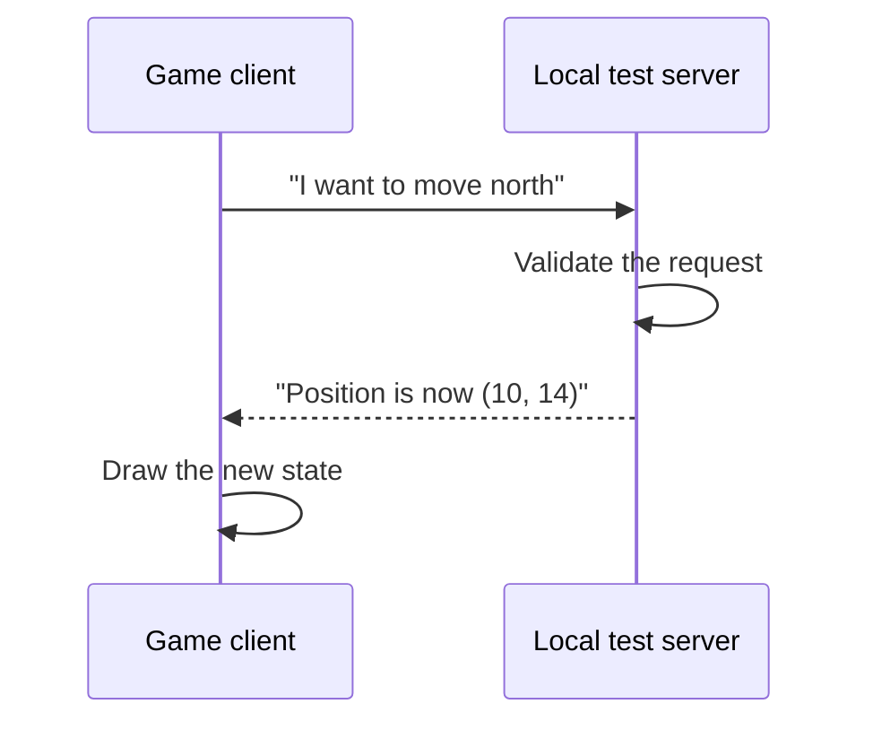
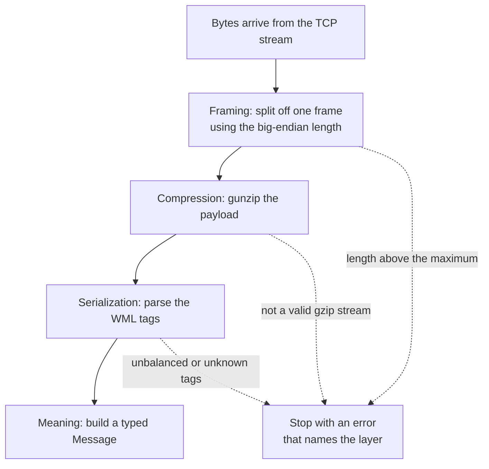
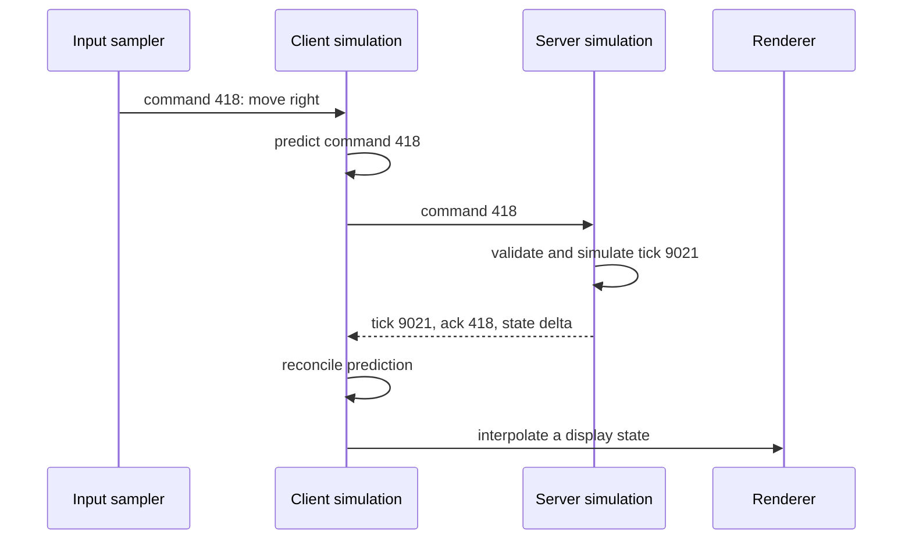

import MemoryStrip from '../../../../components/MemoryStrip.astro';
import Quiz from '../../../../components/Quiz.astro';

## Client and server

A multiplayer client collects your input, sends requests, receives state, and draws what you see. A server applies the official rules.

<div class="diagram-on-dark">


</div>



The client usually sends an **intent**, not the final truth.

The client and server each hold local state, and messages connect those states over time. They are not one program with a slow shared variable. The server may accept, reject, reorder, or combine requests according to its rules, while the client may predict a result before confirmation arrives.

A field's meaning depends on the kind of message that carries it. An **intent** asks for something; an **acknowledgment** confirms that an earlier message arrived or was applied; a **snapshot** reports the whole state; a **delta** reports only what changed. A coordinate in a move request may be a desired destination; the same coordinate in a server update may be the accepted position. Equal-looking bytes can have different authority.

## Packets and protocols

A **packet** is a chunk of bytes sent across a network. That part is
straightforward.

“Protocol” is usually defined with words like *rules* or *agreement*, which
sound reasonable and tell you nothing. Be concrete instead. A **protocol** is
the set of specific questions both programs must already know the answers to
before a single byte means anything. There are four:

1. **Where does one message end and the next begin?** A TCP connection is one
   long stream of bytes with no natural gaps, so something has to mark the
   boundaries.
2. **What is each part of a message?** Which bytes are the length, which are the
   message type, which are the payload, and how each of those is encoded.
3. **Which messages are allowed right now?** A login reply makes no sense before
   a login request. People routinely forget this is part of the protocol at all.
4. **What happens when something is wrong?** An unknown message type, a length
   that does not fit, a message arriving out of turn.

None of that can be worked out by staring at the bytes, because none of it is
written in them. Both programs have to know it in advance. That is precisely why
reverse engineering a protocol means recovering those four answers — and why a
byte layout on its own only ever answers the second one.

:::note
📦 **Watch for:** the same bytes can be perfectly valid at one point in a
conversation and meaningless at another. A protocol model has to check *when* a
message is legal, not only what it contains.
:::

A simple framed message might contain:

```text
[4-byte length][1-byte kind][payload bytes...]
```

A typed message models the decoded meaning:

```rust
enum Message {
    Chat { sender: String, text: String },
    Move { unit_id: u32, x: i32, y: i32 },
    Ping,
}
```

The bytes are untrusted until parsing succeeds.

## One message is wrapped in several layers

Several layers cooperate when the bot sends one chat message:

```text
chat meaning:      sender and text
serialization:     WML fields and tags
compression:       gzip bytes
framing:           four-byte length plus payload
transport:         ordered TCP byte stream
network:           loopback IP packets
```

**WML**, Wesnoth Markup Language, is Wesnoth’s own tagged text format for structured data — chat messages, maps, units, and more all get written as bracketed tags such as `[message]` and `[/message]` wrapping quoted `key="value"` fields. It is the serialization format this chapter keeps reversing.

When something fails, ask which layer broke. A correct TCP connection does not prove the WML is valid. A valid gzip stream does not prove the length prefix used the right byte order.

The receiver undoes the layers in the opposite order, and each step has its own
way to fail:



**Serialization** turns structured values into bytes. **Framing** tells the receiver where one serialized message ends. **Transport** moves bytes between endpoints. Keeping those jobs separate makes both the explanation and the code easier to test.

## Byte order is part of the protocol

The same integer has more than one possible byte order. Decimal `258` is
1 × 256 + 2, so as a four-byte number it has one byte worth 256 (`01`), one byte
worth 1 (`02`), and two zero bytes. Wesnoth’s four-byte frame length is big
endian, which puts the byte worth the most first:

<MemoryStrip
  cells="+0=00|+1=00|+2=01|+3=02"
  groups="0-0:× 16,777,216|1-1:× 65,536|2-2:× 256|3-3:× 1"
  groups2="0-3:1 × 256 + 2 × 1 = 258"
  caption="Big endian, the order Wesnoth sends on the wire."
/>

On little-endian x86 memory, a native `u32` with the same value would usually
appear in the opposite order:

<MemoryStrip
  cells="+0=02|+1=01|+2=00|+3=00"
  groups="0-0:× 1|1-1:× 256|2-2:× 65,536|3-3:× 16,777,216"
  groups2="0-3:2 × 1 + 1 × 256 = 258"
  caption="Little endian, the order of a native `u32` in x86 memory: the same value with its four bytes reversed."
/>

Read with the wrong order, the wire bytes `00 00 01 02` become `0x02010000`,
which is 2 × 16,777,216 + 1 × 65,536 = 33,619,968: a frame length of more than
33 million bytes. Network code must follow the protocol, not the host CPU’s default. That is why the reader uses `u32::from_be_bytes` rather than a pointer cast.

## TCP is a stream

TCP delivers an ordered stream of bytes. It does **not** preserve your application’s message boundaries.

One call to `read` may return:

- half of one message;
- exactly one message;
- one message plus part of the next;
- several messages.

Concretely: if the sender writes two length-prefixed messages back to back, the
receiver has no say in how they turn up.

```text
sent:       [00 00 00 02][41 42]  [00 00 00 03][43 44 45]

read #1 ->  00 00 00 02 41 42 00 00      one message, plus half a header
read #2 ->  00 03 43 44 45               the remainder
```

<MemoryStrip
  cells="0=00|1=00|2=00|3=02|4=41|5=42|6=00|7=00|8=00|9=03|10=43|11=44|12=45"
  groups="0-3:length 2|4-5:`AB`|6-9:length 3|10-12:`CDE`"
  groups2="0-7:read #1: 8 bytes|8-12:read #2: 5 bytes"
  caption="The 4 + 2 + 4 + 3 = 13 bytes on the wire, numbered from 0. In ASCII, `41 42` is `AB` and `43 44 45` is `CDE`. Read #1 stops after box 7, halfway through the second length field, so the receiver must keep boxes 6 and 7 until read #2 brings boxes 8 and 9."
/>

Neither read lands on a message boundary. The receiver has to hold what it has
in a buffer, remove complete messages when enough bytes have arrived, and keep
the leftover for next time. A parser that assumes one `read` equals one message
works flawlessly over a fast loopback connection while you are testing, then
breaks the moment timing changes.

This is why a protocol needs framing.

```rust
use std::io::{self, Read};

fn read_frame(stream: &mut impl Read, max_size: usize) -> io::Result<Vec<u8>> {
    let mut length_bytes = [0_u8; 4];
    stream.read_exact(&mut length_bytes)?;
    let length = u32::from_be_bytes(length_bytes) as usize;

    if length > max_size {
        return Err(io::Error::new(
            io::ErrorKind::InvalidData,
            "frame is too large",
        ));
    }

    let mut payload = vec![0_u8; length];
    stream.read_exact(&mut payload)?;
    Ok(payload)
}
```

The maximum size prevents a bad length field from requesting absurd amounts of memory.

TCP reliability ends at delivering an ordered byte stream to the receiving socket. It does not prove the application parsed a complete message, accepted the request, saved the state, or sent a meaningful reply. Those guarantees belong to the application protocol. Define acknowledgments, request IDs, timeouts, and retry rules at that layer when the behavior needs them.

## UDP is made of datagrams

UDP preserves datagram boundaries but does not guarantee delivery, order, or uniqueness. Fast games often tolerate those tradeoffs for time-sensitive state.

A later position update can make an older one useless, so freshness may matter more than retransmission. In contrast, a one-time inventory change may need explicit ordering and acknowledgment. Choose behavior per message kind instead of labeling an entire game “reliable” or “unreliable.”

Do not assume a game uses only one protocol. It might use TCP for login/chat and UDP for movement.

## Real-time games replicate a simulation, not just variables

Most action games advance the world in discrete **ticks**. If a server runs at
60 ticks per second, one simulation step is approximately:

```text
tick duration = 1 second / 60 = 16.67 milliseconds
```

The client samples input, labels it, and sends a command. The server processes
commands during its own ticks and periodically sends a snapshot or delta. The
client then draws frames between confirmed server states:



Several similar-looking states can therefore coexist:

| State | Purpose | Important label |
|---|---|---|
| Last confirmed state | What the server has accepted | Server tick or snapshot ID |
| Predicted state | Immediate response to local input | Last locally simulated command |
| Interpolated state | Smooth display of remote objects | Render timestamp between snapshots |
| Historical state | Rewind or lag-compensation query | Past server tick or time |

This explains why a coordinate found in memory can be correct yet appear to
“snap back.” You may have found the predicted or rendered copy while a later
server snapshot replaced it. Three facts tell the copies apart: which thread
writes the field, whether its updates follow input or incoming packets, and which
tick or sequence number travels beside it.

## Ordering has to be carried in the message

Packet arrival order is not automatically simulation order. UDP packets can
arrive late or twice; even over TCP, one stream can contain application events
whose own timestamps refer to different moments. Protocols commonly carry:

- a monotonically increasing sequence number;
- a server tick or timestamp;
- an acknowledgment of the newest processed command;
- a bit mask acknowledging several earlier packets;
- a baseline ID telling which snapshot a delta modifies.

Sequence numbers often wrap. For an unsigned `N`-bit counter, comparisons must
use modular arithmetic and accept only a bounded forward window, not a plain
`incoming > current` test.

Work through one 16-bit wraparound. The last accepted sequence number is
`65534`, and the next two packets carry `65535` and then `0`:

```text
current  incoming   naive: incoming > current    (incoming - current) mod 65536
65534    65535      65535 > 65534  -> accept     1   -> accept
65535    0          0 > 65535      -> reject     1   -> accept
```

The naive test gets the first packet right and the second one wrong. `0` really
is one step newer than `65535`, but as a plain integer it is smaller, so the
packet is thrown away. It gets worse from there: `current` never advances past
`65535`, so every sequence number after the wrap looks old in the same way, and
the connection appears to stop receiving updates entirely.

The modular test asks a different question — how far forward is `incoming` from
`current`, counting the wrap? `(0 - 65535) mod 65536` is `1`, a single step
ahead, so the packet is accepted and `current` moves on. Accept only while that
distance stays inside an agreed window such as `1..=32768`. A genuinely old
packet computes a distance near 65536, which falls outside the window and is
still refused. The exact window is part of the protocol contract and deserves
boundary tests.

A **snapshot** contains enough state to stand alone. A **delta** contains changes
relative to a named baseline. Applying a delta to the wrong baseline may parse
perfectly and still create nonsense. Robust tooling keeps the baseline ID with
the bytes, refuses missing dependencies, and bounds how long incomplete state
may wait.

## Ports and sockets

A socket connects an address and port to a network endpoint:

```rust
use std::net::TcpStream;
use std::time::Duration;

let stream = TcpStream::connect_timeout(
    &"127.0.0.1:15000".parse()?,
    Duration::from_secs(3),
)?;
```

`127.0.0.1` means the same computer. We use loopback and a local test server for this section.

## Encryption changes what you can see

If a protocol uses modern encryption correctly, a packet capture shows encrypted bytes, addresses, sizes, and timing—not readable messages. Do not try to defeat encryption or certificate checks.

For learning, use:

- your own toy protocol;
- a local open-source server;
- captured bytes provided by a challenge;
- application logs you control.

## Captures in this chapter stay local

The capture, replay, and proxy examples use loopback or a local test server. That keeps timing, state changes, and failures observable while you learn what each protocol layer contributes.

<Quiz
  id="tcp-message-boundary"
  type="multiple-choice"
  title="Read a TCP message safely"
  prompt="Why can one call to `read` not be assumed to return one complete application message?"
  options="TCP is a byte stream and does not preserve application write boundaries||TCP silently converts every message to UDP||Windows always removes the first byte||Ports make every message the same size"
  answer="0"
  explanation="TCP preserves ordered bytes, not message-shaped chunks. One read may return part of a frame or several frames together. Your protocol must define a length, delimiter, or fixed size, and the reader must loop until that rule is satisfied."
/>
