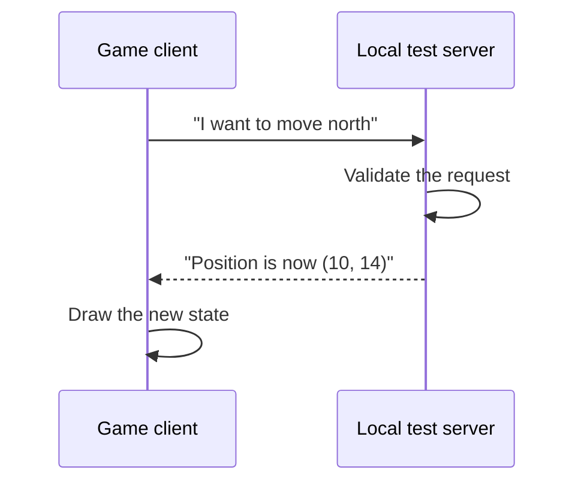
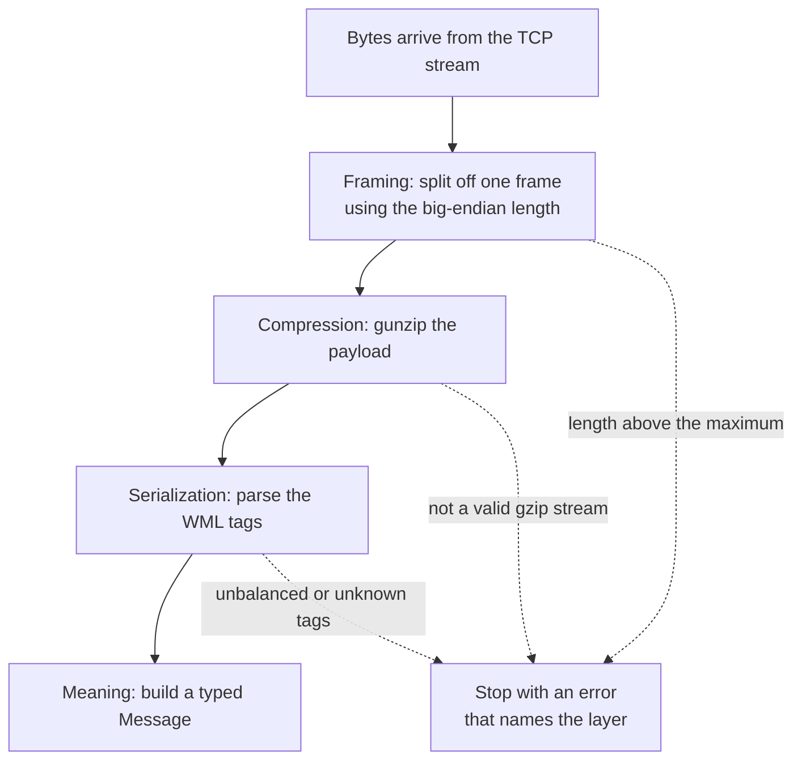

import MemoryStrip from '../../../../components/MemoryStrip.astro';
import Scene from '../../../../components/Scene.astro';
import MarginNote from '../../../../components/kit/MarginNote.astro';
import CodeTrace from '../../../../components/CodeTrace.astro';
import Frame from '../../../../components/kit/Frame.astro';
import SimLab from '../../../../components/SimLab.astro';

## Client and server

A **client** is the game program running on a player's device. It reads the player's keyboard or controller, draws the world, and exchanges messages with another program over the network.

A **server** is a program that receives requests from clients and provides a service to them. A game server might keep track of who has joined a match, calculate player movement and damage, and send the resulting positions and health to the connected players. The computer running that program is also often called “the server.” The program can run on a rented machine, on one player's computer, or beside your client on the same computer during a local test.

Imagine a match where the server calculates movement. It stores a player at `(10, 15)`. The player's client sends “move north.” The server checks whether the destination is inside the map and free of a wall. If the move is possible, it changes its stored position to `(10, 14)` and sends that position to the clients. Each client updates the character it draws. If a wall blocks the move, the server keeps `(10, 15)` and reports that position instead.

| In this example | Client program | Server program |
| --- | --- | --- |
| Input | Notices the north key press and sends a move request. | Receives the request and identifies the player who sent it. |
| Simulation | May predict movement to make the controls feel responsive. | Checks the destination and updates the match's stored position. |
| Display | Draws the player at the latest known or predicted position. | Sends position updates; a dedicated server usually draws no game window. |

<MarginNote kind="clarify">Client and server name the programs' jobs. They do not require two computers: a local test can run both programs on one machine and connect them through loopback.</MarginNote>

This is one common arrangement, called a **server-authoritative simulation**: the server's accepted position is the one the clients eventually use. Other games give the server a smaller job, such as hosting a lobby or forwarding players' inputs. A server does not necessarily simulate every part of a game, and the clients do not necessarily hold identical or complete copies of its data.

This chapter follows that message from intent to bytes, from captured bytes
to a parsed event, and from one event to a legal session transition. A local
chat client and proxy put the pieces together. The final lessons ask how two
programs on one computer can exchange equally well-defined messages without
using a network socket.

<div class="diagram-on-dark">


</div>


```mermaid
sequenceDiagram
    participant C as Game client
    participant S as Local test server
    C->>S: "I want to move north"
    S->>S: Validate the request
    S-->>C: "Position is now (10, 14)"
    C->>C: Draw the new state
```

The client's “move north” is an **intent**: a request for a change, not the final truth. The reply reports what the server actually accepted. If a wall blocked the move, the reply might still say `(10, 15)`, and the client would correct its display.

These programs have separate memory. Changing a position in the client's memory does not directly change the server's stored position. They communicate by sending bytes. A client may display a predicted move while it waits, then correct that display when the server's reply arrives. The next question is how the reply's bytes become one complete message at the other end.

## Peer-to-peer describes who communicates with whom

In a **peer-to-peer** arrangement, players' programs can exchange messages
directly. A lobby service may still introduce them, and a relay may carry bytes
when a direct connection is unavailable. Neither service must calculate the match.

A player who hosts a server on their own computer still runs a client/server
arrangement if that server accepts movement and sends the final positions.
The location of the program does not change its job.

| Example arrangement | Message path | Who calculates the accepted position here? |
| --- | --- | --- |
| Dedicated game server | Each client talks to the server program. | The server program. |
| Player hosts the game server | Clients talk to the server on a player's computer. | That server program. |
| Peers exchange inputs | Players exchange the same ordered input history. | Each peer runs the agreed deterministic simulation. |

The last row describes one particular design, often called **lockstep**.
Peer-to-peer does not automatically mean lockstep: another design can give one
peer responsibility for an object or use different ways to resolve conflicts.
Always ask two separate questions: **where do messages go, and whose result is
accepted?** Direct communication alone does not prove which copy owns a gold value.

<CodeTrace trace="original-network-topology" />

<MarginNote kind="clarify">A server is a program with a job. A peer is another participant. Hosting on a player's computer and exchanging directly between peers describe different choices.</MarginNote>

**Topology cheatsheet:** client/server identifies service roles; peer-to-peer
describes communication between participants; authority identifies the accepted
result. A topology label alone cannot answer all three questions.

## TCP is a stream

TCP is a common transport for a connection between the two programs. It delivers an ordered **stream** of bytes. A program calls `read` to take some bytes that have arrived from that stream. TCP does **not** preserve the game's message boundaries for that call.

One call to `read` may return:

- half of one message;
- exactly one message;
- one message plus part of the next;
- several messages.

Concretely: if the sender writes two length-prefixed messages back to back, the
receiver has no say in how they turn up.

```text
sent:       [00 00 00 02][41 42]  [00 00 00 03][43 44 45]

read #1 ->  00 00 00 02 41 42 00 00      one message, plus half a header
read #2 ->  00 03 43 44 45               the remainder
```

<MemoryStrip
  cells="0=00|1=00|2=00|3=02|4=41|5=42|6=00|7=00|8=00|9=03|10=43|11=44|12=45"
  groups="0-3:length 2|4-5:`AB`|6-9:length 3|10-12:`CDE`"
  groups2="0-7:read #1: 8 bytes|8-12:read #2: 5 bytes"
  caption="The 4 + 2 + 4 + 3 = 13 bytes on the wire, numbered from 0. In ASCII, `41 42` is `AB` and `43 44 45` is `CDE`. Read #1 stops after box 7, halfway through the second length field, so the receiver must keep boxes 6 and 7 until read #2 brings boxes 8 and 9."
/>

Neither read lands on a message boundary. The receiver has to hold what it has
in a buffer, remove complete messages when enough bytes have arrived, and keep
the leftover for next time. A parser that assumes one `read` equals one message
works flawlessly over a fast loopback connection while you are testing, then
breaks the moment timing changes.

This is why a protocol needs framing.

```rust
use std::io::{self, Read};

fn read_frame(stream: &mut impl Read, max_size: usize) -> io::Result<Vec<u8>> {
    let mut length_bytes = [0_u8; 4];
    // Wait for the whole header, even if it arrives across several reads.
    stream.read_exact(&mut length_bytes)?;
    let length = u32::from_be_bytes(length_bytes) as usize;

    // Check an untrusted size before allocating its payload buffer.
    if length > max_size {
        return Err(io::Error::new(
            io::ErrorKind::InvalidData,
            "frame is too large",
        ));
    }

    let mut payload = vec![0_u8; length];
    // A successful result contains one complete payload, without the header.
    stream.read_exact(&mut payload)?;
    Ok(payload)
}
```

`stream` supplies incoming bytes and `max_size` is the caller's permitted payload
limit. A successful call returns one payload as a `Vec<u8>`; a truncated header
or payload produces an I/O error through `?`. For a header `00 00 00 02` followed
by `41 42`, the returned vector contains just `41 42`. The maximum size prevents
a bad length field from requesting absurd amounts of memory. This blocking
helper also needs an appropriate timeout on a real socket so a peer cannot
make it wait indefinitely.

TCP reliability ends at delivering an ordered byte stream to the receiving socket. It does not prove the application parsed a complete message, accepted the request, saved the state, or sent a meaningful reply. The application must provide those guarantees. An acknowledgment can report acceptance, a request ID can identify a repeated request, and a timeout can tell the client when to stop waiting. Decide whether a retry repeats the same request or starts a new one before implementing it.

## Byte order is part of the protocol

The same integer has more than one possible byte order. Decimal `258` is
1 × 256 + 2, so as a four-byte number it has one byte worth 256 (`01`), one byte
worth 1 (`02`), and two zero bytes. Wesnoth’s four-byte frame length is big
endian, which puts the byte worth the most first:

<MemoryStrip
  cells="+0=00|+1=00|+2=01|+3=02"
  groups="0-0:× 16,777,216|1-1:× 65,536|2-2:× 256|3-3:× 1"
  groups2="0-3:1 × 256 + 2 × 1 = 258"
  caption="Big endian, the order Wesnoth sends on the wire."
/>

On little-endian x86 memory, a native `u32` with the same value would usually
appear in the opposite order:

<MemoryStrip
  cells="+0=02|+1=01|+2=00|+3=00"
  groups="0-0:× 1|1-1:× 256|2-2:× 65,536|3-3:× 16,777,216"
  groups2="0-3:2 × 1 + 1 × 256 = 258"
  caption="Little endian, the order of a native `u32` in x86 memory: the same value with its four bytes reversed."
/>

Read with the wrong order, the wire bytes `00 00 01 02` become `0x02010000`,
which is 2 × 16,777,216 + 1 × 65,536 = 33,619,968: a frame length of more than
33 million bytes. Network code must follow the protocol, not the host CPU’s default. That is why the reader uses `u32::from_be_bytes` rather than a pointer cast.

## Packets and protocols

A **packet** is a chunk of bytes sent across a network. That part is
straightforward.

A **protocol** specifies how programs communicate: how to separate messages,
decode their fields, order the conversation, and respond to invalid input.
Both programs need matching answers to these four questions:

1. **Where does one message end and the next begin?** A TCP connection is one
   long stream of bytes with no natural gaps, so something has to mark the
   boundaries.
2. **What is each part of a message?** Which bytes are the length, which are the
   message type, which are the payload, and how each of those is encoded.
3. **Which messages are allowed right now?** A login reply makes no sense before
   a login request. People routinely forget this is part of the protocol at all.
4. **What happens when something is wrong?** An unknown message type, a length
   that does not fit, a message arriving out of turn.

None of that can be worked out by staring at the bytes, because none of it is
written in them. Both programs have to know it in advance. That is precisely why
reverse engineering a protocol means recovering those four answers — and why a
byte layout on its own only ever answers the second one.

:::note
📦 **Watch for:** the same bytes can be perfectly valid at one point in a
conversation and meaningless at another. A protocol model has to check *when* a
message is legal, not only what it contains.
:::

A simple framed message might contain:

```text
[4-byte length][1-byte kind][payload bytes...]
```

A typed message models the decoded meaning:

```rust
enum Message {
    Chat { sender: String, text: String },
    Move { unit_id: u32, x: i32, y: i32 },
    Ping,
}
```

This enum is a declaration fragment, not a network reader. After framing and
validation, a parser can turn a move's fields into `Message::Move` with a unit
ID and two coordinates; the game logic receives named values instead of raw
byte offsets. The bytes are untrusted until parsing succeeds.

## One message is wrapped in several layers

Several layers cooperate when the bot sends one chat message:

```text
chat meaning:      sender and text
serialization:     WML fields and tags
compression:       gzip bytes
framing:           four-byte length plus payload
transport:         ordered TCP byte stream
network:           loopback IP packets
```

**WML**, Wesnoth Markup Language, is Wesnoth’s own tagged text format for structured data — chat messages, maps, units, and more all get written as bracketed tags such as `[message]` and `[/message]` wrapping quoted `key="value"` fields. It is the serialization format this chapter keeps reversing.

When something fails, ask which layer broke. A correct TCP connection does not prove the WML is valid. A valid gzip stream does not prove the length prefix used the right byte order.

The receiver undoes the layers in the opposite order, and each step has its own
way to fail:


```mermaid
flowchart TD
    A["Bytes arrive from the TCP stream"] --> B["Framing: split off one frame<br/>using the big-endian length"]
    B --> C["Compression: gunzip the payload"]
    C --> D["Serialization: parse the WML tags"]
    D --> E["Meaning: build a typed Message"]
    B -.->|"length above the maximum"| X["Stop with an error<br/>that names the layer"]
    C -.->|"not a valid gzip stream"| X
    D -.->|"unbalanced or unknown tags"| X
```

**Serialization** turns structured values into bytes. **Framing** tells the receiver where one serialized message ends. **Transport** moves bytes between endpoints. Keeping those jobs separate makes both the explanation and the code easier to test.

<Scene name="receive-to-event" />

## Messages can feed a data pipeline

A multiplayer service handles more than packets. It may keep durable account
and inventory records in a **database**, reuse expensive results in a **cache**,
and build a **search index** for queries such as finding a match by region and
mode. Those are different access patterns: keep data across restarts, avoid
repeating work, and find selected records efficiently. They are not three names
for the authoritative state of a running match.

Processing is **asynchronous** when the sender can continue before the work
finishes. A request can enter a queue, then a worker handles it later. A queue
acknowledgment might mean “received”; it does not by itself mean “validated,
applied, and saved.” The protocol must say which stage each reply confirms.

There are also two common ways to process a sequence of events:

| Processing style | Game-service example | What it must account for |
|---|---|---|
| Stream processing | Update a match's statistics as accepted events arrive | Ordering, late events, duplicates, and how quickly the result is needed |
| Batch processing | Recompute a leaderboard from a collected set of finished-match results | Which results belong to the batch, when it runs, and how to repeat it safely |

“Stream processing” here means processing ongoing events; it does not mean the
TCP byte stream discussed earlier. A service can obtain events from many
connections, files, or queues. A batch deliberately waits for a group of data
and processes that group together. Neither approach implies that a game can
wait for a leaderboard job before processing a player's movement or damage.

For example, a match event might carry `match_id`, `event_id`, and a score
change. If a sender retries it after a lost acknowledgment, the receiver must
recognise the same event rather than add the score twice. Event identity and
retry behaviour belong to the model and protocol, not to whether TCP delivered
the underlying bytes correctly.

### Modularity and scaling follow the dependencies

Keep receiving bytes, parsing messages, checking requested actions, and saving results as identifiable jobs.
Then measure where time is spent. A slow disk write, repeated full-player
search, and long logging operation need different remedies; adding workers
does not remove a shared bottleneck automatically.

Several independent matches can often run on separate workers. Within one
match, operations on shared state still need a defined order. Moving one job
to another process also adds a message boundary, possible failures, and delay.
Start with a small correct local service, preserve these contracts, and
distribute work when measurements and the use case justify it.

Bound queues as well as messages. If input arrives faster than it can be
processed, an unbounded queue consumes memory and makes results increasingly
stale. A newer position snapshot may replace an older one under a documented
policy; a one-time item grant needs different handling. That is a decision
about message meaning: discarding an old position can be useful, but discarding an unprocessed item grant loses the item.

## Design the backend for one match

A player logs in, joins match 42, and buys an item for 300 coins. The **game
backend** is the set of services behind those actions. Separating their jobs
explains why a working socket alone cannot prove a successful purchase.

### From login to the live world

**Authentication** establishes the player's identity. A **session** lets later
requests refer to that authenticated login; it can outlive one TCP connection.
A **matchmaker** groups compatible players and arranges a match location. It
does not calculate their movement. Microsoft's [PlayFab matchmaking overview](https://learn.microsoft.com/en-us/xbox/playfab/multiplayer/matchmaking/)
illustrates that service role.

An **API gateway** routes requests to the appropriate service. **Middleware**
performs shared checks along that route: validate the session, bound the
request, enforce its permissions, and record its outcome. A load balancer can
spread these entry requests across equivalent gateway instances. The
**authoritative match server** owns match 42's accepted positions and damage;
route its commands to that owner instead of a randomly chosen empty worker.
These are logical jobs, which a small project can combine in one program.

<Frame caption="Login, match allocation and asset delivery have different owners. These are logical service roles, not a requirement to deploy every box separately. Original CC0 artwork.">
  
</Frame>

### Put each value in the right store

A **database** keeps structured, durable account balances and inventory.
**Object storage** keeps larger files addressed by keys, such as versioned
patches and replay recordings. A **cache** reuses a result that can be rebuilt;
a **CDN**, or content delivery network, brings eligible asset copies closer to
players. An asset cache hit can avoid an origin fetch, as [Cloudflare's request lifecycle](https://developers.cloudflare.com/billing/understand/how-charges-accrue/)
explains. Personal account responses need separate authorization and cache
rules. A cached lobby count is useful; its old balance must not authorize a
new purchase.

### One purchase, one effect

The player has 1,000 coins. Request `P7` asks for the 300-coin item. Validate the
server's price and current balance, debit to 700, grant the item, and record
`P7`'s result inside one **transaction**: either that whole change commits or
none does. Concurrent requests also need appropriate isolation or locking;
merely surrounding unsafe read-then-write logic with a transaction is
insufficient. [PostgreSQL's isolation guide](https://www.postgresql.org/docs/18/transaction-iso.html)
explains these concurrency guarantees and possible transaction retries.

If the reply is lost, retry the same request ID. **Idempotency** means that
repeat has the same effect: return the recorded result, without another debit
or item. Scope the ID to its account, reject a changed payload under the same
ID, and save the receipt atomically with the effect.

<Frame caption="Purchase P7 commits its debit, item and receipt together; retrying P7 returns that receipt. The separate leaderboard example may display an older score until its derived view catches up. Original CC0 artwork.">
  
</Frame>

**Consistency** describes which writes a read can observe. A strongly
consistent read respects completed writes within its promised scope. A weaker
read can return an older replica or cache value. **Eventual consistency**
promises convergence when updates stop and propagation succeeds, not a fixed
maximum delay. Currency authorization needs a current protected decision;
a leaderboard can tolerate a clearly dated older view. [Cosmos DB's consistency definitions](https://learn.microsoft.com/en-us/azure/cosmos-db/consistency-levels)
show why these guarantees must be stated explicitly.

Optional: explore the smaller concurrency problem below. Starting at 1,000,
a reward of 500 and purchase of 300 should leave 1,200. Overlapping reads and
writes can lose one change. Its local lock illustrates ordering; a backend
must enforce its database transaction rules across all participating processes.

<SimLab sim="lost-update" id="backend-concurrent-coins" label="Explore overlapping reward and purchase updates" />

### More matches, with explicit ownership

**Sharding** partitions work or records by a key: independent matches can run
on different workers. A shared world crossing shard boundaries additionally
needs ownership handoffs and ordered cross-boundary actions. [Azure's sharding pattern](https://learn.microsoft.com/en-us/azure/architecture/patterns/sharding)
describes the partitioning tradeoff.

**Coordination** records which worker owns match 42. On failure, a replacement
needs recoverable state and a new ownership generation; an expired worker
must be prevented from committing late writes. Electing a replacement alone
cannot reconstruct lost match state. [Leader-election guidance](https://learn.microsoft.com/en-us/azure/architecture/patterns/leader-election)
explains leases and their failure limits. Retried result events also need
persistent event IDs to avoid awarding the same win twice.

### Spend the latency budget where it matters

A toy 60-tick-per-second server has about 16.7 milliseconds per simulation
step. That budget is distinct from network round-trip delay. Keep slow replay
uploads and leaderboard work outside the movement path. Measure queue depth,
bytes per player, and slow-tail latency before optimizing. Spatial indexes can
reduce repeated full-world searches; smaller state deltas reduce bandwidth,
while compression spends CPU time. Extra workers cannot repair an undefined
ownership rule or an overloaded shared database.

## UDP is made of datagrams

UDP preserves datagram boundaries but does not guarantee delivery, order, or uniqueness. Fast games often tolerate those tradeoffs for time-sensitive state.

A later position update can make an older one useless, so freshness may matter more than retransmission. In contrast, a one-time inventory change may need explicit ordering and acknowledgment. Choose behavior per message kind instead of labeling an entire game “reliable” or “unreliable.”

Do not assume a game uses only one protocol. It might use TCP for login/chat and UDP for movement.

## Ports and sockets

A socket represents a network endpoint. This complete helper opens a TCP
connection to our local test server, or returns an error:

```rust
use std::{io, net::{SocketAddr, TcpStream}};
use std::time::Duration;

fn connect_local() -> io::Result<TcpStream> {
    let address = SocketAddr::from(([127, 0, 0, 1], 15000));
    // This bounds connection establishment, not later read/write operations.
    TcpStream::connect_timeout(&address, Duration::from_secs(3))
}
```

`127.0.0.1` means the same computer; `15000` selects the server's listening
port. We use loopback and a local test server for this section. A successful
result is a connected stream; framing and protocol checks still remain.

## Encryption changes what you can see

If a protocol uses modern encryption correctly, a packet capture shows encrypted bytes, addresses, sizes, and timing—not readable messages. Do not try to defeat encryption or certificate checks.

For learning, use:

- your own toy protocol;
- a local open-source server;
- captured bytes provided by a challenge;
- application logs you control.

## Captures in this chapter stay local

The capture, replay, and proxy examples use loopback or a local test server. That keeps timing, state changes, and failures observable while you learn what each protocol layer contributes.

Now that the message boundary and its byte order have a purpose, Lesson 8.2 records a real local exchange and asks which captured bytes correspond to one controlled action.
