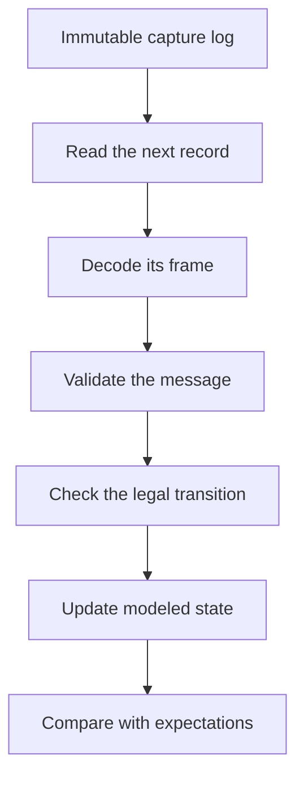
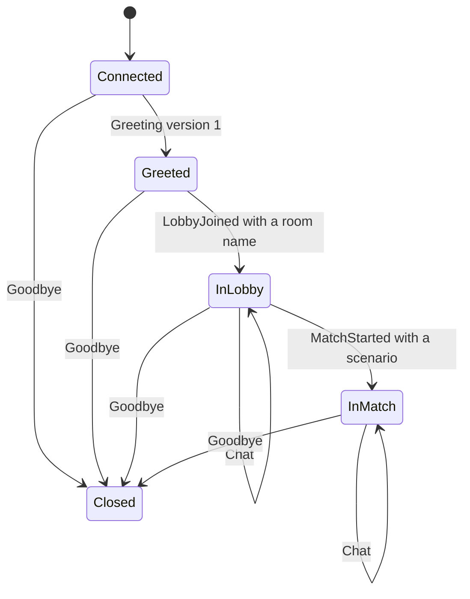

import MemoryStrip from '../../../../components/MemoryStrip.astro';

## A packet parser is only the first layer

Parsing one message tells you what its bytes mean. A protocol also defines **when** that message is legal.

A local Wesnoth test client might move through:

```text
Disconnected -> Connected -> Greeted -> InLobby -> InMatch -> Closed
```

A chat message before the greeting may be invalid even when its length and UTF-8 text parse perfectly. That makes protocol reversing a state-machine problem as well as a byte-parsing problem.

Replay processes the saved frames in order. A record changes the modeled
session only after both its bytes and its transition have passed validation:



If any stage fails, the record and old state remain available for diagnosis;
the replay never needs to invent a replacement state.

## A message log and a session state are different things

The capture is an ordered log of the frames that crossed the connection. The session state is a model produced by applying their messages in order:

```text
initial state + message 1 + message 2 + ... -> current modeled state
```

For a five-frame capture of one short session, starting from `Connected`:

<MemoryStrip
  cells="frame 0=Greeting v1|frame 1=LobbyJoined|frame 2=Chat|frame 3=MatchStarted|frame 4=Goodbye"
  groups="0-0:→ Greeted|1-1:→ InLobby|2-2:stays InLobby|3-3:→ InMatch|4-4:→ Closed"
  caption="The boxes are the log; the labels under them are the state after each frame is applied. The log never stores a state, so a corrected rule can rebuild every state from the same five frames."
/>

Keep the raw log immutable and rebuild the model from it. If a parser or transition rule changes, you can replay the same log and see exactly which frame now produces a different result. Editing the stored “current state” by hand loses that history.

Not every message is an event that happened exactly once. A snapshot may repeat a fact, an acknowledgment may refer to an earlier request, and a retransmitted request may appear twice. Store direction, sequence identifiers, and timing with each frame; without them, duplicate bytes cannot be told apart from duplicate actions.

## Model states and messages separately

```rust
#[derive(Clone, Copy, Debug, Eq, PartialEq)]
enum SessionState {
    Connected,
    Greeted,
    InLobby,
    InMatch,
    Closed,
}

#[derive(Clone, Debug, Eq, PartialEq)]
enum Message {
    Greeting { version: u16 },
    LobbyJoined { room: String },
    MatchStarted { scenario: String },
    Chat { text: String },
    Goodbye,
}

#[derive(Debug)]
enum ProtocolError {
    IllegalTransition { state: SessionState, message: &'static str },
    UnsupportedVersion(u16),
    EmptyName,
}
```

The parser creates `Message` values. The session machine decides whether each value makes sense now.

## Make transitions explicit

```rust
fn apply(state: &mut SessionState, message: &Message) -> Result<(), ProtocolError> {
    match (*state, message) {
        (SessionState::Connected, Message::Greeting { version: 1 }) => {
            *state = SessionState::Greeted;
            Ok(())
        }
        (SessionState::Connected, Message::Greeting { version }) => {
            Err(ProtocolError::UnsupportedVersion(*version))
        }
        (SessionState::Greeted, Message::LobbyJoined { room }) if !room.is_empty() => {
            *state = SessionState::InLobby;
            Ok(())
        }
        (SessionState::InLobby, Message::MatchStarted { scenario })
            if !scenario.is_empty() =>
        {
            *state = SessionState::InMatch;
            Ok(())
        }
        (SessionState::InLobby | SessionState::InMatch, Message::Chat { .. }) => Ok(()),
        (_, Message::Goodbye) => {
            *state = SessionState::Closed;
            Ok(())
        }
        (state, message) => Err(ProtocolError::IllegalTransition {
            state,
            message: match message {
                Message::Greeting { .. } => "greeting",
                Message::LobbyJoined { .. } => "lobby_joined",
                Message::MatchStarted { .. } => "match_started",
                Message::Chat { .. } => "chat",
                Message::Goodbye => "goodbye",
            },
        }),
    }
}
```

Drawn as a diagram, `apply` is this state machine:



Each arrow is one arm of the `match`. A message with no arrow out of the
current state, such as `Chat` while `Greeted`, falls through to the last arm and
returns `IllegalTransition`. A `Greeting` with any version other than 1 is
refused by its own arm with `UnsupportedVersion`, and `Goodbye` is accepted in
every state, including `Closed` itself.

This looks more verbose than a chain of `if` statements. The benefit is coverage: the compiler helps you notice new states and message variants that need rules.

## Store captures as direction plus bytes

Do not save only the decoded text. A replay fixture should preserve:

- client-to-server or server-to-client direction;
- time relative to the previous frame;
- exact frame bytes;
- the game and protocol version;
- the experiment that produced the capture.

```rust
#[derive(Clone, Debug)]
struct CapturedFrame {
    after_ms: u32,
    from_server: bool,
    bytes: Vec<u8>,
}
```

Redact account names or chat content before committing fixtures. A local test capture should contain only invented data.

## Replay without a network

```rust
use anyhow::Context;

fn replay(
    frames: &[CapturedFrame],
    mut parse: impl FnMut(&[u8]) -> anyhow::Result<Message>,
) -> anyhow::Result<SessionState> {
    let mut state = SessionState::Connected;

    for (index, frame) in frames.iter().enumerate() {
        anyhow::ensure!(frame.bytes.len() <= 64 * 1024, "frame {index} is too large");
        anyhow::ensure!(frame.after_ms <= 30_000, "frame {index} has an absurd delay");

        let message = parse(&frame.bytes)
            .with_context(|| format!("could not parse frame {index}"))?;
        apply(&mut state, &message)
            .map_err(|error| anyhow::anyhow!("frame {index}: {error:?}"))?;
    }

    Ok(state)
}
```

The test does not sleep for `after_ms`. It validates timing metadata deterministically. A separate integration test can use a virtual clock to exercise timeouts.

Deterministic replay requires controlling every input that affects a transition: message order, clock readings, random choices, configuration, and initial state. If the same fixture sometimes reaches different states, one of those inputs is still hidden. Pass it into the model instead of reading a real clock or global setting from inside `apply`.

## Mutate one fact at a time

Useful negative replays include:

- truncate one length prefix;
- make a length larger than the available payload;
- send chat before greeting;
- repeat a one-time greeting;
- remove the final frame;
- insert an unknown message type;
- exceed the maximum accepted text length.

The expected outcome is a precise error at a precise frame, never an out-of-bounds read or an infinite wait. Replaying `Greeting` twice, for example, stops at frame 1 with an `IllegalTransition` error for state `Greeted`, because the state machine has no `Greeting` arrow out of `Greeted`.

A length larger than the available payload has to fail before any message is decoded:

<MemoryStrip
  cells="0=00|1=00|2=00|3=09|4=43|5=44|6=45|7=??|8=??|9=??|10=??|11=??|12=??"
  marks="7-12"
  groups="0-3:length field: 9|4-6:3 payload bytes present|7-12:6 bytes the frame claims but does not have"
  caption="The big-endian length `00 00 00 09` promises 9 payload bytes, but only 3 follow, so 9 − 3 = 6 are missing. A parser that trusted the length would read 6 bytes past the end of the frame; a checked slice turns that into an error for this frame instead."
/>

For messages that may be retried, test **idempotence** explicitly. Applying the same acknowledgment twice should either preserve the same state or return a clear duplicate error; it should not create a second match, grant a reward twice, or move backward in the session.

## Why replay beats manual clicking

A capture preserves one session. A replay turns it into a repeatable test: when you change the parser, framing code, or session rules, the same frames run through them again in milliseconds.

Keep live-network code at the edge. Feed the bytes it receives into the same parser and state machine tested by replay. That design keeps transport separate from parsing and makes the protocol model reproducible. 🌐
