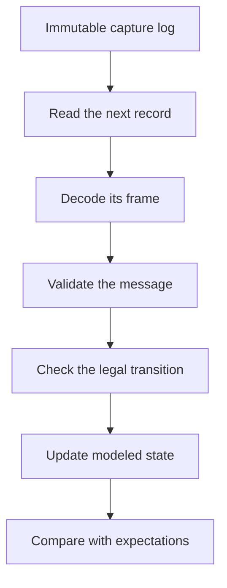
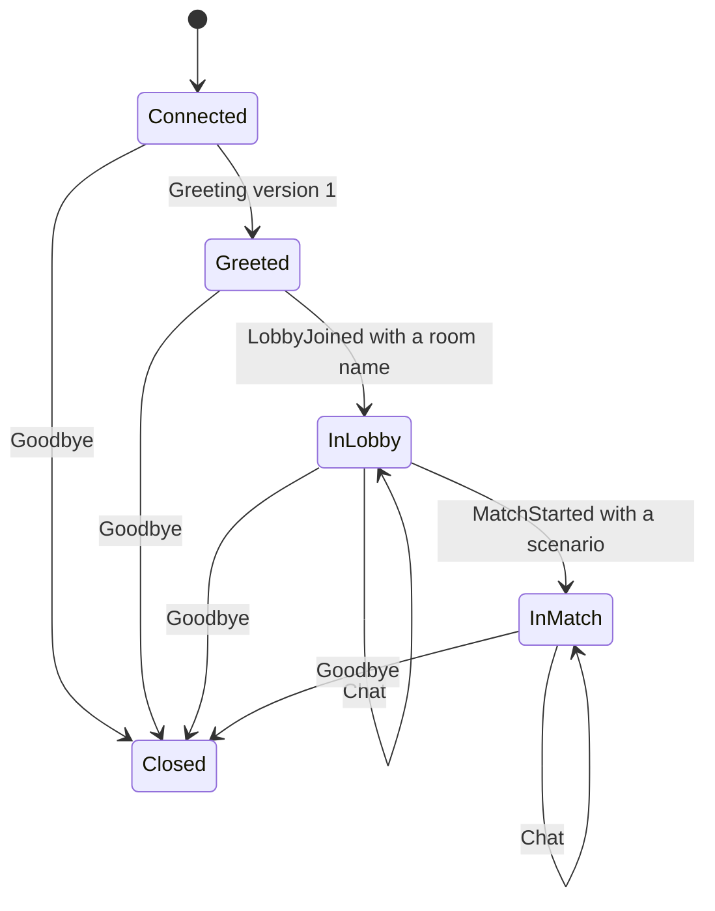
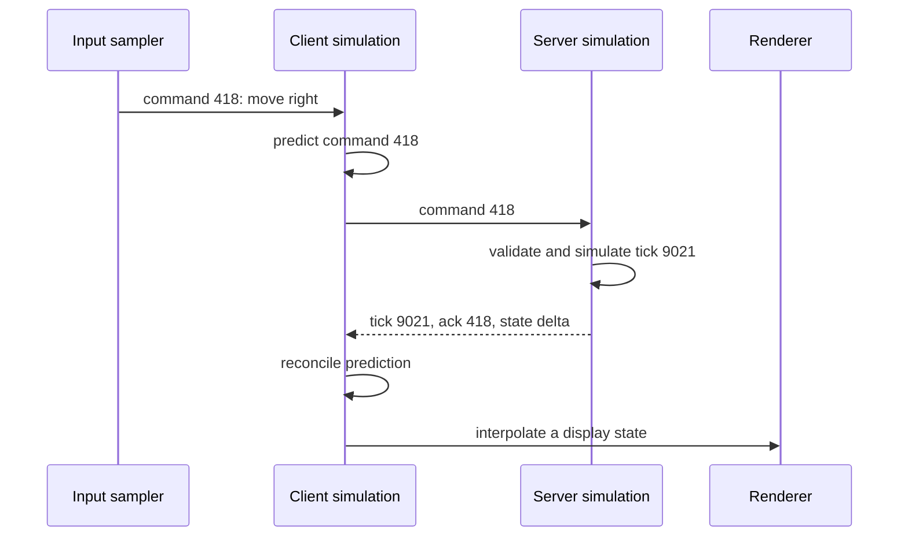

import MemoryStrip from '../../../../components/MemoryStrip.astro';
import Scene from '../../../../components/Scene.astro';

## A packet parser is only the first layer

Parsing one message tells you what its bytes mean. A protocol also defines **when** that message is legal.

A local Wesnoth test client might move through:

```text
Disconnected -> Connected -> Greeted -> InLobby -> InMatch -> Closed
```

A chat message before the greeting may be invalid even when its length and UTF-8 text parse perfectly. That makes protocol reversing a state-machine problem as well as a byte-parsing problem.

Replay processes the saved frames in order. A record changes the modeled
session only after both its bytes and its transition have passed validation:


```mermaid
flowchart TD
    A["Immutable capture log"] --> B["Read the next record"]
    B --> C["Decode its frame"]
    C --> D["Validate the message"]
    D --> E["Check the legal transition"]
    E --> F["Update modeled state"]
    F --> G["Compare with expectations"]
```

If any stage fails, the record and old state remain available for diagnosis;
the replay never needs to invent a replacement state.

## A message log and a session state are different things

The capture is an ordered log of the frames that crossed the connection. The session state is a model produced by applying their messages in order:

```text
initial state + message 1 + message 2 + ... -> current modeled state
```

For a five-frame capture of one short session, starting from `Connected`:

<MemoryStrip
  cells="frame 0=Greeting v1|frame 1=LobbyJoined|frame 2=Chat|frame 3=MatchStarted|frame 4=Goodbye"
  groups="0-0:→ Greeted|1-1:→ InLobby|2-2:stays InLobby|3-3:→ InMatch|4-4:→ Closed"
  caption="The boxes are the log; the labels under them are the state after each frame is applied. The log never stores a state, so a corrected rule can rebuild every state from the same five frames."
/>

Keep the raw log immutable and rebuild the model from it. If a parser or transition rule changes, you can replay the same log and see exactly which frame now produces a different result. Editing the stored “current state” by hand loses that history.

Not every message is an event that happened exactly once. A **snapshot** can repeat a whole state, while an **acknowledgment** refers to an earlier request. A retransmitted request may appear twice. Store direction, sequence identifiers, and timing with each frame; without them, duplicate bytes cannot be told apart from duplicate actions. The real-time section below works through those identifiers in detail.

## Model states and messages separately

Receiving a well-formed `Chat` message is different from being ready to
accept it. A connection begins in `Connected`, reaches a lobby only after
greeting and room messages, and can then accept chat. These enums keep the
connection state and the parsed message as separate facts:

```rust
#[derive(Clone, Copy, Debug, Eq, PartialEq)]
enum SessionState {
    Connected,
    Greeted,
    InLobby,
    InMatch,
    Closed,
}

#[derive(Clone, Debug, Eq, PartialEq)]
enum Message {
    Greeting { version: u16 },
    LobbyJoined { room: String },
    MatchStarted { scenario: String },
    Chat { text: String },
    Goodbye,
}

#[derive(Debug)]
enum ProtocolError {
    IllegalTransition { state: SessionState, message: &'static str },
    UnsupportedVersion(u16),
    EmptyName,
}
```

The parser creates `Message` values. The session machine decides whether each value makes sense now.

## Make transitions explicit

Now pair the current state with one parsed message. A version-1 greeting
moves `Connected` to `Greeted`; an unsupported version returns a precise
error; a chat message in the lobby leaves the state unchanged. The match
below makes every accepted transition visible in one place:

```rust
fn apply(state: &mut SessionState, message: &Message) -> Result<(), ProtocolError> {
    match (*state, message) {
        (SessionState::Connected, Message::Greeting { version: 1 }) => {
            *state = SessionState::Greeted;
            Ok(())
        }
        (SessionState::Connected, Message::Greeting { version }) => {
            Err(ProtocolError::UnsupportedVersion(*version))
        }
        (SessionState::Greeted, Message::LobbyJoined { room }) if !room.is_empty() => {
            *state = SessionState::InLobby;
            Ok(())
        }
        (SessionState::InLobby, Message::MatchStarted { scenario })
            if !scenario.is_empty() =>
        {
            *state = SessionState::InMatch;
            Ok(())
        }
        (SessionState::InLobby | SessionState::InMatch, Message::Chat { .. }) => Ok(()),
        (_, Message::Goodbye) => {
            *state = SessionState::Closed;
            Ok(())
        }
        (state, message) => Err(ProtocolError::IllegalTransition {
            state,
            message: match message {
                Message::Greeting { .. } => "greeting",
                Message::LobbyJoined { .. } => "lobby_joined",
                Message::MatchStarted { .. } => "match_started",
                Message::Chat { .. } => "chat",
                Message::Goodbye => "goodbye",
            },
        }),
    }
}
```

Drawn as a diagram, `apply` is this state machine:


```mermaid
stateDiagram-v2
    [*] --> Connected
    Connected --> Greeted: Greeting version 1
    Greeted --> InLobby: LobbyJoined with a room name
    InLobby --> InMatch: MatchStarted with a scenario
    InLobby --> InLobby: Chat
    InMatch --> InMatch: Chat
    Connected --> Closed: Goodbye
    Greeted --> Closed: Goodbye
    InLobby --> Closed: Goodbye
    InMatch --> Closed: Goodbye
```

Each arrow is one arm of the `match`. A message with no arrow out of the
current state, such as `Chat` while `Greeted`, falls through to the last arm and
returns `IllegalTransition`. A `Greeting` with any version other than 1 is
refused by its own arm with `UnsupportedVersion`, and `Goodbye` is accepted in
every state, including `Closed` itself.

This looks more verbose than a chain of `if` statements. The benefit is coverage: the compiler helps you notice new states and message variants that need rules.

<Scene name="session-replay" />

## Store captures as direction plus bytes

Do not save only the decoded text. A replay fixture should preserve:

- client-to-server or server-to-client direction;
- time relative to the previous frame;
- exact frame bytes;
- the game and protocol version;
- the experiment that produced the capture.

```rust
#[derive(Clone, Debug)]
struct CapturedFrame {
    after_ms: u32,
    from_server: bool,
    bytes: Vec<u8>,
}
```

Redact account names or chat content before committing fixtures. A local test capture should contain only invented data.

## Replay without a network

Replay takes recorded frames and the parser used for this protocol version.
It starts from `Connected`, validates each frame's size and delay, parses its
bytes, and applies the resulting message to the session state. The returned
state is what that exact log means under the current rules; the error names
the frame where interpretation stopped:

```rust
use anyhow::Context;

fn replay(
    frames: &[CapturedFrame],
    mut parse: impl FnMut(&[u8]) -> anyhow::Result<Message>,
) -> anyhow::Result<SessionState> {
    let mut state = SessionState::Connected;

    for (index, frame) in frames.iter().enumerate() {
        anyhow::ensure!(frame.bytes.len() <= 64 * 1024, "frame {index} is too large");
        anyhow::ensure!(frame.after_ms <= 30_000, "frame {index} has an absurd delay");

        let message = parse(&frame.bytes)
            .with_context(|| format!("could not parse frame {index}"))?;
        apply(&mut state, &message)
            .map_err(|error| anyhow::anyhow!("frame {index}: {error:?}"))?;
    }

    Ok(state)
}
```

The test does not sleep for `after_ms`. It validates timing metadata deterministically. A separate integration test can use a virtual clock to exercise timeouts.

Deterministic replay requires controlling every input that affects a transition: message order, clock readings, random choices, configuration, and initial state. If the same fixture sometimes reaches different states, one of those inputs is still hidden. Pass it into the model instead of reading a real clock or global setting from inside `apply`.

For example, imagine a lobby rule that closes a connection if no greeting arrives within five seconds. The same captured `Greeting` should be accepted at 4,900 ms and rejected at 5,100 ms when a test supplies those times to a virtual clock. Reading the wall clock inside `apply` would make the result depend on how fast the test machine runs. The small `replay` function above only checks that `after_ms` is plausible; a timeout test needs a clock-aware version of the model. The same rule applies when testing cooldowns or turn timers in another game.

## Mutate one fact at a time

Useful negative replays include:

- truncate one length prefix;
- make a length larger than the available payload;
- send chat before greeting;
- repeat a one-time greeting;
- remove the final frame;
- insert an unknown message type;
- exceed the maximum accepted text length.

The expected outcome is a precise error at a precise frame, never an out-of-bounds read or an infinite wait. Replaying `Greeting` twice, for example, stops at frame 1 with an `IllegalTransition` error for state `Greeted`, because the state machine has no `Greeting` arrow out of `Greeted`.

A length larger than the available payload has to fail before any message is decoded:

<MemoryStrip
  cells="0=00|1=00|2=00|3=09|4=43|5=44|6=45|7=??|8=??|9=??|10=??|11=??|12=??"
  marks="7-12"
  groups="0-3:length field: 9|4-6:3 payload bytes present|7-12:6 bytes the frame claims but does not have"
  caption="The big-endian length `00 00 00 09` promises 9 payload bytes, but only 3 follow, so 9 − 3 = 6 are missing. A parser that trusted the length would read 6 bytes past the end of the frame; a checked slice turns that into an error for this frame instead."
/>

For messages that may be retried, test **idempotence** explicitly. Applying the same acknowledgment twice should either preserve the same state or return a clear duplicate error; it should not create a second match, grant a reward twice, or move backward in the session.

Think of a toy server processing a request `claim reward #42`. If the reply is lost, the client may send the same request again. The server can remember request `#42` and return the earlier result, or reject it as a duplicate; adding five gold again would be a bug. The identifier is what makes “same request” testable. A repeated `Chat` with identical text could instead be a new message, so matching bytes alone is not a safe duplicate rule.

## Why replay beats manual clicking

A capture preserves one session. A replay turns it into a repeatable test: when you change the parser, framing code, or session rules, the same frames run through them again in milliseconds.

Keep live-network code at the edge. Feed the bytes it receives into the same parser and state machine tested by replay. That design keeps transport separate from parsing and makes the protocol model reproducible. 🌐

## From session replay to real-time state

The Wesnoth lobby replay above checked whether each message was legal in one conversation. A fast action game adds a second question: which version of the world should the client draw while messages are still travelling? The same capture, framing, and state-machine discipline applies, but ticks and sequence numbers become part of the state.

## Real-time games replicate a simulation, not just variables

Most action games advance the world in discrete **ticks**. If a server runs at
60 ticks per second, one simulation step is approximately:

```text
tick duration = 1 second / 60 = 16.67 milliseconds
```

The client samples input, labels it, and sends a command. The server processes
commands during its own ticks and periodically sends a snapshot or delta. The
client then draws frames between confirmed server states:


```mermaid
sequenceDiagram
    participant I as Input sampler
    participant C as Client simulation
    participant S as Server simulation
    participant R as Renderer
    I->>C: command 418: move right
    C->>C: predict command 418
    C->>S: command 418
    S->>S: validate and simulate tick 9021
    S-->>C: tick 9021, ack 418, state delta
    C->>C: reconcile prediction
    C->>R: interpolate a display state
```

A field's meaning depends on the kind of message carrying it. Imagine a player at `(10, 15)` requesting a move north to `(10, 14)`. The request is an **intent**; the coordinate is a desired destination. An **acknowledgment** confirms that a command arrived or was applied. A **snapshot** reports enough state to stand alone, while a **delta** reports only changes from an identified earlier state. If the server replies with `(10, 14)`, that coordinate is an accepted position. Equal-looking bytes can have different authority.

Several similar-looking states can therefore coexist:

| State | Purpose | Important label |
|---|---|---|
| Last confirmed state | What the server has accepted | Server tick or snapshot ID |
| Predicted state | Immediate response to local input | Last locally simulated command |
| Interpolated state | Smooth display of remote objects | Render timestamp between snapshots |
| Historical state | Rewind or lag-compensation query | Past server tick or time |

This explains why a coordinate found in memory can be correct yet appear to
“snap back.” You may have found the predicted or rendered copy while a later
server snapshot replaced it. Three facts tell the copies apart: which thread
writes the field, whether its updates follow input or incoming packets, and which
tick or sequence number travels beside it.

## Ordering has to be carried in the message

Packet arrival order is not automatically simulation order. UDP packets can
arrive late or twice; even over TCP, one stream can contain application events
whose own timestamps refer to different moments. Protocols commonly carry:

- a monotonically increasing sequence number;
- a server tick or timestamp;
- an acknowledgment of the newest processed command;
- a bit mask acknowledging several earlier packets;
- a baseline ID telling which snapshot a delta modifies.

Sequence numbers often wrap. For an unsigned `N`-bit counter, comparisons must
use modular arithmetic and accept only a bounded forward window, not a plain
`incoming > current` test.

Work through one 16-bit wraparound. The last accepted sequence number is
`65534`, and the next two packets carry `65535` and then `0`:

```text
current  incoming   naive: incoming > current    (incoming - current) mod 65536
65534    65535      65535 > 65534  -> accept     1   -> accept
65535    0          0 > 65535      -> reject     1   -> accept
```

The naive test gets the first packet right and the second one wrong. `0` really
is one step newer than `65535`, but as a plain integer it is smaller, so the
packet is thrown away. It gets worse from there: `current` never advances past
`65535`, so every sequence number after the wrap looks old in the same way, and
the connection appears to stop receiving updates entirely.

The modular test asks a different question — how far forward is `incoming` from
`current`, counting the wrap? `(0 - 65535) mod 65536` is `1`, a single step
ahead, so the packet is accepted and `current` moves on. Accept only while that
distance stays inside an agreed window such as `1..=32767`. A distance of
`32768` is exactly halfway around a 16-bit counter and cannot be classified as
newer or older from the sequence number alone, so this rule refuses it. A
genuinely old packet computes a distance near 65536, which also falls outside
the window. The exact window is part of the protocol contract and deserves
boundary tests; [RFC 1982's serial-number arithmetic](https://www.rfc-editor.org/info/rfc1982/)
explains the half-range limit.

A **snapshot** contains enough state to stand alone. A **delta** contains changes
relative to a named baseline. Applying a delta to the wrong baseline may parse
perfectly and still create nonsense. Robust tooling keeps the baseline ID with
the bytes, refuses missing dependencies, and bounds how long incomplete state
may wait.

The live bot in Lesson 8.5 returns to the simpler Wesnoth lobby conversation. It uses the same separation between framed bytes, decoded messages, and legal session actions that replay made visible.
