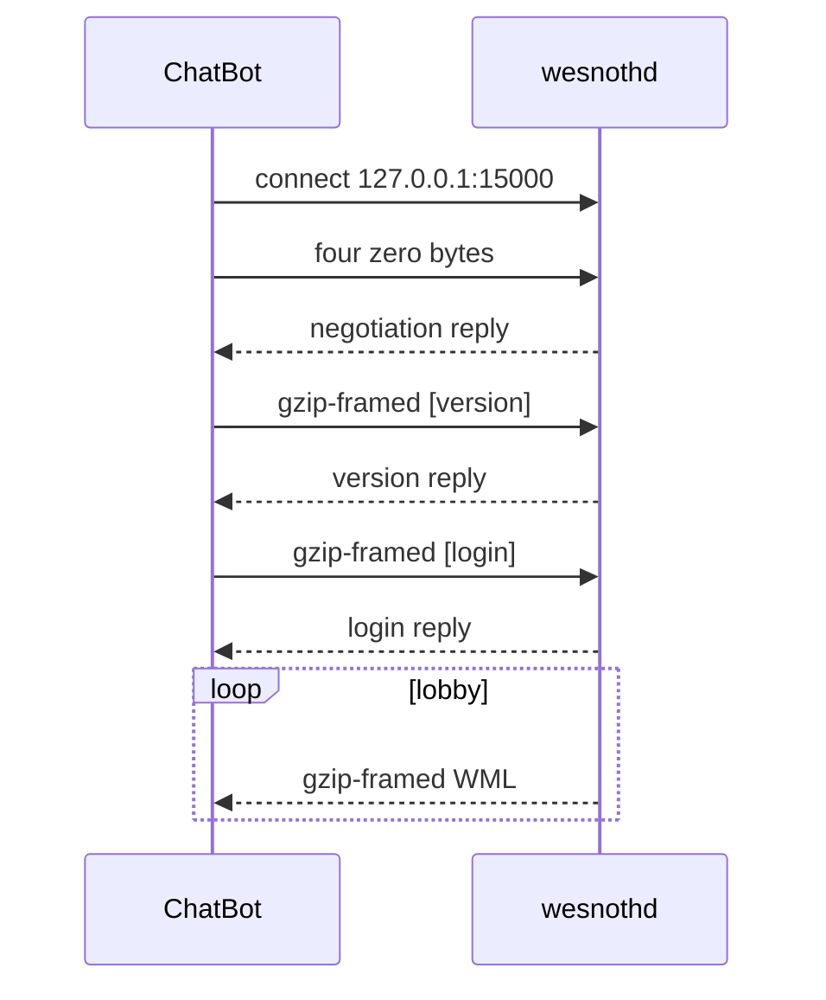
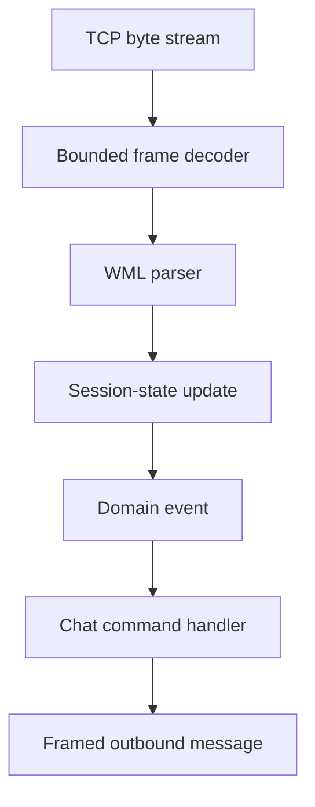
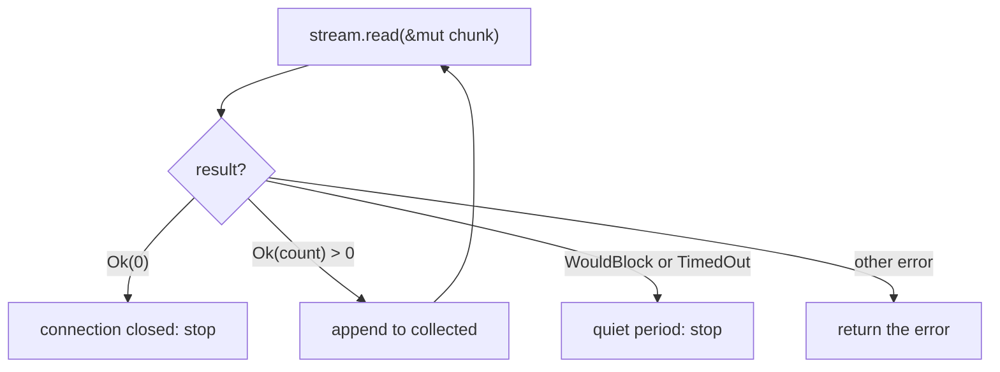

import { Accordion, GitHub, Steps } from '../../../../components/kit';

import LessonVideo from '../../../../components/LessonVideo.astro';

import MemoryStrip from '../../../../components/MemoryStrip.astro';
import AnimatedFlow from '../../../../components/AnimatedFlow.astro';

## What we are building

Run `wesnothd.exe` on your own computer, connect a client named **ChatBot**, and make it answer `\wave` with **Hello!** in the lobby.

This is not a toy protocol. It uses the exact flow we reversed from Wesnoth 1.14.9:



Keep transport, decoding, session meaning, and behavior as separate layers. One
incoming message should travel through the pipeline before any reply is built:

<AnimatedFlow
  nativeDiagram
  title="Trace one chat message through the client"
  stages={[
    { label: 'Receive bytes', detail: 'TCP supplies bytes without message boundaries.', role: 'input', value: 'byte stream', nodes: ['A'] },
    { label: 'Recover a frame', detail: 'The decoder waits for one complete bounded message.', role: 'process', value: 'complete frame', nodes: ['B'] },
    { label: 'Parse WML', detail: 'Structure turns the payload into named fields.', role: 'process', value: 'parsed message', nodes: ['C'] },
    { label: 'Update the session', detail: 'The client records the state needed to interpret the event.', role: 'state', value: 'session state', nodes: ['D'] },
    { label: 'Create a domain event', detail: 'A game-level event separates protocol syntax from behavior.', role: 'process', value: 'chat event', nodes: ['E'] },
    { label: 'Handle the command', detail: 'The bot decides whether the chat text requests a reply.', role: 'process', value: 'reply decision', nodes: ['F'] },
    { label: 'Send a frame', detail: 'The response is encoded and framed for the stream.', role: 'output', value: 'outbound message', nodes: ['G'] },
  ]}
  caption="This follows one chat command from unframed TCP bytes to a framed reply; each layer gives the next one a narrower meaning."
>

</AnimatedFlow>

This separation lets a malformed frame fail before it reaches chat behavior,
and it lets the command handler work with events instead of raw network bytes.

## Connect with timeouts

Before reading protocol bytes, the client needs a connection that cannot
silently drift to another host or wait forever for a stalled local server.
`connect_local` accepts one socket address, checks that it is the course
loopback endpoint, then sets finite connect, read, and write waits:

```rust
use std::{
    io::{self, Read, Write},
    net::{SocketAddr, TcpStream},
    time::Duration,
};

const MAX_FRAME: usize = 1_048_576;

fn connect_local(address: SocketAddr) -> io::Result<TcpStream> {
    if !address.ip().is_loopback() || address.port() != 15_000 {
        return Err(io::Error::new(
            io::ErrorKind::PermissionDenied,
            "this Wesnoth lab connects only to loopback port 15000",
        ));
    }

    let stream = TcpStream::connect_timeout(&address, Duration::from_secs(3))?;
    stream.set_read_timeout(Some(Duration::from_secs(5)))?;
    stream.set_write_timeout(Some(Duration::from_secs(5)))?;
    Ok(stream)
}
```

The timeout prevents a broken server or parser from hanging the bot forever.

## Read and write exact frames

Lesson 8.3’s `encode_wesnoth_frame` performs the gzip compression and adds the four-byte big-endian length. `write_all` matters because one `write` may send only part of a buffer.

<MemoryStrip
  cells="byte 0-3=`u32` length, big-endian|byte 4..=gzip-compressed WML, that many bytes"
  caption="The frame `read_frame` parses below. It trusts only the four-byte header at first, then reads exactly `length` more bytes before decompressing."
/>

The two helpers implement the strip in opposite directions. `send_wml`
frames text and writes all bytes; `read_frame` reads the four-byte length,
checks the cap, then reads that many payload bytes before a decoder sees
them. A short TCP read is normal, so both paths use the exact-read/write
operations:

```rust
fn send_wml(stream: &mut TcpStream, wml: &str) -> anyhow::Result<()> {
    let frame = encode_wesnoth_frame(wml)?;
    stream.write_all(&frame)?;
    stream.flush()?;
    Ok(())
}

fn read_frame(stream: &mut TcpStream) -> io::Result<Vec<u8>> {
    let mut header = [0_u8; 4];
    stream.read_exact(&mut header)?;
    let length = u32::from_be_bytes(header) as usize;
    if length > MAX_FRAME {
        return Err(io::Error::new(io::ErrorKind::InvalidData, "frame too large"));
    }

    let mut frame = Vec::with_capacity(4 + length);
    frame.extend_from_slice(&header);
    frame.resize(4 + length, 0);
    stream.read_exact(&mut frame[4..])?;
    Ok(frame)
}
```

`read_exact` handles TCP fragmentation. It does not assume one receive call equals one Wesnoth message.

## Handle early server replies

The opening negotiation is special, so collect its replies until a short quiet period. The historical capture received 41 bytes.



This quiet-period reader is only for the unframed negotiation reply. It
collects successive TCP reads until the server closes or pauses briefly,
while the size cap prevents an unexpected reply from growing forever.
After login, `read_frame` uses the protocol's length field instead:

```rust
fn read_server_batch(stream: &mut TcpStream) -> io::Result<Vec<u8>> {
    stream.set_read_timeout(Some(Duration::from_millis(250)))?;
    let mut collected = Vec::new();
    let mut chunk = [0_u8; 512];

    loop {
        match stream.read(&mut chunk) {
            Ok(0) => break,
            Ok(count) => {
                collected.extend_from_slice(&chunk[..count]);
                if collected.len() > MAX_FRAME {
                    return Err(io::Error::new(io::ErrorKind::InvalidData, "reply too large"));
                }
            }
            Err(error)
                if matches!(
                    error.kind(),
                    io::ErrorKind::WouldBlock | io::ErrorKind::TimedOut
                ) => break,
            Err(error) => return Err(error),
        }
    }

    stream.set_read_timeout(Some(Duration::from_secs(5)))?;
    Ok(collected)
}
```

Keep this helper for negotiation only. Once the session is in the lobby, use the frame reader.

## Perform the Wesnoth 1.14.9 login

The parser and frame writer now have a concrete job. The course server first
expects four zero negotiation bytes, then a version message and a login
message in compressed WML frames. `log_in` sends them in that order and reads
each reply before advancing; a nickname is validated before it enters WML:

```rust
fn log_in(stream: &mut TcpStream, nickname: &str) -> anyhow::Result<()> {
    let nickname = simple_field(nickname)?;

    // The first message is not compressed or length-prefixed.
    stream.write_all(&[0, 0, 0, 0])?;
    let reply = read_server_batch(stream)?;
    anyhow::ensure!(!reply.is_empty(), "server did not negotiate");

    send_wml(
        stream,
        "[version]\nversion=\"1.14.9\"\n[/version]",
    )?;
    let _version_reply = read_server_batch(stream)?;

    send_wml(
        stream,
        &format!("[login]\nusername=\"{nickname}\"\n[/login]"),
    )?;
    let _login_reply = read_server_batch(stream)?;
    Ok(())
}
```

If the server rejects the version, compare the decompressed frame with the one produced by the official 1.14.9 client. Do not randomly change compressed bytes; fix the WML and recompress it.

## Answer `\wave`

Once the login succeeds, the client announces itself and loops over framed
server messages. A decoded `\wave` event will produce the reply described
above; ordinary messages leave the connection running:

```rust
fn run(address: SocketAddr, nickname: String) -> anyhow::Result<()> {
    let mut stream = connect_local(address)?;
    log_in(&mut stream, &nickname)?;

    let nickname = simple_field(&nickname)?;
    send_wml(
        &mut stream,
        &format!(
            "[message]\nmessage=\"ChatBot connected\"\nroom=\"lobby\"\nsender=\"{nickname}\"\n[/message]"
        ),
    )?;

    loop {
        let frame = read_frame(&mut stream)?;
        let wml = decode_wesnoth_frame(&frame)?;
        println!("{wml}");

        if wml.contains("message=\"\\wave\"") {
            send_wml(
                &mut stream,
                &format!(
                    "[message]\nmessage=\"Hello!\"\nroom=\"lobby\"\nsender=\"{nickname}\"\n[/message]"
                ),
            )?;
        }
    }
}
```

## Prove the bot works

<Steps>

1. Start `wesnothd.exe`.
2. Run the client with address `127.0.0.1:15000` and nickname `ChatBot`.
3. Join `localhost:15000` from the normal Wesnoth client.
4. Type `\wave` in the lobby.
5. Confirm **Hello!** appears from ChatBot.

</Steps>

That visible lobby response proves the real negotiation, version, login, gzip framing, Simple WML, receive loop, and command logic all work together.

## Keep it well behaved

Limit message length, respond at most once per command frame, add a short send rate limit, and exit cleanly when the local server closes. A parser error should print the frame size and stop; it should not enter an automatic reconnect storm.

## Run the complete bot

After building the workspace, start the course `wesnothd.exe` on port 15000 and run:

```powershell
.\target\i686-pc-windows-msvc\release\wesnoth_chatbot.exe ChatBot
```

The full client is [`wesnoth_chatbot.rs`](/windows-labs/src/bin/wesnoth_chatbot.rs). The framing/parser it imports is [`wesnoth_protocol.rs`](/windows-labs/src/wesnoth_protocol.rs). Together they implement the real loopback connection, timeouts, four-zero negotiation, version frame, login frame, lobby receive loop, `\wave` recognition, and `Hello!` reply.

<Accordion title="Complete lab source: wesnoth_chatbot.rs">

<GitHub path="windows-labs/src/bin/wesnoth_chatbot.rs" />

```rust
use std::{
    io::{self, Read, Write},
    net::{IpAddr, Ipv4Addr, SocketAddr, TcpStream},
    time::Duration,
};

use anyhow::{Context, Result};
use gha_windows_labs::wesnoth_protocol::{
    MAX_FRAME, decode_frame, read_frame, send_wml, simple_field,
};

fn read_server_batch(stream: &mut TcpStream) -> io::Result<Vec<u8>> {
    stream.set_read_timeout(Some(Duration::from_millis(250)))?;
    let mut collected = Vec::new();
    let mut chunk = [0_u8; 512];
    loop {
        match stream.read(&mut chunk) {
            Ok(0) => break,
            Ok(count) => {
                collected.extend_from_slice(&chunk[..count]);
                if collected.len() > MAX_FRAME {
                    return Err(io::Error::new(
                        io::ErrorKind::InvalidData,
                        "reply is too large",
                    ));
                }
            }
            Err(error)
                if matches!(
                    error.kind(),
                    io::ErrorKind::WouldBlock | io::ErrorKind::TimedOut
                ) =>
            {
                break;
            }
            Err(error) => return Err(error),
        }
    }
    stream.set_read_timeout(Some(Duration::from_secs(5)))?;
    Ok(collected)
}

fn log_in(stream: &mut TcpStream, nickname: &str) -> Result<()> {
    let nickname = simple_field(nickname)?;
    stream.write_all(&[0, 0, 0, 0])?;
    anyhow::ensure!(
        !read_server_batch(stream)?.is_empty(),
        "server did not negotiate"
    );

    send_wml(stream, "[version]\nversion=\"1.14.9\"\n[/version]")?;
    anyhow::ensure!(
        !read_server_batch(stream)?.is_empty(),
        "server did not answer version"
    );

    send_wml(
        stream,
        &format!("[login]\nusername=\"{nickname}\"\n[/login]"),
    )?;
    let _login_reply = read_server_batch(stream)?;
    Ok(())
}

fn main() -> Result<()> {
    let nickname = std::env::args().nth(1).unwrap_or_else(|| "ChatBot".into());
    simple_field(&nickname)?;
    let address = SocketAddr::new(IpAddr::V4(Ipv4Addr::LOCALHOST), 15_000);
    let mut stream = TcpStream::connect_timeout(&address, Duration::from_secs(3))
        .context("start local wesnothd.exe on port 15000 first")?;
    stream.set_read_timeout(Some(Duration::from_secs(5)))?;
    stream.set_write_timeout(Some(Duration::from_secs(5)))?;
    log_in(&mut stream, &nickname)?;
    send_wml(
        &mut stream,
        &format!(
            "[message]\nmessage=\"ChatBot connected\"\nroom=\"lobby\"\nsender=\"{nickname}\"\n[/message]"
        ),
    )?;
    println!("{nickname} joined the local Wesnoth lobby. Type \\wave from a normal client.");

    loop {
        let frame = match read_frame(&mut stream) {
            Ok(frame) => frame,
            Err(error) if error.kind() == io::ErrorKind::UnexpectedEof => break,
            Err(error) => return Err(error.into()),
        };
        let wml = decode_frame(&frame)?;
        println!("{wml}");
        if wml.contains("message=\"\\wave\"") {
            send_wml(
                &mut stream,
                &format!(
                    "[message]\nmessage=\"Hello!\"\nroom=\"lobby\"\nsender=\"{nickname}\"\n[/message]"
                ),
            )?;
        }
    }
    Ok(())
}
```

</Accordion>

The reusable gzip/WML framing stays in one tested protocol module; this file owns the session state. That split is intentional: byte framing should not know what `\wave` means, and chat behavior should not reimplement gzip.

<LessonVideo
  title="An external client answering Wesnoth chat"
  src="/assets/images/6/4/chat.mp4"
  duration="11 seconds"
  caption="The original external-client demonstration shows a chat command receiving a reply. The visible exchange depends on the earlier connection, negotiation, login, frame decoding, and command handling; a valid message alone is not a complete client."
/>

This bot owns its own server connection. Lesson 8.6 puts a relay between the official client and the same local server, so we can observe an existing conversation before choosing one bounded change.
