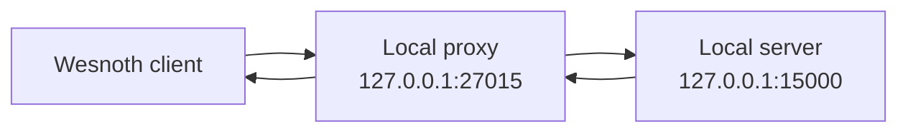

import MarginNote from '../../../../components/kit/MarginNote.astro';
import { Accordion, Badge, Frame, GitHub } from '../../../../components/kit';
import SortBoard from '../../../../components/SortBoard.astro';

## What a proxy does

A local TCP proxy accepts a client connection, opens a connection to your local server, and relays bytes both ways.

<MarginNote kind="brief">A relay preserves both directions of the conversation while providing a place to observe their bytes.</MarginNote>



Begin as a transparent relay. If the protocol fails before you modify anything, fix the relay first.
This first version treats bytes as bytes. Only after it passes the normal
Wesnoth login should the proxy switch to the framed, message-aware upstream
path below. The two modes have different failure behavior: a transparent relay
does not need to decode; a message-aware relay must decide what to do when
decoding fails.

## Restrict both endpoints

A proxy is easy to connect to the wrong service if an address is copied from
a different test. Validate both endpoints as loopback addresses before
opening either connection; this helper returns the accepted address so the
caller cannot forget which one passed the check:

```rust
use std::net::{IpAddr, SocketAddr};

fn require_loopback(address: SocketAddr) -> anyhow::Result<SocketAddr> {
    anyhow::ensure!(
        address.ip() == IpAddr::V4(std::net::Ipv4Addr::LOCALHOST)
            || address.ip() == IpAddr::V6(std::net::Ipv6Addr::LOCALHOST),
        "proxy endpoints must be loopback addresses"
    );
    Ok(address)
}
```

This course proxy is intentionally not a general remote interception tool.

<SortBoard board="loopback-check" label="Explore which endpoints the proxy accepts" />

## Relay one direction

The standard library can copy a stream until EOF:

```rust
use std::{io, net::TcpStream};

fn relay(mut source: TcpStream, mut destination: TcpStream) -> io::Result<u64> {
    io::copy(&mut source, &mut destination)
}
```

TCP is full duplex, so run two relays:

```rust
fn proxy_pair(client: TcpStream, server: TcpStream) -> anyhow::Result<()> {
    let client_to_server = client.try_clone()?;
    let server_to_client = server.try_clone()?;

    let upstream = std::thread::spawn(move || relay(client_to_server, server));
    let downstream = std::thread::spawn(move || relay(server_to_client, client));

    upstream.join().map_err(|_| anyhow::anyhow!("upstream relay panicked"))??;
    downstream.join().map_err(|_| anyhow::anyhow!("downstream relay panicked"))??;
    Ok(())
}
```

For many connections, an async runtime such as Tokio scales better. Threads keep the first lab easy to see.

## Half-closes matter

One direction can reach EOF while the other still has data to send. A reliable
local Wesnoth proxy should use `shutdown(Write)` on the destination after that
relay finishes, then let the server-to-client relay deliver any remaining game
messages before both sockets close.


<MarginNote kind="alternative">One side can stop speaking while still listening. Closing both directions immediately discards that distinction.</MarginNote>
## Log metadata, not unlimited payloads

Useful bounded log lines include:

```text
connection opened
client → server: 142 bytes
server → client: 68 bytes
connection closed
```

If you parse frame previews, cap their length and avoid logging secrets or full chat histories by default.

## Diagnose handshake failures

<Frame caption="A failed local handshake.">


</Frame>

When a transparent proxy fails, compare direct and proxied captures:

- Did both directions start?
- Were bytes changed or dropped?
- Did the client send the server’s port or address inside the protocol?
- Is there TLS (Transport Layer Security, the encryption behind HTTPS) or a certificate bound to a hostname?
- Did a relay block because it waited for EOF?
- Did one side expect a UDP companion channel?

<div class="diagram-on-dark">


</div>

Do not bypass certificate validation. For encrypted protocols, create a development configuration with certificates you control.

## Parse without changing

The safest next step is a **tee**:

```text
read bytes
→ feed a copy to a bounded parser/log channel
→ forward the original bytes unchanged
```

Keep parsing off the relay’s critical path. If the parser cannot keep up, drop log entries rather than blocking the connection.
This tee is for **observation**. It cannot decide where to insert a new
message, because a TCP read does not identify a frame boundary. The insertion
path therefore waits for a complete bounded frame and handles parse errors
explicitly.


<MarginNote kind="narration">Observing first provides a baseline: later edits can be compared against traffic that the relay already handled correctly.</MarginNote>
## Inject a real local Wesnoth chat response

The original lab used proxy port `27015` and server port `15000`. Start `wesnothd.exe`, start the local proxy, then tell Wesnoth to connect to `localhost:27015`. Reaching the normal lobby through the proxy proves both directions work.

For injection, one task must own the upstream writer so two threads cannot interleave bytes. After the special four-zero negotiation has passed, have the client-to-server path read one complete Wesnoth frame at a time. Forward the original bytes unchanged, but inspect a decoded copy:

```rust
use std::io::Write;

fn forward_with_chat_hook(
    client: &mut TcpStream,
    server: &mut TcpStream,
) -> anyhow::Result<()> {
    loop {
        // 📦 `read_frame` returns one complete length-prefixed message. A plain
        // `read` here could split one frame or combine several frames.
        let original = read_frame(client)?;
        // A decode error stops this modified upstream path before sending this frame.
        // The transparent relay above has no such dependency on parsing.
        let decoded = decode_wesnoth_frame(&original)?;

        // 📦 Preserve the legitimate game packet exactly as captured and send
        // it first; inspecting a copy must not silently replace normal traffic.
        server.write_all(&original)?;

        if decoded.contains("message=\"\\wave\"") {
            // 🔒 This task is the sole owner of `server`, so the original and
            // injected frames cannot be interleaved by the reverse relay.
            let injected = encode_chat("ChatBot", "Hello!")?;
            server.write_all(&injected)?;
        }
        server.flush()?;
    }
}
```

Keep the server-to-client direction as an ordinary transparent relay. The handshake needs one small state flag because its first four zero bytes are not a gzip frame; forward those four bytes directly before switching the upstream parser into framed mode.

The `contains` check is enough only for this controlled one-command fixture.
It could match that text inside an unrelated WML field. A general proxy
should parse the WML tree from Lesson 8.3 and inspect the actual chat-message
field and session state before inserting a response. The complete lab below
uses the same narrow shortcut, so do not treat it as a general message router.

Now send `\wave` from the real Wesnoth client. The server receives both the original command and the injected **Hello!** message on the already authenticated connection. This is the practical advantage of the proxy: the official client performs its own login while the proxy observes and modifies the loopback traffic.

## Verify the proxy

The local proxy is correct when:

- direct and proxied sessions behave the same;
- byte counts agree with a packet capture;
- either side closing ends the session cleanly;
- an undecodable frame in the message-aware mode returns a clear error before
  that frame is forwarded; `proxy_pair` then shuts down both sockets before
  waiting for the reverse relay. A separate transparent mode could relay bytes
  without decoding them;
- non-loopback endpoints are rejected;
- the only modification is the documented `\wave` response;
- removing both decoding and injection returns the proxy to byte-for-byte
  transparent behavior.

## Run the complete proxy

<Badge text="Windows VM" variant="note" />

Start `wesnothd.exe` on its normal local port, then run:

```powershell
.\target\i686-pc-windows-msvc\release\wesnoth_proxy.exe
```

Connect the official Wesnoth 1.14.9 client to `localhost:27015`. Type `\wave` after login and confirm the injected `Hello!` appears. The complete two-direction relay is [`wesnoth_proxy.rs`](/windows-labs/src/bin/wesnoth_proxy.rs). It binds only to loopback, forwards the unframed negotiation, parses bounded upstream frames, preserves each original frame, injects through the single upstream writer, half-closes both directions, and keeps the server-to-client stream transparent.

<Accordion title="Complete lab source: wesnoth_proxy.rs">

<GitHub path="windows-labs/src/bin/wesnoth_proxy.rs" />

```rust
use std::{
    io::{self, Read, Write},
    net::{IpAddr, Ipv4Addr, Shutdown, SocketAddr, TcpListener, TcpStream},
    thread,
    time::Duration,
};

use anyhow::{Context, Result};
use gha_windows_labs::wesnoth_protocol::{decode_frame, encode_chat, read_frame};

fn loopback(port: u16) -> SocketAddr {
    SocketAddr::new(IpAddr::V4(Ipv4Addr::LOCALHOST), port)
}

fn upstream(mut client: TcpStream, mut server: TcpStream) -> Result<()> {
    // ⚠️ The negotiation request is the protocol's one unframed client message.
    let mut negotiation = [0_u8; 4];
    client.read_exact(&mut negotiation)?;
    anyhow::ensure!(negotiation == [0, 0, 0, 0], "unexpected negotiation bytes");
    server.write_all(&negotiation)?;
    server.flush()?;

    loop {
        let frame = match read_frame(&mut client) {
            Ok(frame) => frame,
            // ✅ EOF stops this direction before any incomplete frame is forwarded.
            Err(error) if error.kind() == io::ErrorKind::UnexpectedEof => break,
            Err(error) => return Err(error.into()),
        };
        let decoded = decode_frame(&frame)?;
        // 🔁 Forward the authentic frame even when it does not trigger the lab.
        server.write_all(&frame)?;
        if decoded.contains("message=\"\\wave\"") {
            server.write_all(&encode_chat("ChatBot", "Hello!")?)?;
        }
        server.flush()?;
    }
    // 🧹 Signal “no more client bytes” while leaving the read half available
    // for the downstream task to drain the server's final response.
    server.shutdown(Shutdown::Write)?;
    Ok(())
}

fn downstream(mut server: TcpStream, mut client: TcpStream) -> Result<()> {
    io::copy(&mut server, &mut client)?;
    client.shutdown(Shutdown::Write)?;
    Ok(())
}

fn proxy_pair(client: TcpStream) -> Result<()> {
    let server = TcpStream::connect_timeout(&loopback(15_000), Duration::from_secs(3))
        .context("start local wesnothd.exe on port 15000 first")?;
    client.set_read_timeout(Some(Duration::from_secs(30)))?;
    client.set_write_timeout(Some(Duration::from_secs(5)))?;
    server.set_read_timeout(Some(Duration::from_secs(30)))?;
    server.set_write_timeout(Some(Duration::from_secs(5)))?;

    // 🔀 Clones share each socket but each thread owns one traffic direction.
    // Only `upstream` ever writes to the game server, preserving frame order.
    let client_control = client.try_clone()?;
    let server_control = server.try_clone()?;
    let upstream_client = client.try_clone()?;
    let downstream_server = server.try_clone()?;
    let up = thread::spawn(move || upstream(upstream_client, server));
    let down = thread::spawn(move || downstream(downstream_server, client));
    let upstream_result = up
        .join()
        .map_err(|_| anyhow::anyhow!("upstream thread panicked"))
        .and_then(|result| result);
    if upstream_result.is_err() {
        let _ = client_control.shutdown(Shutdown::Both);
        let _ = server_control.shutdown(Shutdown::Both);
    }
    let downstream_result = down
        .join()
        .map_err(|_| anyhow::anyhow!("downstream thread panicked"))
        .and_then(|result| result);
    upstream_result?;
    downstream_result?;
    Ok(())
}

fn main() -> Result<()> {
    let listener = TcpListener::bind(loopback(27_015))?;
    println!("Wesnoth proxy listening on 127.0.0.1:27015 -> 127.0.0.1:15000");
    println!("Connect the official 1.14.9 client to localhost:27015.");
    for connection in listener.incoming() {
        let client = connection?;
        anyhow::ensure!(
            client.peer_addr()?.ip().is_loopback(),
            "client is not loopback"
        );
        if let Err(error) = proxy_pair(client) {
            eprintln!("session ended: {error:#}");
        }
    }
    Ok(())
}
```

</Accordion>

Only the upstream task writes to the server. That single-writer rule prevents the original frame and injected frame from being interleaved. The downstream task stays byte-for-byte transparent, so one experimental hook cannot accidentally rewrite both directions.

The proxy needs TCP because its two endpoints are network clients. When two cooperating programs run on the same computer, they can exchange the same kind of bounded message through shared memory or a named pipe instead. Lessons 8.7–8.8 compare those local transports.
