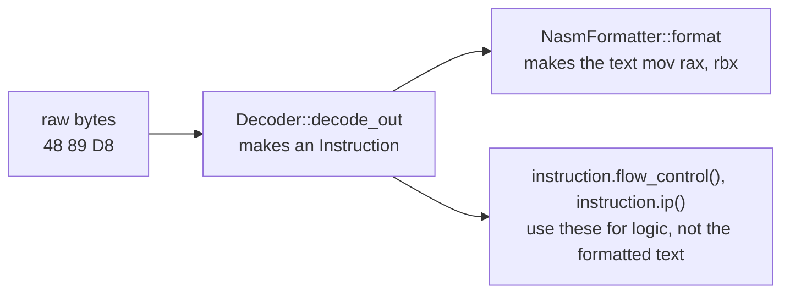
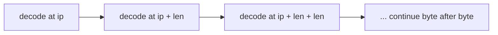
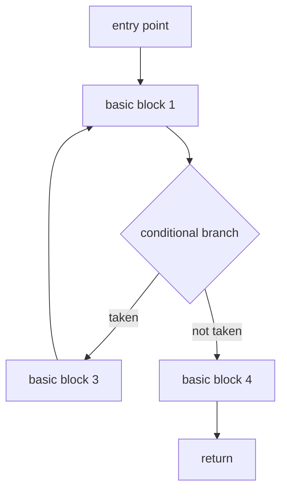

import SimLab from '../../../../components/SimLab.astro';
import { Frame, GitHub, HexDisassemblyInspector } from '../../../../components/kit';

import MemoryStrip from '../../../../components/MemoryStrip.astro';
import MarginNote from '../../../../components/kit/MarginNote.astro';

For an unfamiliar operation, use the [instruction reference](/pages/2/10/):
it explains operand forms, changed values and flags, with an adjustable
worked trace for each instruction.

## What a disassembler is for

Lesson 5.5 followed changing gold through data addresses. The next question is which machine instruction reads or writes that field. We can copy a bounded code range, but raw bytes alone do not show where one instruction ends or what operation it performs.

The CPU executes machine-code bytes. Humans prefer names such as `mov`, `call`,
and `jne`. A **disassembler** decodes bytes into instruction records and then
formats those records as assembly text.

<MarginNote kind="brief">Use assembly to identify operations, then observe the running target to connect those operations to game behavior.</MarginNote>

It does not recover the original source. Compiler variable names,
comments, generic types, and most high-level structure are normally gone. A
disassembler can show that four bytes at `[ebx+0x30]` are subtracted, but it
cannot say that `ebx` points at a side's data and `0x30` is the offset of its
gold. That link comes from the running game: the instruction runs exactly when
that side's gold drops.

Machine code preserves operations more reliably than it preserves intent. Two different source programs can compile to similar instructions, and one source construct can compile differently across optimization levels. Assembly shows exactly what the machine does, not why the programmer wrote it.

An instruction can be described at three levels:

- **mechanics:** which registers, memory locations, and flags can it change;
- **data flow:** where its inputs came from and where its outputs are used;
- **program meaning:** which game behavior it implements.

The decoder answers the first. Control-flow and data-flow analysis answer the second. Only the running target can establish the third.

A **decoder** answers structural questions: instruction length, operands,
registers, immediate values, memory addressing, and flow control. A
**formatter** chooses spelling and style, such as NASM or Intel syntax. Tooling
should use decoded fields for logic rather than parsing the displayed string
back into facts.



## Decoding is harder than formatting

A disassembler does two jobs:

1. decode bytes into an instruction;
2. format that instruction as readable assembly.

x86 instructions have prefixes, several opcode maps, ModR/M and SIB bytes, displacements, immediates, and different modes. Hand-decoding `add` is a good exercise. A complete decoder is a major engineering project.

<Frame caption="Instruction lengths decide the next start">
  
</Frame>

Very roughly:

- an **opcode** selects an operation;
- a **prefix** modifies size, repetition, locking, or another property;
- a **ModR/M byte** helps describe register and memory operands;
- a **SIB byte** can describe scaled index addressing;
- a **displacement** is an encoded offset;
- an **immediate** is a value stored directly in the instruction.

Not every instruction contains every piece. Their variable length is why a
detour must decode whole instructions before deciding how many bytes to replace.

<MemoryStrip
  cells="=48|=89|=D8|=C3"
  groups="0-2:`mov rax, rbx` — REX prefix + opcode + ModR/M|3-3:`ret` — opcode only"
  caption="The test bytes from `decodes_simple_64_bit_function` later in this lesson. Here `48 89 D8` encodes `mov rax, rbx` in 64-bit mode, followed by `C3` for `ret`. For comparison, Lesson 2.3's `B8 19 00 00 00` encoded `mov eax, 25` in 32-bit mode. An opcode selects an operation; a prefix or ModR/M byte appears only when that instruction needs it."
/>

<HexDisassemblyInspector />

### A small opcode lookup table

These are **complete encodings in 32-bit mode**, with hexadecimal bytes and
decimal assembly operands. They are examples, not every form of each instruction:

| Machine-code bytes | Assembly | How to read the bytes |
|---|---|---|
| `B8 19 00 00 00` | `mov eax, 25` | `B8` selects EAX; the next four bytes hold 25, little-endian |
| `83 C0 01` | `add eax, 1` | `83` plus ModR/M `C0` selects addition to EAX; `01` is the immediate |
| `83 E8 01` | `sub eax, 1` | The same `83`, with ModR/M `E8`, selects subtraction |
| `31 C0` | `xor eax, eax` | `31` selects XOR; ModR/M names EAX as both operands, clearing it |
| `39 D8` | `cmp eax, ebx` | Compare EAX with EBX by setting flags; neither register is changed |
| `74 02` | `je next_ip + 2` | Jump two bytes past the next instruction address when ZF is 1 |
| `50` | `push eax` | In this mode, decrease ESP by four and store EAX on the stack |
| `58` | `pop eax` | Read four stack bytes into EAX and increase ESP by four |
| `C3` | `ret` | Pop a return address into EIP and resume there |

Notice that `83` alone does not distinguish `add` from `sub`. A ModR/M byte
has three fields: **mod**, **reg**, and **r/m**, containing 2, 3, and 3 bits.
Here `C0` is `11 000 000`, while `E8` is `11 101 000`. For this opcode,
`11` chooses a register operand, the middle field selects addition (`000`)
or subtraction (`101`), and the final `000` names EAX. In other instructions,
the middle field can name a second register instead.

<MarginNote kind="brief">The opcode is only part of an instruction. Read its operand form and CPU mode before interpreting the following bytes.</MarginNote>

For complete forms and flag effects, consult
[Intel's instruction manuals](https://www.intel.com/content/www/us/en/developer/articles/technical/intel-sdm.html).
**Bytecode** is a separate instruction format designed for a software interpreter;
its numeric opcodes need not match x86. The
[toy CPU's encoding table](/pages/14/11/#a-toy-8-bit-cpu) shows that distinction with
seven deliberately simple operations.

For our tool, use `iced-x86`.

```toml
[dependencies]
iced-x86 = "1"
```

## Decode a byte slice

The decoder needs the byte slice, the target's CPU bitness, and the address
where those bytes execute. That address lets it print meaningful destinations
for relative branches; it does not change the copied bytes. The function
below returns one formatted line per decoded instruction:

<MarginNote kind="alternative">Copied bytes are a photograph of a street; the start address supplies its location so relative directions lead to the right destination.</MarginNote>

```rust
use iced_x86::{
    Decoder, DecoderOptions, Formatter, Instruction, NasmFormatter,
};

fn disassemble(bytes: &[u8], bitness: u32, start_ip: u64) -> anyhow::Result<Vec<String>> {
    // 🛡️ The same bytes decode differently in different CPU modes. Refuse a
    // guessed value before the decoder can produce convincing nonsense.
    anyhow::ensure!(matches!(bitness, 16 | 32 | 64), "invalid bitness");

    // 🧭 `start_ip` gives relative branches their real live destination; it does
    // not say where this local byte slice is stored in the analysis tool.
    let mut decoder = Decoder::with_ip(
        bitness,
        bytes,
        start_ip,
        DecoderOptions::NONE,
    );
    let mut formatter = NasmFormatter::new();
    formatter.options_mut().set_digit_separator("`");
    formatter.options_mut().set_first_operand_char_index(10);

    // ♻️ Reuse these allocations inside the loop; a large code section may
    // contain thousands of instructions.
    let mut instruction = Instruction::default();
    let mut formatted = String::new();
    let mut lines = Vec::new();

    while decoder.can_decode() {
        decoder.decode_out(&mut instruction);
        formatted.clear();
        formatter.format(&instruction, &mut formatted);

        // 📏 Convert the decoder's virtual IP back into an index only after the
        // decoder has advanced, then validate the complete instruction range.
        let offset = usize::try_from(instruction.ip() - start_ip)?;
        let end = offset.checked_add(instruction.len())
            .context("instruction range overflowed")?;
        let raw = bytes.get(offset..end)
            .context("decoder produced an out-of-range instruction")?;
        let raw_hex = raw.iter()
            .map(|byte| format!("{byte:02X}"))
            .collect::<String>();

        lines.push(format!(
            "{:016X} {:<24} {}",
            instruction.ip(),
            raw_hex,
            formatted,
        ));
    }

    Ok(lines)
}
```

`Decoder::with_ip` makes relative branches and instruction addresses meaningful.

The instruction pointer passed as `start_ip` does not change the input bytes.
It gives them a location so a relative branch can be reported as its real
destination. Decoding the same bytes at a different address can therefore
produce a different displayed branch target.

## Use the target’s bitness

Decode 32-bit process code as 32-bit and 64-bit process code as 64-bit. The same bytes can mean different things in different modes.

Bitness changes default operand/address sizes and which encodings are valid. It
is a property of the code being decoded, not necessarily of the computer or the
analysis tool. A 64-bit Windows system can run the 32-bit Wesnoth course build.

## Read an executable section

Use your process wrapper and PE parser to:

1. find the target module;
2. locate an executable section such as `.text`;
3. copy a bounded byte range;
4. pass its real virtual start address as `start_ip`.

<Frame caption="A small disassembly listing: addresses, bytes, and instructions.">


</Frame>

Do not decode unreadable gaps as though they were code.

## Instructions are data

iced-x86 exposes more than formatted text:

```rust
use iced_x86::FlowControl;

fn describe_flow(instruction: &Instruction) -> &'static str {
    match instruction.flow_control() {
        FlowControl::Next => "continues",
        FlowControl::ConditionalBranch => "conditional branch",
        FlowControl::UnconditionalBranch => "unconditional branch",
        FlowControl::Call => "call",
        FlowControl::Return => "return",
        _ => "other flow",
    }
}
```

This is more reliable than searching formatted strings for `jmp`.

## Linear sweep versus control flow

The loop above is a **linear sweep**: decode one instruction after another. It may decode data embedded in a code section as nonsense instructions.

<MarginNote kind="narration">A readable instruction listing can still be wrong: bytes belonging to a nearby constant may accidentally resemble valid machine code.</MarginNote>



A control-flow disassembler begins at a known entry point and follows reachable branches and calls. That needs:

- a work queue of addresses;
- a set of visited addresses;
- range checks;
- branch-target extraction;
- an explicit choice to enter callees or continue after calls.

Start linear. Add control flow only after the basic decoder and bounds are solid.

A **basic block** is a straight-line run of instructions with one entry and a control transfer at the end. Connecting blocks by possible jumps creates a control-flow graph. Loops appear as edges that return to an earlier block; `if` statements often appear as a branch whose paths later meet.



The graph still contains uncertainty. An indirect jump may obtain its destination from a table or register, exception handling can create non-obvious edges, and code may be reached only through callbacks. Mark unknown successors instead of pretending the graph is complete.

## Invalid bytes

Decoders can return an invalid instruction. Show it clearly and decide whether to stop or advance by the decoder’s reported length.

Never enter an infinite loop at one bad byte.

## Test known examples

These four bytes have a known 64-bit interpretation: `mov rax, rbx`
followed by `ret`. Passing them with start address `0x1000` should
produce two formatted instructions in that order, so the test checks both
instruction boundaries and basic decoding:

```rust
#[test]
fn decodes_simple_64_bit_function() {
    let bytes = [0x48, 0x89, 0xD8, 0xC3]; // mov rax, rbx; ret
    let lines = disassemble(&bytes, 64, 0x1000).unwrap();
    assert_eq!(lines.len(), 2);
    assert!(lines[0].contains("mov"));
    assert!(lines[1].contains("ret"));
}
```

Add tests for truncated instructions, invalid bitness, a relative branch, 32-bit bytes, and a start address near overflow.

<SimLab sim="toy-assembly" label="Explore toy assembly" />

## What a disassembler can and cannot prove

Use a mature decoder for instruction truth. Spend your effort on the tool around it: safe process reads, section selection, navigation, symbols, and clear error messages.

## Disassemble the real Wesnoth function

The completed binary opens the live 32-bit Wesnoth process, reads `0x50` bytes beginning at the verified lesson address `0x007CCD91`, decodes with a 32-bit iced-x86 decoder, and prints the real address, raw bytes, and NASM-style instruction text:

```powershell
.\target\i686-pc-windows-msvc\release\disassembler.exe
```

It stops on invalid bytes or an out-of-range decode instead of silently inventing output. See the entire tool in [`disassembler.rs`](/windows-labs/src/bin/disassembler.rs) and the checked cross-process read in [`process.rs`](/windows-labs/src/windows_impl/process.rs).

<GitHub path="windows-labs/src/bin/disassembler.rs" />

<GitHub path="windows-labs/src/windows_impl/process.rs" />
