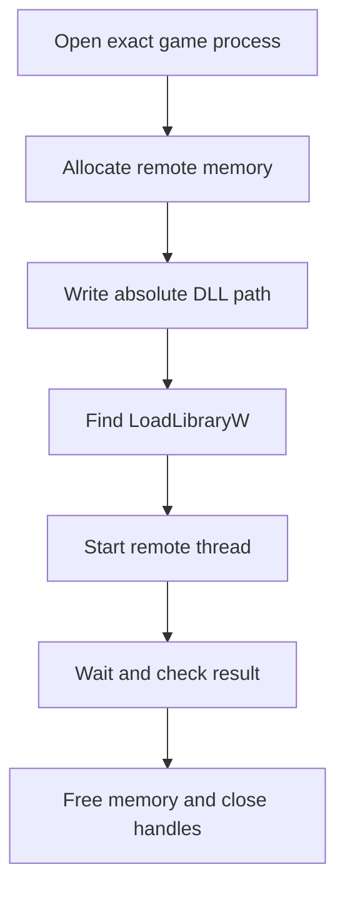
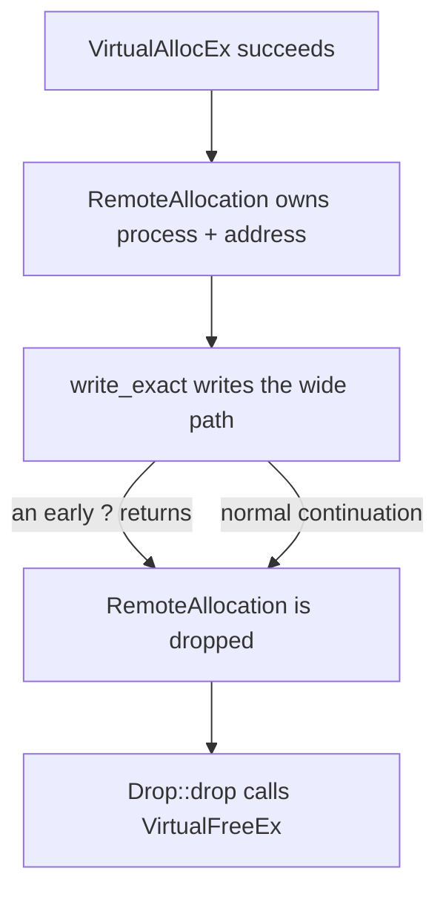
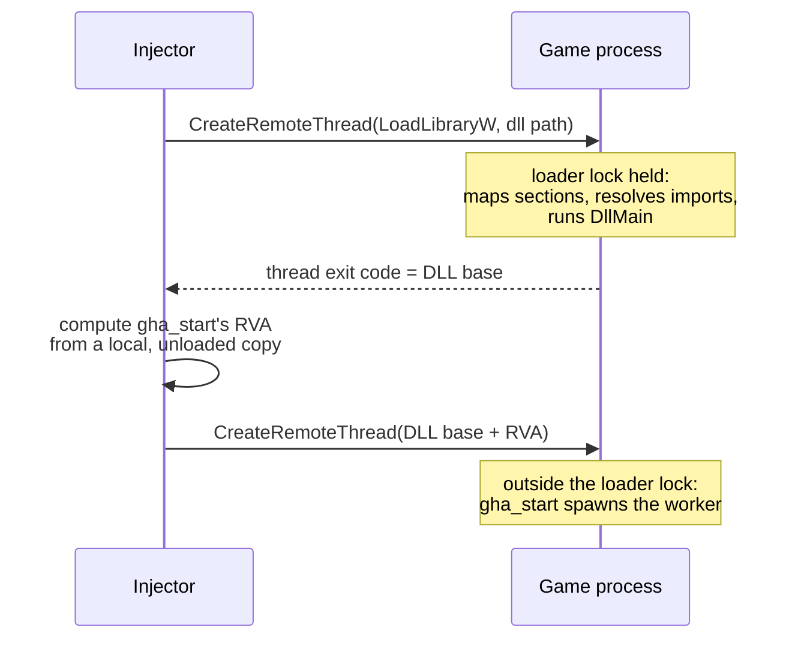

import { Badge, Fields, GitHub, ParamField, ResponseField, Steps } from '../../../../components/kit';
import CodeTrace from '../../../../components/CodeTrace.astro';
import MarginNote from '../../../../components/kit/MarginNote.astro';

## Keep target identity explicit

Lesson 6.2 built a DLL with a tiny `DllMain` and an explicit `gha_start`, but that file is still on disk. To run it inside the course game, the injector must ask the target process to load the exact DLL, wait for loading to finish, and only then call its start function. Every temporary handle and allocation needs an owner along the way.

This injector accepts only the exact target builds used in the book. Put the allowlist in code so a mistyped command cannot select an unrelated process.

```rust
const ALLOWED_TARGETS: &[&str] = &[
    "wesnoth.exe",       // Wesnoth 1.14.9, 32-bit
    "ac_client.exe",     // AssaultCube 1.2.0.2, 32-bit
    "Quake3-UrT.exe",    // Urban Terror 4.3.4, 32-bit
    "flare.exe",         // Flare 1.12, 32-bit course build
    "wyrmsun.exe",       // Wyrmsun 5.0.1, 32-bit course build
];

fn allowed_target(name: &str) -> bool {
    ALLOWED_TARGETS.iter().any(|allowed| allowed.eq_ignore_ascii_case(name))
}
```

This chapter covers the classic Windows loader sequence. Protected-process work and anti-cheat bypasses are separate subjects and are outside this tool's contract.

It is worth knowing that this is one route among several, so you do not mistake
it for the only one. The approaches differ along three axes: who allocates the
memory in the target, what causes the target to start executing it, and —
the important one — whether the Windows loader is involved at all.

This route uses the loader. You hand the target a path and ask it to run
`LoadLibraryW`, and the loader then maps the sections, applies relocations,
resolves imports, prepares thread-local storage, runs `DllMain`, and adds the
module to the process's module list.

That last step is easy to overlook and is precisely why this book takes this
route. Because the loader registers the module, your DLL appears in the
inventory that Lesson 12.1 builds, `GetModuleHandle` can find it, and unloading
runs through the same bookkeeping in reverse. Every step is observable and
reversible.

Routes that avoid the loader have to do the loader's job themselves — walking
the relocation table, resolving each import by hand, and handling TLS — which
is where the PE structure from Lesson 5.1 stops being background reading. They
exist mainly so that a module does not appear in that list, which is a goal
about avoiding detection rather than about understanding the program, and it is
not what this book is for.

## The classic loader sequence



Every box can fail and must clean up what earlier boxes created.

## Use a wide absolute path

Windows `LoadLibraryW` expects a zero-terminated UTF-16 path:

```rust
use std::{os::windows::ffi::OsStrExt, path::Path};

fn wide_path(path: &Path) -> anyhow::Result<Vec<u16>> {
    let absolute = path.canonicalize()?;
    let mut wide: Vec<u16> = absolute.as_os_str()
        .encode_wide()
        .collect();
    wide.push(0);
    Ok(wide)
}
```

A relative path depends on the target’s working directory and is easy to misresolve.

<MarginNote kind="narration">The injector and game may start in different folders. An apparently correct relative filename can therefore select the wrong file or no file.</MarginNote>

## Own remote memory

Model the allocation so cleanup is not optional:



`RemoteAllocation` ties remote-memory release to one Rust owner's lifetime. It stores the
process handle and remote address, then its `Drop` method releases the address
whether the caller finishes normally or returns early with an error.

<MarginNote kind="alternative">Treat a remote allocation as borrowed workspace with a named custodian, responsible for returning it on every exit path.</MarginNote>

```rust
struct RemoteAllocation<'a> {
    process: &'a Process,
    address: *mut std::ffi::c_void,
}

impl Drop for RemoteAllocation<'_> {
    fn drop(&mut self) {
        // SAFETY: this allocation belongs to this process and is released once.
        let _ = unsafe {
            VirtualFreeEx(self.process.raw_handle(), self.address, 0, MEM_RELEASE)
        };
    }
}
```

Allocate and write the path with the actual `windows` crate calls:

```rust
let remote_address = unsafe {
    VirtualAllocEx(
        process.raw_handle(),
        None,
        path_bytes.len(),
        MEM_COMMIT | MEM_RESERVE,
        PAGE_READWRITE,
    )
};
anyhow::ensure!(!remote_address.is_null(), "VirtualAllocEx failed");

let remote_path = RemoteAllocation {
    process: &process,
    address: remote_address,
};
process.write_exact(remote_path.address as usize, path_bytes)?;
```

`Process::write_exact` checks the returned byte count from `WriteProcessMemory`. `RemoteAllocation::drop` pairs the successful allocation with `VirtualFreeEx` even when a later `?` returns early.

<CodeTrace trace="loader-cleanup" />

## Verify every boundary

The high-level loader has several checked steps. One address-sharing assumption in this course version is called out immediately after the code:

```rust
let kernel32 = unsafe { GetModuleHandleW(w!("kernel32.dll")) }?;
let load_library = unsafe { GetProcAddress(kernel32, s!("LoadLibraryW")) }
    .context("kernel32 did not export LoadLibraryW")?;
let start: LPTHREAD_START_ROUTINE =
    Some(unsafe { std::mem::transmute(load_library) });

let thread = unsafe {
    CreateRemoteThread(
        process.raw_handle(),
        None,
        0,
        start,
        Some(remote_path.address.cast_const()),
        0,
        None,
    )
}?;
let thread = OwnedHandle::from_raw(thread)?;
let module_handle = wait_for_thread(&thread, "the LoadLibraryW thread")?;
anyhow::ensure!(module_handle != 0, "LoadLibraryW returned null");
```

Two things about that sequence deserve an explanation, because both look wrong
the first time you read them.

**Why does the sample pass a locally resolved `LoadLibraryW` address to the
game?** `GetProcAddress` returns an address in the injector's process. DLLs
often map at the same base in both processes, which makes this common course
shortcut work, but that is an assumption to check, not a Windows guarantee.
Microsoft documents that a DLL can load at a different base when its preferred
one is unavailable, and `CreateRemoteThread` can even succeed with an invalid
start address before the new thread faults. For a reusable injector, find the
target process's actual system-DLL base, resolve or verify the export at that
base, and refuse to start the thread if the address is not established. The
buildable course injector currently relies on the shared-base assumption in
this exact lab. Never apply its locally obtained address to arbitrary game DLLs.
See [DLL memory protection](https://learn.microsoft.com/en-us/windows/win32/memory/memory-protection)
and [`CreateRemoteThread`](https://learn.microsoft.com/en-us/windows/win32/api/processthreadsapi/nf-processthreadsapi-createremotethread).

**Why can `LoadLibraryW` be used as a thread start routine in this 32-bit lab?**
Both use the Windows system calling convention and take one pointer argument.
Here the `HMODULE` result fits in the thread's 32-bit `DWORD` exit code. The
remote allocation holding the wide path is the argument. The code requires a
nonzero exit code before calculating the DLL-relative `gha_start` address.
This return-value shortcut does not carry over unchanged to a 64-bit injector.

The seven arguments of that `CreateRemoteThread` call, with the value this lab
passes for each:

<Fields title="CreateRemoteThread, argument by argument">
<ParamField name="hProcess" type="handle" required>

The game's process handle, opened with the rights this step needs, including the
right to create a thread.

</ParamField>
<ParamField name="lpThreadAttributes" type="optional" default="None">

Security settings for the new thread's handle. `None` takes the defaults, and the
handle cannot be inherited by child processes.

</ParamField>
<ParamField name="dwStackSize" type="bytes" default="0">

The new thread's stack size. Zero uses the default of the game's executable.

</ParamField>
<ParamField name="lpStartAddress" type="address in the game" required>

Where the thread begins running. Here it is `LoadLibraryW`, which is why the
same-base assumption above matters.

</ParamField>
<ParamField name="lpParameter" type="address in the game">

The one pointer handed to the start routine: the remote allocation that holds the
wide DLL path.

</ParamField>
<ParamField name="dwCreationFlags" type="flags" default="0">

Zero starts the thread at once. `CREATE_SUSPENDED` would create it paused.

</ParamField>
<ParamField name="lpThreadId" type="optional" default="None">

Where to store the new thread's ID. The lab does not need it.

</ParamField>
<ResponseField name="return value" type="thread handle">

The handle of the new thread, which the lab wraps in an owned type so it is always
closed. A thread that starts is not a thread that succeeded: the lab still waits
for it and reads its exit code.

</ResponseField>
</Fields>

The wrapper methods are small `unsafe` boundaries over:

- `OpenProcess`;
- `VirtualAllocEx` / `VirtualFreeEx`;
- `WriteProcessMemory`;
- `CreateRemoteThread`;
- waiting and reading the thread exit code;
- `CloseHandle`.

## Architecture must match

A 32-bit DLL loads into a 32-bit process. A 64-bit DLL loads into a 64-bit process. Check both the loader and target architecture before allocating anything.

<MarginNote kind="brief">Match the DLL and target architectures before remote loading; a valid path cannot repair an incompatible binary.</MarginNote>

For the versions in this book, install the 32-bit compilation target and build the DLL for it:

```powershell
rustup target add i686-pc-windows-msvc
cargo build --release --target i686-pc-windows-msvc
```

Pass the absolute DLL produced under `target\i686-pc-windows-msvc\release\`. A 64-bit injector may still need extra care to inspect a 32-bit target, so the simplest course setup builds the injector as 32-bit too.

## Loader-lock reminder

When the DLL loads, Windows calls its `DllMain` under the loader lock. The course DLL does only one small thing there: `DisableThreadLibraryCalls`. The injector then finds the exported `gha_start` address by its DLL-relative offset and starts a **second** remote thread after `LoadLibraryW` has returned. That guarantees the real worker and hook installation happen outside `DllMain` and outside the loader lock.



## Cleanup order

On every error:

<Steps>

1. stop waiting on or close the remote thread handle;
2. free the remote path allocation;
3. close the process handle.

</Steps>

RAII types make this happen during early returns.

## Run the real game lab

<Badge text="Windows VM" variant="note" />

<Steps>

1. Build both injector and DLL for `i686-pc-windows-msvc`.
2. Start one allowed game in the exact version and enter an offline/local match.
3. Run the injector with the process name and absolute DLL path. The course code uses the locally resolved `LoadLibraryW` address under the shared-base assumption described above.
4. Require a nonzero `LoadLibraryW` thread result **and** a zero `gha_start` thread result. If either check fails, stop instead of trying another address or retrying blindly.
5. Inspect the target's module list and confirm that the expected DLL actually loaded. Confirm its log prints the matched target profile and verified original bytes. These independent observations test the result; they do not make the shared-base assumption a general guarantee.
6. Trigger the visible result: Wesnoth gold becomes `999`, AssaultCube recoil disappears, or Urban Terror renders the local wallhack.
7. Toggle the feature off, verify the original bytes are restored, and exit the game normally.

</Steps>

If the loader thread returns zero, inspect the target PID, both architectures, the canonical DLL path, and the Windows error. If the target exits or faults before a loader result is available, the remote start address may have been invalid; treat that as a failed experiment and do not rerun it unchanged. Do not suggest “run as administrator” until the earlier facts are correct.

The completed tool performs a real injection into the course games with exact target checks, owned handles, bounded waits, and cleanup. Its local-system-DLL address assumption remains a limitation of this version.

The complete buildable source is [`injector.rs`](/windows-labs/src/bin/injector.rs). It includes the allowlist, architecture check, UTF-16 conversion, allocation, both remote threads, `gha_start` RVA calculation under ASLR, timeout handling, exit-code checks, and cleanup. Its shared process/handle wrappers are in [`process.rs`](/windows-labs/src/windows_impl/process.rs) and [`handle.rs`](/windows-labs/src/windows_impl/handle.rs).

<GitHub path="windows-labs/src/bin/injector.rs" />

<GitHub path="windows-labs/src/windows_impl/process.rs" />
