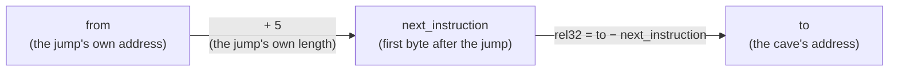

import CodeTrace from '../../../../components/CodeTrace.astro';
import { Frame, GitHub, SpeedType, CodeGroup, Tab } from '../../../../components/kit';

import MemoryStrip from '../../../../components/MemoryStrip.astro';
import MarginNote from '../../../../components/kit/MarginNote.astro';

## Typed code manages the machine-code boundary

A hook changes running machine code, so the final write is necessarily low-level. Typed code keeps the surrounding lifecycle explicit:

- exact ownership of original bytes;
- checked address math;
- supported-version checks;
- a single apply/restore state;
- cleanup in `Drop`;
- clear errors.

<Frame caption="The debugger-only detour from Lesson 2.10, which this lesson rebuilds in a DLL.">


</Frame>

## Define the patch's safety model first

In an offline game, the main danger is self-inflicted:
patching the wrong build, splitting an instruction, losing restoration bytes,
or unloading while the cave still runs. Write the safety model before writing
the jump:

| Question | Wesnoth detour answer |
|---|---|
| What are we protecting? | the original instructions and a recoverable local match |
| What change is allowed? | one verified hook span in the exact supported build |
| What checks validate it? | executable fingerprint, architecture, decoded whole instructions, and exact current bytes |
| When must it refuse? | any mismatch, unreachable cave, bad length, or failed protection change |
| How does it recover? | stop users, restore captured bytes, flush the instruction cache, restore page protection, then unload |

This is a game-hacking safety contract, not an enterprise threat model. Its job
is to prevent an experiment from turning uncertainty into a write.

The trusted core should stay small: target-profile selection, instruction
decoding, the patch writer, and the restoration record. A menu theme, log
formatter, or hotkey label should not be able to bypass byte verification. When
more code can validate a patch, there are more places where a bug can create a
wrong write.

## Represent a patch as data

Before writing to a process, describe exactly which address will change,
which bytes must already be there, and which same-length bytes will replace
them. A `PatchPlan` is only that description: constructing or validating it
cannot modify the game. Equal lengths also mean the planned overwrite cannot
silently spill beyond the verified instruction span:

<MarginNote kind="alternative">A patch plan is a work order, not the work itself: it describes the exact starting bytes and replacement before touching memory.</MarginNote>

```rust
#[derive(Debug)]
struct PatchPlan {
    hook: usize,
    expected: Vec<u8>,
    replacement: Vec<u8>,
}

impl PatchPlan {
    fn validate(&self) -> Result<(), &'static str> {
        if self.expected.is_empty() {
            return Err("expected bytes cannot be empty");
        }
        if self.expected.len() != self.replacement.len() {
            return Err("replacement must preserve the hook span");
        }
        Ok(())
    }
}
```

<Frame caption="Restoration needs the bytes that were replaced">
  
</Frame>

The planner performs no raw memory access. A disassembler should determine the whole-instruction span; never choose it by counting five arbitrary bytes.

## Verify before writing

The plan's `expected` bytes are a build identity check at the precise hook
site. Copy that many live bytes, compare them before any write, and return an
error if the running executable disagrees with the chosen profile:

<SpeedType id="verify-hook" title="Type the hook check" recall={[{"text": "process: &Process, plan: &PatchPlan", "hint": "Borrow the target process and the expected patch plan."}, {"text": "read_exact", "hint": "Read the complete expected byte range or return its failure."}, {"text": "found == plan.expected", "hint": "Compare the captured bytes with the profile before changing anything."}, {"text": "Ok(())", "hint": "Return success after the comparison passed."}]}>

```rust
fn verify_hook(process: &Process, plan: &PatchPlan) -> anyhow::Result<()> {
    let mut found = vec![0_u8; plan.expected.len()];
    process.read_exact(plan.hook, &mut found)?;

    anyhow::ensure!(
        found == plan.expected,
        "hook bytes do not match this target profile"
    );
    Ok(())
}
```

</SpeedType>

Do not turn a mismatch into a force option:

The original helper writes the replacement immediately, then runs the feature. It neither checks the live instructions nor retains an owner that can restore them when the feature stops or returns an error. This is a teaching wrapper excerpt: `AppliedPatch::apply` must capture verified original bytes and install through a code-writing boundary; the buildable in-process lab below uses `LocalPatch` for that role.

```rust title="Before: write a detour with no owned restoration"
fn run_detour(process: &Process, plan: &PatchPlan) -> anyhow::Result<()> {
    process.write_exact(plan.hook, &plan.replacement)?; // No check or restoration owner.
    run_feature_until_stopped()?;
    Ok(())
}
```

**Validate before writing**, then hold an `AppliedPatch` owner for the whole enabled period. Explicit restoration reports a failure; dropping the owner provides a final best-effort attempt if an earlier operation fails.

<CodeGroup>
<Tab label="Improved code">

```rust
fn run_detour(process: &Process, plan: &PatchPlan) -> anyhow::Result<()> {
    plan.validate().map_err(anyhow::Error::msg)?;
    verify_hook(process, plan)?;
    let mut applied = AppliedPatch::apply(process, plan)?;
    // Keep `applied` alive for the entire period when the detour is enabled.
    run_feature_until_stopped()?;
    applied.restore()?;
    Ok(())
}
```

</Tab>
<Tab label="Show the diff">

```diff
 fn run_detour(process: &Process, plan: &PatchPlan) -> anyhow::Result<()> {
-    process.write_exact(plan.hook, &plan.replacement)?; // No check or restoration owner.
+    plan.validate().map_err(anyhow::Error::msg)?;
+    verify_hook(process, plan)?;
+    let mut applied = AppliedPatch::apply(process, plan)?;
+    // Keep `applied` alive for the entire period when the detour is enabled.
     run_feature_until_stopped()?;
+    applied.restore()?;
     Ok(())
 }
```

</Tab>
</CodeGroup>

**Takeaway:** reject mismatched instructions and keep their original bytes owned until restoration finishes.

:::note[Why this version?]
The expected bytes are a tiny build fingerprint. If they
differ, the planned jump may split a different instruction or replay the wrong
behavior. Equal lengths keep the resume address stable. Finally, the
`AppliedPatch` value represents the fact that the process is currently changed;
when that value is restored or dropped, it still has the original bytes needed
to undo the patch.
:::

If bytes differ, stop. Do not add a “force” switch to a beginner tool.

## Own the applied state

Once the replacement is installed, cleanup needs the original bytes even if
the caller returns early. `AppliedPatch` owns that restoration record. An
explicit `restore` can report an error, while `Drop` makes one final
best-effort attempt when the guard leaves scope:

```rust
struct AppliedPatch<'a> {
    process: &'a Process,
    address: usize,
    original: Vec<u8>,
    active: bool,
}

impl AppliedPatch<'_> {
    fn restore(&mut self) -> anyhow::Result<()> {
        if self.active {
            // 🔁 Restore bytes before clearing the flag. If the write fails,
            // `active` stays true so Drop can make one final best-effort attempt.
            self.process.write_exact(self.address, &self.original)?;
            self.active = false;
        }
        Ok(())
    }
}

impl Drop for AppliedPatch<'_> {
    fn drop(&mut self) {
        // 🧹 `restore` is idempotent: explicit cleanup sets active=false, so this
        // fallback cannot accidentally write the original bytes twice.
        if let Err(error) = self.restore() {
            eprintln!("warning: patch restoration failed: {error:#}");
        }
    }
}
```

`Drop` is a final safety net, not the only cleanup path. Call `restore` explicitly and report failures while the program can still react.

<MarginNote kind="narration">A cleanup error can otherwise disappear during destruction. Explicit restoration gives the tool a chance to report which code remains changed.</MarginNote>


<CodeTrace trace="handoff-patch-restore" />

## Calculate jumps carefully

A 5-byte relative jump stores a signed 32-bit displacement measured from the end of the jump:



This helper turns the diagram into five instruction bytes. It checks that the
destination fits the jump's signed 32-bit displacement instead of truncating
an out-of-range address.

```rust
fn rel32(from: usize, to: usize) -> Option<i32> {
    // 🧭 The CPU measures a near jump from the address *after* its five bytes.
    let next_instruction = from.checked_add(5)?;
    // 📏 Use a wider signed type for subtraction so targets below `from` work
    // without unsigned wraparound; the final conversion enforces rel32 range.
    let difference = (to as i128) - (next_instruction as i128);
    i32::try_from(difference).ok()
}

fn near_jump(from: usize, to: usize) -> Option<[u8; 5]> {
    let mut bytes = [0_u8; 5];
    bytes[0] = 0xE9;
    bytes[1..].copy_from_slice(&rel32(from, to)?.to_le_bytes());
    Some(bytes)
}
```

If the destination is too far away, `rel32` returns `None`. Do not truncate the number.

## Architecture matters

The target, DLL, pointer size, instruction decoder, and calling convention must agree:

- a 32-bit DLL loads into a 32-bit process;
- a 64-bit DLL loads into a 64-bit process;
- saved instructions may use instruction-pointer-relative addressing;
- register roles, stack-slot widths, alignment, and calling conventions differ across targets.

This is why copying a detour from a video or another game version is unreliable.

## A safer milestone

Before any live patch, test:

- `rel32` with forward and backward jumps;
- overflow rejection;
- byte verification with a fake memory buffer;
- applying and restoring in a practice process you wrote;
- repeated enable/disable cycles.

After every restoration test, read the hook span again and compare it with the
captured original bytes. “The feature looks disabled” does not show that the
machine code returned to its starting state; comparing the bytes does.

<MarginNote kind="brief">Verify restoration by reading the original instruction span again; a disabled-looking feature is not enough evidence.</MarginNote>

The first end-to-end target should be a tiny program with one known function.

## Apply it to Wesnoth 1.14.9

After the practice target works, reproduce the original Wesnoth terrain-description hook:

```text
hook site:       0x00CC_AF8A
resume address:  0x00CC_AF90
hook span:       6 complete bytes
trigger:         right-click a tile → Terrain Description
visible result:  player gold becomes 888 before the text appears
```

At `0x00CCAF8A`, the supported 1.14.9 profile expects these exact six bytes:

```text
8B 01 8D 74 26 00
```

They contain the instructions represented as:

```nasm
mov eax, dword ptr [ecx]
lea esi, [esi]
```

<MemoryStrip
  cells="0x00CCAF8A=8B|0x00CCAF8B=01|0x00CCAF8C=8D|0x00CCAF8D=74|0x00CCAF8E=26|0x00CCAF8F=00"
  groups="0-1:`mov eax, dword ptr [ecx]`|2-5:`lea esi, [esi]`"
  caption="The six original bytes at the hook site. `0x00CCAF8A` plus this 6-byte span lands exactly on the resume address, `0x00CCAF90`."
/>

The replacement has to fit in that same six-byte span:

<MemoryStrip
  cells="0x00CCAF8A=E9|=rel32 to the cave, 4 bytes|0x00CCAF8F=90"
  groups="0-0:opcode|1-1:computed at install time|2-2:filler"
  caption="The patched bytes, still six bytes long. `rel32` is not written here because it depends on where the DLL happens to load; `near_jump` computes it once the cave's real address is known."
/>

## Trace the jump and saved CPU state

Suppose the DLL placed `terrain_cave` at `0x6F201000`. Then:

```text
displacement = 0x6F201000 - (0x00CCAF8A + 5)
             = 0x6F201000 - 0x00CCAF8F
             = 0x6E536071
```

<MemoryStrip
  cells="0x00CCAF8A=E9|=71|=60|=53|=6E|=90"
  groups="0-0:`jmp`|1-4:`0x6E536071`, little endian|5-5:`nop`"
/>

Two things follow from that. Because the value is relative, the same five bytes
mean different destinations at different addresses, so a working jump cannot be
copied to another location and still land anywhere sensible. And because the
value is signed, jumping backward is perfectly ordinary: a cave at a lower
address simply produces a negative displacement.

The CPU therefore goes to our DLL instead. Our cave borrows control, preserves
the interrupted computation, changes gold, performs the behavior we removed,
and gives control back at `0x00CCAF90`. The original function never returns to
the hook address, so there is no loop.

This is a tiny example of **control-flow redirection**, a computer-science idea
used by debuggers, profilers, hot-patching systems, instrumentation tools, and
game hooks.

The cave interrupts a function in the middle of its work. That function had
values sitting in registers and a comparison result sitting in the flags, and
it expects to find all of them untouched when execution resumes. Everything the
cave does — including the ordinary Rust inside `cave_body` — is free to
overwrite them. `pushad` copies all eight general-purpose registers onto the
stack and `pushfd` copies the flags; `popfd` and `popad` restore them in the
opposite order, so the interrupted function never notices that anything
happened.

<MemoryStrip
  column
  cells="esp+32=flags, from pushfd|esp+28=eax|esp+24=ecx|esp+20=edx|esp+16=ebx|esp+12=esp as it was before pushad|esp+8=ebp|esp+4=esi|esp →=edi"
  marks="8"
  groups="0-0:`pushfd`|1-8:`pushad`, in the order it pushes them"
  caption="The cave's stack after `pushfd` and `pushad`, with `esp` at the bottom. `popad` then `popfd` take everything back in the opposite order."
/>

There is no universal “save every register” rule. `pushfd`/`pushad` is easy to
understand for this small 32-bit teaching cave. In a performance-sensitive
hook, inspect which values are live and preserve exactly what the inserted code
may change. The stack must also be balanced: every `push` needs a matching
`pop`, and the called function's convention must agree with the cave.


The cave now needs a complete owner: one function changes the gold field, one preserves and restores the interrupted CPU state, and one installs a verified, reversible jump.

This is the actual cave from the build-checked Windows project:

```rust
use std::ptr;
use anyhow::{Context, Result};
use gha_windows_labs::{LocalPatch, near_jump};

const PLAYER_ROOT: usize = 0x017E_ED18;
const GAME_OFFSET: usize = 0x0A90;
const GOLD_OFFSET: usize = 0x0004;

const HOOK: usize = 0x00CC_AF8A;
const RESUME: usize = 0x00CC_AF90;
const ORIGINAL: [u8; 6] = [0x8B, 0x01, 0x8D, 0x74, 0x26, 0x00];

/// Follow Wesnoth's real pointer path and change the live gold field.
///
/// # Safety
/// Run only inside the documented 32-bit Wesnoth build with a local match open.
unsafe fn set_gold(amount: u32) -> Result<()> {
    // 🛡️ SAFETY: the supported-game profile identifies this pointer root.
    let player = unsafe { ptr::read_volatile(PLAYER_ROOT as *const u32) } as usize;
    anyhow::ensure!(player != 0, "start a local match first");

    let side_pointer_address = player
        .checked_add(GAME_OFFSET)
        .context("side-pointer address overflowed")?;
    // 🛡️ SAFETY: the verified player record stores a 32-bit side pointer here.
    let side = unsafe {
        ptr::read_volatile(side_pointer_address as *const u32)
    } as usize;
    anyhow::ensure!(side != 0, "current side pointer is null");

    let gold_address = side
        .checked_add(GOLD_OFFSET)
        .context("gold address overflowed")?;
    // 🛡️ SAFETY: the current side record stores its four-byte gold value at +4.
    unsafe { ptr::write_volatile(gold_address as *mut u32, amount) };
    Ok(())
}

extern "C" fn cave_body() {
    // ⚠️ A naked assembly function cannot return Result. A missing match simply
    // leaves gold unchanged; startup already verified the game executable.
    let _ = unsafe { set_gold(888) };
}

#[cfg(target_arch = "x86")]
#[unsafe(naked)]
unsafe extern "C" fn terrain_cave() {
    core::arch::naked_asm!(
        // 📦 Save the flags and eight general-purpose 32-bit registers.
        "pushfd",
        "pushad",

        // 🛡️ The helper performs the pointer checks and gold write.
        "call {body}",

        // 🔁 Put the interrupted thread back exactly as we found it.
        "popad",
        "popfd",

        // ✅ Replay the behavior of all instructions replaced at the hook.
        "mov eax, dword ptr [ecx]",
        "lea esi, [esi]",

        // 🧭 Continue at the first untouched Wesnoth instruction.
        "jmp {resume}",
        body = sym cave_body,
        resume = const RESUME,
    );
}

#[cfg(target_arch = "x86")]
fn install_terrain_hook() -> Result<LocalPatch> {
    let cave_address = terrain_cave as *const () as usize;
    let jump = near_jump(HOOK, cave_address)?;

    let mut detour = [0x90_u8; 6];
    detour[..5].copy_from_slice(&jump); // E9 plus signed rel32

    // 🧹 LocalPatch refuses a different build, makes the code page writable,
    // writes all six bytes, flushes the instruction cache, restores the page
    // protection, and owns ORIGINAL so Drop can restore it later.
    LocalPatch::apply(HOOK, &ORIGINAL, &detour)
}
```

Here is the important difference between “the address worked once” and a hook
whose assumptions are visible:

The original helper follows the lab's local player and side pointers, then writes gold using unchecked integer addition. These constants describe one verified offline build. **This is unsafe code:** the caller must guarantee that every addressed field stays live, initialized, aligned and accessible for the entire operation.

```rust title="Before: follow unchecked local object addresses"
/// # Safety
/// Call only inside the verified 32-bit build while these local fields remain
/// initialized, live, aligned and accessible. Serialize this operation with
/// game updates and guarantee exclusive writable access to the gold field.
unsafe fn set_gold(amount: u32) -> Result<()> {
    // SAFETY: the caller guarantees the root slot is live and aligned.
    let player = unsafe { ptr::read_volatile(PLAYER_ROOT as *const u32) } as usize;
    let side_slot = player + GAME_OFFSET; // May overflow before the access.
    // SAFETY: the caller must guarantee this computed local slot is valid.
    let side = unsafe { *(side_slot as *const u32) } as usize;
    // SAFETY: the caller must guarantee the local gold field remains writable.
    unsafe { *((side + GOLD_OFFSET) as *mut u32) = amount };
    Ok(())
}
```

**Checked arithmetic** and null checks reject obvious invalid addresses before access. They do not prove pointer validity, prevent concurrent game writes or make volatile access safe; the caller's lifetime and build guarantees remain necessary.

<CodeGroup>
<Tab label="Improved code">

```rust
/// # Safety
/// Call only inside the verified 32-bit build while these local fields remain
/// initialized, live, aligned and accessible. Serialize this operation with
/// game updates and guarantee exclusive writable access to the gold field.
unsafe fn set_gold(amount: u32) -> Result<()> {
    // SAFETY: the caller guarantees the root slot is live and aligned.
    let player = unsafe { ptr::read_volatile(PLAYER_ROOT as *const u32) } as usize;
    anyhow::ensure!(player != 0, "current player pointer is null");
    let side_slot = player.checked_add(GAME_OFFSET)
        .context("side-pointer address overflowed")?;
    // SAFETY: the caller guarantees this local slot remains live and aligned.
    let side = unsafe { ptr::read_volatile(side_slot as *const u32) } as usize;
    anyhow::ensure!(side != 0, "current side pointer is null");
    let gold_address = side.checked_add(GOLD_OFFSET)
        .context("gold address overflowed")?;
    // SAFETY: the caller guarantees exclusive writable access to this live field.
    unsafe { ptr::write_volatile(gold_address as *mut u32, amount) };
    Ok(())
}
```

</Tab>
<Tab label="Show the diff">

```diff
 /// # Safety
 /// Call only inside the verified 32-bit build while these local fields remain
 /// initialized, live, aligned and accessible. Serialize this operation with
 /// game updates and guarantee exclusive writable access to the gold field.
 unsafe fn set_gold(amount: u32) -> Result<()> {
     // SAFETY: the caller guarantees the root slot is live and aligned.
     let player = unsafe { ptr::read_volatile(PLAYER_ROOT as *const u32) } as usize;
-    let side_slot = player + GAME_OFFSET; // May overflow before the access.
+    anyhow::ensure!(player != 0, "current player pointer is null");
+    let side_slot = player.checked_add(GAME_OFFSET)
+        .context("side-pointer address overflowed")?;
-    // SAFETY: the caller must guarantee this computed local slot is valid.
+    // SAFETY: the caller guarantees this local slot remains live and aligned.
-    let side = unsafe { *(side_slot as *const u32) } as usize;
+    let side = unsafe { ptr::read_volatile(side_slot as *const u32) } as usize;
-    // SAFETY: the caller must guarantee the local gold field remains writable.
-    unsafe { *((side + GOLD_OFFSET) as *mut u32) = amount };
+    anyhow::ensure!(side != 0, "current side pointer is null");
+    let gold_address = side.checked_add(GOLD_OFFSET)
+        .context("gold address overflowed")?;
+    // SAFETY: the caller guarantees exclusive writable access to this live field.
+    unsafe { ptr::write_volatile(gold_address as *mut u32, amount) };
     Ok(())
 }
```

</Tab>
</CodeGroup>

**Takeaway:** arithmetic checks supplement an unsafe memory contract; they cannot replace it.

:::note[Why this version?]
`checked_add` prevents a bad pointer plus offset from
wrapping around to a believable low address. The null check turns “no active
side” into an ordinary error. Volatile access tells the compiler that this
memory can change outside the compiler's view, but it does **not** make an invalid
pointer safe. That is why the build check, pointer path, and narrow `unsafe`
boundary are still required. `LocalPatch` then owns the separate responsibility
of restoring the original instructions.
:::

The complete cave above is buildable source. The definitions of [`LocalPatch` and
`near_jump`](/windows-labs/src/windows_impl/local_patch.rs), including
`VirtualProtect`, `FlushInstructionCache`, and automatic restoration, are part
of the project. The exact cave above lives in [`game_hooks.rs`](/windows-labs/src/windows_impl/game_hooks.rs).

<GitHub path="windows-labs/src/windows_impl/local_patch.rs" />

<GitHub path="windows-labs/src/windows_impl/game_hooks.rs" />

Build it as 32-bit because the naked function uses x86 registers and the target
stores four-byte pointers:

```powershell
cd windows-labs
cargo build --release --target i686-pc-windows-msvc
```

Inject the resulting DLL with the course injector:

```powershell
.\target\i686-pc-windows-msvc\release\injector.exe `
  wesnoth.exe `
  .\target\i686-pc-windows-msvc\release\gha_windows_labs.dll
```

Press **F1** to install the cave. Right-click a tile and choose **Terrain
Description**. Gold becomes `888` before the description is shown. Press **F1**
again to restore all six original bytes; repeat the menu action and gold should
stay unchanged. Press **End** to stop the worker and restore any remaining
patch.


## Reuse the same detour for a live text field

The first hook changes a game value at a terrain-description event. The next case starts from a different observation: the game passes a live text pointer to its print function. The patch manager, checked relative jump, saved bytes, and verified restoration procedure stay the same; the cave changes what it reads and writes.

Now use the real target. On the **Den of Onis** map, right-click a Ford tile and open **Terrain Description**. Search for a distinctive part of the description, then change the first letter of each candidate until the displayed text changes. In the book’s run, the live string began at `0x10CE996B`.

Set a read breakpoint on one byte of that string and open the description again. Step out until you reach `0x005ED114`. Here `edx` leads to the text object, and the call at `0x005ED129` prints it. The original print target is `0x005E9630`; execution continues at `0x005ED12E`.

For the debugger-only experiment, place a cave at `0x01343E1B`, replace the five-byte call at `0x005ED129` with a relative jump, and assemble:

```nasm
pushad
mov eax, dword ptr [edx]
inc byte ptr [eax]
popad
call 0x005E9630
jmp 0x005ED12E
```

This deliberately changes the first byte each time the description is drawn: `A` becomes `B`, then `C`, and so on. It is visible proof that the cave receives the live text pointer and still replays the original call.

The installer uses the checked `near_jump` helper from the first hook. Its displacement is measured from the end of the five-byte jump, and it rejects an unreachable cave.

Before writing, verify that the five original bytes still encode the expected call. When disabling the hack, restore those exact saved bytes. Close and reopen the description between tests so each character change is obvious.

## Turn the text cave into the complete second-player gold patch

The finished hook keeps the same five-byte patch point, original print call, and resume address. Instead of incrementing one letter, it follows Wesnoth's verified in-process pointer chain and writes the second player's gold as decimal text:

```text
[0x017EED18] → player object
player + 0x0A90 → game/side object
game + 0x0274 → second player's gold
[EDX] → start of the live output text buffer
```

The helper checks every pointer, caps the displayed value at `999`, converts it into at most three ASCII digits, and copies exactly three bytes into the existing buffer. The naked cave supplies the live `EDX`, preserves flags and registers, replays the original print call, and resumes the game:

```rust
#[unsafe(naked)]
unsafe extern "C" fn wesnoth_stat_cave() {
    core::arch::naked_asm!(
        "pushfd",
        "pushad",
        "push edx",
        "call {prepend}",
        "add esp, 4",
        "popad",
        "popfd",
        "call {original}",
        "jmp {resume}",
        prepend = sym prepend_second_player_gold,
        original = const 0x005E_9630,
        resume = const 0x005E_D12E,
    );
}

pub fn install_wesnoth_stat_hook() -> anyhow::Result<LocalPatch> {
    let expected = near_call(0x005E_D129, 0x005E_9630)?;
    let replacement = near_jump(
        0x005E_D129,
        wesnoth_stat_cave as *const () as usize,
    )?;
    LocalPatch::apply(0x005E_D129, &expected, &replacement)
}
```

Inject the 32-bit DLL into `wesnoth.exe`, open the terrain description during the two-player local scenario, and press **F2**. The first three characters change to the other player's live gold. Press **F2** again or **End** to restore the original call bytes.

The complete helper, decimal conversion, cave, and installer are in [`wesnoth_hooks.rs`](/windows-labs/src/windows_impl/wesnoth_hooks.rs). The hotkey and patch lifetime are in [`dll.rs`](/windows-labs/src/windows_impl/dll.rs).

The first hook redirects a verified instruction span; the second redirects a verified call. Both restore exactly what they displaced. [Lesson 6.5](/pages/8/04/) changes a different boundary: an imported function pointer rather than instruction bytes.

To transfer either example to another build, start from the observation that
led to the hook: which action reaches the instruction, and which register or
pointer holds the value at that moment? Then re-measure the complete
instruction span, expected bytes, cave reachability, displaced behavior,
resume address, and restoration result in that build. The Wesnoth addresses
above are evidence for one 32-bit version, not reusable offsets.
