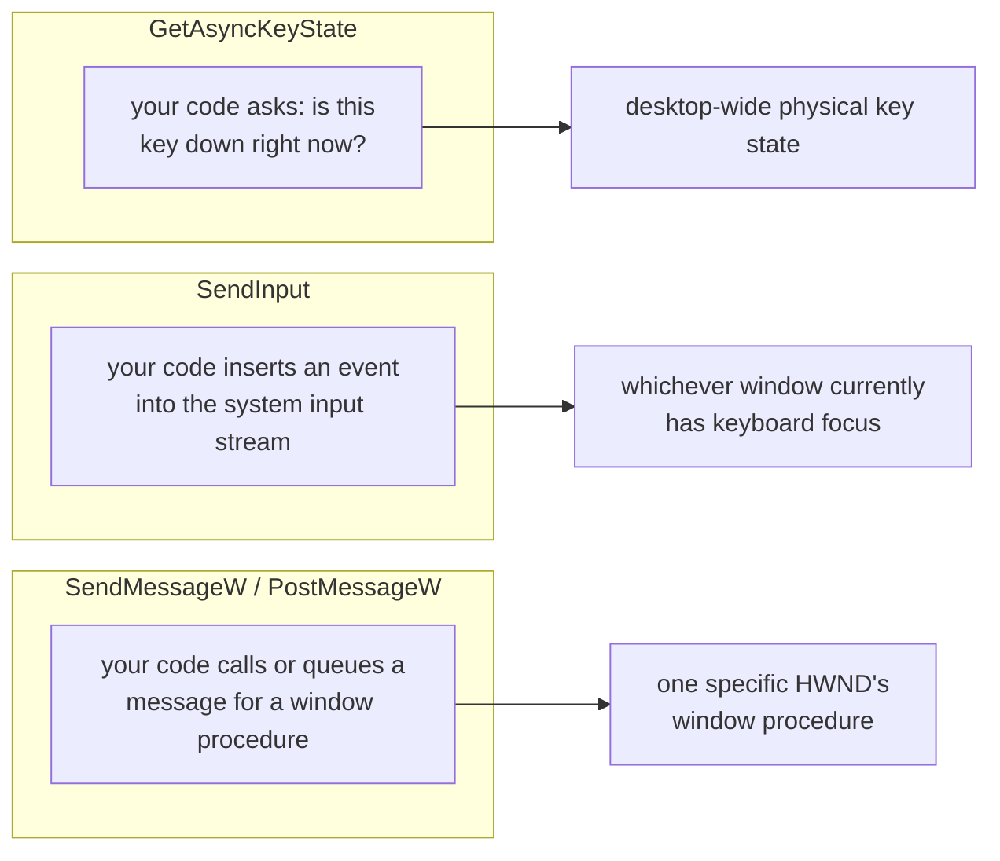
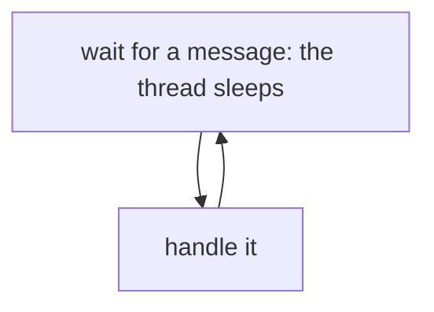
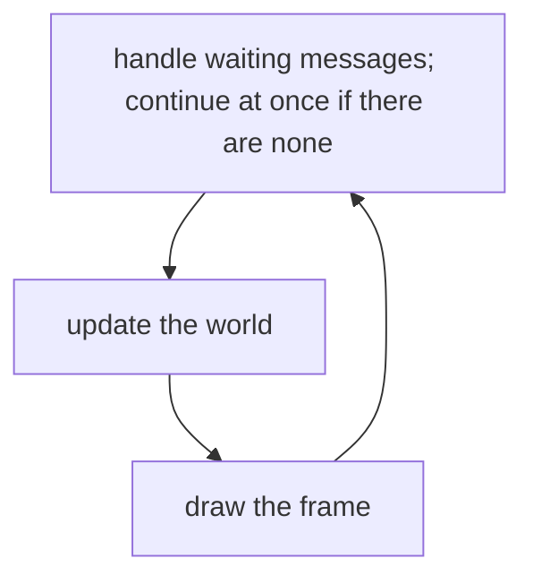
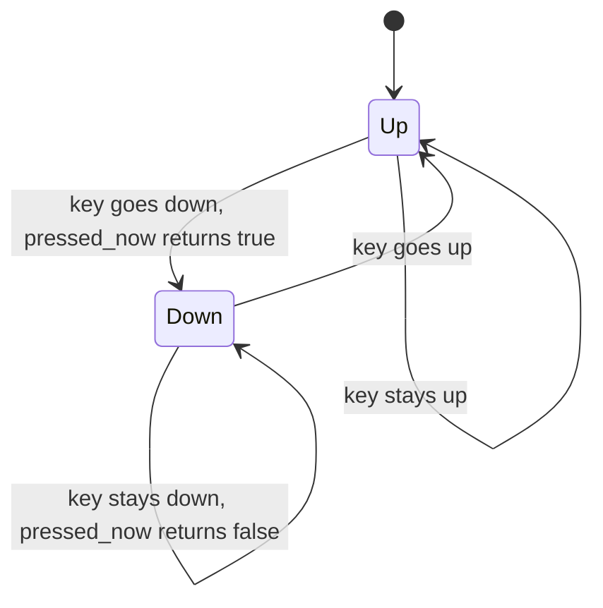
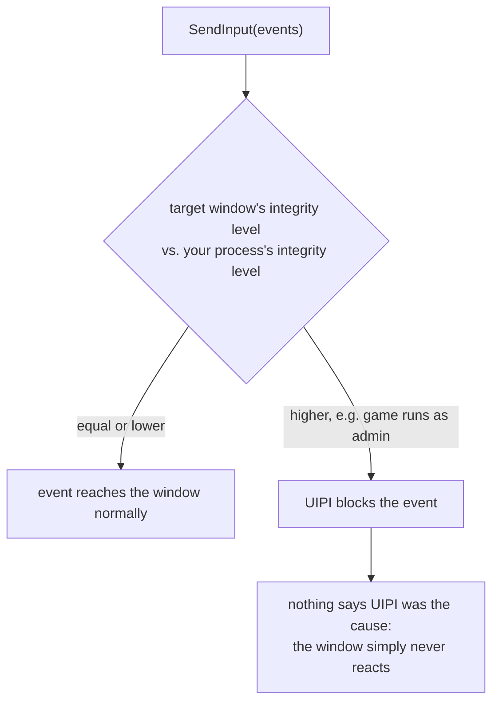

import MemoryStrip from '../../../../components/MemoryStrip.astro';

## “Send a key” can mean three different things

Our DLL now has a controlled lifecycle, and the scanner can do work off the game thread. A local tool also needs a deliberate way to start or stop a feature. Pressing a menu hotkey, sending a synthetic key to an offline game, and calling a window procedure solve different problems, even though all three sound like “input.”

Windows has several input paths because programs receive interaction in
different ways:

| Path | What it really does | Good course use | Common surprise |
|---|---|---|---|
| `GetAsyncKeyState` | Samples the current physical key state | Toggle a local tool menu | It does not wait for an event |
| `SendInput` | Inserts keyboard or mouse events into the system input stream | Drive an offline game while its window is active | It does not target one `HWND` |
| `SendMessageW` / `PostMessageW` | Calls or queues a message for a window procedure | Control a window you created or a documented local test window | Many games read Raw Input or device state instead |

Each path lands on a different destination, which is the real reason to pick carefully:



There is no general Win32 function named `SendKey`. .NET's `SendKeys` is a
separate convenience layer, while the old `keybd_event` function has been
superseded by `SendInput`. Naming the path correctly prevents a lot of confused
debugging. ⌨️

## State, events, and messages are not interchangeable

`GetAsyncKeyState` answers a state question: “is this key down at the instant I sample it?” `SendInput` submits input events to the desktop input pipeline. `SendMessageW` invokes a window-procedure message contract. Similar names do not put them on the same path.

A game may combine several paths: Raw Input for aiming, ordinary window messages for menus, and polled key state for a developer console. Observe how the target consumes input before choosing an API. Sending `WM_KEYDOWN` to a window that reads device state is not a failed keyboard event; it is the wrong abstraction.

Always pair a down transition with an up transition, including cancellation and error paths. A state machine should own which synthetic inputs are currently held so shutdown can release exactly those inputs.

## A window receives messages through a loop

The message path makes more sense if we first follow an ordinary
window. A key press or resize can place a message in the thread's
queue. A **message loop** retrieves it and `DispatchMessage` calls
the window's **window procedure**. That procedure is a callback: a
function the application provides so Windows can call it when a
message is dispatched. For example, it might respond to `WM_SIZE`
by updating the window's layout. Microsoft's
[window-message walkthrough](https://learn.microsoft.com/en-us/windows/win32/learnwin32/window-messages)
shows this path.

```text
message arrives for a window
loop retrieves it
DispatchMessage calls that window's procedure
procedure handles it and returns
loop retrieves the next message
```

`GetMessage` waits when no queued message is available. That suits a
window that has nothing to do until the next event. A game often must
update its world even when the player touches nothing. Its loop can
use `PeekMessage` to check for waiting messages without blocking,
then continue to update and draw. This is a conceptual comparison,
not complete Win32 source:

```text
ordinary event loop:
    wait for a message with GetMessage
    translate and dispatch it

game-style loop:
    while PeekMessage finds a waiting message:
        translate and dispatch it
    update the world
    draw the next frame
```

The waiting path and the continuously updating path look different:





`TranslateMessage` can post character messages derived from key
messages; `DispatchMessage` sends a retrieved message to its
window procedure. `PeekMessage` reports no available queued
message without waiting, which is why the game-style loop can
continue its own work. The exact handling of Raw Input and other
message types varies by application; do not assume every game
consumes `WM_KEYDOWN` as its gameplay input. See Microsoft's
[`GetMessageW`](https://learn.microsoft.com/en-us/windows/win32/api/winuser/nf-winuser-getmessagew)
and [`PeekMessageW`](https://learn.microsoft.com/en-us/windows/win32/api/winuser/nf-winuser-peekmessagew)
references for their return and queue rules.

The callback must also return promptly. While a window procedure is
busy reading a large file or waiting on a network request, other
messages for windows on that thread cannot be handled. The window
may stop repainting or responding to input. Microsoft's
[window-procedure guidance](https://learn.microsoft.com/en-us/windows/win32/learnwin32/writing-the-window-procedure#avoiding-bottlenecks-in-your-window-procedure)
explains this bottleneck. The same concern appears when a hook adds
work to a game's time-sensitive path: move slow work elsewhere and
make overload visible, as Lesson 4.10 does for a recorder.

<MemoryStrip
  cells="being handled=WM_KEYDOWN, reading a large file|waiting=WM_MOUSEMOVE|waiting=WM_PAINT|waiting=WM_CLOSE"
  marks="0"
  groups="1-3:these messages wait until the first handler returns"
  caption="One thread's message queue. A slow first handler delays movement, repainting, and close handling."
/>

**Polling** is the other side of this distinction. If no one sends
your tool a message when the game's gold changes, the tool can check
the value on its own schedule. It does work even when nothing changed.
[Lesson 4.9](/pages/4/07/) shows how to compare successive snapshots
so many polls produce one meaningful event instead of many repeated
actions.

## Read a hotkey with `GetAsyncKeyState`

The current `windows` crate exposes
[`GetAsyncKeyState`](https://microsoft.github.io/windows-docs-rs/doc/windows/Win32/UI/Input/KeyboardAndMouse/fn.GetAsyncKeyState.html)
as an unsafe function taking a virtual-key number and returning an `i16`.
Windows puts “down right now” in the most significant bit. Because that is the
sign bit of an `i16`, a negative result means down:

<MemoryStrip
  cells="bit 15 (sign)=1 if down now|bits 14-1=unused here|bit 0=stale “pressed since last call” flag"
  marks="0"
  caption="`GetAsyncKeyState` returns an `i16`. A negative result (bit 15 set) means the key is down right now. Bit 0 is kept for old compatibility, but another process's call can consume it first, which is why the edge detector below is built from bit 15 instead."
/>

```rust
use windows::Win32::UI::Input::KeyboardAndMouse::{
    GetAsyncKeyState, VIRTUAL_KEY, VK_INSERT,
};

fn key_is_down(key: VIRTUAL_KEY) -> bool {
    // 🛡️ SAFETY: every VIRTUAL_KEY value is a valid integer query. This call
    // only samples desktop input state and does not retain any borrowed pointer.
    unsafe { GetAsyncKeyState(i32::from(key.0)) < 0 }
}

assert_eq!(key_is_down(VK_INSERT), key_is_down(VK_INSERT));
```

Do **not** use `result & 1 != 0` as a reliable “pressed once” event. Microsoft
keeps that low bit for old compatibility, but another process can observe it
first. Build your own edge detector from the trustworthy high bit:

```rust
#[derive(Default)]
struct KeyEdge {
    was_down: bool,
}

impl KeyEdge {
    fn pressed_now(&mut self, key: VIRTUAL_KEY) -> bool {
        let down = key_is_down(key);
        let rising_edge = down && !self.was_down; // ✅ one event per press
        self.was_down = down;
        rising_edge
    }
}
```



Poll at a modest rate such as every 8–16 milliseconds. A tight loop wastes a
CPU core. A zero result can also mean the desktop is inactive or Windows
integrity rules prevent the query; “zero” does not prove a keyboard is broken.

Sampling can miss a very short press between polls. That is a property of polling, not a reason to trust the ambiguous low bit. For a tool hotkey, choose a comfortable key and polling interval, then test focus changes, key repeat, and shutdown while held.

## Gate synthetic input to the intended window

`SendInput` writes to the system input stream. It does not accept an `HWND`, so
check that the target owns the foreground window before sending:

```rust
use windows::Win32::{
    Foundation::HWND,
    UI::WindowsAndMessaging::{GetForegroundWindow, GetWindowThreadProcessId},
};

fn target_is_foreground(target_window: HWND, target_pid: u32) -> bool {
    // 🛡️ These calls return copied identifiers; neither keeps our pointers.
    let foreground = unsafe { GetForegroundWindow() };
    if foreground != target_window {
        return false;
    }

    let mut foreground_pid = 0_u32;
    unsafe { GetWindowThreadProcessId(foreground, Some(&mut foreground_pid)) };
    foreground_pid == target_pid
}
```

Then send a balanced key-down/key-up pair:

```rust
use std::mem::size_of;
use windows::Win32::UI::Input::KeyboardAndMouse::{
    INPUT, INPUT_0, INPUT_KEYBOARD, KEYBDINPUT, KEYEVENTF_KEYUP,
    KEYBD_EVENT_FLAGS, SendInput, VIRTUAL_KEY,
};

fn keyboard_event(key: VIRTUAL_KEY, flags: KEYBD_EVENT_FLAGS) -> INPUT {
    INPUT {
        r#type: INPUT_KEYBOARD,
        Anonymous: INPUT_0 {
            ki: KEYBDINPUT {
                wVk: key,
                dwFlags: flags,
                ..Default::default()
            },
        },
    }
}

fn tap_key(key: VIRTUAL_KEY) -> anyhow::Result<()> {
    let events = [
        keyboard_event(key, KEYBD_EVENT_FLAGS::default()),
        keyboard_event(key, KEYEVENTF_KEYUP),
    ];
    let input_size = i32::try_from(size_of::<INPUT>())?;

    // 🛡️ SAFETY: `events` is initialized and its element size matches INPUT.
    let sent = unsafe { SendInput(&events, input_size) };
    anyhow::ensure!(sent == events.len() as u32, "sent {sent} of 2 events");
    Ok(())
}
```

Always release a key or mouse button during shutdown, even if a feature fails.
`SendInput` is subject to **User Interface Privilege Isolation (UIPI)**: Windows
blocks input from a lower-integrity process into a window owned by a
higher-integrity one, such as a game running as administrator while your tool
does not. Windows does not tell you why: neither `SendInput`'s return value
nor `GetLastError` identifies UIPI as the cause, and the target window simply
never reacts, which looks identical to a wrong virtual-key code or an unfocused
window.



If synthetic input silently does nothing, check
whether the target is elevated before suspecting your own code. Some games also
intentionally use Raw Input or device APIs that do not behave like a normal text
box. Do not respond by repeatedly flooding input.

## `SendMessageW` is not simulated keyboard input

Every Win32 window has a **window procedure** that receives numbered messages.
`SendMessageW` invokes that procedure synchronously and waits for it to finish.
`PostMessageW` puts a message on the owning thread's queue and returns. For a
window outside your process, a bounded wait is usually safer than an unlimited
one:

```rust
use windows::Win32::{
    Foundation::{HWND, LPARAM, WPARAM},
    UI::WindowsAndMessaging::{
        SendMessageTimeoutW, SMTO_ABORTIFHUNG, WM_APP,
    },
};

const WM_LAB_REFRESH: u32 = WM_APP + 1;

fn ask_lab_window_to_refresh(window: HWND) -> anyhow::Result<usize> {
    let mut message_result = 0_usize;

    // 🛡️ This custom message belongs to our own lab window. It carries only
    // integer values—never a pointer into this process.
    let delivered = unsafe {
        SendMessageTimeoutW(
            window,
            WM_LAB_REFRESH,
            WPARAM(0),
            LPARAM(0),
            SMTO_ABORTIFHUNG,
            100,
            Some(&mut message_result),
        )
    };
    anyhow::ensure!(delivered.0 != 0, "lab window did not answer in 100 ms");
    Ok(message_result)
}
```

Use `PostMessageW` when the receiver's documented contract says queuing is
correct and no immediate result is required. Never pass a local pointer in
`LPARAM` to an unrelated process: Windows automatically marshals only certain
system messages below `WM_USER`. A custom `WM_APP` message is appropriate when
both sides share a pointer-free contract.

Most 3D games do not treat `WM_KEYDOWN` as authoritative gameplay input. They
may poll device state, consume Raw Input, or ignore messages while unfocused.
Sending a window message is therefore not a stronger version of `SendInput`;
it is a different communication path.

## Other Windows APIs worth knowing

Choose by question instead of memorizing a giant list:

| Question | Relevant APIs | Lesson rule |
|---|---|---|
| Which top-level window belongs to my PID? | `EnumWindows`, `GetWindowThreadProcessId` | Match the process, not a changeable title |
| Where is the drawable client area on screen? | `GetClientRect`, `ClientToScreen`, `GetDpiForWindow` | Recalculate after move, resize, or DPI change |
| Is the target active? | `GetForegroundWindow` | Pause synthetic input when it is not |
| Which process/module build is this? | `CreateToolhelp32Snapshot`, `Process32FirstW`, `Module32FirstW` | Verify identity before using offsets |
| What access does the tool truly need? | `OpenProcess` | Ask for read/query rights before write rights |
| Can this remote range be read? | `VirtualQueryEx`, `ReadProcessMemory` | Inspect the region, then copy bounded bytes |
| Did patched code become executable correctly? | `VirtualProtectEx`, `FlushInstructionCache` | Save/restore protection and verify every byte |
| How do I observe execution? | `DebugActiveProcess`, `WaitForDebugEvent`, `ContinueDebugEvent` | Continue every event exactly once |
| How do two local components exchange data? | named pipes, file mappings, events | Frame, authenticate, bound, and close resources |

An `HWND` is also called a handle, but it is owned by the window manager and is
not closed with `CloseHandle`. This is why “wrap every `H...` value in the same
RAII type” is wrong. Learn the creation, borrowing, and destruction contract
for each API family.

## A controlled lab checklist

1. Start only the course's local/offline target.
2. Discover its window by PID and confirm it is foreground.
3. Use `Insert` only to toggle your menu; detect the rising edge yourself.
4. Send one balanced input pair and count the events `SendInput` accepted.
5. Move focus to Notepad and verify the tool pauses instead of typing there.
6. Shut down while a feature is active and verify every held input is released.
7. Log errors and stop; never escalate privileges or flood retries automatically.

## References

- [Microsoft: `GetAsyncKeyState`](https://learn.microsoft.com/en-us/windows/win32/api/winuser/nf-winuser-getasynckeystate)
- [Microsoft: `SendInput`](https://learn.microsoft.com/en-us/windows/win32/api/winuser/nf-winuser-sendinput)
- [Microsoft: `SendMessageW`](https://learn.microsoft.com/en-us/windows/win32/api/winuser/nf-winuser-sendmessagew)
- [Microsoft: `ClientToScreen`](https://learn.microsoft.com/en-us/windows/win32/api/winuser/nf-winuser-clienttoscreen)
