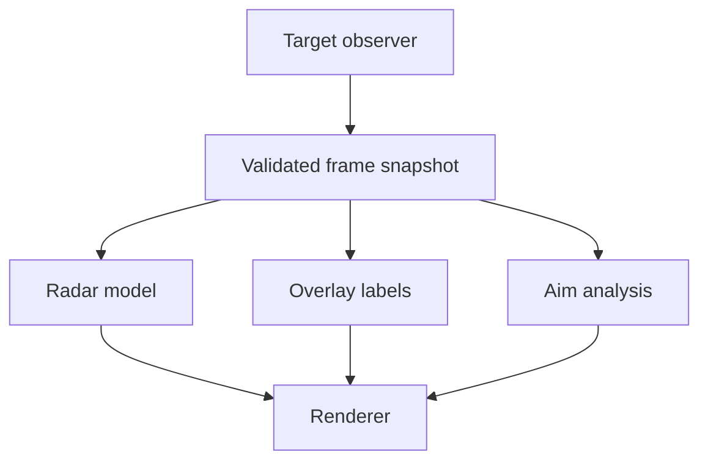
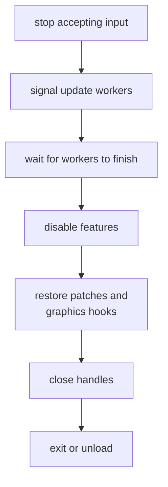

import Frame from '../../../../components/kit/Frame.astro';
import { GitHub } from '../../../../components/kit';
import SortBoard from '../../../../components/SortBoard.astro';
import MarginNote from '../../../../components/kit/MarginNote.astro';


The [tool-architecture lesson](/pages/8/10/) gave snapshots, commands,
features, and cleanup separate owners. Rendering adds a timing constraint:
positions and the camera that projects them must describe the same captured
update. A well-organized tool can still draw incorrect markers if those values
come from different moments.

This lesson applies that architecture to radar, overlays, aim analysis, and
render hooks. The snippets describe interfaces inside a combined tool; the
complete dispatcher and patch owners are linked below.


## One frame, one snapshot



Read and validate target data once per update. Features consume the same owned
snapshot. In this excerpt, `PlayerSnapshot` is a local record of the player's
identity, position, and other validated fields; `Mat4` holds the camera
transform. Neither type borrows a pointer into the game:

```rust
struct FrameSnapshot {
    local: PlayerSnapshot,
    players: Vec<PlayerSnapshot>,
    matrix: Mat4,
    viewport: (f32, f32),
}
```

Every feature receives the same owned set of fields from one bounded
observation pass. If the radar reads the player list on one pass while the
overlay independently reads the camera matrix a few milliseconds later, the
features describe different updates, and markers can land where enemies used
to be. Bundling the fields means both features use the same captured values.
It does **not** make the reads atomic: the game can update an entity between
two reads within that pass. Validate the resulting snapshot and, if the game
exposes a tick or generation counter, check it before and after the copy or
retry when it changes.

<MarginNote kind="brief">Sharing one captured set prevents features from using different copies; it does not prove the game stayed unchanged during capture.</MarginNote>

The camera matrix and viewport travel with the players for that exact reason.
Projecting this frame's positions through last frame's camera is wrong in a way
that looks almost right — everything is drawn slightly behind where it belongs,
worst when you turn quickly, which makes it easy to blame the projection maths
instead of the timing.

`Vec<PlayerSnapshot>` is owned rather than borrowed, so nothing here points back
into the game. A feature holding a reference into an entity the game then frees
is the stale-pointer failure from Lesson 1.8, arriving through the back door.
Copy once, then let every feature read from the copy.

<Frame caption={"Radar and overlay consume the same player and camera fields; the capture still needs validation for changes made during the copy."}>
  
</Frame>

<SortBoard board="snapshot-contents" label="Explore what belongs in a frame snapshot" />

## Give render features a lifecycle

A radar overlay needs a different per-frame action from a recoil patch, but
both must answer the same lifecycle questions: when is it enabled, what does
it do with this frame's snapshot, and how does it undo its own changes? The
interface below makes those moments explicit for every feature:

```rust
trait Feature {
    fn name(&self) -> &'static str;
    fn enable(&mut self) -> anyhow::Result<()>;
    fn update(&mut self, frame: &FrameSnapshot) -> anyhow::Result<()>;
    fn disable(&mut self) -> anyhow::Result<()>;
}
```

Only patching or hooking features need setup or restoration in `enable` and
`disable`. A pure observer still implements those required methods, but they
can return `Ok(())`; its useful work lives in `update`. The owner checks the
result before reporting that a toggle succeeded.

## Model configuration with enums

Three booleans named `show_teammates`, `show_opponents`, and
`show_everyone` could all become true after a sequence of clicks. Yet the
overlay can display only one of those modes at a time. Store that choice as
one enum value, alongside the independent radar and debug switches:

<MarginNote kind="alternative">Use one selector for mutually exclusive overlay modes, and separate switches for independent features that can operate together.</MarginNote>

```rust
#[derive(Clone, Copy, Debug, Eq, PartialEq)]
enum OverlayMode {
    Off,
    Teammates,
    Opponents,
    Everyone,
}

#[derive(Debug)]
struct Settings {
    overlay: OverlayMode,
    show_radar: bool,
    show_debug_values: bool,
}
```

An enum prevents impossible combinations such as three different overlay booleans being true at the same time.

## Route input as commands

A key press should request a change, not let the input thread reach into a
feature while the update loop is using it. The input side can send a small
command; the update loop then applies it to its own `Settings`. For example,
`CycleOverlay` takes `Off` to `Teammates` and eventually back to `Off`:

```rust
enum Command {
    ToggleRadar,
    CycleOverlay,
    ToggleDebugValues,
    Stop,
}

// The update loop uses true to leave the loop and enter cleanup.
fn apply_command(settings: &mut Settings, command: Command) -> bool {
    match command {
        Command::ToggleRadar => settings.show_radar = !settings.show_radar,
        Command::CycleOverlay => {
            settings.overlay = match settings.overlay {
                OverlayMode::Off => OverlayMode::Teammates,
                OverlayMode::Teammates => OverlayMode::Opponents,
                OverlayMode::Opponents => OverlayMode::Everyone,
                OverlayMode::Everyone => OverlayMode::Off,
            };
        }
        Command::ToggleDebugValues => {
            settings.show_debug_values = !settings.show_debug_values;
        }
        Command::Stop => return true,
    }
    false
}
```

The input thread sends commands through a channel. The update loop owns and
changes the settings, avoiding shared mutable globals. A `true` return means
it should stop taking frames and enter cleanup. The menu receives an
acknowledgement after an enabled feature has actually changed state.

## Contain a render feature's failure

If a frame lacks a valid projection matrix, the overlay may fail while the
radar and debug reader can continue. Each feature's `update` returns a result.
The owner records the error, marks that feature disabled, and calls its
restoration path. Subsequent updates skip it; an error message alone would
leave it running again on the next frame.

That local decision is valid only when the rest of the snapshot remains sound.
A closed process or an invalid entity list stops every consumer. A missing
camera may disable only screen projection. If a failing feature cannot restore
its hook or patch, keep that failure visible and enter the shared shutdown
path rather than treating a disabled checkbox as successful cleanup.


## Shut down in reverse order



Do not unload code while another thread may still execute it. Restoration must
also happen on the thread or render boundary that owns the changed state.
Stop the worker, wait for it to finish, and remove only the hooks this tool
installed. A render callback may still be executing after the menu closes.

<MarginNote kind="narration">Closing the controls can leave a render callback in flight. Removing its code before that call finishes turns cleanup into a crash.</MarginNote>

## Keep verified graphics facts with their target build

An offset is a fact about one supported executable, not a universal property
of an overlay. A profile joins build identity, module-relative locations,
object layouts, and expected instruction bytes. Each feature receives verified
facts from that profile rather than embedding another copy of an address.

A profile should make the supported game and version obvious. These constants join the concrete labs used by this combined tool; the complete project uses `Option<usize>` for facts a game does not need.

```rust
const ASSAULTCUBE_1202: TargetFacts = TargetFacts {
    process: "ac_client.exe",
    local_player_ptr: Some(0x0050_9B74),
    entity_list_ptr: Some(0x0050_F4F8),
    entity_count: Some(0x0050_F500),
    trigger_call: Some(0x0040_AD9D),
    no_recoil_patch: Some(0x0045_BAAD),
    radar_patch: Some(0x0040_9FB3),
    esp_hook: Some(0x0040_BE7E),
    draw_elements_hook_offset: None,
};

const URBAN_TERROR_434: TargetFacts = TargetFacts {
    process: "Quake3-UrT.exe",
    local_player_ptr: None,
    entity_list_ptr: None,
    entity_count: None,
    trigger_call: None,
    no_recoil_patch: None,
    radar_patch: None,
    esp_hook: None,
    draw_elements_hook_offset: Some(0x16),
};
```

At startup, verify an original instruction signature at every address you plan to use. The finished DLL dispatches by the current executable and exposes only hotkeys that belong to that exact game:

| Target | F1 | F2 | F3 | F4 | F5 |
|---|---|---|---|---|---|
| Wesnoth 1.14.9 | terrain gold cave | second-player stat text | reveal map | — | — |
| AssaultCube 1.2.0.2 | triggerbot | no recoil | reveal radar | aimbot | internal ESP |
| Urban Terror 4.3.4 | memory wallhook | OpenGL wallhack | OpenGL chams | — | — |

**End** stops the worker and restores every active patch. Flare and Wyrmsun, the offline automation targets from Chapter 4, use their dedicated in-game loops instead of this function-key table.

Load one supported profile after fingerprinting the target. Features receive
verified addresses and layouts instead of hardcoding them. If a profile has
no address for a capability, that control must remain unavailable; `None` is
not an invitation to reuse an address from another game.

The complete dispatcher and lifecycles are in [`dll.rs`](/windows-labs/src/windows_impl/dll.rs). The patch-owning primitives are in [`local_patch.rs`](/windows-labs/src/windows_impl/local_patch.rs); dropping each `LocalPatch` restores the bytes it captured only after an exact pre-patch verification.

<GitHub path="windows-labs/src/windows_impl/dll.rs" />

<GitHub path="windows-labs/src/windows_impl/local_patch.rs" />

## Check the combined render path

The complete dispatcher and feature lifecycles bring the separate effects
into one DLL, called the **multihack** in the original course. Test the
connections as well as each effect:

- radar and overlay consumers use the same captured player values;
- camera and viewport changes cannot silently mix with an older frame;
- a disabled feature is skipped until the user deliberately enables it again;
- each render callback restores the graphics state it changed;
- each hook restores only its own verified original bytes;
- an unsupported game or build exposes no active feature controls;
- shutdown waits for workers and callbacks before unloading code.

Keep a log of target, build, feature, address, expected bytes, found bytes,
action, and restoration result, separate from the visible menu. Those records
let a failed cleanup remain inspectable even after its UI closes.

The next lesson draws the menu inside the game's frame. Each feature still needs one owner, commands that report their outcome, and verified restoration of any changed bytes.
