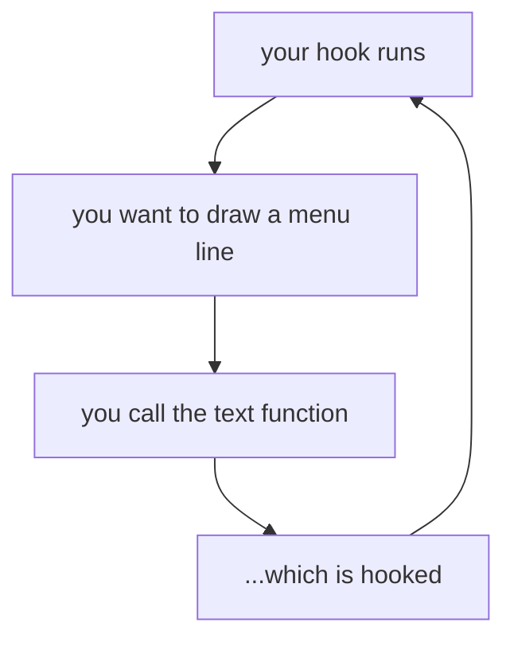
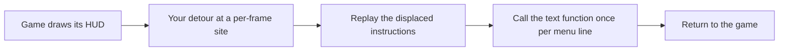

import Frame from '../../../../components/kit/Frame.astro';
import { GitHub } from '../../../../components/kit';

import LessonVideo from '../../../../components/LessonVideo.astro';

import MemoryStrip from '../../../../components/MemoryStrip.astro';
import MarginNote from '../../../../components/kit/MarginNote.astro';

## A third option between a window and an overlay

Lesson 6.8 put the menu in its own window, which is the right default: it
cannot corrupt the game's graphics state, and you can close the game without
losing it.

But you have already met a function that draws text *inside* the game. In
Lesson 3.8 you traced Wesnoth's print function; Lesson 6.4 then used its call
site for a verified, reversible text hook. In Lesson 7.9 you called
AssaultCube's print function at `0x0041_9880` to label players. That function already knows
the font, the scale, the screen size, and the right moment in the frame to
draw. Calling it is the cheapest way to put a menu on screen, because the
hard graphics work is done and you are only supplying strings.

<Frame caption="Text uses an existing rendering context">
  
</Frame>

The trade is that you are now running inside the game's render path, so
the hook must finish quickly. A file read, sleep, or blocking channel receive
there delays the game's next frame; Lesson 4.11 measures the same cost in a
per-frame recorder.

## What a game's interface is made of

Before borrowing the game's text function, it helps to know what it sits on top of. A
game's interface is drawn by the same pipeline as its world (Lesson 7.2), in a last pass
that ignores the 3D camera: flat rectangles and text, placed in screen units.

- **Text.** A font is turned into a **glyph atlas**, a texture holding every character as a
  small image (the atlas idea from Lesson 7.2). To draw "Gold", the engine draws one quad
  per letter, each showing that letter's rectangle in the atlas, and moves along by each
  letter's **advance width**. If the advances of G, o, and l are 12, 9, and 4 pixels, the
  letter d starts 12 + 9 + 4 = 25 pixels to the right of where the G started.
- **Layout.** Elements sit in boxes. **Anchoring** pins a box to part of the screen: a
  200 × 50 box anchored to the bottom-right corner of a 1280 × 720 screen with a 20-pixel
  margin is at `x = 1280 − 20 − 200 = 1060` and `y = 720 − 20 − 50 = 650`. In a **flex**
  layout, boxes in a row share the space by weight: in a 600-pixel row, three boxes with
  weights 1, 2, and 1 get 150, 300, and 150 pixels. A **grid** layout assigns boxes to rows
  and columns, and size limits keep a box between a smallest and a largest size.
- **Scaling.** Interfaces are usually designed for a reference size, such as 1920 × 1080, and
  scaled by the smaller of `width ÷ 1920` and `height ÷ 1080`. On a 1280 × 720 screen both
  are 0.6667, so a 300-pixel button is drawn 200 pixels wide. The window's scale factor from
  Lesson 6.7 multiplies the result again.
- **Stretchable art.** A button picture with decorated corners cannot simply be stretched.
  **Nine-slice** drawing cuts it into a 3 × 3 grid: the four corners keep their size, the
  four edges stretch in one direction, and the centre stretches in both. Drawing a picture
  with 16-pixel corners as a 200 × 60 button gives four 16 × 16 corners, top and bottom
  edges 200 − 32 = 168 wide, side edges 60 − 32 = 28 tall, and a 168 × 28 centre.
- **Order and clipping.** Elements are drawn back to front by a layer number. **Clipping**
  hides whatever falls outside a box, which is how a scrolling list works: the items are
  moved up by the scroll amount, and only the part inside the list's box is drawn.
- **Input and focus.** A click is tested against each box's rectangle, the 2D picking of
  Lesson 7.5, and the topmost box under the cursor gets it. For a keyboard or gamepad, the
  game keeps a **focus**, the element that will respond, and moves it to the nearest
  element in the direction pressed. A **text box** keeps a string and a cursor position and
  receives typed characters. Sliders, checkboxes, and buttons are each a small state
  machine: a value, and whether they are hovered, pressed, or focused.
- **Popups.** A **context menu** is a box created at the cursor when the right button is
  pressed and sized to fit its items. If it would run off the screen it is moved back: a 150
  pixel wide menu opened at `x = 1200` on a 1280 pixel screen is placed at
  `min(1200, 1280 − 150) = 1130`.
- **Where it is drawn.** Most interface is drawn over the finished 3D picture. It can also be
  drawn into a texture and placed on a surface in the world, such as a screen on a wall, and
  a label that follows an object uses the projection from Lesson 7.9.

Lesson 6.8 contrasts the two ways such code is written: an **immediate-mode** interface
redraws every element on every frame from the current state, and a **retained-mode**
interface keeps a tree of elements in memory and changes them when something happens.

<MarginNote kind="alternative">Drawing location and interface storage are separate choices: the same saved menu settings can drive either a separate window or an in-game text pass.</MarginNote>

## Hook a per-frame site, then call the text function

The obvious idea is to hook the text function itself. That is the one thing
that cannot work:



The hook calls the text function, and the text function runs the hook again:
recursion with no base case, the same failure as a wrapper that forwards to
itself in [Lesson 7.3](/pages/5/03/#keep-the-original-function). Every nested
call adds a stack frame, so the stack overflows while the hook is still trying
to draw its first menu line.

<MarginNote kind="narration">Calling the hooked text function from its own replacement never reaches a finished menu line; each attempt creates another unfinished call on the stack.</MarginNote>

Hook a site that runs **once per frame** instead, and call the text function
from there as an ordinary function:



Lesson 7.9 already identified such a site in AssaultCube: the final print hook
at `0x0040_BE7E`, resuming at `0x0040_BE83`. Drawing there puts your lines in
the same pass as the game's own HUD, so they inherit its ordering and never
appear underneath the world.

## Reconstruct the contract before you call it

Calling a function you found is Lesson 6.1's problem, not a new one. Before
the first call, answer its four parts:

- which arguments it takes, and in what order — typically a screen position
  and a string;
- where those arguments go, which for a 32-bit game usually means `cdecl` on
  the stack, or `thiscall` with the renderer object in `ecx`;
- what it returns, if anything;
- whether it **copies** the string or merely stores the pointer.

That last question is the one that bites. If the function keeps the pointer and
draws later in the frame, a string you built on the stack is gone by then:

```rust
// ❌ The buffer dies at the end of this function. If the game reads the
//    pointer later in the frame, it reads freed stack space.
let line = format!("radar [on]");
draw_text(10, 10, line.as_ptr());
```

Keep an owned buffer alive for at least as long as the frame, and give the
function a pointer into that:

```rust
// ✅ `lines` outlives the call, and the trailing zero is explicit because a
//    C-style text function reads until it finds one.
struct MenuText {
    lines: Vec<std::ffi::CString>,
}
```

`CString` is the same tool Lesson 3.8 used at the C boundary, and for the same
reason: it guarantees the terminating zero and rejects interior zero bytes
instead of silently truncating your text.

## Colour is usually a marker inside the string

Many engines let a string carry its own formatting. The mechanism is nearly
always the same: a marker byte the renderer watches for, followed by an index
that selects a palette entry. AssaultCube uses the form feed character,
`0x0C`, followed by a digit.

<MemoryStrip
  cells="=0C|=33|=52|=61|=64|=61|=72"
  groups="0-0:marker (form feed)|1-1:palette index '3'|2-6:visible text: `Radar`"
  caption="AssaultCube's colour marker in front of the string `Radar`. The marker and index are consumed by the renderer, not drawn, so these 7 bytes show only 5 visible characters."
/>

Two consequences follow, and both matter.

The marker and index are **consumed**, not drawn, so the string's byte length
is larger than the number of visible characters. That is the same distinction
Lesson 3.8 drew between bytes, code units, scalars, and what a reader sees; a
menu that lines up columns by counting bytes will be crooked.

And the exact marker is a fact about one build. Confirm it by drawing a string
containing a candidate byte and watching what happens, rather than trusting the
number above.

## The menu itself is a small state machine

<GitHub path="rust-labs/src/bin/text_menu_lab.rs" />

Everything above is about getting characters on screen. The part that actually
misbehaves is the bookkeeping, so
[`text_menu_lab.rs`](/rust-labs/src/bin/text_menu_lab.rs)
models it in portable safe Rust with no graphics API involved:

```powershell
cd rust-labs
cargo run --bin text_menu_lab
cargo test --bin text_menu_lab
```

### A wrapping cursor underflows if you write the obvious thing

Moving the cursor up from the first row should land on the last. The natural
expression is wrong:

```rust
self.cursor = (self.cursor - 1) % self.items.len();   // ❌
```

When `cursor` is `0`, `0 - 1` on an unsigned integer panics in a debug build
and produces `usize::MAX` in a release build, which then indexes far outside
the list. Handle the boundary explicitly and the intent is visible:

```rust
self.cursor = if self.cursor == 0 { last } else { self.cursor - 1 };
```

<MemoryStrip
  cells="0=item 0|1=item 1|2=item 2|3=item 3"
  marks="0"
  caption="For example, four menu rows with the cursor on the first. Pressing up should wrap to the last row, not compute `0 - 1` on an unsigned index."
/>

<MemoryStrip
  cells="0=item 0|1=item 1|2=item 2|3=item 3"
  marks="3"
  caption="After the explicit boundary check, the cursor wraps to the last row instead of underflowing."
/>

### `GetAsyncKeyState` reports a level, not a press

Lesson 6.7 made this point about input paths and it decides how a menu feels.
`GetAsyncKeyState` answers "is this key down right now?", which is true on
every frame of one press. A menu that acts on that answer scrolls the whole
list in a fraction of a second.

What a menu needs is the *edge* — the frame where the key changed from up to
down — which means remembering the previous frame:

<MarginNote kind="brief">A menu advances on a press transition, rather than on every frame in which the key remains down.</MarginNote>

```rust
let pressed = current.down && !previous.down;
```

The lab test holds the key for ten frames and asserts the cursor moved exactly
one row. That is the behavior to aim for, and it is the same edge-versus-level
distinction Lesson 4.10 used for bot events.

### Build the strings without allocating every frame

The render path runs thousands of times per second. Clear and reuse one buffer
rather than allocating a fresh `Vec` per frame; the lab asserts the buffer's
capacity is unchanged after a second render.

The menu should also own only its own state. Keep the same split Lesson 6.8
used: the menu produces settings and commands, and the worker reads them. A
menu that reaches directly into game memory while the render thread is drawing
has put a second writer on the same data.

## Restore the site, not just the feature

Closing the menu is a display change. Unloading the tool is a lifetime change,
and Lesson 7.12's ordering applies without modification: stop the worker, wait
for it to leave the hooked path, restore the displaced bytes, then release the
DLL. While an in-flight frame is still executing the detour, the hook is
**draining**: no new calls should enter, but the current call must finish before
its code is removed. Lesson 6.10 established this lifetime rule for a general
hook manager; the render hook is another application of it.

<LessonVideo
  title="Combined tools running in AssaultCube"
  src="/assets/images/5/10/cube.mp4"
  duration="12 seconds"
  caption="The original multihack recording combines features from the preceding AssaultCube lessons. Compare their visible effects with the independent settings a menu exposes: changing a setting and drawing that setting are separate responsibilities."
/>

## Scope

This is the same offline, version-pinned lab used since Chapter 7, and the same
menu model as Lesson 6.8 rendered somewhere else. The transferable skill —
calling a function you recovered, with a contract you proved, from a hook that
runs at a known point in a frame — is what a debug HUD, a benchmarking overlay,
and an accessibility tool all do.
