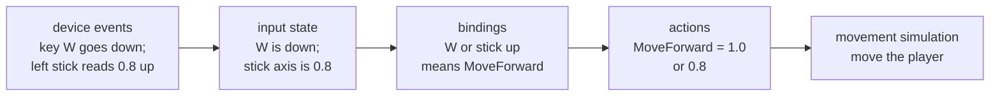

import MotionPicture from '../../../../components/kit/MotionPicture.astro';
import { Accordion, Badge, CodeGroup, Example, HoverCard, Math, Panel, Steps, Tab, Tabs, Tooltip, SpeedType } from '../../../../components/kit';
import MemoryStrip from '../../../../components/MemoryStrip.astro';
import ConceptLab from '../../../../components/ConceptLab.astro';
import MarginNote from '../../../../components/kit/MarginNote.astro';

Lesson 6.7 compares the ways Windows delivers input to a program and the ways a
tool can read or send it. Before that comparison makes sense, it helps to know what
a game does with input once it has arrived. A game never asks the hardware whether
the W key is down while it is deciding where to move. It keeps a small amount of
input state, refreshes it once per frame, and turns it into actions.

## From a device to an action

Input passes through three layers, and each one changes what the value means:



The device layer is what the operating system reports: a key went down, the mouse
moved 12 <Tooltip tip="A count is the smallest step a mouse can report. A mouse set to 800 counts per inch reports 800 counts when it moves one inch, so 12 counts is 12 ÷ 800 = 0.015 inch.">counts</Tooltip>, a stick reads 0.8. The state layer is the engine's own copy of
those facts, refreshed once per frame. The action layer converts them using the player's bindings and settings. Movement and jump code then consume named actions rather than physical keys. The same jump can therefore come from a keyboard, a controller, or a remapped key without changing the jump calculation.

## Buttons: down, just pressed, and just released

For every button the engine can answer three questions on every frame:

- Is it **down now**? This stays true for as long as the button is held.
- Was it **just pressed**? This is true on the single frame where it went from up to down.
- Was it **just released**? This is true on the single frame where it went from down to up.

The last two are called **input edges**. The engine finds them by keeping last frame's
copy of the state and comparing: a button is just pressed when it is down now and
was not down last frame.

<MotionPicture
  id="input-button-edge"
  still="/assets/images/original/input-edge-still.png"
  motion="/assets/images/original/input-edge.gif"
  width={360}
  height={182}
  alt="A held-button check toggles a lamp on three successive down samples; a new-press check toggles it only on the first down sample."
  caption="Slow lamp illustration: false, false, true, true, true, false. Toggling on every down sample changes the lamp three times; toggling only on just pressed changes it once. Playback is slowed so each sample can be seen."
/>

The engine collects the operating system's events once, at the start of each frame.
A press that arrives while a frame is being processed therefore waits for the next
frame's collection:

<Example title="A key held for 150 ms at 60 frames a second">

A frame is 1000 ÷ 60 = 16.67 ms, so frame 6 starts at 6 × 16.67 = 100.0 ms. The key
goes down at 105 ms, during frame 6, and comes up at 255 ms, during frame 15:

| Frame | Starts at | Down now | Just pressed | Just released |
|---|---|---|---|---|
| 6 | 100.0 ms | no | no | no |
| 7 | 116.7 ms | yes | **yes** | no |
| 8 to 15 | 133.3 to 250.0 ms | yes | no | no |
| 16 | 266.7 ms | no | no | **yes** |

The game saw the press 116.7 − 105 = 11.7 ms after it happened, and it saw the key
down on frames 7 to 15, which is 9 frames and 9 × 16.67 = 150 ms, the time it was
really held. The delay between the press and the game noticing is at most one
frame.

</Example>

Holding a key also makes the operating system send repeated key-down events, which
is how a text box types a held letter many times. Games ignore the repeats: the key
is simply still down.

<Accordion title="Optional: how long must a tool hold a key for a game to see it?">

It depends on how the game reads the keyboard. A game that collects events, as above,
sees even a very short press, because the down and the up wait in the queue until the
next frame. A game that polls, asking "is the key down right now?" once per frame, sees
a press only if one of its polls lands inside it. Polls are one frame apart, which is
1000 ÷ 60 = 16.67 ms at 60 frames a second.

A press that lasts *D* ms and starts at a random moment contains a poll with probability
*D* ÷ 16.67. A 5 ms press is seen 5 ÷ 16.67 = 0.30, which is 30% of the time. A 10 ms
press is seen 10 ÷ 16.67 = 0.60, or 60% of the time. A press of 16.67 ms or more is always
seen, if every frame lasts 16.67 ms. Frames vary, so a tool that must be seen holds the key
for the longest frame it expects, such as 2 frames, 2 × 16.67 = 33.3 ms.

</Accordion>

## Why edges go missing in fixed steps

Lesson 4.2 showed that a fixed step is a slice of game time, so a frame can run
zero, one, or several steps. An edge lasts one frame, so a step that runs on a
different frame never sees it:

<Example title="A press that no step sees">

The game draws at 144 frames a second, so a frame is 1000 ÷ 144 = 6.94 ms, and runs
movement and collision updates in 60 Hz steps, which are due every 16.67 ms. The engine runs the steps
that are owed at the start of each frame:

| Frame | Starts at | Steps run | Just pressed in this frame |
|---|---|---|---|
| 3 | 20.8 ms | 1 (the one due at 16.7 ms) | no |
| 4 | 27.8 ms | 0 | **yes** |
| 5 | 34.7 ms | 1 (the one due at 33.3 ms) | no |

The press is visible on frame 4 only, and frame 4 runs no step. By frame 5 the edge
is gone, and the step that runs there sees nothing. If instead two steps had run
on frame 4, both would have seen the same press, and a jump would have happened
twice.

</Example>

The repair is to keep a press available until a simulation step can consume it. The input
system turns a press into an event or an **intent**, such as "jump requested", that
stays in the queue until a step consumes it, exactly once. Many engines suggest
doing this for input-sensitive updates that run in fixed steps.

<MarginNote kind="brief">A queued intent survives between render frames and simulation steps, then disappears when one step consumes it.</MarginNote>

## Sticks and triggers: values between −1 and 1

A thumbstick reports two **axes**, each a number from −1.0 (all the way one way)
through 0 (centred) to +1.0. A trigger reports one axis from 0 to 1. A stick that
nobody is touching rarely reads exactly 0, because springs and sensors are not
perfect, so a resting stick might report 0.06. Without a fix, the character would
drift.

The fix is a **dead zone**: a range around 0 that the game treats as 0. With a
dead zone *d* of 0.15, any value whose size is below 0.15 becomes 0. Simply cutting
the range would make the output jump from 0 to 0.15 when the stick leaves the
zone, so engines usually rescale the rest of the range to start from 0:

<MarginNote kind="alternative">Picture the dead zone as slack around a centred knob; rescaling the remaining travel makes the first meaningful movement start smoothly.</MarginNote>

<Math block tex="\text{out} = \operatorname{sign}(v)\,\frac{|v| - d}{1 - d} \quad\text{when } |v| \ge d,\ \text{otherwise } 0" speak="the output is the sign of v times the size of v minus d, divided by one minus d, when the size of v is at least d, and zero otherwise" />

With *d* = 0.15 a reading of 0.5 becomes (0.5 − 0.15) ÷ (1 − 0.15) = 0.35 ÷ 0.85 =
0.41, a reading of 0.15 becomes 0, a reading of 1.0 stays 1.0, and the resting 0.06
becomes 0. As a function, in the two languages this book uses:

<CodeGroup sync="lang">
  <Tab label="Rust">

<SpeedType id="dead-zone-filter" title="Type the dead zone" recall={[{"text": "v: f32, d: f32", "hint": "Accept the signed input and the dead-zone radius as floating-point values."}, {"text": "v.abs() < d", "hint": "Check whether the input magnitude lies inside the dead zone."}, {"text": "v.signum() * (v.abs() - d) / (1.0 - d)", "hint": "Preserve the sign and rescale the remaining magnitude to reach one at full input."}]}>

```rust
fn dead_zone(v: f32, d: f32) -> f32 {
    if v.abs() < d {
        0.0
    } else {
        v.signum() * (v.abs() - d) / (1.0 - d)
    }
}
```

</SpeedType>

  </Tab>
  <Tab label="Lua">

```lua
local function dead_zone(v, d)
  if math.abs(v) < d then
    return 0
  end
  local sign = v < 0 and -1 or 1
  return sign * (math.abs(v) - d) / (1 - d)
end
```

  </Tab>
</CodeGroup>

Both return 0.4118 for `dead_zone(0.5, 0.15)` and −0.4118 for `dead_zone(-0.5, 0.15)`,
because the sign is kept and only the size is rescaled.

<ConceptLab
  id="dead-zone-explore"
  lab="blanks-dead-zone"
  label="Explore the dead zone function by changing one piece"
/>

A stick has two axes, so there is a second choice: apply the dead zone to each
axis separately, or to the stick's overall distance from the centre. They differ
when the stick sits diagonally with a small push. Take a reading of 0.12 on both
axes:

<Tabs sync="deadzone">
<Tab label="Per-axis dead zone">

Each axis is checked alone. 0.12 is below 0.15 on both, so both become 0 and the
output is (0, 0). A small diagonal push is ignored completely, and the stick feels
dead in the diagonals while a straight push of 0.2 still works.

</Tab>
<Tab label="Radial dead zone">

The dead zone applies to the distance from the centre: √(0.12² + 0.12²) = 0.12 ×
1.414 = 0.17. That is above 0.15, so it counts. Rescaled, (0.17 − 0.15) ÷ 0.85 =
0.023, kept in the same direction, which is 0.023 × 0.707 = 0.016 on each axis. The
output is (0.016, 0.016), a small push that still points the right way.

</Tab>
</Tabs>

Keyboard movement has a related trap. Pressing W and D together is the vector (1, 1),
whose length is √(1² + 1²) = 1.414. Used as it is, walking diagonally would be 41%
faster than walking straight. Engines **normalise** the result by dividing by its
length, which gives (0.707, 0.707) and a length of 1 again. A game that forgets this
lets a player move faster by strafing, a flaw that older games are well known for.

```rust
fn walk(x: f32, y: f32) -> (f32, f32) {
    let length = (x * x + y * y).sqrt();
    if length > 1.0 { (x / length, y / length) } else { (x, y) }
}
```

`walk(1.0, 1.0)` returns `(0.707, 0.707)`, whose length is 1. `walk(0.6, 0.0)` is left
alone, because a length below 1 is a gentle push, and shrinking it would make a half-pressed
stick as fast as a full one.

## Keys: where a key is and what it types

A keyboard key has two identities. Its **position** is a fixed place on the board,
reported as a scan code or key code. The **character** it types depends on the
layout the player has selected. On a QWERTY keyboard the top letter row reads Q W E
R T Y. On an AZERTY keyboard, the layout common in France, the same row reads A Z E
R T Y, so the physical key where QWERTY has W types Z:

| | QWERTY | AZERTY |
|---|---|---|
| Label on the key in the W position | W | Z |
| Scan code of that physical key | `0x11` | `0x11` |
| Windows virtual-key code it produces | `0x57` (W) | `0x5A` (Z) |

Games bind movement to key positions, so the four keys under the left hand are
forward, left, back, and right on any layout, with different letters printed on them.
Text boxes want the opposite: they read characters, so a French player types French.
A game that checks the virtual-key code for W breaks on the AZERTY keyboard, because
the key that sends it is somewhere else.

Languages with thousands of characters are typed through an **input method editor**,
or IME. The player composes a word in a pending buffer, sees suggestions, and
confirms one. The game receives the pending text, so it can show it underlined, and
then the final text once the player confirms. While composing, the keys go to the
IME rather than to the game as ordinary key events, which is why a text box needs
to switch IME mode on, and gameplay must not.

## The mouse: where it is, how far it moved, and the wheel

The mouse reports three different things, and a game uses them for different jobs:

- **Cursor position**, in window coordinates: the origin is the top left corner of
  the window and y grows downward, counted in pixels. It is used for clicking and
  hovering over menus. A display set to 125% reports 1,000 logical pixels as
  1,000 × 1.25 = 1,250 physical ones.
- **Motion**, the distance moved since the last report, such as +12 counts across
  and −3 up. It is used for looking around, and the turn is the motion times a
  sensitivity: 12 counts at 0.1° a count turn the view by 12 × 0.1 = 1.2°.
- **The wheel**. On Windows one notch of a traditional wheel is 120 units, so 3
  notches report 360 units, which a game reads as 3 lines. A touchpad reports
  small, smooth amounts in pixels instead, so engines tell the two units apart and
  scale each one differently.

A game that looks around with the mouse takes control of the cursor. In a **locked**
mode the cursor is hidden and cannot reach the window's edge. Windows has no
built-in lock, so many engines move the cursor back to the centre after every read,
and others read the mouse's raw movement directly:

<Example title="A look-around loop in a 1280 × 720 window">

The centre is at (1280 ÷ 2, 720 ÷ 2) = (640, 360). The mouse moves, and the
engine reads the cursor at (652, 357). The motion is (652 − 640, 357 − 360) =
(+12, −3), the engine turns the view by it, and then it places the cursor back at
(640, 360) for the next frame.

</Example>

A **confined** mode keeps the cursor visible but inside the window, which suits
strategy games that scroll when the pointer reaches an edge.

## Touch and controllers

A touch screen reports every finger separately. A finger gets an identifier when
it lands and keeps it until it lifts, and the engine reports its position each
frame. Gestures are not part of the hardware: the game builds them by comparing
fingers. A pinch compares the distance between two of them. If the fingers start
200 pixels apart and end 300 pixels apart, the zoom factor is 300 ÷ 200 = 1.5.

A controller has an identifier of its own, which is how a local multiplayer game
tells player 2's pad from player 1's. Its buttons are named by position, such as
south, east, west, and north, because the same four buttons are labelled A, B, X,
and Y on one maker's pad and cross, circle, square, and triangle on another's.
Vibration requests add up: two rumbles of strength 0.3 and 0.5 running at once
drive the motor at 0.3 + 0.5 = 0.8.

## Losing focus and stuck keys

When the player switches windows while holding a key, the game never receives the
key-up. If it kept the old state, the key would look held when the player came
back. Engines therefore watch for a focus-lost event and clear their input state
when it arrives. A tool that polls the hardware directly, as in Lesson 6.7, still
sees the keys while the game is out of focus, which is why such a tool must check
for focus itself.

<MarginNote kind="narration">Switching windows mid-press can hide the release event. Clearing saved input on focus loss prevents the returning game from treating the key as permanently held.</MarginNote>

## Bindings are data

The link between a key and an action is a table the game keeps in a settings file:

```text
[bindings]
move_forward = KeyW, StickLeftUp
jump         = Space, ButtonSouth
fire         = MouseLeft, TriggerRight
```

A rebinding screen is a small loop on top of the same table: wait for the next
press, store its key code against the chosen action, and write the file. For a
tool this table matters in two ways. Editing the file changes what a key does
without touching the game's memory, as in Chapter 9, and an action can be
requested by making the game receive the event that its binding turns into an
action, rather than by faking the keyboard.

## Where input sits in memory

The state layer is usually a few small structures: an array with one entry per key,
a second array holding last frame's copy for the edge test, a pair of numbers for
mouse motion, and the axis values as floats. A Windows game that indexes its key
array by virtual-key code finds W at index 0x57, which is 87, the ASCII code of the
letter W.

<Badge text="Windows VM" variant="note" />

You can find such an array with the same filtering idea as the gold scan in
Lesson 1.9, except that the value is not shown on screen:

<Steps>

1. Start a scan for a one-byte value with the type unknown, while the key is up.
2. Hold the key and keep holding it, then scan for values that changed.
3. Release the key and scan for values that changed again.
4. Repeat the hold and the release until a handful of addresses are left.
5. Hold the key and read the survivors: the right one holds a non-zero value while
   the key is down and 0 when it is up. If the game keeps one entry per key, the
   neighbouring bytes belong to the neighbouring key codes.

</Steps>

<Panel title="Input at a glance">

| Kind | What the game gets | When it changes | A common mistake |
|---|---|---|---|
| Button | down now, just pressed, just released | on a press or a release | reading an edge in a step that did not run that frame |
| Axis | a number from −1 to 1 | continuously | no dead zone, so the character drifts |
| Key position | a scan code | when that physical key moves | binding to a letter instead, which breaks on other layouts |
| Typed text | a string of characters | after composing | using key codes for a text box |
| Cursor | window coordinates | whenever the pointer moves | using it for looking around, where it runs out of room |
| Motion | counts since last report | whenever the mouse moves | forgetting the sensitivity scale |

</Panel>

Lesson 6.7 shows how Windows delivers these events to a program and how a local
tool can read or send them.
