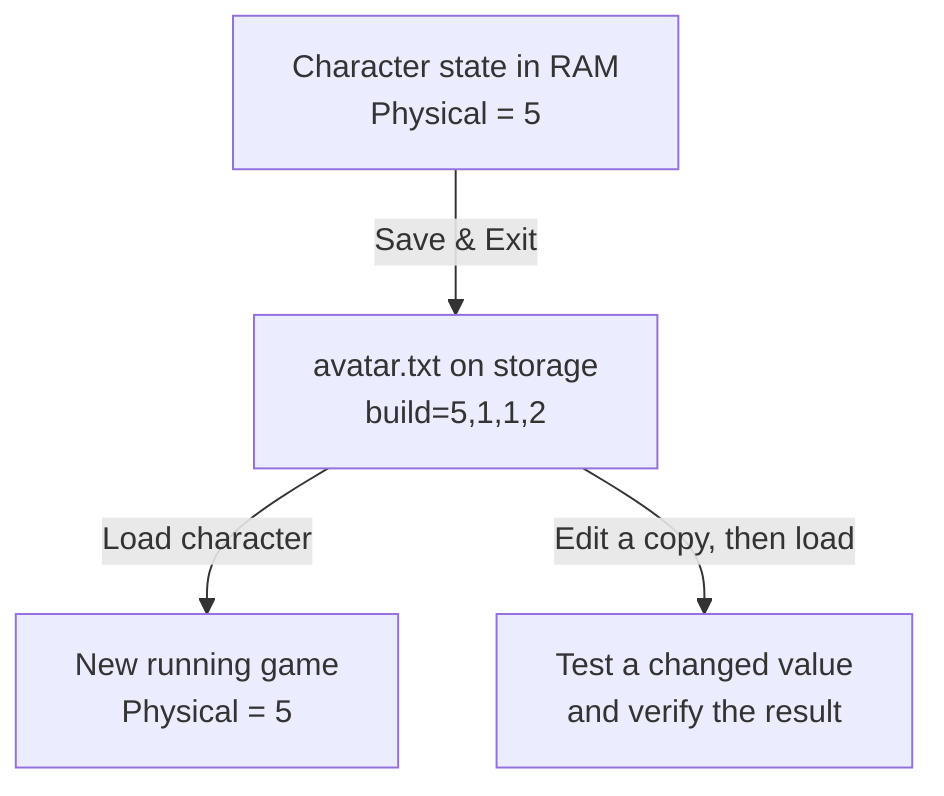

## State can outlive a running game

A live memory edit affects the current game session. What if a change should
still be there after the game closes and reopens? The game must save some state
to storage and load it again later. For the Flare character used in the next
lesson, the visible Physical attribute starts at `5`; its save includes
`build=5,1,1,2`. That line gives us a specific question: which file stores
the value, and can the game still load it after a controlled edit?

The chapter starts with readable saves, then opens a binary save byte by byte.
The same care with formats carries into textures, unit definitions, and mod
archives. Manifests, signatures, and encryption answer later questions:
which files changed, who approved them, and who can read them?



The file is a durable representation of part of the running state. It is not the same bytes at the same memory address: the game writes a format it knows how to read later. We will locate and copy the real file before changing its contents.

Saves are only one kind of game file. Games also load:

- settings and configuration;
- saves and profiles;
- maps and level scripts;
- textures, models, and sounds;
- localization text;
- unit or item definitions;
- archives that bundle many files.

If a supported mod file can express your idea, use it. File-based changes are easier to inspect, share, version, and undo than live memory patches.

:::note
🗂️ **Parser rule:** copy the original, parse into named fields, validate every boundary, then write a new file. Keep the untouched source as your way back.
:::


## Observe file access

We know the Flare attribute is saved, but a folder may contain several saves, backups, and shared stashes. Use Process Monitor inside the VM to see which paths the game opens when you:

- start the game;
- load a save;
- enter one map;
- change one setting;
- close the game.

Filter by the target process and operations such as `CreateFile`, `ReadFile`, and `WriteFile`.

For this experiment, create a disposable character and choose **Save & Exit** once. A write to `avatar.txt` near that action is a candidate; Lesson 9.2 confirms the path and the `build=` field before changing it.

## Copy before parsing

The candidate file is evidence as well as game data. Never experiment on the only copy:

```rust
use std::{fs, path::Path};

fn make_backup(path: &Path) -> anyhow::Result<()> {
    let extension = path.extension()
        .and_then(|value| value.to_str())
        .unwrap_or("file");
    let backup = path.with_extension(format!("{extension}.gha-backup"));
    anyhow::ensure!(!backup.exists(), "backup already exists: {}", backup.display());
    fs::copy(path, &backup)?;
    Ok(())
}
```

Keep the original bytes and record a hash.

## Identify the kind of file

The extension is only a hint. Inspect the first bytes:

```rust
use std::{fs::File, io::{self, Read}, path::Path};

fn first_bytes(path: &Path, count: usize) -> io::Result<Vec<u8>> {
    let mut file = File::open(path)?;
    let mut bytes = vec![0_u8; count];
    let read = file.read(&mut bytes)?;
    bytes.truncate(read);
    Ok(bytes)
}
```

Common “magic” bytes include:

```text
PNG     89 50 4E 47 0D 0A 1A 0A
ZIP     50 4B 03 04
gzip    1F 8B
```

A file with no readable text may be compressed, encrypted, or simply binary.

## A file format is a rule for slicing bytes

A file is only a numbered sequence of bytes. A **format** is the fixed rule that says where one field ends and the next begins, and how to read the bytes in between — as text, as a count, as an offset into the same file, and so on. Two parsers that apply the same rule to the same bytes must agree on every field, or one of them has the format wrong.

The Flare line `build=5,1,1,2` is a small text-format example. A parser finds
the line's `=`, treats `build` as the field name, splits the right side at
commas, and checks that it got four numbers. Only then can it say the first
number represents Physical. Finding the digit `5` anywhere in the file would
not establish that: another field could contain the same character. Lesson 9.2
checks the actual save structure before changing that value.

```text
header → version and counts
table  → where entries begin
data   → the actual records or assets
footer → optional checksum or index
```

That sketch describes one possible binary layout, not the layout of Flare's
text save. A PNG begins with the fixed bytes shown above; a different binary
format might begin with a count telling its parser how many records follow.
For either format, the boundary rule has to come from the format, not from a
guess based on the file extension.

Text formats use character encodings and visible separators. Binary formats use fixed fields, lengths, offsets, and flags. Neither kind is automatically safer or simpler; both need a parser that rejects impossible sizes and missing fields.

Compression and archives are also different ideas. Compression tries to represent data in fewer bytes. An archive gives many named entries one container. ZIP normally does both, but a ZIP entry can also be stored without compression.

A **checksum** is a compact value calculated from other bytes to detect accidental changes. A cryptographic signature additionally uses a key to prove who produced the data. Renaming or recompressing a file does not recreate a valid signature.

## Parse in two stages

First prove the bytes are structurally safe to read. Then decide whether the decoded values make sense for the game.

```text
byte validation: offsets, lengths, counts, encoding, checksums
meaning validation: known version, valid IDs, legal ranges, consistent references
```

A file can pass one stage and fail the other. A well-formed save might refer to an unknown unit type, while a familiar unit name can appear inside a truncated file. Keeping the stages separate produces precise errors and stops friendly-looking text from bypassing boundary checks.

Use a cursor or checked slice ranges rather than repeatedly calculating raw indexes. Every parser step should either consume a proven range or return an error without changing the input file.

## Parse, do not search-and-replace blindly

For text formats, prefer a real parser:

- `serde_json` for JSON;
- `toml` for TOML;
- `quick-xml` for XML;
- a format-specific library when available.

Blind replacement can alter comments, unrelated fields, encodings, checksums, or lengths.

Parsing creates a **data model** that is intentionally smaller and clearer than the file representation. Preserve fields you do not understand when the format allows round trips, and distinguish “missing,” “present with a default value,” and “present with an unknown value.” Those cases may serialize differently even when the game currently displays the same result.

## Treat files as untrusted input

Even a local save can be malformed. A parser should enforce:

- file-size limits;
- collection-count limits;
- string-length limits;
- checked offsets and sizes;
- valid encoding;
- no path traversal when extracting archives.

Never join an archive entry such as `../../important.txt` directly to an output folder.

## A reversible file workflow

The preceding rules become easier to remember as one file journey. The
starting hash identifies the untouched original; the diff shows exactly what
the serializer changed; the disposable profile tells us whether the game
accepts the new representation:

```text
identify the exact file
→ copy and hash the original
→ parse into typed data
→ change one field
→ serialize to a new file
→ compare the diff
→ test in a disposable profile
```

Change one field at a time, as with memory patches: when a single change breaks the load, the diff names the field that caused it.
