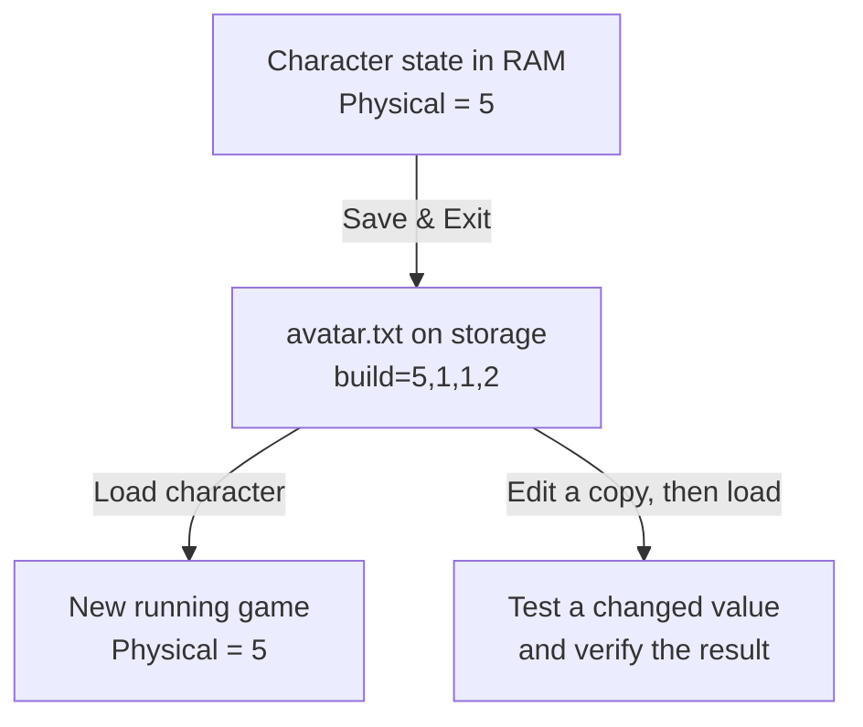
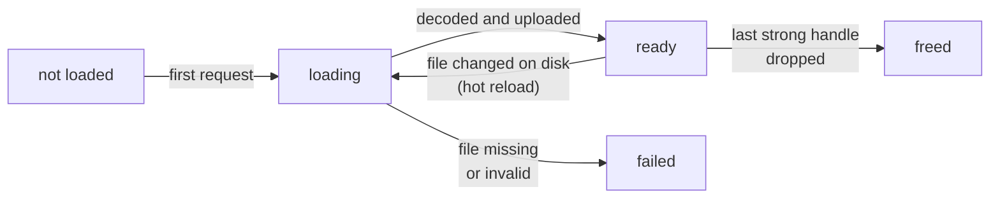

import { Example, Frame, HoverCard, Panel, Tooltip } from '../../../../components/kit';
import ConceptLab from '../../../../components/ConceptLab.astro';

## State can outlive a running game

A live memory edit affects the current game session. What if a change should
still be there after the game closes and reopens? The game must save some state
to storage and load it again later. For the Flare character used in the next
lesson, the visible Physical attribute starts at `5`; its save includes
`build=5,1,1,2`. That line gives us a specific question: which file stores
the value, and can the game still load it after a controlled edit?

The chapter starts with readable saves, then opens a binary save byte by byte.
The same care with formats carries into textures, unit definitions, and mod
archives. Manifests, signatures, and encryption answer later questions:
which files changed, who approved them, and who can read them?



The file is a durable representation of part of the running state. It is not the same bytes at the same memory address: the game writes a format it knows how to read later. We will locate and copy the real file before changing its contents.

Saves are only one kind of game file. Games also load:

- settings and configuration;
- saves and profiles;
- maps and level scripts;
- textures, models, and sounds;
- localization text;
- unit or item definitions;
- archives that bundle many files.

If a supported mod file can express your idea, use it. File-based changes are easier to inspect, share, version, and undo than live memory patches.

:::note
🗂️ **Parser rule:** copy the original, parse into named fields, validate every boundary, then write a new file. Keep the untouched source as your way back.
:::

<Frame caption="A game world built from many resources: textures, models, sounds, and maps.">


</Frame>

## From a file to something on screen: loading an asset

A file on disk is not what the game draws. An **asset** is any file the game loads, such as
a texture, a model, a sound, or a level, and loading one takes several steps:

1. The game asks for the asset by **path**, and the engine hands back a **handle** at once,
   a small ID like the entity IDs of Lesson 4.1. The data has not arrived yet.
2. A background task (Lesson 4.1) reads the file and **decodes** it. A PNG's compressed
   bytes become raw pixels. A 256 × 256 image that takes 40 KB on disk becomes
   256 × 256 × 4 bytes (red, green, blue, and alpha) = 262,144 bytes. A **mipmap chain** adds
   half-size copies, 128 × 128 down to 1 × 1, for distant surfaces, and the copies add
   about a third more: 262,144 × 4 ÷ 3 ≈ 349,525 bytes.
3. The pixels are **uploaded** to the graphics card's memory. Only then is the asset
   *ready*. Until then the handle says "loading," and the engine draws a stand-in or nothing.
4. The engine keeps a cache, so a second request for the same path gets the same handle and
   no second copy. This is the shared asset behind the separate instances of Lesson 1.3.

There are a few variations. An **embedded** asset is compiled into the executable, so a
small icon needs no file. A **generated** asset is built while the game runs, such as a
texture drawn by code. A **web** asset is downloaded. A loading screen waits for every
handle it asked for and moves on when the count of unfinished ones reaches 0.

This explains two things you will meet. A replacement file is found by its **path**, so a
mod must keep the name, the folder, and the format (Lesson 9.4). And memory holds the
decoded pixels, not the PNG, so a scan of the process finds raw image data and never the
file's own bytes.

## How long an asset lives

Loading is the first half of an asset's life. The rest depends on who still holds its
handle.

In Bevy and engines like it, a handle comes in two kinds. A **strong** handle keeps the
asset alive, and the engine counts them. A **weak** handle names the asset without
keeping it alive, so a lookup can use it without delaying the moment the asset is
freed. When the count of strong handles reaches 0, the engine frees the decoded data,
and the copy on the graphics card goes with it.

<Example title="A 256 × 256 bullet texture with 40 bullets">

The level's loader holds one strong handle, and every bullet that draws the texture holds
another.

| Moment | Strong handles | Texture in memory? |
|---|---|---|
| the level has loaded, no bullets yet | 1 | yes, 349,525 bytes with its mipmaps |
| 40 bullets are fired | 1 + 40 = 41 | yes |
| all 40 bullets despawn | 1 | yes |
| the level unloads and its loader lets go | 0 | freed |

</Example>



So a scan for the decoded pixels finds them only between the first request and the
moment the last handle is dropped. After the level changes, the same address can hold
something else, as entity addresses do (Lesson 4.1).

One file can hold several assets. A 3D model file typically holds meshes, materials,
textures, animations, and scenes, and the engine gives each part its own handle, named
by the file's path and a label, such as `ship.glb#Mesh0`. A model with 3 meshes,
2 materials, 1 texture, 2 animations, and 1 scene gives 3 + 2 + 1 + 2 + 1 = 9 assets
from one path, and the cache described above keeps one copy of each.

### Events and reloading

The engine announces changes to assets. When an asset is added, modified, or removed, it
sends an **asset event**, and a system can react to the event instead of checking. A
system that builds a collision shape when its mesh finishes loading then runs once, on
the event. Checking every frame for the 5 seconds the mesh takes to load would run it
5 × 60 = 300 times to learn the same thing.

A game under development usually also supports **hot reloading**. It watches its asset folder, and
when a file's <Tooltip tip="Every file records when it was last changed, and the operating system updates that time on each save. A watcher only has to compare the time it saw last with the time now.">modification time</Tooltip> changes, it decodes the file again, replaces the data
behind the same handle, and sends a "modified" event. Everything holding the handle
shows the new version on its next draw, with no restart. A shipped game usually turns
the watcher off and reads each file once, when the level loads. What a replaced file
does depends on which of these the game does:

<Panel title="When a replaced file shows up">

| How the game gets the asset | When your replacement shows |
|---|---|
| it watches its folder, as a development build does | on the next frame |
| it reads the file when a level loads | the next time that level loads |
| it reads from an archive | after the archive is rebuilt and the level loads again |
| it has the asset embedded in the executable | never, because no file is read |

</Panel>

## Observe file access

We know the Flare attribute is saved, but a folder may contain several saves, backups, and shared stashes. Use <HoverCard kind="reference" href="https://learn.microsoft.com/en-us/sysinternals/downloads/procmon" body="Microsoft Sysinternals' Process Monitor records file, registry, and process events on Windows as they happen. Download it from Microsoft's own page.">Process Monitor</HoverCard> inside the VM to see which paths the game opens when you:

- start the game;
- load a save;
- enter one map;
- change one setting;
- close the game.

<HoverCard kind="tip" body="In Process Monitor, press Ctrl+L to open the filter dialog. Choose Process Name, is, and the game's executable name, then click Add. Add Operation, is, WriteFile to see only writes.">Filter by the target process</HoverCard> and operations such as `CreateFile`, `ReadFile`, and `WriteFile`.

For this experiment, create a disposable character and choose **Save & Exit** once. A write to `avatar.txt` near that action is a candidate; Lesson 9.2 confirms the path and the `build=` field before changing it.

## Copy before parsing

The candidate file is evidence as well as game data. Never experiment on the only copy:

```rust
use std::{fs, path::Path};

fn make_backup(path: &Path) -> anyhow::Result<()> {
    let extension = path.extension()
        .and_then(|value| value.to_str())
        .unwrap_or("file");
    let backup = path.with_extension(format!("{extension}.gha-backup"));
    // Preserve an existing backup rather than overwriting the way back.
    anyhow::ensure!(!backup.exists(), "backup already exists: {}", backup.display());
    fs::copy(path, &backup)?;
    Ok(())
}
```

This helper takes the path of an existing file. With `avatar.txt`, it writes
`avatar.txt.gha-backup` and returns success only if the copy succeeds. It uses
the `anyhow` dependency for an error that includes the failed path; an existing
backup is an error rather than a reason to overwrite it. Keep the original
bytes and record a hash.

## Identify the kind of file

The extension is only a hint. Inspect the first bytes:

```rust
use std::{fs::File, io::{self, Read}, path::Path};

fn first_bytes(path: &Path, count: usize) -> io::Result<Vec<u8>> {
    let mut file = File::open(path)?;
    let mut bytes = vec![0_u8; count];
    let read = file.read(&mut bytes)?;
    // Report only bytes actually read, not the buffer's unused zeroes.
    bytes.truncate(read);
    Ok(bytes)
}
```

For `first_bytes(path, 16)`, the buffer has room for 16 bytes and the returned
vector contains the bytes obtained by that read. A read can return fewer;
this is a quick identification helper, not validation of an entire header.
Common “magic” bytes include:

```text
PNG     89 50 4E 47 0D 0A 1A 0A
ZIP     50 4B 03 04
gzip    1F 8B
```

A file with no readable text may be compressed, encrypted, or simply binary.

<ConceptLab
  id="magic-bytes-explore"
  lab="blanks-magic-bytes"
  label="Explore the magic-byte check by changing one piece"
/>

## A file format is a rule for slicing bytes

A file is only a numbered sequence of bytes. A **format** is the fixed rule that says where one field ends and the next begins, and how to read the bytes in between — as text, as a count, as an offset into the same file, and so on. Two parsers that apply the same rule to the same bytes must agree on every field, or one of them has the format wrong.

The Flare line `build=5,1,1,2` is a small text-format example. A parser finds
the line's `=`, treats `build` as the field name, splits the right side at
commas, and checks that it got four numbers. Only then can it say the first
number represents Physical. Finding the digit `5` anywhere in the file would
not establish that: another field could contain the same character. Lesson 9.2
checks the actual save structure before changing that value.

```text
header → version and counts
table  → where entries begin
data   → the actual records or assets
footer → optional checksum or index
```

That sketch describes one possible binary layout, not the layout of Flare's
text save. A PNG begins with the fixed bytes shown above; a different binary
format might begin with a count telling its parser how many records follow.
For either format, the boundary rule has to come from the format, not from a
guess based on the file extension.

Text formats use character encodings and visible separators. Binary formats use fixed fields, lengths, offsets, and flags. Neither kind is automatically safer or simpler; both need a parser that rejects impossible sizes and missing fields.

Compression and archives are also different ideas. Compression tries to represent data in fewer bytes. An archive gives many named entries one container. ZIP normally does both, but a ZIP entry can also be stored without compression.

A **checksum** is a compact value calculated from other bytes to detect accidental changes. A cryptographic signature additionally uses a key to prove who produced the data. Renaming or recompressing a file does not recreate a valid signature.

## Parse in two stages

First prove the bytes are structurally safe to read. Then decide whether the decoded values make sense for the game.

```text
byte validation: offsets, lengths, counts, encoding, checksums
meaning validation: known version, valid IDs, legal ranges, consistent references
```

A file can pass one stage and fail the other. A well-formed save might refer to an unknown unit type, while a familiar unit name can appear inside a truncated file. Keeping the stages separate produces precise errors and stops friendly-looking text from bypassing boundary checks.

Use a cursor or checked slice ranges rather than repeatedly calculating raw indexes. Every parser step should either consume a proven range or return an error without changing the input file.

## Parse, do not search-and-replace blindly

For text formats, prefer a real parser:

- `serde_json` for JSON;
- `toml` for TOML;
- `quick-xml` for XML;
- a format-specific library when available.

Blind replacement can alter comments, unrelated fields, encodings, checksums, or lengths.

Parsing creates a **data model** that is intentionally smaller and clearer than the file representation. Preserve fields you do not understand when the format allows round trips, and distinguish “missing,” “present with a default value,” and “present with an unknown value.” Those cases may serialize differently even when the game currently displays the same result.

## The data model shapes the questions you can ask

A **data model** specifies the values, relationships, and constraints that
matter to a program. A character model might name attributes, inventory entries,
and item IDs. A file format specifies how a chosen part of that model is
represented for storage. The raw bytes are another layer below that format.

The Flare line `build=5,1,1,2` illustrates the separation. At the game level,
the first value is the Physical attribute. At the format level, it is the first
comma-separated number in a particular named field. At the byte level, the
digit `5` occupies a position in encoded text. A raw byte search cannot by
itself recover the attribute's role or prove that an unrelated occurrence of
the digit is the same field.

Different storage models expose different relationships:

| Model | A possible game use | What the structure makes explicit |
|---|---|---|
| Nested document, such as JSON or XML | One save with a character and inventory entries | Containment and named fields |
| Relational tables | Character rows and item rows linked by owner IDs | Records, keys, and relationships between tables |
| Graph of nodes and edges | Map locations joined by traversable routes | Connections, and properties of each connection |

These are options, not a claim that every game uses a database or every map
needs a graph database. Choose a model for the questions and updates it must
support. The storage implementation then chooses a byte representation and
access structures. A parser or query interface hides some lower-level details,
but its constraints still affect the layer above.

### Persistent records, caches, and indexes have different jobs

A durable save or database record is intended to survive a restart. A **cache**
stores a result that can be obtained again, such as a decoded texture, to avoid
repeating expensive work. A **search index** is an extra structure that helps
find records matching a key, keyword, or filter without checking everything
from the beginning each time.

Suppose a mod changes a texture file. The game may still display its previously
decoded copy until the asset is reloaded or the cache is invalidated. Editing
the durable source and changing a cached representation are therefore different
operations. Conversely, deleting a rebuildable cache is different from deleting
the player's only save.

Indexes need to remain consistent with the data they describe, and caches need
a policy for becoming stale. When an edit appears to have no effect, check
which representation the game currently reads before concluding that the edit
failed. The running object, its serialized record, and an access structure can
all describe related information while having different lifetimes.

## Treat files as untrusted input

Even a local save can be malformed. A parser should enforce:

- file-size limits;
- collection-count limits;
- string-length limits;
- checked offsets and sizes;
- valid encoding;
- no path traversal when extracting archives.

Never join an archive entry such as `../../important.txt` directly to an output folder.

## A reversible file workflow

The preceding rules become easier to remember as one file journey. The
starting hash identifies the untouched original; the diff shows exactly what
the serializer changed; the disposable profile tells us whether the game
accepts the new representation:

```text
identify the exact file
→ copy and hash the original
→ parse into typed data
→ change one field
→ serialize to a new file
→ compare the diff
→ test in a disposable profile
```

Change one field at a time, as with memory patches: when a single change breaks the load, the diff names the field that caused it.
