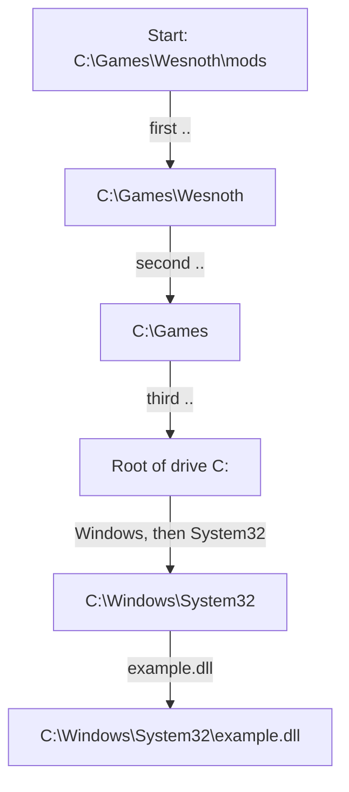
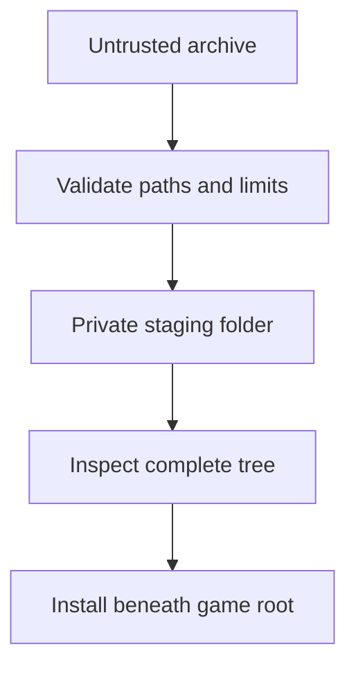
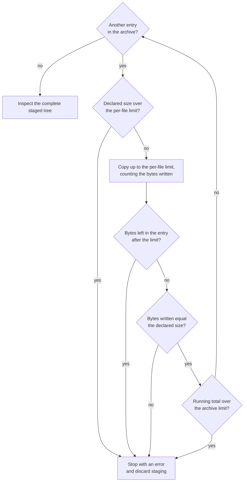

import MemoryStrip from '../../../../components/MemoryStrip.astro';

## An archive contains names, not trusted paths

A `.zip` can claim that an entry is named:

```text
textures/grass.png
```

It can also claim:

```text
../../Windows/System32/example.dll
C:\Users\Player\startup.bat
```

If an installer joins those names directly onto the chosen mod directory, `..`
or an absolute path can escape the folder. Joining is not a containment
operation — it is string concatenation with a separator, and it will happily
build a path that leads somewhere else entirely:

```text
destination:   C:\Games\Wesnoth\mods
entry name:    ..\..\..\Windows\System32\example.dll
joined:        C:\Games\Wesnoth\mods\..\..\..\Windows\System32\example.dll
resolves to:   C:\Windows\System32\example.dll
```

Look closely at what makes this dangerous. The joined path *does* begin with
the mod folder, so a check like "does this start with my destination?" passes.
The escape happens later, when the operating system resolves each `..` while
opening the file. Absolute entry names are worse still: joining an absolute
path onto a base discards the base completely, so the result is simply whatever
path the archive asked for.

Resolving the joined path one component at a time shows where it leaves the
folder:



Each `..` climbs one level, so three of them undo the three folders below the
drive root, and every component after that walks down a path the mod folder
never contained.

The safe rule is therefore simple: **every extracted file must remain beneath one destination root after validation**.

Containment is stronger than removing suspicious text. Paths can use repeated separators, mixed slash styles, drive prefixes, device names, case differences, links, or components that normalize away. Parse the path into components and accept only an explicitly safe relative form.

Also distinguish the **planned path** from the **filesystem object reached at write time**. A directory inside the destination can be replaced by a link or reparse point after validation. For a local mod installer, extract into a newly created private staging directory, reject links, avoid following reparse points, and perform final moves only after the whole staged tree passes inspection.

A safe installer treats extraction as a pipeline with a decision point before anything reaches the live game folder:



Failure at any earlier stage discards the staged copy instead of leaving a half-installed mod behind.

## Reject dangerous path components

The `zip` crate exposes `enclosed_name`, which returns only paths that stay relative and enclosed:

```rust
use std::{fs, io, path::Path};
use zip::ZipArchive;

fn extract_mod(zip_path: &Path, destination: &Path) -> anyhow::Result<()> {
    fs::create_dir_all(destination)?;
    let file = fs::File::open(zip_path)?;
    let mut archive = ZipArchive::new(file)?;

    for index in 0..archive.len() {
        let mut entry = archive.by_index(index)?;
        let relative = entry.enclosed_name()
            .ok_or_else(|| anyhow::anyhow!("unsafe archive path {:?}", entry.name()))?;
        let output = destination.join(relative);

        if entry.is_dir() {
            fs::create_dir_all(&output)?;
            continue;
        }

        let parent = output.parent()
            .ok_or_else(|| anyhow::anyhow!("entry has no destination parent"))?;
        fs::create_dir_all(parent)?;

        let mut temporary = output.clone();
        temporary.set_extension("gha-part");
        let mut writer = fs::File::create(&temporary)?;
        io::copy(&mut entry.take(64 * 1024 * 1024), &mut writer)?;
        fs::rename(temporary, output)?;
    }

    Ok(())
}
```

The size limit, 64 × 1,024 × 1,024 = 67,108,864 bytes (64 MiB), prevents one
PK3 entry from expanding forever; Urban Terror's `.pk3` asset archives are zip
files under another extension. A real Urban Terror archive tool should also verify that the copy reached the end of the
entry; otherwise an oversized file would be silently truncated. Check the
declared size before copying, then compare it with the number of bytes actually
written.

## Validate more than the path

Before extraction, set policy for:

- maximum number of entries;
- maximum size per file;
- maximum total uncompressed size;
- allowed extensions;
- duplicate output names;
- symbolic links or reparse points;
- case-insensitive name collisions on Windows;
- existing files that may be replaced.

An archive with 50,000 tiny files can cause trouble even if every path is enclosed. Limits are part of parsing.

Apply limits before and during extraction. Declared compressed and uncompressed sizes are claims from the archive; count the bytes actually written and maintain a checked running total. Stop with an error if either the declaration or the real output crosses policy.



The declared size is checked first because it costs nothing, but only the
counted bytes are trusted: an entry that declares 10 bytes and then produces
more is caught by the count, not by the declaration.

## Stage, inspect, then install

Do not unpack directly over a working game directory. Use this transaction:

1. create a new staging directory;
2. extract under strict limits;
3. parse the mod manifest;
4. hash every staged file;
5. verify allowed locations and formats;
6. show the user the planned replacements;
7. back up affected original files;
8. move the validated files into place;
9. record an uninstall manifest.

If validation fails, delete only the known staging directory. The game remains unchanged.

## Treat file extensions as hints

Renaming an executable to `grass.png` does not make it an image. For formats you understand, inspect the **magic bytes** — fixed bytes at the start of a file that identify its format — and parse headers:

```rust
fn looks_like_png(bytes: &[u8]) -> bool {
    bytes.starts_with(b"\x89PNG\r\n\x1a\n")
}
```

The escaped string in that code is eight bytes, and each one is there to catch a
particular kind of damage:

<MemoryStrip
  cells="0=89|1=50|2=4E|3=47|4=0D|5=0A|6=1A|7=0A"
  marks="0|4-7"
  groups="0-0:not ASCII|1-3:`P` `N` `G`|4-5:CR LF|6-6:DOS end of file|7-7:LF"
  caption="The PNG signature, numbered from 0. The highlighted bytes exist to detect a damaged transfer."
/>

`0x89` is 8 × 16 + 9 = 137. ASCII, the standard table of character codes, stops
at 127, so no plain text file starts with this byte, and a transfer that strips
the top bit (worth 128) from every byte turns it into 137 − 128 = 9, `0x09`,
which no longer matches. Bytes 1 to 3 are the ASCII codes for `P`, `N`, and `G`,
so the format's name is readable in a hex editor. `0D 0A` is a Windows line
ending (carriage return, line feed) and the final `0A` is a Unix one: a transfer
that converts line endings in either direction inserts or deletes a byte, so the
damage is caught before any pixels are decoded. `0x1A` is the character old DOS
tools treated as the end of a text file, which stopped them printing the binary
data after it.

Magic bytes are still not a complete security check, but they catch obvious mismatches. A real image decoder should validate dimensions and allocation limits before loading pixels.

## Test the installer with hostile fixtures

Create tiny archives in your own test suite containing:

- `../escape.txt`;
- an absolute path;
- two names differing only by letter case;
- a zero-byte file;
- a declared huge file;
- a valid nested texture;
- an interrupted temporary output.

Success means valid files land in staging and every invalid archive fails without changing the game. This is defensive engineering for a file format the program does not control. 🛡️
