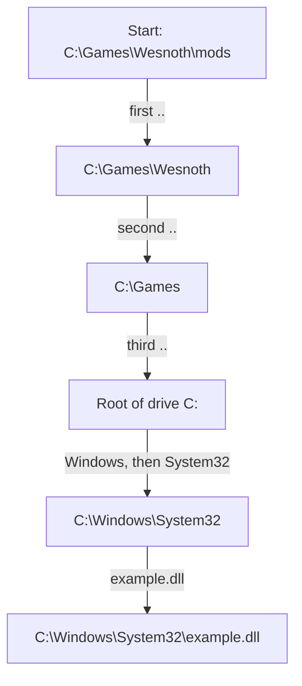
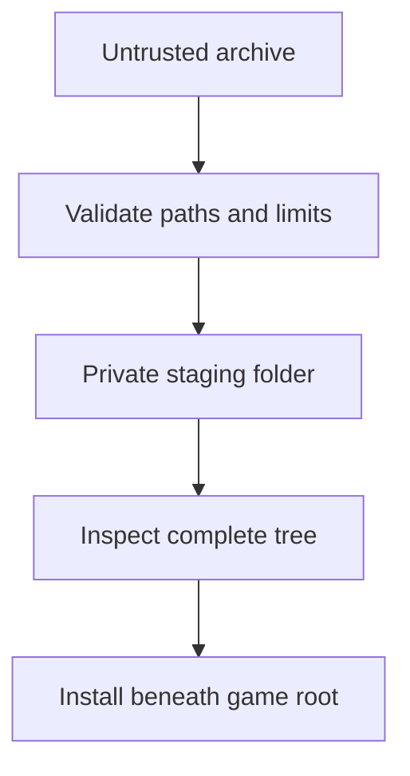
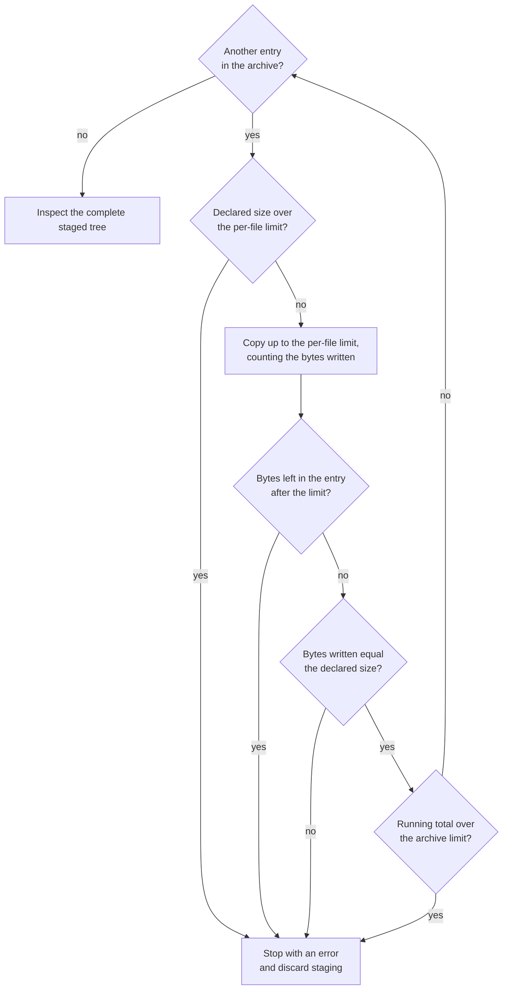

import CodeTrace from '../../../../components/CodeTrace.astro';
import Frame from '../../../../components/kit/Frame.astro';
import { Steps, SpeedType } from '../../../../components/kit';
import MemoryStrip from '../../../../components/MemoryStrip.astro';
import MarginNote from '../../../../components/kit/MarginNote.astro';

## An archive contains names, not trusted paths

The texture and unit mods in Lessons 9.4–9.5 are easy to inspect when they
remain small. To share or install many such files, we may put them in an
archive. An installer must decide where each archived name will land before
copying any bytes into the game folder.

A `.zip` can claim that an entry is named:

```text
textures/grass.png
```

It can also claim:

```text
../../Windows/System32/example.dll
C:\Users\Player\startup.bat
```

If an installer joins those names directly onto the chosen mod directory, `..`
or an absolute path can escape the folder. Joining is not a containment
operation — it is string concatenation with a separator, and it will happily
build a path that leads somewhere else entirely:

```text
destination:   C:\Games\Wesnoth\mods
entry name:    ..\..\..\Windows\System32\example.dll
joined:        C:\Games\Wesnoth\mods\..\..\..\Windows\System32\example.dll
resolves to:   C:\Windows\System32\example.dll
```

Look closely at what makes this dangerous. The joined path *does* begin with
the mod folder, so a check like "does this start with my destination?" passes.
The escape happens later, when the operating system resolves each `..` while
opening the file. Absolute entry names are worse still: joining an absolute
path onto a base discards the base completely, so the result is simply whatever
path the archive asked for.

<Frame caption="Decide the destination before writing">
  
</Frame>

Resolving the joined path one component at a time shows where it leaves the
folder:


```mermaid
flowchart TD
    A["Start: C:\Games\Wesnoth\mods"] -->|"first .."| B["C:\Games\Wesnoth"]
    B -->|"second .."| C["C:\Games"]
    C -->|"third .."| D["Root of drive C:"]
    D -->|"Windows, then System32"| E["C:\Windows\System32"]
    E -->|"example.dll"| F["C:\Windows\System32\example.dll"]
```

Each `..` climbs one level, so three of them undo the three folders below the
drive root, and every component after that walks down a path the mod folder
never contained.

The safe rule is therefore simple: **every extracted file must remain beneath one destination root after validation**.

Containment is stronger than removing suspicious text. Paths can use repeated separators, mixed slash styles, drive prefixes, device names, case differences, links, or components that normalize away. Parse the path into components and accept only an explicitly safe relative form.

Also distinguish the **planned path** from the **filesystem object reached at write time**. A directory inside the destination can be replaced by a link or reparse point after validation. For a local mod installer, extract into a newly created private staging directory, reject links, avoid following reparse points, and perform final moves only after the whole staged tree passes inspection.

A safe installer treats extraction as a pipeline with a decision point before anything reaches the live game folder:


```mermaid
flowchart TD
    A["Untrusted archive"] --> B["Validate paths and limits"]
    B --> C["Private staging folder"]
    C --> D["Inspect complete tree"]
    D --> E["Install beneath game root"]
```

Failure at any earlier stage discards the staged copy instead of leaving a half-installed mod behind.

## Reject dangerous path components

The `zip` crate exposes `enclosed_name`, which rejects names that would escape
the extraction root. The following stage function demonstrates the order of
checks on a newly created directory beneath a private parent controlled by
the installer. It never writes into the working game directory. A caller must
discard this staging directory on any error and perform the later manifest,
format, and replacement checks before installation:

```rust
use std::{fs, io::{self, Read}, path::Path};
use zip::ZipArchive;

const MAX_ENTRY: u64 = 64 * 1024 * 1024; // 64 MiB after decompression
const MAX_TOTAL: u64 = 256 * 1024 * 1024;

fn stage_mod_entries(zip_path: &Path, staging: &Path) -> anyhow::Result<()> {
    // The caller supplies a fresh name under its private staging parent.
    fs::create_dir(staging)?; // refuse an existing path
    let file = fs::File::open(zip_path)?;
    let mut archive = ZipArchive::new(file)?;
    anyhow::ensure!(archive.len() <= 4096, "too many archive entries");
    let mut total = 0_u64;

    for index in 0..archive.len() {
        let mut entry = archive.by_index(index)?;
        // ZIP names use `/`. Reject `\` so the same name cannot later be
        // interpreted as a Windows separator during installation.
        anyhow::ensure!(!entry.name().contains('\\'), "ambiguous separator");
        let relative = entry.enclosed_name()
            .ok_or_else(|| anyhow::anyhow!("unsafe archive path {:?}", entry.name()))?
            .to_path_buf();
        if let Some(mode) = entry.unix_mode() {
            let kind = mode & 0o170000;
            anyhow::ensure!(
                kind == 0 || kind == 0o040000 || kind == 0o100000,
                "archive link or special file is unsupported"
            );
        }
        let output = staging.join(relative);

        if entry.is_dir() {
            fs::create_dir_all(&output)?;
            continue;
        }

        let declared = entry.size();
        anyhow::ensure!(declared <= MAX_ENTRY, "entry is too large");
        total = total.checked_add(declared)
            .filter(|sum| *sum <= MAX_TOTAL)
            .ok_or_else(|| anyhow::anyhow!("archive is too large"))?;
        let parent = output.parent()
            .ok_or_else(|| anyhow::anyhow!("entry has no destination parent"))?;
        fs::create_dir_all(parent)?;

        // `create_new` rejects a duplicate output name or an existing link.
        let mut writer = fs::OpenOptions::new()
            .write(true).create_new(true).open(&output)?;
        // Read one byte past the limit so an oversized entry is detected,
        // not silently truncated into an apparently valid staged file.
        let written = io::copy(&mut entry.by_ref().take(MAX_ENTRY + 1), &mut writer)?;
        anyhow::ensure!(written <= MAX_ENTRY, "entry exceeds actual size limit");
        anyhow::ensure!(written == declared, "entry size differs from header");
    }

    Ok(())
}
```

The per-entry limit, 64 × 1,024 × 1,024 = 67,108,864 bytes (64 MiB), bounds
one decompressed file; Urban Terror's `.pk3` asset archives are ZIP files under
another extension. `take(MAX_ENTRY + 1)` allows one extra byte solely to
detect an oversized entry. A simple `take(MAX_ENTRY)` would silently write a
truncated file and could make the archive appear to have been extracted. The
declared size is checked before copying and compared with the actual byte
count afterward. The total cap and entry-count cap address different problems:
many individually small entries can still exhaust disk space or time.

<MarginNote kind="narration">A reader capped at the exact limit can hide excess bytes. Reading one extra byte lets the installer reject oversize output instead of accepting truncation.</MarginNote>

This stage function demonstrates bounded extraction, not the whole mod
installer. Before moving its files into the game, resolve case-insensitive
collisions on the target filesystem, validate asset formats and the manifest,
show the replacement plan, and retain originals for uninstall.


<CodeTrace trace="handoff-archive-containment" />

## Validate more than the path

Before extraction, set policy for:

- maximum number of entries;
- maximum size per file;
- maximum total uncompressed size;
- allowed extensions;
- duplicate output names;
- symbolic links or reparse points;
- case-insensitive name collisions on Windows;
- existing files that may be replaced.

An archive with 50,000 tiny files can cause trouble even if every path is enclosed. Limits are part of parsing.

Apply limits before and during extraction. Declared compressed and uncompressed sizes are claims from the archive; count the bytes actually written and maintain a checked running total. Stop with an error if either the declaration or the real output crosses policy.

<MarginNote kind="brief">Check actual output sizes as well as declared sizes, and bound the archive’s total work before installation.</MarginNote>


```mermaid
flowchart TD
    A{"Another entry<br/>in the archive?"} -->|"no"| G["Inspect the complete staged tree"]
    A -->|"yes"| B{"Declared size over<br/>the per-file limit?"}
    B -->|"yes"| X["Stop with an error<br/>and discard staging"]
    B -->|"no"| C["Copy up to the per-file limit,<br/>counting the bytes written"]
    C --> D{"Bytes left in the entry<br/>after the limit?"}
    D -->|"yes"| X
    D -->|"no"| E{"Bytes written equal<br/>the declared size?"}
    E -->|"no"| X
    E -->|"yes"| F{"Running total over<br/>the archive limit?"}
    F -->|"yes"| X
    F -->|"no"| A
```

The declared size is checked first because it costs nothing, but only the
counted bytes are trusted: an entry that declares 10 bytes and then produces
more is caught by the count, not by the declaration.

## Stage, inspect, then install

Do not unpack directly over a working game directory. Use this transaction:

<MarginNote kind="alternative">Staging is an inspection table: unpack and validate there before carrying approved files into the working game directory.</MarginNote>

<Steps>

1. create a new staging directory;
2. extract under strict limits;
3. parse the mod manifest;
4. hash every staged file;
5. verify allowed locations and formats;
6. show the user the planned replacements;
7. back up affected original files;
8. move the validated files into place;
9. record an uninstall manifest.

</Steps>

If validation fails, delete only the known staging directory. The game remains unchanged.

## Treat file extensions as hints

Renaming an executable to `grass.png` does not make it an image. For formats you understand, inspect the **magic bytes** — fixed bytes at the start of a file that identify its format — and parse headers:

<SpeedType id="png-signature-check" title="Type the PNG signature check" recall={[{"text": "looks_like_png", "hint": "Recall the name of this prefix-checking helper."}, {"text": "bytes: &[u8]", "hint": "Borrow a slice of bytes without taking ownership."}, {"text": "starts_with", "hint": "Check the beginning of the slice against the signature."}]}>

```rust
fn looks_like_png(bytes: &[u8]) -> bool {
    bytes.starts_with(b"\x89PNG\r\n\x1a\n")
}
```

</SpeedType>

The escaped string in that code is eight bytes, and each one is there to catch a
particular kind of damage:

<MemoryStrip
  cells="0=89|1=50|2=4E|3=47|4=0D|5=0A|6=1A|7=0A"
  marks="0|4-7"
  groups="0-0:not ASCII|1-3:`P` `N` `G`|4-5:CR LF|6-6:DOS end of file|7-7:LF"
  caption="The PNG signature, numbered from 0. The highlighted bytes exist to detect a damaged transfer."
/>

`0x89` is 8 × 16 + 9 = 137. ASCII, the standard table of character codes, stops
at 127, so no plain text file starts with this byte, and a transfer that strips
the top bit (worth 128) from every byte turns it into 137 − 128 = 9, `0x09`,
which no longer matches. Bytes 1 to 3 are the ASCII codes for `P`, `N`, and `G`,
so the format's name is readable in a hex editor. `0D 0A` is a Windows line
ending (carriage return, line feed) and the final `0A` is a Unix one: a transfer
that converts line endings in either direction inserts or deletes a byte, so the
damage is caught before any pixels are decoded. `0x1A` is the character old DOS
tools treated as the end of a text file, which stopped them printing the binary
data after it.

Magic bytes are still not a complete security check, but they catch obvious mismatches. A real image decoder should validate dimensions and allocation limits before loading pixels.

## Test the installer with hostile fixtures

Create tiny archives in your own test suite containing:

- `../escape.txt`;
- an absolute path;
- two names differing only by letter case;
- a zero-byte file;
- a declared huge file;
- a valid nested texture;
- an interrupted temporary output.

Success means valid files land in staging and every invalid archive fails without changing the game. This is defensive engineering for a file format the program does not control. 🛡️
