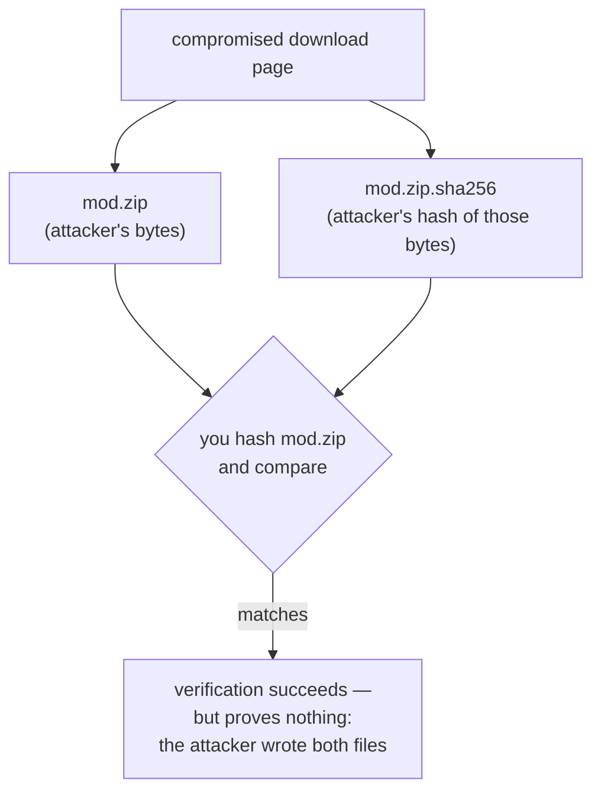
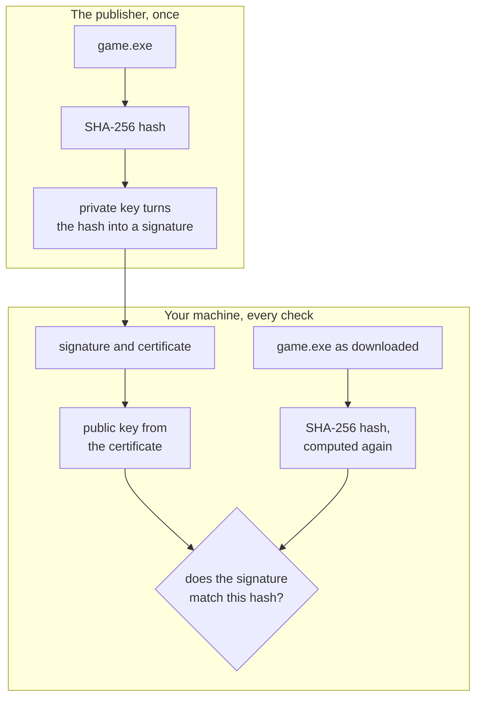
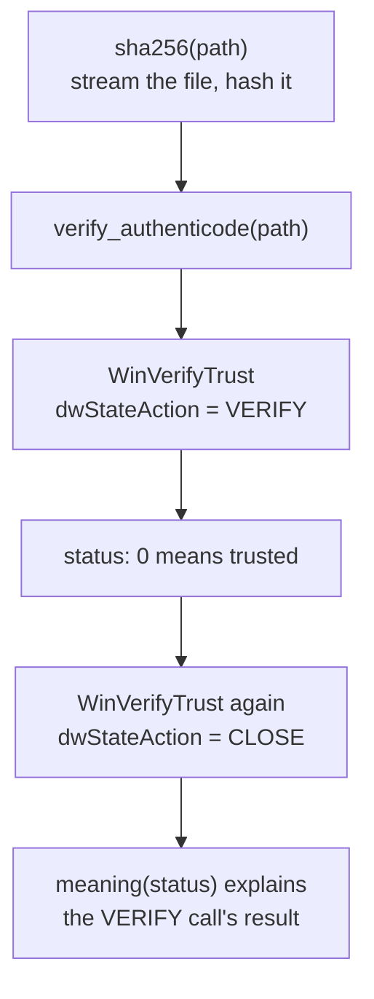

import Quiz from '../../../../components/Quiz.astro';

## A hash and a signature answer different questions

A SHA-256 hash is a fingerprint of exact bytes. Change one byte and the fingerprint should change dramatically. A saved baseline can answer:

> “Are these bytes identical to the bytes I recorded earlier?”

It cannot answer who created the original file. A hash does not create trust; it
only *moves* trust from wherever you obtained the hash onto the bytes now on
your disk.

That distinction has practical teeth. If you download `mod.zip` and
`mod.zip.sha256` from the same page, and someone is able to change that page,
they can change both — and the two will agree perfectly:



Verification reports success and has proven nothing. A hash is only worth
checking when it reached you by a route the attacker does not control: a signed
release, a genuinely separate channel, or a value you recorded yourself from a
copy you already had reason to trust.

An **Authenticode signature** connects the file's digest to a signing certificate and asks Windows to apply a trust policy. It can help answer:

> “Does this file still match a signature made by a publisher whose certificate chain Windows trusts under this policy?”

Neither answer proves that software has no bugs or that you personally intended to install this version.

### How a signature is made and checked

A **digital signature** is a number computed from a file's hash with a secret
key, which anyone can check with a matching key that is not secret. It fixes the
compromised-page problem above: an attacker who controls the page can replace
the file and the hash, but cannot produce a signature that checks out, because
they do not have the secret.

That needs **public-key cryptography**, where keys are made in pairs. The
**private key** never leaves the publisher. The **public key** is given to
everyone; for Authenticode it travels inside the publisher's certificate. The
pair has one property that makes everything work: a signature made with the
private key is accepted by the matching public key and by no other, and knowing
the public key does not let anyone work out the private one.



Walk the two ways it can fail. Change one byte of the file and your machine
computes a different hash, so the signature no longer matches it. Replace the
signature with one the attacker made using their own key pair, and it only
checks out against the attacker's public key, whose certificate Windows does
not trust.

A comparison often used for public keys is an open padlock: you hand out as many
as you like and keep the only key, so anyone can lock a box for you and only you
can open it. That picture describes encrypting a message *to* someone. A
signature runs the other way: only the private-key holder can make one, and
anyone can check it. Nothing is hidden, either; a signed file stays perfectly
readable. The signature only proves which key approved these exact bytes.

Why can nobody forge one? Real keys are numbers hundreds of digits long, chosen
so that checking a signature takes a fraction of a millisecond while making one
without the private key would take longer than the age of the universe. The same
kind of gap shows up with small numbers. Multiplying 7 × 17 = 119 is quick.
Given only 119, finding the two numbers means trying divisors: 2 fails, 3 fails,
5 fails, and 7 gives 119 ÷ 7 = 17. Checking a proposed answer is one division.
RSA, a common signature scheme, builds its keys on this gap between multiplying
and factoring, with numbers so large that the trying never finishes.

The same machinery sits behind the padlock icon in a web browser, driver
signing in [Lesson 14.2](/pages/14/02/), and a console's secure boot in
[Lesson 14.5](/pages/14/05/#secure-boot-a-chain-of-trust). Its limits are the
ones this lesson keeps returning to: a signature says who approved the bytes,
not that the bytes are safe, and if a publisher's private key is stolen, the
thief can sign anything until the certificate is revoked.

<Quiz
  id="signature-key-roles"
  title="Which key does what?"
  prompt="A publisher signs a game patch, and Windows checks the signature on your machine. Which key does each side use?"
  options="The publisher makes the signature with its private key; Windows checks it with the public key from the certificate||The publisher makes the signature with its public key; Windows checks it with the private key||Both sides use the same shared secret key||Windows needs no key, because the hash alone proves who made the file"
  answer="0"
  explanation="Only the private key can make a signature that the matching public key accepts, so it never leaves the publisher. The public key travels inside the certificate, where anyone can use it to check. If checking needed the private key, every user would hold the secret needed to sign malware."
/>

## Unsigned does not mean malicious

Many open-source game builds are unsigned, self-built, or distributed in archives without Authenticode. Wesnoth, AssaultCube, or Urban Terror files can legitimately report “no embedded signature,” depending on the exact build and distributor.

Treat the result as one fact:

| Result | Reasonable next question |
|---|---|
| Trusted signature | Does the publisher and file version match the source I expected? |
| No embedded signature | Does the official project publish hashes or reproducible release artifacts? |
| Explicitly distrusted | Why did Windows policy reject this publisher/signature? |
| Other failure | Was the file damaged, unsupported, expired, or checked under a limited classroom policy? |

## `WinVerifyTrust` returns a status code, not a `Result`

The Win32 function returns a `LONG`. Microsoft says only exact zero means the requested trust action succeeded. Do not use HRESULT-style “success if nonnegative” logic.

```diff
 fn explain_trust(status: i32) {
-    if status >= 0 { println!("trusted"); }
+    if status == 0 { println!("trusted"); }
     else { println!("trust check failed with status {status:#010x}"); }
 }
```

Known nonzero values help us print plain-English explanations. Unknown statuses remain failures and are printed in hexadecimal for investigation.

## Trust verification has state and policy choices

`WINTRUST_FILE_INFO` points to the file path. `WINTRUST_DATA` describes how the trust provider should work:

- `WTD_UI_NONE` prevents pop-up dialogs;
- `WTD_CHOICE_FILE` selects the file-info union member;
- `WTD_STATEACTION_VERIFY` begins verification and may create provider state;
- `WTD_STATEACTION_CLOSE` releases that state afterward;
- `WTD_DISABLE_MD2_MD4` refuses two obsolete digest algorithms;
- `WTD_REVOKE_NONE` skips revocation checking in this offline classroom run;
- `WTD_CACHE_ONLY_URL_RETRIEVAL` avoids network retrieval in this reproducible lab.

Those last two choices have a tradeoff: the result does not include a fresh revocation check. A release pipeline with network access should define and test a stricter revocation policy instead of treating this offline classroom result as the final word.

## Build the combined inspector

`run` calls these in order; `WinVerifyTrust` itself is called twice, once to verify and once to release the state the first call created:



<details class="lab-source">
<summary>Complete lab source: signature_check.rs</summary>

```rust
#[cfg(windows)]
mod app {
    use std::{
        ffi::OsStr,
        fs::File,
        io::Read,
        mem::size_of,
        os::windows::ffi::OsStrExt,
        path::{Path, PathBuf},
    };

    use anyhow::Context;
    use sha2::{Digest, Sha256};
    use windows::{
        Win32::{
            Foundation::{
                HANDLE, HWND, TRUST_E_EXPLICIT_DISTRUST, TRUST_E_NOSIGNATURE,
                TRUST_E_PROVIDER_UNKNOWN, TRUST_E_SUBJECT_FORM_UNKNOWN,
                TRUST_E_SUBJECT_NOT_TRUSTED,
            },
            Security::WinTrust::{
                WINTRUST_ACTION_GENERIC_VERIFY_V2, WINTRUST_DATA,
                WINTRUST_DATA_0, WINTRUST_FILE_INFO,
                WTD_CACHE_ONLY_URL_RETRIEVAL, WTD_CHOICE_FILE,
                WTD_DISABLE_MD2_MD4, WTD_REVOKE_NONE,
                WTD_STATEACTION_CLOSE, WTD_STATEACTION_VERIFY,
                WTD_UI_NONE, WTD_UICONTEXT_EXECUTE, WinVerifyTrust,
            },
        },
        core::PCWSTR,
    };

    fn sha256(path: &Path) -> anyhow::Result<String> {
        let mut file = File::open(path)?;
        let mut hasher = Sha256::new();
        let mut buffer = [0_u8; 64 * 1_024];
        loop {
            let count = file.read(&mut buffer)?;
            if count == 0 {
                break;
            }
            hasher.update(&buffer[..count]);
        }
        Ok(format!("{:x}", hasher.finalize()))
    }

    fn verify_authenticode(path: &Path) -> i32 {
        let wide_path: Vec<u16> = OsStr::new(path)
            .encode_wide()
            .chain(std::iter::once(0))
            .collect();
        let mut file_info = WINTRUST_FILE_INFO {
            cbStruct: size_of::<WINTRUST_FILE_INFO>() as u32,
            pcwszFilePath: PCWSTR(wide_path.as_ptr()),
            hFile: HANDLE::default(),
            pgKnownSubject: std::ptr::null_mut(),
        };
        let mut trust_data = WINTRUST_DATA {
            cbStruct: size_of::<WINTRUST_DATA>() as u32,
            dwUIChoice: WTD_UI_NONE,
            fdwRevocationChecks: WTD_REVOKE_NONE,
            dwUnionChoice: WTD_CHOICE_FILE,
            Anonymous: WINTRUST_DATA_0 { pFile: &mut file_info },
            dwStateAction: WTD_STATEACTION_VERIFY,
            dwProvFlags: WTD_CACHE_ONLY_URL_RETRIEVAL | WTD_DISABLE_MD2_MD4,
            dwUIContext: WTD_UICONTEXT_EXECUTE,
            ..Default::default()
        };
        let mut action = WINTRUST_ACTION_GENERIC_VERIFY_V2;

        // SAFETY: both structures contain valid sizes and pointers that remain
        // alive through the call. UI is disabled and the file path is terminated.
        let status = unsafe {
            WinVerifyTrust(
                HWND::default(),
                &mut action,
                (&mut trust_data as *mut WINTRUST_DATA).cast(),
            )
        };

        trust_data.dwStateAction = WTD_STATEACTION_CLOSE;
        // SAFETY: closes provider state created by the verification call. The
        // same live structures and action identifier are supplied once more.
        let _ = unsafe {
            WinVerifyTrust(
                HWND::default(),
                &mut action,
                (&mut trust_data as *mut WINTRUST_DATA).cast(),
            )
        };
        status
    }

    fn meaning(status: i32) -> &'static str {
        if status == 0 {
            "trusted Authenticode signature"
        } else if status == TRUST_E_NOSIGNATURE.0 {
            "no embedded signature was found"
        } else if status == TRUST_E_EXPLICIT_DISTRUST.0 {
            "the publisher or signature is explicitly distrusted"
        } else if status == TRUST_E_SUBJECT_NOT_TRUSTED.0 {
            "the trust policy rejected the file"
        } else if status == TRUST_E_PROVIDER_UNKNOWN.0 {
            "Windows has no matching trust provider"
        } else if status == TRUST_E_SUBJECT_FORM_UNKNOWN.0 {
            "the provider does not understand this file form"
        } else {
            "verification failed with another trust-provider status"
        }
    }

    pub fn run() -> anyhow::Result<()> {
        let path = std::env::args_os().nth(1).map(PathBuf::from)
            .context("usage: signature_check <game.exe-or-dll>")?;
        anyhow::ensure!(path.is_file(), "{} is not a file", path.display());

        let hash = sha256(&path)
            .with_context(|| format!("could not hash {}", path.display()))?;
        let status = verify_authenticode(&path);
        println!("File:   {}", path.display());
        println!("SHA-256: {hash}");
        println!("Trust:  {} (status {:#010x})", meaning(status), status as u32);
        println!("The cache-only check did not modify the file.");
        Ok(())
    }
}

#[cfg(windows)]
fn main() -> anyhow::Result<()> {
    app::run()
}

#[cfg(not(windows))]
fn main() {
    eprintln!("This Authenticode lab must run on Windows.");
}
```

</details>

## Why keep the wide path alive?

`PCWSTR` is only a pointer. It does not own the UTF-16 vector. `wide_path`, `file_info`, and `trust_data` all remain local variables until both `WinVerifyTrust` calls finish, so every pointer stays valid.

This is why the unsafe comment names lifetimes instead of saying only “Windows API call.” A useful safety comment explains the exact facts the compiler cannot verify.

## Check your installations

```powershell
cd windows-labs
cargo build --release --target i686-pc-windows-msvc --bin signature_check

.\target\i686-pc-windows-msvc\release\signature_check.exe `
  "C:\Games\Wesnoth\wesnoth.exe"

.\target\i686-pc-windows-msvc\release\signature_check.exe `
  "C:\Games\AssaultCube\bin_win32\ac_client.exe"

.\target\i686-pc-windows-msvc\release\signature_check.exe `
  "C:\Games\UrbanTerror\Quake3-UrT.exe"
```

A SHA-256 value belongs to one exact file, so it means something only next to the game version and download source it came from. Re-run the tool after installing a mod or update: every file that changed gets a new hash, which is expected for the files the mod or update replaced and unexplained for any other.

Some Windows components are signed through catalogs rather than an embedded
signature. This lab checks the embedded signature on the selected game EXE. If
you expand it to inventory every DLL loaded beside the game, add explicit
catalog-signature handling instead of reporting those files as simply unsigned.

Combine this lesson with `module_inventory`: inventory tells you what actually loaded, the hash identifies exact bytes, and Authenticode adds one publisher-trust signal.

The buildable source is [`signature_check.rs`](/windows-labs/src/bin/signature_check.rs).

References: [`WinVerifyTrust`](https://learn.microsoft.com/en-us/windows/win32/api/wintrust/nf-wintrust-winverifytrust), [`WINTRUST_DATA`](https://learn.microsoft.com/en-us/windows/win32/api/wintrust/ns-wintrust-wintrust_data), [`WINTRUST_FILE_INFO`](https://learn.microsoft.com/en-us/windows/win32/api/wintrust/ns-wintrust-wintrust_file_info), and [Authenticode time stamping](https://learn.microsoft.com/en-us/windows/win32/seccrypto/time-stamping-authenticode-signatures).
