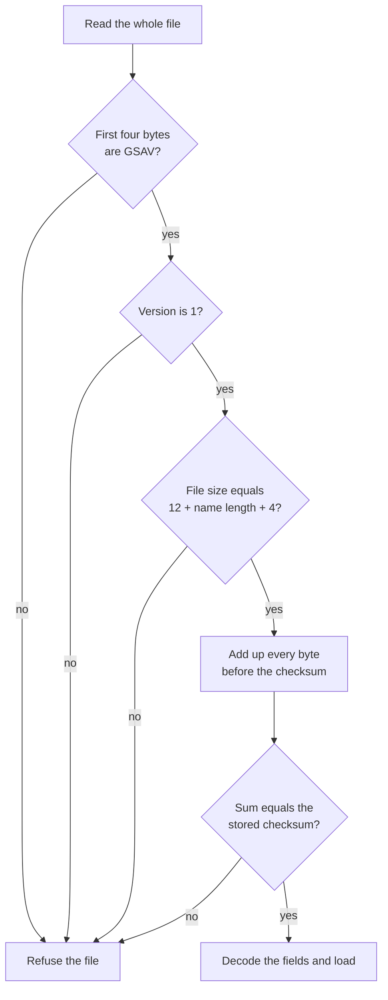

import MemoryStrip from '../../../../components/MemoryStrip.astro';
import Quiz from '../../../../components/Quiz.astro';

## A binary save is not text

[Lesson 9.2](/pages/9/02/) edited a save written as text: `build=5,1,1,2` is
readable in any editor. Many saves are not. They store numbers as raw bytes, the
same way a `u32` sits in memory, because that is smaller and faster to load.
Open one in a text editor and most bytes turn into boxes, blanks, or stray
symbols. Worse, saving it from a text editor can quietly change bytes, for
example by converting line endings, which corrupts the file.

A **hex editor** shows a file as what it is: a numbered sequence of bytes, each
written as two hexadecimal digits. It never converts anything when it saves.
HxD and ImHex are common examples; they show the same three columns, so nothing
in this lesson depends on which one you use.

This lesson uses a toy save format made for the book, `GSAV`, and a Rust lab
that reads and writes it. Here is the complete save for a character called Ada,
at level 3, with 250 gold. It is 19 bytes long:

```text
47 53 41 56 01 00 FA 00 00 00 03 03 41 64 61 38 03 00 00
```

Everything here applies to offline, single-player saves. A value kept on a
game's server is not in any file on your disk.

## The three columns of a hex editor

Opened in a hex editor, those 19 bytes look like this:

```text
Offset    00 01 02 03 04 05 06 07 08 09 0A 0B 0C 0D 0E 0F  Text
00000000  47 53 41 56 01 00 FA 00 00 00 03 03 41 64 61 38  GSAV........Ada8
00000010  03 00 00                                         ...
```

- The **offset column** on the left gives the position of the first byte on each
  row, counted in hex from the start of the file. A row holds 16 bytes, numbered
  `00` to `0F` along the top, so the second row starts at byte 16, which is
  `0x10` (1 × 16 + 0).
- The **byte column** in the middle shows each byte as two hex digits. To find
  the offset of any byte, add its row offset and its column number: the last
  byte sits on row `00000010` in column `02`, so its offset is
  0x10 + 0x02 = `0x12`, which is 16 + 2 = 18.
- The **character column** on the right shows each byte as a character.
  **ASCII** is the standard table that gives every English letter, digit, and
  common symbol a number from 0 to 127. Bytes from `0x20` (a space) to `0x7E`
  (`~`) are printable ASCII and appear as themselves; every other byte appears
  as a dot.

The character column is where text stands out: `GSAV` at the start and `Ada` in
the middle. It also shows things that are not text. The byte at `0x0F` is `38`,
which is 3 × 16 + 8 = 56, the ASCII code for the digit `8`, so the column shows
an `8` even though that byte is part of a number. Nothing in the file marks
which bytes are meant as text, so the editor shows every byte both ways.

Each byte belongs to one field of the format. A strip of 16 boxes is one row:

<MemoryStrip
  cells="0x00=47|0x01=53|0x02=41|0x03=56|0x04=01|0x05=00|0x06=FA|0x07=00|0x08=00|0x09=00|0x0A=03|0x0B=03|0x0C=41|0x0D=64|0x0E=61|0x0F=38"
  groups="0-3:magic `GSAV`|4-5:version|6-9:gold|10-11:level, length|12-14:name `Ada`|15-15:sum"
  caption="Row `00000000`: sixteen bytes and the fields they belong to. Byte `0x0A` is the level and `0x0B` the name's length. The checksum starts at `0x0F` and runs on into the next row."
/>

<MemoryStrip
  cells="0x10=03|0x11=00|0x12=00"
  groups="0-2:rest of the checksum"
  caption="Row `00000010`: the last three bytes. The checksum starts at `0x0F` on the first row and ends here, so one field can straddle two rows."
/>

The full layout, with offsets in hex and in decimal:

| Offset | Size in bytes | Field | Bytes in Ada's save |
|---|---:|---|---|
| `0x00` (0) | 4 | magic number | `47 53 41 56` |
| `0x04` (4) | 2 | version, `u16` | `01 00` |
| `0x06` (6) | 4 | gold, `u32` | `FA 00 00 00` |
| `0x0A` (10) | 1 | level, `u8` | `03` |
| `0x0B` (11) | 1 | name length, `u8` | `03` |
| `0x0C` (12) | as many as the length says | name | `41 64 61` |
| right after the name | 4 | checksum, `u32` | `38 03 00 00` |

The sections below read each field in turn.

## A file offset is not a memory address

An offset in a file is a distance in bytes from the file's first byte: offset
`0x06` means “skip six bytes, then read.” It is not a memory address. When the
game loads this save, it reads the bytes and copies each field into its own
structures somewhere in its memory, so the gold that sat at file offset 6 ends
up at an address that has nothing to do with 6 and usually changes from one run
to the next. Two things follow:

- Changing byte 6 on disk does not change a running game. The game sees the new
  value only when it loads the file again, and a game that is still running can
  overwrite the edit when it saves on exit, so close it first.
- An address found with a memory scanner cannot be typed into a hex editor's
  “go to offset” box, or the other way round. [Lesson 7.1](/pages/7/01/) met the
  same split for executables, where the section table translates between file
  offsets and addresses.

## The magic number and the version say what the file is

The first four bytes, `47 53 41 56`, are ASCII codes. In decimal they are
4 × 16 + 7 = 71 (`G`), 5 × 16 + 3 = 83 (`S`), 4 × 16 + 1 = 65 (`A`), and
5 × 16 + 6 = 86 (`V`). A fixed byte pattern at the start of a file that
identifies its format is called a **magic number**. The loader checks it before
anything else: a file that does not begin with `GSAV` is some other kind of
file, and reading its bytes as gold and levels would produce nonsense. It is the
same idea as the PNG signature in [Lesson 9.5](/pages/9/05/), and it is why
renaming a file does not change what the file is.

The next two bytes, `01 00`, are the **version**: a number the game's developers
raise whenever they change the layout. A loader reads the version to choose the
right layout, and an editor that meets a version it does not know has to refuse
the file, because the fields may have moved. The lab returns an
`UnsupportedVersion` error for anything other than 1.

## Multi-byte numbers are stored lowest byte first

Games for x86 PCs usually write numbers to disk exactly as they sit in memory,
which is little endian: the byte worth the least comes first. [Lesson
1.3](/pages/1/03/#byte-order-and-why-hex-dumps-look-backwards) explains why
each box is worth 256 times the one before it. Gold occupies offsets 6 to 9:

<MemoryStrip
  cells="0x06=FA|0x07=00|0x08=00|0x09=00"
  groups="0-0:× 1|1-1:× 256|2-2:× 65,536|3-3:× 16,777,216"
  groups2="0-3:0xFA is 15 × 16 + 10 = 250, and every other byte is 0"
  caption="The gold field. Read lowest byte first, `FA 00 00 00` is 250."
/>

The version works the same way with two bytes: `01 00` is 1 × 1 + 0 × 256 = 1.
The level at offset 10 is a single byte, `03`, so there is no order to get
wrong: it is 3.

Reading in the wrong order gives a number that is obviously off, which makes a
useful check. `FA 00 00 00` read with the most significant byte first is
`0xFA000000`, which is 250 × 16,777,216 = 4,194,304,000 gold. When one byte
order gives a plausible value and the other gives billions, the plausible one is
almost always the right one.

## A length-prefixed string

A name has no fixed size, so this format stores its length first. The byte at
offset 11 (`0x0B`) is `03`, so exactly 3 bytes of text follow, at offsets 12,
13, and 14. Text stored this way is a **length-prefixed string**.

<MemoryStrip
  cells="0x0B=03|0x0C=41|0x0D=64|0x0E=61"
  groups="0-0:length: 3|1-3:`A` `d` `a`"
  groups2="1-3:4 × 16 + 1 = 65, 6 × 16 + 4 = 100, 6 × 16 + 1 = 97"
  caption="The length byte says how many bytes of text follow. There is no end marker."
/>

This layout has two consequences:

- Everything after the name moves when the name's length changes. With `Ada`,
  the checksum starts at 12 + 3 = 15. With a five-letter name such as `Grace`,
  it starts at 12 + 5 = 17, and the file grows to 17 + 4 = 21 bytes. A tool that
  assumes the checksum always sits at offset 15 breaks on the first longer name.
- The length byte has to be checked against the file before it is trusted. A
  damaged save whose length byte reads `C8`, which is 12 × 16 + 8 = 200, claims
  a name that runs up to offset 12 + 200 = 212, far past the end of a 19-byte
  file. The lab compares 12 + length + 4 with the real file size and returns an
  error instead of reading past the end.

Other formats mark the end of a string instead, most often with a `00` byte
after the text, the convention C uses. In an unfamiliar save, a byte just
before some text that equals the number of characters after it is the
fingerprint of a length-prefixed string.

<Quiz
  id="gsav-checksum-offset"
  title="Follow the length byte"
  prompt="A `GSAV` save has `05` in its name-length byte at offset 11. At which offset does its checksum start?"
  options="17||15||5||21"
  answer="0"
  explanation="The fixed fields fill offsets 0 to 11, which is 12 bytes. The name takes the next 5 bytes, offsets 12 to 16, so the checksum starts at 12 + 5 = 17 and the file ends at 17 + 4 = 21 bytes."
/>

## Find a field by comparing two saves

The layout above was handed to you. A real game's layout usually is not, so its
fields are found by comparison, the byte-level version of Lesson 9.2's two-save
diff: save once, change exactly one value in the game, save again, and compare
the two files. Most hex editors have a compare view that highlights the bytes
that differ.

Suppose Ada earns 1,000 gold, taking her from 250 to 1,250, and nothing else
changes. Offsets `0x00` to `0x05` are identical in both saves, so the strips
start at `0x06`:

<MemoryStrip
  cells="0x06=FA|0x07=00|0x08=00|0x09=00|0x0A=03|0x0B=03|0x0C=41|0x0D=64|0x0E=61|0x0F=38|0x10=03|0x11=00|0x12=00"
  marks="0-1|9"
  caption="Save A, with 250 gold."
/>

<MemoryStrip
  cells="0x06=E2|0x07=04|0x08=00|0x09=00|0x0A=03|0x0B=03|0x0C=41|0x0D=64|0x0E=61|0x0F=24|0x10=03|0x11=00|0x12=00"
  marks="0-1|9"
  groups="0-3:gold|9-12:checksum"
  caption="Save B, with 1,250 gold. Exactly three bytes differ: `0x06`, `0x07`, and `0x0F`."
/>

Offsets 6 and 7 changed from `FA 00` to `E2 04`. `0xE2` is 14 × 16 + 2 = 226,
so reading lowest byte first gives 226 + 4 × 256 = 226 + 1,024 = 1,250: the new
gold. Gold therefore starts at offset 6. Offsets 8 and 9 hold `00` in both
saves, so they could be the upper half of a 4-byte gold field or something
unrelated that happens to be zero. Two bytes can hold at most
256 × 256 − 1 = 65,535, so a third save with more gold than that settles it: if
byte 8 changes, the field is wider than two bytes.

Offset `0x0F` changed as well, from `38` to `24`, although nothing else in the
game changed. A byte that changes whenever any other value changes is the mark
of a checksum, the subject of the next section.

In a real game the diff also catches bytes that change on their own, such as
play time, a timestamp, or a random seed. Lesson 9.2 separates those by
repeating the comparison with several values; the real field follows the
in-game number every time.

## Why one edited byte breaks the save

The last four bytes are a **checksum**: a number computed from the other bytes
and stored beside them, so the loader can detect damage. This format uses the
simplest checksum there is. It adds up every byte from offset 0 to the byte
just before the checksum and stores the total as a little-endian `u32`. For
Ada's save, bytes 0 to 14 add up like this:

```text
magic    47 53 41 56   71 + 83 + 65 + 86  = 305   total 305
version  01 00         1 + 0              =   1   total 306
gold     FA 00 00 00   250 + 0 + 0 + 0    = 250   total 556
level    03            3                  =   3   total 559
length   03            3                  =   3   total 562
name     41 64 61      65 + 100 + 97      = 262   total 824
```

The stored checksum is the same number:

<MemoryStrip
  cells="0x0F=38|0x10=03|0x11=00|0x12=00"
  groups="0-0:× 1|1-1:× 256|2-2:× 65,536|3-3:× 16,777,216"
  groups2="0-3:0x38 is 3 × 16 + 8 = 56, and 56 + 3 × 256 = 824"
  caption="The stored checksum, lowest byte first: 824, which is `0x338` because 824 = 3 × 256 + 56."
/>

The loader repeats that sum every time it opens the file:



Now type gold over as 9,999 and change nothing else. 9,999 is 39 × 256 + 15,
and 39 = 2 × 16 + 7 = `0x27` while 15 = `0x0F`, so 9,999 is `0x270F` and its
little-endian bytes are `0F 27 00 00`. The old gold bytes added 250 to the sum;
the new ones add 15 + 39 = 54. The loader's total becomes 824 − 250 + 54 = 628,
the stored checksum still says 824, and the loader refuses the save as corrupt.

The fix is to do what the game does when it saves: recompute the checksum. For
1,250 gold, the gold bytes `E2 04 00 00` add 226 + 4 = 230 instead of 250, so
the total is 824 − 250 + 230 = 804. That is 3 × 256 + 36, and 36 = 2 × 16 + 4 =
`0x24`, so the checksum is `0x324`, stored as `24 03 00 00`: exactly what save B
contained. The complete edited file is:

```text
47 53 41 56 01 00 E2 04 00 00 03 03 41 64 61 24 03 00 00
```

A plain sum has a blind spot: adding numbers in a different order gives the same
total, so swapping two bytes goes unnoticed. That is why real formats more often
use a CRC-32, a 32-bit checksum designed to change when bytes are reordered, or
a hash. The editing procedure stays the same: work out which bytes are covered,
which algorithm runs, where the result is stored, and in which byte order, as
listed in [Lesson 9.2](/pages/9/02/#checksums-and-integrity-fields). If the
check uses a secret key, as a MAC does, or a digital signature, it cannot be
recomputed without that key; [Lesson 9.8](/pages/9/08/) explains why.

<Quiz
  id="gsav-level-byte-sum"
  title="Predict the loader's sum"
  prompt="Ada's save is valid, with stored checksum 824. You change only the level byte at offset 10 from `03` to `04`. What sum does the loader compute, and what happens?"
  options="825, so it refuses the save||824, so it accepts the save||828, so it refuses the save||4, because only the level byte is summed"
  answer="0"
  explanation="The level byte used to add 3 and now adds 4, so the total rises by one: 824 − 3 + 4 = 825. The stored checksum still says 824, so the file is refused until the checksum bytes are rewritten as `39 03 00 00`, because 825 = 3 × 256 + 57 and 57 = 3 × 16 + 9 = 0x39."
/>

## Edit without losing the original

A hex editor writes straight back to the file it opened, so a few mechanical
details decide whether an edit can be undone:

- Keep an untouched copy of the save before the first edit, and keep it until
  the game has loaded the edited save and saved it again. A wrong byte is only
  undone by that copy.
- Type over bytes; do not insert them. Hex editors have an **overwrite** mode,
  which replaces bytes in place, and an **insert** mode, which adds bytes and
  pushes everything after them along. In a fixed layout, one inserted byte moves
  every later field: the loader then reads the checksum from the wrong place and
  finds the file one byte too long. Changing gold overwrites exactly four bytes.
- A longer name is the one edit that must insert bytes. Renaming Ada to Grace
  means inserting two bytes, changing the length byte from `03` to `05`, and
  recomputing the checksum at its new offset, 17. Getting any one of the three
  wrong makes the loader refuse the file.
- A program that edits saves should write the result to a temporary file and
  then replace the original in one step, as in [Lesson
  9.2](/pages/9/02/#write-atomically), so a crash mid-write cannot leave half a
  save.

## When a hex editor cannot help

Everything above depends on each field being stored as plain bytes at a known
place. Two common designs break that assumption:

- A **compressed** save stores an encoded form of the data. gzip, a common
  compression format, starts its files with `1F 8B`, the same bytes Lesson 6.2
  found at the start of Wesnoth's network payloads. The gold field is not
  anywhere in the file as plain bytes, and changing one compressed byte changes
  how everything after it decompresses; gzip's own CRC-32 at the end of the
  stream then fails. The file has to be decompressed, edited, and compressed
  again with a tool that understands the format.
- An **encrypted** save looks like random bytes: no readable text in the
  character column, and every value from `00` to `FF` appearing about equally
  often. Changing the encrypted bytes, the **ciphertext**, changes what they
  decrypt to in ways nobody can choose, and authenticated encryption, covered in
  [Lesson 9.8](/pages/9/08/), refuses the altered file outright. Without the key
  there is nothing to edit.

The two-save comparison tells these cases apart quickly. A plain format changes
a handful of bytes, as it did above; a compressed file, or one encrypted afresh
on every save, changes almost everything from the first difference onward. If
the save turns out to be text after all, Lesson 9.2's key/value editing is
simpler than any hex edit.

## The lab

[`hex_save_lab.rs`](/rust-labs/src/bin/hex_save_lab.rs) implements the `GSAV`
format in portable safe Rust:

- every offset is a named constant, such as `GOLD_OFFSET` (6) and
  `NAME_LENGTH_OFFSET` (11), so no bare numbers are scattered through the code;
- `parse` checks, in the loader's order, that the file is long enough, the magic
  is `GSAV`, the version is 1, the length byte agrees with the file size, and
  the stored checksum equals the recomputed sum, and it returns a distinct
  `SaveError` for each failure, such as `BadMagic`, `TooShort`, or
  `ChecksumMismatch`, instead of panicking;
- `patch_gold` overwrites the four gold bytes in a copy and then recomputes the
  checksum, while `patch_gold_without_checksum` makes the broken edit so its
  rejection can be seen;
- `patch_gold` runs `parse` on the original first, because recomputing the
  checksum of an already damaged save would give the damage a valid checksum;
- `hex_dump` prints bytes in the three-column layout above, and
  `differing_offsets` is the compare view.

Its tests pin every number in this lesson: the sum 824, the recomputed 804, the
rejected 628, the differing offsets 6, 7, and 15, and the checksum's move to
offset 17 for a five-letter name. Build and run it with:

```text
cargo run --manifest-path rust-labs/Cargo.toml --bin hex_save_lab
cargo test --manifest-path rust-labs/Cargo.toml --bin hex_save_lab
```
